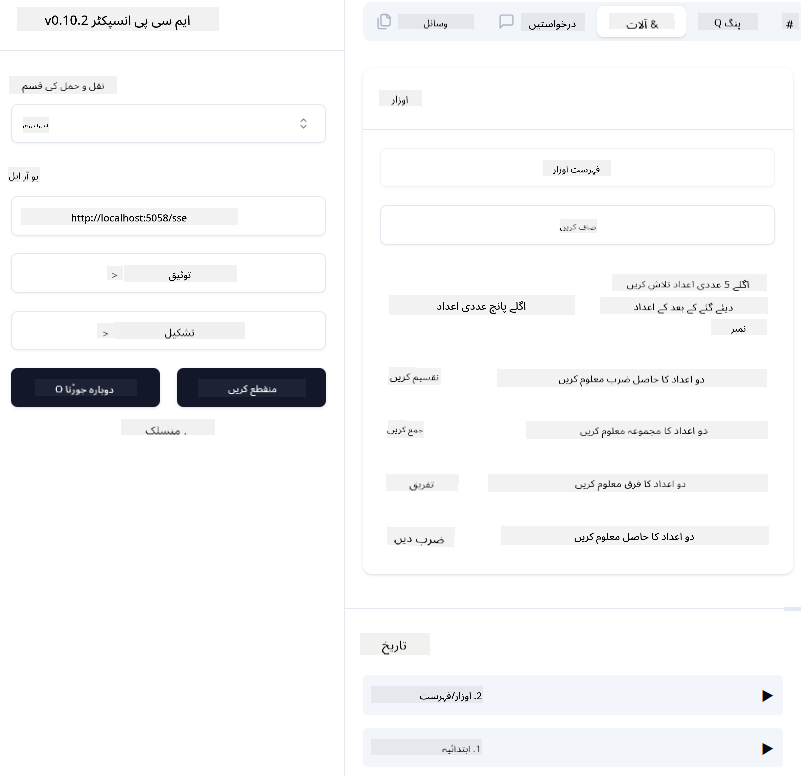
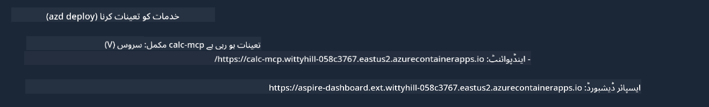

<!--
CO_OP_TRANSLATOR_METADATA:
{
  "original_hash": "5020a3e1a1c7f30c00f9e37f1fa208e3",
  "translation_date": "2025-05-17T14:05:40+00:00",
  "source_file": "04-PracticalImplementation/samples/csharp/README.md",
  "language_code": "ur"
}
-->
پچھلی مثال میں دکھایا گیا ہے کہ کس طرح مقامی .NET پروجیکٹ کو `sdio` ٹائپ کے ساتھ استعمال کیا جا سکتا ہے۔ اور کس طرح سرور کو مقامی طور پر ایک کنٹینر میں چلایا جا سکتا ہے۔ یہ بہت سے حالات میں ایک اچھی حل ہے۔ تاہم، یہ فائدہ مند ہو سکتا ہے کہ سرور کو دور سے چلایا جائے، جیسے کہ کلاؤڈ ماحول میں۔ یہاں پر `http` ٹائپ کا استعمال ہوتا ہے۔

`04-PracticalImplementation` فولڈر میں موجود حل کو دیکھتے ہوئے، یہ پہلے والے سے زیادہ پیچیدہ نظر آ سکتا ہے۔ لیکن حقیقت میں، ایسا نہیں ہے۔ اگر آپ پروجیکٹ `src/mcpserver/mcpserver.csproj` کو قریب سے دیکھیں، تو آپ دیکھیں گے کہ یہ زیادہ تر وہی کوڈ ہے جو پہلے کی مثال میں تھا۔ صرف فرق یہ ہے کہ ہم HTTP درخواستوں کو سنبھالنے کے لئے ایک مختلف لائبریری `ModelContextProtocol.AspNetCore` استعمال کر رہے ہیں۔ اور ہم نے طریقہ `IsPrime` کو نجی بنانے کے لئے تبدیل کیا ہے، صرف یہ دکھانے کے لئے کہ آپ اپنے کوڈ میں نجی طریقے رکھ سکتے ہیں۔ باقی کوڈ پہلے کی طرح ہی ہے۔

دوسرے پروجیکٹ [.NET Aspire](https://learn.microsoft.com/dotnet/aspire/get-started/aspire-overview) سے ہیں۔ حل میں .NET Aspire کا ہونا ڈیولپر کے تجربے کو بہتر بنائے گا جب وہ ترقی اور جانچ کر رہے ہوں گے اور مشاہدے میں مدد کرے گا۔ سرور کو چلانے کے لئے ضروری نہیں ہے، لیکن اسے اپنے حل میں شامل کرنا ایک اچھا عمل ہے۔

## سرور کو مقامی طور پر شروع کریں

1. وی ایس کوڈ سے (C# DevKit ایکسٹینشن کے ساتھ)، حل `04-PracticalImplementation\samples\csharp\src\Calculator-chap4.sln` کھولیں۔
2. سرور کو شروع کرنے کے لئے `F5` دبائیں۔ یہ .NET Aspire ڈیش بورڈ کے ساتھ ایک ویب براؤزر شروع کرنا چاہئے۔

یا

1. ٹرمینل سے، فولڈر `04-PracticalImplementation\samples\csharp\src` میں جائیں۔
2. سرور کو شروع کرنے کے لئے درج ذیل کمانڈ چلائیں:
   ```bash
    dotnet run --project .\AppHost
   ```

3. ڈیش بورڈ سے، `http` یو آر ایل نوٹ کریں۔ یہ کچھ اس طرح ہونا چاہئے `http://localhost:5058/`.

## Test `SSE` ModelContext Protocol Inspector کے ساتھ

اگر آپ کے پاس Node.js 22.7.5 یا اس سے زیادہ ہے، تو آپ اپنے سرور کو جانچنے کے لئے ModelContext Protocol Inspector استعمال کر سکتے ہیں۔

سرور کو شروع کریں اور ٹرمینل میں درج ذیل کمانڈ چلائیں:

```bash
npx @modelcontextprotocol/inspector@latest
```



- `SSE` as the Transport type. SSE stand for Server-Sent Events. 
- In the Url field, enter the URL of the server noted earlier,and append `/sse` منتخب کریں۔ یہ `http` ہونا چاہئے (نہ کہ `https`) something like `http://localhost:5058/sse`.
- select the Connect button.

A nice thing about the Inspector is that it provide a nice visibility on what is happening.

- Try listing the availables tools
- Try some of them, it should works just like before.


## Test `SSE` with Github Copilot Chat in VS Code

To use the `SSE` transport with Github Copilot Chat, change the configuration of the `mcp-calc` سرور جو پہلے بنایا گیا تھا ایسا نظر آنا چاہئے:

```json
"mcp-calc": {
    "type": "sse",
    "url": "http://localhost:5058/sse"
}
```

کچھ ٹیسٹ کریں:
- 6780 کے بعد 3 عدد اول کی درخواست کریں۔ نوٹ کریں کہ Copilot نئے ٹولز `NextFivePrimeNumbers` کا استعمال کرے گا اور صرف پہلے 3 عدد اول واپس کرے گا۔
- 111 کے بعد 7 عدد اول کی درخواست کریں، دیکھنے کے لئے کہ کیا ہوتا ہے۔

# سرور کو Azure پر تعینات کریں

آئیے سرور کو Azure پر تعینات کریں تاکہ زیادہ لوگ اسے استعمال کر سکیں۔

ٹرمینل سے، فولڈر `04-PracticalImplementation\samples\csharp\src` میں جائیں اور درج ذیل کمانڈ چلائیں:

```bash
azd init
```

یہ Azure وسائل کی تشکیل کو محفوظ کرنے کے لئے کچھ فائلیں مقامی طور پر بنائے گا، اور آپ کا Infrastructure as code (IaC)۔

پھر، سرور کو Azure پر تعینات کرنے کے لئے درج ذیل کمانڈ چلائیں:

```bash
azd up
```

جب تعیناتی مکمل ہو جائے تو آپ کو ایسا پیغام نظر آنا چاہئے:



Aspire ڈیش بورڈ پر جائیں اور `HTTP` یو آر ایل کو نوٹ کریں تاکہ اسے MCP Inspector اور Github Copilot Chat میں استعمال کیا جا سکے۔

## آگے کیا ہے؟

ہم مختلف ٹرانسپورٹ ٹائپس، جانچ کے آلات کی کوشش کرتے ہیں اور ہم نے اپنے MCP سرور کو Azure پر تعینات کیا۔ لیکن اگر ہمارے سرور کو نجی وسائل تک رسائی کی ضرورت ہو؟ مثال کے طور پر، ایک ڈیٹا بیس یا ایک نجی API؟ اگلے باب میں، ہم دیکھیں گے کہ ہم اپنے سرور کی سیکیورٹی کو کیسے بہتر بنا سکتے ہیں۔

**دستبرداری**:
یہ دستاویز AI ترجمہ سروس [Co-op Translator](https://github.com/Azure/co-op-translator) کا استعمال کرتے ہوئے ترجمہ کی گئی ہے۔ جبکہ ہم درستگی کی کوشش کرتے ہیں، براہ کرم آگاہ رہیں کہ خودکار ترجمے میں غلطیاں یا نقائص ہو سکتے ہیں۔ اصل دستاویز کو اس کی اصلی زبان میں معتبر ذریعہ سمجھا جانا چاہیے۔ اہم معلومات کے لئے، پیشہ ور انسانی ترجمہ کی سفارش کی جاتی ہے۔ ہم اس ترجمے کے استعمال سے پیدا ہونے والی کسی بھی غلط فہمی یا غلط تشریح کے ذمہ دار نہیں ہیں۔