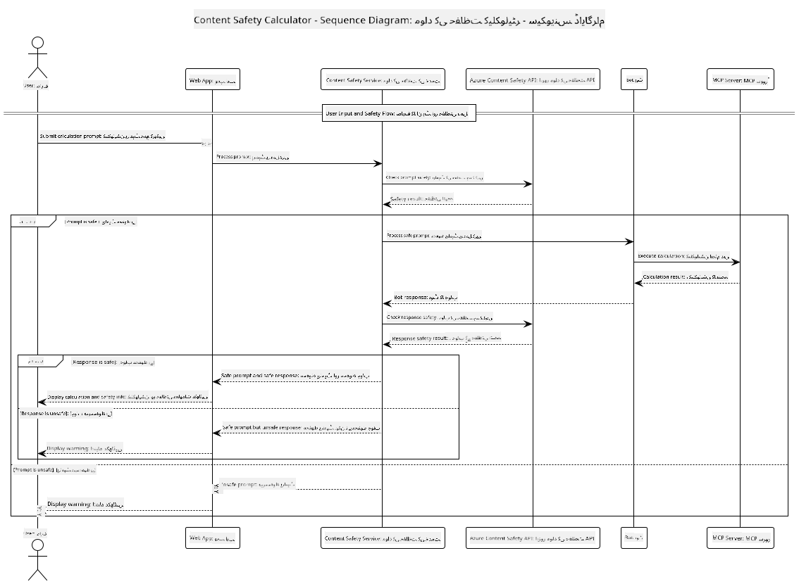

<!--
CO_OP_TRANSLATOR_METADATA:
{
  "original_hash": "e5ea5e7582f70008ea9bec3b3820f20a",
  "translation_date": "2025-07-13T23:12:26+00:00",
  "source_file": "04-PracticalImplementation/samples/java/containerapp/README.md",
  "language_code": "ur"
}
-->
## سسٹم آرکیٹیکچر

یہ پروجیکٹ ایک ویب ایپلیکیشن کی مثال پیش کرتا ہے جو صارف کے پرامپٹس کو کیلکولیٹر سروس کو بھیجنے سے پہلے مواد کی حفاظت کی جانچ کرتی ہے، اور یہ کام Model Context Protocol (MCP) کے ذریعے ہوتا ہے۔



### یہ کیسے کام کرتا ہے

1. **صارف کا ان پٹ**: صارف ویب انٹرفیس میں کیلکولیشن کا پرامپٹ داخل کرتا ہے  
2. **مواد کی حفاظت کی جانچ (ان پٹ)**: پرامپٹ کا تجزیہ Azure Content Safety API کے ذریعے کیا جاتا ہے  
3. **حفاظتی فیصلہ (ان پٹ)**:  
   - اگر مواد محفوظ ہو (تمام زمروں میں شدت < 2 ہو)، تو یہ کیلکولیٹر کو بھیجا جاتا ہے  
   - اگر مواد ممکنہ طور پر نقصان دہ قرار پائے، تو عمل روک دیا جاتا ہے اور وارننگ واپس کی جاتی ہے  
4. **کیلکولیٹر انٹیگریشن**: محفوظ مواد LangChain4j کے ذریعے پروسیس ہوتا ہے، جو MCP کیلکولیٹر سرور سے رابطہ کرتا ہے  
5. **مواد کی حفاظت کی جانچ (آؤٹ پٹ)**: بوٹ کے جواب کا تجزیہ Azure Content Safety API کے ذریعے کیا جاتا ہے  
6. **حفاظتی فیصلہ (آؤٹ پٹ)**:  
   - اگر بوٹ کا جواب محفوظ ہو، تو اسے صارف کو دکھایا جاتا ہے  
   - اگر بوٹ کا جواب ممکنہ طور پر نقصان دہ ہو، تو اسے وارننگ سے بدل دیا جاتا ہے  
7. **جواب**: نتائج (اگر محفوظ ہوں) صارف کو دکھائے جاتے ہیں، دونوں حفاظتی تجزیوں کے ساتھ

## Model Context Protocol (MCP) کو کیلکولیٹر سروسز کے ساتھ استعمال کرنا

یہ پروجیکٹ دکھاتا ہے کہ LangChain4j سے MCP کے ذریعے کیلکولیٹر MCP سروسز کو کیسے کال کیا جاتا ہے۔ اس میں ایک مقامی MCP سرور استعمال ہوتا ہے جو پورٹ 8080 پر چل رہا ہوتا ہے تاکہ کیلکولیٹر آپریشنز فراہم کیے جا سکیں۔

### Azure Content Safety سروس کی ترتیب

مواد کی حفاظت کی خصوصیات استعمال کرنے سے پہلے، آپ کو Azure Content Safety سروس ریسورس بنانا ہوگا:

1. [Azure Portal](https://portal.azure.com) میں سائن ان کریں  
2. "Create a resource" پر کلک کریں اور "Content Safety" تلاش کریں  
3. "Content Safety" منتخب کریں اور "Create" پر کلک کریں  
4. اپنے ریسورس کے لیے ایک منفرد نام درج کریں  
5. اپنی سبسکرپشن اور ریسورس گروپ منتخب کریں (یا نیا بنائیں)  
6. ایک سپورٹڈ ریجن منتخب کریں (تفصیلات کے لیے [Region availability](https://azure.microsoft.com/en-us/global-infrastructure/services/?products=cognitive-services) دیکھیں)  
7. مناسب پرائسنگ ٹئیر منتخب کریں  
8. "Create" پر کلک کر کے ریسورس تعینات کریں  
9. تعیناتی مکمل ہونے پر "Go to resource" پر کلک کریں  
10. بائیں پین میں "Resource Management" کے تحت "Keys and Endpoint" منتخب کریں  
11. اگلے مرحلے میں استعمال کے لیے کسی ایک کی اور اینڈپوائنٹ URL کو کاپی کریں

### ماحول کے متغیرات کی ترتیب

GitHub ماڈلز کی تصدیق کے لیے `GITHUB_TOKEN` ماحول متغیر سیٹ کریں:  
```sh
export GITHUB_TOKEN=<your_github_token>
```

مواد کی حفاظت کی خصوصیات کے لیے، یہ سیٹ کریں:  
```sh
export CONTENT_SAFETY_ENDPOINT=<your_content_safety_endpoint>
export CONTENT_SAFETY_KEY=<your_content_safety_key>
```

یہ ماحول کے متغیرات ایپلیکیشن کو Azure Content Safety سروس کے ساتھ تصدیق کرنے کے لیے استعمال ہوتے ہیں۔ اگر یہ متغیرات سیٹ نہ ہوں، تو ایپلیکیشن ڈیمو کے لیے پلیس ہولڈر ویلیوز استعمال کرے گا، لیکن مواد کی حفاظت کی خصوصیات صحیح طریقے سے کام نہیں کریں گی۔

### کیلکولیٹر MCP سرور شروع کرنا

کلائنٹ چلانے سے پہلے، آپ کو localhost:8080 پر SSE موڈ میں کیلکولیٹر MCP سرور شروع کرنا ہوگا۔

## پروجیکٹ کی تفصیل

یہ پروجیکٹ LangChain4j کے ساتھ Model Context Protocol (MCP) کو انٹیگریٹ کرنے کی مثال دیتا ہے تاکہ کیلکولیٹر سروسز کو کال کیا جا سکے۔ اہم خصوصیات میں شامل ہیں:

- بنیادی ریاضیاتی آپریشنز کے لیے MCP کے ذریعے کیلکولیٹر سروس سے رابطہ  
- صارف کے پرامپٹس اور بوٹ کے جوابات دونوں پر دوہری سطح کی مواد کی حفاظت کی جانچ  
- LangChain4j کے ذریعے GitHub کے gpt-4.1-nano ماڈل کے ساتھ انٹیگریشن  
- MCP ٹرانسپورٹ کے لیے Server-Sent Events (SSE) کا استعمال

## مواد کی حفاظت کی انٹیگریشن

پروجیکٹ میں جامع مواد کی حفاظت کی خصوصیات شامل ہیں تاکہ صارف کے ان پٹ اور سسٹم کے جوابات دونوں نقصان دہ مواد سے پاک رہیں:

1. **ان پٹ کی جانچ**: تمام صارف کے پرامپٹس کو نفرت انگیز تقریر، تشدد، خود کو نقصان پہنچانے، اور جنسی مواد جیسے نقصان دہ زمروں کے لیے پروسیسنگ سے پہلے تجزیہ کیا جاتا ہے۔  
2. **آؤٹ پٹ کی جانچ**: ممکنہ طور پر غیر سنسر شدہ ماڈلز کے استعمال کے باوجود، سسٹم تمام تیار کردہ جوابات کو اسی مواد کی حفاظت کے فلٹرز سے گزار کر صارف کو دکھاتا ہے۔

یہ دوہری سطح کا طریقہ کار اس بات کو یقینی بناتا ہے کہ سسٹم محفوظ رہے، چاہے کوئی بھی AI ماڈل استعمال ہو، اور صارفین کو نقصان دہ ان پٹ اور ممکنہ طور پر مسئلہ ساز AI تیار کردہ آؤٹ پٹ دونوں سے بچاتا ہے۔

## ویب کلائنٹ

ایپلیکیشن میں ایک صارف دوست ویب انٹرفیس شامل ہے جو صارفین کو Content Safety Calculator سسٹم کے ساتھ بات چیت کی سہولت دیتا ہے:

### ویب انٹرفیس کی خصوصیات

- کیلکولیشن پرامپٹس داخل کرنے کے لیے آسان اور سمجھنے میں آسان فارم  
- دوہری سطح کی مواد کی حفاظت کی تصدیق (ان پٹ اور آؤٹ پٹ)  
- پرامپٹ اور جواب کی حفاظت پر فوری فیڈبیک  
- آسان تشریح کے لیے رنگین حفاظتی اشارے  
- صاف ستھرا، ریسپانسیو ڈیزائن جو مختلف ڈیوائسز پر کام کرتا ہے  
- صارفین کی رہنمائی کے لیے محفوظ پرامپٹس کی مثالیں

### ویب کلائنٹ کا استعمال

1. ایپلیکیشن شروع کریں:  
   ```sh
   mvn spring-boot:run
   ```

2. اپنے براؤزر میں جائیں اور `http://localhost:8087` کھولیں

3. فراہم کردہ ٹیکسٹ ایریا میں کیلکولیشن پرامپٹ درج کریں (مثلاً، "Calculate the sum of 24.5 and 17.3")

4. اپنی درخواست پروسیس کرنے کے لیے "Submit" پر کلک کریں

5. نتائج دیکھیں، جن میں شامل ہوں گے:  
   - آپ کے پرامپٹ کی مواد کی حفاظت کا تجزیہ  
   - اگر پرامپٹ محفوظ ہو تو کیلکولیٹ شدہ نتیجہ  
   - بوٹ کے جواب کی مواد کی حفاظت کا تجزیہ  
   - اگر ان پٹ یا آؤٹ پٹ میں کوئی وارننگ ہو تو وہ بھی

ویب کلائنٹ خود بخود دونوں مواد کی حفاظت کی تصدیق کے عمل کو سنبھالتا ہے، اس بات کو یقینی بناتے ہوئے کہ تمام تعاملات محفوظ اور مناسب ہوں، چاہے کوئی بھی AI ماڈل استعمال ہو۔

**دستخطی نوٹ**:  
یہ دستاویز AI ترجمہ سروس [Co-op Translator](https://github.com/Azure/co-op-translator) کے ذریعے ترجمہ کی گئی ہے۔ اگرچہ ہم درستگی کے لیے کوشاں ہیں، براہ کرم آگاہ رہیں کہ خودکار ترجمے میں غلطیاں یا عدم درستیاں ہو سکتی ہیں۔ اصل دستاویز اپنی مادری زبان میں معتبر ماخذ سمجھی جانی چاہیے۔ اہم معلومات کے لیے پیشہ ور انسانی ترجمہ کی سفارش کی جاتی ہے۔ اس ترجمے کے استعمال سے پیدا ہونے والی کسی بھی غلط فہمی یا غلط تشریح کی ذمہ داری ہم پر عائد نہیں ہوتی۔