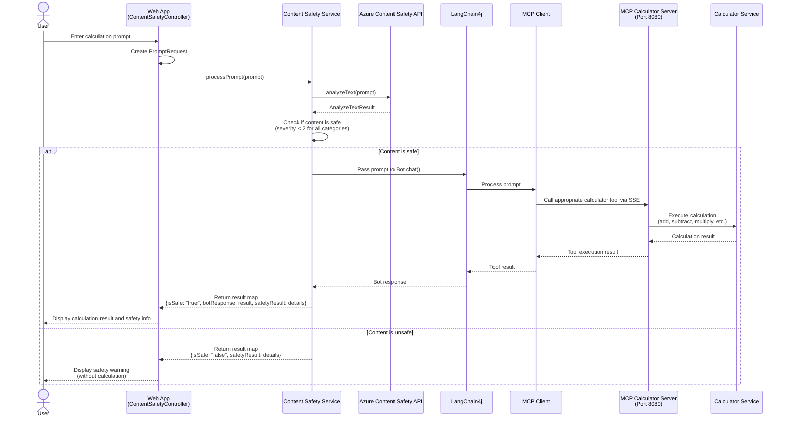

<!--
CO_OP_TRANSLATOR_METADATA:
{
  "original_hash": "0eaf9f1f29c86311674013505e9202f3",
  "translation_date": "2025-07-13T23:22:24+00:00",
  "source_file": "04-PracticalImplementation/samples/java/containerapp/src/main/resources/static/images/sequence-diagram.md",
  "language_code": "ur"
}
-->

**دستخطی نوٹ**:  
یہ دستاویز AI ترجمہ سروس [Co-op Translator](https://github.com/Azure/co-op-translator) کے ذریعے ترجمہ کی گئی ہے۔ اگرچہ ہم درستگی کے لیے کوشاں ہیں، براہ کرم اس بات سے آگاہ رہیں کہ خودکار ترجمے میں غلطیاں یا عدم درستیاں ہو سکتی ہیں۔ اصل دستاویز اپنی مادری زبان میں ہی معتبر ماخذ سمجھی جانی چاہیے۔ اہم معلومات کے لیے پیشہ ور انسانی ترجمہ کی سفارش کی جاتی ہے۔ اس ترجمے کے استعمال سے پیدا ہونے والی کسی بھی غلط فہمی یا غلط تشریح کی ذمہ داری ہم پر عائد نہیں ہوتی۔