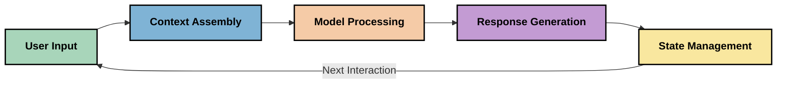
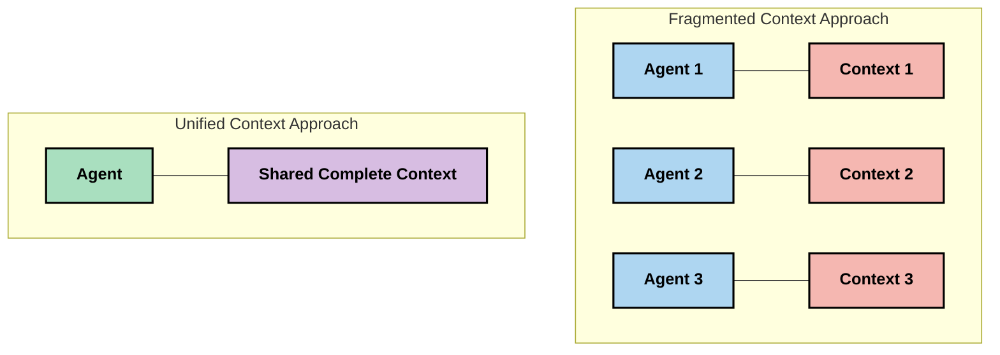
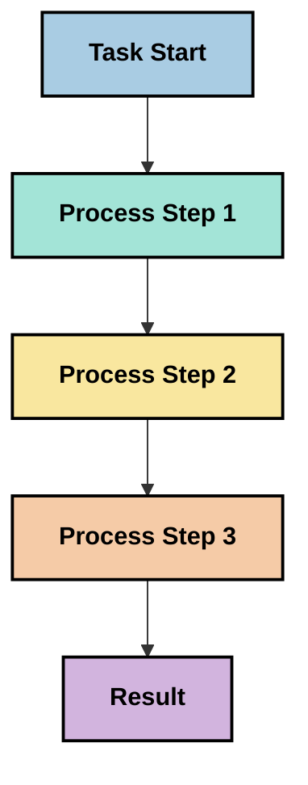
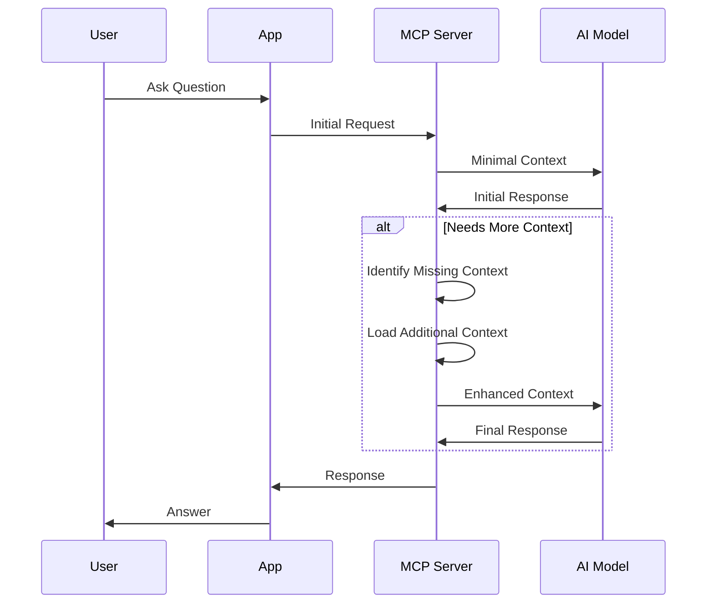
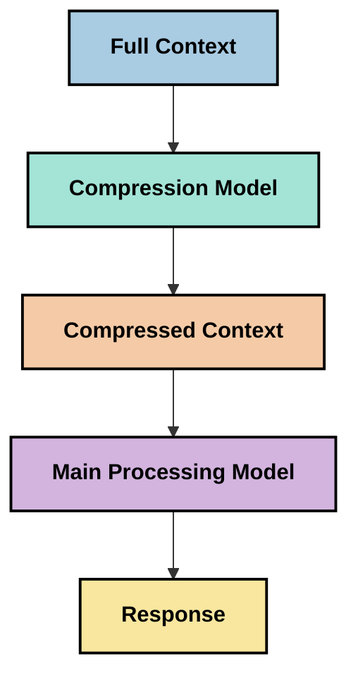

<!--
CO_OP_TRANSLATOR_METADATA:
{
  "original_hash": "5762e8e74dd99d8b7dbb31e69a82561e",
  "translation_date": "2025-07-17T01:38:18+00:00",
  "source_file": "05-AdvancedTopics/mcp-contextengineering/README.md",
  "language_code": "ur"
}
-->
# کانٹیکسٹ انجینئرنگ: MCP ایکو سسٹم میں ایک ابھرتا ہوا تصور

## جائزہ

کانٹیکسٹ انجینئرنگ AI کے میدان میں ایک نیا تصور ہے جو اس بات کا جائزہ لیتا ہے کہ معلومات کس طرح منظم، فراہم اور برقرار رکھی جاتی ہیں جب کلائنٹس اور AI سروسز کے درمیان تعاملات ہوتے ہیں۔ جیسے جیسے Model Context Protocol (MCP) ایکو سسٹم ترقی کر رہا ہے، کانٹیکسٹ کو مؤثر طریقے سے سنبھالنے کی سمجھ بوجھ زیادہ اہم ہوتی جا رہی ہے۔ یہ ماڈیول کانٹیکسٹ انجینئرنگ کے تصور کا تعارف کراتا ہے اور MCP کی تنفیذ میں اس کے ممکنہ استعمالات کا جائزہ لیتا ہے۔

## سیکھنے کے مقاصد

اس ماڈیول کے اختتام تک، آپ قابل ہوں گے کہ:

- کانٹیکسٹ انجینئرنگ کے ابھرتے ہوئے تصور اور MCP ایپلیکیشنز میں اس کے ممکنہ کردار کو سمجھیں
- کانٹیکسٹ مینجمنٹ میں اہم چیلنجز کی نشاندہی کریں جنہیں MCP پروٹوکول ڈیزائن حل کرتا ہے
- بہتر کانٹیکسٹ ہینڈلنگ کے ذریعے ماڈل کی کارکردگی کو بہتر بنانے کی تکنیکوں کو دریافت کریں
- کانٹیکسٹ کی مؤثریت کو ناپنے اور جانچنے کے طریقے پر غور کریں
- MCP فریم ورک کے ذریعے AI تجربات کو بہتر بنانے کے لیے ان ابھرتے ہوئے تصورات کو لاگو کریں

## کانٹیکسٹ انجینئرنگ کا تعارف

کانٹیکسٹ انجینئرنگ ایک ابھرتا ہوا تصور ہے جو صارفین، ایپلیکیشنز، اور AI ماڈلز کے درمیان معلومات کے بہاؤ کے ارادی ڈیزائن اور انتظام پر مرکوز ہے۔ پرامپٹ انجینئرنگ جیسے قائم شدہ شعبوں کے برعکس، کانٹیکسٹ انجینئرنگ ابھی بھی ماہرین کی جانب سے اس منفرد چیلنج کو حل کرنے کے لیے وضع کی جا رہی ہے کہ AI ماڈلز کو صحیح وقت پر صحیح معلومات کیسے فراہم کی جائیں۔

جیسے جیسے بڑے زبان کے ماڈلز (LLMs) ترقی کر رہے ہیں، کانٹیکسٹ کی اہمیت واضح ہوتی جا رہی ہے۔ ہم جو کانٹیکسٹ فراہم کرتے ہیں اس کی کوالٹی، مطابقت، اور ساخت براہ راست ماڈل کے نتائج پر اثر انداز ہوتی ہے۔ کانٹیکسٹ انجینئرنگ اس تعلق کو سمجھنے اور مؤثر کانٹیکسٹ مینجمنٹ کے اصول وضع کرنے کی کوشش کرتی ہے۔

> "2025 میں، ماڈلز انتہائی ذہین ہیں۔ لیکن سب سے ذہین انسان بھی اس کام کو مؤثر طریقے سے انجام نہیں دے سکتا جب تک کہ اسے اس کام کا کانٹیکسٹ نہ دیا جائے جسے وہ کر رہا ہے... 'کانٹیکسٹ انجینئرنگ' پرامپٹ انجینئرنگ کی اگلی سطح ہے۔ یہ ایک متحرک نظام میں خودکار طریقے سے یہ کام کرنے کے بارے میں ہے۔" — Walden Yan, Cognition AI

کانٹیکسٹ انجینئرنگ میں شامل ہو سکتا ہے:

1. **کانٹیکسٹ کا انتخاب**: یہ تعین کرنا کہ کون سی معلومات کسی خاص کام کے لیے متعلقہ ہے
2. **کانٹیکسٹ کی ساخت بندی**: معلومات کو اس طرح منظم کرنا کہ ماڈل کی سمجھ بوجھ زیادہ سے زیادہ ہو
3. **کانٹیکسٹ کی فراہمی**: معلومات کو ماڈلز تک پہنچانے کا بہترین طریقہ اور وقت
4. **کانٹیکسٹ کی دیکھ بھال**: وقت کے ساتھ کانٹیکسٹ کی حالت اور ارتقاء کا انتظام
5. **کانٹیکسٹ کی جانچ**: کانٹیکسٹ کی مؤثریت کی پیمائش اور بہتری

یہ توجہ کے شعبے خاص طور پر MCP ایکو سسٹم کے لیے اہم ہیں، جو ایپلیکیشنز کو LLMs کو کانٹیکسٹ فراہم کرنے کا معیاری طریقہ فراہم کرتا ہے۔

## کانٹیکسٹ کے سفر کا نقطہ نظر

کانٹیکسٹ انجینئرنگ کو سمجھنے کا ایک طریقہ یہ ہے کہ ہم MCP سسٹم میں معلومات کے سفر کو ٹریس کریں:



### کانٹیکسٹ کے سفر کے اہم مراحل:

1. **صارف کا ان پٹ**: صارف کی طرف سے خام معلومات (متن، تصاویر، دستاویزات)
2. **کانٹیکسٹ کی تشکیل**: صارف کے ان پٹ کو سسٹم کانٹیکسٹ، گفتگو کی تاریخ، اور دیگر حاصل شدہ معلومات کے ساتھ جوڑنا
3. **ماڈل کی پروسیسنگ**: AI ماڈل جمع شدہ کانٹیکسٹ کو پروسیس کرتا ہے
4. **جواب کی تخلیق**: ماڈل فراہم کردہ کانٹیکسٹ کی بنیاد پر نتائج پیدا کرتا ہے
5. **حالت کا انتظام**: سسٹم تعامل کی بنیاد پر اپنی داخلی حالت کو اپ ڈیٹ کرتا ہے

یہ نقطہ نظر AI سسٹمز میں کانٹیکسٹ کی متحرک نوعیت کو اجاگر کرتا ہے اور ہر مرحلے پر معلومات کے بہترین انتظام کے بارے میں اہم سوالات اٹھاتا ہے۔

## کانٹیکسٹ انجینئرنگ میں ابھرتے ہوئے اصول

جیسے جیسے کانٹیکسٹ انجینئرنگ کا شعبہ شکل اختیار کر رہا ہے، کچھ ابتدائی اصول ماہرین کی جانب سے سامنے آ رہے ہیں۔ یہ اصول MCP کی تنفیذ کے انتخاب میں مددگار ثابت ہو سکتے ہیں:

### اصول 1: کانٹیکسٹ کو مکمل طور پر شیئر کریں

کانٹیکسٹ کو نظام کے تمام اجزاء کے درمیان مکمل طور پر شیئر کیا جانا چاہیے، نہ کہ متعدد ایجنٹس یا عملوں میں بکھرا ہوا۔ جب کانٹیکسٹ تقسیم ہوتا ہے، تو نظام کے ایک حصے میں کیے گئے فیصلے دوسرے حصے کے فیصلوں سے متصادم ہو سکتے ہیں۔



MCP ایپلیکیشنز میں، اس کا مطلب ہے ایسے نظام ڈیزائن کرنا جہاں کانٹیکسٹ پورے عمل میں بغیر رکاوٹ کے بہتا رہے نہ کہ اسے مختلف حصوں میں تقسیم کیا جائے۔

### اصول 2: سمجھیں کہ عمل ضمنی فیصلے لے کر آتے ہیں

ماڈل کا ہر عمل کانٹیکسٹ کی تشریح کے ضمنی فیصلے رکھتا ہے۔ جب مختلف اجزاء مختلف کانٹیکسٹ پر عمل کرتے ہیں، تو یہ ضمنی فیصلے متصادم ہو سکتے ہیں، جس سے غیر مستقل نتائج پیدا ہوتے ہیں۔

اس اصول کے MCP ایپلیکیشنز کے لیے اہم مضمرات ہیں:
- پیچیدہ کاموں کی لائنیر پروسیسنگ کو ترجیح دیں بجائے اس کے کہ کانٹیکسٹ کو تقسیم کر کے متوازی عمل کریں
- یقینی بنائیں کہ تمام فیصلہ سازی کے مقامات کو ایک ہی کانٹیکسچول معلومات تک رسائی حاصل ہو
- ایسے نظام ڈیزائن کریں جہاں بعد کے مراحل پہلے کے فیصلوں کا مکمل کانٹیکسٹ دیکھ سکیں

### اصول 3: کانٹیکسٹ کی گہرائی کو ونڈو کی حدود کے ساتھ متوازن کریں

جیسے جیسے گفتگو اور عمل طویل ہوتے جاتے ہیں، کانٹیکسٹ ونڈوز بھر جاتی ہیں۔ مؤثر کانٹیکسٹ انجینئرنگ اس توازن کو سنبھالنے کے طریقے تلاش کرتی ہے کہ مکمل کانٹیکسٹ اور تکنیکی حدود کے درمیان کیسے توازن قائم کیا جائے۔

ممکنہ طریقے جن پر کام ہو رہا ہے:
- کانٹیکسٹ کمپریشن جو ضروری معلومات کو برقرار رکھتے ہوئے ٹوکن کے استعمال کو کم کرے
- موجودہ ضروریات کے مطابق کانٹیکسٹ کو تدریجی طور پر لوڈ کرنا
- پچھلے تعاملات کا خلاصہ بنانا جبکہ اہم فیصلے اور حقائق محفوظ رکھنا

## کانٹیکسٹ کے چیلنجز اور MCP پروٹوکول ڈیزائن

Model Context Protocol (MCP) کو کانٹیکسٹ مینجمنٹ کے منفرد چیلنجز کو مدنظر رکھتے ہوئے ڈیزائن کیا گیا ہے۔ ان چیلنجز کو سمجھنا MCP پروٹوکول ڈیزائن کے اہم پہلوؤں کی وضاحت کرتا ہے:

### چیلنج 1: کانٹیکسٹ ونڈو کی حدود  
زیادہ تر AI ماڈلز کی کانٹیکسٹ ونڈو کی سائز مقرر ہوتی ہے، جو ایک وقت میں پروسیس کی جانے والی معلومات کی مقدار کو محدود کرتی ہے۔

**MCP ڈیزائن کا جواب:**  
- پروٹوکول ساختہ، وسائل پر مبنی کانٹیکسٹ کی حمایت کرتا ہے جسے مؤثر طریقے سے حوالہ دیا جا سکتا ہے  
- وسائل کو صفحہ وار تقسیم کیا جا سکتا ہے اور تدریجی طور پر لوڈ کیا جا سکتا ہے

### چیلنج 2: مطابقت کا تعین  
یہ فیصلہ کرنا مشکل ہوتا ہے کہ کون سی معلومات کانٹیکسٹ میں شامل کرنا سب سے زیادہ متعلقہ ہے۔

**MCP ڈیزائن کا جواب:**  
- لچکدار ٹولز معلومات کی ضرورت کے مطابق متحرک بازیافت کی اجازت دیتے ہیں  
- ساختہ پرامپٹس کانٹیکسٹ کی مستقل تنظیم کو ممکن بناتے ہیں

### چیلنج 3: کانٹیکسٹ کی پائیداری  
تعاملات کے دوران حالت کا انتظام کانٹیکسٹ کی محتاط نگرانی کا تقاضا کرتا ہے۔

**MCP ڈیزائن کا جواب:**  
- معیاری سیشن مینجمنٹ  
- کانٹیکسٹ کے ارتقاء کے لیے واضح طور پر متعین تعامل کے نمونے

### چیلنج 4: کثیر النوع کانٹیکسٹ  
مختلف قسم کے ڈیٹا (متن، تصاویر، ساختہ ڈیٹا) مختلف ہینڈلنگ کے متقاضی ہیں۔

**MCP ڈیزائن کا جواب:**  
- پروٹوکول مختلف مواد کی اقسام کو سہولت دیتا ہے  
- کثیر النوع معلومات کی معیاری نمائندگی

### چیلنج 5: سیکیورٹی اور پرائیویسی  
کانٹیکسٹ میں اکثر حساس معلومات ہوتی ہے جس کی حفاظت ضروری ہے۔

**MCP ڈیزائن کا جواب:**  
- کلائنٹ اور سرور کی ذمہ داریوں کے درمیان واضح حد بندی  
- ڈیٹا کے انکشاف کو کم کرنے کے لیے مقامی پروسیسنگ کے اختیارات

ان چیلنجز کو سمجھنا اور MCP کے ان کے حل کو جاننا کانٹیکسٹ انجینئرنگ کی مزید ترقی کے لیے بنیاد فراہم کرتا ہے۔

## ابھرتے ہوئے کانٹیکسٹ انجینئرنگ کے طریقے

کانٹیکسٹ انجینئرنگ کے شعبے میں کئی امید افزا طریقے ابھر رہے ہیں۔ یہ موجودہ سوچ کی نمائندگی کرتے ہیں نہ کہ قائم شدہ بہترین طریقے، اور MCP کی تنفیذ کے تجربات کے ساتھ مزید ترقی کریں گے۔

### 1. سنگل تھریڈڈ لائنیر پروسیسنگ

کئی ایجنٹوں کی ساخت کے برعکس جو کانٹیکسٹ کو تقسیم کرتی ہے، کچھ ماہرین نے پایا ہے کہ سنگل تھریڈڈ لائنیر پروسیسنگ زیادہ مستقل نتائج دیتی ہے۔ یہ متحدہ کانٹیکسٹ کو برقرار رکھنے کے اصول سے مطابقت رکھتا ہے۔



اگرچہ یہ طریقہ متوازی پروسیسنگ کے مقابلے میں کم مؤثر لگ سکتا ہے، لیکن یہ اکثر زیادہ مربوط اور قابل اعتماد نتائج دیتا ہے کیونکہ ہر مرحلہ پچھلے فیصلوں کی مکمل سمجھ پر مبنی ہوتا ہے۔

### 2. کانٹیکسٹ کو ٹکڑوں میں تقسیم کرنا اور ترجیح دینا

بڑے کانٹیکسٹ کو قابل انتظام حصوں میں توڑنا اور سب سے اہم حصوں کو ترجیح دینا۔

```python
# Conceptual Example: Context Chunking and Prioritization
def process_with_chunked_context(documents, query):
    # 1. Break documents into smaller chunks
    chunks = chunk_documents(documents)
    
    # 2. Calculate relevance scores for each chunk
    scored_chunks = [(chunk, calculate_relevance(chunk, query)) for chunk in chunks]
    
    # 3. Sort chunks by relevance score
    sorted_chunks = sorted(scored_chunks, key=lambda x: x[1], reverse=True)
    
    # 4. Use the most relevant chunks as context
    context = create_context_from_chunks([chunk for chunk, score in sorted_chunks[:5]])
    
    # 5. Process with the prioritized context
    return generate_response(context, query)
```

مندرجہ بالا تصور دکھاتا ہے کہ ہم بڑے دستاویزات کو کس طرح قابل انتظام حصوں میں تقسیم کر سکتے ہیں اور صرف سب سے متعلقہ حصے کانٹیکسٹ کے لیے منتخب کر سکتے ہیں۔ یہ طریقہ کانٹیکسٹ ونڈو کی حدود کے اندر کام کرنے میں مدد دیتا ہے جبکہ بڑے علم کے ذخائر سے فائدہ اٹھاتا ہے۔

### 3. تدریجی کانٹیکسٹ لوڈنگ

ضرورت کے مطابق کانٹیکسٹ کو تدریجی طور پر لوڈ کرنا بجائے اس کے کہ سب کچھ ایک ساتھ لوڈ کیا جائے۔



تدریجی کانٹیکسٹ لوڈنگ کم از کم کانٹیکسٹ سے شروع ہوتی ہے اور صرف ضرورت پڑنے پر بڑھتی ہے۔ یہ سادہ سوالات کے لیے ٹوکن کے استعمال کو نمایاں طور پر کم کر سکتا ہے جبکہ پیچیدہ سوالات کو سنبھالنے کی صلاحیت برقرار رکھتا ہے۔

### 4. کانٹیکسٹ کمپریشن اور خلاصہ سازی

کانٹیکسٹ کے سائز کو کم کرنا جبکہ ضروری معلومات کو محفوظ رکھنا۔



کانٹیکسٹ کمپریشن پر توجہ مرکوز ہے:  
- غیر ضروری معلومات کو ہٹانا  
- طویل مواد کا خلاصہ بنانا  
- اہم حقائق اور تفصیلات نکالنا  
- اہم کانٹیکسٹ عناصر کو محفوظ رکھنا  
- ٹوکن کی کارکردگی کو بہتر بنانا

یہ طریقہ خاص طور پر طویل گفتگو کو کانٹیکسٹ ونڈوز میں برقرار رکھنے یا بڑے دستاویزات کو مؤثر طریقے سے پروسیس کرنے کے لیے قیمتی ہو سکتا ہے۔ کچھ ماہرین خاص ماڈلز استعمال کر رہے ہیں جو خاص طور پر کانٹیکسٹ کمپریشن اور گفتگو کی تاریخ کے خلاصے کے لیے بنائے گئے ہیں۔

## تحقیقی کانٹیکسٹ انجینئرنگ کے پہلو

کانٹیکسٹ انجینئرنگ کے ابھرتے ہوئے شعبے کو دریافت کرتے ہوئے، MCP کی تنفیذ کے دوران چند غور طلب پہلوؤں کو ذہن میں رکھنا مفید ہے۔ یہ ہدایات نہیں بلکہ ایسے شعبے ہیں جہاں آپ کی مخصوص صورت حال میں بہتری کے امکانات ہو سکتے ہیں۔

### اپنے کانٹیکسٹ کے مقاصد پر غور کریں

پیچیدہ کانٹیکسٹ مینجمنٹ حل نافذ کرنے سے پہلے واضح کریں کہ آپ کیا حاصل کرنا چاہتے ہیں:  
- ماڈل کو کامیاب بنانے کے لیے کون سی مخصوص معلومات ضروری ہے؟  
- کون سی معلومات لازمی ہے اور کون سی ضمنی؟  
- آپ کی کارکردگی کی حدود کیا ہیں (لیٹنسی، ٹوکن کی حد، لاگت)؟

### پرت دار کانٹیکسٹ کے طریقے دریافت کریں

کچھ ماہرین نے کانٹیکسٹ کو تصوری پرتوں میں ترتیب دے کر کامیابی حاصل کی ہے:  
- **کور پرت**: وہ ضروری معلومات جو ماڈل کو ہمیشہ چاہیے  
- **صورتحال کی پرت**: موجودہ تعامل سے متعلق کانٹیکسٹ  
- **معاون پرت**: اضافی معلومات جو مددگار ہو سکتی ہے  
- **فالبیک پرت**: وہ معلومات جو صرف ضرورت پڑنے پر حاصل کی جاتی ہے

### بازیافت کی حکمت عملیوں کی تحقیق کریں

آپ کے کانٹیکسٹ کی مؤثریت اس بات پر منحصر ہو سکتی ہے کہ آپ معلومات کیسے بازیافت کرتے ہیں:  
- معنوی تلاش اور ایمبیڈنگز تاکہ تصوری طور پر متعلقہ معلومات ملے  
- مخصوص حقائق کے لیے کی ورڈ پر مبنی تلاش  
- متعدد بازیافت کے طریقوں کو ملانے والے ہائبرڈ طریقے  
- زمروں، تاریخوں، یا ذرائع کی بنیاد پر میٹا ڈیٹا فلٹرنگ

### کانٹیکسٹ کی ہم آہنگی پر تجربہ کریں

آپ کے کانٹیکسٹ کی ساخت اور بہاؤ ماڈل کی سمجھ بوجھ کو متاثر کر سکتے ہیں:  
- متعلقہ معلومات کو ایک ساتھ گروپ کرنا  
- مستقل فارمیٹنگ اور تنظیم کا استعمال  
- جہاں مناسب ہو منطقی یا زمانی ترتیب برقرار رکھنا  
- متضاد معلومات سے گریز کرنا

### کثیر ایجنٹ ساختوں کے فوائد اور نقصانات پر غور کریں

اگرچہ کثیر ایجنٹ ساختیں کئی AI فریم ورکس میں مقبول ہیں، لیکن کانٹیکسٹ مینجمنٹ کے لیے ان کے نمایاں چیلنجز ہیں:  
- کانٹیکسٹ کی تقسیم سے ایجنٹس کے درمیان غیر مستقل فیصلے ہو سکتے ہیں  
- متوازی پروسیسنگ سے ایسے تصادم پیدا ہو سکتے ہیں جنہیں حل کرنا مشکل ہو  
- ایجنٹس کے درمیان مواصلاتی بوجھ کارکردگی کے فوائد کو کم کر سکتا ہے  
- ہم آہنگی برقرار رکھنے کے لیے پیچیدہ حالت کا انتظام ضروری ہے

اکثر صورتوں میں، جامع کانٹیکسٹ مینجمنٹ کے ساتھ سنگل ایجنٹ طریقہ کار متعدد مخصوص ایجنٹس کے مقابلے میں زیادہ قابل اعتماد نتائج دے سکتا ہے۔

### جانچ کے طریقے تیار کریں

وقت کے ساتھ کانٹیکسٹ انجینئرنگ کو بہتر بنانے کے لیے، یہ سوچیں کہ آپ کامیابی کو کیسے ناپیں گے:  
- مختلف کانٹیکسٹ ساختوں کا A/B ٹیسٹ  
- ٹوکن کے استعمال اور جواب کے اوقات کی نگرانی  
- صارف کی اطمینان اور کام کی تکمیل کی شرح کا ٹریک رکھنا  
- ان حالات کا تجزیہ جہاں کانٹیکسٹ کی حکمت عملی ناکام ہو

یہ غور و فکر کانٹیکسٹ انجینئرنگ کے شعبے میں فعال تحقیق کی نمائندگی کرتے ہیں۔ جیسے جیسے یہ شعبہ ترقی کرے گا، مزید واضح پیٹرنز اور طریقے سامنے آئیں گے۔

## کانٹیکسٹ کی مؤثریت کی پیمائش: ایک ارتقائی فریم ورک

کانٹیکسٹ انجینئرنگ کے ابھرتے ہوئے تصور کے طور پر، ماہرین اس کی مؤثریت کو ناپنے کے طریقے تلاش کر رہے ہیں۔ ابھی کوئی قائم شدہ فریم ورک موجود نہیں، لیکن مختلف میٹرکس زیر غور ہیں جو مستقبل کے کام کی رہنمائی کر سکتے ہیں۔

### ممکنہ پیمائش کے پہلو

#### 1. ان پٹ کی کارکردگی کے پہلو

- **کانٹیکسٹ سے جواب کا تناسب**: جواب کے سائز کے مقابلے میں کتنی کانٹیکسٹ درکار ہے؟  
- **ٹوکن کا استعمال**: فراہم کردہ کانٹیکسٹ ٹوکنز میں سے کتنے جواب پر اثر انداز ہوتے ہیں؟  
- **کانٹیکسٹ کی کمی**: ہم کتنی مؤثر طریقے سے خام معلومات کو کمپریس کر سکتے ہیں؟

#### 2. کارکردگی کے پہلو

- **لیٹنسی کا اثر**: کانٹیکسٹ مینجمنٹ جواب کے وقت کو کیسے متاثر کرتا ہے؟  
- **ٹوکن کی معیشت**: کیا ہم ٹوکن کے استعمال کو مؤثر بنا رہے ہیں؟  
- **بازیافت کی درستگی**: حاصل کردہ معلومات کتنی متعلقہ ہے؟  
- **وسائل کا استعمال**: کتنے کمپیوٹیشنل وسائل درکار ہیں
- [Model Context Protocol ویب سائٹ](https://modelcontextprotocol.io/)
- [Model Context Protocol وضاحت](https://github.com/modelcontextprotocol/modelcontextprotocol)
- [MCP دستاویزات](https://modelcontextprotocol.io/docs)
- [MCP C# SDK](https://github.com/modelcontextprotocol/csharp-sdk)
- [MCP Python SDK](https://github.com/modelcontextprotocol/python-sdk)
- [MCP TypeScript SDK](https://github.com/modelcontextprotocol/typescript-sdk)
- [MCP Inspector](https://github.com/modelcontextprotocol/inspector) - MCP سرورز کے لیے بصری ٹیسٹنگ کا آلہ

### Context Engineering مضامین
- [متعدد ایجنٹس نہ بنائیں: Context Engineering کے اصول](https://cognition.ai/blog/dont-build-multi-agents) - Walden Yan کے context engineering کے اصولوں پر بصیرت
- [ایجنٹس بنانے کے لیے عملی رہنمائی](https://cdn.openai.com/business-guides-and-resources/a-practical-guide-to-building-agents.pdf) - OpenAI کی مؤثر ایجنٹ ڈیزائن پر رہنمائی
- [موثر ایجنٹس کی تعمیر](https://www.anthropic.com/engineering/building-effective-agents) - Anthropic کا ایجنٹ کی ترقی کا طریقہ کار

### متعلقہ تحقیق
- [بڑے زبان کے ماڈلز کے لیے Dynamic Retrieval Augmentation](https://arxiv.org/abs/2310.01487) - dynamic retrieval طریقوں پر تحقیق
- [درمیان میں کھو جانا: زبان کے ماڈلز لمبے context کیسے استعمال کرتے ہیں](https://arxiv.org/abs/2307.03172) - context پراسیسنگ کے نمونوں پر اہم تحقیق
- [CLIP Latents کے ساتھ Hierarchical Text-Conditioned Image Generation](https://arxiv.org/abs/2204.06125) - DALL-E 2 کا مقالہ جس میں context کی ساخت پر بصیرت
- [بڑے زبان کے ماڈل آرکیٹیکچرز میں context کے کردار کی تلاش](https://aclanthology.org/2023.findings-emnlp.124/) - context ہینڈلنگ پر حالیہ تحقیق
- [Multi-Agent تعاون: ایک جائزہ](https://arxiv.org/abs/2304.03442) - ملٹی ایجنٹ سسٹمز اور ان کے چیلنجز پر تحقیق

### اضافی وسائل
- [Context Window کی اصلاح کی تکنیکیں](https://learn.microsoft.com/en-us/azure/ai-services/openai/concepts/context-window)
- [Advanced RAG تکنیکیں](https://www.microsoft.com/en-us/research/blog/retrieval-augmented-generation-rag-and-frontier-models/)
- [Semantic Kernel دستاویزات](https://github.com/microsoft/semantic-kernel)
- [Context مینجمنٹ کے لیے AI Toolkit](https://github.com/microsoft/aitoolkit)

## آگے کیا ہے
- [6. کمیونٹی کی شراکتیں](../../06-CommunityContributions/README.md)

**دستخطی نوٹ**:  
یہ دستاویز AI ترجمہ سروس [Co-op Translator](https://github.com/Azure/co-op-translator) کے ذریعے ترجمہ کی گئی ہے۔ اگرچہ ہم درستگی کے لیے کوشاں ہیں، براہ کرم آگاہ رہیں کہ خودکار ترجمے میں غلطیاں یا عدم درستیاں ہو سکتی ہیں۔ اصل دستاویز اپنی مادری زبان میں ہی معتبر ماخذ سمجھی جانی چاہیے۔ اہم معلومات کے لیے پیشہ ور انسانی ترجمہ کی سفارش کی جاتی ہے۔ اس ترجمے کے استعمال سے پیدا ہونے والی کسی بھی غلط فہمی یا غلط تشریح کی ذمہ داری ہم پر عائد نہیں ہوتی۔