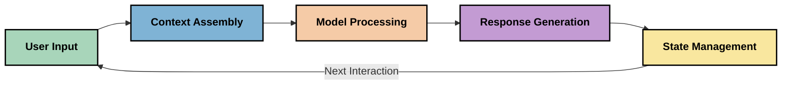
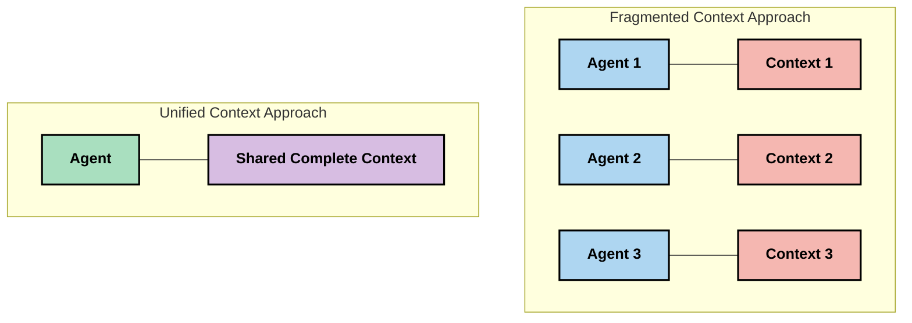
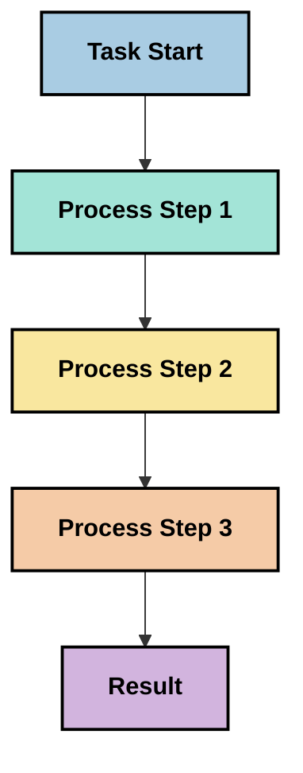
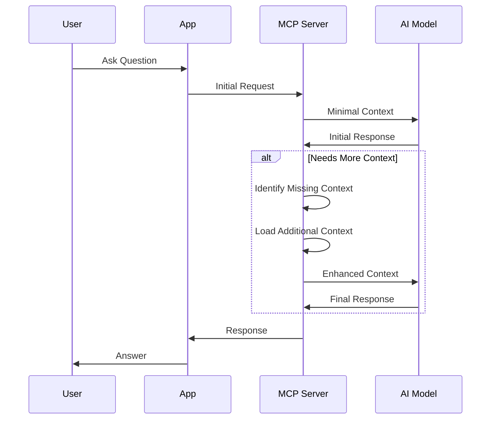
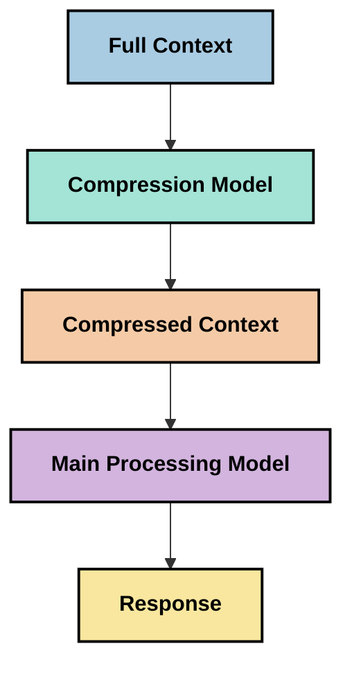

<!--
CO_OP_TRANSLATOR_METADATA:
{
  "original_hash": "fd169ca3071b81b5ee282e194bc823df",
  "translation_date": "2025-09-15T19:49:21+00:00",
  "source_file": "05-AdvancedTopics/mcp-contextengineering/README.md",
  "language_code": "ur"
}
-->
# سیاق انجینئرنگ: ایم سی پی ایکو سسٹم میں ایک ابھرتا ہوا تصور

## جائزہ

سیاق انجینئرنگ مصنوعی ذہانت کے میدان میں ایک ابھرتا ہوا تصور ہے جو یہ دریافت کرتا ہے کہ معلومات کو کس طرح ترتیب دیا جاتا ہے، فراہم کیا جاتا ہے، اور کلائنٹس اور AI سروسز کے درمیان تعاملات کے دوران برقرار رکھا جاتا ہے۔ جیسے جیسے ماڈل کانٹیکسٹ پروٹوکول (MCP) ایکو سسٹم ترقی کرتا ہے، سیاق کو مؤثر طریقے سے منظم کرنے کی سمجھنا زیادہ اہم ہوتا جا رہا ہے۔ یہ ماڈیول سیاق انجینئرنگ کے تصور کو متعارف کراتا ہے اور MCP کے نفاذ میں اس کے ممکنہ اطلاق کو دریافت کرتا ہے۔

## سیکھنے کے مقاصد

اس ماڈیول کے اختتام تک، آپ قابل ہوں گے:

- سیاق انجینئرنگ کے ابھرتے ہوئے تصور اور MCP ایپلیکیشنز میں اس کے ممکنہ کردار کو سمجھنا
- سیاق کے انتظام میں کلیدی چیلنجز کی شناخت کرنا جنہیں MCP پروٹوکول ڈیزائن حل کرتا ہے
- بہتر سیاق کے انتظام کے ذریعے ماڈل کی کارکردگی کو بہتر بنانے کی تکنیکوں کو دریافت کرنا
- سیاق کی مؤثریت کو ماپنے اور اس کا جائزہ لینے کے طریقوں پر غور کرنا
- MCP فریم ورک کے ذریعے AI تجربات کو بہتر بنانے کے لیے ان ابھرتے ہوئے تصورات کو لاگو کرنا

## سیاق انجینئرنگ کا تعارف

سیاق انجینئرنگ ایک ابھرتا ہوا تصور ہے جو صارفین، ایپلیکیشنز، اور AI ماڈلز کے درمیان معلومات کے بہاؤ کے ڈیزائن اور انتظام پر مرکوز ہے۔ پرامپٹ انجینئرنگ جیسے قائم شدہ شعبوں کے برعکس، سیاق انجینئرنگ ابھی بھی ماہرین کے ذریعے وضاحت کی جا رہی ہے کیونکہ وہ AI ماڈلز کو صحیح وقت پر صحیح معلومات فراہم کرنے کے منفرد چیلنجز کو حل کرنے کی کوشش کرتے ہیں۔

جیسے جیسے بڑے زبان کے ماڈلز (LLMs) ترقی کر رہے ہیں، سیاق کی اہمیت زیادہ واضح ہوتی جا رہی ہے۔ جو سیاق ہم فراہم کرتے ہیں اس کا معیار، مطابقت، اور ساخت ماڈل کے نتائج پر براہ راست اثر ڈالتا ہے۔ سیاق انجینئرنگ اس تعلق کو دریافت کرتی ہے اور مؤثر سیاق کے انتظام کے اصولوں کو تیار کرنے کی کوشش کرتی ہے۔

> "سال 2025 میں، ماڈلز انتہائی ذہین ہوں گے۔ لیکن سب سے ذہین انسان بھی اس وقت تک مؤثر طریقے سے کام نہیں کر سکے گا جب تک کہ اسے یہ نہ معلوم ہو کہ اس سے کیا کرنے کو کہا جا رہا ہے... 'سیاق انجینئرنگ' پرامپٹ انجینئرنگ کا اگلا مرحلہ ہے۔ یہ ایک متحرک نظام میں خودکار طور پر یہ کام کرنے کے بارے میں ہے۔" — والڈن یان، کوگنیشن AI

سیاق انجینئرنگ میں شامل ہو سکتا ہے:

1. **سیاق کا انتخاب**: یہ طے کرنا کہ کسی خاص کام کے لیے کون سی معلومات متعلقہ ہیں
2. **سیاق کی ساخت**: معلومات کو اس طرح ترتیب دینا کہ ماڈل اسے زیادہ بہتر طور پر سمجھ سکے
3. **سیاق کی فراہمی**: معلومات کو ماڈلز تک پہنچانے کے وقت اور طریقے کو بہتر بنانا
4. **سیاق کی دیکھ بھال**: وقت کے ساتھ سیاق کی حالت اور ارتقاء کا انتظام کرنا
5. **سیاق کا جائزہ**: سیاق کی مؤثریت کو ماپنا اور بہتر بنانا

یہ توجہ کے شعبے خاص طور پر MCP ایکو سسٹم کے لیے متعلقہ ہیں، جو LLMs کو سیاق فراہم کرنے کے لیے ایک معیاری طریقہ فراہم کرتا ہے۔

## سیاق کے سفر کا نقطہ نظر

سیاق انجینئرنگ کو تصور کرنے کا ایک طریقہ یہ ہے کہ MCP نظام کے ذریعے معلومات کے سفر کو ٹریس کیا جائے:



### سیاق کے سفر کے کلیدی مراحل:

1. **صارف کی ان پٹ**: صارف کی طرف سے فراہم کردہ خام معلومات (متن، تصاویر، دستاویزات)
2. **سیاق کی اسمبلی**: صارف کی ان پٹ کو نظام کے سیاق، گفتگو کی تاریخ، اور دیگر بازیافت شدہ معلومات کے ساتھ جوڑنا
3. **ماڈل پروسیسنگ**: AI ماڈل فراہم کردہ سیاق کو پروسیس کرتا ہے
4. **جواب کی تخلیق**: ماڈل فراہم کردہ سیاق کی بنیاد پر نتائج پیدا کرتا ہے
5. **حالت کا انتظام**: نظام تعامل کی بنیاد پر اپنی داخلی حالت کو اپ ڈیٹ کرتا ہے

یہ نقطہ نظر AI نظاموں میں سیاق کی متحرک نوعیت کو اجاگر کرتا ہے اور اس بات پر اہم سوالات اٹھاتا ہے کہ ہر مرحلے پر معلومات کو بہترین طریقے سے کیسے منظم کیا جائے۔

## سیاق انجینئرنگ میں ابھرتے ہوئے اصول

جیسے جیسے سیاق انجینئرنگ کا میدان شکل اختیار کر رہا ہے، کچھ ابتدائی اصول ماہرین سے سامنے آ رہے ہیں۔ یہ اصول MCP کے نفاذ کے انتخاب کو مطلع کرنے میں مدد کر سکتے ہیں:

### اصول 1: سیاق کو مکمل طور پر شیئر کریں

سیاق کو نظام کے تمام اجزاء کے درمیان مکمل طور پر شیئر کیا جانا چاہیے، نہ کہ متعدد ایجنٹس یا عملوں میں تقسیم کیا جائے۔ جب سیاق تقسیم ہوتا ہے، تو نظام کے ایک حصے میں کیے گئے فیصلے دوسرے حصے میں کیے گئے فیصلوں سے متصادم ہو سکتے ہیں۔



MCP ایپلیکیشنز میں، اس سے مراد ایسے نظاموں کو ڈیزائن کرنا ہے جہاں سیاق پورے پائپ لائن میں بغیر کسی رکاوٹ کے بہتا ہو، بجائے اس کے کہ اسے الگ الگ کیا جائے۔

### اصول 2: تسلیم کریں کہ اعمال میں مضمر فیصلے شامل ہوتے ہیں

ماڈل کے ہر عمل میں سیاق کی تشریح کے بارے میں مضمر فیصلے شامل ہوتے ہیں۔ جب متعدد اجزاء مختلف سیاق پر عمل کرتے ہیں، تو یہ مضمر فیصلے متصادم ہو سکتے ہیں، جس کے نتیجے میں غیر مستقل نتائج پیدا ہوتے ہیں۔

یہ اصول MCP ایپلیکیشنز کے لیے اہم مضمرات رکھتا ہے:
- پیچیدہ کاموں کی لکیری پروسیسنگ کو ترجیح دیں بجائے اس کے کہ متوازی عمل کے ساتھ تقسیم شدہ سیاق
- یقینی بنائیں کہ تمام فیصلہ کن نکات کو ایک ہی سیاقی معلومات تک رسائی حاصل ہو
- ایسے نظام ڈیزائن کریں جہاں بعد کے مراحل پہلے کے فیصلوں کے مکمل سیاق کو دیکھ سکیں

### اصول 3: سیاق کی گہرائی کو ونڈو کی حدود کے ساتھ متوازن کریں

جیسے جیسے گفتگو اور عمل طویل ہوتے جاتے ہیں، سیاق کی ونڈوز بالآخر بھر جاتی ہیں۔ مؤثر سیاق انجینئرنگ ان جامع سیاق اور تکنیکی حدود کے درمیان اس تناؤ کو منظم کرنے کے طریقوں کو دریافت کرتی ہے۔

دریافت کیے جانے والے ممکنہ طریقے شامل ہیں:
- سیاق کی کمپریشن جو ضروری معلومات کو برقرار رکھتی ہے جبکہ ٹوکن کے استعمال کو کم کرتی ہے
- موجودہ ضروریات کے مطابق مطابقت پر مبنی سیاق کی ترقی پسند لوڈنگ
- پچھلے تعاملات کا خلاصہ بنانا جبکہ کلیدی فیصلے اور حقائق کو محفوظ رکھنا

## سیاق کے چیلنجز اور MCP پروٹوکول ڈیزائن

ماڈل کانٹیکسٹ پروٹوکول (MCP) کو سیاق کے انتظام کے منفرد چیلنجز کے بارے میں آگاہی کے ساتھ ڈیزائن کیا گیا تھا۔ ان چیلنجز کو سمجھنا MCP پروٹوکول ڈیزائن کے کلیدی پہلوؤں کی وضاحت کرنے میں مدد کرتا ہے:

### چیلنج 1: سیاق کی ونڈو کی حدود
زیادہ تر AI ماڈلز کے پاس مقررہ سیاق کی ونڈو کے سائز ہوتے ہیں، جو ایک وقت میں پروسیس کی جانے والی معلومات کی مقدار کو محدود کرتے ہیں۔

**MCP ڈیزائن کا جواب:** 
- پروٹوکول منظم، وسائل پر مبنی سیاق کی حمایت کرتا ہے جسے مؤثر طریقے سے حوالہ دیا جا سکتا ہے
- وسائل کو صفحہ وار بنایا جا سکتا ہے اور ترقی پسند طور پر لوڈ کیا جا سکتا ہے

### چیلنج 2: مطابقت کا تعین
یہ طے کرنا کہ سیاق میں شامل کرنے کے لیے کون سی معلومات سب سے زیادہ متعلقہ ہیں، مشکل ہے۔

**MCP ڈیزائن کا جواب:**
- لچکدار ٹولنگ متحرک طور پر ضرورت کے مطابق معلومات کی بازیافت کی اجازت دیتی ہے
- منظم پرامپٹس مستقل سیاق کی تنظیم کو فعال کرتے ہیں

### چیلنج 3: سیاق کی مستقل مزاجی
تعاملات کے دوران حالت کا انتظام کرنا سیاق کی احتیاط سے ٹریکنگ کی ضرورت ہوتی ہے۔

**MCP ڈیزائن کا جواب:**
- معیاری سیشن مینجمنٹ
- سیاق کے ارتقاء کے لیے واضح طور پر بیان کردہ تعامل کے نمونے

### چیلنج 4: کثیر وضعی سیاق
مختلف قسم کے ڈیٹا (متن، تصاویر، منظم ڈیٹا) کو مختلف ہینڈلنگ کی ضرورت ہوتی ہے۔

**MCP ڈیزائن کا جواب:**
- پروٹوکول ڈیزائن مختلف مواد کی اقسام کو ایڈجسٹ کرتا ہے
- کثیر وضعی معلومات کی معیاری نمائندگی

### چیلنج 5: سیکیورٹی اور رازداری
سیاق اکثر حساس معلومات پر مشتمل ہوتا ہے جسے محفوظ رکھنا ضروری ہے۔

**MCP ڈیزائن کا جواب:**
- کلائنٹ اور سرور کی ذمہ داریوں کے درمیان واضح حدود
- ڈیٹا کی نمائش کو کم کرنے کے لیے مقامی پروسیسنگ کے اختیارات

ان چیلنجز کو سمجھنا اور MCP انہیں کیسے حل کرتا ہے، زیادہ جدید سیاق انجینئرنگ تکنیکوں کو دریافت کرنے کے لیے ایک بنیاد فراہم کرتا ہے۔

## ابھرتے ہوئے سیاق انجینئرنگ کے طریقے

جیسے جیسے سیاق انجینئرنگ کا میدان ترقی کرتا ہے، کئی امید افزا طریقے سامنے آ رہے ہیں۔ یہ موجودہ سوچ کی نمائندگی کرتے ہیں، نہ کہ قائم شدہ بہترین طریقے، اور ممکنہ طور پر MCP کے نفاذ کے ساتھ مزید تجربے کے ساتھ تیار ہوں گے۔

### 1. سنگل تھریڈڈ لکیری پروسیسنگ

سیاق کو تقسیم کرنے والے کثیر ایجنٹ آرکیٹیکچرز کے برعکس، کچھ ماہرین یہ دریافت کر رہے ہیں کہ سنگل تھریڈڈ لکیری پروسیسنگ زیادہ مستقل نتائج پیدا کرتی ہے۔ یہ متحد سیاق کو برقرار رکھنے کے اصول کے ساتھ ہم آہنگ ہے۔



جبکہ یہ طریقہ متوازی پروسیسنگ کے مقابلے میں کم مؤثر معلوم ہو سکتا ہے، یہ اکثر زیادہ مربوط اور قابل اعتماد نتائج پیدا کرتا ہے کیونکہ ہر مرحلہ پچھلے فیصلوں کی مکمل تفہیم پر مبنی ہوتا ہے۔

### 2. سیاق کی چنکنگ اور ترجیح دینا

بڑے سیاق کو قابل انتظام حصوں میں تقسیم کرنا اور سب سے اہم چیزوں کو ترجیح دینا۔

```python
# Conceptual Example: Context Chunking and Prioritization
def process_with_chunked_context(documents, query):
    # 1. Break documents into smaller chunks
    chunks = chunk_documents(documents)
    
    # 2. Calculate relevance scores for each chunk
    scored_chunks = [(chunk, calculate_relevance(chunk, query)) for chunk in chunks]
    
    # 3. Sort chunks by relevance score
    sorted_chunks = sorted(scored_chunks, key=lambda x: x[1], reverse=True)
    
    # 4. Use the most relevant chunks as context
    context = create_context_from_chunks([chunk for chunk, score in sorted_chunks[:5]])
    
    # 5. Process with the prioritized context
    return generate_response(context, query)
```

اوپر کا تصور یہ ظاہر کرتا ہے کہ ہم بڑے دستاویزات کو قابل انتظام حصوں میں کیسے تقسیم کر سکتے ہیں اور سیاق کے لیے صرف سب سے متعلقہ حصے منتخب کر سکتے ہیں۔ یہ طریقہ سیاق کی ونڈو کی حدود کے اندر کام کرنے میں مدد کر سکتا ہے جبکہ بڑے علم کے ذخیرے سے فائدہ اٹھاتا ہے۔

### 3. ترقی پسند سیاق لوڈنگ

سیاق کو ایک ساتھ لوڈ کرنے کے بجائے ضرورت کے مطابق ترقی پسند طور پر لوڈ کرنا۔



ترقی پسند سیاق لوڈنگ کم سے کم سیاق کے ساتھ شروع ہوتی ہے اور صرف ضرورت پڑنے پر اسے بڑھاتی ہے۔ یہ سادہ سوالات کے لیے ٹوکن کے استعمال کو نمایاں طور پر کم کر سکتا ہے جبکہ پیچیدہ سوالات کو سنبھالنے کی صلاحیت کو برقرار رکھتا ہے۔

### 4. سیاق کی کمپریشن اور خلاصہ

سیاق کے سائز کو کم کرنا جبکہ ضروری معلومات کو محفوظ رکھنا۔



سیاق کی کمپریشن پر مرکوز ہے:
- غیر ضروری معلومات کو ہٹانا
- طویل مواد کا خلاصہ بنانا
- کلیدی حقائق اور تفصیلات نکالنا
- اہم سیاقی عناصر کو محفوظ رکھنا
- ٹوکن کی مؤثریت کے لیے اصلاح کرنا

یہ طریقہ طویل گفتگو کو سیاق کی ونڈوز کے اندر برقرار رکھنے یا بڑے دستاویزات کو مؤثر طریقے سے پروسیس کرنے کے لیے خاص طور پر قیمتی ہو سکتا ہے۔ کچھ ماہرین خاص طور پر گفتگو کی تاریخ کے خلاصہ اور کمپریشن کے لیے ماڈلز استعمال کر رہے ہیں۔

## سیاق انجینئرنگ کے دریافت کے قابل غور و فکر

جب MCP کے نفاذ کے ساتھ کام کرتے ہوئے سیاق انجینئرنگ کے ابھرتے ہوئے میدان کو دریافت کرتے ہیں، تو کئی غور و فکر ذہن میں رکھنے کے قابل ہیں۔ یہ تجویز کردہ بہترین طریقے نہیں ہیں بلکہ دریافت کے شعبے ہیں جو آپ کے مخصوص استعمال کے معاملے میں بہتری لا سکتے ہیں۔

### اپنے سیاق کے اہداف پر غور کریں

پیچیدہ سیاق کے انتظام کے حل کو نافذ کرنے سے پہلے، واضح طور پر بیان کریں کہ آپ کیا حاصل کرنے کی کوشش کر رہے ہیں:
- ماڈل کو کامیاب ہونے کے لیے کون سی مخصوص معلومات کی ضرورت ہے؟
- کون سی معلومات ضروری ہیں اور کون سی ضمنی ہیں؟
- آپ کی کارکردگی کی حدود کیا ہیں (تاخیر، ٹوکن کی حدود، اخراجات)؟

### پرتوں والے سیاق کے طریقوں کو دریافت کریں

کچھ ماہرین تصوراتی پرتوں میں ترتیب دیے گئے سیاق کے ساتھ کامیابی حاصل کر رہے ہیں:
- **بنیادی پرت**: ضروری معلومات جو ماڈل کو ہمیشہ درکار ہوتی ہیں
- **حالاتی پرت**: موجودہ تعامل کے لیے مخصوص سیاق
- **معاون پرت**: اضافی معلومات جو مددگار ہو سکتی ہیں
- **بیک اپ پرت**: معلومات جو صرف ضرورت پڑنے پر حاصل کی جاتی ہیں

### بازیافت کی حکمت عملیوں کی تحقیق کریں

آپ کے سیاق کی مؤثریت اکثر اس بات پر منحصر ہوتی ہے کہ آپ معلومات کو کیسے بازیافت کرتے ہیں:
- تصوراتی طور پر متعلقہ معلومات تلاش کرنے کے لیے سیمینٹک سرچ اور ایمبیڈنگز
- مخصوص حقائق کی تفصیلات کے لیے کلیدی الفاظ پر مبنی تلاش
- متعدد بازیافت کے طریقوں کو یکجا کرنے والے ہائبرڈ طریقے
- زمرے، تاریخوں، یا ذرائع کی بنیاد پر دائرہ کار کو محدود کرنے کے لیے میٹا ڈیٹا فلٹرنگ

### سیاق کی ہم آہنگی کے ساتھ تجربہ کریں

آپ کے سیاق کی ساخت اور بہاؤ ماڈل کی تفہیم کو متاثر کر سکتے ہیں:
- متعلقہ معلومات کو ایک ساتھ گروپ کرنا
- مستقل فارمیٹنگ اور تنظیم کا استعمال
- جہاں مناسب ہو منطقی یا زمانی ترتیب کو برقرار رکھنا
- متضاد معلومات سے گریز کرنا

### کثیر ایجنٹ آرکیٹیکچرز کے فوائد اور نقصانات کا وزن کریں

جبکہ کثیر ایجنٹ آرکیٹیکچرز بہت سے AI فریم ورک میں مقبول ہیں، وہ سیاق کے انتظام کے لیے اہم چیلنجز کے ساتھ آتے ہیں:
- سیاق کی تقسیم ایجنٹس کے درمیان غیر مستقل فیصلوں کا باعث بن سکتی ہے
- متوازی پروسیسنگ تنازعات کو متعارف کرا سکتی ہے جنہیں حل کرنا مشکل ہے
- ایجنٹس کے درمیان مواصلاتی اوور ہیڈ کارکردگی کے فوائد کو ختم کر سکتا ہے
- ہم آہنگی کو برقرار رکھنے کے لیے پیچیدہ حالت کا انتظام ضروری ہے

بہت سے معاملات میں، ایک جامع سیاق کے انتظام کے ساتھ سنگل ایجنٹ کا طریقہ متعدد ماہر ایجنٹس کے ساتھ تقسیم شدہ سیاق کے مقابلے میں زیادہ قابل اعتماد نتائج پیدا کر سکتا ہے۔

### تشخیصی طریقے تیار کریں

وقت کے ساتھ سیاق انجینئرنگ کو بہتر بنانے کے لیے، غور کریں کہ آپ کامیابی کو کیسے ماپیں گے:
- مختلف سیاق کی ساختوں کا A/B ٹیسٹنگ
- ٹوکن کے استعمال اور جواب کے اوقات کی نگرانی
- صارف کی اطمینان اور کام کی تکمیل کی شرح کو ٹریک کرنا
- سیاق کی حکمت عملیوں کے ناکام ہونے کی وجوہات کا تجزیہ کرنا

یہ غور و فکر سیاق انجینئرنگ کے میدان میں فعال دریافت کے شعبوں کی نمائندگی کرتے ہیں۔ جیسے جیسے یہ میدان پختہ ہوتا ہے، زیادہ واضح نمونے اور طریقے ممکنہ طور پر سامنے آئیں گے۔

## سیاق کی مؤثریت کو ماپنا: ایک ارتقائی فریم ورک

جیسے جیسے سیاق انجینئرنگ ایک تصور کے طور پر ابھرتا ہے، ماہرین یہ دریافت کرنا شروع کر رہے ہیں کہ ہم اس کی مؤثریت کو کیسے ماپ سکتے ہیں۔ ابھی تک کوئی قائم شدہ فریم ورک موجود نہیں ہے، لیکن مختلف میٹرکس پر غور کیا جا رہا ہے جو مستقبل کے کام کی رہنمائی میں مدد کر سکتے ہیں۔

### ممکنہ پیمائش کے ابعاد

#### 1. ان پٹ کی مؤثریت کے غور و فکر

- **سیاق سے جواب کا تناسب**: جواب کے سائز کے مقابلے میں کتنا سیاق درکار ہے؟
- **ٹوکن کا استعمال**: فراہم کردہ سیاق کے کتنے فیصد ٹوکن جواب کو متاثر کرتے ہیں؟
- **سیاق کی کمی**: ہم خام معلومات کو کتنی مؤثر طریقے سے کمپریس کر سکتے ہیں؟

#### 2. کارکردگی کے غور و فکر

- **تاخیر کا اثر**: سیاق کے انتظام کا جواب کے وقت پر کیا اثر پڑتا ہے؟
- **ٹوکن کی معیشت**: کیا ہم ٹوکن کے استعمال کو مؤثر طریقے سے بہتر بنا رہے ہیں؟
- **بازیافت کی درستگی**: بازیافت کی گئی معلومات کتنی متعلقہ ہیں؟
- **وسائل کا استعمال**: کون سے کمپیوٹیشنل وسائل درکار ہیں؟

#### 3. معیار کے غور و فکر

- **جواب کی مطابقت**: جواب سوال کو کتنی اچھی طرح سے حل کرتا ہے؟
- **حقیقت کی درستگی
- [ماڈل کانٹیکسٹ پروٹوکول ویب سائٹ](https://modelcontextprotocol.io/)
- [ماڈل کانٹیکسٹ پروٹوکول وضاحت](https://github.com/modelcontextprotocol/modelcontextprotocol)
- [ایم سی پی دستاویزات](https://modelcontextprotocol.io/docs)
- [ایم سی پی سی# ایس ڈی کے](https://github.com/modelcontextprotocol/csharp-sdk)
- [ایم سی پی پائتھون ایس ڈی کے](https://github.com/modelcontextprotocol/python-sdk)
- [ایم سی پی ٹائپ اسکرپٹ ایس ڈی کے](https://github.com/modelcontextprotocol/typescript-sdk)
- [ایم سی پی انسپکٹر](https://github.com/modelcontextprotocol/inspector) - ایم سی پی سرورز کے لیے بصری ٹیسٹنگ کا ٹول

### کانٹیکسٹ انجینئرنگ کے مضامین
- [ملٹی ایجنٹس نہ بنائیں: کانٹیکسٹ انجینئرنگ کے اصول](https://cognition.ai/blog/dont-build-multi-agents) - والڈن یان کے کانٹیکسٹ انجینئرنگ اصولوں پر خیالات
- [ایجنٹس بنانے کے لیے عملی رہنما](https://cdn.openai.com/business-guides-and-resources/a-practical-guide-to-building-agents.pdf) - اوپن اے آئی کی مؤثر ایجنٹ ڈیزائن پر رہنمائی
- [مؤثر ایجنٹس بنانا](https://www.anthropic.com/engineering/building-effective-agents) - اینتھروپک کا ایجنٹ ڈیولپمنٹ پر نقطہ نظر

### متعلقہ تحقیق
- [بڑے زبان ماڈلز کے لیے ڈائنامک ریٹریول اضافہ](https://arxiv.org/abs/2310.01487) - ڈائنامک ریٹریول طریقوں پر تحقیق
- [درمیان میں کھو جانا: زبان ماڈلز لمبے کانٹیکسٹ کیسے استعمال کرتے ہیں](https://arxiv.org/abs/2307.03172) - کانٹیکسٹ پروسیسنگ پیٹرنز پر اہم تحقیق
- [سی ایل آئی پی لیٹنٹس کے ساتھ ہائیرارکل ٹیکسٹ کنڈیشنڈ امیج جنریشن](https://arxiv.org/abs/2204.06125) - ڈی اے ایل-ای 2 پیپر کانٹیکسٹ اسٹرکچرنگ پر بصیرت کے ساتھ
- [بڑے زبان ماڈل آرکیٹیکچرز میں کانٹیکسٹ کے کردار کی تلاش](https://aclanthology.org/2023.findings-emnlp.124/) - کانٹیکسٹ ہینڈلنگ پر حالیہ تحقیق
- [ملٹی ایجنٹ تعاون: ایک سروے](https://arxiv.org/abs/2304.03442) - ملٹی ایجنٹ سسٹمز اور ان کے چیلنجز پر تحقیق

### اضافی وسائل
- [کانٹیکسٹ ونڈو آپٹیمائزیشن تکنیک](https://learn.microsoft.com/en-us/azure/ai-services/openai/concepts/context-window)
- [ایڈوانسڈ آر اے جی تکنیک](https://www.microsoft.com/en-us/research/blog/retrieval-augmented-generation-rag-and-frontier-models/)
- [سیمینٹک کرنل دستاویزات](https://github.com/microsoft/semantic-kernel)
- [کانٹیکسٹ مینجمنٹ کے لیے اے آئی ٹول کٹ](https://github.com/microsoft/aitoolkit)

## آگے کیا ہے

- [5.15 ایم سی پی کسٹم ٹرانسپورٹ](../mcp-transport/README.md)

---

**ڈسکلیمر**:  
یہ دستاویز AI ترجمہ سروس [Co-op Translator](https://github.com/Azure/co-op-translator) کا استعمال کرتے ہوئے ترجمہ کی گئی ہے۔ ہم درستگی کے لیے کوشش کرتے ہیں، لیکن براہ کرم آگاہ رہیں کہ خودکار ترجمے میں غلطیاں یا غیر درستیاں ہو سکتی ہیں۔ اصل دستاویز کو اس کی اصل زبان میں مستند ذریعہ سمجھا جانا چاہیے۔ اہم معلومات کے لیے، پیشہ ور انسانی ترجمہ کی سفارش کی جاتی ہے۔ ہم اس ترجمے کے استعمال سے پیدا ہونے والی کسی بھی غلط فہمی یا غلط تشریح کے ذمہ دار نہیں ہیں۔