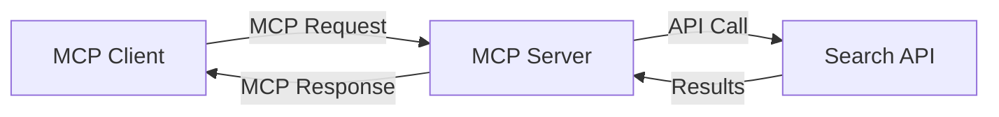
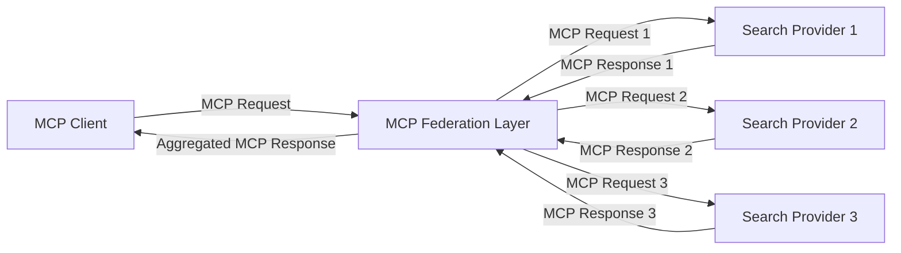
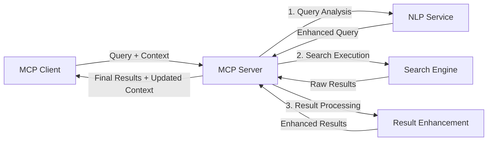

<!--
CO_OP_TRANSLATOR_METADATA:
{
  "original_hash": "eb12652eb7bd17f2193b835a344425c6",
  "translation_date": "2025-06-26T13:40:44+00:00",
  "source_file": "05-AdvancedTopics/mcp-realtimesearch/README.md",
  "language_code": "ur"
}
-->
## کوڈ مثالوں کا انکار

> **اہم نوٹ**: نیچے دی گئی کوڈ مثالیں Model Context Protocol (MCP) کو ویب سرچ کی فعالیت کے ساتھ مربوط کرنے کا مظاہرہ کرتی ہیں۔ اگرچہ یہ سرکاری MCP SDKs کے پیٹرنز اور ڈھانچوں کی پیروی کرتی ہیں، انہیں تعلیمی مقاصد کے لیے آسان بنایا گیا ہے۔
> 
> یہ مثالیں درج ذیل چیزوں کو دکھاتی ہیں:
> 
> 1. **پائتھن کی تنفیذ**: ایک FastMCP سرور کی تنفیذ جو ویب سرچ ٹول فراہم کرتی ہے اور ایک خارجی سرچ API سے جڑتی ہے۔ یہ مثال مناسب لائف اسپین مینجمنٹ، کانٹیکسٹ ہینڈلنگ، اور ٹول کی تنفیذ کو سرکاری MCP پائتھن SDK کے پیٹرنز کے مطابق ظاہر کرتی ہے۔ سرور تجویز کردہ Streamable HTTP ٹرانسپورٹ استعمال کرتا ہے جو پرانی SSE ٹرانسپورٹ کی جگہ لے چکا ہے جو پروڈکشن تعیناتیوں کے لیے بہتر ہے۔
> 
> 2. **جاوا اسکرپٹ کی تنفیذ**: TypeScript/JavaScript میں FastMCP پیٹرن کا استعمال کرتے ہوئے سرکاری MCP TypeScript SDK سے سرچ سرور بنانا، جس میں مناسب ٹول کی تعریفیں اور کلائنٹ کنکشن شامل ہیں۔ یہ تازہ ترین تجویز کردہ سیشن مینجمنٹ اور کانٹیکسٹ پریزرویشن کے پیٹرنز کی پیروی کرتا ہے۔
> 
> یہ مثالیں پروڈکشن میں استعمال کے لیے اضافی ایرر ہینڈلنگ، تصدیق، اور مخصوص API انضمام کوڈ کی ضرورت رکھتی ہیں۔ سرچ API اینڈپوائنٹس (`https://api.search-service.example/search`) صرف پلیس ہولڈر ہیں اور انہیں حقیقی سرچ سروس اینڈپوائنٹس سے بدلنا ہوگا۔
> 
> مکمل تفصیلات اور جدید ترین طریقوں کے لیے براہ کرم [سرکاری MCP وضاحت](https://spec.modelcontextprotocol.io/) اور SDK دستاویزات دیکھیں۔

## بنیادی تصورات

### ماڈل کانٹیکسٹ پروٹوکول (MCP) فریم ورک

بنیادی طور پر، Model Context Protocol AI ماڈلز، ایپلیکیشنز، اور سروسز کے درمیان کانٹیکسٹ کے تبادلے کا ایک معیاری طریقہ فراہم کرتا ہے۔ ریئل ٹائم ویب سرچ میں، یہ فریم ورک مربوط، کثیر دورانیہ تلاش کے تجربات کے لیے ضروری ہے۔ اہم اجزاء میں شامل ہیں:

1. **کلائنٹ-سرور فن تعمیر**: MCP سرچ کلائنٹس (درخواست دہندگان) اور سرچ سرورز (فراہم کنندگان) کے درمیان واضح تفریق قائم کرتا ہے، جو لچکدار تعیناتی ماڈلز کی اجازت دیتا ہے۔

2. **JSON-RPC کمیونیکیشن**: پروٹوکول میسج کے تبادلے کے لیے JSON-RPC استعمال کرتا ہے، جو ویب ٹیکنالوجیز کے ساتھ مطابقت رکھتا ہے اور مختلف پلیٹ فارمز پر آسانی سے نافذ کیا جا سکتا ہے۔

3. **کانٹیکسٹ مینجمنٹ**: MCP متعدد تعاملات کے دوران سرچ کانٹیکسٹ کو برقرار رکھنے، اپ ڈیٹ کرنے، اور استعمال کرنے کے لیے ساختہ طریقے متعین کرتا ہے۔

4. **ٹول کی تعریفیں**: سرچ کی صلاحیتوں کو معیاری ٹولز کے طور پر ظاہر کیا جاتا ہے جن کے واضح پیرامیٹرز اور نتائج ہوتے ہیں۔

5. **اسٹریمنگ سپورٹ**: پروٹوکول اسٹریمنگ نتائج کی حمایت کرتا ہے، جو ریئل ٹائم سرچ کے لیے ضروری ہے جہاں نتائج بتدریج موصول ہو سکتے ہیں۔

### ویب سرچ انضمام کے پیٹرنز

جب MCP کو ویب سرچ کے ساتھ مربوط کیا جاتا ہے، تو کئی پیٹرنز سامنے آتے ہیں:

#### 1. براہ راست سرچ فراہم کنندہ کا انضمام

اس پیٹرن میں، MCP سرور ایک یا زیادہ سرچ APIs کے ساتھ براہ راست رابطہ کرتا ہے، MCP درخواستوں کو API مخصوص کالز میں ترجمہ کرتا ہے اور نتائج کو MCP جوابات کی صورت میں فارمیٹ کرتا ہے۔

#### 2. متحدہ سرچ جس میں کانٹیکسٹ برقرار رکھا گیا ہو

یہ پیٹرن سرچ سوالات کو متعدد MCP-مطابق سرچ فراہم کنندگان میں تقسیم کرتا ہے، جو ہر ایک مختلف قسم کے مواد یا سرچ صلاحیتوں میں مہارت رکھتے ہیں، جبکہ متحدہ کانٹیکسٹ کو برقرار رکھا جاتا ہے۔

#### 3. کانٹیکسٹ کے ساتھ بہتر بنایا گیا سرچ چین

اس پیٹرن میں، سرچ کا عمل متعدد مراحل میں تقسیم کیا جاتا ہے، جہاں ہر مرحلے پر کانٹیکسٹ کو بڑھایا جاتا ہے، جس کے نتیجے میں نتائج بتدریج زیادہ متعلقہ ہوتے جاتے ہیں۔

### سرچ کانٹیکسٹ کے اجزاء

MCP پر مبنی ویب سرچ میں، کانٹیکسٹ عام طور پر شامل ہوتا ہے:

- **سوالات کی تاریخ**: سیشن میں پچھلے سرچ سوالات
- **صارف کی ترجیحات**: زبان، علاقہ، سیف سرچ سیٹنگز
- **تفاعل کی تاریخ**: کون سے نتائج پر کلک کیا گیا، نتائج پر گزارا گیا وقت
- **سرچ پیرامیٹرز**: فلٹرز، ترتیب کے قواعد، اور دیگر سرچ ترمیم کنندگان
- **موضوعی معلومات**: تلاش سے متعلق مخصوص موضوعی کانٹیکسٹ
- **وقتی کانٹیکسٹ**: وقت کی بنیاد پر مطابقت کے عوامل
- **ذرائع کی ترجیحات**: قابل اعتماد یا پسندیدہ معلومات کے ذرائع

## استعمال کے کیسز اور درخواستیں

### تحقیق اور معلومات کا جمع کرنا

MCP تحقیق کے کام کو بہتر بناتا ہے:

- تحقیق کے کانٹیکسٹ کو سرچ سیشنز کے دوران برقرار رکھنا
- زیادہ پیچیدہ اور کانٹیکسٹ کے لحاظ سے متعلقہ سوالات کی اجازت دینا
- متعدد ذرائع سے سرچ اتحاد کی حمایت کرنا
- سرچ نتائج سے علم نکالنے میں مدد دینا

### حقیقی وقت کی خبریں اور رجحانات کی نگرانی

MCP سے چلنے والا سرچ خبریں مانیٹر کرنے میں فوائد فراہم کرتا ہے:

- ابھرتی ہوئی خبریں تقریباً حقیقی وقت میں دریافت کرنا
- متعلقہ معلومات کا کانٹیکسچول فلٹرنگ
- متعدد ذرائع میں موضوعات اور اداروں کا ٹریک رکھنا
- صارف کے کانٹیکسٹ کی بنیاد پر ذاتی نوعیت کی نیوز الرٹس

### AI-مزید Browsing اور تحقیق

MCP AI سے بڑھائے گئے براؤزنگ کے لیے نئے امکانات پیدا کرتا ہے:

- موجودہ براؤزر کی سرگرمی کی بنیاد پر کانٹیکسچول سرچ تجاویز
- ویب سرچ کو LLM سے چلنے والے اسسٹنٹس کے ساتھ بغیر رکاوٹ مربوط کرنا
- کثیر دورانیہ سرچ میں کانٹیکسٹ کو برقرار رکھتے ہوئے بہتری
- حقائق کی جانچ اور معلومات کی تصدیق کو بہتر بنانا

## مستقبل کے رجحانات اور جدتیں

### ویب سرچ میں MCP کی ترقی

آگے دیکھتے ہوئے، ہم توقع کرتے ہیں کہ MCP درج ذیل مسائل کو حل کرنے کے لیے ترقی کرے گا:

- **کثیر الوضعی سرچ**: متن، تصویر، آڈیو، اور ویڈیو سرچ کو کانٹیکسٹ کے ساتھ مربوط کرنا
- **مرکزی سے آزاد سرچ**: تقسیم شدہ اور متحدہ سرچ ایکو سسٹمز کی حمایت کرنا
- **سرچ کی پرائیویسی**: کانٹیکسٹ سے آگاہ پرائیویسی محفوظ سرچ میکنزم
- **سوال کی سمجھ بوجھ**: قدرتی زبان کے سرچ سوالات کی گہری معنوی تجزیہ

### ٹیکنالوجی میں ممکنہ ترقیات

وہ ابھرتی ہوئی ٹیکنالوجیاں جو MCP سرچ کے مستقبل کو تشکیل دیں گی:

1. **نیورل سرچ فن تعمیرات**: MCP کے لیے بہتر بنائے گئے ایمبیڈنگ پر مبنی سرچ سسٹمز
2. **ذاتی نوعیت کا سرچ کانٹیکسٹ**: وقت کے ساتھ انفرادی صارف کے سرچ پیٹرنز سیکھنا
3. **نالج گراف انضمام**: مخصوص موضوعی نالج گرافز کے ذریعے کانٹیکسچول سرچ کو بہتر بنانا
4. **کراس-موڈل کانٹیکسٹ**: مختلف سرچ وضعوں میں کانٹیکسٹ کو برقرار رکھنا

## عملی مشقیں

### مشق 1: بنیادی MCP سرچ پائپ لائن قائم کرنا

اس مشق میں آپ سیکھیں گے کہ:
- ایک بنیادی MCP سرچ ماحول ترتیب دیں
- ویب سرچ کے لیے کانٹیکسٹ ہینڈلرز نافذ کریں
- سرچ کے مختلف دورانیوں میں کانٹیکسٹ کی حفاظت کی جانچ اور تصدیق کریں

### مشق 2: MCP سرچ کے ساتھ ایک تحقیق معاون بنانا

ایک مکمل ایپلیکیشن بنائیں جو:
- قدرتی زبان میں تحقیقی سوالات کو پروسیس کرے
- کانٹیکسٹ سے آگاہ ویب سرچ کرے
- متعدد ذرائع سے معلومات کو ترکیب کرے
- منظم تحقیقی نتائج پیش کرے

### مشق 3: MCP کے ساتھ کثیر ماخذ سرچ فیڈریشن نافذ کرنا

اعلیٰ درجے کی مشق جو شامل ہے:
- متعدد سرچ انجنز کو کانٹیکسٹ سے آگاہ سوالات بھیجنا
- نتائج کی درجہ بندی اور اجتماع
- سرچ نتائج کی کانٹیکسچول ڈپلیکیشن
- ماخذ مخصوص میٹا ڈیٹا کا انتظام

## اضافی وسائل

- [Model Context Protocol Specification](https://spec.modelcontextprotocol.io/) - سرکاری MCP وضاحت اور تفصیلی پروٹوکول دستاویزات
- [Model Context Protocol Documentation](https://modelcontextprotocol.io/) - تفصیلی ٹیوٹوریلز اور نفاذ کے رہنما خطوط
- [MCP Python SDK](https://github.com/modelcontextprotocol/python-sdk) - MCP پروٹوکول کی سرکاری پائتھن تنفیذ
- [MCP TypeScript SDK](https://github.com/modelcontextprotocol/typescript-sdk) - MCP پروٹوکول کی سرکاری ٹائپ اسکرپٹ تنفیذ
- [MCP Reference Servers](https://github.com/modelcontextprotocol/servers) - MCP سرورز کی حوالہ جاتی تنفیذات
- [Bing Web Search API Documentation](https://learn.microsoft.com/en-us/bing/search-apis/bing-web-search/overview) - مائیکروسافٹ کا ویب سرچ API
- [Google Custom Search JSON API](https://developers.google.com/custom-search/v1/overview) - گوگل کا پروگرام ایبل سرچ انجن
- [SerpAPI Documentation](https://serpapi.com/search-api) - سرچ انجن نتائج صفحہ API
- [Meilisearch Documentation](https://www.meilisearch.com/docs) - اوپن سورس سرچ انجن
- [Elasticsearch Documentation](https://www.elastic.co/guide/index.html) - تقسیم شدہ سرچ اور اینالیٹکس انجن
- [LangChain Documentation](https://python.langchain.com/docs/get_started/introduction) - LLMs کے ساتھ ایپلیکیشنز کی تعمیر

## سیکھنے کے نتائج

اس ماڈیول کو مکمل کرنے کے بعد، آپ قابل ہوں گے کہ:

- ریئل ٹائم ویب سرچ کی بنیادی باتوں اور اس کے چیلنجز کو سمجھیں
- وضاحت کریں کہ Model Context Protocol (MCP) ریئل ٹائم ویب سرچ صلاحیتوں کو کیسے بہتر بناتا ہے
- MCP پر مبنی سرچ حل معروف فریم ورکس اور APIs کے ذریعے نافذ کریں
- MCP کے ساتھ توسیع پذیر، اعلیٰ کارکردگی والے سرچ فن تعمیرات ڈیزائن اور تعینات کریں
- MCP تصورات کو مختلف استعمال کے کیسز جیسے معنوی سرچ، تحقیقی معاونت، اور AI-مزید براؤزنگ میں لاگو کریں
- MCP پر مبنی سرچ ٹیکنالوجیز میں ابھرتے ہوئے رجحانات اور مستقبل کی جدتوں کا جائزہ لیں

### اعتماد اور حفاظت کے پہلو

جب MCP پر مبنی ویب سرچ حل نافذ کریں، تو MCP وضاحت سے یہ اہم اصول یاد رکھیں:

1. **صارف کی رضا اور کنٹرول**: صارفین کو تمام ڈیٹا تک رسائی اور آپریشنز کی واضح رضامندی اور سمجھ ہونی چاہیے۔ یہ خاص طور پر ویب سرچ نفاذ کے لیے ضروری ہے جو خارجی ڈیٹا ذرائع تک رسائی کر سکتے ہیں۔

2. **ڈیٹا کی پرائیویسی**: سرچ سوالات اور نتائج کو مناسب طریقے سے ہینڈل کریں، خاص طور پر جب وہ حساس معلومات پر مشتمل ہوں۔ صارف کے ڈیٹا کی حفاظت کے لیے مناسب رسائی کنٹرول نافذ کریں۔

3. **ٹول کی حفاظت**: سرچ ٹولز کے لیے مناسب اجازت اور تصدیق نافذ کریں کیونکہ وہ غیر محفوظ کوڈ کے نفاذ کے ذریعے ممکنہ حفاظتی خطرات ہو سکتے ہیں۔ ٹول کے رویے کی وضاحتیں غیر معتبر سمجھی جائیں جب تک کہ وہ قابل اعتماد سرور سے حاصل نہ کی گئی ہوں۔

4. **واضح دستاویزات**: اپنے MCP پر مبنی سرچ نفاذ کی صلاحیتوں، حدود، اور حفاظتی پہلوؤں کے بارے میں واضح دستاویزات فراہم کریں، MCP وضاحت کے نفاذ کے رہنما خطوط کی پیروی کرتے ہوئے۔

5. **مضبوط رضامندی کے عمل**: ایسے مضبوط رضامندی اور اجازت کے عمل بنائیں جو ہر ٹول کے کام کو واضح طور پر بیان کریں، خاص طور پر ان ٹولز کے لیے جو خارجی ویب وسائل کے ساتھ تعامل کرتے ہیں۔

MCP سیکیورٹی اور اعتماد کے مکمل تفصیلات کے لیے، براہ کرم [سرکاری دستاویزات](https://modelcontextprotocol.io/specification/2025-03-26#security-and-trust-%26-safety) ملاحظہ کریں۔

## اگلا کیا ہے

- [5.11 Entra ID Authentication for Model Context Protocol Servers](../mcp-security-entra/README.md)

**ڈسکلیمر**:  
یہ دستاویز AI ترجمہ سروس [Co-op Translator](https://github.com/Azure/co-op-translator) کے ذریعے ترجمہ کی گئی ہے۔ اگرچہ ہم درستگی کے لیے کوشاں ہیں، براہ کرم اس بات سے آگاہ رہیں کہ خودکار تراجم میں غلطیاں یا عدم درستیاں ہو سکتی ہیں۔ اصل دستاویز اپنی مادری زبان میں ہی معتبر ماخذ سمجھی جانی چاہیے۔ اہم معلومات کے لیے پیشہ ور انسانی ترجمہ تجویز کیا جاتا ہے۔ ہم اس ترجمے کے استعمال سے پیدا ہونے والی کسی بھی غلط فہمی یا غلط تشریح کے ذمہ دار نہیں ہیں۔