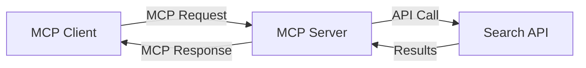
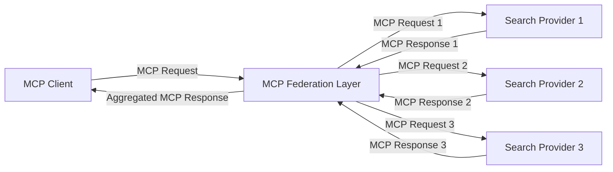
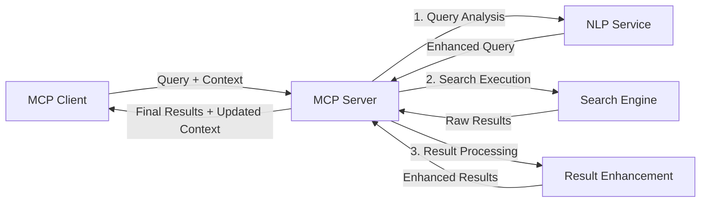

<!--
CO_OP_TRANSLATOR_METADATA:
{
  "original_hash": "16bef2c93c6a86d4ca6a8ce9e120e384",
  "translation_date": "2025-06-13T02:36:55+00:00",
  "source_file": "05-AdvancedTopics/mcp-realtimesearch/README.md",
  "language_code": "ur"
}
-->
## کوڈ مثالوں کا انکار

> **اہم نوٹ**: نیچے دی گئی کوڈ مثالیں Model Context Protocol (MCP) کو ویب سرچ فنکشنالٹی کے ساتھ انٹیگریٹ کرنے کا مظاہرہ کرتی ہیں۔ اگرچہ یہ سرکاری MCP SDKs کے پیٹرنز اور اسٹرکچرز کی پیروی کرتی ہیں، لیکن تعلیمی مقاصد کے لیے انہیں سادہ بنایا گیا ہے۔
> 
> یہ مثالیں درج ذیل دکھاتی ہیں:
> 
> 1. **پائتھن امپلیمنٹیشن**: FastMCP سرور کی امپلیمنٹیشن جو ایک ویب سرچ ٹول فراہم کرتی ہے اور ایک بیرونی سرچ API سے جڑتی ہے۔ یہ مثال مناسب لائف اسپین مینجمنٹ، کانٹیکسٹ ہینڈلنگ، اور ٹول امپلیمنٹیشن کو ظاہر کرتی ہے، جو [سرکاری MCP پائتھن SDK](https://github.com/modelcontextprotocol/python-sdk) کے پیٹرنز کی پیروی کرتی ہے۔ سرور سفارش کردہ Streamable HTTP ٹرانسپورٹ استعمال کرتا ہے جو پرانے SSE ٹرانسپورٹ کی جگہ لے چکا ہے۔
> 
> 2. **جاوا اسکرپٹ امپلیمنٹیشن**: FastMCP پیٹرن کا استعمال کرتے ہوئے TypeScript/JavaScript میں امپلیمنٹیشن، جو [سرکاری MCP TypeScript SDK](https://github.com/modelcontextprotocol/typescript-sdk) سے لی گئی ہے، تاکہ ایک سرچ سرور بنایا جا سکے جس میں مناسب ٹول تعریفیں اور کلائنٹ کنیکشنز ہوں۔ یہ تازہ ترین سفارش کردہ سیشن مینجمنٹ اور کانٹیکسٹ پریزرویشن کے پیٹرنز کی پیروی کرتا ہے۔
> 
> ان مثالوں کو پروڈکشن میں استعمال کے لیے اضافی ایرر ہینڈلنگ، تصدیق، اور مخصوص API انٹیگریشن کوڈ کی ضرورت ہوگی۔ دکھائے گئے سرچ API اینڈ پوائنٹس (`https://api.search-service.example/search`) صرف نمونے کے طور پر ہیں اور انہیں اصل سرچ سروس اینڈ پوائنٹس سے تبدیل کرنا ہوگا۔
> 
> مکمل امپلیمنٹیشن کی تفصیلات اور تازہ ترین طریقوں کے لیے، براہ کرم [سرکاری MCP وضاحت](https://spec.modelcontextprotocol.io/) اور SDK دستاویزات ملاحظہ کریں۔

## بنیادی تصورات

### Model Context Protocol (MCP) فریم ورک

بنیادی طور پر، Model Context Protocol AI ماڈلز، ایپلیکیشنز، اور سروسز کے درمیان کانٹیکسٹ کے تبادلے کے لیے ایک معیاری طریقہ فراہم کرتا ہے۔ ریئل ٹائم ویب سرچ میں، یہ فریم ورک مربوط، ملٹی ٹرن سرچ تجربات تخلیق کرنے کے لیے ضروری ہے۔ اہم اجزاء میں شامل ہیں:

1. **کلائنٹ-سرور آرکیٹیکچر**: MCP سرچ کلائنٹس (درخواست کنندگان) اور سرچ سرورز (فراہم کنندگان) کے درمیان واضح تفریق قائم کرتا ہے، جو لچکدار تعیناتی ماڈلز کی اجازت دیتا ہے۔

2. **JSON-RPC کمیونیکیشن**: یہ پروٹوکول پیغامات کے تبادلے کے لیے JSON-RPC استعمال کرتا ہے، جو ویب ٹیکنالوجیز کے ساتھ مطابقت رکھتا ہے اور مختلف پلیٹ فارمز پر آسانی سے نافذ کیا جا سکتا ہے۔

3. **کانٹیکسٹ مینجمنٹ**: MCP متعدد تعاملات کے دوران سرچ کانٹیکسٹ کو برقرار رکھنے، اپ ڈیٹ کرنے، اور استعمال کرنے کے لیے منظم طریقے متعین کرتا ہے۔

4. **ٹول کی تعریفیں**: سرچ کی صلاحیتوں کو معیاری ٹولز کے طور پر ظاہر کیا جاتا ہے جن کے واضح پیرامیٹرز اور ریٹرن ویلیوز ہوتی ہیں۔

5. **اسٹریمنگ سپورٹ**: پروٹوکول اسٹریمنگ نتائج کی حمایت کرتا ہے، جو ریئل ٹائم سرچ کے لیے ضروری ہے جہاں نتائج بتدریج موصول ہو سکتے ہیں۔

### ویب سرچ انٹیگریشن پیٹرنز

جب MCP کو ویب سرچ کے ساتھ انٹیگریٹ کیا جاتا ہے، تو کئی پیٹرنز سامنے آتے ہیں:

#### 1. براہ راست سرچ فراہم کنندہ انٹیگریشن

اس پیٹرن میں، MCP سرور براہ راست ایک یا زیادہ سرچ APIs کے ساتھ انٹرفیس کرتا ہے، MCP درخواستوں کو API مخصوص کالز میں ترجمہ کرتا ہے اور نتائج کو MCP جوابات کے طور پر فارمیٹ کرتا ہے۔

#### 2. کانٹیکسٹ پریزرویشن کے ساتھ فیڈریٹڈ سرچ

یہ پیٹرن متعدد MCP-مطابقت رکھنے والے سرچ فراہم کنندگان میں سرچ سوالات تقسیم کرتا ہے، ہر ایک ممکنہ طور پر مختلف قسم کے مواد یا سرچ صلاحیتوں میں مہارت رکھتا ہے، جبکہ متحدہ کانٹیکسٹ کو برقرار رکھتا ہے۔

#### 3. کانٹیکسٹ سے بہتر بنایا گیا سرچ چین

اس پیٹرن میں، سرچ عمل کو متعدد مراحل میں تقسیم کیا جاتا ہے، ہر مرحلے پر کانٹیکسٹ کو بہتر بنایا جاتا ہے، جس کے نتیجے میں بتدریج زیادہ متعلقہ نتائج حاصل ہوتے ہیں۔

### سرچ کانٹیکسٹ کے اجزاء

MCP پر مبنی ویب سرچ میں، کانٹیکسٹ عام طور پر شامل ہوتا ہے:

- **سوالات کی تاریخ**: سیشن میں پچھلے سرچ سوالات
- **صارف کی ترجیحات**: زبان، علاقہ، سیف سرچ سیٹنگز
- **تعلقات کی تاریخ**: کون سے نتائج پر کلک کیا گیا، نتائج پر گزارا گیا وقت
- **سرچ پیرامیٹرز**: فلٹرز، ترتیب کے اصول، اور دیگر سرچ ماڈیفائرز
- **ڈومین نالج**: متعلقہ موضوعاتی کانٹیکسٹ
- **وقتی کانٹیکسٹ**: وقت کی بنیاد پر متعلقہ عوامل
- **ذریعہ کی ترجیحات**: معتبر یا پسندیدہ معلومات کے ذرائع

## استعمال کے کیسز اور ایپلیکیشنز

### تحقیق اور معلومات جمع کرنا

MCP تحقیق کے ورک فلو کو بہتر بناتا ہے:

- تحقیق کے کانٹیکسٹ کو سرچ سیشنز میں محفوظ رکھنا
- زیادہ پیچیدہ اور کانٹیکسٹ کے لحاظ سے متعلقہ سوالات کی اجازت دینا
- ملٹی سورس سرچ فیڈریشن کی حمایت کرنا
- سرچ نتائج سے علم نکالنے میں مدد دینا

### ریئل ٹائم نیوز اور رجحان مانیٹرنگ

MCP سے چلنے والی سرچ نیوز مانیٹرنگ کے لیے فوائد پیش کرتی ہے:

- ابھرتی ہوئی خبریں تقریباً فوری دریافت کرنا
- متعلقہ معلومات کا کانٹیکسچوئل فلٹرنگ
- متعدد ذرائع میں موضوع اور ادارے کی ٹریکنگ
- صارف کے کانٹیکسٹ کی بنیاد پر ذاتی نوعیت کی نیوز الرٹس

### AI-معاونت یافتہ براؤزنگ اور تحقیق

MCP AI-معاونت یافتہ براؤزنگ کے لیے نئے امکانات پیدا کرتا ہے:

- موجودہ براؤزر سرگرمی کی بنیاد پر کانٹیکسچوئل سرچ تجاویز
- ویب سرچ کو LLM سے چلنے والے اسسٹنٹس کے ساتھ بے درز انٹیگریشن
- کانٹیکسٹ برقرار رکھتے ہوئے ملٹی ٹرن سرچ ریفائنمنٹ
- حقائق کی جانچ اور معلومات کی تصدیق میں بہتری

## مستقبل کے رجحانات اور جدتیں

### ویب سرچ میں MCP کی ترقی

آگے دیکھتے ہوئے، ہم توقع کرتے ہیں کہ MCP درج ذیل مسائل کو حل کرنے کے لیے ترقی کرے گا:

- **ملٹی موڈل سرچ**: متن، تصویر، آڈیو، اور ویڈیو سرچ کو کانٹیکسٹ کے ساتھ مربوط کرنا
- **مرکوز نہیں کردہ سرچ**: تقسیم شدہ اور فیڈریٹڈ سرچ ماحولیاتی نظام کی حمایت
- **سرچ پرائیویسی**: کانٹیکسٹ-آگاہ پرائیویسی تحفظ والے سرچ میکانزم
- **سوال کی سمجھ بوجھ**: قدرتی زبان کے سرچ سوالات کی گہری معنوی تشریح

### ٹیکنالوجی میں ممکنہ ترقیات

وہ ابھرتی ہوئی ٹیکنالوجیز جو MCP سرچ کے مستقبل کو تشکیل دیں گی:

1. **نیورل سرچ آرکیٹیکچرز**: ایمبیڈنگ پر مبنی سرچ سسٹمز جو MCP کے لیے بہتر ہیں
2. **ذاتی نوعیت کا سرچ کانٹیکسٹ**: وقت کے ساتھ انفرادی صارف کے سرچ پیٹرنز سیکھنا
3. **نالج گراف انٹیگریشن**: ڈومین مخصوص نالج گرافز کے ذریعے کانٹیکسچوئل سرچ کی بہتری
4. **کراس موڈل کانٹیکسٹ**: مختلف سرچ موڈالٹیز کے درمیان کانٹیکسٹ کو برقرار رکھنا

## عملی مشقیں

### مشق 1: بنیادی MCP سرچ پائپ لائن قائم کرنا

اس مشق میں، آپ سیکھیں گے کہ کیسے:
- ایک بنیادی MCP سرچ ماحول تشکیل دیا جائے
- ویب سرچ کے لیے کانٹیکسٹ ہینڈلرز نافذ کیے جائیں
- سرچ تکراروں کے دوران کانٹیکسٹ کی حفاظت کو ٹیسٹ اور ویلیڈیٹ کیا جائے

### مشق 2: MCP سرچ کے ساتھ تحقیقاتی اسسٹنٹ بنانا

ایک مکمل ایپلیکیشن بنائیں جو:
- قدرتی زبان میں تحقیقی سوالات کو پراسیس کرے
- کانٹیکسٹ-آگاہ ویب سرچ کرے
- متعدد ذرائع سے معلومات کو یکجا کرے
- منظم تحقیقی نتائج پیش کرے

### مشق 3: MCP کے ساتھ ملٹی سورس سرچ فیڈریشن نافذ کرنا

اعلی درجے کی مشق جو شامل ہے:
- متعدد سرچ انجنز کو کانٹیکسٹ-آگاہ سوالات بھیجنا
- نتائج کی درجہ بندی اور یکجا کرنا
- سرچ نتائج کی کانٹیکسچوئل ڈپلیکیشن
- ذریعہ مخصوص میٹا ڈیٹا کو ہینڈل کرنا

## اضافی وسائل

- [Model Context Protocol Specification](https://spec.modelcontextprotocol.io/) - سرکاری MCP وضاحت اور تفصیلی پروٹوکول دستاویزات
- [Model Context Protocol Documentation](https://modelcontextprotocol.io/) - تفصیلی ٹیوٹوریلز اور امپلیمنٹیشن گائیڈز
- [MCP Python SDK](https://github.com/modelcontextprotocol/python-sdk) - MCP پروٹوکول کی سرکاری پائتھن امپلیمنٹیشن
- [MCP TypeScript SDK](https://github.com/modelcontextprotocol/typescript-sdk) - MCP پروٹوکول کی سرکاری ٹائپ اسکرپٹ امپلیمنٹیشن
- [MCP Reference Servers](https://github.com/modelcontextprotocol/servers) - MCP سرورز کی ریفرنس امپلیمنٹیشنز
- [Bing Web Search API Documentation](https://learn.microsoft.com/en-us/bing/search-apis/bing-web-search/overview) - مائیکروسافٹ کا ویب سرچ API
- [Google Custom Search JSON API](https://developers.google.com/custom-search/v1/overview) - گوگل کا پروگرام ایبل سرچ انجن
- [SerpAPI Documentation](https://serpapi.com/search-api) - سرچ انجن رزلٹس پیج API
- [Meilisearch Documentation](https://www.meilisearch.com/docs) - اوپن سورس سرچ انجن
- [Elasticsearch Documentation](https://www.elastic.co/guide/index.html) - تقسیم شدہ سرچ اور اینالیٹکس انجن
- [LangChain Documentation](https://python.langchain.com/docs/get_started/introduction) - LLMs کے ساتھ ایپلیکیشنز بنانے کے لیے

## سیکھنے کے نتائج

اس ماڈیول کو مکمل کرنے کے بعد، آپ قابل ہوں گے:

- ریئل ٹائم ویب سرچ کی بنیادی باتوں اور اس کے چیلنجز کو سمجھنا
- وضاحت کرنا کہ Model Context Protocol (MCP) ریئل ٹائم ویب سرچ صلاحیتوں کو کیسے بڑھاتا ہے
- MCP پر مبنی سرچ حل کو مقبول فریم ورکس اور APIs کے ذریعے نافذ کرنا
- MCP کے ساتھ اسکیل ایبل، ہائی پرفارمنس سرچ آرکیٹیکچرز ڈیزائن اور تعینات کرنا
- MCP تصورات کو مختلف استعمال کے کیسز میں لاگو کرنا، بشمول سیمانٹک سرچ، تحقیقی معاونت، اور AI-معاونت یافتہ براؤزنگ
- MCP پر مبنی سرچ ٹیکنالوجیز میں ابھرتے ہوئے رجحانات اور مستقبل کی جدتوں کا جائزہ لینا

### اعتماد اور حفاظت کے امور

جب MCP پر مبنی ویب سرچ حل نافذ کر رہے ہوں، تو MCP وضاحت سے یہ اہم اصول یاد رکھیں:

1. **صارف کی رضامندی اور کنٹرول**: صارفین کو تمام ڈیٹا تک رسائی اور آپریشنز کے بارے میں واضح رضامندی اور سمجھ ہونی چاہیے۔ یہ خاص طور پر ویب سرچ امپلیمنٹیشنز کے لیے اہم ہے جو بیرونی ڈیٹا ذرائع تک رسائی کر سکتی ہیں۔

2. **ڈیٹا کی رازداری**: سرچ سوالات اور نتائج کو مناسب طریقے سے ہینڈل کریں، خاص طور پر جب ان میں حساس معلومات ہو سکتی ہو۔ صارف کے ڈیٹا کی حفاظت کے لیے مناسب رسائی کنٹرولز نافذ کریں۔

3. **ٹول کی حفاظت**: سرچ ٹولز کے لیے مناسب اجازت نامہ اور تصدیق نافذ کریں، کیونکہ یہ غیر محتاط کوڈ کے ذریعے سیکیورٹی خطرات پیدا کر سکتے ہیں۔ ٹول کے رویے کی تفصیلات کو صرف معتبر سرور سے حاصل ہونے پر قابل اعتماد سمجھیں۔

4. **واضح دستاویزات**: اپنے MCP پر مبنی سرچ نفاذ کے بارے میں صلاحیتوں، حدود، اور سیکیورٹی کے پہلوؤں کی واضح دستاویزات فراہم کریں، MCP وضاحت میں دی گئی رہنما خطوط کی پیروی کرتے ہوئے۔

5. **مضبوط رضامندی کے عمل**: ایسے مضبوط رضامندی اور اجازت کے عمل تیار کریں جو ہر ٹول کے کام کو واضح طور پر بیان کریں، خاص طور پر وہ ٹولز جو بیرونی ویب وسائل کے ساتھ تعامل کرتے ہیں۔

MCP سیکیورٹی اور اعتماد و حفاظت کے مکمل تفصیلات کے لیے، براہ کرم [سرکاری دستاویزات](https://modelcontextprotocol.io/specification/2025-03-26#security-and-trust-%26-safety) ملاحظہ کریں۔

## اگلا کیا ہے

- [6. کمیونٹی تعاون](../../06-CommunityContributions/README.md)

**ڈس کلیمر**:  
یہ دستاویز AI ترجمہ سروس [Co-op Translator](https://github.com/Azure/co-op-translator) کا استعمال کرتے ہوئے ترجمہ کی گئی ہے۔ اگرچہ ہم درستگی کے لیے کوشاں ہیں، براہ کرم اس بات سے آگاہ رہیں کہ خودکار تراجم میں غلطیاں یا غیر یقینی باتیں ہو سکتی ہیں۔ اصل دستاویز اپنی مادری زبان میں معتبر ماخذ سمجھی جانی چاہیے۔ اہم معلومات کے لیے پیشہ ور انسانی ترجمہ کی سفارش کی جاتی ہے۔ ہم اس ترجمے کے استعمال سے پیدا ہونے والی کسی بھی غلط فہمی یا غلط تشریح کے ذمہ دار نہیں ہیں۔