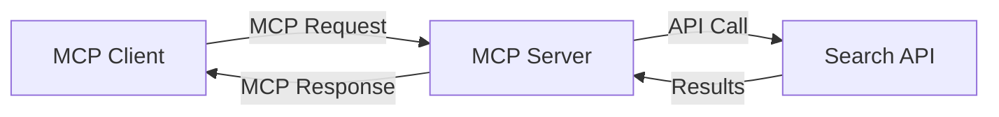
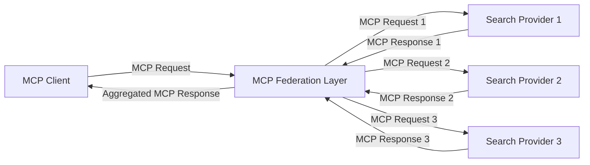
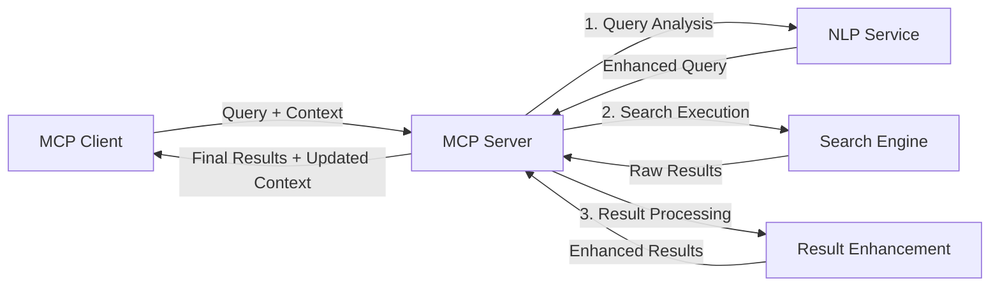

<!--
CO_OP_TRANSLATOR_METADATA:
{
  "original_hash": "333a03e51f90bdf3e6f1ba1694c73f36",
  "translation_date": "2025-07-16T23:48:18+00:00",
  "source_file": "05-AdvancedTopics/mcp-realtimesearch/README.md",
  "language_code": "ur"
}
-->
## کوڈ کی مثالوں کا انکار

> **اہم نوٹ**: نیچے دی گئی کوڈ کی مثالیں Model Context Protocol (MCP) کو ویب سرچ فنکشنالٹی کے ساتھ مربوط کرنے کا مظاہرہ کرتی ہیں۔ اگرچہ یہ سرکاری MCP SDKs کے پیٹرنز اور ڈھانچوں کی پیروی کرتی ہیں، لیکن تعلیمی مقاصد کے لیے انہیں آسان بنایا گیا ہے۔
> 
> یہ مثالیں درج ذیل چیزوں کو ظاہر کرتی ہیں:
> 
> 1. **پائتھن امپلیمنٹیشن**: ایک FastMCP سرور امپلیمنٹیشن جو ویب سرچ ٹول فراہم کرتی ہے اور ایک بیرونی سرچ API سے جڑتی ہے۔ یہ مثال مناسب لائف اسپین مینجمنٹ، کانٹیکسٹ ہینڈلنگ، اور ٹول امپلیمنٹیشن کو سرکاری MCP پائتھن SDK کے پیٹرنز کے مطابق دکھاتی ہے۔ سرور تجویز کردہ Streamable HTTP ٹرانسپورٹ استعمال کرتا ہے جو پرانے SSE ٹرانسپورٹ کی جگہ لے چکا ہے۔
> 
> 2. **جاوا اسکرپٹ امپلیمنٹیشن**: ایک ٹائپ اسکرپٹ/جاوا اسکرپٹ امپلیمنٹیشن جو FastMCP پیٹرن استعمال کرتی ہے، سرکاری MCP ٹائپ اسکرپٹ SDK سے، تاکہ ایک سرچ سرور بنایا جا سکے جس میں مناسب ٹول ڈیفینیشنز اور کلائنٹ کنکشنز ہوں۔ یہ سیشن مینجمنٹ اور کانٹیکسٹ پریزرویشن کے جدید ترین پیٹرنز کی پیروی کرتی ہے۔
> 
> یہ مثالیں پروڈکشن استعمال کے لیے اضافی ایرر ہینڈلنگ، توثیق، اور مخصوص API انٹیگریشن کوڈ کی ضرورت رکھتی ہیں۔ دکھائے گئے سرچ API اینڈپوائنٹس (`https://api.search-service.example/search`) صرف جگہ دار ہیں اور انہیں حقیقی سرچ سروس اینڈپوائنٹس سے تبدیل کرنا ہوگا۔
> 
> مکمل امپلیمنٹیشن کی تفصیلات اور جدید ترین طریقوں کے لیے براہ کرم سرکاری MCP وضاحت اور SDK دستاویزات ملاحظہ کریں۔

## بنیادی تصورات

### ماڈل کانٹیکسٹ پروٹوکول (MCP) فریم ورک

اپنے بنیادی اصول میں، Model Context Protocol ایک معیاری طریقہ فراہم کرتا ہے جس کے ذریعے AI ماڈلز، ایپلیکیشنز، اور سروسز کانٹیکسٹ کا تبادلہ کر سکیں۔ ریئل ٹائم ویب سرچ میں، یہ فریم ورک مربوط، کثیر مرحلہ سرچ تجربات بنانے کے لیے ناگزیر ہے۔ اہم اجزاء میں شامل ہیں:

1. **کلائنٹ-سرور آرکیٹیکچر**: MCP سرچ کلائنٹس (درخواست کنندگان) اور سرچ سرورز (فراہم کنندگان) کے درمیان واضح تفریق قائم کرتا ہے، جو لچکدار تعیناتی ماڈلز کی اجازت دیتا ہے۔

2. **JSON-RPC کمیونیکیشن**: پروٹوکول پیغامات کے تبادلے کے لیے JSON-RPC استعمال کرتا ہے، جو ویب ٹیکنالوجیز کے ساتھ مطابقت رکھتا ہے اور مختلف پلیٹ فارمز پر آسانی سے نافذ کیا جا سکتا ہے۔

3. **کانٹیکسٹ مینجمنٹ**: MCP متعدد تعاملات کے دوران سرچ کانٹیکسٹ کو برقرار رکھنے، اپ ڈیٹ کرنے، اور استعمال کرنے کے لیے منظم طریقے متعین کرتا ہے۔

4. **ٹول ڈیفینیشنز**: سرچ کی صلاحیتوں کو معیاری ٹولز کے طور پر ظاہر کیا جاتا ہے جن کے واضح پیرامیٹرز اور واپسی کی قدریں ہوتی ہیں۔

5. **اسٹریمنگ سپورٹ**: پروٹوکول اسٹریمنگ نتائج کی حمایت کرتا ہے، جو ریئل ٹائم سرچ کے لیے ضروری ہے جہاں نتائج بتدریج موصول ہو سکتے ہیں۔

### ویب سرچ انٹیگریشن پیٹرنز

جب MCP کو ویب سرچ کے ساتھ مربوط کیا جاتا ہے، تو کئی پیٹرنز سامنے آتے ہیں:

#### 1. براہ راست سرچ فراہم کنندہ انٹیگریشن

اس پیٹرن میں، MCP سرور براہ راست ایک یا زیادہ سرچ APIs کے ساتھ انٹرفیس کرتا ہے، MCP درخواستوں کو API مخصوص کالز میں ترجمہ کرتا ہے اور نتائج کو MCP جوابات کی شکل دیتا ہے۔

#### 2. کانٹیکسٹ پریزرویشن کے ساتھ فیڈریٹڈ سرچ

یہ پیٹرن سرچ کوئریز کو متعدد MCP مطابقت رکھنے والے سرچ فراہم کنندگان میں تقسیم کرتا ہے، جو ہر ایک مختلف قسم کے مواد یا سرچ صلاحیتوں میں مہارت رکھ سکتا ہے، جبکہ متحدہ کانٹیکسٹ کو برقرار رکھتا ہے۔

#### 3. کانٹیکسٹ سے بہتر بنایا گیا سرچ چین

اس پیٹرن میں، سرچ عمل کو متعدد مراحل میں تقسیم کیا جاتا ہے، جہاں ہر مرحلے پر کانٹیکسٹ کو بہتر بنایا جاتا ہے، جس کے نتیجے میں بتدریج زیادہ متعلقہ نتائج حاصل ہوتے ہیں۔

### سرچ کانٹیکسٹ کے اجزاء

MCP پر مبنی ویب سرچ میں، کانٹیکسٹ عام طور پر شامل ہوتا ہے:

- **کوئری ہسٹری**: سیشن میں پچھلی سرچ کوئریز
- **صارف کی ترجیحات**: زبان، علاقہ، سیف سرچ سیٹنگز
- **انٹریکشن ہسٹری**: کون سے نتائج پر کلک کیا گیا، نتائج پر گزارا گیا وقت
- **سرچ پیرامیٹرز**: فلٹرز، ترتیب کے اصول، اور دیگر سرچ موڈیفائرز
- **ڈومین نالج**: موضوع سے متعلق کانٹیکسٹ جو سرچ کے لیے اہم ہو
- **عصری کانٹیکسٹ**: وقت کی بنیاد پر متعلقہ عوامل
- **ذرائع کی ترجیحات**: معتبر یا پسندیدہ معلومات کے ذرائع

## استعمال کے کیسز اور ایپلیکیشنز

### تحقیق اور معلومات کا حصول

MCP تحقیق کے ورک فلو کو بہتر بناتا ہے:

- تحقیق کے کانٹیکسٹ کو سرچ سیشنز کے دوران محفوظ رکھنا
- زیادہ پیچیدہ اور کانٹیکسٹ کے لحاظ سے متعلقہ کوئریز کی اجازت دینا
- کثیر ماخذ سرچ فیڈریشن کی حمایت کرنا
- سرچ نتائج سے علم نکالنے کی سہولت فراہم کرنا

### ریئل ٹائم نیوز اور رجحانات کی نگرانی

MCP سے چلنے والی سرچ نیوز مانیٹرنگ کے لیے فوائد فراہم کرتی ہے:

- ابھرتی ہوئی خبریں تقریباً حقیقی وقت میں دریافت کرنا
- متعلقہ معلومات کی کانٹیکسچول فلٹرنگ
- متعدد ذرائع میں موضوعات اور اداروں کا ٹریک رکھنا
- صارف کے کانٹیکسٹ کی بنیاد پر ذاتی نوعیت کی نیوز الرٹس

### AI سے معاونت یافتہ براؤزنگ اور تحقیق

MCP AI سے معاونت یافتہ براؤزنگ کے لیے نئی ممکنات پیدا کرتا ہے:

- موجودہ براؤزر سرگرمی کی بنیاد پر کانٹیکسچول سرچ تجاویز
- ویب سرچ کو LLM سے چلنے والے اسسٹنٹس کے ساتھ بغیر رکاوٹ مربوط کرنا
- برقرار رکھے گئے کانٹیکسٹ کے ساتھ کثیر مرحلہ سرچ کی بہتری
- حقائق کی جانچ اور معلومات کی تصدیق کو بہتر بنانا

## مستقبل کے رجحانات اور جدتیں

### ویب سرچ میں MCP کی ترقی

آگے دیکھتے ہوئے، ہم توقع کرتے ہیں کہ MCP درج ذیل مسائل کو حل کرنے کے لیے ترقی کرے گا:

- **کثیر النوع سرچ**: متن، تصویر، آڈیو، اور ویڈیو سرچ کو محفوظ کانٹیکسٹ کے ساتھ مربوط کرنا
- **مرکزی کنٹرول سے آزاد سرچ**: تقسیم شدہ اور فیڈریٹڈ سرچ ماحولیاتی نظام کی حمایت کرنا
- **تلاش کی رازداری**: سیاق و سباق سے آگاہ، رازداری کو برقرار رکھنے والے تلاش کے طریقے  
- **سوال کی سمجھ بوجھ**: قدرتی زبان کے تلاش کے سوالات کی گہری معنوی تجزیہ  

### ٹیکنالوجی میں ممکنہ ترقیات  

وہ ابھرتی ہوئی ٹیکنالوجیز جو MCP تلاش کے مستقبل کی تشکیل کریں گی:  

1. **نیورل سرچ آرکیٹیکچرز**: ایمبیڈنگ پر مبنی تلاش کے نظام جو MCP کے لیے بہتر بنائے گئے ہیں  
2. **ذاتی نوعیت کی تلاش کا سیاق و سباق**: وقت کے ساتھ انفرادی صارف کے تلاش کے نمونوں کو سیکھنا  
3. **نالج گراف انٹیگریشن**: مخصوص شعبے کے نالج گرافز کے ذریعے سیاق و سباق سے بھرپور تلاش  
4. **کراس-موڈل سیاق و سباق**: مختلف تلاش کے طریقوں کے درمیان سیاق و سباق کو برقرار رکھنا  

## عملی مشقیں  

### مشق 1: ایک بنیادی MCP تلاش پائپ لائن قائم کرنا  

اس مشق میں، آپ سیکھیں گے کہ:  
- ایک بنیادی MCP تلاش کا ماحول کیسے ترتیب دیا جائے  
- ویب تلاش کے لیے سیاق و سباق کے ہینڈلرز کو نافذ کریں  
- تلاش کے مختلف ادوار میں سیاق و سباق کی حفاظت کی جانچ اور تصدیق کریں  

### مشق 2: MCP تلاش کے ساتھ ایک تحقیقی معاون تیار کرنا  

ایک مکمل ایپلیکیشن بنائیں جو:  
- قدرتی زبان میں تحقیقی سوالات کو پروسیس کرے  
- سیاق و سباق سے آگاہ ویب تلاش انجام دے  
- متعدد ذرائع سے معلومات کو یکجا کرے  
- منظم تحقیقی نتائج پیش کرے  

### مشق 3: MCP کے ساتھ کثیر ماخذ تلاش فیڈریشن کو نافذ کرنا  

اعلیٰ درجے کی مشق جو شامل ہے:  
- متعدد تلاش انجنوں کو سیاق و سباق سے آگاہ سوالات بھیجنا  
- نتائج کی درجہ بندی اور مجموعہ  
- تلاش کے نتائج کی سیاق و سباق کی بنیاد پر نقل کو ختم کرنا  
- ماخذ مخصوص میٹا ڈیٹا کا انتظام  

## اضافی وسائل  

- [Model Context Protocol Specification](https://spec.modelcontextprotocol.io/) - MCP کا سرکاری وضاحتی دستاویز اور تفصیلی پروٹوکول  
- [Model Context Protocol Documentation](https://modelcontextprotocol.io/) - تفصیلی ٹیوٹوریلز اور نفاذ کے رہنما  
- [MCP Python SDK](https://github.com/modelcontextprotocol/python-sdk) - MCP پروٹوکول کا سرکاری پائتھون نفاذ  
- [MCP TypeScript SDK](https://github.com/modelcontextprotocol/typescript-sdk) - MCP پروٹوکول کا سرکاری ٹائپ اسکرپٹ نفاذ  
- [MCP Reference Servers](https://github.com/modelcontextprotocol/servers) - MCP سرورز کے حوالہ جاتی نفاذ  
- [Bing Web Search API Documentation](https://learn.microsoft.com/en-us/bing/search-apis/bing-web-search/overview) - مائیکروسافٹ کا ویب سرچ API  
- [Google Custom Search JSON API](https://developers.google.com/custom-search/v1/overview) - گوگل کا پروگرام ایبل سرچ انجن  
- [SerpAPI Documentation](https://serpapi.com/search-api) - سرچ انجن کے نتائج کے صفحے کا API  
- [Meilisearch Documentation](https://www.meilisearch.com/docs) - اوپن سورس سرچ انجن  
- [Elasticsearch Documentation](https://www.elastic.co/guide/index.html) - تقسیم شدہ تلاش اور تجزیاتی انجن  
- [LangChain Documentation](https://python.langchain.com/docs/get_started/introduction) - LLMs کے ساتھ ایپلیکیشنز کی تعمیر  

## سیکھنے کے نتائج  

اس ماڈیول کو مکمل کرنے کے بعد، آپ قابل ہوں گے کہ:  

- حقیقی وقت کی ویب تلاش کے بنیادی اصول اور اس کے چیلنجز کو سمجھیں  
- وضاحت کریں کہ Model Context Protocol (MCP) کس طرح حقیقی وقت کی ویب تلاش کی صلاحیتوں کو بہتر بناتا ہے  
- MCP پر مبنی تلاش کے حل کو مقبول فریم ورکس اور APIs کے ذریعے نافذ کریں  
- MCP کے ساتھ اسکیل ایبل، اعلیٰ کارکردگی والے تلاش کے آرکیٹیکچرز کو ڈیزائن اور تعینات کریں  
- MCP کے تصورات کو مختلف استعمال کے معاملات جیسے معنوی تلاش، تحقیقی معاونت، اور AI سے مدد یافتہ براؤزنگ میں لاگو کریں  
- MCP پر مبنی تلاش کی ٹیکنالوجیز میں ابھرتے ہوئے رجحانات اور مستقبل کی جدتوں کا جائزہ لیں  

### اعتماد اور حفاظت کے پہلو  

جب MCP پر مبنی ویب تلاش کے حل نافذ کر رہے ہوں، تو MCP وضاحت سے یہ اہم اصول یاد رکھیں:  

1. **صارف کی رضامندی اور کنٹرول**: صارفین کو تمام ڈیٹا تک رسائی اور آپریشنز کی واضح رضامندی اور سمجھ ہونی چاہیے۔ یہ خاص طور پر ویب تلاش کے نفاذ کے لیے اہم ہے جو بیرونی ڈیٹا ذرائع تک رسائی حاصل کر سکتے ہیں۔  

2. **ڈیٹا کی رازداری**: تلاش کے سوالات اور نتائج کو مناسب طریقے سے سنبھالیں، خاص طور پر جب وہ حساس معلومات پر مشتمل ہوں۔ صارف کے ڈیٹا کی حفاظت کے لیے مناسب رسائی کنٹرول نافذ کریں۔  

3. **ٹول کی حفاظت**: تلاش کے ٹولز کے لیے مناسب اجازت اور تصدیق نافذ کریں، کیونکہ یہ غیر مجاز کوڈ کے نفاذ کے ذریعے ممکنہ سیکیورٹی خطرات پیدا کر سکتے ہیں۔ ٹول کے رویے کی وضاحت کو تب تک غیر معتبر سمجھیں جب تک کہ وہ معتبر سرور سے حاصل نہ کی گئی ہو۔  

4. **واضح دستاویزات**: MCP پر مبنی تلاش کے نفاذ کی صلاحیتوں، حدود، اور سیکیورٹی پہلوؤں کے بارے میں واضح دستاویزات فراہم کریں، MCP وضاحت کے نفاذ کے رہنما خطوط کی پیروی کرتے ہوئے۔  

5. **مضبوط رضامندی کے عمل**: مضبوط رضامندی اور اجازت کے عمل بنائیں جو ہر ٹول کے کام کو واضح طور پر بیان کریں اس سے پہلے کہ اس کے استعمال کی اجازت دی جائے، خاص طور پر ایسے ٹولز کے لیے جو بیرونی ویب وسائل کے ساتھ تعامل کرتے ہیں۔  

MCP کی سیکیورٹی اور اعتماد و حفاظت کے مکمل تفصیلات کے لیے، [سرکاری دستاویزات](https://modelcontextprotocol.io/specification/2025-03-26#security-and-trust-%26-safety) ملاحظہ کریں۔  

## آگے کیا ہے  

- [5.12 Entra ID Authentication for Model Context Protocol Servers](../mcp-security-entra/README.md)

**دستخطی نوٹ**:  
یہ دستاویز AI ترجمہ سروس [Co-op Translator](https://github.com/Azure/co-op-translator) کے ذریعے ترجمہ کی گئی ہے۔ اگرچہ ہم درستگی کے لیے کوشاں ہیں، براہ کرم آگاہ رہیں کہ خودکار ترجمے میں غلطیاں یا عدم درستیاں ہو سکتی ہیں۔ اصل دستاویز اپنی مادری زبان میں ہی معتبر ماخذ سمجھی جانی چاہیے۔ اہم معلومات کے لیے پیشہ ور انسانی ترجمہ کی سفارش کی جاتی ہے۔ اس ترجمے کے استعمال سے پیدا ہونے والی کسی بھی غلط فہمی یا غلط تشریح کی ذمہ داری ہم پر عائد نہیں ہوتی۔