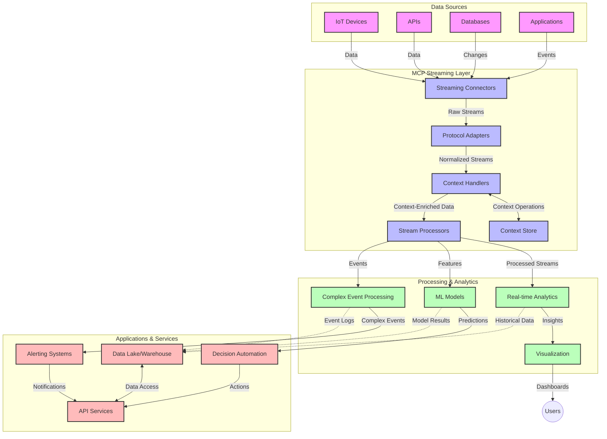

<!--
CO_OP_TRANSLATOR_METADATA:
{
  "original_hash": "68c518dbff8a3b127ed2aa934054c56c",
  "translation_date": "2025-06-11T16:59:23+00:00",
  "source_file": "05-AdvancedTopics/mcp-realtimestreaming/README.md",
  "language_code": "ur"
}
-->
# ماڈل کانٹیکسٹ پروٹوکول برائے حقیقی وقت ڈیٹا اسٹریمینگ

## جائزہ

حقیقی وقت ڈیٹا اسٹریمینگ آج کے ڈیٹا سے چلنے والے دنیا میں نہایت ضروری ہو چکا ہے، جہاں کاروبار اور ایپلیکیشنز فوری معلومات تک رسائی چاہتے ہیں تاکہ بروقت فیصلے کر سکیں۔ ماڈل کانٹیکسٹ پروٹوکول (MCP) ان حقیقی وقت اسٹریمینگ کے عمل کو بہتر بنانے میں ایک اہم پیش رفت ہے، جو ڈیٹا پروسیسنگ کی کارکردگی کو بڑھاتا ہے، سیاق و سباق کی سالمیت کو برقرار رکھتا ہے، اور مجموعی نظام کی کارکردگی کو بہتر بناتا ہے۔

یہ ماڈیول اس بات کی وضاحت کرتا ہے کہ MCP کس طرح AI ماڈلز، اسٹریمینگ پلیٹ فارمز، اور ایپلیکیشنز کے درمیان سیاق و سباق کے انتظام کے لیے ایک معیاری طریقہ فراہم کر کے حقیقی وقت ڈیٹا اسٹریمینگ کو تبدیل کرتا ہے۔

## حقیقی وقت ڈیٹا اسٹریمینگ کا تعارف

حقیقی وقت ڈیٹا اسٹریمینگ ایک تکنیکی تصور ہے جو ڈیٹا کی مسلسل منتقلی، پروسیسنگ، اور تجزیہ کو ممکن بناتا ہے جیسے ہی وہ پیدا ہوتا ہے، جس سے نظام نئے معلومات پر فوری ردعمل دے سکتے ہیں۔ روایتی بیچ پروسیسنگ کے برخلاف جو جامد ڈیٹا سیٹس پر کام کرتا ہے، اسٹریمینگ حرکت میں ڈیٹا کو پروسیس کرتا ہے، کم سے کم تاخیر کے ساتھ بصیرت اور عمل فراہم کرتا ہے۔

### حقیقی وقت ڈیٹا اسٹریمینگ کے بنیادی تصورات:

- **مسلسل ڈیٹا کا بہاؤ**: ڈیٹا کو ایک جاری، کبھی ختم نہ ہونے والے واقعات یا ریکارڈز کے سلسلے کے طور پر پروسیس کیا جاتا ہے۔
- **کم تاخیر والی پروسیسنگ**: نظام ڈیٹا کی پیدائش اور پروسیسنگ کے درمیان وقت کو کم سے کم رکھنے کے لیے ڈیزائن کیے جاتے ہیں۔
- **پیمائش پذیری**: اسٹریمینگ کے ڈھانچے کو متغیر ڈیٹا کی مقدار اور رفتار کو سنبھالنا ہوتا ہے۔
- **خرابی برداشت کرنا**: نظام کو ناکامیوں کے خلاف مزاحم ہونا چاہیے تاکہ ڈیٹا کا بہاؤ بغیر رکاوٹ جاری رہے۔
- **حالت پر مبنی پروسیسنگ**: واقعات کے درمیان سیاق و سباق کو برقرار رکھنا معنی خیز تجزیہ کے لیے ضروری ہے۔

### ماڈل کانٹیکسٹ پروٹوکول اور حقیقی وقت اسٹریمینگ

ماڈل کانٹیکسٹ پروٹوکول (MCP) حقیقی وقت اسٹریمینگ ماحول میں کئی اہم چیلنجز کو حل کرتا ہے:

1. **سیاق و سباق کی تسلسل**: MCP اس بات کو معیاری بناتا ہے کہ کس طرح تقسیم شدہ اسٹریمینگ اجزاء کے درمیان سیاق و سباق برقرار رکھا جائے، تاکہ AI ماڈلز اور پروسیسنگ نوڈز کو متعلقہ تاریخی اور ماحولیاتی سیاق و سباق تک رسائی حاصل ہو۔

2. **موثر ریاستی انتظام**: سیاق و سباق کی منتقلی کے لیے منظم طریقے فراہم کر کے، MCP اسٹریمینگ پائپ لائنز میں ریاستی انتظام کے اوور ہیڈ کو کم کرتا ہے۔

3. **انٹرآپریبلٹی**: MCP مختلف اسٹریمینگ ٹیکنالوجیز اور AI ماڈلز کے درمیان سیاق و سباق کے اشتراک کے لیے ایک مشترکہ زبان تخلیق کرتا ہے، جو زیادہ لچکدار اور توسیع پذیر ڈھانچے ممکن بناتا ہے۔

4. **اسٹریمینگ کے لیے بہتر سیاق و سباق**: MCP کی عمل درآمد اس بات کو ترجیح دے سکتی ہے کہ کون سے سیاق و سباق کے عناصر حقیقی وقت کے فیصلے کے لیے سب سے زیادہ متعلقہ ہیں، کارکردگی اور درستگی دونوں کو بہتر بناتے ہوئے۔

5. **موافقت پذیر پروسیسنگ**: MCP کے ذریعے مناسب سیاق و سباق کے انتظام کے ساتھ، اسٹریمینگ نظام ڈیٹا میں بدلتے حالات اور نمونوں کی بنیاد پر پروسیسنگ کو متحرک طور پر ایڈجسٹ کر سکتے ہیں۔

جدید ایپلیکیشنز، جیسے IoT سینسر نیٹ ورکس سے لے کر مالیاتی تجارتی پلیٹ فارمز تک، میں MCP اور اسٹریمینگ ٹیکنالوجیز کا انضمام زیادہ ذہین، سیاق و سباق سے آگاہ پروسیسنگ کو ممکن بناتا ہے جو حقیقی وقت میں پیچیدہ، بدلتے ہوئے حالات کا مناسب جواب دے سکتی ہے۔

## سیکھنے کے مقاصد

اس سبق کے اختتام پر، آپ قابل ہوں گے:

- حقیقی وقت ڈیٹا اسٹریمینگ کی بنیادی باتیں اور اس کے چیلنجز کو سمجھنا
- وضاحت کرنا کہ ماڈل کانٹیکسٹ پروٹوکول (MCP) حقیقی وقت ڈیٹا اسٹریمینگ کو کیسے بہتر بناتا ہے
- مشہور فریم ورکس جیسے Kafka اور Pulsar استعمال کرتے ہوئے MCP پر مبنی اسٹریمینگ حل نافذ کرنا
- MCP کے ساتھ خرابی برداشت کرنے والے، اعلی کارکردگی والے اسٹریمینگ آرکیٹیکچرز ڈیزائن اور تعینات کرنا
- MCP تصورات کو IoT، مالیاتی تجارت، اور AI پر مبنی تجزیاتی استعمال کے معاملات میں لاگو کرنا
- MCP پر مبنی اسٹریمینگ ٹیکنالوجیز میں ابھرتے ہوئے رجحانات اور مستقبل کی جدتوں کا جائزہ لینا

### تعریف اور اہمیت

حقیقی وقت ڈیٹا اسٹریمینگ میں ڈیٹا کی مسلسل پیداوار، پروسیسنگ، اور کم سے کم تاخیر کے ساتھ فراہمی شامل ہے۔ بیچ پروسیسنگ کے برخلاف، جہاں ڈیٹا کو جمع کر کے گروپوں میں پروسیس کیا جاتا ہے، اسٹریمینگ ڈیٹا کو جوں جوں آتا ہے اس کے مطابق پروسیس کیا جاتا ہے، فوری بصیرت اور عمل کو ممکن بناتے ہوئے۔

حقیقی وقت ڈیٹا اسٹریمینگ کی اہم خصوصیات میں شامل ہیں:

- **کم تاخیر**: ڈیٹا کو ملی سیکنڈز سے سیکنڈز کے اندر پروسیس اور تجزیہ کرنا
- **مسلسل بہاؤ**: مختلف ذرائع سے بغیر رکاوٹ کے ڈیٹا کے سلسلے
- **فوری پروسیسنگ**: ڈیٹا کو گروپوں میں پروسیس کرنے کے بجائے جوں جوں آتا ہے تجزیہ کرنا
- **ایونٹ پر مبنی ڈھانچہ**: واقعات کے وقوع پذیر ہوتے ہی ردعمل دینا

### روایتی ڈیٹا اسٹریمینگ کے چیلنجز

روایتی ڈیٹا اسٹریمینگ طریقوں کو کئی پابندیوں کا سامنا ہے:

1. **سیاق و سباق کا نقصان**: تقسیم شدہ نظاموں کے درمیان سیاق و سباق کو برقرار رکھنے میں دشواری
2. **پیمائش پذیری کے مسائل**: زیادہ مقدار اور رفتار کے ڈیٹا کو سنبھالنے میں مشکلات
3. **انضمام کی پیچیدگی**: مختلف نظاموں کے درمیان انٹرآپریبلٹی کے مسائل
4. **تاخیر کا انتظام**: تھروپٹ اور پروسیسنگ وقت کے درمیان توازن
5. **ڈیٹا کی مطابقت**: اسٹریم میں ڈیٹا کی درستگی اور مکمل ہونے کو یقینی بنانا

## ماڈل کانٹیکسٹ پروٹوکول (MCP) کو سمجھنا

### MCP کیا ہے؟

ماڈل کانٹیکسٹ پروٹوکول (MCP) ایک معیاری رابطہ پروٹوکول ہے جو AI ماڈلز اور ایپلیکیشنز کے درمیان موثر تعامل کو آسان بناتا ہے۔ حقیقی وقت ڈیٹا اسٹریمینگ کے سیاق میں، MCP ایک فریم ورک فراہم کرتا ہے جو:

- پورے ڈیٹا پائپ لائن میں سیاق و سباق کو محفوظ رکھتا ہے
- ڈیٹا کے تبادلے کے فارمیٹس کو معیاری بناتا ہے
- بڑے ڈیٹا سیٹس کی منتقلی کو بہتر بناتا ہے
- ماڈل سے ماڈل اور ماڈل سے ایپلیکیشن مواصلات کو بہتر بناتا ہے

### بنیادی اجزاء اور فن تعمیر

حقیقی وقت اسٹریمینگ کے لیے MCP فن تعمیر میں چند اہم اجزاء شامل ہیں:

1. **کانٹیکسٹ ہینڈلرز**: اسٹریمینگ پائپ لائن میں سیاق و سباق کی معلومات کو سنبھالتے اور برقرار رکھتے ہیں
2. **اسٹریم پروسیسرز**: سیاق و سباق سے آگاہ تکنیکوں کا استعمال کرتے ہوئے آنے والے ڈیٹا اسٹریمز کو پروسیس کرتے ہیں
3. **پروٹوکول ایڈاپٹرز**: مختلف اسٹریمینگ پروٹوکولز کے درمیان تبدیلی کرتے ہیں جبکہ سیاق و سباق کو محفوظ رکھتے ہیں
4. **کانٹیکسٹ اسٹور**: سیاق و سباق کی معلومات کو مؤثر طریقے سے ذخیرہ اور بازیافت کرتا ہے
5. **اسٹریمینگ کنیکٹرز**: مختلف اسٹریمینگ پلیٹ فارمز (Kafka, Pulsar, Kinesis وغیرہ) سے رابطہ قائم کرتے ہیں



### MCP حقیقی وقت ڈیٹا ہینڈلنگ کو کیسے بہتر بناتا ہے

MCP روایتی اسٹریمینگ چیلنجز کو درج ذیل طریقوں سے حل کرتا ہے:

- **سیاق و سباق کی سالمیت**: پورے پائپ لائن میں ڈیٹا پوائنٹس کے درمیان تعلقات کو برقرار رکھنا
- **منتقلی کی بہتری**: ذہین سیاق و سباق کے انتظام کے ذریعے ڈیٹا تبادلے میں تکرار کو کم کرنا
- **معیاری انٹرفیسز**: اسٹریمینگ اجزاء کے لیے مستقل APIs فراہم کرنا
- **کم تاخیر**: مؤثر سیاق و سباق کے ہینڈلنگ کے ذریعے پروسیسنگ اوور ہیڈ کو کم کرنا
- **بہتر پیمائش پذیری**: افقی پیمائش کی حمایت کرتے ہوئے سیاق و سباق کو برقرار رکھنا

## انضمام اور نفاذ

حقیقی وقت ڈیٹا اسٹریمینگ نظاموں کو کارکردگی اور سیاق و سباق کی سالمیت دونوں کو برقرار رکھنے کے لیے محتاط فن تعمیراتی ڈیزائن اور نفاذ کی ضرورت ہوتی ہے۔ ماڈل کانٹیکسٹ پروٹوکول AI ماڈلز اور اسٹریمینگ ٹیکنالوجیز کے انضمام کے لیے ایک معیاری طریقہ فراہم کرتا ہے، جو زیادہ پیچیدہ، سیاق و سباق سے آگاہ پروسیسنگ پائپ لائنز کی اجازت دیتا ہے۔

### اسٹریمینگ آرکیٹیکچرز میں MCP انضمام کا جائزہ

حقیقی وقت اسٹریمینگ ماحول میں MCP نافذ کرنے کے لیے چند اہم باتیں ہیں:

1. **کانٹیکسٹ سیریلائزیشن اور ٹرانسپورٹ**: MCP سیاق و سباق کی معلومات کو اسٹریمینگ ڈیٹا پیکٹس میں مؤثر طریقے سے انکوڈ کرنے کے طریقے فراہم کرتا ہے، اس بات کو یقینی بناتے ہوئے کہ ضروری سیاق و سباق پورے پروسیسنگ پائپ لائن میں ڈیٹا کے ساتھ چلتا رہے۔ اس میں اسٹریمینگ ٹرانسپورٹ کے لیے بہتر بنائے گئے معیاری سیریلائزیشن فارمیٹس شامل ہیں۔

2. **حالت پر مبنی اسٹریم پروسیسنگ**: MCP مستقل سیاق و سباق کی نمائندگی کو برقرار رکھ کر زیادہ ذہین حالت پر مبنی پروسیسنگ کو ممکن بناتا ہے۔ یہ خاص طور پر تقسیم شدہ اسٹریمینگ آرکیٹیکچرز میں اہم ہے جہاں ریاستی انتظام روایتی طور پر چیلنج ہوتا ہے۔

3. **ایونٹ ٹائم بمقابلہ پروسیسنگ ٹائم**: MCP کی عمل درآمد اسٹریمینگ نظاموں میں عام چیلنج کو حل کرتی ہے کہ واقعات کب ہوئے اور کب پروسیس ہوئے کے درمیان فرق کو سمجھنا۔ پروٹوکول وہ وقتی سیاق و سباق شامل کر سکتا ہے جو ایونٹ ٹائم کے معنی کو محفوظ رکھتا ہے۔

4. **بیک پریشر مینجمنٹ**: MCP سیاق و سباق کے ہینڈلنگ کو معیاری بنا کر اسٹریمینگ نظاموں میں بیک پریشر کو منظم کرنے میں مدد دیتا ہے، جس سے اجزاء اپنی پروسیسنگ صلاحیتوں کا تبادلہ کر کے بہاؤ کو ایڈجسٹ کر سکتے ہیں۔

5. **کانٹیکسٹ ونڈوئنگ اور ایگریگیشن**: MCP وقتی اور تعلقاتی سیاق و سباق کی منظم نمائندگی فراہم کر کے زیادہ پیچیدہ ونڈوئنگ آپریشنز کی سہولت فراہم کرتا ہے، جس سے ایونٹ اسٹریمز کے درمیان معنی خیز ایگریگیشن ممکن ہوتی ہے۔

6. **بالکل ایک بار پروسیسنگ**: ایسے اسٹریمینگ نظاموں میں جنہیں بالکل ایک بار سیمانٹکس کی ضرورت ہوتی ہے، MCP پروسیسنگ میٹا ڈیٹا کو شامل کر سکتا ہے تاکہ تقسیم شدہ اجزاء میں پروسیسنگ کی حالت کو ٹریک اور تصدیق کیا جا سکے۔

مختلف اسٹریمینگ ٹیکنالوجیز میں MCP کا نفاذ سیاق و سباق کے انتظام کے لیے ایک متحدہ طریقہ کار پیدا کرتا ہے، کسٹم انضمام کوڈ کی ضرورت کو کم کرتا ہے اور نظام کی صلاحیت کو بہتر بناتا ہے کہ ڈیٹا کے پائپ لائن میں بہاؤ کے دوران معنی خیز سیاق و سباق کو برقرار رکھا جائے۔

### مختلف ڈیٹا اسٹریمینگ فریم ورکس میں MCP

MCP کو مشہور اسٹریمینگ فریم ورکس کے ساتھ انضمام کیا جا سکتا ہے:

#### Apache Kafka انضمام

```python
from mcp_streaming import MCPKafkaConnector

# Initialize MCP Kafka connector
connector = MCPKafkaConnector(
    bootstrap_servers='localhost:9092',
    context_preservation=True
)

# Create a context-aware consumer
consumer = connector.create_consumer('input-topic')

# Process streaming data with context
for message in consumer:
    context = message.get_context()
    data = message.get_value()
    
    # Process with context awareness
    result = process_with_context(data, context)
    
    # Produce output with preserved context
    connector.produce('output-topic', result, context=context)
```

#### Apache Pulsar نفاذ

```python
from mcp_streaming import MCPPulsarClient

# Initialize MCP Pulsar client
client = MCPPulsarClient('pulsar://localhost:6650')

# Subscribe with context awareness
consumer = client.subscribe('input-topic', 'subscription-name', 
                           context_enabled=True)

# Process messages with context preservation
while True:
    message = consumer.receive()
    context = message.get_context()
    
    # Process with context
    result = process_with_context(message.data(), context)
    
    # Acknowledge the message
    consumer.acknowledge(message)
    
    # Send result with preserved context
    producer = client.create_producer('output-topic')
    producer.send(result, context=context)
```

### تعیناتی کے لیے بہترین طریقے

حقیقی وقت اسٹریمینگ کے لیے MCP نافذ کرتے وقت:

1. **خرابی برداشت کے لیے ڈیزائن کریں**:
   - مناسب ایرر ہینڈلنگ نافذ کریں
   - ناکام پیغامات کے لیے ڈیڈ لیٹر کیوز استعمال کریں
   - ایڈمپوٹینٹ پروسیسرز ڈیزائن کریں

2. **کارکردگی کے لیے بہتر بنائیں**:
   - مناسب بفر سائزز کنفیگر کریں
   - جہاں مناسب ہو بیچنگ استعمال کریں
   - بیک پریشر میکانزم نافذ کریں

3. **مانیٹر اور مشاہدہ کریں**:
   - اسٹریم پروسیسنگ میٹرکس کو ٹریک کریں
   - کانٹیکسٹ پروپیگیشن کی نگرانی کریں
   - انوملیز کے لیے الرٹس سیٹ کریں

4. **اپنے اسٹریمز کو محفوظ بنائیں**:
   - حساس ڈیٹا کے لیے انکرپشن نافذ کریں
   - تصدیق اور اجازت استعمال کریں
   - مناسب رسائی کنٹرولز لگائیں

### IoT اور ایج کمپیوٹنگ میں MCP

MCP IoT اسٹریمینگ کو بہتر بناتا ہے:

- پروسیسنگ پائپ لائن میں ڈیوائس کے سیاق و سباق کو محفوظ رکھنا
- مؤثر ایج سے کلاؤڈ ڈیٹا اسٹریمینگ کو ممکن بنانا
- IoT ڈیٹا اسٹریمز پر حقیقی وقت تجزیات کی حمایت
- سیاق و سباق کے ساتھ ڈیوائس سے ڈیوائس مواصلات کی سہولت

مثال: اسمارٹ سٹی سینسر نیٹ ورکس  
```
Sensors → Edge Gateways → MCP Stream Processors → Real-time Analytics → Automated Responses
```

### مالیاتی لین دین اور ہائی فریکوئنسی ٹریڈنگ میں کردار

MCP مالیاتی ڈیٹا اسٹریمینگ کے لیے اہم فوائد فراہم کرتا ہے:

- تجارتی فیصلوں کے لیے انتہائی کم تاخیر والی پروسیسنگ
- پروسیسنگ کے دوران لین دین کے سیاق و سباق کو برقرار رکھنا
- سیاق و سباق سے آگاہ پیچیدہ ایونٹ پروسیسنگ کی حمایت
- تقسیم شدہ تجارتی نظاموں میں ڈیٹا کی مطابقت کو یقینی بنانا

### AI پر مبنی ڈیٹا اینالٹکس کو بہتر بنانا

MCP اسٹریمینگ اینالٹکس کے لیے نئی ممکنات پیدا کرتا ہے:

- حقیقی وقت ماڈل ٹریننگ اور استنتاج
- اسٹریمینگ ڈیٹا سے مسلسل سیکھنا
- سیاق و سباق سے آگاہ فیچر استخراج
- محفوظ سیاق و سباق کے ساتھ ملٹی ماڈل استنتاج پائپ لائنز

## مستقبل کے رجحانات اور جدتیں

### حقیقی وقت ماحول میں MCP کی ترقی

آئندہ، ہم توقع کرتے ہیں کہ MCP مندرجہ ذیل مسائل کو حل کرے گا:

- **کوانٹم کمپیوٹنگ انضمام**: کوانٹم پر مبنی اسٹریمینگ نظاموں کے لیے تیاری
- **ایج-نیٹو پروسیسنگ**: مزید سیاق و سباق سے آگاہ پروسیسنگ کو ایج ڈیوائسز پر منتقل کرنا
- **خودکار اسٹریم مینجمنٹ**: خود کو بہتر بنانے والی اسٹریمینگ پائپ لائنز
- **وفاقی اسٹریمینگ**: پرائیویسی کو برقرار رکھتے ہوئے تقسیم شدہ پروسیسنگ

### ٹیکنالوجی میں ممکنہ پیش رفت

وہ ابھرتی ہوئی ٹیکنالوجیز جو MCP اسٹریمینگ کے مستقبل کی تشکیل کریں گی:

1. **AI کے لیے بہتر اسٹریمینگ پروٹوکولز**: AI ورک لوڈز کے لیے خاص طور پر ڈیزائن کردہ پروٹوکولز
2. **نیورومورفک کمپیوٹنگ انضمام**: اسٹریم پروسیسنگ کے لیے دماغ سے متاثر کمپیوٹنگ
3. **سرور لیس اسٹریمینگ**: انفراسٹرکچر مینجمنٹ کے بغیر ایونٹ پر مبنی، پیمائش پذیر اسٹریمینگ
4. **تقسیم شدہ کانٹیکسٹ اسٹورز**: عالمی سطح پر تقسیم شدہ مگر انتہائی مستقل سیاق و سباق کا انتظام

## عملی مشقیں

### مشق 1: بنیادی MCP اسٹریمینگ پائپ لائن قائم کرنا

اس مشق میں آپ سیکھیں گے کہ:

- ایک بنیادی MCP اسٹریمینگ ماحول کو کنفیگر کرنا
- اسٹریم پروسیسنگ کے لیے کانٹیکسٹ ہینڈلرز نافذ کرنا
- سیاق و سباق کی حفاظت کو ٹیسٹ اور ویلیڈیٹ کرنا

### مشق 2: حقیقی وقت اینالٹکس ڈیش بورڈ بنانا

ایک مکمل ایپلیکیشن بنائیں جو:

- MCP استعمال کرتے ہوئے اسٹریمینگ ڈیٹا حاصل کرتی ہے
- سیاق و سباق کو برقرار رکھتے ہوئے اسٹریم کو پروسیس کرتی ہے
- نتائج کو حقیقی وقت میں ویژ

**اعلانِ ذمہ داری**:  
یہ دستاویز AI ترجمہ سروس [Co-op Translator](https://github.com/Azure/co-op-translator) کے ذریعے ترجمہ کی گئی ہے۔ اگرچہ ہم درستگی کی کوشش کرتے ہیں، براہ کرم اس بات سے آگاہ رہیں کہ خودکار تراجم میں غلطیاں یا عدم درستیاں ہو سکتی ہیں۔ اصل دستاویز اپنی مادری زبان میں معتبر ذریعہ سمجھی جانی چاہیے۔ اہم معلومات کے لیے پیشہ ور انسانی ترجمہ کی سفارش کی جاتی ہے۔ ہم اس ترجمے کے استعمال سے پیدا ہونے والی کسی بھی غلط فہمی یا غلط تشریح کے ذمہ دار نہیں ہیں۔