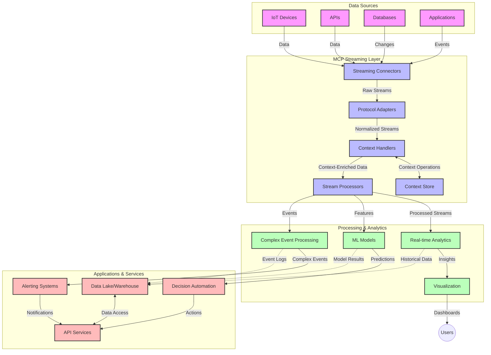

<!--
CO_OP_TRANSLATOR_METADATA:
{
  "original_hash": "195f7287638b77a549acadd96c8f981c",
  "translation_date": "2025-07-14T01:28:01+00:00",
  "source_file": "05-AdvancedTopics/mcp-realtimestreaming/README.md",
  "language_code": "ur"
}
-->
# ماڈل کانٹیکسٹ پروٹوکول برائے حقیقی وقت ڈیٹا اسٹریمنگ

## جائزہ

حقیقی وقت ڈیٹا اسٹریمنگ آج کے ڈیٹا پر مبنی دور میں نہایت اہمیت اختیار کر چکی ہے، جہاں کاروبار اور ایپلیکیشنز کو فوری معلومات تک رسائی کی ضرورت ہوتی ہے تاکہ بروقت فیصلے کیے جا سکیں۔ ماڈل کانٹیکسٹ پروٹوکول (MCP) ان حقیقی وقت اسٹریمنگ عمل کو بہتر بنانے میں ایک نمایاں پیش رفت ہے، جو ڈیٹا پروسیسنگ کی کارکردگی کو بڑھاتا ہے، سیاق و سباق کی سالمیت کو برقرار رکھتا ہے، اور مجموعی نظام کی کارکردگی کو بہتر بناتا ہے۔

یہ ماڈیول اس بات کا جائزہ لیتا ہے کہ MCP کس طرح حقیقی وقت ڈیٹا اسٹریمنگ کو تبدیل کرتا ہے، اور AI ماڈلز، اسٹریمنگ پلیٹ فارمز، اور ایپلیکیشنز کے درمیان سیاق و سباق کے انتظام کے لیے ایک معیاری طریقہ فراہم کرتا ہے۔

## حقیقی وقت ڈیٹا اسٹریمنگ کا تعارف

حقیقی وقت ڈیٹا اسٹریمنگ ایک تکنیکی ماڈل ہے جو ڈیٹا کی مسلسل منتقلی، پروسیسنگ، اور تجزیہ کو ممکن بناتا ہے جیسے ہی وہ پیدا ہوتا ہے، تاکہ نظام فوری طور پر نئی معلومات پر ردعمل دے سکیں۔ روایتی بیچ پروسیسنگ کے برعکس جو جامد ڈیٹا سیٹس پر کام کرتی ہے، اسٹریمنگ ڈیٹا کو حرکت میں پروسیس کرتی ہے، کم سے کم تاخیر کے ساتھ بصیرت اور عمل فراہم کرتی ہے۔

### حقیقی وقت ڈیٹا اسٹریمنگ کے بنیادی تصورات:

- **مسلسل ڈیٹا کا بہاؤ**: ڈیٹا کو ایک مسلسل، کبھی نہ ختم ہونے والے واقعات یا ریکارڈز کے سلسلے کے طور پر پروسیس کیا جاتا ہے۔
- **کم تاخیر والی پروسیسنگ**: نظام کو اس طرح ڈیزائن کیا جاتا ہے کہ ڈیٹا کی پیداوار اور پروسیسنگ کے درمیان وقت کم سے کم ہو۔
- **پیمائش پذیری**: اسٹریمنگ آرکیٹیکچرز کو متغیر ڈیٹا کی مقدار اور رفتار کو سنبھالنا ہوتا ہے۔
- **خرابی برداشت کرنا**: نظام کو ناکامیوں کے خلاف مضبوط ہونا چاہیے تاکہ ڈیٹا کا بہاؤ بلا تعطل جاری رہے۔
- **حالت پر مبنی پروسیسنگ**: واقعات کے درمیان سیاق و سباق کو برقرار رکھنا معنی خیز تجزیے کے لیے ضروری ہے۔

### ماڈل کانٹیکسٹ پروٹوکول اور حقیقی وقت اسٹریمنگ

ماڈل کانٹیکسٹ پروٹوکول (MCP) حقیقی وقت اسٹریمنگ ماحول میں کئی اہم چیلنجز کو حل کرتا ہے:

1. **سیاق و سباق کی تسلسل**: MCP اس بات کو معیاری بناتا ہے کہ کس طرح سیاق و سباق کو تقسیم شدہ اسٹریمنگ اجزاء کے درمیان برقرار رکھا جائے، تاکہ AI ماڈلز اور پروسیسنگ نوڈز کو متعلقہ تاریخی اور ماحولیاتی سیاق و سباق تک رسائی حاصل ہو۔

2. **موثر حالت کا انتظام**: سیاق و سباق کی منتقلی کے لیے منظم طریقے فراہم کر کے، MCP اسٹریمنگ پائپ لائنز میں حالت کے انتظام کے اوور ہیڈ کو کم کرتا ہے۔

3. **بین العملیت**: MCP مختلف اسٹریمنگ ٹیکنالوجیز اور AI ماڈلز کے درمیان سیاق و سباق کے اشتراک کے لیے ایک مشترکہ زبان تخلیق کرتا ہے، جو زیادہ لچکدار اور توسیع پذیر آرکیٹیکچرز کو ممکن بناتا ہے۔

4. **اسٹریمنگ کے لیے بہتر سیاق و سباق**: MCP کی تنفیذات اس بات کو ترجیح دے سکتی ہیں کہ کون سے سیاق و سباق کے عناصر حقیقی وقت کے فیصلوں کے لیے سب سے زیادہ متعلقہ ہیں، کارکردگی اور درستگی دونوں کے لیے بہتر بناتے ہوئے۔

5. **مطابقت پذیر پروسیسنگ**: MCP کے ذریعے مناسب سیاق و سباق کے انتظام کے ساتھ، اسٹریمنگ سسٹمز ڈیٹا میں بدلتے ہوئے حالات اور پیٹرنز کی بنیاد پر پروسیسنگ کو متحرک طور پر ایڈجسٹ کر سکتے ہیں۔

جدید ایپلیکیشنز میں، جیسے کہ IoT سینسر نیٹ ورکس سے لے کر مالیاتی تجارتی پلیٹ فارمز تک، MCP کا اسٹریمنگ ٹیکنالوجیز کے ساتھ انضمام زیادہ ذہین، سیاق و سباق سے آگاہ پروسیسنگ کو ممکن بناتا ہے جو حقیقی وقت میں پیچیدہ، بدلتے ہوئے حالات کا مناسب جواب دے سکتی ہے۔

## سیکھنے کے مقاصد

اس سبق کے اختتام پر، آپ قابل ہوں گے:

- حقیقی وقت ڈیٹا اسٹریمنگ کی بنیادی باتوں اور اس کے چیلنجز کو سمجھنا
- وضاحت کرنا کہ ماڈل کانٹیکسٹ پروٹوکول (MCP) حقیقی وقت ڈیٹا اسٹریمنگ کو کیسے بہتر بناتا ہے
- مشہور فریم ورکس جیسے Kafka اور Pulsar کا استعمال کرتے ہوئے MCP پر مبنی اسٹریمنگ حل نافذ کرنا
- MCP کے ساتھ خرابی برداشت کرنے والی، اعلی کارکردگی والی اسٹریمنگ آرکیٹیکچرز ڈیزائن اور تعینات کرنا
- MCP کے تصورات کو IoT، مالیاتی تجارت، اور AI پر مبنی تجزیاتی استعمال کے معاملات میں لاگو کرنا
- MCP پر مبنی اسٹریمنگ ٹیکنالوجیز میں ابھرتے ہوئے رجحانات اور مستقبل کی جدتوں کا جائزہ لینا

### تعریف اور اہمیت

حقیقی وقت ڈیٹا اسٹریمنگ میں ڈیٹا کی مسلسل پیداوار، پروسیسنگ، اور کم سے کم تاخیر کے ساتھ ترسیل شامل ہے۔ بیچ پروسیسنگ کے برعکس، جہاں ڈیٹا کو جمع کر کے گروپوں میں پروسیس کیا جاتا ہے، اسٹریمنگ ڈیٹا کو جیسے ہی موصول ہوتا ہے مرحلہ وار پروسیس کرتی ہے، فوری بصیرت اور عمل کو ممکن بناتی ہے۔

حقیقی وقت ڈیٹا اسٹریمنگ کی اہم خصوصیات:

- **کم تاخیر**: ڈیٹا کو ملی سیکنڈز سے سیکنڈز کے اندر پروسیس اور تجزیہ کرنا
- **مسلسل بہاؤ**: مختلف ذرائع سے بلا تعطل ڈیٹا کے سلسلے
- **فوری پروسیسنگ**: ڈیٹا کو بیچز میں نہیں بلکہ جیسے ہی آتا ہے تجزیہ کرنا
- **واقعہ پر مبنی آرکیٹیکچر**: واقعات کے وقوع پذیر ہوتے ہی ردعمل دینا

### روایتی ڈیٹا اسٹریمنگ میں چیلنجز

روایتی ڈیٹا اسٹریمنگ کے طریقے کئی محدودیتوں کا سامنا کرتے ہیں:

1. **سیاق و سباق کا نقصان**: تقسیم شدہ نظاموں میں سیاق و سباق کو برقرار رکھنے میں دشواری
2. **پیمائش پذیری کے مسائل**: زیادہ مقدار اور رفتار والے ڈیٹا کو سنبھالنے میں مشکلات
3. **انضمام کی پیچیدگیاں**: مختلف نظاموں کے درمیان بین العملیت کے مسائل
4. **تاخیر کا انتظام**: تھروپٹ اور پروسیسنگ وقت کے درمیان توازن قائم کرنا
5. **ڈیٹا کی مطابقت**: اسٹریمنگ میں ڈیٹا کی درستگی اور مکمل ہونے کو یقینی بنانا

## ماڈل کانٹیکسٹ پروٹوکول (MCP) کو سمجھنا

### MCP کیا ہے؟

ماڈل کانٹیکسٹ پروٹوکول (MCP) ایک معیاری مواصلاتی پروٹوکول ہے جو AI ماڈلز اور ایپلیکیشنز کے درمیان موثر تعامل کو آسان بناتا ہے۔ حقیقی وقت ڈیٹا اسٹریمنگ کے سیاق و سباق میں، MCP ایک فریم ورک فراہم کرتا ہے جو:

- ڈیٹا پائپ لائن کے دوران سیاق و سباق کو محفوظ رکھتا ہے
- ڈیٹا کے تبادلے کے فارمیٹس کو معیاری بناتا ہے
- بڑے ڈیٹا سیٹس کی ترسیل کو بہتر بناتا ہے
- ماڈل سے ماڈل اور ماڈل سے ایپلیکیشن مواصلات کو بڑھاتا ہے

### بنیادی اجزاء اور آرکیٹیکچر

حقیقی وقت اسٹریمنگ کے لیے MCP آرکیٹیکچر کئی اہم اجزاء پر مشتمل ہے:

1. **کانٹیکسٹ ہینڈلرز**: اسٹریمنگ پائپ لائن میں سیاق و سباق کی معلومات کو منظم اور برقرار رکھتے ہیں
2. **اسٹری stream پروسیسرز**: سیاق و سباق سے آگاہ تکنیکوں کا استعمال کرتے ہوئے آنے والے ڈیٹا اسٹریمز کو پروسیس کرتے ہیں
3. **پروٹوکول ایڈاپٹرز**: مختلف اسٹریمنگ پروٹوکولز کے درمیان تبدیلی کرتے ہیں جبکہ سیاق و سباق کو محفوظ رکھتے ہیں
4. **کانٹیکسٹ اسٹور**: سیاق و سباق کی معلومات کو مؤثر طریقے سے ذخیرہ اور بازیافت کرتا ہے
5. **اسٹریمنگ کنیکٹرز**: مختلف اسٹریمنگ پلیٹ فارمز (Kafka, Pulsar, Kinesis وغیرہ) سے رابطہ قائم کرتے ہیں



### MCP حقیقی وقت ڈیٹا ہینڈلنگ کو کیسے بہتر بناتا ہے

MCP روایتی اسٹریمنگ چیلنجز کو درج ذیل طریقوں سے حل کرتا ہے:

- **سیاق و سباق کی سالمیت**: پورے پائپ لائن میں ڈیٹا پوائنٹس کے درمیان تعلقات کو برقرار رکھنا
- **بہتر ترسیل**: ذہین سیاق و سباق کے انتظام کے ذریعے ڈیٹا تبادلے میں تکرار کو کم کرنا
- **معیاری انٹرفیسز**: اسٹریمنگ اجزاء کے لیے مستقل APIs فراہم کرنا
- **کم تاخیر**: مؤثر سیاق و سباق کے انتظام کے ذریعے پروسیسنگ کے اوور ہیڈ کو کم کرنا
- **بہتر پیمائش پذیری**: سیاق و سباق کو برقرار رکھتے ہوئے افقی پیمائش کی حمایت کرنا

## انضمام اور نفاذ

حقیقی وقت ڈیٹا اسٹریمنگ سسٹمز کو کارکردگی اور سیاق و سباق کی سالمیت دونوں کو برقرار رکھنے کے لیے محتاط آرکیٹیکچرل ڈیزائن اور نفاذ کی ضرورت ہوتی ہے۔ ماڈل کانٹیکسٹ پروٹوکول AI ماڈلز اور اسٹریمنگ ٹیکنالوجیز کو مربوط کرنے کے لیے ایک معیاری طریقہ فراہم کرتا ہے، جو زیادہ پیچیدہ، سیاق و سباق سے آگاہ پروسیسنگ پائپ لائنز کو ممکن بناتا ہے۔

### اسٹریمنگ آرکیٹیکچرز میں MCP انضمام کا جائزہ

حقیقی وقت اسٹریمنگ ماحول میں MCP کو نافذ کرنے کے لیے چند اہم پہلوؤں پر غور کرنا ضروری ہے:

1. **سیاق و سباق کی سیریلائزیشن اور ٹرانسپورٹ**: MCP اسٹریمنگ ڈیٹا پیکٹس میں سیاق و سباق کی معلومات کو مؤثر طریقے سے انکوڈ کرنے کے طریقے فراہم کرتا ہے، تاکہ ضروری سیاق و سباق پروسیسنگ پائپ لائن کے دوران ڈیٹا کے ساتھ چلتا رہے۔ اس میں اسٹریمنگ ٹرانسپورٹ کے لیے بہتر بنائے گئے معیاری سیریلائزیشن فارمیٹس شامل ہیں۔

2. **حالت پر مبنی اسٹری stream پروسیسنگ**: MCP پروسیسنگ نوڈز کے درمیان مستقل سیاق و سباق کی نمائندگی برقرار رکھ کر زیادہ ذہین حالت پر مبنی پروسیسنگ کو ممکن بناتا ہے۔ یہ خصوصیت خاص طور پر تقسیم شدہ اسٹریمنگ آرکیٹیکچرز میں قیمتی ہے جہاں حالت کا انتظام روایتی طور پر مشکل ہوتا ہے۔

3. **واقعہ وقت بمقابلہ پروسیسنگ وقت**: MCP کی تنفیذات کو اس عام چیلنج سے نمٹنا ہوتا ہے کہ واقعات کب ہوئے اور کب پروسیس کیے گئے، اس پروٹوکول میں وقتی سیاق و سباق شامل کیا جا سکتا ہے جو واقعہ وقت کے معنی کو محفوظ رکھتا ہے۔

4. **بیک پریشر مینجمنٹ**: سیاق و سباق کے انتظام کو معیاری بنا کر، MCP اسٹریمنگ سسٹمز میں بیک پریشر کو منظم کرنے میں مدد دیتا ہے، جس سے اجزاء اپنی پروسیسنگ صلاحیتوں کا ابلاغ کر کے بہاؤ کو ایڈجسٹ کر سکتے ہیں۔

5. **سیاق و سباق کی ونڈوئنگ اور اجتماع**: MCP وقتی اور تعلقاتی سیاق و سباق کی منظم نمائندگی فراہم کر کے زیادہ پیچیدہ ونڈوئنگ آپریشنز کو آسان بناتا ہے، جو واقعات کے سلسلوں میں زیادہ معنی خیز اجتماعات کو ممکن بناتا ہے۔

6. **بالکل ایک بار پروسیسنگ**: ایسے اسٹریمنگ سسٹمز میں جہاں بالکل ایک بار کی معنویت ضروری ہو، MCP پروسیسنگ میٹا ڈیٹا شامل کر سکتا ہے تاکہ تقسیم شدہ اجزاء میں پروسیسنگ کی حالت کو ٹریک اور تصدیق کیا جا سکے۔

مختلف اسٹریمنگ ٹیکنالوجیز میں MCP کا نفاذ سیاق و سباق کے انتظام کے لیے ایک متحدہ طریقہ کار تخلیق کرتا ہے، جس سے کسٹم انضمام کوڈ کی ضرورت کم ہوتی ہے اور نظام کی صلاحیت بڑھتی ہے کہ وہ ڈیٹا کے بہاؤ کے دوران معنی خیز سیاق و سباق کو برقرار رکھ سکے۔

### مختلف ڈیٹا اسٹریمنگ فریم ورکس میں MCP

یہ مثالیں موجودہ MCP وضاحت کی پیروی کرتی ہیں جو JSON-RPC پر مبنی پروٹوکول پر مرکوز ہے جس کے مختلف ٹرانسپورٹ میکانزم ہیں۔ کوڈ دکھاتا ہے کہ آپ کس طرح کسٹم ٹرانسپورٹس نافذ کر سکتے ہیں جو Kafka اور Pulsar جیسے اسٹریمنگ پلیٹ فارمز کو MCP پروٹوکول کے ساتھ مکمل مطابقت کے ساتھ مربوط کرتے ہیں۔

یہ مثالیں دکھانے کے لیے ڈیزائن کی گئی ہیں کہ کس طرح اسٹریمنگ پلیٹ فارمز کو MCP کے ساتھ مربوط کیا جا سکتا ہے تاکہ حقیقی وقت ڈیٹا پروسیسنگ فراہم کی جا سکے جبکہ MCP کے مرکزی سیاق و سباق کی آگاہی کو برقرار رکھا جائے۔ یہ طریقہ کار کوڈ نمونوں کو جون 2025 تک MCP وضاحت کی موجودہ حالت کی درست عکاسی کو یقینی بناتا ہے۔

MCP کو مشہور اسٹریمنگ فریم ورکس کے ساتھ مربوط کیا جا سکتا ہے جن میں شامل ہیں:

#### Apache Kafka انضمام

```python
import asyncio
import json
from typing import Dict, Any, Optional
from confluent_kafka import Consumer, Producer, KafkaError
from mcp.client import Client, ClientCapabilities
from mcp.core.message import JsonRpcMessage
from mcp.core.transports import Transport

# Custom transport class to bridge MCP with Kafka
class KafkaMCPTransport(Transport):
    def __init__(self, bootstrap_servers: str, input_topic: str, output_topic: str):
        self.bootstrap_servers = bootstrap_servers
        self.input_topic = input_topic
        self.output_topic = output_topic
        self.producer = Producer({'bootstrap.servers': bootstrap_servers})
        self.consumer = Consumer({
            'bootstrap.servers': bootstrap_servers,
            'group.id': 'mcp-client-group',
            'auto.offset.reset': 'earliest'
        })
        self.message_queue = asyncio.Queue()
        self.running = False
        self.consumer_task = None
        
    async def connect(self):
        """Connect to Kafka and start consuming messages"""
        self.consumer.subscribe([self.input_topic])
        self.running = True
        self.consumer_task = asyncio.create_task(self._consume_messages())
        return self
        
    async def _consume_messages(self):
        """Background task to consume messages from Kafka and queue them for processing"""
        while self.running:
            try:
                msg = self.consumer.poll(1.0)
                if msg is None:
                    await asyncio.sleep(0.1)
                    continue
                
                if msg.error():
                    if msg.error().code() == KafkaError._PARTITION_EOF:
                        continue
                    print(f"Consumer error: {msg.error()}")
                    continue
                
                # Parse the message value as JSON-RPC
                try:
                    message_str = msg.value().decode('utf-8')
                    message_data = json.loads(message_str)
                    mcp_message = JsonRpcMessage.from_dict(message_data)
                    await self.message_queue.put(mcp_message)
                except Exception as e:
                    print(f"Error parsing message: {e}")
            except Exception as e:
                print(f"Error in consumer loop: {e}")
                await asyncio.sleep(1)
    
    async def read(self) -> Optional[JsonRpcMessage]:
        """Read the next message from the queue"""
        try:
            message = await self.message_queue.get()
            return message
        except Exception as e:
            print(f"Error reading message: {e}")
            return None
    
    async def write(self, message: JsonRpcMessage) -> None:
        """Write a message to the Kafka output topic"""
        try:
            message_json = json.dumps(message.to_dict())
            self.producer.produce(
                self.output_topic,
                message_json.encode('utf-8'),
                callback=self._delivery_report
            )
            self.producer.poll(0)  # Trigger callbacks
        except Exception as e:
            print(f"Error writing message: {e}")
    
    def _delivery_report(self, err, msg):
        """Kafka producer delivery callback"""
        if err is not None:
            print(f'Message delivery failed: {err}')
        else:
            print(f'Message delivered to {msg.topic()} [{msg.partition()}]')
    
    async def close(self) -> None:
        """Close the transport"""
        self.running = False
        if self.consumer_task:
            self.consumer_task.cancel()
            try:
                await self.consumer_task
            except asyncio.CancelledError:
                pass
        self.consumer.close()
        self.producer.flush()

# Example usage of the Kafka MCP transport
async def kafka_mcp_example():
    # Create MCP client with Kafka transport
    client = Client(
        {"name": "kafka-mcp-client", "version": "1.0.0"},
        ClientCapabilities({})
    )
    
    # Create and connect the Kafka transport
    transport = KafkaMCPTransport(
        bootstrap_servers="localhost:9092",
        input_topic="mcp-responses",
        output_topic="mcp-requests"
    )
    
    await client.connect(transport)
    
    try:
        # Initialize the MCP session
        await client.initialize()
        
        # Example of executing a tool via MCP
        response = await client.execute_tool(
            "process_data",
            {
                "data": "sample data",
                "metadata": {
                    "source": "sensor-1",
                    "timestamp": "2025-06-12T10:30:00Z"
                }
            }
        )
        
        print(f"Tool execution response: {response}")
        
        # Clean shutdown
        await client.shutdown()
    finally:
        await transport.close()

# Run the example
if __name__ == "__main__":
    asyncio.run(kafka_mcp_example())
```

#### Apache Pulsar نفاذ

```python
import asyncio
import json
import pulsar
from typing import Dict, Any, Optional
from mcp.core.message import JsonRpcMessage
from mcp.core.transports import Transport
from mcp.server import Server, ServerOptions
from mcp.server.tools import Tool, ToolExecutionContext, ToolMetadata

# Create a custom MCP transport that uses Pulsar
class PulsarMCPTransport(Transport):
    def __init__(self, service_url: str, request_topic: str, response_topic: str):
        self.service_url = service_url
        self.request_topic = request_topic
        self.response_topic = response_topic
        self.client = pulsar.Client(service_url)
        self.producer = self.client.create_producer(response_topic)
        self.consumer = self.client.subscribe(
            request_topic,
            "mcp-server-subscription",
            consumer_type=pulsar.ConsumerType.Shared
        )
        self.message_queue = asyncio.Queue()
        self.running = False
        self.consumer_task = None
    
    async def connect(self):
        """Connect to Pulsar and start consuming messages"""
        self.running = True
        self.consumer_task = asyncio.create_task(self._consume_messages())
        return self
    
    async def _consume_messages(self):
        """Background task to consume messages from Pulsar and queue them for processing"""
        while self.running:
            try:
                # Non-blocking receive with timeout
                msg = self.consumer.receive(timeout_millis=500)
                
                # Process the message
                try:
                    message_str = msg.data().decode('utf-8')
                    message_data = json.loads(message_str)
                    mcp_message = JsonRpcMessage.from_dict(message_data)
                    await self.message_queue.put(mcp_message)
                    
                    # Acknowledge the message
                    self.consumer.acknowledge(msg)
                except Exception as e:
                    print(f"Error processing message: {e}")
                    # Negative acknowledge if there was an error
                    self.consumer.negative_acknowledge(msg)
            except Exception as e:
                # Handle timeout or other exceptions
                await asyncio.sleep(0.1)
    
    async def read(self) -> Optional[JsonRpcMessage]:
        """Read the next message from the queue"""
        try:
            message = await self.message_queue.get()
            return message
        except Exception as e:
            print(f"Error reading message: {e}")
            return None
    
    async def write(self, message: JsonRpcMessage) -> None:
        """Write a message to the Pulsar output topic"""
        try:
            message_json = json.dumps(message.to_dict())
            self.producer.send(message_json.encode('utf-8'))
        except Exception as e:
            print(f"Error writing message: {e}")
    
    async def close(self) -> None:
        """Close the transport"""
        self.running = False
        if self.consumer_task:
            self.consumer_task.cancel()
            try:
                await self.consumer_task
            except asyncio.CancelledError:
                pass
        self.consumer.close()
        self.producer.close()
        self.client.close()

# Define a sample MCP tool that processes streaming data
@Tool(
    name="process_streaming_data",
    description="Process streaming data with context preservation",
    metadata=ToolMetadata(
        required_capabilities=["streaming"]
    )
)
async def process_streaming_data(
    ctx: ToolExecutionContext,
    data: str,
    source: str,
    priority: str = "medium"
) -> Dict[str, Any]:
    """
    Process streaming data while preserving context
    
    Args:
        ctx: Tool execution context
        data: The data to process
        source: The source of the data
        priority: Priority level (low, medium, high)
        
    Returns:
        Dict containing processed results and context information
    """
    # Example processing that leverages MCP context
    print(f"Processing data from {source} with priority {priority}")
    
    # Access conversation context from MCP
    conversation_id = ctx.conversation_id if hasattr(ctx, 'conversation_id') else "unknown"
    
    # Return results with enhanced context
    return {
        "processed_data": f"Processed: {data}",
        "context": {
            "conversation_id": conversation_id,
            "source": source,
            "priority": priority,
            "processing_timestamp": ctx.get_current_time_iso()
        }
    }

# Example MCP server implementation using Pulsar transport
async def run_mcp_server_with_pulsar():
    # Create MCP server
    server = Server(
        {"name": "pulsar-mcp-server", "version": "1.0.0"},
        ServerOptions(
            capabilities={"streaming": True}
        )
    )
    
    # Register our tool
    server.register_tool(process_streaming_data)
    
    # Create and connect Pulsar transport
    transport = PulsarMCPTransport(
        service_url="pulsar://localhost:6650",
        request_topic="mcp-requests",
        response_topic="mcp-responses"
    )
    
    try:
        # Start the server with the Pulsar transport
        await server.run(transport)
    finally:
        await transport.close()

# Run the server
if __name__ == "__main__":
    asyncio.run(run_mcp_server_with_pulsar())
```

### تعیناتی کے لیے بہترین طریقے

حقیقی وقت اسٹریمنگ کے لیے MCP نافذ کرتے وقت:

1. **خرابی برداشت کرنے کے لیے ڈیزائن کریں**:
   - مناسب ایرر ہینڈلنگ نافذ کریں
   - ناکام پیغامات کے لیے ڈیڈ لیٹر کیوز استعمال کریں
   - ایڈپٹومیٹک پروسیسرز ڈیزائن کریں

2. **کارکردگی کے لیے بہتر بنائیں**:
   - مناسب بفر سائزز ترتیب دیں
   - جہاں مناسب ہو بیچنگ استعمال کریں
   - بیک پریشر میکانزم نافذ کریں

3. **مانیٹر اور مشاہدہ کریں**:
   - اسٹریمنگ پروسیسنگ میٹرکس کو ٹریک کریں
   - سیاق و سباق کی منتقلی کی نگرانی کریں
   - غیر معمولی حالات کے لیے الرٹس سیٹ کریں

4. **اپنے اسٹریمز کو محفوظ بنائیں**:
   - حساس ڈیٹا کے لیے انکرپشن نافذ کریں
   - تصدیق اور اجازت کا استعمال کریں
   - مناسب رسائی کنٹرولز لاگو کریں

### IoT اور ایج کمپیوٹنگ میں MCP

MCP IoT اسٹریمنگ کو بہتر بناتا ہے:

- پروسیسنگ پائپ لائن میں ڈیوائس کے سیاق و سباق کو محفوظ رکھنا
- مؤثر ایج سے کلاؤڈ ڈیٹا اسٹریمنگ کو ممکن بنانا
- IoT ڈیٹا اسٹریمز پر حقیقی وقت تجزیات کی حمایت کرنا
- سیاق و سباق کے ساتھ ڈیوائس سے ڈیوائس مواصلات کو آسان بنانا

مثال: اسمارٹ سٹی سینسر نیٹ ورکس  
```
Sensors → Edge Gateways → MCP Stream Processors → Real-time Analytics → Automated Responses
```

### مالیاتی لین دین اور ہائی فریکوئنسی ٹریڈنگ میں کردار

MCP مالیاتی ڈیٹا اسٹریمنگ کے لیے نمایاں فوائد فراہم کرتا ہے:

- تجارتی فیصلوں کے لیے انتہائی کم تاخیر والی پروسیسنگ
- پروسیسنگ کے دوران لین دین کے سیاق و سباق کو برقرار رکھنا
- سیاق و سباق کی آگاہی کے ساتھ پیچیدہ ایونٹ پروسیسنگ کی حمایت
- تقسیم شدہ تجارتی نظاموں میں ڈیٹا کی مطابقت کو یقینی بنانا

### AI پر مبنی ڈیٹا اینالٹکس کو بہتر بنانا

MCP اسٹریمنگ اینالٹکس کے لیے نئی ممکنات پیدا کرتا ہے:

- حقیقی وقت ماڈل کی تربیت اور استنتاج
- اسٹریمنگ ڈیٹا سے مسلسل سیکھنا
- سیاق و سباق سے آگاہ فیچر استخراج
- محفوظ سیاق و سباق کے ساتھ کثیر ماڈل استنتاج پائپ لائنز

## مستقبل کے رجحانات اور جدتیں

### حقیقی وقت ماحول میں MCP کی ترقی

آئندہ کے لیے، ہم توقع کرتے ہیں کہ MCP درج ذیل مسائل کو حل کرنے کے لیے ترقی کرے گا:

- **کوانٹم کمپیوٹنگ انضمام**: کوانٹم پر مبنی اسٹریمنگ سسٹمز کی تیاری
- **ایج نیٹو پروسیسنگ**: زیادہ سیاق و سباق سے آگاہ پروسیسنگ کو ایج ڈیوائسز پر منتقل کرنا
- **خود مختار اسٹریمنگ مینجمنٹ**: خود کو بہتر بنانے والی اسٹریمنگ پائپ لائنز
- **فیڈریٹڈ اسٹریمنگ**: پرائیویسی کو برقرار رکھتے ہوئے تقسیم شدہ پروسیسنگ

### ٹیکنالوجی میں ممکنہ پیش رفت

وہ ابھرتی ہوئی ٹیکنالوجیز جو MCP اسٹریمنگ کے مستقبل کو تشکیل دیں گی:

1. **AI کے لیے بہتر بنائے گئے اسٹریمنگ پروٹوکولز**

**دستخطی دستبرداری**:  
یہ دستاویز AI ترجمہ سروس [Co-op Translator](https://github.com/Azure/co-op-translator) کے ذریعے ترجمہ کی گئی ہے۔ اگرچہ ہم درستگی کے لیے کوشاں ہیں، براہ کرم آگاہ رہیں کہ خودکار ترجمے میں غلطیاں یا عدم درستیاں ہو سکتی ہیں۔ اصل دستاویز اپنی مادری زبان میں ہی معتبر ماخذ سمجھی جانی چاہیے۔ اہم معلومات کے لیے پیشہ ور انسانی ترجمہ کی سفارش کی جاتی ہے۔ اس ترجمے کے استعمال سے پیدا ہونے والی کسی بھی غلط فہمی یا غلط تشریح کی ذمہ داری ہم پر عائد نہیں ہوتی۔