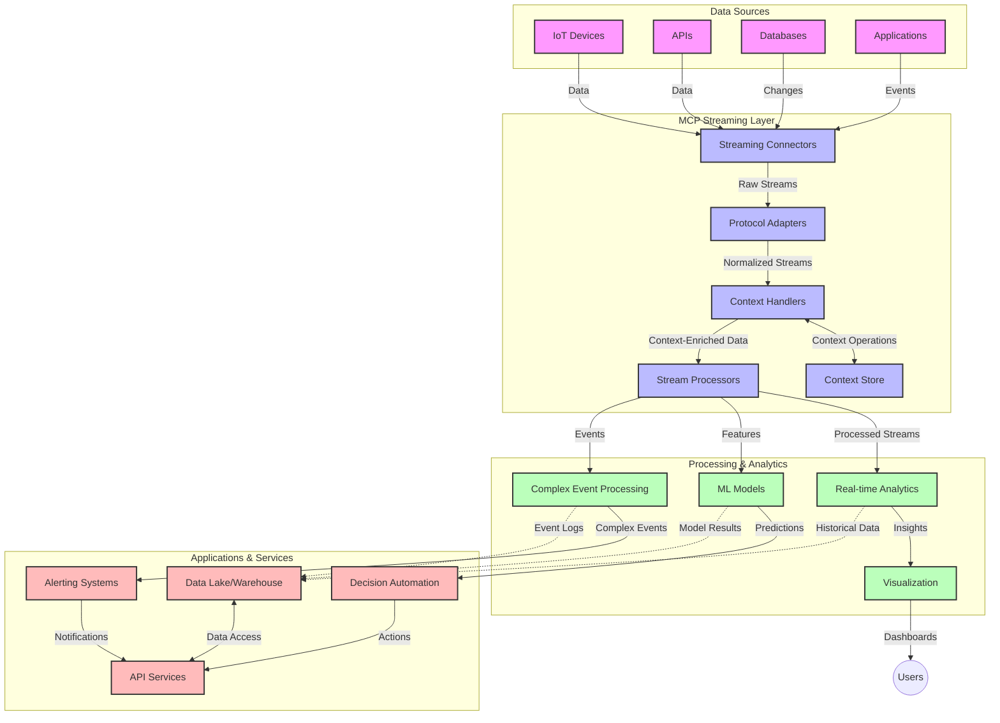

<!--
CO_OP_TRANSLATOR_METADATA:
{
  "original_hash": "195f7287638b77a549acadd96c8f981c",
  "translation_date": "2025-06-12T23:08:44+00:00",
  "source_file": "05-AdvancedTopics/mcp-realtimestreaming/README.md",
  "language_code": "ur"
}
-->
# ماڈل کانٹیکسٹ پروٹوکول برائے حقیقی وقت ڈیٹا اسٹریمینگ

## جائزہ

آج کے ڈیٹا سے بھرپور دنیا میں، جہاں کاروبار اور ایپلیکیشنز کو فوری معلومات تک رسائی کی ضرورت ہوتی ہے تاکہ بروقت فیصلے کیے جا سکیں، حقیقی وقت ڈیٹا اسٹریمینگ لازمی ہو گئی ہے۔ ماڈل کانٹیکسٹ پروٹوکول (MCP) ان حقیقی وقت اسٹریمینگ عمل کو بہتر بنانے میں ایک اہم پیش رفت ہے، جو ڈیٹا پراسیسنگ کی کارکردگی کو بڑھاتا ہے، کانٹیکسچوئل سالمیت کو برقرار رکھتا ہے، اور مجموعی نظام کی کارکردگی کو بہتر بناتا ہے۔

یہ ماڈیول بتاتا ہے کہ MCP کس طرح AI ماڈلز، اسٹریمینگ پلیٹ فارمز، اور ایپلیکیشنز کے درمیان کانٹیکسٹ مینجمنٹ کے لیے ایک معیاری طریقہ فراہم کر کے حقیقی وقت ڈیٹا اسٹریمینگ کو تبدیل کرتا ہے۔

## حقیقی وقت ڈیٹا اسٹریمینگ کا تعارف

حقیقی وقت ڈیٹا اسٹریمینگ ایک تکنیکی ماڈل ہے جو ڈیٹا کی مسلسل منتقلی، پراسیسنگ، اور تجزیہ کو ممکن بناتا ہے جیسے ہی وہ پیدا ہوتا ہے، تاکہ نظام نئے معلومات پر فوری ردعمل دے سکیں۔ روایتی بیچ پراسیسنگ کے برعکس جو جامد ڈیٹا سیٹس پر کام کرتی ہے، اسٹریمینگ ڈیٹا کو حرکت میں پراسیس کرتی ہے، اور کم سے کم تاخیر کے ساتھ بصیرت اور کارروائی فراہم کرتی ہے۔

### حقیقی وقت ڈیٹا اسٹریمینگ کے بنیادی تصورات:

- **مسلسل ڈیٹا کا بہاؤ**: ڈیٹا کو ایونٹس یا ریکارڈز کے ایک مسلسل اور کبھی ختم نہ ہونے والے سلسلے کی شکل میں پراسیس کیا جاتا ہے۔
- **کم تاخیر والی پراسیسنگ**: نظام ڈیٹا کی پیداوار اور پراسیسنگ کے درمیان وقت کو کم سے کم کرنے کے لیے ڈیزائن کیے گئے ہیں۔
- **پیمائش پذیری**: اسٹریمینگ آرکیٹیکچرز کو مختلف ڈیٹا کی مقدار اور رفتار کو سنبھالنا ہوتا ہے۔
- **خرابی برداشت کرنے کی صلاحیت**: نظام کو ناکامیوں کے خلاف مضبوط ہونا چاہیے تاکہ ڈیٹا کا بہاؤ بغیر رکاوٹ جاری رہے۔
- **حالت دار پراسیسنگ**: ایونٹس کے درمیان کانٹیکسٹ کو برقرار رکھنا معنی خیز تجزیے کے لیے ضروری ہے۔

### ماڈل کانٹیکسٹ پروٹوکول اور حقیقی وقت اسٹریمینگ

ماڈل کانٹیکسٹ پروٹوکول (MCP) حقیقی وقت اسٹریمینگ ماحول میں کئی اہم چیلنجز کو حل کرتا ہے:

1. **کانٹیکسچوئل تسلسل**: MCP اس بات کو معیاری بناتا ہے کہ کس طرح کانٹیکسٹ کو تقسیم شدہ اسٹریمینگ اجزاء کے درمیان برقرار رکھا جائے، تاکہ AI ماڈلز اور پراسیسنگ نوڈز کو متعلقہ تاریخی اور ماحولیاتی کانٹیکسٹ تک رسائی حاصل ہو۔

2. **موثر حالت مینجمنٹ**: کانٹیکسٹ کی منتقلی کے لیے منظم طریقے فراہم کر کے MCP اسٹریمینگ پائپ لائنز میں حالت کی مینجمنٹ کے اوور ہیڈ کو کم کرتا ہے۔

3. **انٹرآپریبلٹی**: MCP مختلف اسٹریمینگ ٹیکنالوجیز اور AI ماڈلز کے درمیان کانٹیکسٹ شیئرنگ کے لیے ایک مشترکہ زبان بناتا ہے، جو زیادہ لچکدار اور توسیع پذیر آرکیٹیکچرز کو ممکن بناتا ہے۔

4. **اسٹریمینگ کے لیے بہتر کانٹیکسٹ**: MCP کی امپلیمنٹیشنز اس بات کو ترجیح دے سکتی ہیں کہ کون سے کانٹیکسٹ عناصر حقیقی وقت فیصلوں کے لیے سب سے زیادہ متعلقہ ہیں، کارکردگی اور درستگی دونوں کے لیے آپٹمائز کرتے ہوئے۔

5. **متحرک پراسیسنگ**: MCP کے ذریعے مناسب کانٹیکسٹ مینجمنٹ کے ساتھ، اسٹریمینگ سسٹمز ڈیٹا میں بدلتے حالات اور پیٹرنز کی بنیاد پر پراسیسنگ کو متحرک طور پر ایڈجسٹ کر سکتے ہیں۔

جدید ایپلیکیشنز، جو IoT سینسر نیٹ ورکس سے لے کر مالیاتی تجارتی پلیٹ فارمز تک پھیلی ہوئی ہیں، میں MCP کا اسٹریمینگ ٹیکنالوجیز کے ساتھ انضمام زیادہ ذہین، کانٹیکسٹ سے آگاہ پراسیسنگ کو ممکن بناتا ہے جو حقیقی وقت میں پیچیدہ، ارتقائی حالات کا مناسب جواب دے سکتی ہے۔

## سیکھنے کے مقاصد

اس سبق کے اختتام پر آپ قابل ہوں گے:

- حقیقی وقت ڈیٹا اسٹریمینگ کے بنیادی اصول اور اس کے چیلنجز کو سمجھنا
- سمجھانا کہ ماڈل کانٹیکسٹ پروٹوکول (MCP) حقیقی وقت ڈیٹا اسٹریمینگ کو کیسے بہتر بناتا ہے
- مشہور فریم ورکس جیسے Kafka اور Pulsar کا استعمال کرتے ہوئے MCP پر مبنی اسٹریمینگ حل نافذ کرنا
- MCP کے ساتھ خرابی برداشت کرنے والی، اعلی کارکردگی والی اسٹریمینگ آرکیٹیکچرز ڈیزائن اور تعینات کرنا
- MCP تصورات کو IoT، مالیاتی تجارت، اور AI پر مبنی تجزیاتی استعمال کے معاملات میں لاگو کرنا
- MCP پر مبنی اسٹریمینگ ٹیکنالوجیز میں ابھرتے ہوئے رجحانات اور مستقبل کی جدتوں کا جائزہ لینا

### تعریف اور اہمیت

حقیقی وقت ڈیٹا اسٹریمینگ میں کم سے کم تاخیر کے ساتھ ڈیٹا کی مسلسل پیداوار، پراسیسنگ، اور ترسیل شامل ہے۔ بیچ پراسیسنگ کے برعکس، جہاں ڈیٹا کو گروپوں میں جمع اور پراسیس کیا جاتا ہے، اسٹریمینگ ڈیٹا کو جیسے ہی آتا ہے مرحلہ وار پراسیس کرتی ہے، فوری بصیرت اور کارروائی کو ممکن بناتی ہے۔

حقیقی وقت ڈیٹا اسٹریمینگ کی اہم خصوصیات میں شامل ہیں:

- **کم تاخیر**: ڈیٹا کو ملی سیکنڈز سے سیکنڈز کے اندر پراسیس اور تجزیہ کرنا
- **مسلسل بہاؤ**: مختلف ذرائع سے بغیر رکاوٹ کے ڈیٹا کے سلسلے
- **فوری پراسیسنگ**: ڈیٹا کو بیچز کی بجائے جیسے ہی آتا ہے تجزیہ کرنا
- **ایونٹ پر مبنی آرکیٹیکچر**: جیسے ہی ایونٹس رونما ہوں ان کا جواب دینا

### روایتی ڈیٹا اسٹریمینگ میں چیلنجز

روایتی ڈیٹا اسٹریمینگ کے طریقے کئی حدود کا سامنا کرتے ہیں:

1. **کانٹیکسٹ کا نقصان**: تقسیم شدہ نظاموں میں کانٹیکسٹ کو برقرار رکھنے میں دشواری
2. **پیمائش پذیری کے مسائل**: بڑے حجم اور تیز رفتار ڈیٹا کو سنبھالنے میں چیلنجز
3. **انضمام کی پیچیدگی**: مختلف نظاموں کے درمیان انٹرآپریبلٹی کے مسائل
4. **تاخیر کا انتظام**: تھروپٹ اور پراسیسنگ وقت کے درمیان توازن
5. **ڈیٹا کی مطابقت**: اسٹریم میں ڈیٹا کی درستگی اور مکملیت کو یقینی بنانا

## ماڈل کانٹیکسٹ پروٹوکول (MCP) کو سمجھنا

### MCP کیا ہے؟

ماڈل کانٹیکسٹ پروٹوکول (MCP) ایک معیاری مواصلاتی پروٹوکول ہے جو AI ماڈلز اور ایپلیکیشنز کے درمیان مؤثر تعامل کو آسان بناتا ہے۔ حقیقی وقت ڈیٹا اسٹریمینگ کے سیاق و سباق میں، MCP ایک فریم ورک فراہم کرتا ہے جو:

- ڈیٹا پائپ لائن کے دوران کانٹیکسٹ کو محفوظ رکھتا ہے
- ڈیٹا تبادلے کے فارمیٹس کو معیاری بناتا ہے
- بڑے ڈیٹا سیٹس کی ترسیل کو بہتر بناتا ہے
- ماڈل سے ماڈل اور ماڈل سے ایپلیکیشن مواصلات کو بڑھاتا ہے

### بنیادی اجزاء اور آرکیٹیکچر

حقیقی وقت اسٹریمینگ کے لیے MCP آرکیٹیکچر میں کئی اہم اجزاء شامل ہیں:

1. **کانٹیکسٹ ہینڈلرز**: اسٹریمینگ پائپ لائن میں کانٹیکسچوئل معلومات کا انتظام اور برقرار رکھنا
2. **اسٹریم پروسیسرز**: کانٹیکسٹ سے آگاہ تکنیکوں کا استعمال کرتے ہوئے آنے والے ڈیٹا اسٹریمز کو پراسیس کرنا
3. **پروٹوکول ایڈاپٹرز**: مختلف اسٹریمینگ پروٹوکولز کے درمیان تبدیلی کرتے ہوئے کانٹیکسٹ کو محفوظ رکھنا
4. **کانٹیکسٹ اسٹور**: کانٹیکسچوئل معلومات کو مؤثر طریقے سے ذخیرہ اور بازیافت کرنا
5. **اسٹریمینگ کنیکٹرز**: مختلف اسٹریمینگ پلیٹ فارمز (Kafka, Pulsar, Kinesis وغیرہ) سے کنیکٹ کرنا



### MCP حقیقی وقت ڈیٹا ہینڈلنگ کو کیسے بہتر بناتا ہے

MCP روایتی اسٹریمینگ چیلنجز کو حل کرتا ہے:

- **کانٹیکسچوئل سالمیت**: پورے پائپ لائن میں ڈیٹا پوائنٹس کے درمیان تعلقات کو برقرار رکھنا
- **بہتر ترسیل**: ذہین کانٹیکسٹ مینجمنٹ کے ذریعے ڈیٹا تبادلے میں تکرار کو کم کرنا
- **معیاری انٹرفیسز**: اسٹریمینگ اجزاء کے لیے یکساں APIs فراہم کرنا
- **کم تاخیر**: مؤثر کانٹیکسٹ ہینڈلنگ کے ذریعے پراسیسنگ کے اوور ہیڈ کو کم کرنا
- **بہتر پیمائش پذیری**: کانٹیکسٹ کو برقرار رکھتے ہوئے افقی پیمائش کی حمایت کرنا

## انضمام اور نفاذ

حقیقی وقت ڈیٹا اسٹریمینگ سسٹمز کو کارکردگی اور کانٹیکسچوئل سالمیت دونوں کو برقرار رکھنے کے لیے محتاط آرکیٹیکچرل ڈیزائن اور نفاذ کی ضرورت ہوتی ہے۔ ماڈل کانٹیکسٹ پروٹوکول AI ماڈلز اور اسٹریمینگ ٹیکنالوجیز کو مربوط کرنے کے لیے ایک معیاری طریقہ فراہم کرتا ہے، جو زیادہ پیچیدہ، کانٹیکسٹ سے آگاہ پراسیسنگ پائپ لائنز کو ممکن بناتا ہے۔

### اسٹریمینگ آرکیٹیکچرز میں MCP انضمام کا جائزہ

حقیقی وقت اسٹریمینگ ماحول میں MCP نافذ کرتے وقت چند اہم نکات پر غور کرنا ضروری ہے:

1. **کانٹیکسٹ سیریلائزیشن اور ٹرانسپورٹ**: MCP اسٹریمینگ ڈیٹا پیکٹس میں کانٹیکسچوئل معلومات کو مؤثر طریقے سے انکوڈ کرنے کے طریقے فراہم کرتا ہے، اس بات کو یقینی بناتے ہوئے کہ ضروری کانٹیکسٹ پراسیسنگ پائپ لائن کے دوران ڈیٹا کے ساتھ چلتا رہے۔ اس میں اسٹریمینگ ٹرانسپورٹ کے لیے بہتر سیریلائزیشن فارمیٹس شامل ہیں۔

2. **حالت دار اسٹریم پراسیسنگ**: MCP مسلسل کانٹیکسٹ کی نمائندگی کو پراسیسنگ نوڈز کے درمیان برقرار رکھ کر زیادہ ذہین حالت دار پراسیسنگ کو ممکن بناتا ہے۔ یہ خاص طور پر تقسیم شدہ اسٹریمینگ آرکیٹیکچرز میں مفید ہے جہاں حالت مینجمنٹ روایتی طور پر مشکل ہوتی ہے۔

3. **ایونٹ ٹائم بمقابلہ پراسیسنگ ٹائم**: MCP اسٹریمینگ سسٹمز میں اس عام چیلنج کو حل کرتا ہے کہ ایونٹس کب وقوع پزیر ہوئے اور کب پراسیس کیے گئے، اس کے درمیان فرق کو برقرار رکھا جائے۔ پروٹوکول عارضی کانٹیکسٹ شامل کر سکتا ہے جو ایونٹ ٹائم کے معنی کو محفوظ رکھتا ہے۔

4. **بیک پریشر مینجمنٹ**: MCP معیاری کانٹیکسٹ ہینڈلنگ کے ذریعے اسٹریمینگ سسٹمز میں بیک پریشر کو منظم کرنے میں مدد دیتا ہے، جس سے اجزاء اپنی پراسیسنگ صلاحیتوں کا ابلاغ کر سکتے ہیں اور بہاؤ کو مناسب طریقے سے ایڈجسٹ کر سکتے ہیں۔

5. **کانٹیکسٹ ونڈوئنگ اور اجتماع**: MCP عارضی اور تعلقاتی کانٹیکسٹ کی منظم نمائندگی فراہم کر کے زیادہ پیچیدہ ونڈوئنگ آپریشنز کو آسان بناتا ہے، جو ایونٹ اسٹریمز کے درمیان زیادہ معنی خیز اجتماعات کو ممکن بناتا ہے۔

6. **بالکل ایک بار پراسیسنگ**: اسٹریمینگ سسٹمز میں جہاں بالکل ایک بار سیمانٹکس کی ضرورت ہو، MCP پراسیسنگ میٹا ڈیٹا کو شامل کر سکتا ہے تاکہ تقسیم شدہ اجزاء میں پراسیسنگ کی حالت کو ٹریک اور تصدیق کیا جا سکے۔

مختلف اسٹریمینگ ٹیکنالوجیز میں MCP کے نفاذ سے کانٹیکسٹ مینجمنٹ کے لیے ایک متحدہ طریقہ کار پیدا ہوتا ہے، جو حسب ضرورت انضمام کوڈ کی ضرورت کو کم کرتا ہے اور نظام کی صلاحیت کو بڑھاتا ہے کہ وہ ڈیٹا کے پائپ لائن میں بہاؤ کے دوران معنی خیز کانٹیکسٹ کو برقرار رکھ سکے۔

### مختلف ڈیٹا اسٹریمینگ فریم ورکس میں MCP

یہ مثالیں موجودہ MCP وضاحت کی پیروی کرتی ہیں جو JSON-RPC پر مبنی پروٹوکول ہے جس میں مختلف ٹرانسپورٹ میکانزم شامل ہیں۔ کوڈ دکھاتا ہے کہ آپ کس طرح کسٹم ٹرانسپورٹس نافذ کر سکتے ہیں جو Kafka اور Pulsar جیسے اسٹریمینگ پلیٹ فارمز کو MCP پروٹوکول کے ساتھ مکمل مطابقت کے ساتھ مربوط کرتے ہیں۔

یہ مثالیں ظاہر کرتی ہیں کہ کس طرح اسٹریمینگ پلیٹ فارمز کو MCP کے ساتھ مربوط کیا جا سکتا ہے تاکہ حقیقی وقت ڈیٹا پراسیسنگ فراہم کی جا سکے جبکہ MCP کے مرکزی کانٹیکسچوئل آگاہی کو برقرار رکھا جا سکے۔ یہ طریقہ کار یقینی بناتا ہے کہ کوڈ نمونے جون 2025 تک MCP وضاحت کی موجودہ حالت کی درست عکاسی کرتے ہیں۔

MCP کو مشہور اسٹریمینگ فریم ورکس کے ساتھ مربوط کیا جا سکتا ہے جن میں شامل ہیں:

#### Apache Kafka انضمام

```python
import asyncio
import json
from typing import Dict, Any, Optional
from confluent_kafka import Consumer, Producer, KafkaError
from mcp.client import Client, ClientCapabilities
from mcp.core.message import JsonRpcMessage
from mcp.core.transports import Transport

# Custom transport class to bridge MCP with Kafka
class KafkaMCPTransport(Transport):
    def __init__(self, bootstrap_servers: str, input_topic: str, output_topic: str):
        self.bootstrap_servers = bootstrap_servers
        self.input_topic = input_topic
        self.output_topic = output_topic
        self.producer = Producer({'bootstrap.servers': bootstrap_servers})
        self.consumer = Consumer({
            'bootstrap.servers': bootstrap_servers,
            'group.id': 'mcp-client-group',
            'auto.offset.reset': 'earliest'
        })
        self.message_queue = asyncio.Queue()
        self.running = False
        self.consumer_task = None
        
    async def connect(self):
        """Connect to Kafka and start consuming messages"""
        self.consumer.subscribe([self.input_topic])
        self.running = True
        self.consumer_task = asyncio.create_task(self._consume_messages())
        return self
        
    async def _consume_messages(self):
        """Background task to consume messages from Kafka and queue them for processing"""
        while self.running:
            try:
                msg = self.consumer.poll(1.0)
                if msg is None:
                    await asyncio.sleep(0.1)
                    continue
                
                if msg.error():
                    if msg.error().code() == KafkaError._PARTITION_EOF:
                        continue
                    print(f"Consumer error: {msg.error()}")
                    continue
                
                # Parse the message value as JSON-RPC
                try:
                    message_str = msg.value().decode('utf-8')
                    message_data = json.loads(message_str)
                    mcp_message = JsonRpcMessage.from_dict(message_data)
                    await self.message_queue.put(mcp_message)
                except Exception as e:
                    print(f"Error parsing message: {e}")
            except Exception as e:
                print(f"Error in consumer loop: {e}")
                await asyncio.sleep(1)
    
    async def read(self) -> Optional[JsonRpcMessage]:
        """Read the next message from the queue"""
        try:
            message = await self.message_queue.get()
            return message
        except Exception as e:
            print(f"Error reading message: {e}")
            return None
    
    async def write(self, message: JsonRpcMessage) -> None:
        """Write a message to the Kafka output topic"""
        try:
            message_json = json.dumps(message.to_dict())
            self.producer.produce(
                self.output_topic,
                message_json.encode('utf-8'),
                callback=self._delivery_report
            )
            self.producer.poll(0)  # Trigger callbacks
        except Exception as e:
            print(f"Error writing message: {e}")
    
    def _delivery_report(self, err, msg):
        """Kafka producer delivery callback"""
        if err is not None:
            print(f'Message delivery failed: {err}')
        else:
            print(f'Message delivered to {msg.topic()} [{msg.partition()}]')
    
    async def close(self) -> None:
        """Close the transport"""
        self.running = False
        if self.consumer_task:
            self.consumer_task.cancel()
            try:
                await self.consumer_task
            except asyncio.CancelledError:
                pass
        self.consumer.close()
        self.producer.flush()

# Example usage of the Kafka MCP transport
async def kafka_mcp_example():
    # Create MCP client with Kafka transport
    client = Client(
        {"name": "kafka-mcp-client", "version": "1.0.0"},
        ClientCapabilities({})
    )
    
    # Create and connect the Kafka transport
    transport = KafkaMCPTransport(
        bootstrap_servers="localhost:9092",
        input_topic="mcp-responses",
        output_topic="mcp-requests"
    )
    
    await client.connect(transport)
    
    try:
        # Initialize the MCP session
        await client.initialize()
        
        # Example of executing a tool via MCP
        response = await client.execute_tool(
            "process_data",
            {
                "data": "sample data",
                "metadata": {
                    "source": "sensor-1",
                    "timestamp": "2025-06-12T10:30:00Z"
                }
            }
        )
        
        print(f"Tool execution response: {response}")
        
        # Clean shutdown
        await client.shutdown()
    finally:
        await transport.close()

# Run the example
if __name__ == "__main__":
    asyncio.run(kafka_mcp_example())
```

#### Apache Pulsar نفاذ

```python
import asyncio
import json
import pulsar
from typing import Dict, Any, Optional
from mcp.core.message import JsonRpcMessage
from mcp.core.transports import Transport
from mcp.server import Server, ServerOptions
from mcp.server.tools import Tool, ToolExecutionContext, ToolMetadata

# Create a custom MCP transport that uses Pulsar
class PulsarMCPTransport(Transport):
    def __init__(self, service_url: str, request_topic: str, response_topic: str):
        self.service_url = service_url
        self.request_topic = request_topic
        self.response_topic = response_topic
        self.client = pulsar.Client(service_url)
        self.producer = self.client.create_producer(response_topic)
        self.consumer = self.client.subscribe(
            request_topic,
            "mcp-server-subscription",
            consumer_type=pulsar.ConsumerType.Shared
        )
        self.message_queue = asyncio.Queue()
        self.running = False
        self.consumer_task = None
    
    async def connect(self):
        """Connect to Pulsar and start consuming messages"""
        self.running = True
        self.consumer_task = asyncio.create_task(self._consume_messages())
        return self
    
    async def _consume_messages(self):
        """Background task to consume messages from Pulsar and queue them for processing"""
        while self.running:
            try:
                # Non-blocking receive with timeout
                msg = self.consumer.receive(timeout_millis=500)
                
                # Process the message
                try:
                    message_str = msg.data().decode('utf-8')
                    message_data = json.loads(message_str)
                    mcp_message = JsonRpcMessage.from_dict(message_data)
                    await self.message_queue.put(mcp_message)
                    
                    # Acknowledge the message
                    self.consumer.acknowledge(msg)
                except Exception as e:
                    print(f"Error processing message: {e}")
                    # Negative acknowledge if there was an error
                    self.consumer.negative_acknowledge(msg)
            except Exception as e:
                # Handle timeout or other exceptions
                await asyncio.sleep(0.1)
    
    async def read(self) -> Optional[JsonRpcMessage]:
        """Read the next message from the queue"""
        try:
            message = await self.message_queue.get()
            return message
        except Exception as e:
            print(f"Error reading message: {e}")
            return None
    
    async def write(self, message: JsonRpcMessage) -> None:
        """Write a message to the Pulsar output topic"""
        try:
            message_json = json.dumps(message.to_dict())
            self.producer.send(message_json.encode('utf-8'))
        except Exception as e:
            print(f"Error writing message: {e}")
    
    async def close(self) -> None:
        """Close the transport"""
        self.running = False
        if self.consumer_task:
            self.consumer_task.cancel()
            try:
                await self.consumer_task
            except asyncio.CancelledError:
                pass
        self.consumer.close()
        self.producer.close()
        self.client.close()

# Define a sample MCP tool that processes streaming data
@Tool(
    name="process_streaming_data",
    description="Process streaming data with context preservation",
    metadata=ToolMetadata(
        required_capabilities=["streaming"]
    )
)
async def process_streaming_data(
    ctx: ToolExecutionContext,
    data: str,
    source: str,
    priority: str = "medium"
) -> Dict[str, Any]:
    """
    Process streaming data while preserving context
    
    Args:
        ctx: Tool execution context
        data: The data to process
        source: The source of the data
        priority: Priority level (low, medium, high)
        
    Returns:
        Dict containing processed results and context information
    """
    # Example processing that leverages MCP context
    print(f"Processing data from {source} with priority {priority}")
    
    # Access conversation context from MCP
    conversation_id = ctx.conversation_id if hasattr(ctx, 'conversation_id') else "unknown"
    
    # Return results with enhanced context
    return {
        "processed_data": f"Processed: {data}",
        "context": {
            "conversation_id": conversation_id,
            "source": source,
            "priority": priority,
            "processing_timestamp": ctx.get_current_time_iso()
        }
    }

# Example MCP server implementation using Pulsar transport
async def run_mcp_server_with_pulsar():
    # Create MCP server
    server = Server(
        {"name": "pulsar-mcp-server", "version": "1.0.0"},
        ServerOptions(
            capabilities={"streaming": True}
        )
    )
    
    # Register our tool
    server.register_tool(process_streaming_data)
    
    # Create and connect Pulsar transport
    transport = PulsarMCPTransport(
        service_url="pulsar://localhost:6650",
        request_topic="mcp-requests",
        response_topic="mcp-responses"
    )
    
    try:
        # Start the server with the Pulsar transport
        await server.run(transport)
    finally:
        await transport.close()

# Run the server
if __name__ == "__main__":
    asyncio.run(run_mcp_server_with_pulsar())
```

### تعیناتی کے بہترین طریقے

حقیقی وقت اسٹریمینگ کے لیے MCP نافذ کرتے وقت:

1. **خرابی برداشت کرنے کے لیے ڈیزائن کریں**:
   - مناسب ایرر ہینڈلنگ نافذ کریں
   - ناکام پیغامات کے لیے dead-letter queues استعمال کریں
   - idempotent پروسیسرز ڈیزائن کریں

2. **کارکردگی کے لیے بہتر بنائیں**:
   - مناسب بفر سائزز ترتیب دیں
   - جہاں مناسب ہو batching کا استعمال کریں
   - بیک پریشر میکانزم نافذ کریں

3. **مانیٹر اور مشاہدہ کریں**:
   - اسٹریم پراسیسنگ میٹرکس کو ٹریک کریں
   - کانٹیکسٹ پروپیگیشن کی نگرانی کریں
   - غیر معمولی واقعات کے لیے الارٹس سیٹ کریں

4. **اپنے اسٹریمز کو محفوظ بنائیں**:
   - حساس ڈیٹا کے لیے انکرپشن نافذ کریں
   - توثیق اور اجازت استعمال کریں
   - مناسب رسائی کنٹرولز لاگو کریں

### IoT اور ایج کمپیوٹنگ میں MCP

MCP IoT اسٹریمینگ کو بہتر بناتا ہے:

- پراسیسنگ پائپ لائن کے دوران ڈیوائس کانٹیکسٹ کو محفوظ رکھنا
- ایج سے کلاؤڈ تک مؤثر ڈیٹا اسٹریمینگ کی سہولت فراہم کرنا
- IoT ڈیٹا اسٹریمز پر حقیقی وقت تجزیات کی حمایت کرنا
- کانٹیکسٹ کے ساتھ ڈیوائس سے ڈیوائس مواصلات کو آسان بنانا

مثال: سمارٹ سٹی سینسر نیٹ ورکس  
```
Sensors → Edge Gateways → MCP Stream Processors → Real-time Analytics → Automated Responses
```

### مالیاتی لین دین اور ہائی فریکوئنسی ٹریڈنگ میں کردار

MCP مالیاتی ڈیٹا اسٹریمینگ کے لیے اہم فوائد فراہم کرتا ہے:

- تجارتی فیصلوں کے لیے انتہائی کم تاخیر والی پراسیسنگ
- پراسیسنگ کے دوران لین دین کے کانٹیکسٹ کو برقرار رکھنا
- کانٹیکسچوئل آگاہی کے ساتھ پیچیدہ ایونٹ پراسیسنگ کی حمایت
- تقسیم شدہ تجارتی نظاموں میں ڈیٹا کی مطابقت کو یقینی بنانا

### AI پر مبنی ڈیٹا اینالٹکس کو بڑھانا

MCP اسٹریمینگ اینالٹکس کے لیے نئی امکانات پیدا کرتا ہے:

- حقیقی وقت ماڈل ٹریننگ اور انفرنس
- اسٹریمینگ ڈیٹا سے مسلسل سیکھنا
- کانٹیکسٹ سے آگاہ فیچر استخراج
- محفوظ کانٹیکسٹ کے ساتھ ملٹی ماڈل انفرنس پائپ لائنز

## مستقبل کے رجحانات اور جدتیں

### حقیقی وقت ماحول میں MCP کی ترقی

آئندہ کے لیے ہم توقع کرتے ہیں کہ MCP درج ذیل امور کو حل کرنے کے لیے ترقی کرے گا:

- **کوانٹم کمپیوٹنگ انضمام**: کوانٹم پر مبنی اسٹریمینگ سسٹمز کی تیاری
- **ایج نیٹو پراسیسنگ**: زیادہ کانٹیکسٹ سے آگاہ پراسیسنگ کو ایج ڈیوائسز پر منتقل کرنا
- **خود مختار اسٹریم مینجمنٹ**: خود کو بہتر بنانے والی اسٹریمینگ پائپ لائنز
- **فیڈریٹڈ اسٹریمینگ**: پرائیویسی کو برقرار رکھتے ہوئے تقسیم شدہ پراسیسنگ

### ٹیکنالوجی میں ممکنہ ترقیات

وہ ابھرتی ہوئی ٹیکنالوجیز جو MCP اسٹریمینگ کے مستقبل کو تشکیل دیں گی:

1. **AI کے لیے بہتر اسٹریمینگ پروٹوکولز**: AI ورک لوڈز کے لیے مخصوص کسٹم پروٹوکولز
2. **نیورومورفک کمپیوٹنگ انضمام**: دماغ سے متاثر کمپیوٹنگ برائے اسٹریم پراسیسنگ
3. **سرور لیس اسٹریمینگ**: ایونٹ پر مبنی، اسکیل ایبل اسٹریمینگ بغیر انفراسٹرکچر مینجمنٹ کے
4.

**ڈس کلیمر**:  
یہ دستاویز AI ترجمہ سروس [Co-op Translator](https://github.com/Azure/co-op-translator) کے ذریعے ترجمہ کی گئی ہے۔ اگرچہ ہم درستگی کے لیے کوشاں ہیں، براہ کرم آگاہ رہیں کہ خودکار ترجمے میں غلطیاں یا نقائص ہو سکتے ہیں۔ اصل دستاویز اپنی مادری زبان میں معتبر ماخذ سمجھی جانی چاہیے۔ اہم معلومات کے لیے پیشہ ورانہ انسانی ترجمہ کی سفارش کی جاتی ہے۔ اس ترجمے کے استعمال سے پیدا ہونے والی کسی بھی غلط فہمی یا غلط تشریح کی ذمہ داری ہم پر عائد نہیں ہوتی۔