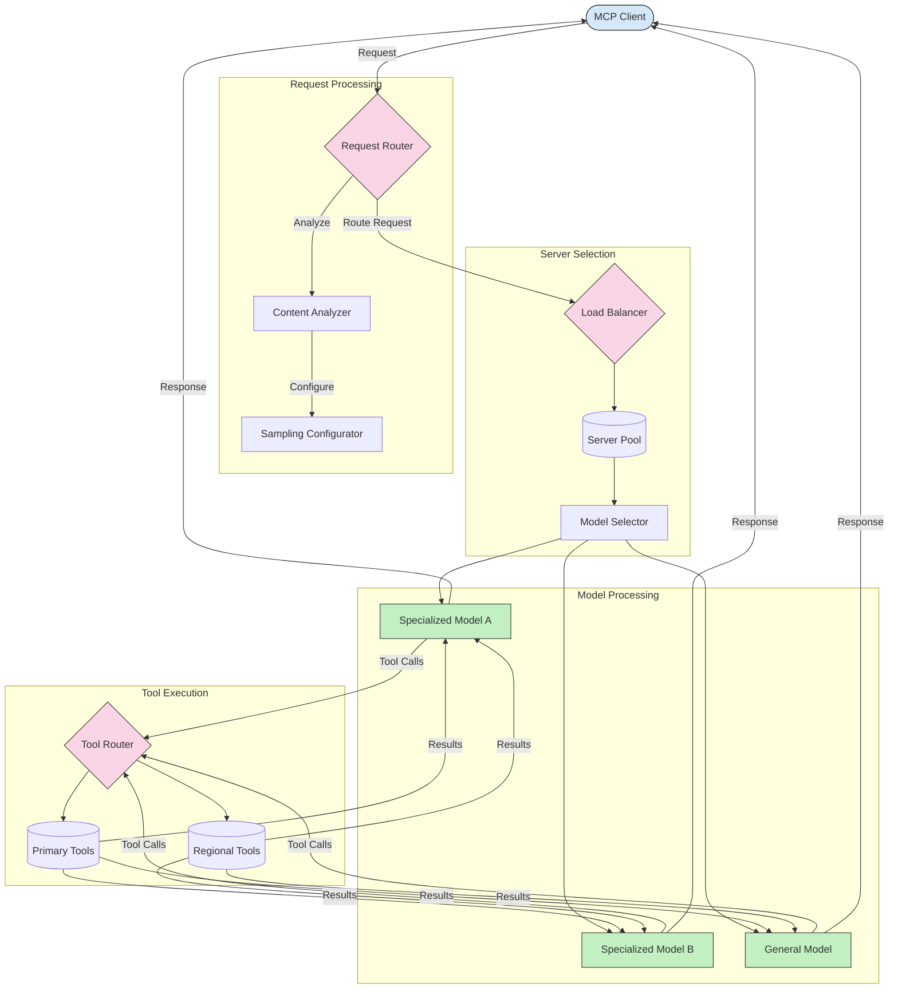

<!--
CO_OP_TRANSLATOR_METADATA:
{
  "original_hash": "af40eab7bd6ebf7e607f982a5506a5b5",
  "translation_date": "2025-06-12T23:09:36+00:00",
  "source_file": "05-AdvancedTopics/mcp-routing/README.md",
  "language_code": "ur"
}
-->
## MCP میں سیمپلنگ اور روٹنگ کا فن تعمیر

سیمپلنگ ماڈل کانٹیکسٹ پروٹوکول (MCP) کا ایک اہم جزو ہے جو درخواستوں کی مؤثر پروسیسنگ اور روٹنگ کی اجازت دیتا ہے۔ اس میں آنے والی درخواستوں کا تجزیہ شامل ہوتا ہے تاکہ مختلف معیارات جیسے مواد کی قسم، صارف کا سیاق و سباق، اور سسٹم کا بوجھ کی بنیاد پر سب سے مناسب ماڈل یا سروس کا تعین کیا جا سکے۔

سیمپلنگ اور روٹنگ کو ملا کر ایک مضبوط فن تعمیر بنایا جا سکتا ہے جو وسائل کے مؤثر استعمال کو بہتر بناتا ہے اور اعلی دستیابی کو یقینی بناتا ہے۔ سیمپلنگ کا عمل درخواستوں کی درجہ بندی کے لیے استعمال کیا جا سکتا ہے، جبکہ روٹنگ انہیں مناسب ماڈلز یا سروسز کی طرف بھیجتی ہے۔

ذیل میں دیا گیا خاکہ دکھاتا ہے کہ سیمپلنگ اور روٹنگ کس طرح جامع MCP فن تعمیر میں مل کر کام کرتے ہیں:

## اگلا کیا ہے

- [5.6 Sampling](../mcp-sampling/README.md)

**ڈس کلیمر**:  
یہ دستاویز AI ترجمہ سروس [Co-op Translator](https://github.com/Azure/co-op-translator) کے ذریعے ترجمہ کی گئی ہے۔ اگرچہ ہم درستگی کے لیے کوشاں ہیں، براہ کرم یہ بات ذہن میں رکھیں کہ خودکار ترجموں میں غلطیاں یا غیر یقینی معلومات ہو سکتی ہیں۔ اصل دستاویز اپنی مادری زبان میں معتبر ماخذ سمجھی جانی چاہیے۔ اہم معلومات کے لیے پیشہ ورانہ انسانی ترجمہ کی سفارش کی جاتی ہے۔ ہم اس ترجمے کے استعمال سے پیدا ہونے والی کسی بھی غلط فہمی یا غلط تشریح کے ذمہ دار نہیں ہیں۔