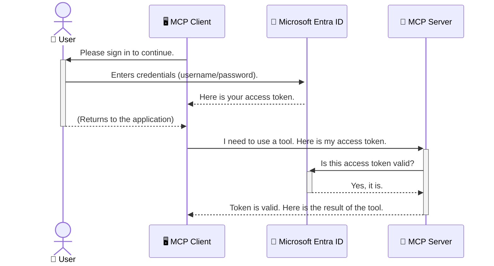

<!--
CO_OP_TRANSLATOR_METADATA:
{
  "original_hash": "6e562d7e5a77c8982da4aa8f762ad1d8",
  "translation_date": "2025-07-02T08:58:00+00:00",
  "source_file": "05-AdvancedTopics/mcp-security-entra/README.md",
  "language_code": "ur"
}
-->
# AI ورک فلو کی حفاظت: ماڈل کانٹیکسٹ پروٹوکول سرورز کے لیے Entra ID تصدیق

## تعارف  
اپنے Model Context Protocol (MCP) سرور کو محفوظ بنانا اتنا ہی ضروری ہے جتنا اپنے گھر کا دروازہ بند کرنا۔ اگر آپ کا MCP سرور کھلا رہے تو آپ کے اوزار اور ڈیٹا غیر مجاز رسائی کے لیے معرضِ خطر ہو جاتے ہیں، جس سے سیکیورٹی کی خلاف ورزیاں ہو سکتی ہیں۔ Microsoft Entra ID ایک مضبوط کلاؤڈ بیسڈ شناخت اور رسائی مینجمنٹ حل فراہم کرتا ہے، جو یقینی بناتا ہے کہ صرف مجاز صارفین اور ایپلیکیشنز ہی آپ کے MCP سرور سے تعامل کر سکیں۔ اس سیکشن میں، آپ سیکھیں گے کہ Entra ID تصدیق کے ذریعے اپنے AI ورک فلو کو کیسے محفوظ بنایا جائے۔

## سیکھنے کے مقاصد  
اس سیکشن کے اختتام تک، آپ قابل ہوں گے کہ:

- MCP سرورز کی حفاظت کی اہمیت کو سمجھیں۔  
- Microsoft Entra ID اور OAuth 2.0 تصدیق کی بنیادی باتوں کی وضاحت کریں۔  
- عوامی (public) اور خفیہ (confidential) کلائنٹس کے درمیان فرق پہچانیں۔  
- Entra ID تصدیق کو مقامی (public client) اور ریموٹ (confidential client) MCP سرور کے منظرناموں میں نافذ کریں۔  
- AI ورک فلو کی ترقی میں سیکیورٹی کی بہترین مشقیں اپنائیں۔

## سیکیورٹی اور MCP  

جیسے آپ اپنے گھر کا دروازہ کھلا نہیں چھوڑتے، ویسے ہی آپ کا MCP سرور بھی کسی کے لیے کھلا نہیں ہونا چاہیے۔ اپنے AI ورک فلو کو محفوظ بنانا مضبوط، قابل اعتماد اور محفوظ ایپلیکیشنز بنانے کے لیے ضروری ہے۔ یہ باب آپ کو Microsoft Entra ID کے استعمال سے MCP سرورز کو محفوظ بنانے کا تعارف کرائے گا، تاکہ صرف مجاز صارفین اور ایپلیکیشنز آپ کے اوزار اور ڈیٹا سے رابطہ کر سکیں۔

## MCP سرورز کے لیے سیکیورٹی کیوں اہم ہے  

تصور کریں کہ آپ کے MCP سرور میں ایسا ٹول ہے جو ای میل بھیج سکتا ہے یا کسٹمر ڈیٹا بیس تک رسائی حاصل کر سکتا ہے۔ اگر سرور غیر محفوظ ہو تو کوئی بھی اس ٹول کو استعمال کر کے غیر مجاز ڈیٹا تک رسائی، اسپام یا دیگر نقصان دہ سرگرمیاں کر سکتا ہے۔

تصدیق نافذ کر کے، آپ ہر درخواست کی تصدیق کرتے ہیں، جس سے یہ یقینی بنتا ہے کہ درخواست کرنے والا صارف یا ایپلیکیشن حقیقی اور مجاز ہے۔ یہ آپ کے AI ورک فلو کو محفوظ بنانے کا پہلا اور سب سے اہم قدم ہے۔

## Microsoft Entra ID کا تعارف  

[**Microsoft Entra ID**](https://adoption.microsoft.com/microsoft-security/entra/) ایک کلاؤڈ بیسڈ شناخت اور رسائی مینجمنٹ سروس ہے۔ اسے اپنے ایپلیکیشنز کے لیے ایک عالمی سیکیورٹی گارڈ سمجھیں۔ یہ صارفین کی شناخت کی تصدیق (authentication) اور ان کی اجازتوں کا تعین (authorization) کے پیچیدہ عمل کو سنبھالتا ہے۔

Entra ID استعمال کرنے سے آپ:

- صارفین کے لیے محفوظ سائن ان فعال کر سکتے ہیں۔  
- APIs اور سروسز کی حفاظت کر سکتے ہیں۔  
- رسائی کی پالیسیاں مرکزی جگہ سے مینیج کر سکتے ہیں۔

MCP سرورز کے لیے، Entra ID ایک مضبوط اور وسیع پیمانے پر قابلِ اعتماد حل فراہم کرتا ہے تاکہ یہ کنٹرول کیا جا سکے کہ کون آپ کے سرور کی صلاحیتوں تک رسائی حاصل کر سکتا ہے۔

---

## جادو کو سمجھنا: Entra ID تصدیق کیسے کام کرتی ہے  

Entra ID تصدیق کے لیے **OAuth 2.0** جیسے اوپن اسٹینڈرڈز استعمال کرتا ہے۔ تفصیلات پیچیدہ ہو سکتی ہیں، مگر بنیادی تصور ایک مثال سے سمجھنا آسان ہے۔

### OAuth 2.0 کا ہلکا تعارف: ویلیٹ کی  

OAuth 2.0 کو اپنے کار کے لیے ویلیٹ سروس کی طرح سمجھیں۔ جب آپ ریسٹورنٹ پہنچتے ہیں، تو آپ ویلیٹ کو اپنا ماسٹر کی نہیں دیتے بلکہ ایک **ویلیٹ کی** دیتے ہیں جس میں محدود اجازتیں ہوتی ہیں — یہ کار اسٹارٹ کر سکتی ہے اور دروازے بند کر سکتی ہے، مگر ٹرنک یا گلوز کمپارٹمنٹ نہیں کھول سکتی۔

اس مثال میں:

- **آپ** ہیں **User**۔  
- **آپ کی کار** ہے **MCP Server** جس میں قیمتی اوزار اور ڈیٹا ہے۔  
- **ویلیٹ** ہے **Microsoft Entra ID**۔  
- **پارکنگ اٹینڈنٹ** ہے **MCP Client** (وہ ایپلیکیشن جو سرور تک رسائی چاہتی ہے)۔  
- **ویلیٹ کی** ہے **Access Token**۔

Access Token ایک محفوظ ٹیکسٹ سٹرنگ ہے جو MCP کلائنٹ کو Entra ID سے سائن ان کے بعد ملتی ہے۔ کلائنٹ ہر درخواست کے ساتھ یہ ٹوکن MCP سرور کو دیتا ہے۔ سرور ٹوکن کی تصدیق کر کے یقین کرتا ہے کہ درخواست جائز ہے اور کلائنٹ کے پاس ضروری اجازتیں ہیں، بغیر آپ کے اصل اسناد (جیسے پاس ورڈ) کو ہینڈل کیے۔

### تصدیق کا عمل  

عملی طور پر یہ طریقہ کار کچھ یوں ہوتا ہے:



### Microsoft Authentication Library (MSAL) کا تعارف  

کوڈ میں جانے سے پہلے، ایک اہم جزو سے تعارف ضروری ہے: **Microsoft Authentication Library (MSAL)**۔

MSAL مائیکروسافٹ کی جانب سے تیار کردہ ایک لائبریری ہے جو ڈویلپرز کے لیے تصدیق کا عمل آسان بناتی ہے۔ آپ کو سیکیورٹی ٹوکنز، سائن ان مینجمنٹ، اور سیشن ریفریش کے پیچیدہ کوڈ لکھنے کی ضرورت نہیں پڑتی کیونکہ MSAL یہ سب خود سنبھال لیتا ہے۔

MSAL استعمال کرنے کی وجوہات:

- **یہ محفوظ ہے:** یہ انڈسٹری اسٹینڈرڈ پروٹوکولز اور بہترین سیکیورٹی طریقے اپناتا ہے، جس سے آپ کے کوڈ میں کمزوریاں کم ہو جاتی ہیں۔  
- **یہ ترقی کو آسان بناتا ہے:** OAuth 2.0 اور OpenID Connect کی پیچیدگیوں کو چھپاتا ہے، تاکہ آپ چند لائنوں میں مضبوط تصدیق شامل کر سکیں۔  
- **یہ باقاعدگی سے اپ ڈیٹ ہوتا ہے:** مائیکروسافٹ MSAL کو نئے سیکیورٹی خطرات اور پلیٹ فارم تبدیلیوں کے مطابق اپ ڈیٹ کرتا رہتا ہے۔

MSAL مختلف زبانوں اور فریم ورکس کو سپورٹ کرتا ہے، جیسے .NET, JavaScript/TypeScript, Python, Java, Go، اور موبائل پلیٹ فارمز جیسے iOS اور Android۔ اس کا مطلب ہے کہ آپ اپنی پوری ٹیکنالوجی اسٹیک میں یکساں تصدیق کے طریقے استعمال کر سکتے ہیں۔

مزید جاننے کے لیے، آپ [MSAL کا سرکاری تعارفی دستاویز](https://learn.microsoft.com/entra/identity-platform/msal-overview) دیکھ سکتے ہیں۔

---

## Entra ID کے ذریعے اپنے MCP سرور کو محفوظ بنانا: مرحلہ وار رہنمائی  

اب، چلیں دیکھتے ہیں کہ ایک مقامی MCP سرور (جو `stdio`) using Entra ID. This example uses a **public client**, which is suitable for applications running on a user's machine, like a desktop app or a local development server.

### Scenario 1: Securing a Local MCP Server (with a Public Client)

In this scenario, we'll look at an MCP server that runs locally, communicates over `stdio`, and uses Entra ID to authenticate the user before allowing access to its tools. The server will have a single tool that fetches the user's profile information from the Microsoft Graph API.

#### 1. Setting Up the Application in Entra ID

Before writing any code, you need to register your application in Microsoft Entra ID. This tells Entra ID about your application and grants it permission to use the authentication service.

1. Navigate to the **[Microsoft Entra portal](https://entra.microsoft.com/)**.
2. Go to **App registrations** and click **New registration**.
3. Give your application a name (e.g., "My Local MCP Server").
4. For **Supported account types**, select **Accounts in this organizational directory only**.
5. You can leave the **Redirect URI** blank for this example.
6. Click **Register**.

Once registered, take note of the **Application (client) ID** and **Directory (tenant) ID**. You'll need these in your code.

#### 2. The Code: A Breakdown

Let's look at the key parts of the code that handle authentication. The full code for this example is available in the [Entra ID - Local - WAM](https://github.com/Azure-Samples/mcp-auth-servers/tree/main/src/entra-id-local-wam) folder of the [mcp-auth-servers GitHub repository](https://github.com/Azure-Samples/mcp-auth-servers).

**`AuthenticationService.cs`**

This class is responsible for handling the interaction with Entra ID.

- **`CreateAsync`**: This method initializes the `PublicClientApplication` from the MSAL (Microsoft Authentication Library). It's configured with your application's `clientId` and `tenantId`.
- **`WithBroker`**: This enables the use of a broker (like the Windows Web Account Manager), which provides a more secure and seamless single sign-on experience.
- **`AcquireTokenAsync` کے ذریعے بات چیت کرتا ہے) کو کیسے محفوظ کیا جاتا ہے: یہ بنیادی طریقہ ہے۔ سب سے پہلے یہ خاموشی سے ٹوکن حاصل کرنے کی کوشش کرتا ہے (یعنی اگر صارف کے پاس پہلے سے درست سیشن ہے تو اسے دوبارہ سائن ان کرنے کی ضرورت نہیں ہوتی)۔ اگر خاموشی سے ٹوکن حاصل نہ ہو سکے، تو صارف کو انٹرایکٹو سائن ان کے لیے کہا جاتا ہے۔

```csharp
// Simplified for clarity
public static async Task<AuthenticationService> CreateAsync(ILogger<AuthenticationService> logger)
{
    var msalClient = PublicClientApplicationBuilder
        .Create(_clientId) // Your Application (client) ID
        .WithAuthority(AadAuthorityAudience.AzureAdMyOrg)
        .WithTenantId(_tenantId) // Your Directory (tenant) ID
        .WithBroker(new BrokerOptions(BrokerOptions.OperatingSystems.Windows))
        .Build();

    // ... cache registration ...

    return new AuthenticationService(logger, msalClient);
}

public async Task<string> AcquireTokenAsync()
{
    try
    {
        // Try silent authentication first
        var accounts = await _msalClient.GetAccountsAsync();
        var account = accounts.FirstOrDefault();

        AuthenticationResult? result = null;

        if (account != null)
        {
            result = await _msalClient.AcquireTokenSilent(_scopes, account).ExecuteAsync();
        }
        else
        {
            // If no account, or silent fails, go interactive
            result = await _msalClient.AcquireTokenInteractive(_scopes).ExecuteAsync();
        }

        return result.AccessToken;
    }
    catch (Exception ex)
    {
        _logger.LogError(ex, "An error occurred while acquiring the token.");
        throw; // Optionally rethrow the exception for higher-level handling
    }
}
```

**`Program.cs`**

This is where the MCP server is set up and the authentication service is integrated.

- **`AddSingleton<AuthenticationService>`**: This registers the `AuthenticationService` with the dependency injection container, so it can be used by other parts of the application (like our tool).
- **`GetUserDetailsFromGraph` tool**: This tool requires an instance of `AuthenticationService`. Before it does anything, it calls `authService.AcquireTokenAsync()`** کا استعمال کر کے ایک درست Access Token حاصل کیا جاتا ہے۔ اگر تصدیق کامیاب ہو جائے، تو یہ ٹوکن Microsoft Graph API کو کال کرنے اور صارف کی تفصیلات حاصل کرنے کے لیے استعمال ہوتا ہے۔

```csharp
// Simplified for clarity
[McpServerTool(Name = "GetUserDetailsFromGraph")]
public static async Task<string> GetUserDetailsFromGraph(
    AuthenticationService authService)
{
    try
    {
        // This will trigger the authentication flow
        var accessToken = await authService.AcquireTokenAsync();

        // Use the token to create a GraphServiceClient
        var graphClient = new GraphServiceClient(
            new BaseBearerTokenAuthenticationProvider(new TokenProvider(authService)));

        var user = await graphClient.Me.GetAsync();

        return System.Text.Json.JsonSerializer.Serialize(user);
    }
    catch (Exception ex)
    {
        return $"Error: {ex.Message}";
    }
}
```

#### 3. یہ سب کیسے مل کر کام کرتا ہے  

1. جب MCP کلائنٹ `GetUserDetailsFromGraph` tool, the tool first calls `AcquireTokenAsync`.
2. `AcquireTokenAsync` triggers the MSAL library to check for a valid token.
3. If no token is found, MSAL, through the broker, will prompt the user to sign in with their Entra ID account.
4. Once the user signs in, Entra ID issues an access token.
5. The tool receives the token and uses it to make a secure call to the Microsoft Graph API.
6. The user's details are returned to the MCP client.

This process ensures that only authenticated users can use the tool, effectively securing your local MCP server.

### Scenario 2: Securing a Remote MCP Server (with a Confidential Client)

When your MCP server is running on a remote machine (like a cloud server) and communicates over a protocol like HTTP Streaming, the security requirements are different. In this case, you should use a **confidential client** and the **Authorization Code Flow**. This is a more secure method because the application's secrets are never exposed to the browser.

This example uses a TypeScript-based MCP server that uses Express.js to handle HTTP requests.

#### 1. Setting Up the Application in Entra ID

The setup in Entra ID is similar to the public client, but with one key difference: you need to create a **client secret**.

1. Navigate to the **[Microsoft Entra portal](https://entra.microsoft.com/)**.
2. In your app registration, go to the **Certificates & secrets** tab.
3. Click **New client secret**, give it a description, and click **Add**.
4. **Important:** Copy the secret value immediately. You will not be able to see it again.
5. You also need to configure a **Redirect URI**. Go to the **Authentication** tab, click **Add a platform**, select **Web**, and enter the redirect URI for your application (e.g., `http://localhost:3001/auth/callback`).

> **⚠️ Important Security Note:** For production applications, Microsoft strongly recommends using **secretless authentication** methods such as **Managed Identity** or **Workload Identity Federation** instead of client secrets. Client secrets pose security risks as they can be exposed or compromised. Managed identities provide a more secure approach by eliminating the need to store credentials in your code or configuration.
>
> For more information about managed identities and how to implement them, see the [Managed identities for Azure resources overview](https://learn.microsoft.com/entra/identity/managed-identities-azure-resources/overview).

#### 2. The Code: A Breakdown

This example uses a session-based approach. When the user authenticates, the server stores the access token and refresh token in a session and gives the user a session token. This session token is then used for subsequent requests. The full code for this example is available in the [Entra ID - Confidential client](https://github.com/Azure-Samples/mcp-auth-servers/tree/main/src/entra-id-cca-session) folder of the [mcp-auth-servers GitHub repository](https://github.com/Azure-Samples/mcp-auth-servers).

**`Server.ts`**

This file sets up the Express server and the MCP transport layer.

- **`requireBearerAuth`**: This is middleware that protects the `/sse` and `/message` endpoints. It checks for a valid bearer token in the `Authorization` header of the request.
- **`EntraIdServerAuthProvider`**: This is a custom class that implements the `McpServerAuthorizationProvider` interface. It's responsible for handling the OAuth 2.0 flow.
- **`/auth/callback` کو کال کرتا ہے: یہ اینڈپوائنٹ Entra ID سے صارف کی تصدیق کے بعد ری ڈائریکٹ کو ہینڈل کرتا ہے۔ یہ authorization code کو access token اور refresh token میں تبدیل کرتا ہے۔

```typescript
// Simplified for clarity
const app = express();
const { server } = createServer();
const provider = new EntraIdServerAuthProvider();

// Protect the SSE endpoint
app.get("/sse", requireBearerAuth({
  provider,
  requiredScopes: ["User.Read"]
}), async (req, res) => {
  // ... connect to the transport ...
});

// Protect the message endpoint
app.post("/message", requireBearerAuth({
  provider,
  requiredScopes: ["User.Read"]
}), async (req, res) => {
  // ... handle the message ...
});

// Handle the OAuth 2.0 callback
app.get("/auth/callback", (req, res) => {
  provider.handleCallback(req.query.code, req.query.state)
    .then(result => {
      // ... handle success or failure ...
    });
});
```

**`Tools.ts`**

This file defines the tools that the MCP server provides. The `getUserDetails`** ٹول پچھلے مثال کی طرح ہے، مگر یہ سیشن سے access token حاصل کرتا ہے۔

```typescript
// Simplified for clarity
server.setRequestHandler(CallToolRequestSchema, async (request) => {
  const { name } = request.params;
  const context = request.params?.context as { token?: string } | undefined;
  const sessionToken = context?.token;

  if (name === ToolName.GET_USER_DETAILS) {
    if (!sessionToken) {
      throw new AuthenticationError("Authentication token is missing or invalid. Ensure the token is provided in the request context.");
    }

    // Get the Entra ID token from the session store
    const tokenData = tokenStore.getToken(sessionToken);
    const entraIdToken = tokenData.accessToken;

    const graphClient = Client.init({
      authProvider: (done) => {
        done(null, entraIdToken);
      }
    });

    const user = await graphClient.api('/me').get();

    // ... return user details ...
  }
});
```

**`auth/EntraIdServerAuthProvider.ts`**

This class handles the logic for:

- Redirecting the user to the Entra ID sign-in page.
- Exchanging the authorization code for an access token.
- Storing the tokens in the `tokenStore`.
- Refreshing the access token when it expires.

#### 3. How It All Works Together

1. When a user first tries to connect to the MCP server, the `requireBearerAuth` middleware will see that they don't have a valid session and will redirect them to the Entra ID sign-in page.
2. The user signs in with their Entra ID account.
3. Entra ID redirects the user back to the `/auth/callback` endpoint with an authorization code.
4. The server exchanges the code for an access token and a refresh token, stores them, and creates a session token which is sent to the client.
5. The client can now use this session token in the `Authorization` header for all future requests to the MCP server.
6. When the `getUserDetails`** ٹول کال ہونے پر، یہ سیشن ٹوکن سے Entra ID access token تلاش کرتا ہے اور پھر اسے Microsoft Graph API کو کال کرنے کے لیے استعمال کرتا ہے۔

یہ فلو پبلک کلائنٹ فلو سے زیادہ پیچیدہ ہے، لیکن انٹرنیٹ پر دستیاب اینڈپوائنٹس کے لیے ضروری ہے۔ چونکہ ریموٹ MCP سرورز عوامی انٹرنیٹ پر دستیاب ہوتے ہیں، اس لیے انہیں غیر مجاز رسائی اور ممکنہ حملوں سے بچانے کے لیے سخت سیکیورٹی تدابیر کی ضرورت ہوتی ہے۔

## سیکیورٹی کی بہترین مشقیں  

- **ہمیشہ HTTPS استعمال کریں:** کلائنٹ اور سرور کے درمیان مواصلات کو انکرپٹ کریں تاکہ ٹوکنز چوری نہ ہو سکیں۔  
- **رول بیسڈ ایکسیس کنٹرول (RBAC) نافذ کریں:** صرف یہ نہ چیک کریں کہ صارف تصدیق شدہ ہے بلکہ یہ بھی دیکھیں کہ اسے کیا کرنے کی اجازت ہے۔ آپ Entra ID میں رولز ڈیفائن کر کے انہیں MCP سرور میں چیک کر سکتے ہیں۔  
- **مانیٹرنگ اور آڈٹ کریں:** تمام تصدیقی واقعات کو لاگ کریں تاکہ مشکوک سرگرمی کا پتہ لگایا جا سکے اور اس کا جواب دیا جا سکے۔  
- **ریٹ لمٹنگ اور تھروٹلنگ کو ہینڈل کریں:** Microsoft Graph اور دیگر APIs ریٹ لمٹنگ کرتے ہیں تاکہ غلط استعمال نہ ہو۔ اپنے MCP سرور میں ایکسپونینشل بیک آف اور ری ٹرائی لاجک شامل کریں تاکہ HTTP 429 (Too Many Requests) کے جواب کو مؤثر طریقے سے ہینڈل کیا جا سکے۔ اکثر استعمال ہونے والے ڈیٹا کو کیش کر کے API کالز کم کریں۔  
- **ٹوکن اسٹوریج محفوظ کریں:** Access اور refresh tokens کو محفوظ طریقے سے اسٹور کریں۔ مقامی ایپلیکیشنز کے لیے سسٹم کی محفوظ اسٹوریج میکانزم استعمال کریں۔ سرور ایپلیکیشنز کے لیے انکرپٹڈ اسٹوریج یا Azure Key Vault جیسے محفوظ کی مینجمنٹ سروسز کا استعمال کریں۔  
- **ٹوکن کی میعاد ختم ہونے کا انتظام کریں:** Access tokens کی محدود مدت ہوتی ہے۔ خودکار ٹوکن ریفریش کو نافذ کریں تاکہ صارف کو دوبارہ لاگ ان کیے بغیر سیشن جاری رہ سکے۔  
- **Azure API Management کا استعمال کریں:** اگرچہ MCP سرور میں سیکیورٹی نافذ کرنے سے آپ کو باریک کنٹرول ملتا ہے، API گیٹ ویز جیسے Azure API Management خود بخود بہت سی سیکیورٹی تشویشات جیسے تصدیق، اجازت، ریٹ لمٹنگ، اور مانیٹرنگ سنبھال سکتے ہیں۔ یہ ایک مرکزی سیکیورٹی پرت فراہم کرتے ہیں جو آپ کے کلائنٹس اور MCP سرورز کے درمیان آتی ہے۔ MCP کے ساتھ API گیٹ وے کے استعمال کی مزید تفصیلات کے لیے ہمارا [Azure API Management Your Auth Gateway For MCP Servers](https://techcommunity.microsoft.com/blog/integrationsonazureblog/azure-api-management-your-auth-gateway-for-mcp-servers/4402690) دیکھیں۔

## اہم نکات  

- اپنے MCP سرور کی حفاظت آپ کے ڈیٹا اور اوزار کی حفاظت کے لیے انتہائی ضروری ہے۔  
- Microsoft Entra ID تصدیق اور اجازت کے لیے ایک مضبوط اور قابل توسیع حل فراہم کرتا ہے۔  
- مقامی ایپلیکیشنز کے لیے **public client** اور ریموٹ سرورز کے لیے **confidential client** استعمال کریں۔  
- ویب ایپلیکیشنز کے لیے **Authorization Code Flow** سب سے زیادہ محفوظ طریقہ ہے۔

## مشق  

1. ایک MCP سرور کے بارے میں سوچیں جو آپ بنا سکتے ہیں۔ کیا یہ مقامی ہوگا یا ریموٹ؟  
2. اپنے جواب کی بنیاد پر، کیا آپ public یا confidential client استعمال کریں گے؟  
3. Microsoft Graph کے خلاف کارروائیاں کرنے کے لیے آپ کا MCP سرور کون سی اجازت طلب کرے گا؟

## عملی مشقیں  

### مشق 1: Entra ID میں ایک ایپلیکیشن رجسٹر کریں  
Microsoft Entra پورٹل پر جائیں۔  
اپنے MCP سرور کے لیے ایک نئی ایپلیکیشن رجسٹر کریں۔  
Application (client) ID اور Directory (tenant) ID نوٹ کریں۔

### مشق 2: مقامی MCP سرور کو محفوظ بنائیں (Public Client)  
- MSAL (Microsoft Authentication Library) کو صارف کی تصدیق کے لیے انٹیگریٹ کرنے کے لیے کوڈ مثال پر عمل کریں۔  
- Microsoft Graph سے صارف کی تفصیلات حاصل کرنے والے MCP ٹول کو کال کر کے تصدیقی عمل کی جانچ کریں۔

### مشق 3: ریموٹ MCP سرور کو محفوظ بنائیں (Confidential Client)  
- Entra ID میں ایک confidential client رجسٹر کریں اور client secret بنائیں۔  
- اپنے Express.js MCP سرور کو Authorization Code Flow استعمال کرنے کے لیے کنفیگر کریں۔  
- محفوظ اینڈپوائنٹس کی جانچ کریں اور ٹوکن کی بنیاد پر رسائی کی تصدیق کریں۔

### مشق 4: سیکیورٹی کی بہترین مشقیں اپنائیں  
- اپنے مقامی یا ریموٹ سرور کے لیے HTTPS فعال کریں۔  
- سرور لاجک میں رول بیسڈ ایکسیس کنٹرول (RBAC) نافذ کریں۔  
- ٹوکن کی میعاد ختم ہونے کا انتظام اور محفوظ ٹوکن اسٹوریج شامل کریں۔

## وسائل  

1. **MSAL کا تعارفی دستاویز**  
   Microsoft Authentication Library (MSAL) کے ذریعے مختلف پلیٹ فارمز پر محفوظ ٹوکن حاصل کرنے کا طریقہ:  
   [MSAL Overview on Microsoft Learn](https://learn.microsoft.com/en-gb/entra/msal/overview)

2. **Azure-Samples/mcp-auth-servers GitHub ریپوزٹری**  
   MCP سرورز کی تصدیقی فلو کی ریفرنس امپلیمنٹیشنز:  
   [Azure-Samples/mcp-auth-servers on GitHub](https://github.com/Azure-Samples/mcp-auth-servers)

3. **Managed Identities for Azure Resources کا تعارف**  
   سسٹم یا صارف مختص Managed Identities کے ذریعے سیکریٹس کو ختم کرنے کا طریقہ:  
   [Managed Identities Overview on Microsoft Learn](https://learn.microsoft.com/en-us/entra/identity/managed-identities-azure-resources/)

4. **Azure API Management: Your Auth Gateway for MCP Servers**  
   MCP سرورز کے لیے APIM کو ایک محفوظ OAuth2 گیٹ وے کے طور پر استعمال کرنے کا تفصیلی جائزہ:  
   [Azure API Management Your Auth Gateway For MCP Servers](https://techcommunity.microsoft.com/blog/integrationsonazureblog/azure-api-management-your-auth-gateway-for-mcp-servers/4402690)

5. **Microsoft Graph Permissions Reference**  
   Microsoft Graph کے لیے ڈیلیگیٹڈ اور ایپلیکیشن اجازتوں کی جامع فہرست:  
   [Microsoft Graph Permissions Reference](https://learn.microsoft.com/zh-tw/graph/permissions-reference)

## سیکھنے کے نتائج  
اس سیکشن کو مکمل کرنے کے بعد، آپ قابل ہوں گے کہ:

- وضاحت کریں کہ MCP سرورز اور AI ورک فلو کے لیے تصدیق کیوں ضروری ہے۔  
- Entra ID تصدیق کو مقامی اور ریموٹ MCP سرور دونوں کے لیے سیٹ اپ اور کنفیگر کریں۔  
- اپنے سرور کی تعیناتی کے مطابق مناسب کلائنٹ قسم (public یا confidential) کا انتخاب کریں۔  
- محفوظ کوڈنگ کے طریقے نافذ کریں، بشمول ٹوکن اسٹوریج اور رول بیسڈ اجازت۔  
- اپنے MCP سرور اور اس کے اوزار کو غیر مجاز رسائی سے مؤثر طریقے سے محفوظ بنائیں۔

## آگے کیا ہے  

- [5.13 Model Context Protocol (MCP) Integration with Azure AI Foundry](../mcp-foundry-agent-integration/README.md)

**دستخطی بیان**:  
یہ دستاویز AI ترجمہ سروس [Co-op Translator](https://github.com/Azure/co-op-translator) کے ذریعے ترجمہ کی گئی ہے۔ اگرچہ ہم درستگی کے لیے کوشاں ہیں، براہ کرم اس بات سے آگاہ رہیں کہ خودکار تراجم میں غلطیاں یا عدم درستیاں ہو سکتی ہیں۔ اصل دستاویز اپنی مادری زبان میں معتبر ماخذ سمجھی جانی چاہیے۔ اہم معلومات کے لیے پیشہ ورانہ انسانی ترجمہ تجویز کیا جاتا ہے۔ ہم اس ترجمے کے استعمال سے پیدا ہونے والی کسی بھی غلط فہمی یا غلط تشریح کے ذمہ دار نہیں ہیں۔