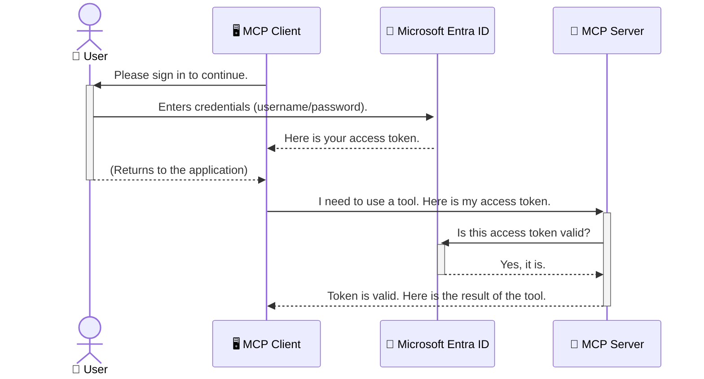

<!--
CO_OP_TRANSLATOR_METADATA:
{
  "original_hash": "6e562d7e5a77c8982da4aa8f762ad1d8",
  "translation_date": "2025-07-14T02:50:18+00:00",
  "source_file": "05-AdvancedTopics/mcp-security-entra/README.md",
  "language_code": "ur"
}
-->
# AI ورک فلو کی حفاظت: ماڈل کانٹیکسٹ پروٹوکول سرورز کے لیے Entra ID تصدیق

## تعارف  
اپنے ماڈل کانٹیکسٹ پروٹوکول (MCP) سرور کو محفوظ بنانا بالکل ویسا ہی ضروری ہے جیسے آپ اپنے گھر کا مرکزی دروازہ بند کرتے ہیں۔ اگر آپ کا MCP سرور کھلا رہے تو آپ کے ٹولز اور ڈیٹا غیر مجاز رسائی کے لیے معرضِ خطرہ بن جاتے ہیں، جو سیکیورٹی خلاف ورزیوں کا باعث بن سکتا ہے۔ Microsoft Entra ID ایک مضبوط کلاؤڈ بیسڈ شناخت اور رسائی مینجمنٹ حل فراہم کرتا ہے، جو یقینی بناتا ہے کہ صرف مجاز صارفین اور ایپلیکیشنز ہی آپ کے MCP سرور سے رابطہ کر سکیں۔ اس سیکشن میں، آپ سیکھیں گے کہ Entra ID تصدیق کے ذریعے اپنے AI ورک فلو کو کیسے محفوظ بنایا جائے۔

## سیکھنے کے مقاصد  
اس سیکشن کے اختتام تک، آپ قابل ہوں گے کہ:

- MCP سرورز کی حفاظت کی اہمیت کو سمجھیں۔  
- Microsoft Entra ID اور OAuth 2.0 تصدیق کی بنیادی باتوں کی وضاحت کریں۔  
- عوامی اور خفیہ کلائنٹس کے درمیان فرق کو پہچانیں۔  
- Entra ID تصدیق کو مقامی (عوامی کلائنٹ) اور دور دراز (خفیہ کلائنٹ) MCP سرور کے منظرناموں میں نافذ کریں۔  
- AI ورک فلو تیار کرتے وقت سیکیورٹی کی بہترین مشقیں اپنائیں۔

## سیکیورٹی اور MCP  

جیسے آپ اپنے گھر کا مرکزی دروازہ کھلا نہیں چھوڑتے، ویسے ہی آپ کو اپنے MCP سرور کو بھی ہر کسی کے لیے کھلا نہیں چھوڑنا چاہیے۔ اپنے AI ورک فلو کی حفاظت کرنا مضبوط، قابل اعتماد اور محفوظ ایپلیکیشنز بنانے کے لیے ناگزیر ہے۔ یہ باب آپ کو Microsoft Entra ID کے استعمال سے اپنے MCP سرورز کو محفوظ بنانے کا طریقہ سکھائے گا، تاکہ صرف مجاز صارفین اور ایپلیکیشنز ہی آپ کے ٹولز اور ڈیٹا تک رسائی حاصل کر سکیں۔

## MCP سرورز کے لیے سیکیورٹی کیوں ضروری ہے  

فرض کریں کہ آپ کے MCP سرور میں ایک ایسا ٹول ہے جو ای میل بھیج سکتا ہے یا کسٹمر ڈیٹا بیس تک رسائی حاصل کر سکتا ہے۔ اگر سرور غیر محفوظ ہو تو کوئی بھی اس ٹول کو استعمال کر سکتا ہے، جس سے غیر مجاز ڈیٹا تک رسائی، اسپیم یا دیگر نقصان دہ سرگرمیاں ہو سکتی ہیں۔

تصدیق نافذ کر کے، آپ یقینی بناتے ہیں کہ ہر درخواست کی تصدیق کی جائے، یعنی درخواست کرنے والے صارف یا ایپلیکیشن کی شناخت کی تصدیق ہو۔ یہ آپ کے AI ورک فلو کی حفاظت کا پہلا اور سب سے اہم قدم ہے۔

## Microsoft Entra ID کا تعارف  

[**Microsoft Entra ID**](https://adoption.microsoft.com/microsoft-security/entra/) ایک کلاؤڈ بیسڈ شناخت اور رسائی مینجمنٹ سروس ہے۔ اسے آپ اپنی ایپلیکیشنز کے لیے ایک عالمی سیکیورٹی گارڈ سمجھیں۔ یہ صارف کی شناخت کی تصدیق (authentication) اور اجازت (authorization) کے پیچیدہ عمل کو سنبھالتا ہے۔

Entra ID کے استعمال سے آپ کر سکتے ہیں:

- صارفین کے لیے محفوظ سائن ان کو فعال کریں۔  
- APIs اور سروسز کی حفاظت کریں۔  
- رسائی کی پالیسیاں ایک مرکزی مقام سے منظم کریں۔

MCP سرورز کے لیے، Entra ID ایک مضبوط اور وسیع پیمانے پر قابل اعتماد حل فراہم کرتا ہے تاکہ یہ کنٹرول کیا جا سکے کہ کون آپ کے سرور کی صلاحیتوں تک رسائی حاصل کر سکتا ہے۔

---

## جادو کو سمجھنا: Entra ID تصدیق کیسے کام کرتی ہے  

Entra ID تصدیق کے لیے **OAuth 2.0** جیسے اوپن اسٹینڈرڈز استعمال کرتا ہے۔ تفصیلات پیچیدہ ہو سکتی ہیں، لیکن بنیادی تصور آسان ہے اور ایک مثال سے سمجھا جا سکتا ہے۔

### OAuth 2.0 کا نرم تعارف: ویلیٹ کی  

OAuth 2.0 کو اپنی گاڑی کے لیے ویلیٹ سروس سمجھیں۔ جب آپ کسی ریستوران پہنچتے ہیں، تو آپ ویلیٹ کو اپنی ماسٹر کی نہیں دیتے۔ بلکہ آپ ایک **ویلیٹ کی** دیتے ہیں جس کی محدود اجازتیں ہوتی ہیں—یہ گاڑی اسٹارٹ کر سکتا ہے اور دروازے بند کر سکتا ہے، لیکن ٹرنک یا گلوز کمپارٹمنٹ نہیں کھول سکتا۔

اس مثال میں:

- **آپ** ہیں **صارف**۔  
- **آپ کی گاڑی** ہے **MCP سرور** جس میں قیمتی ٹولز اور ڈیٹا ہے۔  
- **ویلیٹ** ہے **Microsoft Entra ID**۔  
- **پارکنگ اٹینڈنٹ** ہے **MCP کلائنٹ** (وہ ایپلیکیشن جو سرور تک رسائی چاہتی ہے)۔  
- **ویلیٹ کی** ہے **Access Token**۔

Access token ایک محفوظ متن کی شکل ہے جو MCP کلائنٹ کو Entra ID سے سائن ان کے بعد ملتی ہے۔ کلائنٹ ہر درخواست کے ساتھ یہ ٹوکن MCP سرور کو پیش کرتا ہے۔ سرور اس ٹوکن کی تصدیق کر کے یقینی بناتا ہے کہ درخواست جائز ہے اور کلائنٹ کے پاس ضروری اجازتیں ہیں، بغیر آپ کے اصل اسناد (جیسے پاس ورڈ) کو ہینڈل کیے۔

### تصدیق کا عمل  

عملی طور پر یہ طریقہ کار کچھ یوں ہوتا ہے:



### Microsoft Authentication Library (MSAL) کا تعارف  

کوڈ میں جانے سے پہلے، ایک اہم جزو سے واقف ہونا ضروری ہے جو آپ مثالوں میں دیکھیں گے: **Microsoft Authentication Library (MSAL)**۔

MSAL مائیکروسافٹ کی تیار کردہ لائبریری ہے جو ڈویلپرز کے لیے تصدیق کو آسان بناتی ہے۔ آپ کو سیکیورٹی ٹوکنز، سائن ان مینجمنٹ، اور سیشن ریفریش کے پیچیدہ کوڈ لکھنے کی ضرورت نہیں پڑتی، کیونکہ MSAL یہ سب خود سنبھالتا ہے۔

MSAL استعمال کرنے کی سفارش کی جاتی ہے کیونکہ:

- **یہ محفوظ ہے:** یہ انڈسٹری اسٹینڈرڈ پروٹوکولز اور سیکیورٹی کی بہترین مشقیں نافذ کرتا ہے، جس سے آپ کے کوڈ میں کمزوریوں کا خطرہ کم ہوتا ہے۔  
- **یہ ترقی کو آسان بناتا ہے:** OAuth 2.0 اور OpenID Connect کے پیچیدہ عمل کو چھپا دیتا ہے، تاکہ آپ چند لائنوں میں مضبوط تصدیق اپنی ایپلیکیشن میں شامل کر سکیں۔  
- **یہ برقرار رکھا جاتا ہے:** مائیکروسافٹ MSAL کو فعال طور پر اپ ڈیٹ کرتا رہتا ہے تاکہ نئے سیکیورٹی خطرات اور پلیٹ فارم تبدیلیوں کا مقابلہ کیا جا سکے۔

MSAL مختلف زبانوں اور فریم ورکس کو سپورٹ کرتا ہے، جیسے .NET، JavaScript/TypeScript، Python، Java، Go، اور موبائل پلیٹ فارمز جیسے iOS اور Android۔ اس کا مطلب ہے کہ آپ اپنی پوری ٹیکنالوجی اسٹیک میں یکساں تصدیقی طریقے استعمال کر سکتے ہیں۔

MSAL کے بارے میں مزید جاننے کے لیے، آپ سرکاری [MSAL اوورویو دستاویزات](https://learn.microsoft.com/entra/identity-platform/msal-overview) دیکھ سکتے ہیں۔

---

## Entra ID کے ساتھ اپنے MCP سرور کی حفاظت: مرحلہ وار رہنمائی  

اب، آئیے دیکھتے ہیں کہ Entra ID کے ذریعے ایک مقامی MCP سرور (جو `stdio` کے ذریعے بات چیت کرتا ہے) کو کیسے محفوظ بنایا جائے۔ یہ مثال ایک **عوامی کلائنٹ** استعمال کرتی ہے، جو صارف کے کمپیوٹر پر چلنے والی ایپلیکیشنز جیسے ڈیسک ٹاپ ایپ یا مقامی ڈیولپمنٹ سرور کے لیے موزوں ہے۔

### منظرنامہ 1: مقامی MCP سرور کی حفاظت (عوامی کلائنٹ کے ساتھ)  

اس منظرنامے میں، ہم ایک ایسے MCP سرور کو دیکھیں گے جو مقامی طور پر چلتا ہے، `stdio` کے ذریعے بات چیت کرتا ہے، اور Entra ID کے ذریعے صارف کی تصدیق کرتا ہے تاکہ اس کے ٹولز تک رسائی دی جا سکے۔ سرور کے پاس ایک ٹول ہوگا جو Microsoft Graph API سے صارف کی پروفائل معلومات حاصل کرتا ہے۔

#### 1. Entra ID میں ایپلیکیشن کی رجسٹریشن  

کوڈ لکھنے سے پہلے، آپ کو اپنی ایپلیکیشن کو Microsoft Entra ID میں رجسٹر کرنا ہوگا۔ یہ Entra ID کو آپ کی ایپلیکیشن کے بارے میں بتاتا ہے اور اسے تصدیقی سروس استعمال کرنے کی اجازت دیتا ہے۔

1. **[Microsoft Entra پورٹل](https://entra.microsoft.com/)** پر جائیں۔  
2. **App registrations** میں جا کر **New registration** پر کلک کریں۔  
3. اپنی ایپلیکیشن کا نام دیں (مثلاً "My Local MCP Server")۔  
4. **Supported account types** میں **Accounts in this organizational directory only** منتخب کریں۔  
5. اس مثال کے لیے **Redirect URI** خالی چھوڑ سکتے ہیں۔  
6. **Register** پر کلک کریں۔

رجسٹریشن کے بعد، **Application (client) ID** اور **Directory (tenant) ID** نوٹ کر لیں، کیونکہ آپ کو کوڈ میں ان کی ضرورت ہوگی۔

#### 2. کوڈ: ایک جائزہ  

آئیے کوڈ کے اہم حصوں کو دیکھتے ہیں جو تصدیق کو سنبھالتے ہیں۔ اس مثال کا مکمل کوڈ [Entra ID - Local - WAM](https://github.com/Azure-Samples/mcp-auth-servers/tree/main/src/entra-id-local-wam) فولڈر میں دستیاب ہے، جو [mcp-auth-servers GitHub ریپوزیٹری](https://github.com/Azure-Samples/mcp-auth-servers) کا حصہ ہے۔

**`AuthenticationService.cs`**  

یہ کلاس Entra ID کے ساتھ تعامل کی ذمہ دار ہے۔

- **`CreateAsync`**: یہ طریقہ MSAL کی `PublicClientApplication` کو شروع کرتا ہے۔ اسے آپ کی ایپلیکیشن کے `clientId` اور `tenantId` کے ساتھ ترتیب دیا جاتا ہے۔  
- **`WithBroker`**: یہ بروکر (جیسے Windows Web Account Manager) کے استعمال کو فعال کرتا ہے، جو زیادہ محفوظ اور آسان سنگل سائن آن تجربہ فراہم کرتا ہے۔  
- **`AcquireTokenAsync`**: یہ بنیادی طریقہ ہے۔ یہ پہلے خاموشی سے ٹوکن حاصل کرنے کی کوشش کرتا ہے (یعنی اگر صارف کا سیشن پہلے سے موجود ہو تو دوبارہ سائن ان کی ضرورت نہیں پڑتی)۔ اگر خاموشی سے ٹوکن نہ ملے تو صارف کو انٹرایکٹو سائن ان کے لیے کہا جاتا ہے۔

```csharp
// Simplified for clarity
public static async Task<AuthenticationService> CreateAsync(ILogger<AuthenticationService> logger)
{
    var msalClient = PublicClientApplicationBuilder
        .Create(_clientId) // Your Application (client) ID
        .WithAuthority(AadAuthorityAudience.AzureAdMyOrg)
        .WithTenantId(_tenantId) // Your Directory (tenant) ID
        .WithBroker(new BrokerOptions(BrokerOptions.OperatingSystems.Windows))
        .Build();

    // ... cache registration ...

    return new AuthenticationService(logger, msalClient);
}

public async Task<string> AcquireTokenAsync()
{
    try
    {
        // Try silent authentication first
        var accounts = await _msalClient.GetAccountsAsync();
        var account = accounts.FirstOrDefault();

        AuthenticationResult? result = null;

        if (account != null)
        {
            result = await _msalClient.AcquireTokenSilent(_scopes, account).ExecuteAsync();
        }
        else
        {
            // If no account, or silent fails, go interactive
            result = await _msalClient.AcquireTokenInteractive(_scopes).ExecuteAsync();
        }

        return result.AccessToken;
    }
    catch (Exception ex)
    {
        _logger.LogError(ex, "An error occurred while acquiring the token.");
        throw; // Optionally rethrow the exception for higher-level handling
    }
}
```

**`Program.cs`**  

یہاں MCP سرور سیٹ اپ کیا جاتا ہے اور تصدیقی سروس کو شامل کیا جاتا ہے۔

- **`AddSingleton<AuthenticationService>`**: یہ `AuthenticationService` کو dependency injection کنٹینر میں رجسٹر کرتا ہے تاکہ ایپلیکیشن کے دیگر حصے (جیسے ہمارا ٹول) اسے استعمال کر سکیں۔  
- **`GetUserDetailsFromGraph` ٹول**: اس ٹول کو `AuthenticationService` کی ایک مثال کی ضرورت ہوتی ہے۔ یہ سب سے پہلے `authService.AcquireTokenAsync()` کال کرتا ہے تاکہ ایک درست access token حاصل کیا جا سکے۔ اگر تصدیق کامیاب ہو تو یہ ٹوکن استعمال کرتے ہوئے Microsoft Graph API کو کال کرتا ہے اور صارف کی تفصیلات حاصل کرتا ہے۔

```csharp
// Simplified for clarity
[McpServerTool(Name = "GetUserDetailsFromGraph")]
public static async Task<string> GetUserDetailsFromGraph(
    AuthenticationService authService)
{
    try
    {
        // This will trigger the authentication flow
        var accessToken = await authService.AcquireTokenAsync();

        // Use the token to create a GraphServiceClient
        var graphClient = new GraphServiceClient(
            new BaseBearerTokenAuthenticationProvider(new TokenProvider(authService)));

        var user = await graphClient.Me.GetAsync();

        return System.Text.Json.JsonSerializer.Serialize(user);
    }
    catch (Exception ex)
    {
        return $"Error: {ex.Message}";
    }
}
```

#### 3. یہ سب کیسے مل کر کام کرتا ہے  

1. جب MCP کلائنٹ `GetUserDetailsFromGraph` ٹول استعمال کرنے کی کوشش کرتا ہے، تو ٹول سب سے پہلے `AcquireTokenAsync` کال کرتا ہے۔  
2. `AcquireTokenAsync` MSAL لائبریری کو ایک درست ٹوکن تلاش کرنے کا کہتا ہے۔  
3. اگر کوئی ٹوکن نہیں ملتا، تو MSAL بروکر کے ذریعے صارف کو Entra ID اکاؤنٹ سے سائن ان کرنے کا کہتا ہے۔  
4. صارف سائن ان کرتا ہے، اور Entra ID ایک access token جاری کرتا ہے۔  
5. ٹول یہ ٹوکن وصول کرتا ہے اور Microsoft Graph API کو محفوظ کال کے لیے استعمال کرتا ہے۔  
6. صارف کی تفصیلات MCP کلائنٹ کو واپس کر دی جاتی ہیں۔

یہ عمل یقینی بناتا ہے کہ صرف تصدیق شدہ صارفین ہی ٹول استعمال کر سکیں، اور اس طرح آپ کا مقامی MCP سرور محفوظ رہتا ہے۔

### منظرنامہ 2: دور دراز MCP سرور کی حفاظت (خفیہ کلائنٹ کے ساتھ)  

جب آپ کا MCP سرور دور دراز مشین پر چل رہا ہو (جیسے کلاؤڈ سرور) اور HTTP Streaming جیسے پروٹوکول کے ذریعے بات چیت کرتا ہو، تو سیکیورٹی کی ضروریات مختلف ہوتی ہیں۔ اس صورت میں، آپ کو **confidential client** اور **Authorization Code Flow** استعمال کرنا چاہیے۔ یہ زیادہ محفوظ طریقہ ہے کیونکہ ایپلیکیشن کے راز کبھی براؤزر کے سامنے ظاہر نہیں ہوتے۔

یہ مثال TypeScript پر مبنی MCP سرور کی ہے جو Express.js استعمال کرتا ہے HTTP درخواستوں کو ہینڈل کرنے کے لیے۔

#### 1. Entra ID میں ایپلیکیشن کی رجسٹریشن  

Entra ID میں سیٹ اپ عوامی کلائنٹ کی طرح ہے، مگر ایک اہم فرق کے ساتھ: آپ کو **client secret** بنانا ہوگا۔

1. **[Microsoft Entra پورٹل](https://entra.microsoft.com/)** پر جائیں۔  
2. اپنی ایپلیکیشن کی رجسٹریشن میں **Certificates & secrets** ٹیب پر جائیں۔  
3. **New client secret** پر کلک کریں، ایک وضاحت دیں، اور **Add** پر کلک کریں۔  
4. **اہم:** سیکرٹ ویلیو کو فوراً کاپی کر لیں کیونکہ آپ اسے دوبارہ نہیں دیکھ سکیں گے۔  
5. آپ کو **Redirect URI** بھی ترتیب دینی ہوگی۔ **Authentication** ٹیب میں جائیں، **Add a platform** پر کلک کریں، **Web** منتخب کریں، اور اپنی ایپلیکیشن کے لیے redirect URI درج کریں (مثلاً `http://localhost:3001/auth/callback`)۔

> **⚠️ اہم سیکیورٹی نوٹ:** پروڈکشن ایپلیکیشنز کے لیے، Microsoft سختی سے سفارش کرتا ہے کہ **secretless authentication** طریقے استعمال کیے جائیں جیسے **Managed Identity** یا **Workload Identity Federation** بجائے client secrets کے۔ client secrets سیکیورٹی خطرات پیدا کر سکتے ہیں کیونکہ یہ ظاہر یا سمجھوتہ کیے جا سکتے ہیں۔ Managed identities ایک زیادہ محفوظ طریقہ فراہم کرتی ہیں کیونکہ اس میں آپ کو اپنے کوڈ یا کنفیگریشن میں اسناد محفوظ کرنے کی ضرورت نہیں پڑتی۔  
>  
> مزید معلومات کے لیے، [Managed identities for Azure resources overview](https://learn.microsoft.com/entra/identity/managed-identities-azure-resources/overview) دیکھیں۔

#### 2. کوڈ: ایک جائزہ  

یہ مثال سیشن پر مبنی ہے۔ جب صارف تصدیق کرتا ہے، تو سرور access token اور refresh token کو سیشن میں محفوظ کرتا ہے اور صارف کو ایک سیشن ٹوکن دیتا ہے۔ یہ سیشن ٹوکن بعد کی درخواستوں کے لیے استعمال ہوتا ہے۔ اس مثال کا مکمل کوڈ [Entra ID - Confidential client](https://github.com/Azure-Samples/mcp-auth-servers/tree/main/src/entra-id-cca-session) فولڈر میں دستیاب ہے، جو [mcp-auth-servers GitHub ریپوزیٹری](https://github.com/Azure-Samples/mcp-auth-servers) کا حصہ ہے۔

**`Server.ts`**  

یہ فائل Express سرور اور MCP ٹرانسپورٹ لیئر کو سیٹ اپ کرتی ہے۔

- **`requireBearerAuth`**: یہ middleware `/sse` اور `/message` اینڈ پوائنٹس کی حفاظت کرتا ہے۔ یہ درخواست کے `Authorization` ہیڈر میں ایک درست bearer token کی جانچ کرتا ہے۔  
- **`EntraIdServerAuthProvider`**: یہ ایک کسٹم کلاس ہے جو `McpServerAuthorizationProvider` انٹرفیس کو نافذ کرتی ہے۔ یہ OAuth 2.0 فلو کو سنبھالنے کی ذمہ دار ہے۔  
- **`/auth/callback`**: یہ اینڈ پوائنٹ Entra ID سے صارف کی تصدیق کے بعد redirect کو ہینڈل کرتا ہے۔ یہ authorization code کو access token اور refresh token میں تبدیل کرتا ہے۔

```typescript
// Simplified for clarity
const app = express();
const { server } = createServer();
const provider = new EntraIdServerAuthProvider();

// Protect the SSE endpoint
app.get("/sse", requireBearerAuth({
  provider,
  requiredScopes: ["User.Read"]
}), async (req, res) => {
  // ... connect to the transport ...
});

// Protect the message endpoint
app.post("/message", requireBearerAuth({
  provider,
  requiredScopes: ["User.Read"]
}), async (req, res) => {
  // ... handle the message ...
});

// Handle the OAuth 2.0 callback
app.get("/auth/callback", (req, res) => {
  provider.handleCallback(req.query.code, req.query.state)
    .then(result => {
      // ... handle success or failure ...
    });
});
```

**`Tools.ts`**  

یہ فائل MCP سرور کے فراہم کردہ ٹولز کی تعریف کرتی ہے۔ `getUserDetails` ٹول پچھلی مثال کی طرح ہے، مگر یہ access token سیشن سے حاصل کرتا ہے۔

```typescript
// Simplified for clarity
server.setRequestHandler(CallToolRequestSchema, async (request) => {
  const { name } = request.params;
  const context = request.params?.context as { token?: string } | undefined;
  const sessionToken = context?.token;

  if (name === ToolName.GET_USER_DETAILS) {
    if (!sessionToken) {
      throw new AuthenticationError("Authentication token is missing or invalid. Ensure the token is provided in the request context.");
    }

    // Get the Entra ID token from the session store
    const tokenData = tokenStore.getToken(sessionToken);
    const entraIdToken = tokenData.accessToken;

    const graphClient = Client.init({
      authProvider: (done) => {
        done(null, entraIdToken);
      }
    });

    const user = await graphClient.api('/me').get();

    // ... return user details ...
  }
});
```

**`auth/EntraIdServerAuthProvider.ts`**  

یہ کلاس درج ذیل کام انجام دیتی ہے:

- صارف کو Entra ID سائن ان صفحے پر ری ڈائریکٹ کرنا۔  
- authorization code کو access token میں تبدیل کرنا۔  
- tokens کو `tokenStore` میں محفوظ کرنا۔  
- access token کی میعاد ختم ہونے پر اسے ریفریش کرنا۔

#### 3. یہ سب کیسے مل کر کام کرتا ہے  

1. جب صارف پہلی بار MCP سرور سے کنیکٹ کرنے کی کوشش کرتا ہے، تو `requireBearerAuth` middleware دیکھتا ہے کہ اس کے پاس کوئی درست سیشن نہیں ہے اور اسے Entra ID سائن ان صفحے پر ری ڈائریکٹ کر دیتا ہے۔  
2. صارف اپنے Entra ID اکاؤنٹ سے سائن ان کرتا ہے۔  
3. Entra ID صارف کو `/auth/callback` اینڈ پوائنٹ پر authorization code کے ساتھ ری ڈائریکٹ کرتا ہے۔
4. سرور کوڈ کو ایکسیس ٹوکن اور ریفریش ٹوکن کے بدلے میں تبدیل کرتا ہے، انہیں محفوظ کرتا ہے، اور ایک سیشن ٹوکن بناتا ہے جو کلائنٹ کو بھیجا جاتا ہے۔  
5. کلائنٹ اب اس سیشن ٹوکن کو `Authorization` ہیڈر میں استعمال کر سکتا ہے تاکہ MCP سرور کو تمام آئندہ درخواستوں میں بھیجے۔  
6. جب `getUserDetails` ٹول کال کیا جاتا ہے، تو یہ سیشن ٹوکن کا استعمال کرتے ہوئے Entra ID ایکسیس ٹوکن تلاش کرتا ہے اور پھر اس کا استعمال کرتے ہوئے Microsoft Graph API کو کال کرتا ہے۔  

یہ عمل پبلک کلائنٹ فلو سے زیادہ پیچیدہ ہے، لیکن انٹرنیٹ پر دستیاب اینڈ پوائنٹس کے لیے ضروری ہے۔ چونکہ ریموٹ MCP سرورز عوامی انٹرنیٹ پر قابل رسائی ہوتے ہیں، انہیں غیر مجاز رسائی اور ممکنہ حملوں سے بچانے کے لیے مضبوط سیکیورٹی اقدامات کی ضرورت ہوتی ہے۔  


## Security Best Practices

- **ہمیشہ HTTPS استعمال کریں**: کلائنٹ اور سرور کے درمیان مواصلات کو انکرپٹ کریں تاکہ ٹوکنز کو مداخلت سے محفوظ رکھا جا سکے۔  
- **Role-Based Access Control (RBAC) نافذ کریں**: صرف یہ نہ چیک کریں کہ صارف مستند ہے یا نہیں؛ بلکہ یہ بھی چیک کریں کہ اسے کیا کرنے کی اجازت ہے۔ آپ Entra ID میں رولز ڈیفائن کر سکتے ہیں اور انہیں اپنے MCP سرور میں چیک کر سکتے ہیں۔  
- **مانیٹر اور آڈٹ کریں**: تمام تصدیقی واقعات کو لاگ کریں تاکہ مشکوک سرگرمی کا پتہ لگا کر اس کا جواب دیا جا سکے۔  
- **ریٹ لمیٹنگ اور تھروٹلنگ کو ہینڈل کریں**: Microsoft Graph اور دیگر APIs ریٹ لمیٹنگ نافذ کرتے ہیں تاکہ غلط استعمال کو روکا جا سکے۔ اپنے MCP سرور میں ایکسپونینشل بیک آف اور ریٹری لاجک نافذ کریں تاکہ HTTP 429 (Too Many Requests) کے جوابات کو مؤثر طریقے سے ہینڈل کیا جا سکے۔ اکثر استعمال ہونے والے ڈیٹا کو کیش کرنے پر غور کریں تاکہ API کالز کم ہوں۔  
- **ٹوکن اسٹوریج کو محفوظ بنائیں**: ایکسیس ٹوکنز اور ریفریش ٹوکنز کو محفوظ طریقے سے ذخیرہ کریں۔ لوکل ایپلیکیشنز کے لیے، سسٹم کے محفوظ اسٹوریج میکانزم استعمال کریں۔ سرور ایپلیکیشنز کے لیے، انکرپٹڈ اسٹوریج یا Azure Key Vault جیسے محفوظ کی مینجمنٹ سروسز استعمال کرنے پر غور کریں۔  
- **ٹوکن کی میعاد ختم ہونے کا انتظام کریں**: ایکسیس ٹوکن کی محدود مدت ہوتی ہے۔ ریفریش ٹوکنز کا استعمال کرتے ہوئے خودکار ٹوکن ریفریش نافذ کریں تاکہ صارف کو دوبارہ تصدیق کی ضرورت نہ پڑے اور تجربہ ہموار رہے۔  
- **Azure API Management کے استعمال پر غور کریں**: اگرچہ اپنے MCP سرور میں سیکیورٹی براہ راست نافذ کرنے سے آپ کو باریک بینی سے کنٹرول ملتا ہے، API گیٹ ویز جیسے Azure API Management بہت سے سیکیورٹی مسائل کو خودکار طریقے سے سنبھال سکتے ہیں، جن میں تصدیق، اجازت، ریٹ لمیٹنگ، اور مانیٹرنگ شامل ہیں۔ یہ ایک مرکزی سیکیورٹی پرت فراہم کرتے ہیں جو آپ کے کلائنٹس اور MCP سرورز کے درمیان ہوتی ہے۔ MCP کے ساتھ API گیٹ ویز کے استعمال کی مزید تفصیلات کے لیے، ہمارے [Azure API Management Your Auth Gateway For MCP Servers](https://techcommunity.microsoft.com/blog/integrationsonazureblog/azure-api-management-your-auth-gateway-for-mcp-servers/4402690) دیکھیں۔  


## Key Takeaways

- اپنے MCP سرور کو محفوظ بنانا آپ کے ڈیٹا اور ٹولز کی حفاظت کے لیے انتہائی اہم ہے۔  
- Microsoft Entra ID تصدیق اور اجازت کے لیے ایک مضبوط اور قابل توسیع حل فراہم کرتا ہے۔  
- لوکل ایپلیکیشنز کے لیے **public client** اور ریموٹ سرورز کے لیے **confidential client** استعمال کریں۔  
- ویب ایپلیکیشنز کے لیے **Authorization Code Flow** سب سے زیادہ محفوظ آپشن ہے۔  


## Exercise

1. ایک MCP سرور کے بارے میں سوچیں جو آپ بنا سکتے ہیں۔ کیا یہ لوکل سرور ہوگا یا ریموٹ سرور؟  
2. اپنے جواب کی بنیاد پر، کیا آپ public یا confidential client استعمال کریں گے؟  
3. Microsoft Graph کے خلاف کارروائیاں کرنے کے لیے آپ کا MCP سرور کون سی اجازت طلب کرے گا؟  


## Hands-on Exercises

### Exercise 1: Entra ID میں ایک ایپلیکیشن رجسٹر کریں  
Microsoft Entra پورٹل پر جائیں۔  
اپنے MCP سرور کے لیے ایک نئی ایپلیکیشن رجسٹر کریں۔  
Application (client) ID اور Directory (tenant) ID نوٹ کریں۔  

### Exercise 2: لوکل MCP سرور کو محفوظ بنائیں (Public Client)  
- صارف کی تصدیق کے لیے MSAL (Microsoft Authentication Library) کو انٹیگریٹ کرنے کے لیے کوڈ مثال پر عمل کریں۔  
- Microsoft Graph سے صارف کی تفصیلات حاصل کرنے والے MCP ٹول کو کال کر کے تصدیقی فلو کی جانچ کریں۔  

### Exercise 3: ریموٹ MCP سرور کو محفوظ بنائیں (Confidential Client)  
- Entra ID میں ایک confidential client رجسٹر کریں اور ایک client secret بنائیں۔  
- اپنے Express.js MCP سرور کو Authorization Code Flow استعمال کرنے کے لیے کنفیگر کریں۔  
- محفوظ اینڈ پوائنٹس کی جانچ کریں اور ٹوکن کی بنیاد پر رسائی کی تصدیق کریں۔  

### Exercise 4: سیکیورٹی کی بہترین مشقیں اپنائیں  
- اپنے لوکل یا ریموٹ سرور کے لیے HTTPS فعال کریں۔  
- اپنے سرور لاجک میں رول بیسڈ ایکسیس کنٹرول (RBAC) نافذ کریں۔  
- ٹوکن کی میعاد ختم ہونے کا انتظام اور محفوظ ٹوکن اسٹوریج شامل کریں۔  


## Resources

1. **MSAL Overview Documentation**  
   جانیں کہ Microsoft Authentication Library (MSAL) کس طرح مختلف پلیٹ فارمز پر محفوظ ٹوکن حاصل کرنے کی سہولت دیتا ہے:  
   [MSAL Overview on Microsoft Learn](https://learn.microsoft.com/en-gb/entra/msal/overview)  

2. **Azure-Samples/mcp-auth-servers GitHub Repository**  
   MCP سرورز کی تصدیقی فلو کی ریفرنس امپلیمنٹیشنز:  
   [Azure-Samples/mcp-auth-servers on GitHub](https://github.com/Azure-Samples/mcp-auth-servers)  

3. **Managed Identities for Azure Resources Overview**  
   سسٹم یا یوزر اسائنڈ مینیجڈ آئیڈینٹیز کے ذریعے سیکریٹس کو ختم کرنے کا طریقہ سمجھیں:  
   [Managed Identities Overview on Microsoft Learn](https://learn.microsoft.com/en-us/entra/identity/managed-identities-azure-resources/)  

4. **Azure API Management: Your Auth Gateway for MCP Servers**  
   MCP سرورز کے لیے APIM کو ایک محفوظ OAuth2 گیٹ وے کے طور پر استعمال کرنے کی تفصیلی رہنمائی:  
   [Azure API Management Your Auth Gateway For MCP Servers](https://techcommunity.microsoft.com/blog/integrationsonazureblog/azure-api-management-your-auth-gateway-for-mcp-servers/4402690)  

5. **Microsoft Graph Permissions Reference**  
   Microsoft Graph کے لیے تفویض شدہ اور ایپلیکیشن پرمیشنز کی مکمل فہرست:  
   [Microsoft Graph Permissions Reference](https://learn.microsoft.com/zh-tw/graph/permissions-reference)  


## Learning Outcomes  
اس سیکشن کو مکمل کرنے کے بعد، آپ قابل ہوں گے کہ:  

- وضاحت کریں کہ MCP سرورز اور AI ورک فلو کے لیے تصدیق کیوں ضروری ہے۔  
- Entra ID کی تصدیق کو لوکل اور ریموٹ MCP سرور کے منظرناموں کے لیے سیٹ اپ اور کنفیگر کریں۔  
- اپنے سرور کی تعیناتی کی بنیاد پر مناسب کلائنٹ کی قسم (public یا confidential) منتخب کریں۔  
- محفوظ کوڈنگ کی مشقیں نافذ کریں، جن میں ٹوکن اسٹوریج اور رول بیسڈ اجازت شامل ہیں۔  
- اپنے MCP سرور اور اس کے ٹولز کو غیر مجاز رسائی سے مؤثر طریقے سے محفوظ بنائیں۔  


## What's next  

- [5.13 Model Context Protocol (MCP) Integration with Azure AI Foundry](../mcp-foundry-agent-integration/README.md)

**دستخطی نوٹ**:  
یہ دستاویز AI ترجمہ سروس [Co-op Translator](https://github.com/Azure/co-op-translator) کے ذریعے ترجمہ کی گئی ہے۔ اگرچہ ہم درستگی کے لیے کوشاں ہیں، براہ کرم آگاہ رہیں کہ خودکار ترجمے میں غلطیاں یا عدم درستیاں ہو سکتی ہیں۔ اصل دستاویز اپنی مادری زبان میں ہی معتبر ماخذ سمجھی جانی چاہیے۔ اہم معلومات کے لیے پیشہ ور انسانی ترجمہ کی سفارش کی جاتی ہے۔ اس ترجمے کے استعمال سے پیدا ہونے والی کسی بھی غلط فہمی یا غلط تشریح کی ذمہ داری ہم پر عائد نہیں ہوتی۔