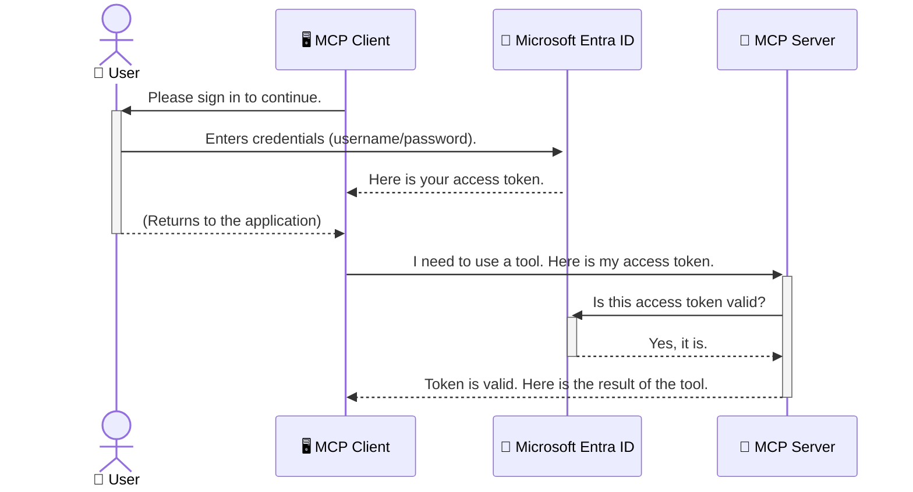

<!--
CO_OP_TRANSLATOR_METADATA:
{
  "original_hash": "9abe1d303ab126f9a8b87f03cebe5213",
  "translation_date": "2025-06-26T14:34:58+00:00",
  "source_file": "05-AdvancedTopics/mcp-security-entra/README.md",
  "language_code": "ur"
}
-->
# AI ورک فلو کی حفاظت: ماڈل کانٹیکسٹ پروٹوکول سرورز کے لیے Entra ID توثیق

## تعارف  
اپنے ماڈل کانٹیکسٹ پروٹوکول (MCP) سرور کی حفاظت اتنی ہی ضروری ہے جتنا اپنے گھر کے مرکزی دروازے کو تالہ لگانا۔ اگر آپ کا MCP سرور کھلا رہے تو آپ کے ٹولز اور ڈیٹا غیر مجاز رسائی کے خطرے میں آ جاتے ہیں، جس سے سیکیورٹی کی خلاف ورزیاں ہو سکتی ہیں۔ Microsoft Entra ID ایک مضبوط کلاؤڈ بیسڈ شناخت اور رسائی مینجمنٹ حل فراہم کرتا ہے، جو یقینی بناتا ہے کہ صرف مجاز صارفین اور ایپلیکیشنز ہی آپ کے MCP سرور کے ساتھ تعامل کر سکیں۔ اس سیکشن میں، آپ سیکھیں گے کہ Entra ID توثیق کے ذریعے اپنے AI ورک فلو کی حفاظت کیسے کی جائے۔

## سیکھنے کے مقاصد  
اس سیکشن کے آخر تک آپ قابل ہو جائیں گے:

- MCP سرورز کی حفاظت کی اہمیت کو سمجھنا۔
- Microsoft Entra ID اور OAuth 2.0 توثیق کی بنیادی باتوں کی وضاحت کرنا۔
- پبلک اور کنفیڈینشل کلائنٹس میں فرق کو پہچاننا۔
- Entra ID توثیق کو لوکل (پبلک کلائنٹ) اور ریموٹ (کنفیڈینشل کلائنٹ) MCP سرور کے حالات میں نافذ کرنا۔
- AI ورک فلو تیار کرتے وقت سیکیورٹی کے بہترین طریقے اپنانا۔

# AI ورک فلو کی حفاظت: ماڈل کانٹیکسٹ پروٹوکول سرورز کے لیے Entra ID توثیق

جیسے آپ اپنے گھر کے مرکزی دروازے کو کھلا نہیں چھوڑتے، ویسے ہی آپ کو اپنا MCP سرور کسی کے لیے کھلا نہیں چھوڑنا چاہیے۔ اپنے AI ورک فلو کی حفاظت مضبوط، قابل اعتماد اور محفوظ ایپلیکیشنز بنانے کے لیے ضروری ہے۔ یہ باب آپ کو Microsoft Entra ID کے ذریعے اپنے MCP سرورز کی حفاظت کرنے کا تعارف کرائے گا، تاکہ صرف مجاز صارفین اور ایپلیکیشنز ہی آپ کے ٹولز اور ڈیٹا تک رسائی حاصل کر سکیں۔

## MCP سرورز کے لیے سیکیورٹی کیوں اہم ہے  

تصور کریں کہ آپ کے MCP سرور میں ایک ایسا ٹول ہے جو ای میل بھیج سکتا ہے یا کسٹمر ڈیٹا بیس تک رسائی حاصل کر سکتا ہے۔ اگر سرور غیر محفوظ ہوگا تو کوئی بھی اس ٹول کا غلط استعمال کر سکتا ہے، جس سے غیر مجاز ڈیٹا تک رسائی، اسپیم یا دیگر نقصان دہ سرگرمیاں ہو سکتی ہیں۔

توثیق کو نافذ کر کے، آپ یہ یقینی بناتے ہیں کہ ہر درخواست کی تصدیق ہو، یعنی درخواست کرنے والے صارف یا ایپلیکیشن کی شناخت کی تصدیق کی جائے۔ یہ آپ کے AI ورک فلو کی حفاظت کے لیے پہلا اور سب سے اہم قدم ہے۔

## Microsoft Entra ID کا تعارف  

**Microsoft Entra ID** ایک کلاؤڈ بیسڈ شناخت اور رسائی مینجمنٹ سروس ہے۔ اسے آپ اپنی ایپلیکیشنز کے لیے ایک عالمی سیکیورٹی گارڈ سمجھیں۔ یہ صارفین کی شناخت کی تصدیق (توثیق) اور ان کے اختیارات (اجازت) کے پیچیدہ عمل کو سنبھالتا ہے۔

Entra ID استعمال کرنے سے آپ کر سکتے ہیں:

- صارفین کے لیے محفوظ سائن ان کو فعال کرنا۔
- APIs اور سروسز کی حفاظت کرنا۔
- مرکزی مقام سے رسائی کی پالیسیاں منظم کرنا۔

MCP سرورز کے لیے، Entra ID ایک مضبوط اور وسیع پیمانے پر قابل اعتماد حل فراہم کرتا ہے تاکہ یہ کنٹرول کیا جا سکے کہ کون آپ کے سرور کی صلاحیتوں تک رسائی حاصل کر سکتا ہے۔

---

## جادو کو سمجھنا: Entra ID توثیق کیسے کام کرتی ہے  

Entra ID توثیق کے لیے **OAuth 2.0** جیسے اوپن اسٹینڈرڈز استعمال کرتا ہے۔ تفصیلات پیچیدہ ہو سکتی ہیں، لیکن بنیادی تصور آسان ہے اور ایک تشبیہ سے سمجھا جا سکتا ہے۔

### OAuth 2.0 کا نرم تعارف: ویلیٹ کی

OAuth 2.0 کو اپنی گاڑی کے لیے ویلیٹ سروس سمجھیں۔ جب آپ کسی ریستوراں پہنچتے ہیں، تو آپ ویلیٹ کو اپنی ماسٹر کی نہیں دیتے۔ بلکہ آپ اسے ایک **ویلیٹ کی** دیتے ہیں جس کے محدود اختیارات ہوتے ہیں—یہ گاڑی اسٹارٹ کر سکتا ہے اور دروازے لاک کر سکتا ہے، لیکن ٹرنک یا گلوز کمپارٹمنٹ نہیں کھول سکتا۔

اس تشبیہ میں:

- **آپ** ہیں **صارف**۔
- **آپ کی گاڑی** ہے **MCP سرور** جس میں قیمتی ٹولز اور ڈیٹا ہیں۔
- **ویلیٹ** ہے **Microsoft Entra ID**۔
- **پارکنگ اٹینڈنٹ** ہے **MCP کلائنٹ** (جو سرور تک رسائی کی کوشش کر رہا ہے)۔
- **ویلیٹ کی** ہے **Access Token**۔

Access Token ایک محفوظ ٹیکسٹ سٹرنگ ہے جو MCP کلائنٹ کو Entra ID سے سائن ان کے بعد ملتی ہے۔ کلائنٹ ہر درخواست کے ساتھ یہ ٹوکن MCP سرور کو دیتا ہے۔ سرور ٹوکن کی تصدیق کر کے درخواست کی قانونی حیثیت اور کلائنٹ کے اجازت نامے چیک کرتا ہے، بغیر آپ کے اصل اسناد (جیسے پاس ورڈ) کو ہینڈل کیے۔

### توثیق کا عمل

عملی طور پر یہ طریقہ کار یوں ہوتا ہے:



### Microsoft Authentication Library (MSAL) کا تعارف  

کوڈ میں جانے سے پہلے، ایک اہم جزو کا تعارف ضروری ہے جو آپ مثالوں میں دیکھیں گے: **Microsoft Authentication Library (MSAL)**۔

MSAL مائیکروسافٹ کی طرف سے تیار کردہ ایک لائبریری ہے جو ڈیولپرز کے لیے توثیق کو آسان بناتی ہے۔ آپ کو سیکیورٹی ٹوکنز، سائن ان مینجمنٹ، اور سیشن ریفریش کے پیچیدہ کوڈ لکھنے کی ضرورت نہیں پڑتی، کیونکہ MSAL یہ سب کام خود انجام دیتا ہے۔

MSAL استعمال کرنے کی سفارش کی جاتی ہے کیونکہ:

- **یہ محفوظ ہے:** یہ صنعت کے معیاری پروٹوکولز اور سیکیورٹی بہترین طریقے اپناتا ہے، جس سے آپ کے کوڈ میں کمزوریاں کم ہو جاتی ہیں۔
- **یہ ترقی کو آسان بناتا ہے:** OAuth 2.0 اور OpenID Connect کے پیچیدہ پروٹوکولز کو آسان بنا دیتا ہے، تاکہ آپ چند لائنوں میں مضبوط توثیق شامل کر سکیں۔
- **یہ مسلسل اپڈیٹ ہوتا ہے:** مائیکروسافٹ MSAL کو نئے سیکیورٹی خطرات اور پلیٹ فارم کی تبدیلیوں کے مطابق اپڈیٹ کرتا رہتا ہے۔

MSAL کئی زبانوں اور ایپلیکیشن فریم ورکس کو سپورٹ کرتا ہے، جیسے .NET، JavaScript/TypeScript، Python، Java، Go، اور موبائل پلیٹ فارمز جیسے iOS اور Android۔ اس کا مطلب ہے کہ آپ اپنی پوری ٹیکنالوجی اسٹیک میں ایک جیسا توثیقی نمونہ استعمال کر سکتے ہیں۔

MSAL کے بارے میں مزید جاننے کے لیے، آپ آفیشل [MSAL overview documentation](https://learn.microsoft.com/entra/identity-platform/msal-overview) دیکھ سکتے ہیں۔

---

## Entra ID کے ساتھ اپنے MCP سرور کی حفاظت: مرحلہ وار رہنمائی  

اب چلیں دیکھتے ہیں کہ ایک لوکل MCP سرور کو کیسے محفوظ کیا جائے (جو `stdio`) using Entra ID. This example uses a **public client**, which is suitable for applications running on a user's machine, like a desktop app or a local development server.

### Scenario 1: Securing a Local MCP Server (with a Public Client)

In this scenario, we'll look at an MCP server that runs locally, communicates over `stdio`, and uses Entra ID to authenticate the user before allowing access to its tools. The server will have a single tool that fetches the user's profile information from the Microsoft Graph API.

#### 1. Setting Up the Application in Entra ID

Before writing any code, you need to register your application in Microsoft Entra ID. This tells Entra ID about your application and grants it permission to use the authentication service.

1. Navigate to the **[Microsoft Entra portal](https://entra.microsoft.com/)**.
2. Go to **App registrations** and click **New registration**.
3. Give your application a name (e.g., "My Local MCP Server").
4. For **Supported account types**, select **Accounts in this organizational directory only**.
5. You can leave the **Redirect URI** blank for this example.
6. Click **Register**.

Once registered, take note of the **Application (client) ID** and **Directory (tenant) ID**. You'll need these in your code.

#### 2. The Code: A Breakdown

Let's look at the key parts of the code that handle authentication. The full code for this example is available in the [Entra ID - Local - WAM](https://github.com/Azure-Samples/mcp-auth-servers/tree/main/src/entra-id-local-wam) folder of the [mcp-auth-servers GitHub repository](https://github.com/Azure-Samples/mcp-auth-servers).

**`AuthenticationService.cs`**

This class is responsible for handling the interaction with Entra ID.

- **`CreateAsync`**: This method initializes the `PublicClientApplication` from the MSAL (Microsoft Authentication Library). It's configured with your application's `clientId` and `tenantId`.
- **`WithBroker`**: This enables the use of a broker (like the Windows Web Account Manager), which provides a more secure and seamless single sign-on experience.
- **`AcquireTokenAsync` کے ذریعے بات چیت کرتا ہے): یہ مرکزی طریقہ ہے۔ یہ پہلے خاموشی سے ٹوکن حاصل کرنے کی کوشش کرتا ہے (یعنی اگر صارف کے پاس پہلے سے جائز سیشن ہو تو اسے دوبارہ سائن ان کرنے کی ضرورت نہیں پڑے گی)۔ اگر خاموشی سے ٹوکن حاصل نہ ہو سکا، تو صارف کو انٹرایکٹو طور پر سائن ان کرنے کے لیے کہا جاتا ہے۔

```csharp
// Simplified for clarity
public static async Task<AuthenticationService> CreateAsync(ILogger<AuthenticationService> logger)
{
    var msalClient = PublicClientApplicationBuilder
        .Create(_clientId) // Your Application (client) ID
        .WithAuthority(AadAuthorityAudience.AzureAdMyOrg)
        .WithTenantId(_tenantId) // Your Directory (tenant) ID
        .WithBroker(new BrokerOptions(BrokerOptions.OperatingSystems.Windows))
        .Build();

    // ... cache registration ...

    return new AuthenticationService(logger, msalClient);
}

public async Task<string> AcquireTokenAsync()
{
    try
    {
        // Try silent authentication first
        var accounts = await _msalClient.GetAccountsAsync();
        var account = accounts.FirstOrDefault();

        AuthenticationResult? result = null;

        if (account != null)
        {
            result = await _msalClient.AcquireTokenSilent(_scopes, account).ExecuteAsync();
        }
        else
        {
            // If no account, or silent fails, go interactive
            result = await _msalClient.AcquireTokenInteractive(_scopes).ExecuteAsync();
        }

        return result.AccessToken;
    }
    catch (Exception ex)
    {
        _logger.LogError(ex, "An error occurred while acquiring the token.");
        throw; // Optionally rethrow the exception for higher-level handling
    }
}
```

**`Program.cs`**

This is where the MCP server is set up and the authentication service is integrated.

- **`AddSingleton<AuthenticationService>`**: This registers the `AuthenticationService` with the dependency injection container, so it can be used by other parts of the application (like our tool).
- **`GetUserDetailsFromGraph` tool**: This tool requires an instance of `AuthenticationService`. Before it does anything, it calls `authService.AcquireTokenAsync()`** سے ایک جائز Access Token حاصل کیا جاتا ہے۔ اگر توثیق کامیاب ہو، تو یہ ٹوکن Microsoft Graph API کو کال کرنے اور صارف کی تفصیلات حاصل کرنے کے لیے استعمال ہوتا ہے۔

```csharp
// Simplified for clarity
[McpServerTool(Name = "GetUserDetailsFromGraph")]
public static async Task<string> GetUserDetailsFromGraph(
    AuthenticationService authService)
{
    try
    {
        // This will trigger the authentication flow
        var accessToken = await authService.AcquireTokenAsync();

        // Use the token to create a GraphServiceClient
        var graphClient = new GraphServiceClient(
            new BaseBearerTokenAuthenticationProvider(new TokenProvider(authService)));

        var user = await graphClient.Me.GetAsync();

        return System.Text.Json.JsonSerializer.Serialize(user);
    }
    catch (Exception ex)
    {
        return $"Error: {ex.Message}";
    }
}
```

#### 3. یہ سب کیسے مل کر کام کرتے ہیں  

1. جب MCP کلائنٹ `GetUserDetailsFromGraph` tool, the tool first calls `AcquireTokenAsync`.
2. `AcquireTokenAsync` triggers the MSAL library to check for a valid token.
3. If no token is found, MSAL, through the broker, will prompt the user to sign in with their Entra ID account.
4. Once the user signs in, Entra ID issues an access token.
5. The tool receives the token and uses it to make a secure call to the Microsoft Graph API.
6. The user's details are returned to the MCP client.

This process ensures that only authenticated users can use the tool, effectively securing your local MCP server.

### Scenario 2: Securing a Remote MCP Server (with a Confidential Client)

When your MCP server is running on a remote machine (like a cloud server) and communicates over a protocol like HTTP Streaming, the security requirements are different. In this case, you should use a **confidential client** and the **Authorization Code Flow**. This is a more secure method because the application's secrets are never exposed to the browser.

This example uses a TypeScript-based MCP server that uses Express.js to handle HTTP requests.

#### 1. Setting Up the Application in Entra ID

The setup in Entra ID is similar to the public client, but with one key difference: you need to create a **client secret**.

1. Navigate to the **[Microsoft Entra portal](https://entra.microsoft.com/)**.
2. In your app registration, go to the **Certificates & secrets** tab.
3. Click **New client secret**, give it a description, and click **Add**.
4. **Important:** Copy the secret value immediately. You will not be able to see it again.
5. You also need to configure a **Redirect URI**. Go to the **Authentication** tab, click **Add a platform**, select **Web**, and enter the redirect URI for your application (e.g., `http://localhost:3001/auth/callback`).

> **⚠️ Important Security Note:** For production applications, Microsoft strongly recommends using **secretless authentication** methods such as **Managed Identity** or **Workload Identity Federation** instead of client secrets. Client secrets pose security risks as they can be exposed or compromised. Managed identities provide a more secure approach by eliminating the need to store credentials in your code or configuration.
>
> For more information about managed identities and how to implement them, see the [Managed identities for Azure resources overview](https://learn.microsoft.com/entra/identity/managed-identities-azure-resources/overview).

#### 2. The Code: A Breakdown

This example uses a session-based approach. When the user authenticates, the server stores the access token and refresh token in a session and gives the user a session token. This session token is then used for subsequent requests. The full code for this example is available in the [Entra ID - Confidential client](https://github.com/Azure-Samples/mcp-auth-servers/tree/main/src/entra-id-cca-session) folder of the [mcp-auth-servers GitHub repository](https://github.com/Azure-Samples/mcp-auth-servers).

**`Server.ts`**

This file sets up the Express server and the MCP transport layer.

- **`requireBearerAuth`**: This is middleware that protects the `/sse` and `/message` endpoints. It checks for a valid bearer token in the `Authorization` header of the request.
- **`EntraIdServerAuthProvider`**: This is a custom class that implements the `McpServerAuthorizationProvider` interface. It's responsible for handling the OAuth 2.0 flow.
- **`/auth/callback` کو کال کرتا ہے: یہ اینڈپوائنٹ Entra ID سے صارف کی توثیق کے بعد ری ڈائریکٹ کو ہینڈل کرتا ہے۔ یہ اجازت کوڈ کو Access Token اور Refresh Token میں تبدیل کرتا ہے۔

```typescript
// Simplified for clarity
const app = express();
const { server } = createServer();
const provider = new EntraIdServerAuthProvider();

// Protect the SSE endpoint
app.get("/sse", requireBearerAuth({
  provider,
  requiredScopes: ["User.Read"]
}), async (req, res) => {
  // ... connect to the transport ...
});

// Protect the message endpoint
app.post("/message", requireBearerAuth({
  provider,
  requiredScopes: ["User.Read"]
}), async (req, res) => {
  // ... handle the message ...
});

// Handle the OAuth 2.0 callback
app.get("/auth/callback", (req, res) => {
  provider.handleCallback(req.query.code, req.query.state)
    .then(result => {
      // ... handle success or failure ...
    });
});
```

**`Tools.ts`**

This file defines the tools that the MCP server provides. The `getUserDetails`** ٹول پچھلی مثال کی طرح ہے، لیکن یہ سیشن سے Access Token حاصل کرتا ہے۔

```typescript
// Simplified for clarity
server.setRequestHandler(CallToolRequestSchema, async (request) => {
  const { name } = request.params;
  const context = request.params?.context as { token?: string } | undefined;
  const sessionToken = context?.token;

  if (name === ToolName.GET_USER_DETAILS) {
    if (!sessionToken) {
      throw new AuthenticationError("Authentication token is missing or invalid. Ensure the token is provided in the request context.");
    }

    // Get the Entra ID token from the session store
    const tokenData = tokenStore.getToken(sessionToken);
    const entraIdToken = tokenData.accessToken;

    const graphClient = Client.init({
      authProvider: (done) => {
        done(null, entraIdToken);
      }
    });

    const user = await graphClient.api('/me').get();

    // ... return user details ...
  }
});
```

**`auth/EntraIdServerAuthProvider.ts`**

This class handles the logic for:

- Redirecting the user to the Entra ID sign-in page.
- Exchanging the authorization code for an access token.
- Storing the tokens in the `tokenStore`.
- Refreshing the access token when it expires.

#### 3. How It All Works Together

1. When a user first tries to connect to the MCP server, the `requireBearerAuth` middleware will see that they don't have a valid session and will redirect them to the Entra ID sign-in page.
2. The user signs in with their Entra ID account.
3. Entra ID redirects the user back to the `/auth/callback` endpoint with an authorization code.
4. The server exchanges the code for an access token and a refresh token, stores them, and creates a session token which is sent to the client.
5. The client can now use this session token in the `Authorization` header for all future requests to the MCP server.
6. When the `getUserDetails`** ٹول کو کال کیا جاتا ہے، یہ سیشن ٹوکن کا استعمال کرتے ہوئے Entra ID Access Token تلاش کرتا ہے اور پھر اسے Microsoft Graph API کال کرنے کے لیے استعمال کرتا ہے۔

یہ فلو پبلک کلائنٹ فلو سے زیادہ پیچیدہ ہے، لیکن انٹرنیٹ پر دستیاب اینڈپوائنٹس کے لیے ضروری ہے۔ چونکہ ریموٹ MCP سرورز عوامی انٹرنیٹ پر دستیاب ہوتے ہیں، انہیں غیر مجاز رسائی اور ممکنہ حملوں سے بچانے کے لیے مضبوط سیکیورٹی تدابیر کی ضرورت ہوتی ہے۔

## سیکیورٹی کے بہترین طریقے  

- **ہمیشہ HTTPS استعمال کریں**: کلائنٹ اور سرور کے درمیان رابطے کو انکرپٹ کریں تاکہ ٹوکنز چوری ہونے سے بچ سکیں۔  
- **رول بیسڈ ایکسس کنٹرول (RBAC) نافذ کریں**: صرف یہ نہ چیک کریں کہ صارف توثیق شدہ ہے، بلکہ یہ بھی چیک کریں کہ اسے کیا کرنے کی اجازت ہے۔ آپ Entra ID میں رولز ڈیفائن کر سکتے ہیں اور انہیں MCP سرور میں چیک کر سکتے ہیں۔  
- **مانیٹر اور آڈٹ کریں**: تمام توثیقی واقعات کو لاگ کریں تاکہ مشکوک سرگرمی کا پتہ لگایا جا سکے اور اس کا جواب دیا جا سکے۔  
- **ریٹ لمیٹنگ اور تھروٹلنگ کو ہینڈل کریں**: Microsoft Graph اور دیگر APIs ریٹ لمیٹنگ کرتے ہیں تاکہ غلط استعمال روکا جا سکے۔ MCP سرور میں exponential backoff اور ریٹری لاجک نافذ کریں تاکہ HTTP 429 (Too Many Requests) کے جوابات کو مؤثر طریقے سے ہینڈل کیا جا سکے۔ اکثر استعمال ہونے والے ڈیٹا کو کیش کرنے پر غور کریں تاکہ API کالز کم ہوں۔  
- **ٹوکن اسٹوریج کو محفوظ بنائیں**: Access اور Refresh Tokens کو محفوظ طریقے سے ذخیرہ کریں۔ لوکل ایپلیکیشنز کے لیے سسٹم کے محفوظ اسٹوریج میکانزم استعمال کریں۔ سرور ایپلیکیشنز کے لیے encrypted storage یا Azure Key Vault جیسے محفوظ کی مینجمنٹ سروسز پر غور کریں۔  
- **ٹوکن کی میعاد ختم ہونے کا انتظام کریں**: Access Tokens کی محدود مدت ہوتی ہے۔ ریفریش ٹوکنز کے ذریعے خودکار ٹوکن ریفریش نافذ کریں تاکہ صارف کو دوبارہ توثیق کے بغیر تسلسل سے سروس ملتی رہے۔  
- **Azure API Management استعمال کرنے پر غور کریں**: اگرچہ MCP سرور میں براہ راست سیکیورٹی نافذ کرنا تفصیلی کنٹرول دیتا ہے، API گیٹ وے جیسے Azure API Management خود بخود کئی سیکیورٹی مسائل جیسے توثیق، اجازت، ریٹ لمیٹنگ، اور مانیٹرنگ سنبھال سکتے ہیں۔ یہ ایک مرکزی سیکیورٹی پرت فراہم کرتے ہیں جو آپ کے کلائنٹس اور MCP سرورز کے درمیان ہوتی ہے۔ MCP کے ساتھ API گیٹ وے استعمال کرنے کی مزید تفصیلات کے لیے ہمارا [Azure API Management Your Auth Gateway For MCP Servers](https://techcommunity.microsoft.com/blog/integrationsonazureblog/azure-api-management-your-auth-gateway-for-mcp-servers/4402690) دیکھیں۔

## اہم نکات  

- اپنے MCP سرور کی حفاظت آپ کے ڈیٹا اور ٹولز کے تحفظ کے لیے انتہائی ضروری ہے۔  
- Microsoft Entra ID توثیق اور اجازت کے لیے ایک مضبوط اور قابل توسیع حل فراہم کرتا ہے۔  
- لوکل ایپلیکیشنز کے لیے **پبلک کلائنٹ** اور ریموٹ سرورز کے لیے **کنفیڈینشل کلائنٹ** استعمال کریں۔  
- ویب ایپلیکیشنز کے لیے **Authorization Code Flow** سب سے محفوظ آپشن ہے۔

## مشق  

1. ایک MCP سرور کے بارے میں سوچیں جو آپ بنا سکتے ہیں۔ کیا یہ لوکل سرور ہوگا یا ریموٹ سرور؟  
2. اپنے جواب کی بنیاد پر، کیا آپ پبلک کلائنٹ استعمال کریں گے یا کنفیڈینشل کلائنٹ؟  
3. Microsoft Graph کے خلاف کارروائیوں کے لیے آپ کے MCP سرور کو کون سی اجازت درکار ہوگی؟

## عملی مشقیں  

### مشق 1: Entra ID میں ایک ایپلیکیشن رجسٹر کریں  
Microsoft Entra پورٹل پر جائیں۔  
اپنے MCP سرور کے لیے ایک نئی ایپلیکیشن رجسٹر کریں۔  
Application (client) ID اور Directory (tenant) ID نوٹ کریں۔

### مشق 2: لوکل MCP سرور کی حفاظت کریں (پبلک کلائنٹ)  
MSAL (Microsoft Authentication Library) کو صارف کی توثیق کے لیے انٹیگریٹ کرنے کے لیے کوڈ کی مثال پر عمل کریں۔  
توثیق کے عمل کو آزمانے کے لیے Microsoft Graph سے صارف کی تفصیلات حاصل کرنے والے MCP ٹول کو کال کریں۔

### مشق 3: ریموٹ MCP سرور کی حفاظت کریں (کنفیڈینشل کلائنٹ)  
Entra ID میں ایک کنفیڈینشل کلائنٹ رجسٹر کریں اور کلائنٹ سیکریٹ بنائیں۔  
اپنے Express.js MCP سرور کو Authorization Code Flow استعمال کرنے کے لیے کنفیگر کریں۔  
محفوظ اینڈپوائنٹس کو ٹیسٹ کریں اور ٹوکن کی بنیاد پر رسائی کی تصدیق کریں۔

### مشق 4: سیکیورٹی کے بہترین طریقے اپنائیں  
اپنے لوکل یا ریموٹ سرور کے لیے HTTPS فعال کریں۔  
اپنے سرور لاجک میں رول بیسڈ ایکسس کنٹرول (RBAC) نافذ کریں۔  
ٹوکن کی میعاد ختم ہونے کا انتظام اور محفوظ اسٹوریج شامل کریں۔

## وسائل  

1. **MSAL Overview Documentation**  
   جانیں کہ Microsoft Authentication Library (MSAL) کس طرح مختلف پلیٹ فارمز پر محفوظ ٹوکن حاصل کرنے میں مدد دیتی ہے:  
   [MSAL Overview on Microsoft Learn](https://learn.microsoft.com/en-gb/entra/msal/overview)

2. **Azure-Samples/mcp-auth-servers GitHub Repository**  
   MCP سرورز کی توثیق کے عمل کی ریفرنس امپلیمنٹیشنز:  
   [Azure-Samples/mcp-auth-servers on GitHub](https://github.com/Azure-Samples/mcp-auth-servers)

3. **Managed Identities for Azure Resources Overview**  
   سسٹم یا یوزر اسائنڈ مینیجڈ آئیڈینٹیز کے ذریعے سیکریٹس کو ختم کرنے کا طریقہ سمجھیں:  
   [Managed Identities Overview on Microsoft Learn](https://learn.microsoft.com/en-us/entra/identity/managed-identities-azure-resources/)

4. **Azure API Management: Your Auth Gateway for MCP Servers**  
   MCP سرورز کے لیے APIM کو ایک محفوظ OAuth2 گیٹ وے کے طور پر استعمال کرنے کی تفصیل:  
   [Azure API Management Your Auth Gateway For MCP Servers](https://techcommunity.microsoft.com/blog/integrationsonazureblog/azure-api-management-your-auth-gateway-for-mcp-servers/4402690)

5. **Microsoft Graph Permissions Reference**  
   Microsoft Graph کے لیے تفویض شدہ اور ایپلیکیشن اجازتوں کی مکمل فہرست:  
   [Microsoft Graph Permissions Reference](https://learn.microsoft.com/zh-tw/graph/permissions-reference)

## سیکھنے کے نتائج  
اس سیکشن کو مکمل کرنے کے بعد، آپ قادر ہوں گے:

- وضاحت کریں کہ MCP سرورز اور AI ورک فلو کے لیے توثیق کیوں ضروری ہے۔  
- Entra ID توثیق کو لوکل اور ریموٹ MCP سرور کے حالات میں سیٹ اپ اور کنفیگر کریں۔  
- اپنے سرور کی تعیناتی کی بنیاد پر مناسب کلائنٹ قسم (پبلک یا کنفیڈینشل) منتخب کریں۔  
- محفوظ کوڈنگ کے طریقے نافذ کریں، جن میں ٹوکن اسٹوریج اور رول بیسڈ اجازت شامل ہیں۔  
- اپنے MCP سرور اور اس کے ٹولز کو غیر مجاز رسائی سے مؤثر طریقے سے محفوظ کریں۔

## آگے کیا ہے  

- [6. کمیونٹی کی شراکتیں](../../06-CommunityContributions/README.md)

**ڈس کلیمر**:  
یہ دستاویز AI ترجمہ سروس [Co-op Translator](https://github.com/Azure/co-op-translator) کے ذریعے ترجمہ کی گئی ہے۔ اگرچہ ہم درستگی کی کوشش کرتے ہیں، براہ کرم اس بات سے آگاہ رہیں کہ خودکار ترجمے میں غلطیاں یا نقائص ہو سکتے ہیں۔ اصل دستاویز اپنی مادری زبان میں معتبر ماخذ سمجھی جانی چاہیے۔ اہم معلومات کے لیے پیشہ ورانہ انسانی ترجمہ کی سفارش کی جاتی ہے۔ اس ترجمے کے استعمال سے پیدا ہونے والی کسی بھی غلط فہمی یا غلط تشریح کی ذمہ داری ہم پر نہیں ہوگی۔