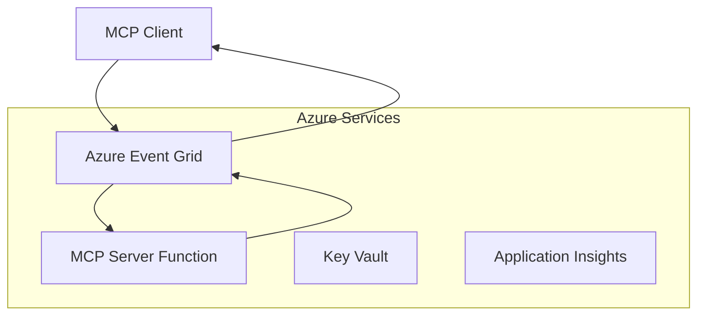
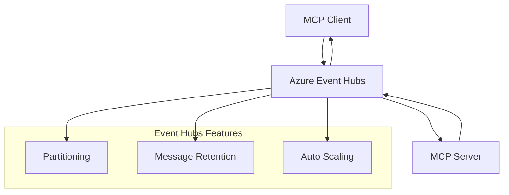

<!--
CO_OP_TRANSLATOR_METADATA:
{
  "original_hash": "c71c60af76120a517809a6cfba47e9a3",
  "translation_date": "2025-09-15T21:28:40+00:00",
  "source_file": "05-AdvancedTopics/mcp-transport/README.md",
  "language_code": "ur"
}
-->
# ایم سی پی کسٹم ٹرانسپورٹس - جدید عملدرآمد گائیڈ

ماڈل کانٹیکسٹ پروٹوکول (MCP) ٹرانسپورٹ میکانزم میں لچک فراہم کرتا ہے، جو خاص انٹرپرائز ماحول کے لیے کسٹم عملدرآمد کی اجازت دیتا ہے۔ یہ جدید گائیڈ Azure Event Grid اور Azure Event Hubs کے استعمال سے کسٹم ٹرانسپورٹ عملدرآمد کو دریافت کرتا ہے تاکہ قابل توسیع، کلاؤڈ نیٹو ایم سی پی حل بنائے جا سکیں۔

## تعارف

اگرچہ ایم سی پی کے معیاری ٹرانسپورٹس (stdio اور HTTP streaming) زیادہ تر استعمال کے معاملات کے لیے کافی ہیں، انٹرپرائز ماحول اکثر بہتر توسیع پذیری، قابل اعتمادیت، اور موجودہ کلاؤڈ انفراسٹرکچر کے ساتھ انضمام کے لیے خاص ٹرانسپورٹ میکانزم کی ضرورت رکھتے ہیں۔ کسٹم ٹرانسپورٹس ایم سی پی کو کلاؤڈ نیٹو میسجنگ سروسز کے فوائد حاصل کرنے کی اجازت دیتے ہیں، جیسے غیر متزامن مواصلات، ایونٹ ڈرائیون آرکیٹیکچرز، اور تقسیم شدہ پروسیسنگ۔

یہ سبق جدید ٹرانسپورٹ عملدرآمد کو دریافت کرتا ہے، جو تازہ ترین ایم سی پی وضاحت (2025-06-18)، Azure میسجنگ سروسز، اور قائم شدہ انٹرپرائز انضمام کے نمونوں پر مبنی ہے۔

### **ایم سی پی ٹرانسپورٹ آرکیٹیکچر**

**ایم سی پی وضاحت (2025-06-18) سے:**

- **معیاری ٹرانسپورٹس**: stdio (تجویز کردہ)، HTTP streaming (ریموٹ منظرناموں کے لیے)
- **کسٹم ٹرانسپورٹس**: کوئی بھی ٹرانسپورٹ جو ایم سی پی میسج ایکسچینج پروٹوکول کو نافذ کرے
- **میسج فارمیٹ**: JSON-RPC 2.0 ایم سی پی مخصوص توسیعات کے ساتھ
- **دو طرفہ مواصلات**: نوٹیفکیشنز اور جوابات کے لیے مکمل ڈوپلیکس مواصلات ضروری ہیں

## سیکھنے کے مقاصد

اس جدید سبق کے اختتام تک، آپ قابل ہوں گے:

- **کسٹم ٹرانسپورٹ کی ضروریات کو سمجھیں**: کسی بھی ٹرانسپورٹ لیئر پر ایم سی پی پروٹوکول کو نافذ کریں جبکہ تعمیل برقرار رکھیں
- **Azure Event Grid ٹرانسپورٹ بنائیں**: Azure Event Grid کا استعمال کرتے ہوئے ایونٹ ڈرائیون ایم سی پی سرورز بنائیں جو سرور لیس توسیع پذیری فراہم کریں
- **Azure Event Hubs ٹرانسپورٹ نافذ کریں**: Azure Event Hubs کا استعمال کرتے ہوئے کم تاخیر اور حقیقی وقت کی اسٹریمنگ کے لیے اعلیٰ throughput ایم سی پی حل ڈیزائن کریں
- **انٹرپرائز نمونوں کا اطلاق کریں**: کسٹم ٹرانسپورٹس کو موجودہ Azure انفراسٹرکچر اور سیکیورٹی ماڈلز کے ساتھ ضم کریں
- **ٹرانسپورٹ کی قابل اعتمادیت کو سنبھالیں**: انٹرپرائز منظرناموں کے لیے میسج کی پائیداری، ترتیب، اور غلطی سے نمٹنے کو نافذ کریں
- **کارکردگی کو بہتر بنائیں**: توسیع، تاخیر، اور throughput کی ضروریات کے لیے ٹرانسپورٹ حل ڈیزائن کریں

## **ٹرانسپورٹ کی ضروریات**

### **ایم سی پی وضاحت (2025-06-18) سے بنیادی ضروریات:**

```yaml
Message Protocol:
  format: "JSON-RPC 2.0 with MCP extensions"
  bidirectional: "Full duplex communication required"
  ordering: "Message ordering must be preserved per session"
  
Transport Layer:
  reliability: "Transport MUST handle connection failures gracefully"
  security: "Transport MUST support secure communication"
  identification: "Each session MUST have unique identifier"
  
Custom Transport:
  compliance: "MUST implement complete MCP message exchange"
  extensibility: "MAY add transport-specific features"
  interoperability: "MUST maintain protocol compatibility"
```

## **Azure Event Grid ٹرانسپورٹ عملدرآمد**

Azure Event Grid ایک سرور لیس ایونٹ روٹنگ سروس فراہم کرتا ہے جو ایونٹ ڈرائیون ایم سی پی آرکیٹیکچرز کے لیے مثالی ہے۔ یہ عملدرآمد قابل توسیع، ڈھیلے جڑے ہوئے ایم سی پی سسٹمز بنانے کا مظاہرہ کرتا ہے۔

### **آرکیٹیکچر کا جائزہ**



### **C# عملدرآمد - ایونٹ گرڈ ٹرانسپورٹ**

```csharp
using Azure.Messaging.EventGrid;
using Microsoft.Extensions.Azure;
using System.Text.Json;

public class EventGridMcpTransport : IMcpTransport
{
    private readonly EventGridPublisherClient _publisher;
    private readonly string _topicEndpoint;
    private readonly string _clientId;
    
    public EventGridMcpTransport(string topicEndpoint, string accessKey, string clientId)
    {
        _publisher = new EventGridPublisherClient(
            new Uri(topicEndpoint), 
            new AzureKeyCredential(accessKey));
        _topicEndpoint = topicEndpoint;
        _clientId = clientId;
    }
    
    public async Task SendMessageAsync(McpMessage message)
    {
        var eventGridEvent = new EventGridEvent(
            subject: $"mcp/{_clientId}",
            eventType: "MCP.MessageReceived",
            dataVersion: "1.0",
            data: JsonSerializer.Serialize(message))
        {
            Id = Guid.NewGuid().ToString(),
            EventTime = DateTimeOffset.UtcNow
        };
        
        await _publisher.SendEventAsync(eventGridEvent);
    }
    
    public async Task<McpMessage> ReceiveMessageAsync(CancellationToken cancellationToken)
    {
        // Event Grid is push-based, so implement webhook receiver
        // This would typically be handled by Azure Functions trigger
        throw new NotImplementedException("Use EventGridTrigger in Azure Functions");
    }
}

// Azure Function for receiving Event Grid events
[FunctionName("McpEventGridReceiver")]
public async Task<IActionResult> HandleEventGridMessage(
    [EventGridTrigger] EventGridEvent eventGridEvent,
    ILogger log)
{
    try
    {
        var mcpMessage = JsonSerializer.Deserialize<McpMessage>(
            eventGridEvent.Data.ToString());
        
        // Process MCP message
        var response = await _mcpServer.ProcessMessageAsync(mcpMessage);
        
        // Send response back via Event Grid
        await _transport.SendMessageAsync(response);
        
        return new OkResult();
    }
    catch (Exception ex)
    {
        log.LogError(ex, "Error processing Event Grid MCP message");
        return new BadRequestResult();
    }
}
```

### **TypeScript عملدرآمد - ایونٹ گرڈ ٹرانسپورٹ**

```typescript
import { EventGridPublisherClient, AzureKeyCredential } from "@azure/eventgrid";
import { McpTransport, McpMessage } from "./mcp-types";

export class EventGridMcpTransport implements McpTransport {
    private publisher: EventGridPublisherClient;
    private clientId: string;
    
    constructor(
        private topicEndpoint: string,
        private accessKey: string,
        clientId: string
    ) {
        this.publisher = new EventGridPublisherClient(
            topicEndpoint,
            new AzureKeyCredential(accessKey)
        );
        this.clientId = clientId;
    }
    
    async sendMessage(message: McpMessage): Promise<void> {
        const event = {
            id: crypto.randomUUID(),
            source: `mcp-client-${this.clientId}`,
            type: "MCP.MessageReceived",
            time: new Date(),
            data: message
        };
        
        await this.publisher.sendEvents([event]);
    }
    
    // Event-driven receive via Azure Functions
    onMessage(handler: (message: McpMessage) => Promise<void>): void {
        // Implementation would use Azure Functions Event Grid trigger
        // This is a conceptual interface for the webhook receiver
    }
}

// Azure Functions implementation
import { app, InvocationContext, EventGridEvent } from "@azure/functions";

app.eventGrid("mcpEventGridHandler", {
    handler: async (event: EventGridEvent, context: InvocationContext) => {
        try {
            const mcpMessage = event.data as McpMessage;
            
            // Process MCP message
            const response = await mcpServer.processMessage(mcpMessage);
            
            // Send response via Event Grid
            await transport.sendMessage(response);
            
        } catch (error) {
            context.error("Error processing MCP message:", error);
            throw error;
        }
    }
});
```

### **Python عملدرآمد - ایونٹ گرڈ ٹرانسپورٹ**

```python
from azure.eventgrid import EventGridPublisherClient, EventGridEvent
from azure.core.credentials import AzureKeyCredential
import asyncio
import json
from typing import Callable, Optional
import uuid
from datetime import datetime

class EventGridMcpTransport:
    def __init__(self, topic_endpoint: str, access_key: str, client_id: str):
        self.client = EventGridPublisherClient(
            topic_endpoint, 
            AzureKeyCredential(access_key)
        )
        self.client_id = client_id
        self.message_handler: Optional[Callable] = None
    
    async def send_message(self, message: dict) -> None:
        """Send MCP message via Event Grid"""
        event = EventGridEvent(
            data=message,
            subject=f"mcp/{self.client_id}",
            event_type="MCP.MessageReceived",
            data_version="1.0"
        )
        
        await self.client.send(event)
    
    def on_message(self, handler: Callable[[dict], None]) -> None:
        """Register message handler for incoming events"""
        self.message_handler = handler

# Azure Functions implementation
import azure.functions as func
import logging

def main(event: func.EventGridEvent) -> None:
    """Azure Functions Event Grid trigger for MCP messages"""
    try:
        # Parse MCP message from Event Grid event
        mcp_message = json.loads(event.get_body().decode('utf-8'))
        
        # Process MCP message
        response = process_mcp_message(mcp_message)
        
        # Send response back via Event Grid
        # (Implementation would create new Event Grid client)
        
    except Exception as e:
        logging.error(f"Error processing MCP Event Grid message: {e}")
        raise
```

## **Azure Event Hubs ٹرانسپورٹ عملدرآمد**

Azure Event Hubs کم تاخیر اور اعلیٰ میسج والیوم کے لیے حقیقی وقت کی اسٹریمنگ کی صلاحیتیں فراہم کرتا ہے، جو ایم سی پی منظرناموں کے لیے موزوں ہیں۔

### **آرکیٹیکچر کا جائزہ**



### **C# عملدرآمد - ایونٹ ہبز ٹرانسپورٹ**

```csharp
using Azure.Messaging.EventHubs;
using Azure.Messaging.EventHubs.Producer;
using Azure.Messaging.EventHubs.Consumer;
using System.Text;

public class EventHubsMcpTransport : IMcpTransport, IDisposable
{
    private readonly EventHubProducerClient _producer;
    private readonly EventHubConsumerClient _consumer;
    private readonly string _consumerGroup;
    private readonly CancellationTokenSource _cancellationTokenSource;
    
    public EventHubsMcpTransport(
        string connectionString, 
        string eventHubName,
        string consumerGroup = "$Default")
    {
        _producer = new EventHubProducerClient(connectionString, eventHubName);
        _consumer = new EventHubConsumerClient(
            consumerGroup, 
            connectionString, 
            eventHubName);
        _consumerGroup = consumerGroup;
        _cancellationTokenSource = new CancellationTokenSource();
    }
    
    public async Task SendMessageAsync(McpMessage message)
    {
        var messageBody = JsonSerializer.Serialize(message);
        var eventData = new EventData(Encoding.UTF8.GetBytes(messageBody));
        
        // Add MCP-specific properties
        eventData.Properties.Add("MessageType", message.Method ?? "response");
        eventData.Properties.Add("MessageId", message.Id);
        eventData.Properties.Add("Timestamp", DateTimeOffset.UtcNow);
        
        await _producer.SendAsync(new[] { eventData });
    }
    
    public async Task StartReceivingAsync(
        Func<McpMessage, Task> messageHandler)
    {
        await foreach (PartitionEvent partitionEvent in _consumer.ReadEventsAsync(
            _cancellationTokenSource.Token))
        {
            try
            {
                var messageBody = Encoding.UTF8.GetString(
                    partitionEvent.Data.EventBody.ToArray());
                var mcpMessage = JsonSerializer.Deserialize<McpMessage>(messageBody);
                
                await messageHandler(mcpMessage);
            }
            catch (Exception ex)
            {
                // Handle deserialization or processing errors
                Console.WriteLine($"Error processing message: {ex.Message}");
            }
        }
    }
    
    public void Dispose()
    {
        _cancellationTokenSource?.Cancel();
        _producer?.DisposeAsync().AsTask().Wait();
        _consumer?.DisposeAsync().AsTask().Wait();
        _cancellationTokenSource?.Dispose();
    }
}
```

### **TypeScript عملدرآمد - ایونٹ ہبز ٹرانسپورٹ**

```typescript
import { 
    EventHubProducerClient, 
    EventHubConsumerClient, 
    EventData 
} from "@azure/event-hubs";

export class EventHubsMcpTransport implements McpTransport {
    private producer: EventHubProducerClient;
    private consumer: EventHubConsumerClient;
    private isReceiving = false;
    
    constructor(
        private connectionString: string,
        private eventHubName: string,
        private consumerGroup: string = "$Default"
    ) {
        this.producer = new EventHubProducerClient(
            connectionString, 
            eventHubName
        );
        this.consumer = new EventHubConsumerClient(
            consumerGroup,
            connectionString,
            eventHubName
        );
    }
    
    async sendMessage(message: McpMessage): Promise<void> {
        const eventData: EventData = {
            body: JSON.stringify(message),
            properties: {
                messageType: message.method || "response",
                messageId: message.id,
                timestamp: new Date().toISOString()
            }
        };
        
        await this.producer.sendBatch([eventData]);
    }
    
    async startReceiving(
        messageHandler: (message: McpMessage) => Promise<void>
    ): Promise<void> {
        if (this.isReceiving) return;
        
        this.isReceiving = true;
        
        const subscription = this.consumer.subscribe({
            processEvents: async (events, context) => {
                for (const event of events) {
                    try {
                        const messageBody = event.body as string;
                        const mcpMessage: McpMessage = JSON.parse(messageBody);
                        
                        await messageHandler(mcpMessage);
                        
                        // Update checkpoint for at-least-once delivery
                        await context.updateCheckpoint(event);
                    } catch (error) {
                        console.error("Error processing Event Hubs message:", error);
                    }
                }
            },
            processError: async (err, context) => {
                console.error("Event Hubs error:", err);
            }
        });
    }
    
    async close(): Promise<void> {
        this.isReceiving = false;
        await this.producer.close();
        await this.consumer.close();
    }
}
```

### **Python عملدرآمد - ایونٹ ہبز ٹرانسپورٹ**

```python
from azure.eventhub import EventHubProducerClient, EventHubConsumerClient
from azure.eventhub import EventData
import json
import asyncio
from typing import Callable, Dict, Any
import logging

class EventHubsMcpTransport:
    def __init__(
        self, 
        connection_string: str, 
        eventhub_name: str,
        consumer_group: str = "$Default"
    ):
        self.producer = EventHubProducerClient.from_connection_string(
            connection_string, 
            eventhub_name=eventhub_name
        )
        self.consumer = EventHubConsumerClient.from_connection_string(
            connection_string,
            consumer_group=consumer_group,
            eventhub_name=eventhub_name
        )
        self.is_receiving = False
    
    async def send_message(self, message: Dict[str, Any]) -> None:
        """Send MCP message via Event Hubs"""
        event_data = EventData(json.dumps(message))
        
        # Add MCP-specific properties
        event_data.properties = {
            "messageType": message.get("method", "response"),
            "messageId": message.get("id"),
            "timestamp": "2025-01-14T10:30:00Z"  # Use actual timestamp
        }
        
        async with self.producer:
            event_data_batch = await self.producer.create_batch()
            event_data_batch.add(event_data)
            await self.producer.send_batch(event_data_batch)
    
    async def start_receiving(
        self, 
        message_handler: Callable[[Dict[str, Any]], None]
    ) -> None:
        """Start receiving MCP messages from Event Hubs"""
        if self.is_receiving:
            return
        
        self.is_receiving = True
        
        async with self.consumer:
            await self.consumer.receive(
                on_event=self._on_event_received(message_handler),
                starting_position="-1"  # Start from beginning
            )
    
    def _on_event_received(self, handler: Callable):
        """Internal event handler wrapper"""
        async def handle_event(partition_context, event):
            try:
                # Parse MCP message from Event Hubs event
                message_body = event.body_as_str(encoding='UTF-8')
                mcp_message = json.loads(message_body)
                
                # Process MCP message
                await handler(mcp_message)
                
                # Update checkpoint for at-least-once delivery
                await partition_context.update_checkpoint(event)
                
            except Exception as e:
                logging.error(f"Error processing Event Hubs message: {e}")
        
        return handle_event
    
    async def close(self) -> None:
        """Clean up transport resources"""
        self.is_receiving = False
        await self.producer.close()
        await self.consumer.close()
```

## **جدید ٹرانسپورٹ نمونے**

### **میسج کی پائیداری اور قابل اعتمادیت**

```csharp
// Implementing message durability with retry logic
public class ReliableTransportWrapper : IMcpTransport
{
    private readonly IMcpTransport _innerTransport;
    private readonly RetryPolicy _retryPolicy;
    
    public async Task SendMessageAsync(McpMessage message)
    {
        await _retryPolicy.ExecuteAsync(async () =>
        {
            try
            {
                await _innerTransport.SendMessageAsync(message);
            }
            catch (TransportException ex) when (ex.IsRetryable)
            {
                // Log and retry
                throw;
            }
        });
    }
}
```

### **ٹرانسپورٹ سیکیورٹی انضمام**

```csharp
// Integrating Azure Key Vault for transport security
public class SecureTransportFactory
{
    private readonly SecretClient _keyVaultClient;
    
    public async Task<IMcpTransport> CreateEventGridTransportAsync()
    {
        var accessKey = await _keyVaultClient.GetSecretAsync("EventGridAccessKey");
        var topicEndpoint = await _keyVaultClient.GetSecretAsync("EventGridTopic");
        
        return new EventGridMcpTransport(
            topicEndpoint.Value.Value,
            accessKey.Value.Value,
            Environment.MachineName
        );
    }
}
```

### **ٹرانسپورٹ مانیٹرنگ اور مشاہدہ**

```csharp
// Adding telemetry to custom transports
public class ObservableTransport : IMcpTransport
{
    private readonly IMcpTransport _transport;
    private readonly ILogger _logger;
    private readonly TelemetryClient _telemetryClient;
    
    public async Task SendMessageAsync(McpMessage message)
    {
        using var activity = Activity.StartActivity("MCP.Transport.Send");
        activity?.SetTag("transport.type", "EventGrid");
        activity?.SetTag("message.method", message.Method);
        
        var stopwatch = Stopwatch.StartNew();
        
        try
        {
            await _transport.SendMessageAsync(message);
            
            _telemetryClient.TrackDependency(
                "EventGrid",
                "SendMessage",
                DateTime.UtcNow.Subtract(stopwatch.Elapsed),
                stopwatch.Elapsed,
                true
            );
        }
        catch (Exception ex)
        {
            _telemetryClient.TrackException(ex);
            throw;
        }
    }
}
```

## **انٹرپرائز انضمام کے منظرنامے**

### **منظرنامہ 1: تقسیم شدہ ایم سی پی پروسیسنگ**

Azure Event Grid کا استعمال کرتے ہوئے ایم سی پی درخواستوں کو متعدد پروسیسنگ نوڈز میں تقسیم کرنا:

```yaml
Architecture:
  - MCP Client sends requests to Event Grid topic
  - Multiple Azure Functions subscribe to process different tool types
  - Results aggregated and returned via separate response topic
  
Benefits:
  - Horizontal scaling based on message volume
  - Fault tolerance through redundant processors
  - Cost optimization with serverless compute
```

### **منظرنامہ 2: حقیقی وقت کی ایم سی پی اسٹریمنگ**

Azure Event Hubs کا استعمال کرتے ہوئے اعلیٰ تعدد ایم سی پی تعاملات:

```yaml
Architecture:
  - MCP Client streams continuous requests via Event Hubs
  - Stream Analytics processes and routes messages
  - Multiple consumers handle different aspect of processing
  
Benefits:
  - Low latency for real-time scenarios
  - High throughput for batch processing
  - Built-in partitioning for parallel processing
```

### **منظرنامہ 3: ہائبرڈ ٹرانسپورٹ آرکیٹیکچر**

مختلف استعمال کے معاملات کے لیے متعدد ٹرانسپورٹس کو یکجا کرنا:

```csharp
public class HybridMcpTransport : IMcpTransport
{
    private readonly IMcpTransport _realtimeTransport; // Event Hubs
    private readonly IMcpTransport _batchTransport;    // Event Grid
    private readonly IMcpTransport _fallbackTransport; // HTTP Streaming
    
    public async Task SendMessageAsync(McpMessage message)
    {
        // Route based on message characteristics
        var transport = message.Method switch
        {
            "tools/call" when IsRealtime(message) => _realtimeTransport,
            "resources/read" when IsBatch(message) => _batchTransport,
            _ => _fallbackTransport
        };
        
        await transport.SendMessageAsync(message);
    }
}
```

## **کارکردگی کی اصلاح**

### **ایونٹ گرڈ کے لیے میسج بیچنگ**

```csharp
public class BatchingEventGridTransport : IMcpTransport
{
    private readonly List<McpMessage> _messageBuffer = new();
    private readonly Timer _flushTimer;
    private const int MaxBatchSize = 100;
    
    public async Task SendMessageAsync(McpMessage message)
    {
        lock (_messageBuffer)
        {
            _messageBuffer.Add(message);
            
            if (_messageBuffer.Count >= MaxBatchSize)
            {
                _ = Task.Run(FlushMessages);
            }
        }
    }
    
    private async Task FlushMessages()
    {
        List<McpMessage> toSend;
        lock (_messageBuffer)
        {
            toSend = new List<McpMessage>(_messageBuffer);
            _messageBuffer.Clear();
        }
        
        if (toSend.Any())
        {
            var events = toSend.Select(CreateEventGridEvent);
            await _publisher.SendEventsAsync(events);
        }
    }
}
```

### **ایونٹ ہبز کے لیے پارٹیشننگ حکمت عملی**

```csharp
public class PartitionedEventHubsTransport : IMcpTransport
{
    public async Task SendMessageAsync(McpMessage message)
    {
        // Partition by client ID for session affinity
        var partitionKey = ExtractClientId(message);
        
        var eventData = new EventData(JsonSerializer.SerializeToUtf8Bytes(message))
        {
            PartitionKey = partitionKey
        };
        
        await _producer.SendAsync(new[] { eventData });
    }
}
```

## **کسٹم ٹرانسپورٹس کی جانچ**

### **ٹیسٹ ڈبلز کے ساتھ یونٹ ٹیسٹنگ**

```csharp
[Test]
public async Task EventGridTransport_SendMessage_PublishesCorrectEvent()
{
    // Arrange
    var mockPublisher = new Mock<EventGridPublisherClient>();
    var transport = new EventGridMcpTransport(mockPublisher.Object);
    var message = new McpMessage { Method = "tools/list", Id = "test-123" };
    
    // Act
    await transport.SendMessageAsync(message);
    
    // Assert
    mockPublisher.Verify(
        x => x.SendEventAsync(
            It.Is<EventGridEvent>(e => 
                e.EventType == "MCP.MessageReceived" &&
                e.Subject == "mcp/test-client"
            )
        ),
        Times.Once
    );
}
```

### **Azure ٹیسٹ کنٹینرز کے ساتھ انضمام کی جانچ**

```csharp
[Test]
public async Task EventHubsTransport_IntegrationTest()
{
    // Using Testcontainers for integration testing
    var eventHubsContainer = new EventHubsContainer()
        .WithEventHub("test-hub");
    
    await eventHubsContainer.StartAsync();
    
    var transport = new EventHubsMcpTransport(
        eventHubsContainer.GetConnectionString(),
        "test-hub"
    );
    
    // Test message round-trip
    var sentMessage = new McpMessage { Method = "test", Id = "123" };
    McpMessage receivedMessage = null;
    
    await transport.StartReceivingAsync(msg => {
        receivedMessage = msg;
        return Task.CompletedTask;
    });
    
    await transport.SendMessageAsync(sentMessage);
    await Task.Delay(1000); // Allow for message processing
    
    Assert.That(receivedMessage?.Id, Is.EqualTo("123"));
}
```

## **بہترین طریقے اور رہنما اصول**

### **ٹرانسپورٹ ڈیزائن کے اصول**

1. **Idempotency**: ڈپلیکیٹس کو سنبھالنے کے لیے میسج پروسیسنگ کو idempotent بنائیں
2. **غلطی سے نمٹنا**: جامع غلطی سے نمٹنے اور dead letter queues کو نافذ کریں
3. **مانیٹرنگ**: تفصیلی ٹیلیمیٹری اور صحت کی جانچ شامل کریں
4. **سیکیورٹی**: منیجڈ شناخت اور کم سے کم مراعات تک رسائی استعمال کریں
5. **کارکردگی**: اپنی مخصوص تاخیر اور throughput کی ضروریات کے لیے ڈیزائن کریں

### **Azure کے لیے مخصوص سفارشات**

1. **منیجڈ شناخت استعمال کریں**: پروڈکشن میں کنکشن اسٹرنگز سے گریز کریں
2. **سرکٹ بریکرز نافذ کریں**: Azure سروس کی بندش سے تحفظ فراہم کریں
3. **اخراجات کی نگرانی کریں**: میسج والیوم اور پروسیسنگ کے اخراجات کو ٹریک کریں
4. **توسیع کے لیے منصوبہ بنائیں**: پارٹیشننگ اور توسیع کی حکمت عملیوں کو جلدی ڈیزائن کریں
5. **مکمل جانچ کریں**: جامع جانچ کے لیے Azure DevTest Labs استعمال کریں

## **نتیجہ**

کسٹم ایم سی پی ٹرانسپورٹس Azure کی میسجنگ سروسز کا استعمال کرتے ہوئے طاقتور انٹرپرائز منظرنامے ممکن بناتے ہیں۔ ایونٹ گرڈ یا ایونٹ ہبز ٹرانسپورٹس کو نافذ کرکے، آپ قابل توسیع، قابل اعتماد ایم سی پی حل بنا سکتے ہیں جو موجودہ Azure انفراسٹرکچر کے ساتھ بغیر کسی رکاوٹ کے ضم ہو جاتے ہیں۔

دیے گئے مثالیں پروڈکشن کے لیے تیار نمونوں کا مظاہرہ کرتی ہیں جو ایم سی پی پروٹوکول کی تعمیل اور Azure کے بہترین طریقوں کو برقرار رکھتے ہوئے کسٹم ٹرانسپورٹس کو نافذ کرنے کے لیے ہیں۔

## **اضافی وسائل**

- [MCP وضاحت 2025-06-18](https://spec.modelcontextprotocol.io/specification/2025-06-18/)
- [Azure Event Grid دستاویزات](https://docs.microsoft.com/azure/event-grid/)
- [Azure Event Hubs دستاویزات](https://docs.microsoft.com/azure/event-hubs/)
- [Azure Functions Event Grid Trigger](https://docs.microsoft.com/azure/azure-functions/functions-bindings-event-grid)
- [Azure SDK for .NET](https://github.com/Azure/azure-sdk-for-net)
- [Azure SDK for TypeScript](https://github.com/Azure/azure-sdk-for-js)
- [Azure SDK for Python](https://github.com/Azure/azure-sdk-for-python)

---

> *یہ گائیڈ پروڈکشن ایم سی پی سسٹمز کے لیے عملی عملدرآمد کے نمونوں پر مرکوز ہے۔ ہمیشہ اپنے مخصوص ضروریات اور Azure سروس کی حدود کے خلاف ٹرانسپورٹ عملدرآمد کی توثیق کریں۔*
> **موجودہ معیار**: یہ گائیڈ [MCP وضاحت 2025-06-18](https://spec.modelcontextprotocol.io/specification/2025-06-18/) ٹرانسپورٹ کی ضروریات اور انٹرپرائز ماحول کے لیے جدید ٹرانسپورٹ نمونوں کی عکاسی کرتا ہے۔

## آگے کیا ہے
- [6. کمیونٹی تعاون](../../06-CommunityContributions/README.md)

---

**ڈسکلیمر**:  
یہ دستاویز AI ترجمہ سروس [Co-op Translator](https://github.com/Azure/co-op-translator) کا استعمال کرتے ہوئے ترجمہ کی گئی ہے۔ ہم درستگی کے لیے کوشش کرتے ہیں، لیکن براہ کرم آگاہ رہیں کہ خودکار ترجمے میں غلطیاں یا غیر درستیاں ہو سکتی ہیں۔ اصل دستاویز کو اس کی اصل زبان میں مستند ذریعہ سمجھا جانا چاہیے۔ اہم معلومات کے لیے، پیشہ ور انسانی ترجمہ کی سفارش کی جاتی ہے۔ ہم اس ترجمے کے استعمال سے پیدا ہونے والی کسی بھی غلط فہمی یا غلط تشریح کے ذمہ دار نہیں ہیں۔