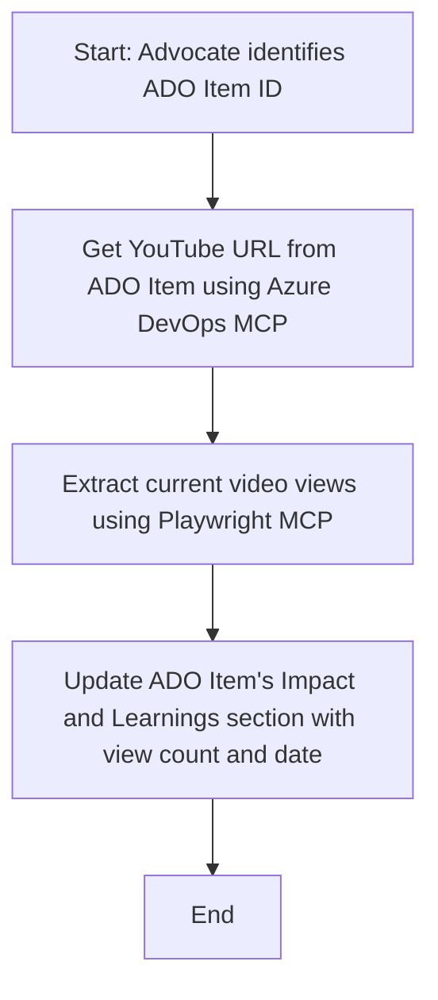

<!--
CO_OP_TRANSLATOR_METADATA:
{
  "original_hash": "14a2dfbea55ef735660a06bd6bdfe5f3",
  "translation_date": "2025-06-13T21:31:31+00:00",
  "source_file": "09-CaseStudy/UpdateADOItemsFromYT.md",
  "language_code": "ur"
}
-->
# کیس اسٹڈی: MCP کے ساتھ یوٹیوب ڈیٹا سے Azure DevOps آئٹمز کو اپ ڈیٹ کرنا

> **ڈسکلیمر:** آن لائن موجودہ ٹولز اور رپورٹس موجود ہیں جو Azure DevOps آئٹمز کو یوٹیوب جیسے پلیٹ فارمز سے ڈیٹا کے ذریعے اپ ڈیٹ کرنے کے عمل کو خودکار بنا سکتی ہیں۔ درج ذیل منظر نامہ صرف ایک مثال کے طور پر دیا گیا ہے تاکہ دکھایا جا سکے کہ MCP ٹولز کو آٹومیشن اور انٹیگریشن کے کاموں کے لیے کیسے استعمال کیا جا سکتا ہے۔

## جائزہ

یہ کیس اسٹڈی ایک مثال پیش کرتی ہے کہ کس طرح Model Context Protocol (MCP) اور اس کے ٹولز کو استعمال کر کے Azure DevOps (ADO) کے ورک آئٹمز کو آن لائن پلیٹ فارمز جیسے یوٹیوب سے حاصل کردہ معلومات کے ذریعے خودکار طریقے سے اپ ڈیٹ کیا جا سکتا ہے۔ بیان کردہ منظر نامہ ان ٹولز کی وسیع صلاحیتوں کی ایک مثال ہے، جنہیں بہت سے ملتے جلتے آٹومیشن کے مقاصد کے لیے ڈھالا جا سکتا ہے۔

اس مثال میں، ایک Advocate ADO آئٹمز کے ذریعے آن لائن سیشنز کو ٹریک کرتا ہے، جہاں ہر آئٹم میں یوٹیوب ویڈیو کا URL شامل ہوتا ہے۔ MCP ٹولز کے ذریعے، Advocate ADO آئٹمز کو تازہ ترین ویڈیو میٹرکس، جیسے ویو کاؤنٹس، کے ساتھ بار بار اور خودکار طریقے سے اپ ڈیٹ رکھ سکتا ہے۔ یہ طریقہ کار دوسرے استعمال کے کیسز کے لیے بھی عام کیا جا سکتا ہے جہاں آن لائن ذرائع سے معلومات کو ADO یا دیگر سسٹمز میں شامل کرنا ضروری ہو۔

## منظر نامہ

ایک Advocate آن لائن سیشنز اور کمیونٹی انگیجمنٹس کے اثرات کو ٹریک کرنے کا ذمہ دار ہے۔ ہر سیشن کو 'DevRel' پروجیکٹ میں ADO ورک آئٹم کے طور پر لاگ کیا جاتا ہے، اور ورک آئٹم میں یوٹیوب ویڈیو URL کے لیے ایک فیلڈ ہوتا ہے۔ سیشن کی پہنچ کی درست رپورٹنگ کے لیے، Advocate کو ویڈیو کے موجودہ ویو کاؤنٹ اور اس معلومات کی بازیابی کی تاریخ کے ساتھ ADO آئٹم کو اپ ڈیٹ کرنا ہوتا ہے۔

## استعمال شدہ ٹولز

- [Azure DevOps MCP](https://github.com/microsoft/azure-devops-mcp): MCP کے ذریعے ADO ورک آئٹمز تک پروگراماتی رسائی اور اپ ڈیٹس ممکن بناتا ہے۔
- [Playwright MCP](https://github.com/microsoft/playwright-mcp): ویب صفحات سے لائیو ڈیٹا نکالنے کے لیے براؤزر کے اقدامات کو خودکار بناتا ہے، جیسے یوٹیوب ویڈیو کے اعدادوشمار۔

## مرحلہ وار ورک فلو

1. **ADO آئٹم کی شناخت کریں**: 'DevRel' پروجیکٹ میں ADO ورک آئٹم ID (مثلاً 1234) سے شروع کریں۔
2. **یوٹیوب URL حاصل کریں**: Azure DevOps MCP ٹول استعمال کرتے ہوئے ورک آئٹم سے یوٹیوب URL حاصل کریں۔
3. **ویڈیو ویوز نکالیں**: Playwright MCP ٹول کے ذریعے یوٹیوب URL پر جائیں اور موجودہ ویو کاؤنٹ نکالیں۔
4. **ADO آئٹم کو اپ ڈیٹ کریں**: Azure DevOps MCP ٹول کے ذریعے ADO ورک آئٹم کے 'Impact and Learnings' سیکشن میں تازہ ترین ویو کاؤنٹ اور بازیابی کی تاریخ لکھیں۔

## مثال کا پرامپٹ

```bash
- Work with the ADO Item ID: 1234
- The project is '2025-Awesome'
- Get the YouTube URL for the ADO item
- Use Playwright to get the current views from the YouTube video
- Update the ADO item with the current video views and the updated date of the information
```

## Mermaid فلوچارٹ



## تکنیکی نفاذ

- **MCP آرکیسٹریشن**: ورک فلو ایک MCP سرور کے ذریعے منظم کیا جاتا ہے، جو Azure DevOps MCP اور Playwright MCP دونوں ٹولز کے استعمال کو مربوط کرتا ہے۔
- **خودکاری**: یہ عمل دستی طور پر شروع کیا جا سکتا ہے یا باقاعدہ وقفوں پر چلانے کے لیے شیڈول کیا جا سکتا ہے تاکہ ADO آئٹمز کو اپ ٹو ڈیٹ رکھا جا سکے۔
- **توسیع پذیری**: یہی پیٹرن دیگر آن لائن میٹرکس (مثلاً لائکس، کمنٹس) یا دیگر پلیٹ فارمز سے ADO آئٹمز کو اپ ڈیٹ کرنے کے لیے بھی بڑھایا جا سکتا ہے۔

## نتائج اور اثرات

- **کارکردگی**: ویڈیو میٹرکس کی بازیابی اور اپ ڈیٹ کو خودکار بنا کر Advocates کی دستی محنت کو کم کرتا ہے۔
- **درستی**: یقینی بناتا ہے کہ ADO آئٹمز آن لائن ذرائع سے دستیاب تازہ ترین ڈیٹا کی عکاسی کرتے ہیں۔
- **دہرائے جانے کی صلاحیت**: ایسے ملتے جلتے منظرناموں کے لیے ایک دوبارہ قابل استعمال ورک فلو فراہم کرتا ہے جس میں دیگر ڈیٹا ذرائع یا میٹرکس شامل ہوں۔

## حوالہ جات

- [Azure DevOps MCP](https://github.com/microsoft/azure-devops-mcp)
- [Playwright MCP](https://github.com/microsoft/playwright-mcp)
- [Model Context Protocol (MCP)](https://modelcontextprotocol.io/)

**دستخطی دستبرداری**:  
یہ دستاویز AI ترجمہ سروس [Co-op Translator](https://github.com/Azure/co-op-translator) کے ذریعے ترجمہ کی گئی ہے۔ اگرچہ ہم درستگی کی کوشش کرتے ہیں، براہ کرم اس بات سے آگاہ رہیں کہ خودکار ترجمے میں غلطیاں یا کمی بیشی ہو سکتی ہے۔ اصل دستاویز اپنی مادری زبان میں معتبر ماخذ سمجھی جائے۔ اہم معلومات کے لیے پیشہ ور انسانی ترجمہ کی سفارش کی جاتی ہے۔ اس ترجمے کے استعمال سے پیدا ہونے والی کسی بھی غلط فہمی یا غلط تشریح کی ذمہ داری ہم پر نہیں ہوگی۔