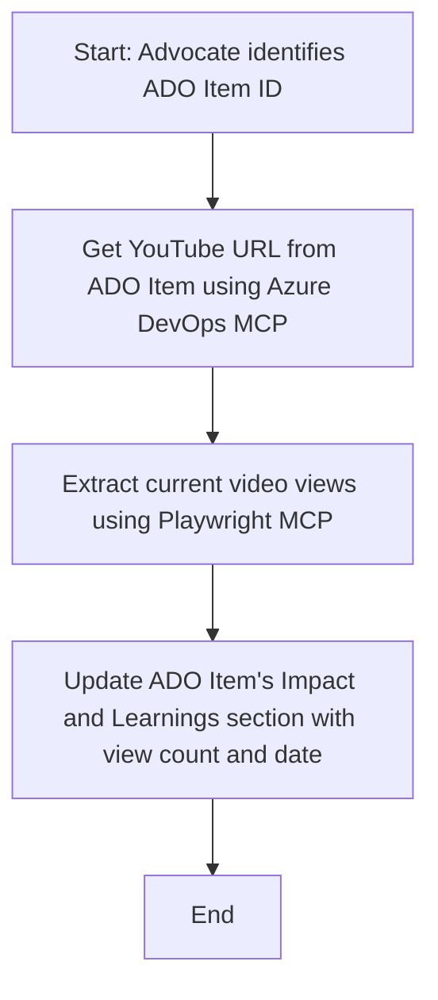

<!--
CO_OP_TRANSLATOR_METADATA:
{
  "original_hash": "14a2dfbea55ef735660a06bd6bdfe5f3",
  "translation_date": "2025-07-14T06:09:13+00:00",
  "source_file": "09-CaseStudy/UpdateADOItemsFromYT.md",
  "language_code": "ur"
}
-->
# کیس اسٹڈی: MCP کے ذریعے YouTube ڈیٹا سے Azure DevOps آئٹمز کو اپ ڈیٹ کرنا

> **Disclaimer:** آن لائن ایسے کئی ٹولز اور رپورٹس موجود ہیں جو YouTube جیسے پلیٹ فارمز سے ڈیٹا لے کر Azure DevOps آئٹمز کو خودکار طریقے سے اپ ڈیٹ کر سکتے ہیں۔ درج ذیل منظرنامہ صرف ایک نمونہ کے طور پر پیش کیا گیا ہے تاکہ دکھایا جا سکے کہ MCP ٹولز کو آٹومیشن اور انٹیگریشن کے کاموں کے لیے کیسے استعمال کیا جا سکتا ہے۔

## جائزہ

یہ کیس اسٹڈی ایک مثال پیش کرتی ہے کہ کس طرح Model Context Protocol (MCP) اور اس کے ٹولز کو استعمال کرتے ہوئے Azure DevOps (ADO) کے ورک آئٹمز کو آن لائن پلیٹ فارمز جیسے YouTube سے حاصل کردہ معلومات کے ساتھ خودکار طریقے سے اپ ڈیٹ کیا جا سکتا ہے۔ بیان کردہ منظرنامہ ان ٹولز کی وسیع صلاحیتوں کی ایک جھلک ہے، جنہیں بہت سے اسی نوعیت کے آٹومیشن کاموں کے لیے ڈھالا جا سکتا ہے۔

اس مثال میں، ایک Advocate آن لائن سیشنز کو ADO آئٹمز کے ذریعے ٹریک کرتا ہے، جہاں ہر آئٹم میں YouTube ویڈیو کا URL شامل ہوتا ہے۔ MCP ٹولز کی مدد سے، Advocate ADO آئٹمز کو تازہ ترین ویڈیو میٹرکس جیسے ویو کاؤنٹس کے ساتھ بار بار اور خودکار طریقے سے اپ ڈیٹ رکھ سکتا ہے۔ یہ طریقہ کار دوسرے ایسے استعمالات کے لیے بھی عام کیا جا سکتا ہے جہاں آن لائن ذرائع سے معلومات کو ADO یا دیگر سسٹمز میں ضم کرنا ہو۔

## منظرنامہ

ایک Advocate آن لائن سیشنز اور کمیونٹی انگیجمنٹس کے اثرات کو ٹریک کرنے کا ذمہ دار ہے۔ ہر سیشن کو 'DevRel' پروجیکٹ میں ADO ورک آئٹم کے طور پر لاگ کیا جاتا ہے، اور ورک آئٹم میں YouTube ویڈیو URL کے لیے ایک فیلڈ موجود ہوتی ہے۔ سیشن کی پہنچ کی درست رپورٹنگ کے لیے، Advocate کو ADO آئٹم کو ویڈیو کے موجودہ ویو کاؤنٹ اور اس معلومات کے حاصل کرنے کی تاریخ کے ساتھ اپ ڈیٹ کرنا ہوتا ہے۔

## استعمال شدہ ٹولز

- [Azure DevOps MCP](https://github.com/microsoft/azure-devops-mcp): MCP کے ذریعے ADO ورک آئٹمز تک پروگراماتی رسائی اور اپ ڈیٹس ممکن بناتا ہے۔
- [Playwright MCP](https://github.com/microsoft/playwright-mcp): ویب صفحات سے لائیو ڈیٹا نکالنے کے لیے براؤزر کے عمل کو خودکار بناتا ہے، جیسے YouTube ویڈیو کے اعداد و شمار۔

## مرحلہ وار ورک فلو

1. **ADO آئٹم کی شناخت کریں**: 'DevRel' پروجیکٹ میں ADO ورک آئٹم ID (مثلاً 1234) سے آغاز کریں۔
2. **YouTube URL حاصل کریں**: Azure DevOps MCP ٹول کا استعمال کرتے ہوئے ورک آئٹم سے YouTube URL نکالیں۔
3. **ویڈیو ویوز نکالیں**: Playwright MCP ٹول کا استعمال کرتے ہوئے YouTube URL پر جائیں اور موجودہ ویو کاؤنٹ حاصل کریں۔
4. **ADO آئٹم کو اپ ڈیٹ کریں**: تازہ ترین ویو کاؤنٹ اور حاصل کرنے کی تاریخ کو Azure DevOps MCP ٹول کے ذریعے ADO ورک آئٹم کے 'Impact and Learnings' سیکشن میں لکھیں۔

## مثال کا پرامپٹ

```bash
- Work with the ADO Item ID: 1234
- The project is '2025-Awesome'
- Get the YouTube URL for the ADO item
- Use Playwright to get the current views from the YouTube video
- Update the ADO item with the current video views and the updated date of the information
```

## Mermaid فلوچارٹ



## تکنیکی نفاذ

- **MCP آرکیسٹریشن**: ورک فلو کو ایک MCP سرور کے ذریعے منظم کیا جاتا ہے، جو Azure DevOps MCP اور Playwright MCP دونوں ٹولز کے استعمال کو مربوط کرتا ہے۔
- **خودکاری**: یہ عمل دستی طور پر شروع کیا جا سکتا ہے یا باقاعدہ وقفوں پر چلانے کے لیے شیڈول کیا جا سکتا ہے تاکہ ADO آئٹمز تازہ ترین رہیں۔
- **توسیع پذیری**: اسی پیٹرن کو دیگر آن لائن میٹرکس (جیسے لائکس، کمنٹس) یا دیگر پلیٹ فارمز سے ڈیٹا اپ ڈیٹ کرنے کے لیے بھی بڑھایا جا سکتا ہے۔

## نتائج اور اثرات

- **کارکردگی**: Advocate کے لیے ویڈیو میٹرکس کی بازیافت اور اپ ڈیٹ کے عمل کو خودکار بنا کر دستی محنت کم کرتا ہے۔
- **درستی**: یقینی بناتا ہے کہ ADO آئٹمز آن لائن ذرائع سے دستیاب سب سے تازہ ترین ڈیٹا کی عکاسی کریں۔
- **دہرائی جانے والی صلاحیت**: ایسے دیگر منظرناموں کے لیے ایک قابل استعمال ورک فلو فراہم کرتا ہے جن میں مختلف ڈیٹا ذرائع یا میٹرکس شامل ہوں۔

## حوالہ جات

- [Azure DevOps MCP](https://github.com/microsoft/azure-devops-mcp)
- [Playwright MCP](https://github.com/microsoft/playwright-mcp)
- [Model Context Protocol (MCP)](https://modelcontextprotocol.io/)

**دستخطی نوٹ**:  
یہ دستاویز AI ترجمہ سروس [Co-op Translator](https://github.com/Azure/co-op-translator) کے ذریعے ترجمہ کی گئی ہے۔ اگرچہ ہم درستگی کے لیے کوشاں ہیں، براہ کرم آگاہ رہیں کہ خودکار ترجمے میں غلطیاں یا عدم درستیاں ہو سکتی ہیں۔ اصل دستاویز اپنی مادری زبان میں معتبر ماخذ سمجھی جانی چاہیے۔ اہم معلومات کے لیے پیشہ ور انسانی ترجمہ کی سفارش کی جاتی ہے۔ اس ترجمے کے استعمال سے پیدا ہونے والی کسی بھی غلط فہمی یا غلط تشریح کی ذمہ داری ہم پر عائد نہیں ہوتی۔