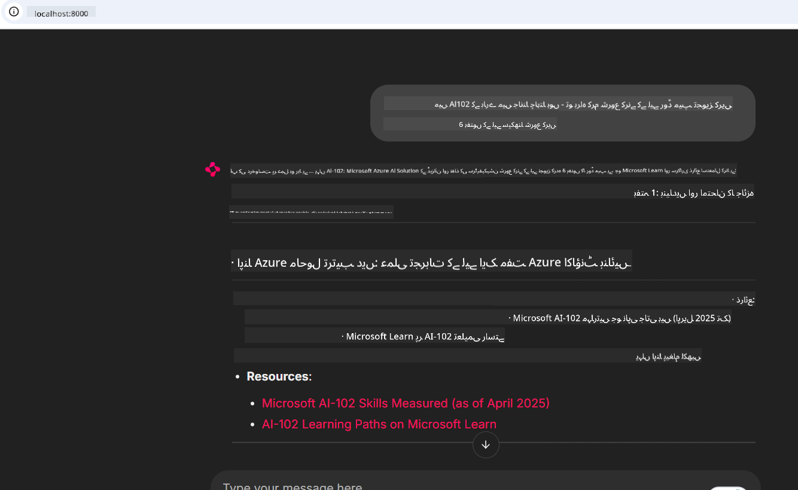

<!--
CO_OP_TRANSLATOR_METADATA:
{
  "original_hash": "4319d291c9d124ecafea52b3d04bfa0e",
  "translation_date": "2025-07-14T06:18:44+00:00",
  "source_file": "09-CaseStudy/docs-mcp/README.md",
  "language_code": "ur"
}
-->
# کیس اسٹڈی: کلائنٹ سے Microsoft Learn Docs MCP سرور سے کنیکٹ ہونا

کیا آپ نے کبھی خود کو دستاویزی سائٹس، Stack Overflow، اور لامتناہی سرچ انجن ٹیبز کے درمیان الجھتے ہوئے پایا ہے، جب کہ آپ اپنے کوڈ میں مسئلہ حل کرنے کی کوشش کر رہے ہوں؟ شاید آپ کے پاس صرف ڈاکیومنٹیشن کے لیے دوسرا مانیٹر ہوتا ہے، یا آپ مسلسل اپنے IDE اور براؤزر کے درمیان Alt-Tab کرتے رہتے ہیں۔ کیا بہتر نہیں ہوگا اگر آپ دستاویزات کو براہ راست اپنے ورک فلو میں لا سکیں—اپنی ایپس، IDE، یا یہاں تک کہ اپنی مرضی کے ٹولز میں ضم کر کے؟ اس کیس اسٹڈی میں، ہم بالکل یہی کریں گے: اپنے کلائنٹ ایپلیکیشن سے Microsoft Learn Docs MCP سرور سے براہ راست کنیکٹ کرنا سیکھیں گے۔

## جائزہ

جدید ترقی صرف کوڈ لکھنے تک محدود نہیں ہے—یہ صحیح وقت پر صحیح معلومات حاصل کرنے کا نام ہے۔ دستاویزات ہر جگہ موجود ہیں، لیکن وہ شاذ و نادر ہی وہاں ہوتی ہیں جہاں آپ کو سب سے زیادہ ضرورت ہو: آپ کے ٹولز اور ورک فلو کے اندر۔ دستاویزات کو براہ راست اپنی ایپلیکیشنز میں شامل کر کے، آپ وقت بچا سکتے ہیں، کانٹیکسٹ سوئچنگ کم کر سکتے ہیں، اور پیداواریت بڑھا سکتے ہیں۔ اس سیکشن میں، ہم آپ کو دکھائیں گے کہ کس طرح کلائنٹ کو Microsoft Learn Docs MCP سرور سے کنیکٹ کیا جائے، تاکہ آپ اپنی ایپ چھوڑے بغیر حقیقی وقت، کانٹیکسٹ سے آگاہ دستاویزات تک رسائی حاصل کر سکیں۔

ہم کنکشن قائم کرنے، درخواست بھیجنے، اور اسٹریمنگ جوابات کو مؤثر طریقے سے ہینڈل کرنے کے عمل سے گزریں گے۔ یہ طریقہ کار نہ صرف آپ کے ورک فلو کو آسان بناتا ہے بلکہ آپ کو زیادہ ذہین، مددگار ڈویلپر ٹولز بنانے کا موقع بھی فراہم کرتا ہے۔

## سیکھنے کے مقاصد

ہم یہ کیوں کر رہے ہیں؟ کیونکہ بہترین ڈویلپر تجربات وہ ہوتے ہیں جو رکاوٹوں کو ختم کر دیتے ہیں۔ تصور کریں ایک ایسی دنیا جہاں آپ کا کوڈ ایڈیٹر، چیٹ بوٹ، یا ویب ایپ آپ کے دستاویزی سوالات کا فوری جواب دے سکے، Microsoft Learn کے تازہ ترین مواد کے ساتھ۔ اس باب کے آخر تک، آپ جان جائیں گے کہ:

- MCP سرور-کلائنٹ کمیونیکیشن کی بنیادی باتیں سمجھنا
- Microsoft Learn Docs MCP سرور سے کنیکٹ کرنے کے لیے کنسول یا ویب ایپلیکیشن بنانا
- حقیقی وقت دستاویزات حاصل کرنے کے لیے اسٹریمنگ HTTP کلائنٹس کا استعمال
- اپنی ایپلیکیشن میں دستاویزی جوابات کو لاگ اور سمجھنا

آپ دیکھیں گے کہ یہ مہارتیں آپ کو ایسے ٹولز بنانے میں مدد دیتی ہیں جو صرف ردعمل نہیں دیتے بلکہ واقعی انٹرایکٹو اور کانٹیکسٹ سے آگاہ ہوتے ہیں۔

## منظر نامہ 1 - MCP کے ساتھ حقیقی وقت دستاویزات کی بازیافت

اس منظر نامے میں، ہم آپ کو دکھائیں گے کہ کس طرح کلائنٹ کو Microsoft Learn Docs MCP سرور سے کنیکٹ کیا جائے، تاکہ آپ اپنی ایپ چھوڑے بغیر حقیقی وقت، کانٹیکسٹ سے آگاہ دستاویزات تک رسائی حاصل کر سکیں۔

آئیے اسے عملی جامہ پہنائیں۔ آپ کا کام ایک ایسی ایپ لکھنا ہے جو Microsoft Learn Docs MCP سرور سے کنیکٹ ہو، `microsoft_docs_search` ٹول کو کال کرے، اور اسٹریمنگ جواب کو کنسول پر لاگ کرے۔

### یہ طریقہ کیوں؟
کیونکہ یہ زیادہ جدید انٹیگریشنز بنانے کی بنیاد ہے—چاہے آپ چیٹ بوٹ، IDE ایکسٹینشن، یا ویب ڈیش بورڈ بنانا چاہتے ہوں۔

آپ کو اس منظر نامے کے لیے کوڈ اور ہدایات [`solution`](./solution/README.md) فولڈر میں ملیں گی۔ یہ مراحل آپ کو کنکشن سیٹ اپ کرنے میں رہنمائی کریں گے:
- کنکشن کے لیے آفیشل MCP SDK اور اسٹریمنگ HTTP کلائنٹ کا استعمال کریں
- دستاویزات حاصل کرنے کے لیے `microsoft_docs_search` ٹول کو کوئری پیرامیٹر کے ساتھ کال کریں
- مناسب لاگنگ اور ایرر ہینڈلنگ نافذ کریں
- صارفین کو متعدد سرچ کوئریز داخل کرنے کی اجازت دینے کے لیے انٹرایکٹو کنسول انٹرفیس بنائیں

یہ منظر نامہ یہ دکھاتا ہے کہ:
- Docs MCP سرور سے کنیکٹ کیسے کریں
- کوئری بھیجیں
- نتائج کو پارس اور پرنٹ کریں

یہاں حل چلانے کی مثال دی گئی ہے:

```
Prompt> What is Azure Key Vault?
Answer> Azure Key Vault is a cloud service for securely storing and accessing secrets. ...
```

نیچے ایک مختصر نمونہ حل دیا گیا ہے۔ مکمل کوڈ اور تفصیلات حل فولڈر میں دستیاب ہیں۔

<details>
<summary>Python</summary>

```python
import asyncio
from mcp.client.streamable_http import streamablehttp_client
from mcp import ClientSession

async def main():
    async with streamablehttp_client("https://learn.microsoft.com/api/mcp") as (read_stream, write_stream, _):
        async with ClientSession(read_stream, write_stream) as session:
            await session.initialize()
            result = await session.call_tool("microsoft_docs_search", {"query": "Azure Functions best practices"})
            print(result.content)

if __name__ == "__main__":
    asyncio.run(main())
```

- مکمل نفاذ اور لاگنگ کے لیے، [`scenario1.py`](../../../../09-CaseStudy/docs-mcp/solution/python/scenario1.py) دیکھیں۔
- انسٹالیشن اور استعمال کی ہدایات کے لیے، اسی فولڈر میں موجود [`README.md`](./solution/python/README.md) فائل دیکھیں۔
</details>

## منظر نامہ 2 - MCP کے ساتھ انٹرایکٹو اسٹڈی پلان جنریٹر ویب ایپ

اس منظر نامے میں، آپ سیکھیں گے کہ Docs MCP کو ویب ڈویلپمنٹ پروجیکٹ میں کیسے شامل کیا جائے۔ مقصد یہ ہے کہ صارفین Microsoft Learn کی دستاویزات کو براہ راست ویب انٹرفیس سے تلاش کر سکیں، تاکہ دستاویزات آپ کی ایپ یا سائٹ کے اندر فوری طور پر دستیاب ہوں۔

آپ دیکھیں گے کہ کیسے:
- ویب ایپ سیٹ اپ کریں
- Docs MCP سرور سے کنیکٹ کریں
- صارف کی ان پٹ ہینڈل کریں اور نتائج دکھائیں

یہاں حل چلانے کی مثال دی گئی ہے:

```
User> I want to learn about AI102 - so suggest the roadmap to get it started from learn for 6 weeks

Assistant> Here’s a detailed 6-week roadmap to start your preparation for the AI-102: Designing and Implementing a Microsoft Azure AI Solution certification, using official Microsoft resources and focusing on exam skills areas:

---
## Week 1: Introduction & Fundamentals
- **Understand the Exam**: Review the [AI-102 exam skills outline](https://learn.microsoft.com/en-us/credentials/certifications/exams/ai-102/).
- **Set up Azure**: Sign up for a free Azure account if you don't have one.
- **Learning Path**: [Introduction to Azure AI services](https://learn.microsoft.com/en-us/training/modules/intro-to-azure-ai/)
- **Focus**: Get familiar with Azure portal, AI capabilities, and necessary tools.

....more weeks of the roadmap...

Let me know if you want module-specific recommendations or need more customized weekly tasks!
```

نیچے ایک مختصر نمونہ حل دیا گیا ہے۔ مکمل کوڈ اور تفصیلات حل فولڈر میں دستیاب ہیں۔



<details>
<summary>Python (Chainlit)</summary>

Chainlit ایک فریم ورک ہے جو بات چیت پر مبنی AI ویب ایپس بنانے کے لیے ہے۔ یہ انٹرایکٹو چیٹ بوٹس اور اسسٹنٹس بنانے کو آسان بناتا ہے جو MCP ٹولز کو کال کر کے حقیقی وقت میں نتائج دکھا سکتے ہیں۔ یہ تیز پروٹوٹائپنگ اور صارف دوست انٹرفیس کے لیے مثالی ہے۔

```python
import chainlit as cl
import requests

MCP_URL = "https://learn.microsoft.com/api/mcp"

@cl.on_message
def handle_message(message):
    query = {"question": message}
    response = requests.post(MCP_URL, json=query)
    if response.ok:
        result = response.json()
        cl.Message(content=result.get("answer", "No answer found.")).send()
    else:
        cl.Message(content="Error: " + response.text).send()
```

- مکمل نفاذ کے لیے، [`scenario2.py`](../../../../09-CaseStudy/docs-mcp/solution/python/scenario2.py) دیکھیں۔
- سیٹ اپ اور چلانے کی ہدایات کے لیے، [`README.md`](./solution/python/README.md) دیکھیں۔
</details>

## منظر نامہ 3: VS Code میں MCP سرور کے ساتھ ان ایڈیٹر دستاویزات

اگر آپ Microsoft Learn Docs کو براہ راست اپنے VS Code میں حاصل کرنا چاہتے ہیں (براؤزر ٹیبز سوئچ کیے بغیر)، تو آپ اپنے ایڈیٹر میں MCP سرور استعمال کر سکتے ہیں۔ اس سے آپ کو یہ سہولیات ملتی ہیں:
- VS Code میں کوڈنگ ماحول چھوڑے بغیر دستاویزات تلاش اور پڑھنا
- دستاویزات کا حوالہ دینا اور لنکس براہ راست README یا کورس فائلز میں شامل کرنا
- GitHub Copilot اور MCP کو مل کر استعمال کرنا تاکہ ایک مربوط، AI سے چلنے والا دستاویزی ورک فلو حاصل ہو

**آپ دیکھیں گے کہ کیسے:**
- اپنے ورک اسپیس روٹ میں ایک درست `.vscode/mcp.json` فائل شامل کریں (نیچے مثال دیکھیں)
- VS Code میں MCP پینل کھولیں یا کمانڈ پیلیٹ استعمال کر کے دستاویزات تلاش اور شامل کریں
- کام کے دوران اپنے مارک ڈاؤن فائلز میں دستاویزات کا حوالہ دیں
- اس ورک فلو کو GitHub Copilot کے ساتھ ملا کر پیداواریت بڑھائیں

یہاں VS Code میں MCP سرور سیٹ اپ کرنے کی مثال ہے:

```json
{
  "servers": {
    "LearnDocsMCP": {
      "url": "https://learn.microsoft.com/api/mcp"
    }
  }
}
```

</details>

> تفصیلی واک تھرو، اسکرین شاٹس اور مرحلہ وار گائیڈ کے لیے، [`README.md`](./solution/scenario3/README.md) دیکھیں۔


یہ طریقہ کار ان لوگوں کے لیے مثالی ہے جو تکنیکی کورسز بنا رہے ہیں، دستاویزات لکھ رہے ہیں، یا بار بار حوالہ دینے کی ضرورت کے ساتھ کوڈ ڈیولپ کر رہے ہیں۔

## اہم نکات

دستاویزات کو براہ راست اپنے ٹولز میں شامل کرنا صرف سہولت نہیں بلکہ پیداواریت کے لیے ایک انقلاب ہے۔ Microsoft Learn Docs MCP سرور سے اپنے کلائنٹ کے ذریعے کنیکٹ کر کے، آپ:

- اپنے کوڈ اور دستاویزات کے درمیان کانٹیکسٹ سوئچنگ ختم کر سکتے ہیں
- حقیقی وقت میں تازہ ترین، کانٹیکسٹ سے آگاہ دستاویزات حاصل کر سکتے ہیں
- زیادہ ذہین، انٹرایکٹو ڈویلپر ٹولز بنا سکتے ہیں

یہ مہارتیں آپ کو ایسے حل بنانے میں مدد دیں گی جو نہ صرف مؤثر ہوں بلکہ استعمال میں خوشگوار بھی ہوں۔

## اضافی وسائل

اپنی سمجھ بوجھ کو گہرا کرنے کے لیے، ان آفیشل وسائل کو دریافت کریں:

- [Microsoft Learn Docs MCP Server (GitHub)](https://github.com/MicrosoftDocs/mcp)
- [Azure MCP Server کے ساتھ شروع کریں (mcp-python)](https://learn.microsoft.com/en-us/azure/developer/azure-mcp-server/get-started#create-the-python-app)
- [Azure MCP Server کیا ہے؟](https://learn.microsoft.com/en-us/azure/developer/azure-mcp-server/)
- [Model Context Protocol (MCP) تعارف](https://modelcontextprotocol.io/introduction)
- [MCP سرور سے پلگ انز شامل کریں (Python)](https://learn.microsoft.com/en-us/semantic-kernel/concepts/plugins/adding-mcp-plugins)

**دستخطی نوٹ**:  
یہ دستاویز AI ترجمہ سروس [Co-op Translator](https://github.com/Azure/co-op-translator) کے ذریعے ترجمہ کی گئی ہے۔ اگرچہ ہم درستگی کے لیے کوشاں ہیں، براہ کرم آگاہ رہیں کہ خودکار ترجمے میں غلطیاں یا عدم درستیاں ہو سکتی ہیں۔ اصل دستاویز اپنی مادری زبان میں معتبر ماخذ سمجھی جانی چاہیے۔ اہم معلومات کے لیے پیشہ ور انسانی ترجمہ کی سفارش کی جاتی ہے۔ اس ترجمے کے استعمال سے پیدا ہونے والی کسی بھی غلط فہمی یا غلط تشریح کی ذمہ داری ہم پر عائد نہیں ہوتی۔