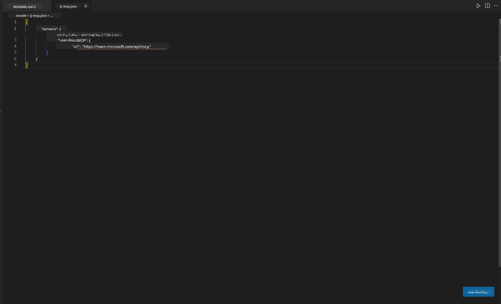
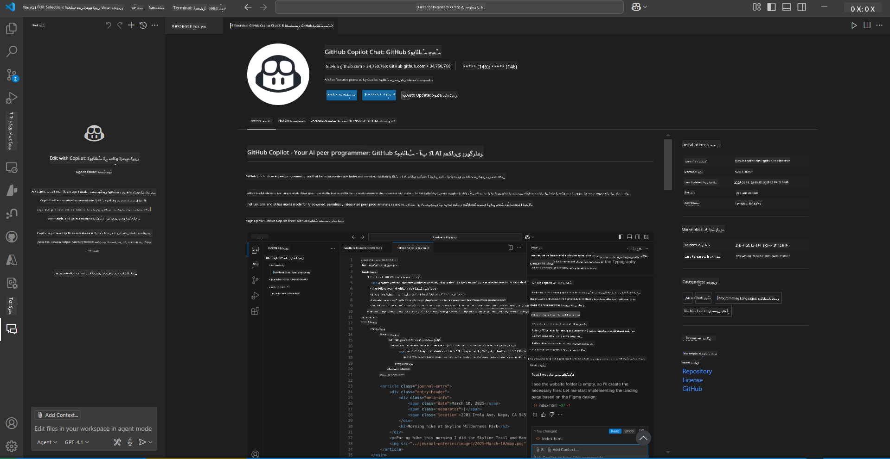
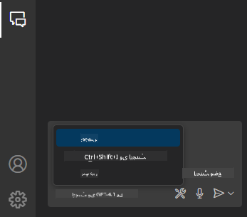
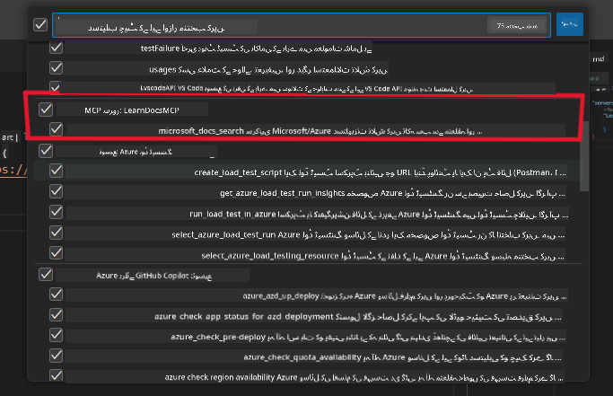
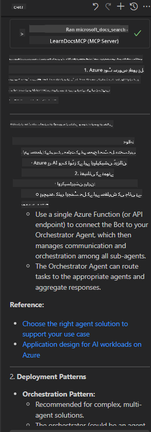

<!--
CO_OP_TRANSLATOR_METADATA:
{
  "original_hash": "db532b1ec386c9ce38c791653dc3c881",
  "translation_date": "2025-06-21T14:35:27+00:00",
  "source_file": "09-CaseStudy/docs-mcp/solution/scenario3/README.md",
  "language_code": "ur"
}
-->
# منظر نامہ 3: VS Code میں MCP سرور کے ساتھ ان-ایڈیٹر دستاویزات

## جائزہ

اس منظر نامے میں، آپ سیکھیں گے کہ Microsoft Learn Docs کو براہ راست اپنے Visual Studio Code کے ماحول میں MCP سرور کے ذریعے کیسے لایا جائے۔ بار بار براؤزر کے ٹیبز تبدیل کرنے کی بجائے، آپ اپنے ایڈیٹر کے اندر ہی سرکاری دستاویزات تک رسائی، تلاش، اور حوالہ دے سکتے ہیں۔ یہ طریقہ آپ کے کام کے بہاؤ کو آسان بناتا ہے، آپ کی توجہ برقرار رکھتا ہے، اور GitHub Copilot جیسے ٹولز کے ساتھ بے جوڑ انضمام ممکن بناتا ہے۔

- VS Code کے اندر ہی اپنی کوڈنگ کے ماحول کو چھوڑے بغیر دستاویزات تلاش کریں اور پڑھیں۔
- دستاویزات کا حوالہ دیں اور لنکس کو براہ راست اپنے README یا کورس فائلوں میں شامل کریں۔
- GitHub Copilot اور MCP کو ایک ساتھ استعمال کریں تاکہ AI سے چلنے والا ایک مربوط دستاویزاتی ورک فلو حاصل ہو۔

## سیکھنے کے مقاصد

اس باب کے آخر تک، آپ سمجھ جائیں گے کہ VS Code میں MCP سرور کو کیسے سیٹ اپ اور استعمال کیا جائے تاکہ آپ کی دستاویزات اور ترقیاتی ورک فلو کو بہتر بنایا جا سکے۔ آپ قابل ہو جائیں گے:

- اپنے ورک اسپیس کو MCP سرور کے ذریعے دستاویزات تلاش کرنے کے لیے ترتیب دیں۔
- VS Code کے اندر سے براہ راست دستاویزات تلاش کریں اور شامل کریں۔
- GitHub Copilot اور MCP کی طاقت کو ملائیں تاکہ ایک زیادہ مؤثر، AI سے معاون ورک فلو حاصل ہو۔

یہ مہارتیں آپ کی توجہ قائم رکھنے، دستاویزات کے معیار کو بہتر بنانے، اور بطور ڈویلپر یا تکنیکی مصنف آپ کی پیداواری صلاحیت بڑھانے میں مدد کریں گی۔

## حل

ان-ایڈیٹر دستاویزات تک رسائی حاصل کرنے کے لیے، آپ ایک سلسلہ وار اقدامات پر عمل کریں گے جو MCP سرور کو VS Code اور GitHub Copilot کے ساتھ مربوط کرتے ہیں۔ یہ حل کورس مصنفین، دستاویزات لکھنے والوں، اور ڈویلپرز کے لیے مثالی ہے جو دستاویزات اور Copilot کے ساتھ کام کرتے ہوئے ایڈیٹر میں اپنی توجہ برقرار رکھنا چاہتے ہیں۔

- کورس یا پروجیکٹ کی دستاویزات لکھتے ہوئے README میں جلدی سے حوالہ جاتی لنکس شامل کریں۔
- کوڈ بنانے کے لیے Copilot استعمال کریں اور MCP کے ذریعے متعلقہ دستاویزات فوراً تلاش کر کے حوالہ دیں۔
- اپنے ایڈیٹر میں توجہ مرکوز رکھیں اور پیداواری صلاحیت بڑھائیں۔

### مرحلہ وار رہنمائی

شروع کرنے کے لیے، ان مراحل پر عمل کریں۔ ہر مرحلے کے لیے، آپ assets فولڈر سے اسکرین شاٹ شامل کر سکتے ہیں تاکہ عمل کو بصری طور پر واضح کیا جا سکے۔

1. **MCP کنفیگریشن شامل کریں:**
   اپنے پروجیکٹ کے روٹ میں `.vscode/mcp.json` فائل بنائیں اور درج ذیل کنفیگریشن شامل کریں:
   ```json
   {
     "servers": {
       "LearnDocsMCP": {
         "url": "https://learn.microsoft.com/api/mcp"
       }
     }
   }
   ```
   یہ کنفیگریشن VS Code کو بتاتی ہے کہ [`Microsoft Learn Docs MCP server`](https://github.com/MicrosoftDocs/mcp) سے کیسے کنیکٹ ہونا ہے۔
   
   
    
2. **GitHub Copilot Chat پینل کھولیں:**
   اگر آپ کے پاس GitHub Copilot ایکسٹینشن انسٹال نہیں ہے، تو VS Code میں Extensions ویو پر جائیں اور اسے انسٹال کریں۔ آپ اسے براہ راست [Visual Studio Code Marketplace](https://marketplace.visualstudio.com/items?itemName=GitHub.copilot-chat) سے ڈاؤن لوڈ کر سکتے ہیں۔ پھر، سائیڈبار سے Copilot Chat پینل کھولیں۔

   

3. **ایجنٹ موڈ فعال کریں اور ٹولز کی تصدیق کریں:**
   Copilot Chat پینل میں، ایجنٹ موڈ کو فعال کریں۔

   

   ایجنٹ موڈ فعال کرنے کے بعد، تصدیق کریں کہ MCP سرور دستیاب ٹولز میں شامل ہے۔ اس سے یقینی بنتا ہے کہ Copilot ایجنٹ دستاویزات کے سرور تک رسائی حاصل کر کے متعلقہ معلومات لے سکتا ہے۔
   
   

4. **نیا چیٹ شروع کریں اور ایجنٹ کو سوالات دیں:**
   Copilot Chat پینل میں نیا چیٹ کھولیں۔ اب آپ دستاویزات سے متعلق سوالات ایجنٹ کو دے سکتے ہیں۔ ایجنٹ MCP سرور کا استعمال کرتے ہوئے متعلقہ Microsoft Learn دستاویزات آپ کے ایڈیٹر میں براہ راست دکھائے گا۔

   - *"میں موضوع X کے لیے ایک اسٹڈی پلان لکھنے کی کوشش کر رہا ہوں۔ میں اسے 8 ہفتوں تک پڑھوں گا، ہر ہفتے کے لیے مجھے مواد تجویز کریں جو میں لے سکتا ہوں۔"*

   

5. **لائیو سوالات:**

   > آئیے Azure AI Foundry Discord کے [#get-help](https://discord.gg/D6cRhjHWSC) سیکشن سے ایک لائیو سوال لیتے ہیں ([اصل پیغام دیکھیں](https://discord.com/channels/1113626258182504448/1385498306720829572)):
   
   *"میں Azure AI Foundry پر تیار کردہ AI ایجنٹس کے ساتھ ایک ملٹی ایجنٹ حل کی تعیناتی کے بارے میں جواب تلاش کر رہا ہوں۔ مجھے معلوم ہے کہ کوئی براہ راست تعیناتی کا طریقہ نہیں ہے، جیسے کہ Copilot Studio چینلز۔ تو، انٹرپرائز صارفین کے لیے یہ تعیناتی کرنے کے مختلف طریقے کیا ہیں تاکہ وہ بات چیت کر سکیں اور کام مکمل کر سکیں؟
کئی مضامین/بلاگز موجود ہیں جو کہتے ہیں کہ ہم Azure Bot سروس استعمال کر سکتے ہیں جو MS Teams اور Azure AI Foundry Agents کے درمیان پل کا کام کرے گا، تو کیا یہ کام کرے گا اگر میں ایک Azure بوٹ سیٹ اپ کروں جو Azure AI Foundry پر Orchestrator Agent سے Azure فنکشن کے ذریعے جُڑا ہو یا مجھے ہر AI ایجنٹ کے لیے Azure فنکشن بنانا ہوگا تاکہ Bot framework میں آرکسٹریشن کی جا سکے؟ کوئی اور تجاویز بھی خوش آمدید ہیں۔"*

   

   ایجنٹ متعلقہ دستاویزی لنکس اور خلاصے کے ساتھ جواب دے گا، جنہیں آپ براہ راست اپنے مارک ڈاؤن فائلوں میں شامل کر سکتے ہیں یا کوڈ میں حوالہ کے طور پر استعمال کر سکتے ہیں۔
   
### نمونہ سوالات

یہاں کچھ مثالیں دی گئی ہیں جنہیں آپ آزما سکتے ہیں۔ یہ سوالات ظاہر کریں گے کہ MCP سرور اور Copilot کس طرح مل کر فوری، سیاق و سباق سے آگاہ دستاویزات اور حوالہ جات فراہم کرتے ہیں بغیر VS Code چھوڑے:

- "مجھے دکھائیں کہ Azure Functions triggers کیسے استعمال کیے جاتے ہیں۔"
- "Azure Key Vault کی سرکاری دستاویزات کے لیے لنک شامل کریں۔"
- "Azure وسائل کو محفوظ بنانے کے بہترین طریقے کیا ہیں؟"
- "Azure AI سروسز کے لیے کوئی quickstart تلاش کریں۔"

یہ سوالات دکھائیں گے کہ MCP سرور اور Copilot کس طرح مل کر فوری، سیاق و سباق سے آگاہ دستاویزات اور حوالہ جات فراہم کرتے ہیں بغیر VS Code چھوڑے۔

---

**دستخطی وضاحت**:  
یہ دستاویز AI ترجمہ سروس [Co-op Translator](https://github.com/Azure/co-op-translator) کے ذریعے ترجمہ کی گئی ہے۔ اگرچہ ہم درستگی کے لیے کوشاں ہیں، براہ کرم اس بات سے آگاہ رہیں کہ خودکار ترجمے میں غلطیاں یا غیر درستیاں ہو سکتی ہیں۔ اصل دستاویز اپنی مادری زبان میں ہی معتبر ماخذ سمجھی جانی چاہیے۔ اہم معلومات کے لیے پیشہ ور انسانی ترجمہ تجویز کیا جاتا ہے۔ اس ترجمے کے استعمال سے پیدا ہونے والی کسی بھی غلط فہمی یا غلط تشریح کی ذمہ داری ہم پر عائد نہیں ہوتی۔