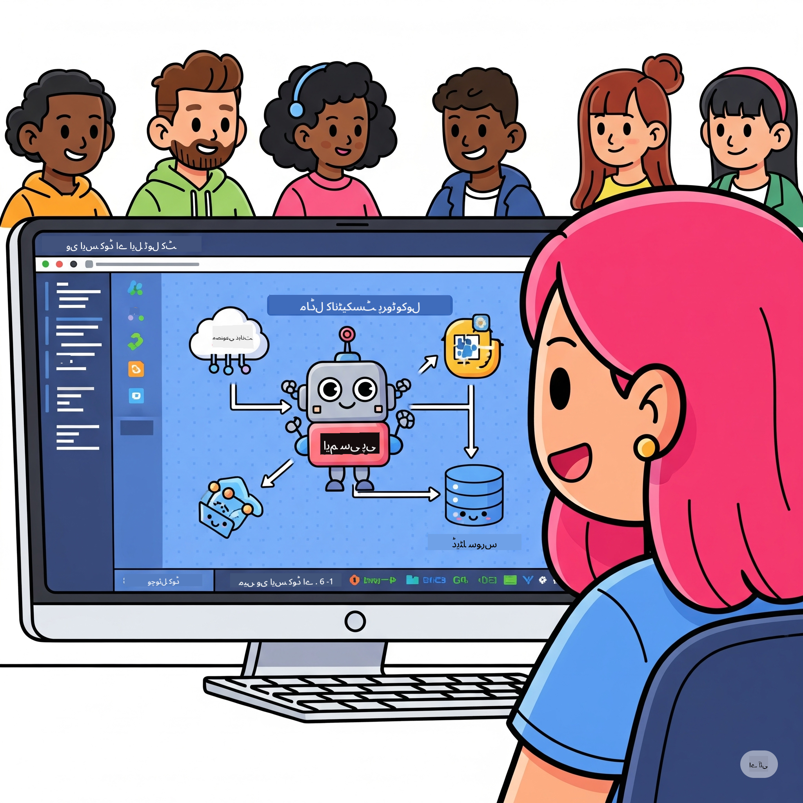

<!--
CO_OP_TRANSLATOR_METADATA:
{
  "original_hash": "1b000fd6e1b04c047578bfc5d07d54eb",
  "translation_date": "2025-08-18T14:24:33+00:00",
  "source_file": "10-StreamliningAIWorkflowsBuildingAnMCPServerWithAIToolkit/README.md",
  "language_code": "ur"
}
-->
# AI ورک فلو کو آسان بنانا: AI ٹول کٹ کے ساتھ MCP سرور بنانا

## 🎯 جائزہ

_(اوپر دی گئی تصویر پر کلک کریں تاکہ اس سبق کی ویڈیو دیکھ سکیں)_

**ماڈل کانٹیکسٹ پروٹوکول (MCP) ورکشاپ** میں خوش آمدید! یہ جامع عملی ورکشاپ دو جدید ٹیکنالوجیز کو یکجا کرتی ہے تاکہ AI ایپلیکیشن ڈیولپمنٹ میں انقلاب لایا جا سکے:

- **🔗 ماڈل کانٹیکسٹ پروٹوکول (MCP)**: AI ٹولز کے ساتھ آسان انضمام کے لیے ایک کھلا معیار
- **🛠️ AI ٹول کٹ برائے ویژول اسٹوڈیو کوڈ (AITK)**: مائیکروسافٹ کا طاقتور AI ڈیولپمنٹ ایکسٹینشن

### 🎓 آپ کیا سیکھیں گے

اس ورکشاپ کے اختتام تک، آپ ذہین ایپلیکیشنز بنانے کی مہارت حاصل کر لیں گے جو AI ماڈلز کو حقیقی دنیا کے ٹولز اور سروسز کے ساتھ جوڑتی ہیں۔ خودکار ٹیسٹنگ سے لے کر کسٹم API انضمام تک، آپ پیچیدہ کاروباری چیلنجز حل کرنے کے لیے عملی مہارتیں حاصل کریں گے۔

## 🏗️ ٹیکنالوجی اسٹیک

### 🔌 ماڈل کانٹیکسٹ پروٹوکول (MCP)

MCP کو **"AI کے لیے USB-C"** کہا جاتا ہے - ایک عالمی معیار جو AI ماڈلز کو بیرونی ٹولز اور ڈیٹا ذرائع سے جوڑتا ہے۔

**✨ اہم خصوصیات:**

- 🔄 **معیاری انضمام**: AI ٹول کنکشنز کے لیے یونیورسل انٹرفیس
- 🏛️ **لچکدار آرکیٹیکچر**: stdio/SSE ٹرانسپورٹ کے ذریعے مقامی اور ریموٹ سرورز
- 🧰 **وسیع ایکو سسٹم**: ٹولز، پرومپٹس، اور وسائل ایک پروٹوکول میں
- 🔒 **انٹرپرائز کے لیے تیار**: بلٹ ان سیکیورٹی اور قابل اعتماد

**🎯 MCP کیوں اہم ہے:**
جیسے USB-C نے کیبلز کے انتشار کو ختم کیا، MCP AI انضمام کی پیچیدگی کو ختم کرتا ہے۔ ایک پروٹوکول، لامحدود امکانات۔

### 🤖 AI ٹول کٹ برائے ویژول اسٹوڈیو کوڈ (AITK)

مائیکروسافٹ کا AI ڈیولپمنٹ ایکسٹینشن جو VS کوڈ کو AI پاور ہاؤس میں تبدیل کرتا ہے۔

**🚀 بنیادی صلاحیتیں:**

- 📦 **ماڈل کیٹلاگ**: Azure AI، GitHub، Hugging Face، Ollama سے ماڈلز تک رسائی
- ⚡ **مقامی انفرنس**: ONNX-آپٹمائزڈ CPU/GPU/NPU پر عملدرآمد
- 🏗️ **ایجنٹ بلڈر**: MCP انضمام کے ساتھ بصری AI ایجنٹ ڈیولپمنٹ
- 🎭 **ملٹی موڈل**: ٹیکسٹ، وژن، اور ساختی آؤٹ پٹ کی حمایت

**💡 ڈیولپمنٹ کے فوائد:**

- زیرو کنفیگریشن ماڈل ڈیپلائمنٹ
- بصری پرومپٹ انجینئرنگ
- ریئل ٹائم ٹیسٹنگ پلیگراؤنڈ
- MCP سرور انضمام کا آسان طریقہ

## 📚 سیکھنے کا سفر

### [🚀 ماڈیول 1: AI ٹول کٹ کی بنیادی باتیں](./lab1/README.md)

**دورانیہ**: 15 منٹ

- 🛠️ AI ٹول کٹ کو VS کوڈ میں انسٹال اور کنفیگر کریں
- 🗂️ ماڈل کیٹلاگ کو دریافت کریں (GitHub، ONNX، OpenAI، Anthropic، Google سے 100+ ماڈلز)
- 🎮 ریئل ٹائم ماڈل ٹیسٹنگ کے لیے انٹرایکٹو پلیگراؤنڈ میں مہارت حاصل کریں
- 🤖 اپنا پہلا AI ایجنٹ ایجنٹ بلڈر کے ساتھ بنائیں
- 📊 بلٹ ان میٹرکس کے ساتھ ماڈل کی کارکردگی کا جائزہ لیں (F1، مطابقت، مماثلت، ہم آہنگی)
- ⚡ بیچ پروسیسنگ اور ملٹی موڈل سپورٹ کی صلاحیتیں سیکھیں

**🎯 سیکھنے کا نتیجہ**: AITK کی صلاحیتوں کی جامع تفہیم کے ساتھ ایک فعال AI ایجنٹ بنائیں

### [🌐 ماڈیول 2: MCP کے ساتھ AI ٹول کٹ کی بنیادی باتیں](./lab2/README.md)

**دورانیہ**: 20 منٹ

- 🧠 ماڈل کانٹیکسٹ پروٹوکول (MCP) کی آرکیٹیکچر اور تصورات میں مہارت حاصل کریں
- 🌐 مائیکروسافٹ کے MCP سرور ایکو سسٹم کو دریافت کریں
- 🤖 Playwright MCP سرور کا استعمال کرتے ہوئے ایک براؤزر آٹومیشن ایجنٹ بنائیں
- 🔧 MCP سرورز کو AI ٹول کٹ ایجنٹ بلڈر کے ساتھ ضم کریں
- 📊 اپنے ایجنٹس میں MCP ٹولز کو کنفیگر اور ٹیسٹ کریں
- 🚀 MCP پاورڈ ایجنٹس کو پروڈکشن کے لیے ایکسپورٹ اور ڈیپلائے کریں

**🎯 سیکھنے کا نتیجہ**: بیرونی ٹولز کے ساتھ سپرچارجڈ AI ایجنٹ کو ڈیپلائے کریں

### [🔧 ماڈیول 3: AI ٹول کٹ کے ساتھ ایڈوانسڈ MCP ڈیولپمنٹ](./lab3/README.md)

**دورانیہ**: 20 منٹ

- 💻 AI ٹول کٹ کا استعمال کرتے ہوئے کسٹم MCP سرورز بنائیں
- 🐍 تازہ ترین MCP Python SDK (v1.9.3) کو کنفیگر اور استعمال کریں
- 🔍 ڈی بگنگ کے لیے MCP انسپکٹر کو سیٹ اپ اور استعمال کریں
- 🛠️ پروفیشنل ڈی بگنگ ورک فلو کے ساتھ ایک Weather MCP سرور بنائیں
- 🧪 ایجنٹ بلڈر اور انسپکٹر ماحول میں MCP سرورز کو ڈی بگ کریں

**🎯 سیکھنے کا نتیجہ**: جدید ٹولنگ کے ساتھ کسٹم MCP سرورز کو ڈیولپ اور ڈی بگ کریں

### [🐙 ماڈیول 4: عملی MCP ڈیولپمنٹ - کسٹم GitHub کلون سرور](./lab4/README.md)

**دورانیہ**: 30 منٹ

- 🏗️ ڈیولپمنٹ ورک فلو کے لیے ایک حقیقی دنیا کا GitHub کلون MCP سرور بنائیں
- 🔄 اسمارٹ ریپوزٹری کلوننگ کو ویلیڈیشن اور ایرر ہینڈلنگ کے ساتھ نافذ کریں
- 📁 ذہین ڈائریکٹری مینجمنٹ اور VS کوڈ انضمام بنائیں
- 🤖 کسٹم MCP ٹولز کے ساتھ GitHub Copilot ایجنٹ موڈ استعمال کریں
- 🛡️ پروڈکشن کے لیے تیار قابل اعتماد اور کراس پلیٹ فارم مطابقت کو نافذ کریں

**🎯 سیکھنے کا نتیجہ**: ایک پروڈکشن کے لیے تیار MCP سرور ڈیپلائے کریں جو حقیقی ڈیولپمنٹ ورک فلو کو آسان بناتا ہے

## 💡 حقیقی دنیا کی ایپلیکیشنز اور اثرات

### 🏢 انٹرپرائز استعمال کے کیسز

#### 🔄 ڈیولپمنٹ ورک فلو آٹومیشن

اپنے ڈیولپمنٹ ورک فلو کو ذہین آٹومیشن کے ساتھ تبدیل کریں:

- **اسمارٹ ریپوزٹری مینجمنٹ**: AI سے چلنے والے کوڈ ریویو اور مرج فیصلے
- **ذہین CI/CD**: کوڈ تبدیلیوں کی بنیاد پر خودکار پائپ لائن آپٹیمائزیشن
- **ایشو ٹریاج**: خودکار بگ کی درجہ بندی اور اسائنمنٹ

#### 🧪 کوالٹی ایشورنس انقلاب

AI سے چلنے والے آٹومیشن کے ساتھ ٹیسٹنگ کو بلند کریں:

- **ذہین ٹیسٹ جنریشن**: خودکار طور پر جامع ٹیسٹ سوٹس بنائیں
- **ویژول ریگریشن ٹیسٹنگ**: UI تبدیلیوں کا AI سے چلنے والا پتہ لگانا
- **کارکردگی کی نگرانی**: مسائل کی پیشگی شناخت اور حل

#### 📊 ڈیٹا پائپ لائن انٹیلیجنس

سمارٹ ڈیٹا پروسیسنگ ورک فلو بنائیں:

- **ایڈاپٹیو ETL پروسیسز**: خود کو بہتر بنانے والے ڈیٹا ٹرانسفارمیشنز
- **انوامل ڈیٹیکشن**: ریئل ٹائم ڈیٹا کوالٹی مانیٹرنگ
- **ذہین روٹنگ**: سمارٹ ڈیٹا فلو مینجمنٹ

#### 🎧 کسٹمر تجربہ میں بہتری

غیر معمولی کسٹمر انٹریکشنز بنائیں:

- **کانٹیکسٹ سے آگاہ سپورٹ**: کسٹمر ہسٹری تک رسائی کے ساتھ AI ایجنٹس
- **پیشگی مسئلہ حل**: پیش گوئی کرنے والی کسٹمر سروس
- **ملٹی چینل انضمام**: پلیٹ فارمز کے درمیان متحد AI تجربہ

## 🛠️ ضروریات اور سیٹ اپ

### 💻 سسٹم کی ضروریات

| جزو | ضرورت | نوٹس |
|-----------|-------------|-------|
| **آپریٹنگ سسٹم** | Windows 10+, macOS 10.15+, Linux | کوئی بھی جدید OS |
| **ویژول اسٹوڈیو کوڈ** | تازہ ترین مستحکم ورژن | AITK کے لیے ضروری |
| **Node.js** | v18.0+ اور npm | MCP سرور ڈیولپمنٹ کے لیے |
| **Python** | 3.10+ | اختیاری برائے Python MCP سرورز |
| **میموری** | کم از کم 8GB RAM | مقامی ماڈلز کے لیے 16GB تجویز کردہ |

### 🔧 ڈیولپمنٹ ماحول

#### تجویز کردہ VS کوڈ ایکسٹینشنز

- **AI ٹول کٹ** (ms-windows-ai-studio.windows-ai-studio)
- **Python** (ms-python.python)
- **Python Debugger** (ms-python.debugpy)
- **GitHub Copilot** (GitHub.copilot) - اختیاری لیکن مددگار

#### اختیاری ٹولز

- **uv**: جدید Python پیکیج مینیجر
- **MCP انسپکٹر**: MCP سرورز کے لیے بصری ڈی بگنگ ٹول
- **Playwright**: ویب آٹومیشن مثالوں کے لیے

## 🎖️ سیکھنے کے نتائج اور سرٹیفیکیشن کا راستہ

### 🏆 مہارت حاصل کرنے کی چیک لسٹ

اس ورکشاپ کو مکمل کر کے، آپ درج ذیل مہارتوں میں مہارت حاصل کریں گے:

#### 🎯 بنیادی صلاحیتیں

- [ ] **MCP پروٹوکول میں مہارت**: آرکیٹیکچر اور نفاذ کے نمونوں کی گہری تفہیم
- [ ] **AITK میں مہارت**: AI ٹول کٹ کے ماہر سطح کے استعمال میں مہارت
- [ ] **کسٹم سرور ڈیولپمنٹ**: پروڈکشن MCP سرورز بنانا، ڈیپلائے کرنا، اور برقرار رکھنا
- [ ] **ٹول انضمام میں مہارت**: AI کو موجودہ ڈیولپمنٹ ورک فلو کے ساتھ آسانی سے جوڑنا
- [ ] **مسئلہ حل کرنے کی درخواست**: سیکھے گئے مہارتوں کو حقیقی کاروباری چیلنجز پر لاگو کرنا

#### 🔧 تکنیکی مہارتیں

- [ ] AI ٹول کٹ کو VS کوڈ میں سیٹ اپ اور کنفیگر کریں
- [ ] کسٹم MCP سرورز کو ڈیزائن اور نافذ کریں
- [ ] GitHub ماڈلز کو MCP آرکیٹیکچر کے ساتھ ضم کریں
- [ ] Playwright کے ساتھ خودکار ٹیسٹنگ ورک فلو بنائیں
- [ ] AI ایجنٹس کو پروڈکشن کے لیے ڈیپلائے کریں
- [ ] MCP سرور کی کارکردگی کو ڈی بگ اور بہتر بنائیں

#### 🚀 ایڈوانسڈ صلاحیتیں

- [ ] انٹرپرائز پیمانے پر AI انضمام کی آرکیٹیکچر بنائیں
- [ ] AI ایپلیکیشنز کے لیے سیکیورٹی کے بہترین طریقے نافذ کریں
- [ ] قابل توسیع MCP سرور آرکیٹیکچر ڈیزائن کریں
- [ ] مخصوص ڈومینز کے لیے کسٹم ٹول چینز بنائیں
- [ ] دوسروں کو AI-نیٹو ڈیولپمنٹ میں رہنمائی فراہم کریں

## 📖 اضافی وسائل

- [MCP وضاحت](https://modelcontextprotocol.io/docs)
- [AI ٹول کٹ GitHub ریپوزٹری](https://github.com/microsoft/vscode-ai-toolkit)
- [نمونہ MCP سرورز کا مجموعہ](https://github.com/modelcontextprotocol/servers)
- [بہترین طریقوں کی گائیڈ](https://modelcontextprotocol.io/docs/best-practices)

---

**🚀 کیا آپ اپنے AI ڈیولپمنٹ ورک فلو میں انقلاب لانے کے لیے تیار ہیں؟**

آئیے MCP اور AI ٹول کٹ کے ساتھ ذہین ایپلیکیشنز کا مستقبل مل کر بنائیں!

**ڈس کلیمر**:  
یہ دستاویز AI ترجمہ سروس [Co-op Translator](https://github.com/Azure/co-op-translator) کا استعمال کرتے ہوئے ترجمہ کی گئی ہے۔ ہم درستگی کے لیے کوشش کرتے ہیں، لیکن براہ کرم آگاہ رہیں کہ خودکار ترجمے میں غلطیاں یا خامیاں ہو سکتی ہیں۔ اصل دستاویز کو اس کی اصل زبان میں مستند ذریعہ سمجھا جانا چاہیے۔ اہم معلومات کے لیے، پیشہ ور انسانی ترجمہ کی سفارش کی جاتی ہے۔ اس ترجمے کے استعمال سے پیدا ہونے والی کسی بھی غلط فہمی یا غلط تشریح کے لیے ہم ذمہ دار نہیں ہیں۔