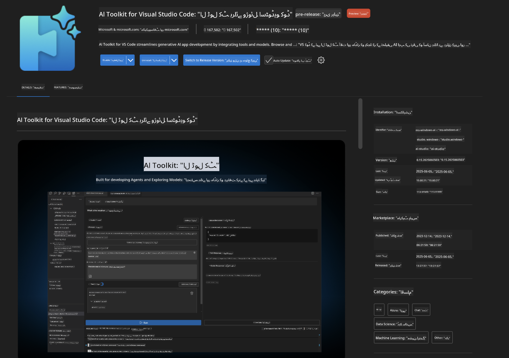
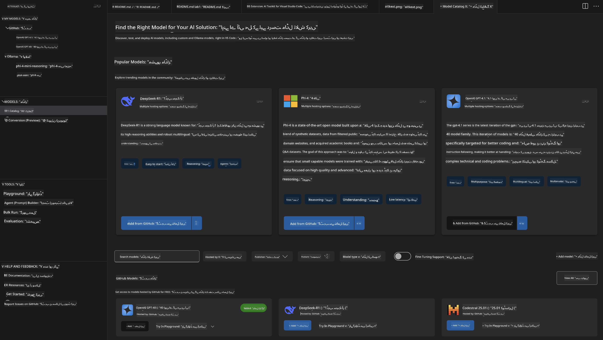
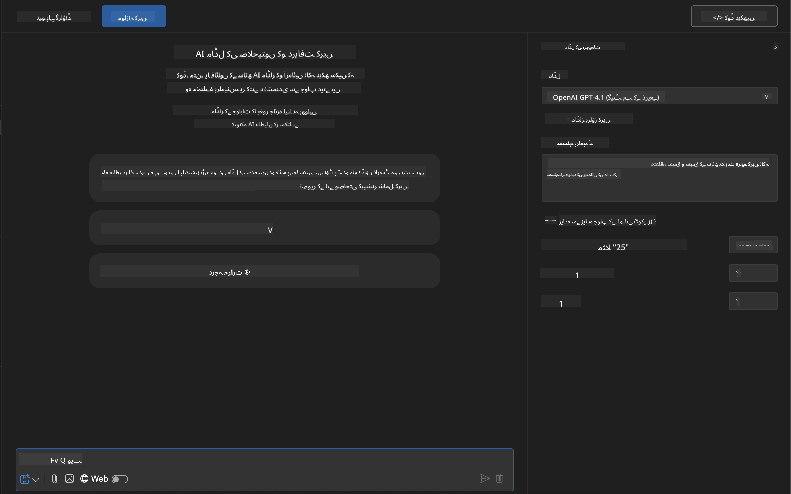
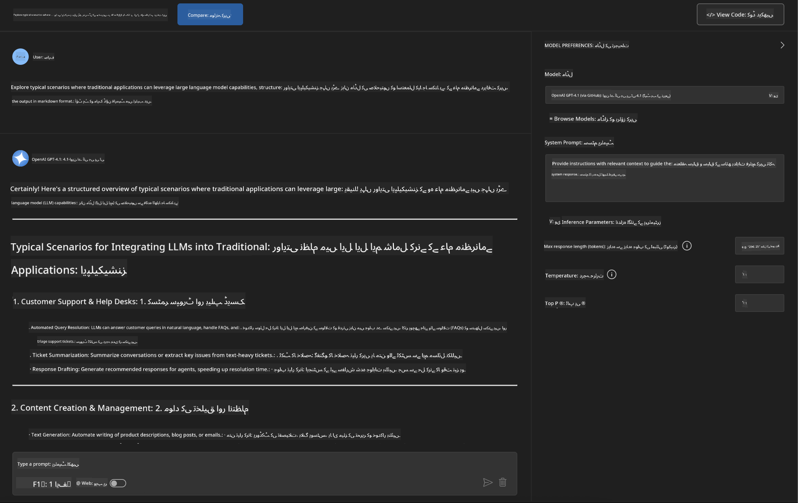
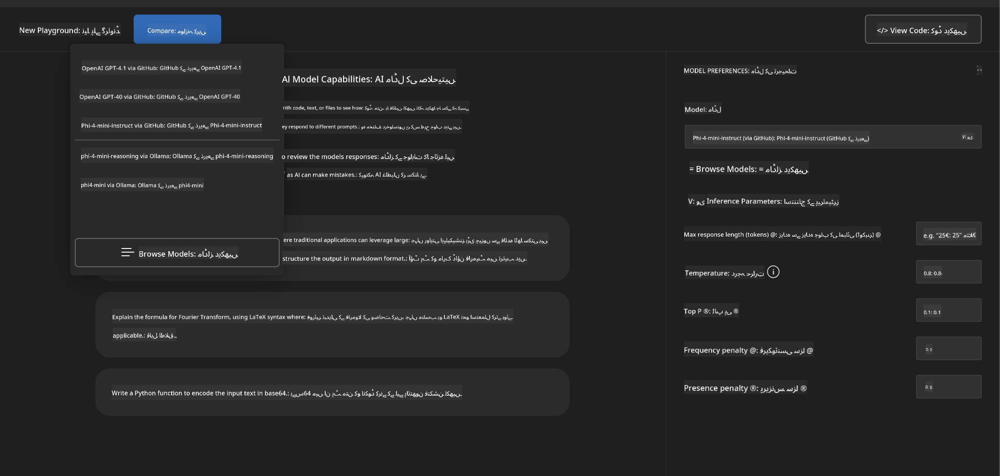
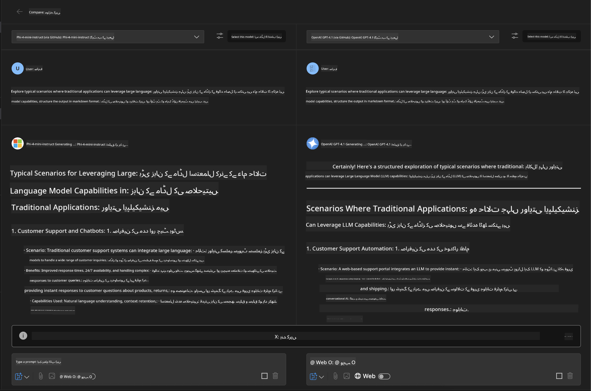
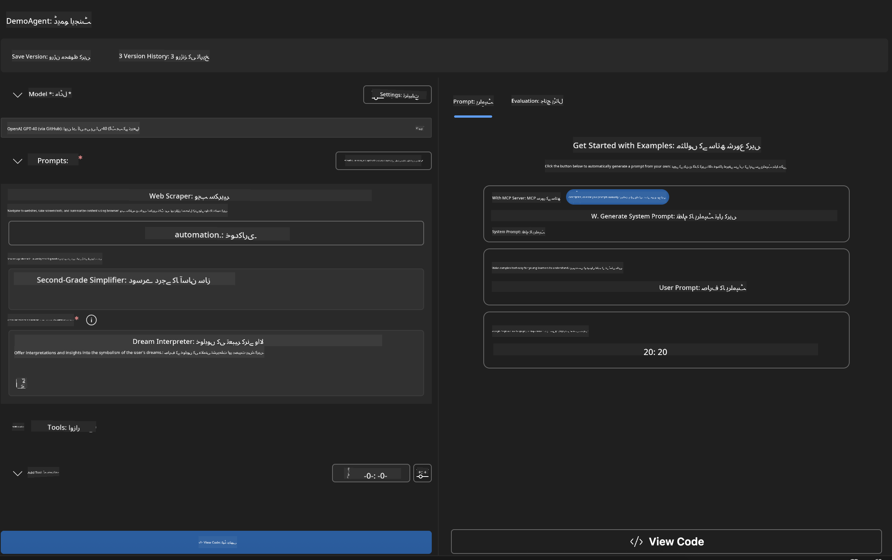
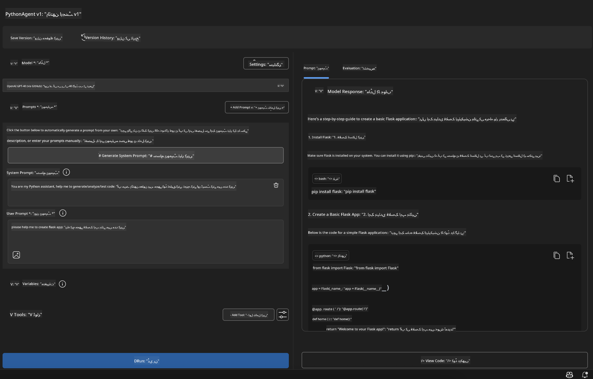

<!--
CO_OP_TRANSLATOR_METADATA:
{
  "original_hash": "2aa9dbc165e104764fa57e8a0d3f1c73",
  "translation_date": "2025-07-14T07:19:49+00:00",
  "source_file": "10-StreamliningAIWorkflowsBuildingAnMCPServerWithAIToolkit/lab1/README.md",
  "language_code": "ur"
}
-->
# 🚀 ماڈیول 1: AI Toolkit کے بنیادی اصول

[]()
[]()
[]()

## 📋 سیکھنے کے مقاصد

اس ماڈیول کے اختتام تک، آپ کر سکیں گے:
- ✅ Visual Studio Code کے لیے AI Toolkit انسٹال اور ترتیب دینا
- ✅ Model Catalog میں نیویگیٹ کرنا اور مختلف ماڈل ذرائع کو سمجھنا
- ✅ Playground کا استعمال کرتے ہوئے ماڈل کی جانچ اور تجربہ کرنا
- ✅ Agent Builder کے ذریعے کسٹم AI ایجنٹس بنانا
- ✅ مختلف فراہم کنندگان کے ماڈلز کی کارکردگی کا موازنہ کرنا
- ✅ پرامپٹ انجینئرنگ کے بہترین طریقے اپنانا

## 🧠 AI Toolkit (AITK) کا تعارف

**AI Toolkit for Visual Studio Code** مائیکروسافٹ کی مرکزی توسیع ہے جو VS Code کو ایک مکمل AI ترقیاتی ماحول میں تبدیل کرتی ہے۔ یہ AI تحقیق اور عملی ایپلیکیشن ڈیولپمنٹ کے درمیان پل کا کام کرتی ہے، جس سے جنریٹو AI ہر سطح کے ڈویلپرز کے لیے قابل رسائی ہو جاتا ہے۔

### 🌟 اہم خصوصیات

| خصوصیت | وضاحت | استعمال کا موقع |
|---------|-------------|----------|
| **🗂️ Model Catalog** | GitHub، ONNX، OpenAI، Anthropic، Google سے 100+ ماڈلز تک رسائی | ماڈل کی دریافت اور انتخاب |
| **🔌 BYOM Support** | اپنے ماڈلز (مقامی/ریموٹ) کو شامل کریں | کسٹم ماڈل کی تعیناتی |
| **🎮 Interactive Playground** | چیٹ انٹرفیس کے ساتھ حقیقی وقت میں ماڈل کی جانچ | تیز پروٹوٹائپنگ اور جانچ |
| **📎 Multi-Modal Support** | متن، تصاویر، اور اٹیچمنٹس کو سنبھالنا | پیچیدہ AI ایپلیکیشنز |
| **⚡ Batch Processing** | ایک ساتھ متعدد پرامپٹس چلانا | مؤثر جانچ کے عمل |
| **📊 Model Evaluation** | بلٹ ان میٹرکس (F1، مطابقت، مماثلت، ہم آہنگی) | کارکردگی کا جائزہ |

### 🎯 AI Toolkit کیوں اہم ہے

- **🚀 تیز تر ترقی**: خیال سے پروٹوٹائپ تک چند منٹوں میں
- **🔄 متحدہ ورک فلو**: متعدد AI فراہم کنندگان کے لیے ایک انٹرفیس
- **🧪 آسان تجربہ کاری**: پیچیدہ سیٹ اپ کے بغیر ماڈلز کا موازنہ کریں
- **📈 پروڈکشن کے لیے تیار**: پروٹوٹائپ سے تعیناتی تک بغیر رکاوٹ منتقلی

## 🛠️ ضروریات اور سیٹ اپ

### 📦 AI Toolkit ایکسٹینشن انسٹال کریں

**مرحلہ 1: ایکسٹینشن مارکیٹ پلیس تک رسائی**
1. Visual Studio Code کھولیں
2. ایکسٹینشنز ویو پر جائیں (`Ctrl+Shift+X` یا `Cmd+Shift+X`)
3. "AI Toolkit" تلاش کریں

**مرحلہ 2: اپنی ورژن منتخب کریں**
- **🟢 ریلیز**: پروڈکشن استعمال کے لیے تجویز کردہ
- **🔶 پری-ریلیز**: جدید فیچرز کے لیے ابتدائی رسائی

**مرحلہ 3: انسٹال اور فعال کریں**



### ✅ تصدیقی چیک لسٹ
- [ ] AI Toolkit کا آئیکن VS Code کے سائیڈبار میں ظاہر ہو
- [ ] ایکسٹینشن فعال اور چالو ہو
- [ ] آؤٹ پٹ پینل میں کوئی انسٹالیشن کی غلطیاں نہ ہوں

## 🧪 عملی مشق 1: GitHub ماڈلز کی دریافت

**🎯 مقصد**: Model Catalog میں مہارت حاصل کریں اور اپنا پہلا AI ماڈل آزمائیں

### 📊 مرحلہ 1: Model Catalog میں نیویگیٹ کریں

Model Catalog AI ماحولیاتی نظام کا دروازہ ہے۔ یہ متعدد فراہم کنندگان کے ماڈلز کو یکجا کرتا ہے، جس سے آپ کے لیے اختیارات دریافت کرنا اور موازنہ کرنا آسان ہو جاتا ہے۔

**🔍 نیویگیشن گائیڈ:**

AI Toolkit سائیڈبار میں **MODELS - Catalog** پر کلک کریں



**💡 پرو ٹپ**: ایسے ماڈلز تلاش کریں جن کی خصوصیات آپ کے استعمال کے کیس سے میل کھاتی ہوں (مثلاً کوڈ جنریشن، تخلیقی تحریر، تجزیہ)۔

**⚠️ Note**: GitHub پر میزبانی کیے گئے ماڈلز (یعنی GitHub Models) مفت استعمال کے لیے دستیاب ہیں لیکن درخواستوں اور ٹوکنز پر ریٹ لمٹس کے تابع ہیں۔ اگر آپ غیر GitHub ماڈلز (یعنی Azure AI یا دیگر اینڈ پوائنٹس پر میزبانی شدہ بیرونی ماڈلز) تک رسائی چاہتے ہیں، تو آپ کو مناسب API کلید یا توثیق فراہم کرنی ہوگی۔

### 🚀 مرحلہ 2: اپنا پہلا ماڈل شامل کریں اور ترتیب دیں

**ماڈل انتخاب کی حکمت عملی:**
- **GPT-4.1**: پیچیدہ استدلال اور تجزیے کے لیے بہترین
- **Phi-4-mini**: ہلکا پھلکا، سادہ کاموں کے لیے تیز ردعمل

**🔧 ترتیب کا عمل:**
1. کیٹلاگ سے **OpenAI GPT-4.1** منتخب کریں
2. **Add to My Models** پر کلک کریں - اس سے ماڈل استعمال کے لیے رجسٹر ہو جائے گا
3. **Try in Playground** منتخب کریں تاکہ جانچ کا ماحول شروع ہو
4. ماڈل کی ابتدا کا انتظار کریں (پہلی بار سیٹ اپ میں کچھ وقت لگ سکتا ہے)



**⚙️ ماڈل پیرامیٹرز کو سمجھنا:**
- **Temperature**: تخلیقی صلاحیت کو کنٹرول کرتا ہے (0 = متعین، 1 = تخلیقی)
- **Max Tokens**: زیادہ سے زیادہ جواب کی لمبائی
- **Top-p**: جواب کی تنوع کے لیے نیوکلئیس سیمپلنگ

### 🎯 مرحلہ 3: Playground انٹرفیس میں مہارت حاصل کریں

Playground آپ کی AI تجربہ گاہ ہے۔ اسے زیادہ سے زیادہ فائدہ اٹھانے کے لیے:

**🎨 پرامپٹ انجینئرنگ کے بہترین طریقے:**
1. **مخصوص ہوں**: واضح اور تفصیلی ہدایات بہتر نتائج دیتی ہیں
2. **سیاق و سباق فراہم کریں**: متعلقہ پس منظر شامل کریں
3. **مثالیں دیں**: ماڈل کو دکھائیں کہ آپ کیا چاہتے ہیں
4. **دہرائیں**: ابتدائی نتائج کی بنیاد پر پرامپٹس کو بہتر بنائیں

**🧪 جانچ کے منظرنامے:**
```markdown
# Example 1: Code Generation
"Write a Python function that calculates the factorial of a number using recursion. Include error handling and docstrings."

# Example 2: Creative Writing
"Write a professional email to a client explaining a project delay, maintaining a positive tone while being transparent about challenges."

# Example 3: Data Analysis
"Analyze this sales data and provide insights: [paste your data]. Focus on trends, anomalies, and actionable recommendations."
```



### 🏆 چیلنج مشق: ماڈل کی کارکردگی کا موازنہ

**🎯 مقصد**: ایک جیسے پرامپٹس کے ذریعے مختلف ماڈلز کا موازنہ کریں تاکہ ان کی خصوصیات سمجھ سکیں

**📋 ہدایات:**
1. **Phi-4-mini** کو اپنے ورک اسپیس میں شامل کریں
2. GPT-4.1 اور Phi-4-mini دونوں کے لیے ایک ہی پرامپٹ استعمال کریں



3. جواب کی کوالٹی، رفتار، اور درستگی کا موازنہ کریں
4. نتائج کو دستاویزی شکل میں محفوظ کریں



**💡 دریافت کرنے کے لیے اہم نکات:**
- کب LLM اور کب SLM استعمال کریں
- لاگت اور کارکردگی کے درمیان توازن
- مختلف ماڈلز کی مخصوص صلاحیتیں

## 🤖 عملی مشق 2: Agent Builder کے ذریعے کسٹم ایجنٹس بنانا

**🎯 مقصد**: مخصوص کاموں اور ورک فلو کے لیے ماہر AI ایجنٹس تخلیق کرنا

### 🏗️ مرحلہ 1: Agent Builder کو سمجھنا

Agent Builder وہ جگہ ہے جہاں AI Toolkit اپنی اصل طاقت دکھاتا ہے۔ یہ آپ کو بڑے زبان ماڈلز کی طاقت کو کسٹم ہدایات، مخصوص پیرامیٹرز، اور خصوصی علم کے ساتھ ملا کر مقصد کے مطابق AI اسسٹنٹس بنانے کی اجازت دیتا ہے۔

**🧠 ایجنٹ کی ساخت کے اجزاء:**
- **Core Model**: بنیادی LLM (GPT-4، Groks، Phi وغیرہ)
- **System Prompt**: ایجنٹ کی شخصیت اور رویہ کی تعریف
- **Parameters**: بہترین کارکردگی کے لیے فائن ٹیونڈ سیٹنگز
- **Tools Integration**: بیرونی APIs اور MCP سروسز سے کنکشن
- **Memory**: گفتگو کا سیاق و سباق اور سیشن کی پائیداری



### ⚙️ مرحلہ 2: ایجنٹ کی ترتیب کی تفصیل

**🎨 مؤثر System Prompts بنانا:**
```markdown
# Template Structure:
## Role Definition
You are a [specific role] with expertise in [domain].

## Capabilities
- List specific abilities
- Define scope of knowledge
- Clarify limitations

## Behavior Guidelines
- Response style (formal, casual, technical)
- Output format preferences
- Error handling approach

## Examples
Provide 2-3 examples of ideal interactions
```

*یقیناً، آپ Generate System Prompt کا استعمال بھی کر سکتے ہیں تاکہ AI آپ کی مدد کرے اور پرامپٹس کو بہتر بنائے*

**🔧 پیرامیٹر کی اصلاح:**
| پیرامیٹر | تجویز کردہ حد | استعمال کا موقع |
|-----------|------------------|----------|
| **Temperature** | 0.1-0.3 | تکنیکی/حقیقت پر مبنی جوابات |
| **Temperature** | 0.7-0.9 | تخلیقی/خیالاتی کام |
| **Max Tokens** | 500-1000 | مختصر جوابات |
| **Max Tokens** | 2000-4000 | تفصیلی وضاحتیں |

### 🐍 مرحلہ 3: عملی مشق - Python پروگرامنگ ایجنٹ

**🎯 مشن**: ایک ماہر Python کوڈنگ اسسٹنٹ بنائیں

**📋 ترتیب کے مراحل:**

1. **ماڈل کا انتخاب**: **Claude 3.5 Sonnet** منتخب کریں (کوڈ کے لیے بہترین)

2. **System Prompt ڈیزائن**:
```markdown
# Python Programming Expert Agent

## Role
You are a senior Python developer with 10+ years of experience. You excel at writing clean, efficient, and well-documented Python code.

## Capabilities
- Write production-ready Python code
- Debug complex issues
- Explain code concepts clearly
- Suggest best practices and optimizations
- Provide complete working examples

## Response Format
- Always include docstrings
- Add inline comments for complex logic
- Suggest testing approaches
- Mention relevant libraries when applicable

## Code Quality Standards
- Follow PEP 8 style guidelines
- Use type hints where appropriate
- Handle exceptions gracefully
- Write readable, maintainable code
```

3. **پیرامیٹر کی ترتیب**:
   - Temperature: 0.2 (مستحکم، قابل اعتماد کوڈ کے لیے)
   - Max Tokens: 2000 (تفصیلی وضاحتیں)
   - Top-p: 0.9 (متوازن تخلیقی صلاحیت)



### 🧪 مرحلہ 4: اپنے Python ایجنٹ کی جانچ

**جانچ کے منظرنامے:**
1. **بنیادی فنکشن**: "پرائم نمبرز تلاش کرنے کا فنکشن بنائیں"
2. **پیچیدہ الگورتھم**: "انسرٹ، ڈیلیٹ، اور سرچ میتھڈز کے ساتھ بائنری سرچ ٹری نافذ کریں"
3. **حقیقی دنیا کا مسئلہ**: "ایسا ویب سکریپر بنائیں جو ریٹ لمٹنگ اور ریٹریز کو سنبھالے"
4. **ڈی بگنگ**: "اس کوڈ کو درست کریں [خراب کوڈ پیسٹ کریں]"

**🏆 کامیابی کے معیار:**
- ✅ کوڈ بغیر غلطی کے چلتا ہے
- ✅ مناسب دستاویزات شامل ہیں
- ✅ Python کے بہترین طریقے اپنائے گئے ہیں
- ✅ واضح وضاحتیں فراہم کرتا ہے
- ✅ بہتری کے مشورے دیتا ہے

## 🎓 ماڈیول 1 کا خلاصہ اور اگلے اقدامات

### 📊 علم کی جانچ

اپنی سمجھ کا امتحان لیں:
- [ ] کیا آپ کیٹلاگ میں ماڈلز کے فرق کی وضاحت کر سکتے ہیں؟
- [ ] کیا آپ نے کامیابی سے کسٹم ایجنٹ بنایا اور جانچا ہے؟
- [ ] کیا آپ مختلف استعمال کے کیسز کے لیے پیرامیٹرز کو بہتر بنانے کو سمجھتے ہیں؟
- [ ] کیا آپ مؤثر System Prompts ڈیزائن کر سکتے ہیں؟

### 📚 اضافی وسائل

- **AI Toolkit دستاویزات**: [Official Microsoft Docs](https://github.com/microsoft/vscode-ai-toolkit)
- **Prompt Engineering Guide**: [Best Practices](https://platform.openai.com/docs/guides/prompt-engineering)
- **AI Toolkit میں ماڈلز**: [Models in Development](https://github.com/microsoft/vscode-ai-toolkit/blob/main/doc/models.md)

**🎉 مبارک ہو!** آپ نے AI Toolkit کے بنیادی اصول سیکھ لیے ہیں اور اب آپ مزید جدید AI ایپلیکیشنز بنانے کے لیے تیار ہیں!

### 🔜 اگلے ماڈیول کی طرف بڑھیں

مزید جدید خصوصیات کے لیے تیار ہیں؟ آگے بڑھیں **[Module 2: MCP with AI Toolkit Fundamentals](../lab2/README.md)** جہاں آپ سیکھیں گے کہ:
- اپنے ایجنٹس کو Model Context Protocol (MCP) کے ذریعے بیرونی ٹولز سے کیسے جوڑیں
- Playwright کے ساتھ براؤزر آٹومیشن ایجنٹس بنائیں
- MCP سرورز کو اپنے AI Toolkit ایجنٹس کے ساتھ انٹیگریٹ کریں
- اپنے ایجنٹس کو بیرونی ڈیٹا اور صلاحیتوں سے طاقتور بنائیں

**دستخطی نوٹ**:  
یہ دستاویز AI ترجمہ سروس [Co-op Translator](https://github.com/Azure/co-op-translator) کے ذریعے ترجمہ کی گئی ہے۔ اگرچہ ہم درستگی کے لیے کوشاں ہیں، براہ کرم آگاہ رہیں کہ خودکار ترجمے میں غلطیاں یا عدم درستیاں ہو سکتی ہیں۔ اصل دستاویز اپنی مادری زبان میں ہی معتبر ماخذ سمجھی جانی چاہیے۔ اہم معلومات کے لیے پیشہ ور انسانی ترجمہ کی سفارش کی جاتی ہے۔ اس ترجمے کے استعمال سے پیدا ہونے والی کسی بھی غلط فہمی یا غلط تشریح کی ذمہ داری ہم پر عائد نہیں ہوتی۔