<!--
CO_OP_TRANSLATOR_METADATA:
{
  "original_hash": "a22b7dd11cd7690f99f9195877cafdc3",
  "translation_date": "2025-07-14T07:42:12+00:00",
  "source_file": "10-StreamliningAIWorkflowsBuildingAnMCPServerWithAIToolkit/lab2/README.md",
  "language_code": "ur"
}
-->
# 🌐 ماڈیول 2: MCP کے ساتھ AI Toolkit کی بنیادی باتیں

[]()
[]()
[]()

## 📋 سیکھنے کے مقاصد

اس ماڈیول کے اختتام تک، آپ قابل ہوں گے کہ:
- ✅ Model Context Protocol (MCP) کی ساخت اور فوائد کو سمجھیں
- ✅ Microsoft کے MCP سرور کے ماحولیاتی نظام کو دریافت کریں
- ✅ MCP سرورز کو AI Toolkit Agent Builder کے ساتھ مربوط کریں
- ✅ Playwright MCP استعمال کرتے ہوئے ایک فعال براؤزر آٹومیشن ایجنٹ بنائیں
- ✅ اپنے ایجنٹس میں MCP ٹولز کو ترتیب دیں اور ٹیسٹ کریں
- ✅ MCP سے چلنے والے ایجنٹس کو برآمد کریں اور پروڈکشن میں تعینات کریں

## 🎯 ماڈیول 1 پر تعمیر

ماڈیول 1 میں، ہم نے AI Toolkit کی بنیادی باتیں سیکھیں اور اپنا پہلا Python ایجنٹ بنایا۔ اب ہم آپ کے ایجنٹس کو **مزید طاقتور** بنائیں گے، انہیں جدید **Model Context Protocol (MCP)** کے ذریعے بیرونی ٹولز اور خدمات سے جوڑ کر۔

اسے ایسے سمجھیں جیسے ایک سادہ کیلکولیٹر سے مکمل کمپیوٹر کی طرف اپ گریڈ کرنا — آپ کے AI ایجنٹس کو یہ صلاحیت ملے گی کہ وہ:
- 🌐 ویب سائٹس کو براؤز اور ان کے ساتھ تعامل کریں
- 📁 فائلوں تک رسائی اور ان میں ترمیم کریں
- 🔧 انٹرپرائز سسٹمز کے ساتھ انضمام کریں
- 📊 APIs سے حقیقی وقت کا ڈیٹا پروسیس کریں

## 🧠 Model Context Protocol (MCP) کو سمجھنا

### 🔍 MCP کیا ہے؟

Model Context Protocol (MCP) ایک **"AI ایپلیکیشنز کے لیے USB-C"** ہے — ایک انقلابی اوپن اسٹینڈرڈ جو بڑے زبان کے ماڈلز (LLMs) کو بیرونی ٹولز، ڈیٹا ذرائع، اور خدمات سے جوڑتا ہے۔ جس طرح USB-C نے کیبلز کی الجھن ختم کر کے ایک یونیورسل کنیکٹر فراہم کیا، MCP بھی AI انٹیگریشن کی پیچیدگی کو ایک معیاری پروٹوکول کے ذریعے ختم کرتا ہے۔

### 🎯 MCP کون سا مسئلہ حل کرتا ہے؟

**MCP سے پہلے:**
- 🔧 ہر ٹول کے لیے الگ انٹیگریشنز
- 🔄 وینڈرز کی مخصوص حلوں میں قید  
- 🔒 غیر منظم کنکشنز کی وجہ سے سیکیورٹی کے خطرات
- ⏱️ بنیادی انٹیگریشنز کے لیے مہینوں کی ترقی

**MCP کے ساتھ:**
- ⚡ پلگ اینڈ پلے ٹول انٹیگریشن
- 🔄 وینڈر سے آزاد فن تعمیر
- 🛡️ اندرونی سیکیورٹی کے بہترین طریقے
- 🚀 نئی صلاحیتیں چند منٹوں میں شامل کرنا

### 🏗️ MCP کی ساخت کی تفصیل

MCP ایک **کلائنٹ-سرور فن تعمیر** پر مبنی ہے جو ایک محفوظ اور قابل توسیع ماحولیاتی نظام بناتا ہے:

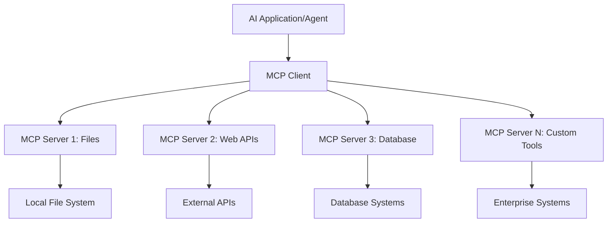

**🔧 بنیادی اجزاء:**

| جزو | کردار | مثالیں |
|-----------|------|----------|
| **MCP Hosts** | وہ ایپلیکیشنز جو MCP خدمات استعمال کرتی ہیں | Claude Desktop, VS Code, AI Toolkit |
| **MCP Clients** | پروٹوکول ہینڈلرز (سرورز کے ساتھ 1:1) | ہوسٹ ایپلیکیشنز میں شامل |
| **MCP Servers** | معیاری پروٹوکول کے ذریعے صلاحیتیں فراہم کرتے ہیں | Playwright, Files, Azure, GitHub |
| **Transport Layer** | مواصلاتی طریقے | stdio, HTTP, WebSockets |

## 🏢 Microsoft کا MCP سرور ماحولیاتی نظام

Microsoft MCP ماحولیاتی نظام کی قیادت کرتا ہے، جس میں کاروباری ضروریات کو پورا کرنے والے انٹرپرائز گریڈ سرورز کا جامع مجموعہ شامل ہے۔

### 🌟 نمایاں Microsoft MCP سرورز

#### 1. ☁️ Azure MCP Server  
**🔗 ریپوزیٹری**: [azure/azure-mcp](https://github.com/azure/azure-mcp)  
**🎯 مقصد**: AI انضمام کے ساتھ Azure وسائل کا مکمل انتظام

**✨ اہم خصوصیات:**  
- وضاحتی انفراسٹرکچر پروویژننگ  
- حقیقی وقت میں وسائل کی نگرانی  
- لاگت کی بہتری کی سفارشات  
- سیکیورٹی کمپلائنس کی جانچ

**🚀 استعمال کے کیسز:**  
- AI معاونت کے ساتھ Infrastructure-as-Code  
- خودکار وسائل کی اسکیلنگ  
- کلاؤڈ لاگت کی بہتری  
- DevOps ورک فلو کی خودکاری

#### 2. 📊 Microsoft Dataverse MCP  
**📚 دستاویزات**: [Microsoft Dataverse Integration](https://go.microsoft.com/fwlink/?linkid=2320176)  
**🎯 مقصد**: کاروباری ڈیٹا کے لیے قدرتی زبان کا انٹرفیس

**✨ اہم خصوصیات:**  
- قدرتی زبان میں ڈیٹا بیس سوالات  
- کاروباری سیاق و سباق کی سمجھ  
- حسب ضرورت پرامپٹ ٹیمپلیٹس  
- انٹرپرائز ڈیٹا گورننس

**🚀 استعمال کے کیسز:**  
- کاروباری ذہانت کی رپورٹنگ  
- صارف کے ڈیٹا کا تجزیہ  
- سیلز پائپ لائن کی بصیرت  
- کمپلائنس ڈیٹا سوالات

#### 3. 🌐 Playwright MCP Server  
**🔗 ریپوزیٹری**: [microsoft/playwright-mcp](https://github.com/microsoft/playwright-mcp)  
**🎯 مقصد**: براؤزر آٹومیشن اور ویب تعامل کی صلاحیتیں

**✨ اہم خصوصیات:**  
- کراس براؤزر آٹومیشن (Chrome, Firefox, Safari)  
- ذہین عنصر کی شناخت  
- اسکرین شاٹ اور PDF جنریشن  
- نیٹ ورک ٹریفک کی نگرانی

**🚀 استعمال کے کیسز:**  
- خودکار ٹیسٹنگ ورک فلو  
- ویب اسکریپنگ اور ڈیٹا نکالنا  
- UI/UX کی نگرانی  
- مقابلتی تجزیہ کی خودکاری

#### 4. 📁 Files MCP Server  
**🔗 ریپوزیٹری**: [microsoft/files-mcp-server](https://github.com/microsoft/files-mcp-server)  
**🎯 مقصد**: ذہین فائل سسٹم آپریشنز

**✨ اہم خصوصیات:**  
- وضاحتی فائل مینجمنٹ  
- مواد کی ہم آہنگی  
- ورژن کنٹرول انضمام  
- میٹا ڈیٹا نکالنا

**🚀 استعمال کے کیسز:**  
- دستاویزات کا انتظام  
- کوڈ ریپوزیٹری کی تنظیم  
- مواد کی اشاعت کے ورک فلو  
- ڈیٹا پائپ لائن فائل ہینڈلنگ

#### 5. 📝 MarkItDown MCP Server  
**🔗 ریپوزیٹری**: [microsoft/markitdown](https://github.com/microsoft/markitdown)  
**🎯 مقصد**: جدید Markdown پروسیسنگ اور ترمیم

**✨ اہم خصوصیات:**  
- جامع Markdown پارسنگ  
- فارمیٹ کنورژن (MD ↔ HTML ↔ PDF)  
- مواد کی ساخت کا تجزیہ  
- ٹیمپلیٹ پروسیسنگ

**🚀 استعمال کے کیسز:**  
- تکنیکی دستاویزات کے ورک فلو  
- مواد کے انتظام کے نظام  
- رپورٹ جنریشن  
- نالج بیس کی خودکاری

#### 6. 📈 Clarity MCP Server  
**📦 پیکیج**: [@microsoft/clarity-mcp-server](https://www.npmjs.com/package/@microsoft/clarity-mcp-server)  
**🎯 مقصد**: ویب اینالٹکس اور صارف کے رویے کی بصیرت

**✨ اہم خصوصیات:**  
- ہیٹ میپ ڈیٹا تجزیہ  
- صارف سیشن ریکارڈنگ  
- کارکردگی کے میٹرکس  
- کنورژن فنل تجزیہ

**🚀 استعمال کے کیسز:**  
- ویب سائٹ کی بہتری  
- صارف کے تجربے کی تحقیق  
- A/B ٹیسٹنگ تجزیہ  
- کاروباری ذہانت کے ڈیش بورڈز

### 🌍 کمیونٹی ماحولیاتی نظام

Microsoft کے سرورز کے علاوہ، MCP ماحولیاتی نظام میں شامل ہیں:  
- **🐙 GitHub MCP**: ریپوزیٹری مینجمنٹ اور کوڈ تجزیہ  
- **🗄️ ڈیٹا بیس MCPs**: PostgreSQL, MySQL, MongoDB انٹیگریشنز  
- **☁️ کلاؤڈ پرووائیڈر MCPs**: AWS, GCP, Digital Ocean ٹولز  
- **📧 کمیونیکیشن MCPs**: Slack, Teams, ای میل انٹیگریشنز

## 🛠️ عملی تجربہ: براؤزر آٹومیشن ایجنٹ بنانا

**🎯 پروجیکٹ کا مقصد**: Playwright MCP سرور استعمال کرتے ہوئے ایک ذہین براؤزر آٹومیشن ایجنٹ بنائیں جو ویب سائٹس پر نیویگیٹ کر سکے، معلومات نکال سکے، اور پیچیدہ ویب تعاملات انجام دے سکے۔

### 🚀 مرحلہ 1: ایجنٹ کی بنیاد قائم کرنا

#### قدم 1: اپنا ایجنٹ شروع کریں  
1. **AI Toolkit Agent Builder کھولیں**  
2. **نیا ایجنٹ بنائیں** درج ذیل ترتیب کے ساتھ:  
   - **نام**: `BrowserAgent`  
   - **ماڈل**: GPT-4o منتخب کریں  

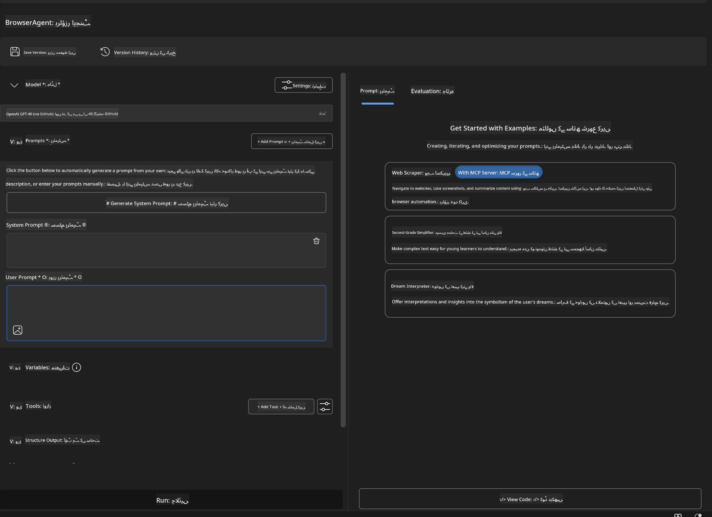

### 🔧 مرحلہ 2: MCP انٹیگریشن ورک فلو

#### قدم 3: MCP سرور انٹیگریشن شامل کریں  
1. **Agent Builder میں Tools سیکشن پر جائیں**  
2. **"Add Tool" پر کلک کریں** تاکہ انٹیگریشن مینو کھلے  
3. **"MCP Server" منتخب کریں** دستیاب اختیارات میں سے  

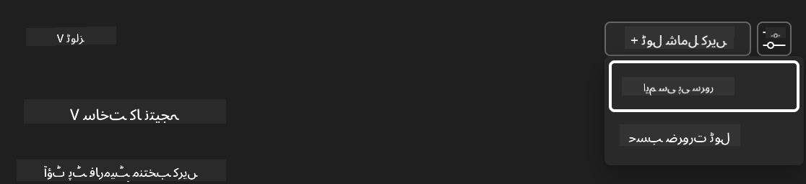

**🔍 ٹول کی اقسام کو سمجھنا:**  
- **Built-in Tools**: پہلے سے ترتیب دی گئی AI Toolkit فنکشنز  
- **MCP Servers**: بیرونی سروس انٹیگریشنز  
- **Custom APIs**: آپ کی اپنی سروس اینڈ پوائنٹس  
- **Function Calling**: ماڈل کے فنکشنز تک براہ راست رسائی

#### قدم 4: MCP سرور کا انتخاب  
1. **"MCP Server" آپشن منتخب کریں**  
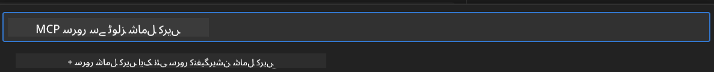

2. **MCP کیٹلاگ براؤز کریں** تاکہ دستیاب انٹیگریشنز دیکھ سکیں  
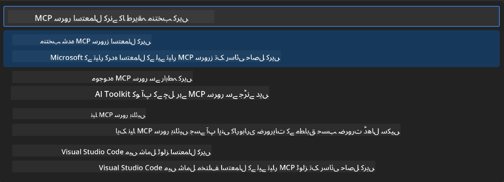

### 🎮 مرحلہ 3: Playwright MCP کی ترتیب

#### قدم 5: Playwright منتخب کریں اور ترتیب دیں  
1. **"Use Featured MCP Servers" پر کلک کریں** تاکہ Microsoft کے تصدیق شدہ سرورز تک رسائی حاصل ہو  
2. **فہرست میں سے "Playwright" منتخب کریں**  
3. **ڈیفالٹ MCP ID قبول کریں** یا اپنی مرضی کے مطابق ترتیب دیں  

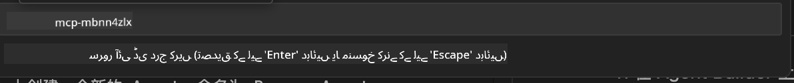

#### قدم 6: Playwright کی صلاحیتیں فعال کریں  
**🔑 اہم قدم**: زیادہ سے زیادہ فعالیت کے لیے **تمام** دستیاب Playwright طریقے منتخب کریں  


**🛠️ ضروری Playwright ٹولز:**  
- **نیویگیشن**: `goto`, `goBack`, `goForward`, `reload`  
- **انٹریکشن**: `click`, `fill`, `press`, `hover`, `drag`  
- **نکالنا**: `textContent`, `innerHTML`, `getAttribute`  
- **تصدیق**: `isVisible`, `isEnabled`, `waitForSelector`  
- **کیپچر**: `screenshot`, `pdf`, `video`  
- **نیٹ ورک**: `setExtraHTTPHeaders`, `route`, `waitForResponse`

#### قدم 7: انٹیگریشن کی کامیابی کی تصدیق کریں  
**✅ کامیابی کے اشارے:**  
- تمام ٹولز Agent Builder کے انٹرفیس میں نظر آئیں  
- انٹیگریشن پینل میں کوئی ایرر میسج نہ ہو  
- Playwright سرور کی حالت "Connected" دکھائے  

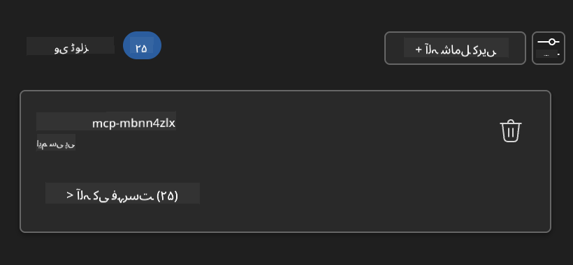

**🔧 عام مسائل اور ان کے حل:**  
- **کنکشن ناکام**: انٹرنیٹ کنکشن اور فائر وال کی ترتیبات چیک کریں  
- **ٹولز غائب ہیں**: یقینی بنائیں کہ تمام صلاحیتیں سیٹ اپ کے دوران منتخب کی گئی ہوں  
- **اجازت کی غلطیاں**: تصدیق کریں کہ VS Code کو ضروری سسٹم اجازتیں حاصل ہیں

### 🎯 مرحلہ 4: اعلیٰ درجے کی پرامپٹ انجینئرنگ

#### قدم 8: ذہین سسٹم پرامپٹس ڈیزائن کریں  
Playwright کی مکمل صلاحیتوں کو استعمال کرنے والے پیچیدہ پرامپٹس بنائیں:  

```markdown
# Web Automation Expert System Prompt

## Core Identity
You are an advanced web automation specialist with deep expertise in browser automation, web scraping, and user experience analysis. You have access to Playwright tools for comprehensive browser control.

## Capabilities & Approach
### Navigation Strategy
- Always start with screenshots to understand page layout
- Use semantic selectors (text content, labels) when possible
- Implement wait strategies for dynamic content
- Handle single-page applications (SPAs) effectively

### Error Handling
- Retry failed operations with exponential backoff
- Provide clear error descriptions and solutions
- Suggest alternative approaches when primary methods fail
- Always capture diagnostic screenshots on errors

### Data Extraction
- Extract structured data in JSON format when possible
- Provide confidence scores for extracted information
- Validate data completeness and accuracy
- Handle pagination and infinite scroll scenarios

### Reporting
- Include step-by-step execution logs
- Provide before/after screenshots for verification
- Suggest optimizations and alternative approaches
- Document any limitations or edge cases encountered

## Ethical Guidelines
- Respect robots.txt and rate limiting
- Avoid overloading target servers
- Only extract publicly available information
- Follow website terms of service
```

#### قدم 9: متحرک یوزر پرامپٹس بنائیں  
ایسے پرامپٹس ڈیزائن کریں جو مختلف صلاحیتوں کا مظاہرہ کریں:  

**🌐 ویب تجزیہ کی مثال:**  
```markdown
Navigate to github.com/kinfey and provide a comprehensive analysis including:
1. Repository structure and organization
2. Recent activity and contribution patterns  
3. Documentation quality assessment
4. Technology stack identification
5. Community engagement metrics
6. Notable projects and their purposes

Include screenshots at key steps and provide actionable insights.
```

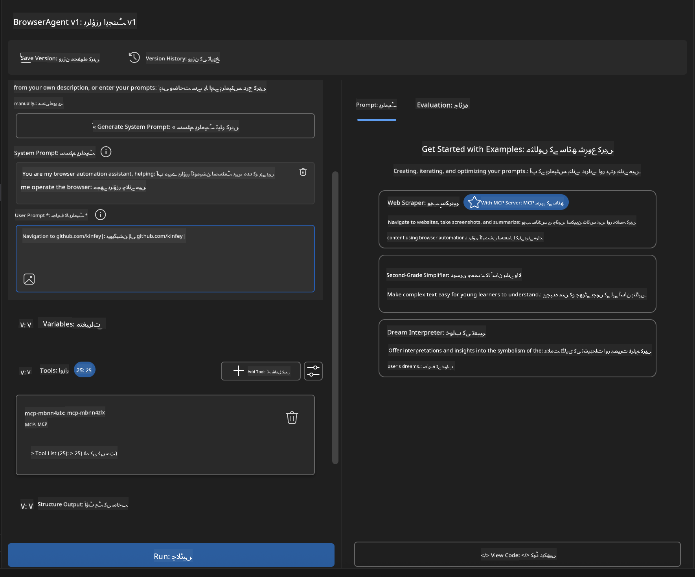

### 🚀 مرحلہ 5: عمل درآمد اور جانچ

#### قدم 10: اپنی پہلی آٹومیشن چلائیں  
1. **"Run" پر کلک کریں** تاکہ آٹومیشن سیکوئنس شروع ہو  
2. **حقیقی وقت میں عمل کی نگرانی کریں**:  
   - Chrome براؤزر خود بخود کھل جائے گا  
   - ایجنٹ ہدف ویب سائٹ پر نیویگیٹ کرے گا  
   - ہر اہم مرحلے کی اسکرین شاٹس لیں گے  
   - تجزیہ کے نتائج حقیقی وقت میں آئیں گے  

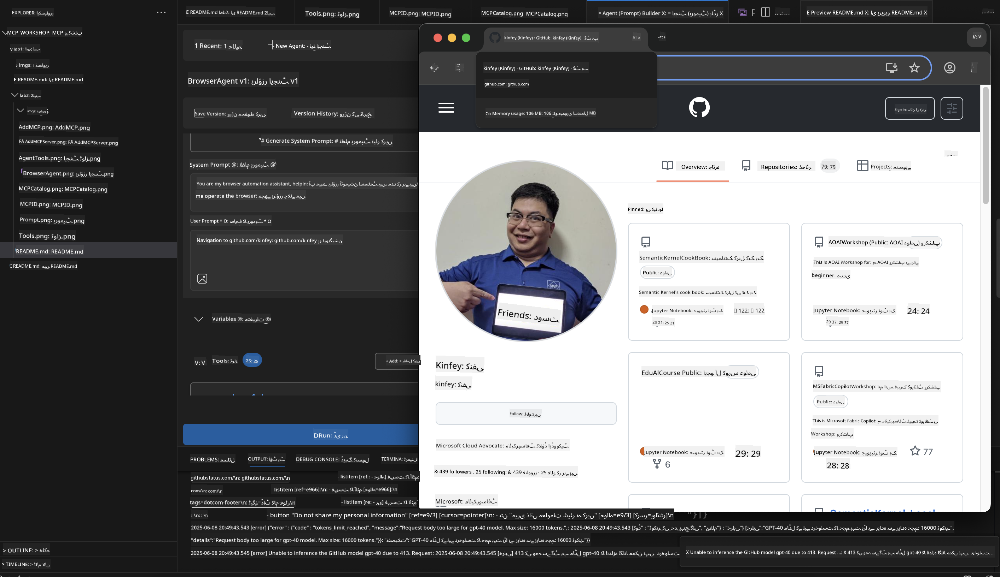

#### قدم 11: نتائج اور بصیرت کا تجزیہ کریں  
Agent Builder کے انٹرفیس میں مکمل تجزیہ کا جائزہ لیں:  

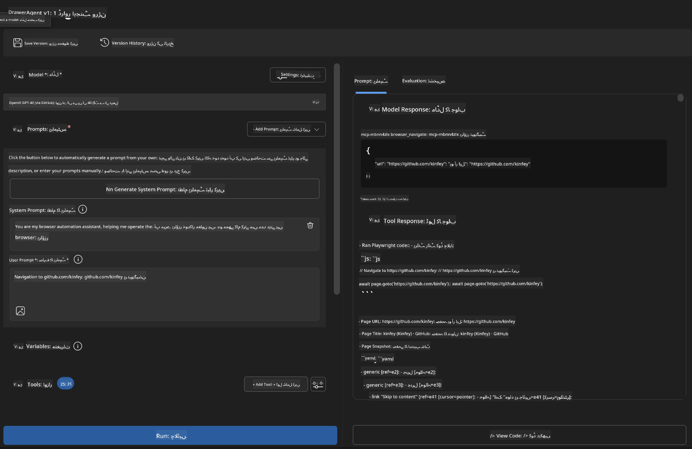

### 🌟 مرحلہ 6: اعلیٰ صلاحیتیں اور تعیناتی

#### قدم 12: برآمد کریں اور پروڈکشن میں تعینات کریں  
Agent Builder متعدد تعیناتی کے اختیارات فراہم کرتا ہے:  

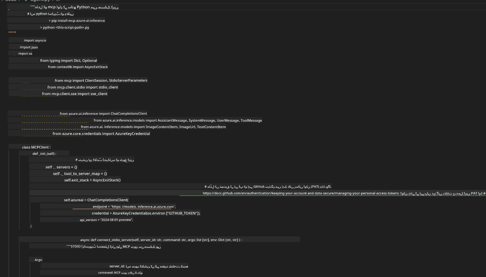

## 🎓 ماڈیول 2 کا خلاصہ اور اگلے اقدامات

### 🏆 کامیابی حاصل کی: MCP انٹیگریشن ماسٹر

**✅ حاصل کردہ مہارتیں:**  
- [ ] MCP کی ساخت اور فوائد کو سمجھنا  
- [ ] Microsoft کے MCP سرور ماحولیاتی نظام میں نیویگیٹ کرنا  
- [ ] Playwright MCP کو AI Toolkit کے ساتھ مربوط کرنا  
- [ ] پیچیدہ براؤزر آٹومیشن ایجنٹس بنانا  
- [ ] ویب آٹومیشن کے لیے اعلیٰ درجے کی پرامپٹ انجینئرنگ

### 📚 اضافی وسائل

- **🔗 MCP وضاحت**: [Official Protocol Documentation](https://modelcontextprotocol.io/)  
- **🛠️ Playwright API**: [Complete Method Reference](https://playwright.dev/docs/api/class-playwright)  
- **🏢 Microsoft MCP سرورز**: [Enterprise Integration Guide](https://github.com/microsoft/mcp-servers)  
- **🌍 کمیونٹی مثالیں**: [MCP Server Gallery](https://github.com/modelcontextprotocol/servers)

**🎉 مبارک ہو!** آپ نے کامیابی سے MCP انٹیگریشن سیکھ لی ہے اور اب آپ پروڈکشن کے لیے تیار AI ایجنٹس بنا سکتے ہیں جو بیرونی ٹولز کی صلاحیت رکھتے ہیں!

### 🔜 اگلے ماڈیول کی طرف بڑھیں

کیا آپ اپنی MCP مہارتوں کو اگلے درجے پر لے جانا چاہتے ہیں؟ آگے بڑھیں **[Module 3: Advanced MCP Development with AI Toolkit](../lab3/README.md)** جہاں آپ سیکھیں گے کہ:  
- اپنے خود کے کسٹم MCP سرورز بنائیں  
- جدید MCP Python SDK کو ترتیب دیں اور استعمال کریں  
- MCP Inspector کو ڈیبگنگ کے لیے سیٹ اپ کریں  
- اعلیٰ درجے کے MCP سرور ڈیولپمنٹ ورک فلو میں مہارت حاصل کریں
- ایک Weather MCP سرور کو شروع سے بنائیں

**دستخطی نوٹ**:  
یہ دستاویز AI ترجمہ سروس [Co-op Translator](https://github.com/Azure/co-op-translator) کے ذریعے ترجمہ کی گئی ہے۔ اگرچہ ہم درستگی کے لیے کوشاں ہیں، براہ کرم اس بات سے آگاہ رہیں کہ خودکار ترجمے میں غلطیاں یا عدم درستیاں ہو سکتی ہیں۔ اصل دستاویز اپنی مادری زبان میں ہی معتبر ماخذ سمجھی جانی چاہیے۔ اہم معلومات کے لیے پیشہ ور انسانی ترجمہ کی سفارش کی جاتی ہے۔ اس ترجمے کے استعمال سے پیدا ہونے والی کسی بھی غلط فہمی یا غلط تشریح کی ذمہ داری ہم پر عائد نہیں ہوتی۔