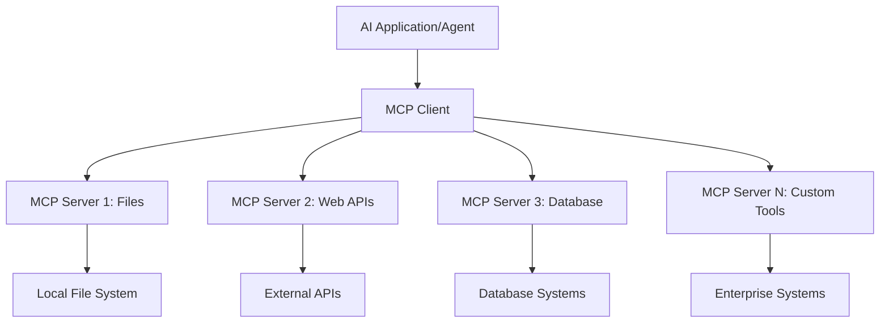

<!--
CO_OP_TRANSLATOR_METADATA:
{
  "original_hash": "a22b7dd11cd7690f99f9195877cafdc3",
  "translation_date": "2025-06-10T05:38:05+00:00",
  "source_file": "10-StreamliningAIWorkflowsBuildingAnMCPServerWithAIToolkit/lab2/README.md",
  "language_code": "ur"
}
-->
# 🌐 ماڈیول 2: MCP کے ساتھ AI Toolkit کی بنیادی باتیں

[]()
[]()
[]()

## 📋 سیکھنے کے مقاصد

اس ماڈیول کے اختتام تک، آپ قادر ہوں گے:
- ✅ Model Context Protocol (MCP) کی ساخت اور فوائد کو سمجھنا
- ✅ Microsoft کے MCP سرور کے ماحولیاتی نظام کو دریافت کرنا
- ✅ MCP سرورز کو AI Toolkit Agent Builder کے ساتھ مربوط کرنا
- ✅ Playwright MCP استعمال کرتے ہوئے ایک فعال براؤزر آٹومیشن ایجنٹ بنانا
- ✅ اپنے ایجنٹس میں MCP ٹولز کو ترتیب دینا اور ٹیسٹ کرنا
- ✅ MCP سے چلنے والے ایجنٹس کو برآمد اور پروڈکشن میں تعینات کرنا

## 🎯 ماڈیول 1 پر تعمیر

ماڈیول 1 میں، ہم نے AI Toolkit کی بنیادی باتیں سیکھی اور اپنا پہلا Python ایجنٹ بنایا۔ اب ہم آپ کے ایجنٹس کو **مزید طاقتور** بنائیں گے تاکہ وہ جدید **Model Context Protocol (MCP)** کے ذریعے بیرونی ٹولز اور خدمات سے جڑ سکیں۔

اسے ایک بنیادی کیلکولیٹر سے مکمل کمپیوٹر میں اپ گریڈ کرنے کے مترادف سمجھیں - آپ کے AI ایجنٹس کو یہ صلاحیت ملے گی کہ وہ:
- 🌐 ویب سائٹس کو براؤز اور ان کے ساتھ تعامل کریں
- 📁 فائلوں تک رسائی اور ان میں ترمیم کریں
- 🔧 انٹرپرائز سسٹمز کے ساتھ انٹیگریٹ ہوں
- 📊 APIs سے حقیقی وقت کا ڈیٹا پروسیس کریں

## 🧠 Model Context Protocol (MCP) کو سمجھنا

### 🔍 MCP کیا ہے؟

Model Context Protocol (MCP) AI ایپلیکیشنز کے لیے **"USB-C"** ہے — ایک انقلابی اوپن اسٹینڈرڈ جو بڑے زبان ماڈلز (LLMs) کو بیرونی ٹولز، ڈیٹا سورسز، اور خدمات سے جوڑتا ہے۔ جیسے USB-C نے کیبل کی الجھن ختم کی، MCP AI انٹیگریشن کی پیچیدگی کو ایک معیاری پروٹوکول کے ذریعے ختم کرتا ہے۔

### 🎯 MCP کا حل کردہ مسئلہ

**MCP سے پہلے:**
- 🔧 ہر ٹول کے لیے کسٹم انٹیگریشنز
- 🔄 وینڈر لاک ان اور مخصوص حل
- 🔒 غیر منظم کنکشنز سے سیکیورٹی کے خطرات
- ⏱️ بنیادی انٹیگریشنز میں مہینوں کی ترقی

**MCP کے ساتھ:**
- ⚡ پلگ اینڈ پلے ٹول انٹیگریشن
- 🔄 وینڈر غیر جانبدار آرکیٹیکچر
- 🛡️ بلٹ ان سیکیورٹی بہترین طریقے
- 🚀 نئی صلاحیتیں چند منٹوں میں شامل کرنا

### 🏗️ MCP آرکیٹیکچر کی تفصیل

MCP ایک **کلائنٹ-سرور آرکیٹیکچر** پر مبنی ہے جو ایک محفوظ اور قابل توسیع ماحولیاتی نظام بناتا ہے:



**🔧 بنیادی اجزاء:**

| جزو | کردار | مثالیں |
|-----------|------|----------|
| **MCP Hosts** | وہ ایپلیکیشنز جو MCP خدمات استعمال کرتی ہیں | Claude Desktop, VS Code, AI Toolkit |
| **MCP Clients** | پروٹوکول ہینڈلرز (سرورز کے ساتھ 1:1) | ہوسٹ ایپلیکیشنز میں شامل |
| **MCP Servers** | معیاری پروٹوکول کے ذریعے صلاحیتیں فراہم کرتے ہیں | Playwright, Files, Azure, GitHub |
| **Transport Layer** | مواصلاتی طریقے | stdio, HTTP, WebSockets |


## 🏢 Microsoft کا MCP سرور ماحولیاتی نظام

Microsoft MCP ماحولیاتی نظام کی قیادت کرتا ہے، ایک مکمل انٹرپرائز گریڈ سرورز کے سوٹ کے ساتھ جو حقیقی کاروباری ضروریات کو پورا کرتے ہیں۔

### 🌟 نمایاں Microsoft MCP سرورز

#### 1. ☁️ Azure MCP Server
**🔗 Repository**: [azure/azure-mcp](https://github.com/azure/azure-mcp)
**🎯 مقصد**: AI انٹیگریشن کے ساتھ Azure وسائل کا مکمل انتظام

**✨ کلیدی خصوصیات:**
- بیان کردہ انفراسٹرکچر پروویژننگ
- حقیقی وقت میں وسائل کی نگرانی
- لاگت کی اصلاح کی سفارشات
- سیکیورٹی تعمیل کی جانچ

**🚀 استعمال کے کیسز:**
- AI مدد کے ساتھ Infrastructure-as-Code
- خودکار وسائل کی اسکیلنگ
- کلاؤڈ لاگت کی اصلاح
- DevOps ورک فلو کی خودکاری

#### 2. 📊 Microsoft Dataverse MCP
**📚 Documentation**: [Microsoft Dataverse Integration](https://go.microsoft.com/fwlink/?linkid=2320176)
**🎯 مقصد**: کاروباری ڈیٹا کے لیے قدرتی زبان کا انٹرفیس

**✨ کلیدی خصوصیات:**
- قدرتی زبان میں ڈیٹا بیس سوالات
- کاروباری سیاق و سباق کی سمجھ
- کسٹم پرامپٹ ٹیمپلیٹس
- انٹرپرائز ڈیٹا گورننس

**🚀 استعمال کے کیسز:**
- کاروباری ذہانت کی رپورٹنگ
- کسٹمر ڈیٹا کا تجزیہ
- سیلز پائپ لائن کی بصیرت
- تعمیل کے ڈیٹا سوالات

#### 3. 🌐 Playwright MCP Server
**🔗 Repository**: [microsoft/playwright-mcp](https://github.com/microsoft/playwright-mcp)
**🎯 مقصد**: براؤزر آٹومیشن اور ویب تعامل کی صلاحیتیں

**✨ کلیدی خصوصیات:**
- کراس براؤزر آٹومیشن (Chrome, Firefox, Safari)
- ذہین ایلیمنٹ کی شناخت
- اسکرین شاٹ اور PDF جنریشن
- نیٹ ورک ٹریفک کی نگرانی

**🚀 استعمال کے کیسز:**
- خودکار ٹیسٹنگ ورک فلو
- ویب سکریپنگ اور ڈیٹا نکالنا
- UI/UX مانیٹرنگ
- مقابلتی تجزیہ کی خودکاری

#### 4. 📁 Files MCP Server
**🔗 Repository**: [microsoft/files-mcp-server](https://github.com/microsoft/files-mcp-server)
**🎯 مقصد**: ذہین فائل سسٹم آپریشنز

**✨ کلیدی خصوصیات:**
- بیان کردہ فائل مینجمنٹ
- مواد کی ہم آہنگی
- ورژن کنٹرول انٹیگریشن
- میٹا ڈیٹا نکالنا

**🚀 استعمال کے کیسز:**
- دستاویزات کا انتظام
- کوڈ ریپوزیٹری کی تنظیم
- مواد کی اشاعت کے ورک فلو
- ڈیٹا پائپ لائن فائل ہینڈلنگ

#### 5. 📝 MarkItDown MCP Server
**🔗 Repository**: [microsoft/markitdown](https://github.com/microsoft/markitdown)
**🎯 مقصد**: ایڈوانسڈ Markdown پراسیسنگ اور ترمیم

**✨ کلیدی خصوصیات:**
- جامع Markdown پارسنگ
- فارمیٹ کنورژن (MD ↔ HTML ↔ PDF)
- مواد کی ساخت کا تجزیہ
- ٹیمپلیٹ پراسیسنگ

**🚀 استعمال کے کیسز:**
- تکنیکی دستاویزات کے ورک فلو
- مواد مینجمنٹ سسٹمز
- رپورٹ جنریشن
- نالج بیس کی خودکاری

#### 6. 📈 Clarity MCP Server
**📦 Package**: [@microsoft/clarity-mcp-server](https://www.npmjs.com/package/@microsoft/clarity-mcp-server)
**🎯 مقصد**: ویب اینالٹکس اور صارف کے رویے کی بصیرت

**✨ کلیدی خصوصیات:**
- ہیٹ میپ ڈیٹا تجزیہ
- صارف سیشن ریکارڈنگز
- کارکردگی میٹرکس
- کنورژن فنل تجزیہ

**🚀 استعمال کے کیسز:**
- ویب سائٹ کی اصلاح
- صارف کے تجربے کی تحقیق
- A/B ٹیسٹنگ تجزیہ
- کاروباری ذہانت کے ڈیش بورڈز

### 🌍 کمیونٹی ماحولیاتی نظام

Microsoft کے سرورز کے علاوہ، MCP ماحولیاتی نظام میں شامل ہیں:
- **🐙 GitHub MCP**: ریپوزیٹری مینجمنٹ اور کوڈ تجزیہ
- **🗄️ Database MCPs**: PostgreSQL, MySQL, MongoDB انٹیگریشنز
- **☁️ Cloud Provider MCPs**: AWS, GCP, Digital Ocean ٹولز
- **📧 Communication MCPs**: Slack, Teams, Email انٹیگریشنز

## 🛠️ عملی تجربہ: براؤزر آٹومیشن ایجنٹ بنانا

**🎯 پروجیکٹ کا مقصد**: Playwright MCP سرور استعمال کرتے ہوئے ایک ذہین براؤزر آٹومیشن ایجنٹ بنائیں جو ویب سائٹس پر نیویگیٹ کرے، معلومات نکالے، اور پیچیدہ ویب تعاملات انجام دے۔

### 🚀 مرحلہ 1: ایجنٹ کی بنیاد قائم کرنا

#### قدم 1: اپنا ایجنٹ شروع کریں
1. **AI Toolkit Agent Builder کھولیں**
2. **نیا ایجنٹ بنائیں** درج ذیل ترتیب کے ساتھ:
   - **نام**: `BrowserAgent`
   - **Model**: Choose GPT-4o 


### 🔧 Phase 2: MCP Integration Workflow

#### Step 3: Add MCP Server Integration
1. **Navigate to Tools Section** in Agent Builder
2. **Click "Add Tool"** to open the integration menu
3. **Select "MCP Server"** from available options


**🔍 Understanding Tool Types:**
- **Built-in Tools**: Pre-configured AI Toolkit functions
- **MCP Servers**: External service integrations
- **Custom APIs**: Your own service endpoints
- **Function Calling**: Direct model function access

#### Step 4: MCP Server Selection
1. **Choose "MCP Server"** option to proceed


2. **Browse MCP Catalog** to explore available integrations


### 🎮 Phase 3: Playwright MCP Configuration

#### Step 5: Select and Configure Playwright
1. **Click "Use Featured MCP Servers"** to access Microsoft's verified servers
2. **Select "Playwright"** from the featured list
3. **Accept Default MCP ID** or customize for your environment


#### Step 6: Enable Playwright Capabilities
**🔑 Critical Step**: Select **ALL** available Playwright methods for maximum functionality


**🛠️ Essential Playwright Tools:**
- **Navigation**: `goto`, `goBack`, `goForward`, `reload`
- **Interaction**: `click`, `fill`, `press`, `hover`, `drag`
- **Extraction**: `textContent`, `innerHTML`, `getAttribute`
- **Validation**: `isVisible`, `isEnabled`, `waitForSelector`
- **Capture**: `screenshot`, `pdf`, `video`
- **Network**: `setExtraHTTPHeaders`, `route`, `waitForResponse`

#### قدم 7: انٹیگریشن کی کامیابی کی تصدیق کریں
**✅ کامیابی کے اشارے:**
- تمام ٹولز Agent Builder انٹرفیس میں ظاہر ہوں
- انٹیگریشن پینل میں کوئی ایرر میسجز نہ ہوں
- Playwright سرور کی حالت "Connected" دکھائے


**🔧 عام مسائل اور ان کا حل:**
- **کنکشن ناکام**: انٹرنیٹ کنکشن اور فائر وال کی ترتیبات چیک کریں
- **ٹولز غائب ہیں**: یقینی بنائیں کہ سیٹ اپ کے دوران تمام صلاحیتیں منتخب کی گئی ہوں
- **اجازت کی غلطیاں**: تصدیق کریں کہ VS Code کو ضروری سسٹم پرمیشنز حاصل ہیں

### 🎯 مرحلہ 4: ایڈوانسڈ پرامپٹ انجینئرنگ

#### قدم 8: ذہین سسٹم پرامپٹس ڈیزائن کریں
ایسے پیچیدہ پرامپٹس بنائیں جو Playwright کی مکمل صلاحیتوں کا فائدہ اٹھائیں:

```markdown
# Web Automation Expert System Prompt

## Core Identity
You are an advanced web automation specialist with deep expertise in browser automation, web scraping, and user experience analysis. You have access to Playwright tools for comprehensive browser control.

## Capabilities & Approach
### Navigation Strategy
- Always start with screenshots to understand page layout
- Use semantic selectors (text content, labels) when possible
- Implement wait strategies for dynamic content
- Handle single-page applications (SPAs) effectively

### Error Handling
- Retry failed operations with exponential backoff
- Provide clear error descriptions and solutions
- Suggest alternative approaches when primary methods fail
- Always capture diagnostic screenshots on errors

### Data Extraction
- Extract structured data in JSON format when possible
- Provide confidence scores for extracted information
- Validate data completeness and accuracy
- Handle pagination and infinite scroll scenarios

### Reporting
- Include step-by-step execution logs
- Provide before/after screenshots for verification
- Suggest optimizations and alternative approaches
- Document any limitations or edge cases encountered

## Ethical Guidelines
- Respect robots.txt and rate limiting
- Avoid overloading target servers
- Only extract publicly available information
- Follow website terms of service
```

#### قدم 9: متحرک یوزر پرامپٹس بنائیں
ایسے پرامپٹس ڈیزائن کریں جو مختلف صلاحیتوں کو ظاہر کریں:

**🌐 ویب تجزیہ کی مثال:**
```markdown
Navigate to github.com/kinfey and provide a comprehensive analysis including:
1. Repository structure and organization
2. Recent activity and contribution patterns  
3. Documentation quality assessment
4. Technology stack identification
5. Community engagement metrics
6. Notable projects and their purposes

Include screenshots at key steps and provide actionable insights.
```


### 🚀 مرحلہ 5: عمل درآمد اور ٹیسٹنگ

#### قدم 10: اپنی پہلی آٹومیشن چلائیں
1. **"Run" پر کلک کریں** تاکہ آٹومیشن سیکوئنس شروع ہو
2. **حقیقی وقت میں عمل درآمد کی نگرانی کریں**:
   - Chrome براؤزر خود بخود لانچ ہوگا
   - ایجنٹ ہدف ویب سائٹ پر نیویگیٹ کرے گا
   - ہر اہم مرحلے کی اسکرین شاٹس بنیں گی
   - تجزیے کے نتائج حقیقی وقت میں آتے رہیں گے


#### قدم 11: نتائج اور بصیرت کا تجزیہ کریں
Agent Builder کے انٹرفیس میں جامع تجزیہ کا جائزہ لیں:


### 🌟 مرحلہ 6: ایڈوانسڈ صلاحیتیں اور تعیناتی

#### قدم 12: برآمد اور پروڈکشن میں تعیناتی
Agent Builder متعدد تعیناتی کے اختیارات فراہم کرتا ہے:


## 🎓 ماڈیول 2 کا خلاصہ اور اگلے اقدامات

### 🏆 کامیابی حاصل کی: MCP انٹیگریشن ماسٹر

**✅ حاصل کردہ مہارتیں:**
- [ ] MCP آرکیٹیکچر اور فوائد کو سمجھنا
- [ ] Microsoft کے MCP سرور ماحولیاتی نظام میں نیویگیٹ کرنا
- [ ] Playwright MCP کو AI Toolkit کے ساتھ مربوط کرنا
- [ ] پیچیدہ براؤزر آٹومیشن ایجنٹس بنانا
- [ ] ویب آٹومیشن کے لیے ایڈوانسڈ پرامپٹ انجینئرنگ

### 📚 اضافی وسائل

- **🔗 MCP Specification**: [Official Protocol Documentation](https://modelcontextprotocol.io/)
- **🛠️ Playwright API**: [Complete Method Reference](https://playwright.dev/docs/api/class-playwright)
- **🏢 Microsoft MCP Servers**: [Enterprise Integration Guide](https://github.com/microsoft/mcp-servers)
- **🌍 Community Examples**: [MCP Server Gallery](https://github.com/modelcontextprotocol/servers)

**🎉 مبارک ہو!** آپ نے MCP انٹیگریشن میں مہارت حاصل کر لی ہے اور اب آپ بیرونی ٹولز کی صلاحیتوں کے ساتھ پروڈکشن کے لیے تیار AI ایجنٹس بنا سکتے ہیں!

### 🔜 اگلے ماڈیول کی طرف بڑھیں

کیا آپ اپنی MCP مہارت کو اگلے درجے پر لے جانا چاہتے ہیں؟ آگے بڑھیں **[Module 3: Advanced MCP Development with AI Toolkit](../lab3/README.md)** جہاں آپ سیکھیں گے کہ:
- اپنے کسٹم MCP سرورز کیسے بنائیں
- تازہ ترین MCP Python SDK کو ترتیب دیں اور استعمال کریں
- MCP Inspector کو ڈیبگنگ کے لیے سیٹ اپ کریں
- ایڈوانسڈ MCP سرور ڈیولپمنٹ ورک فلو ماسٹر کریں
- Scratch سے Weather MCP Server بنائیں

**ڈسکلیمر**:  
یہ دستاویز AI ترجمہ سروس [Co-op Translator](https://github.com/Azure/co-op-translator) کے ذریعے ترجمہ کی گئی ہے۔ اگرچہ ہم درستگی کی کوشش کرتے ہیں، براہ کرم نوٹ کریں کہ خودکار ترجموں میں غلطیاں یا بے قاعدگیاں ہو سکتی ہیں۔ اصل دستاویز اپنی مادری زبان میں ہی معتبر ذریعہ سمجھی جانی چاہیے۔ اہم معلومات کے لیے پیشہ ورانہ انسانی ترجمہ کی سفارش کی جاتی ہے۔ ہم اس ترجمے کے استعمال سے پیدا ہونے والی کسی بھی غلط فہمی یا غلط تعبیر کے ذمہ دار نہیں ہیں۔