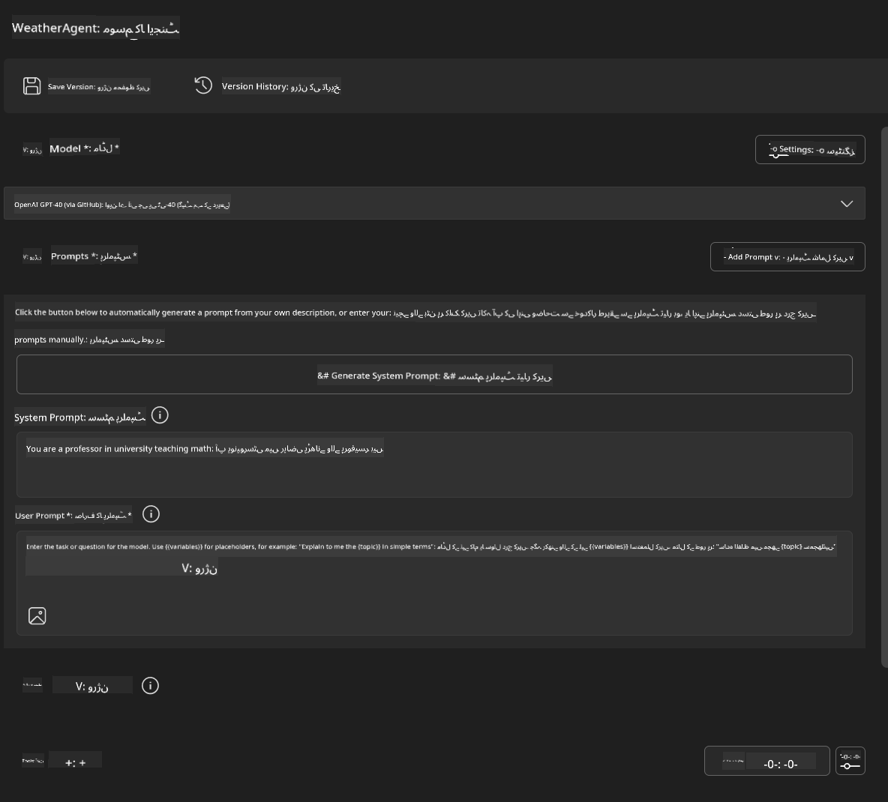
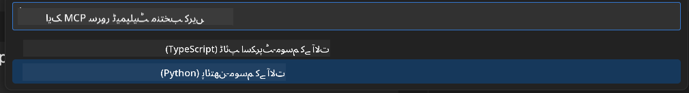
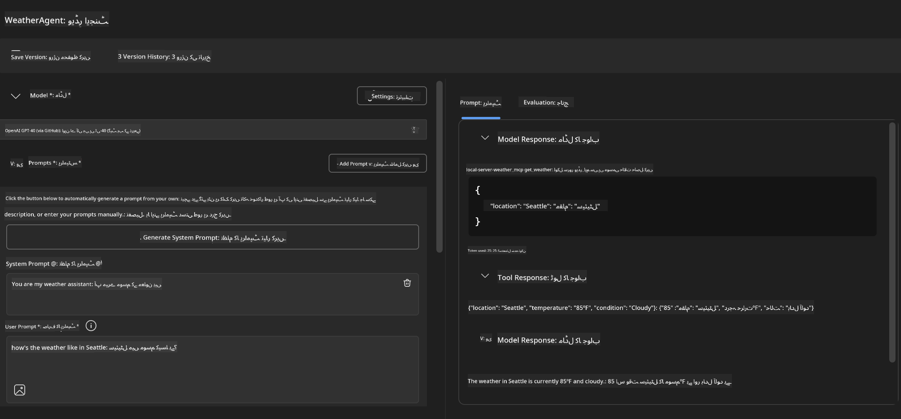
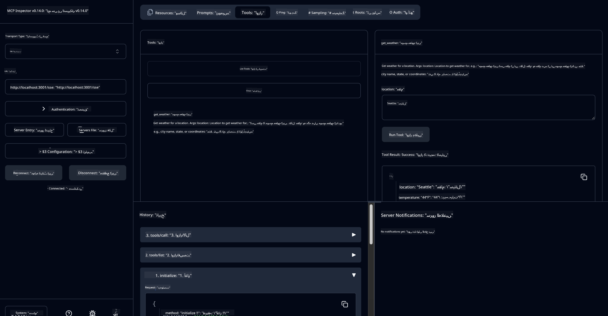

<!--
CO_OP_TRANSLATOR_METADATA:
{
  "original_hash": "dd8da3f75addcef453fe11f02a270217",
  "translation_date": "2025-07-14T08:08:04+00:00",
  "source_file": "10-StreamliningAIWorkflowsBuildingAnMCPServerWithAIToolkit/lab3/README.md",
  "language_code": "ur"
}
-->
# 🔧 ماڈیول 3: AI Toolkit کے ساتھ جدید MCP ڈیولپمنٹ


## 🎯 سیکھنے کے مقاصد

اس لیب کے اختتام تک، آپ قابل ہوں گے:

- ✅ AI Toolkit کا استعمال کرتے ہوئے کسٹم MCP سرورز بنانا
- ✅ جدید MCP Python SDK (v1.9.3) کو ترتیب دینا اور استعمال کرنا
- ✅ MCP Inspector کو ڈیبگنگ کے لیے سیٹ اپ اور استعمال کرنا
- ✅ Agent Builder اور Inspector دونوں ماحول میں MCP سرورز کی ڈیبگنگ کرنا
- ✅ جدید MCP سرور ڈیولپمنٹ کے ورک فلو کو سمجھنا

## 📋 ضروریات

- لیب 2 (MCP Fundamentals) مکمل کرنا
- VS Code میں AI Toolkit ایکسٹینشن انسٹال ہونا
- Python 3.10+ ماحول
- Inspector سیٹ اپ کے لیے Node.js اور npm

## 🏗️ آپ کیا بنائیں گے

اس لیب میں، آپ ایک **Weather MCP Server** بنائیں گے جو درج ذیل چیزوں کی مثال ہوگا:
- کسٹم MCP سرور کی امپلیمنٹیشن
- AI Toolkit Agent Builder کے ساتھ انٹیگریشن
- پروفیشنل ڈیبگنگ ورک فلو
- جدید MCP SDK کے استعمال کے طریقے

---

## 🔧 بنیادی اجزاء کا جائزہ

### 🐍 MCP Python SDK
Model Context Protocol Python SDK کسٹم MCP سرورز بنانے کی بنیاد فراہم کرتا ہے۔ آپ ورژن 1.9.3 استعمال کریں گے جس میں بہتر ڈیبگنگ کی خصوصیات شامل ہیں۔

### 🔍 MCP Inspector
ایک طاقتور ڈیبگنگ ٹول جو فراہم کرتا ہے:
- سرور کی حقیقی وقت مانیٹرنگ
- ٹول کے عمل کی بصری نمائندگی
- نیٹ ورک درخواست/جواب کی جانچ
- انٹرایکٹو ٹیسٹنگ ماحول

---

## 📖 مرحلہ وار عمل درآمد

### مرحلہ 1: Agent Builder میں WeatherAgent بنائیں

1. **VS Code میں AI Toolkit ایکسٹینشن کے ذریعے Agent Builder شروع کریں**
2. **نیا ایجنٹ بنائیں** درج ذیل کنفیگریشن کے ساتھ:
   - ایجنٹ کا نام: `WeatherAgent`



### مرحلہ 2: MCP سرور پروجیکٹ شروع کریں

1. **Agent Builder میں Tools → Add Tool پر جائیں**
2. **"MCP Server" منتخب کریں**
3. **"Create A new MCP Server" منتخب کریں**
4. **`python-weather` ٹیمپلیٹ منتخب کریں**
5. **اپنے سرور کا نام رکھیں:** `weather_mcp`



### مرحلہ 3: پروجیکٹ کھولیں اور جائزہ لیں

1. **پیدا شدہ پروجیکٹ VS Code میں کھولیں**
2. **پروجیکٹ کی ساخت کا جائزہ لیں:**
   ```
   weather_mcp/
   ├── src/
   │   ├── __init__.py
   │   └── server.py
   ├── inspector/
   │   ├── package.json
   │   └── package-lock.json
   ├── .vscode/
   │   ├── launch.json
   │   └── tasks.json
   ├── pyproject.toml
   └── README.md
   ```

### مرحلہ 4: جدید MCP SDK پر اپ گریڈ کریں

> **🔍 اپ گریڈ کیوں؟** ہم جدید MCP SDK (v1.9.3) اور Inspector سروس (0.14.0) استعمال کرنا چاہتے ہیں تاکہ بہتر خصوصیات اور ڈیبگنگ ممکن ہو۔

#### 4a. Python Dependencies اپ ڈیٹ کریں

**`pyproject.toml` میں ترمیم کریں:** [./code/weather_mcp/pyproject.toml](../../../../10-StreamliningAIWorkflowsBuildingAnMCPServerWithAIToolkit/lab3/code/weather_mcp/pyproject.toml)

#### 4b. Inspector کنفیگریشن اپ ڈیٹ کریں

**`inspector/package.json` میں ترمیم کریں:** [./code/weather_mcp/inspector/package.json](../../../../10-StreamliningAIWorkflowsBuildingAnMCPServerWithAIToolkit/lab3/code/weather_mcp/inspector/package.json)

#### 4c. Inspector Dependencies اپ ڈیٹ کریں

**`inspector/package-lock.json` میں ترمیم کریں:** [./code/weather_mcp/inspector/package-lock.json](../../../../10-StreamliningAIWorkflowsBuildingAnMCPServerWithAIToolkit/lab3/code/weather_mcp/inspector/package-lock.json)

> **📝 نوٹ:** یہ فائل وسیع ڈیپینڈنسیز پر مشتمل ہے۔ نیچے بنیادی ساخت دی گئی ہے - مکمل مواد مناسب ڈیپینڈنسی ریزولوشن کو یقینی بناتا ہے۔

> **⚡ مکمل پیکیج لاک:** مکمل package-lock.json میں تقریباً 3000 لائنز کی ڈیپینڈنسیز شامل ہیں۔ اوپر کی ساخت کلیدی ہے - مکمل ریزولوشن کے لیے فراہم کردہ فائل استعمال کریں۔

### مرحلہ 5: VS Code ڈیبگنگ کنفیگریشن کریں

*نوٹ: براہ کرم مخصوص راستے میں فائل کو کاپی کر کے متعلقہ لوکل فائل کی جگہ رکھیں*

#### 5a. لانچ کنفیگریشن اپ ڈیٹ کریں

**`.vscode/launch.json` میں ترمیم کریں:**

```json
{
  "version": "0.2.0",
  "configurations": [
    {
      "name": "Attach to Local MCP",
      "type": "debugpy",
      "request": "attach",
      "connect": {
        "host": "localhost",
        "port": 5678
      },
      "presentation": {
        "hidden": true
      },
      "internalConsoleOptions": "neverOpen",
      "postDebugTask": "Terminate All Tasks"
    },
    {
      "name": "Launch Inspector (Edge)",
      "type": "msedge",
      "request": "launch",
      "url": "http://localhost:6274?timeout=60000&serverUrl=http://localhost:3001/sse#tools",
      "cascadeTerminateToConfigurations": [
        "Attach to Local MCP"
      ],
      "presentation": {
        "hidden": true
      },
      "internalConsoleOptions": "neverOpen"
    },
    {
      "name": "Launch Inspector (Chrome)",
      "type": "chrome",
      "request": "launch",
      "url": "http://localhost:6274?timeout=60000&serverUrl=http://localhost:3001/sse#tools",
      "cascadeTerminateToConfigurations": [
        "Attach to Local MCP"
      ],
      "presentation": {
        "hidden": true
      },
      "internalConsoleOptions": "neverOpen"
    }
  ],
  "compounds": [
    {
      "name": "Debug in Agent Builder",
      "configurations": [
        "Attach to Local MCP"
      ],
      "preLaunchTask": "Open Agent Builder",
    },
    {
      "name": "Debug in Inspector (Edge)",
      "configurations": [
        "Launch Inspector (Edge)",
        "Attach to Local MCP"
      ],
      "preLaunchTask": "Start MCP Inspector",
      "stopAll": true
    },
    {
      "name": "Debug in Inspector (Chrome)",
      "configurations": [
        "Launch Inspector (Chrome)",
        "Attach to Local MCP"
      ],
      "preLaunchTask": "Start MCP Inspector",
      "stopAll": true
    }
  ]
}
```

**`.vscode/tasks.json` میں ترمیم کریں:**

```
{
  "version": "2.0.0",
  "tasks": [
    {
      "label": "Start MCP Server",
      "type": "shell",
      "command": "python -m debugpy --listen 127.0.0.1:5678 src/__init__.py sse",
      "isBackground": true,
      "options": {
        "cwd": "${workspaceFolder}",
        "env": {
          "PORT": "3001"
        }
      },
      "problemMatcher": {
        "pattern": [
          {
            "regexp": "^.*$",
            "file": 0,
            "location": 1,
            "message": 2
          }
        ],
        "background": {
          "activeOnStart": true,
          "beginsPattern": ".*",
          "endsPattern": "Application startup complete|running"
        }
      }
    },
    {
      "label": "Start MCP Inspector",
      "type": "shell",
      "command": "npm run dev:inspector",
      "isBackground": true,
      "options": {
        "cwd": "${workspaceFolder}/inspector",
        "env": {
          "CLIENT_PORT": "6274",
          "SERVER_PORT": "6277",
        }
      },
      "problemMatcher": {
        "pattern": [
          {
            "regexp": "^.*$",
            "file": 0,
            "location": 1,
            "message": 2
          }
        ],
        "background": {
          "activeOnStart": true,
          "beginsPattern": "Starting MCP inspector",
          "endsPattern": "Proxy server listening on port"
        }
      },
      "dependsOn": [
        "Start MCP Server"
      ]
    },
    {
      "label": "Open Agent Builder",
      "type": "shell",
      "command": "echo ${input:openAgentBuilder}",
      "presentation": {
        "reveal": "never"
      },
      "dependsOn": [
        "Start MCP Server"
      ],
    },
    {
      "label": "Terminate All Tasks",
      "command": "echo ${input:terminate}",
      "type": "shell",
      "problemMatcher": []
    }
  ],
  "inputs": [
    {
      "id": "openAgentBuilder",
      "type": "command",
      "command": "ai-mlstudio.agentBuilder",
      "args": {
        "initialMCPs": [ "local-server-weather_mcp" ],
        "triggeredFrom": "vsc-tasks"
      }
    },
    {
      "id": "terminate",
      "type": "command",
      "command": "workbench.action.tasks.terminate",
      "args": "terminateAll"
    }
  ]
}
```

---

## 🚀 اپنے MCP سرور کو چلائیں اور ٹیسٹ کریں

### مرحلہ 6: Dependencies انسٹال کریں

کنفیگریشن میں تبدیلیوں کے بعد، درج ذیل کمانڈز چلائیں:

**Python dependencies انسٹال کریں:**
```bash
uv sync
```

**Inspector dependencies انسٹال کریں:**
```bash
cd inspector
npm install
```

### مرحلہ 7: Agent Builder کے ساتھ ڈیبگ کریں

1. **F5 دبائیں** یا **"Debug in Agent Builder"** کنفیگریشن استعمال کریں
2. **ڈیبگ پینل سے کمپاؤنڈ کنفیگریشن منتخب کریں**
3. **سرور کے شروع ہونے اور Agent Builder کے کھلنے کا انتظار کریں**
4. **اپنے weather MCP سرور کو قدرتی زبان کے سوالات کے ساتھ ٹیسٹ کریں**

اس طرح کا ان پٹ دیں

SYSTEM_PROMPT

```
You are my weather assistant
```

USER_PROMPT

```
How's the weather like in Seattle
```



### مرحلہ 8: MCP Inspector کے ساتھ ڈیبگ کریں

1. **"Debug in Inspector"** کنفیگریشن استعمال کریں (Edge یا Chrome)
2. **Inspector انٹرفیس کھولیں** `http://localhost:6274` پر
3. **انٹرایکٹو ٹیسٹنگ ماحول کو دریافت کریں:**
   - دستیاب ٹولز دیکھیں
   - ٹول کے عمل کو ٹیسٹ کریں
   - نیٹ ورک درخواستوں کی نگرانی کریں
   - سرور کے جوابات کی ڈیبگنگ کریں



---

## 🎯 اہم سیکھنے کے نتائج

اس لیب کو مکمل کر کے، آپ نے:

- [x] **AI Toolkit ٹیمپلیٹس کا استعمال کرتے ہوئے کسٹم MCP سرور بنایا**
- [x] **جدید MCP SDK (v1.9.3) پر اپ گریڈ کیا تاکہ بہتر فعالیت حاصل ہو**
- [x] **Agent Builder اور Inspector دونوں کے لیے پروفیشنل ڈیبگنگ ورک فلو ترتیب دیا**
- [x] **MCP Inspector کو انٹرایکٹو سرور ٹیسٹنگ کے لیے سیٹ اپ کیا**
- [x] **MCP ڈیولپمنٹ کے لیے VS Code ڈیبگنگ کنفیگریشنز میں مہارت حاصل کی**

## 🔧 دریافت شدہ جدید خصوصیات

| خصوصیت | وضاحت | استعمال کا موقع |
|---------|-------------|----------|
| **MCP Python SDK v1.9.3** | جدید پروٹوکول امپلیمنٹیشن | جدید سرور ڈیولپمنٹ |
| **MCP Inspector 0.14.0** | انٹرایکٹو ڈیبگنگ ٹول | حقیقی وقت سرور ٹیسٹنگ |
| **VS Code Debugging** | مربوط ڈیولپمنٹ ماحول | پروفیشنل ڈیبگنگ ورک فلو |
| **Agent Builder Integration** | AI Toolkit سے براہ راست کنکشن | مکمل ایجنٹ ٹیسٹنگ |

## 📚 اضافی وسائل

- [MCP Python SDK Documentation](https://modelcontextprotocol.io/docs/sdk/python)
- [AI Toolkit Extension Guide](https://code.visualstudio.com/docs/ai/ai-toolkit)
- [VS Code Debugging Documentation](https://code.visualstudio.com/docs/editor/debugging)
- [Model Context Protocol Specification](https://modelcontextprotocol.io/docs/concepts/architecture)

---

**🎉 مبارک ہو!** آپ نے کامیابی سے لیب 3 مکمل کر لی ہے اور اب آپ پروفیشنل ڈیولپمنٹ ورک فلو کے ذریعے کسٹم MCP سرورز بنا، ڈیبگ اور ڈیپلائے کر سکتے ہیں۔

### 🔜 اگلے ماڈیول کی طرف بڑھیں

کیا آپ اپنے MCP ہنر کو حقیقی دنیا کے ڈیولپمنٹ ورک فلو میں استعمال کرنے کے لیے تیار ہیں؟ آگے بڑھیں **[ماڈیول 4: عملی MCP ڈیولپمنٹ - کسٹم GitHub Clone سرور](../lab4/README.md)** جہاں آپ:
- ایک پروڈکشن کے قابل MCP سرور بنائیں گے جو GitHub ریپوزیٹری آپریشنز کو خودکار بنائے گا
- MCP کے ذریعے GitHub ریپوزیٹری کلوننگ کی فعالیت نافذ کریں گے
- VS Code اور GitHub Copilot Agent Mode کے ساتھ کسٹم MCP سرورز کو انٹیگریٹ کریں گے
- پروڈکشن ماحول میں کسٹم MCP سرورز کی ٹیسٹنگ اور ڈیپلائمنٹ کریں گے
- ڈیولپرز کے لیے عملی ورک فلو آٹومیشن سیکھیں گے

**دستخطی نوٹ**:  
یہ دستاویز AI ترجمہ سروس [Co-op Translator](https://github.com/Azure/co-op-translator) کے ذریعے ترجمہ کی گئی ہے۔ اگرچہ ہم درستگی کے لیے کوشاں ہیں، براہ کرم آگاہ رہیں کہ خودکار ترجمے میں غلطیاں یا عدم درستیاں ہو سکتی ہیں۔ اصل دستاویز اپنی مادری زبان میں ہی معتبر ماخذ سمجھی جانی چاہیے۔ اہم معلومات کے لیے پیشہ ور انسانی ترجمہ کی سفارش کی جاتی ہے۔ اس ترجمے کے استعمال سے پیدا ہونے والی کسی بھی غلط فہمی یا غلط تشریح کی ذمہ داری ہم پر عائد نہیں ہوتی۔