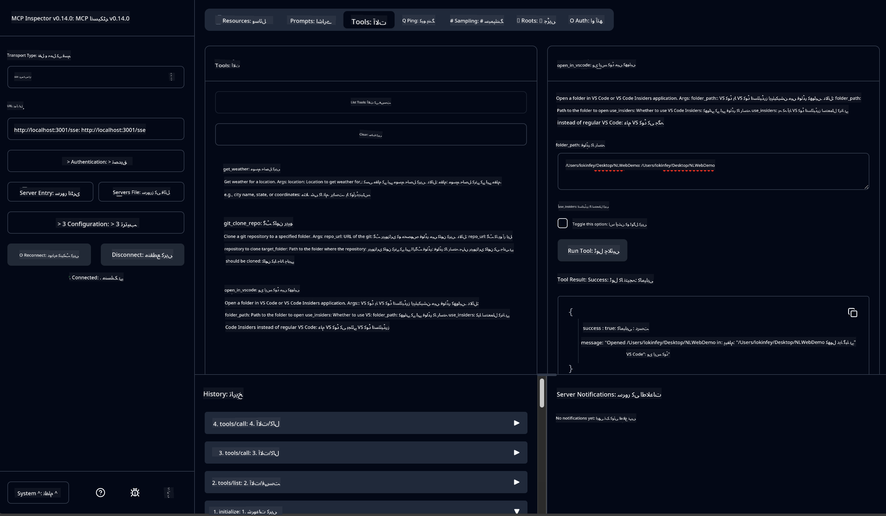

<!--
CO_OP_TRANSLATOR_METADATA:
{
  "original_hash": "f83bc722dc758efffd68667d6a1db470",
  "translation_date": "2025-07-14T08:36:42+00:00",
  "source_file": "10-StreamliningAIWorkflowsBuildingAnMCPServerWithAIToolkit/lab4/README.md",
  "language_code": "ur"
}
-->
# 🐙 ماڈیول 4: عملی MCP ڈیولپمنٹ - کسٹم GitHub کلون سرور


> **⚡ فوری آغاز:** صرف 30 منٹ میں ایک پروڈکشن کے قابل MCP سرور بنائیں جو GitHub ریپوزٹری کلوننگ اور VS Code انٹیگریشن کو خودکار بنائے!

## 🎯 سیکھنے کے مقاصد

اس لیب کے اختتام تک، آپ قابل ہوں گے:

- ✅ حقیقی دنیا کے ڈیولپمنٹ ورک فلو کے لیے کسٹم MCP سرور بنائیں
- ✅ MCP کے ذریعے GitHub ریپوزٹری کلوننگ کی فعالیت نافذ کریں
- ✅ کسٹم MCP سرورز کو VS Code اور Agent Builder کے ساتھ مربوط کریں
- ✅ GitHub Copilot Agent Mode کو کسٹم MCP ٹولز کے ساتھ استعمال کریں
- ✅ پروڈکشن ماحول میں کسٹم MCP سرورز کی جانچ اور تعیناتی کریں

## 📋 ضروریات

- لیب 1-3 مکمل کرنا (MCP کے بنیادی اور اعلیٰ درجے کی ترقی)
- GitHub Copilot سبسکرپشن ([مفت سائن اپ دستیاب](https://github.com/github-copilot/signup))
- VS Code جس میں AI Toolkit اور GitHub Copilot ایکسٹینشنز انسٹال ہوں
- Git CLI انسٹال اور ترتیب دیا ہوا ہو

## 🏗️ پروجیکٹ کا جائزہ

### **حقیقی دنیا کا ڈیولپمنٹ چیلنج**
بطور ڈیولپر، ہم اکثر GitHub سے ریپوزٹریز کلون کرتے ہیں اور انہیں VS Code یا VS Code Insiders میں کھولتے ہیں۔ یہ دستی عمل شامل ہے:
1. ٹرمینل/کمانڈ پرامپٹ کھولنا
2. مطلوبہ ڈائریکٹری میں جانا
3. `git clone` کمانڈ چلانا
4. کلون کی گئی ڈائریکٹری میں VS Code کھولنا

**ہمارا MCP حل اس پورے عمل کو ایک ذہین کمانڈ میں تبدیل کر دیتا ہے!**

### **جو آپ بنائیں گے**
ایک **GitHub Clone MCP Server** (`git_mcp_server`) جو فراہم کرتا ہے:

| خصوصیت | وضاحت | فائدہ |
|---------|-------------|---------|
| 🔄 **سمارٹ ریپوزٹری کلوننگ** | GitHub ریپوز کو ویلیڈیشن کے ساتھ کلون کریں | خودکار ایرر چیکنگ |
| 📁 **ذہین ڈائریکٹری مینجمنٹ** | ڈائریکٹریز کو محفوظ طریقے سے چیک اور بنائیں | اوور رائٹنگ سے بچاؤ |
| 🚀 **کراس-پلیٹ فارم VS Code انٹیگریشن** | پروجیکٹس کو VS Code/Insiders میں کھولیں | بغیر رکاوٹ ورک فلو کی منتقلی |
| 🛡️ **مضبوط ایرر ہینڈلنگ** | نیٹ ورک، پرمیشن، اور پاتھ کے مسائل سنبھالیں | پروڈکشن کے قابل اعتماد |

---

## 📖 مرحلہ وار نفاذ

### مرحلہ 1: Agent Builder میں GitHub Agent بنائیں

1. AI Toolkit ایکسٹینشن کے ذریعے **Agent Builder لانچ کریں**
2. **نیا ایجنٹ بنائیں** درج ذیل کنفیگریشن کے ساتھ:
   ```
   Agent Name: GitHubAgent
   ```

3. **کسٹم MCP سرور شروع کریں:**
   - **Tools** → **Add Tool** → **MCP Server** پر جائیں
   - **"Create A new MCP Server"** منتخب کریں
   - زیادہ سے زیادہ لچک کے لیے **Python template** منتخب کریں
   - **سرور کا نام:** `git_mcp_server`

### مرحلہ 2: GitHub Copilot Agent Mode ترتیب دیں

1. VS Code میں **GitHub Copilot کھولیں** (Ctrl/Cmd + Shift + P → "GitHub Copilot: Open")
2. Copilot انٹرفیس میں **Agent Model منتخب کریں**
3. بہتر استدلال کی صلاحیتوں کے لیے **Claude 3.7 ماڈل منتخب کریں**
4. ٹول تک رسائی کے لیے **MCP انٹیگریشن فعال کریں**

> **💡 پرو ٹپ:** Claude 3.7 ڈیولپمنٹ ورک فلو اور ایرر ہینڈلنگ پیٹرنز کو بہتر سمجھتا ہے۔

### مرحلہ 3: MCP سرور کی بنیادی فعالیت نافذ کریں

**GitHub Copilot Agent Mode کے ساتھ درج ذیل تفصیلی پرامپٹ استعمال کریں:**

```
Create two MCP tools with the following comprehensive requirements:

🔧 TOOL A: clone_repository
Requirements:
- Clone any GitHub repository to a specified local folder
- Return the absolute path of the successfully cloned project
- Implement comprehensive validation:
  ✓ Check if target directory already exists (return error if exists)
  ✓ Validate GitHub URL format (https://github.com/user/repo)
  ✓ Verify git command availability (prompt installation if missing)
  ✓ Handle network connectivity issues
  ✓ Provide clear error messages for all failure scenarios

🚀 TOOL B: open_in_vscode
Requirements:
- Open specified folder in VS Code or VS Code Insiders
- Cross-platform compatibility (Windows/Linux/macOS)
- Use direct application launch (not terminal commands)
- Auto-detect available VS Code installations
- Handle cases where VS Code is not installed
- Provide user-friendly error messages

Additional Requirements:
- Follow MCP 1.9.3 best practices
- Include proper type hints and documentation
- Implement logging for debugging purposes
- Add input validation for all parameters
- Include comprehensive error handling
```

### مرحلہ 4: اپنے MCP سرور کی جانچ کریں

#### 4a. Agent Builder میں جانچ

1. Agent Builder کے لیے **ڈیبگ کنفیگریشن لانچ کریں**
2. اپنے ایجنٹ کو اس سسٹم پرامپٹ کے ساتھ ترتیب دیں:

```
SYSTEM_PROMPT:
You are my intelligent coding repository assistant. You help developers efficiently clone GitHub repositories and set up their development environment. Always provide clear feedback about operations and handle errors gracefully.
```

3. حقیقی صارف کے منظرناموں کے ساتھ جانچ کریں:

```
USER_PROMPT EXAMPLES:

Scenario : Basic Clone and Open
"Clone {Your GitHub Repo link such as https://github.com/kinfey/GHCAgentWorkshop
 } and save to {The global path you specify}, then open it with VS Code Insiders"
```


**متوقع نتائج:**
- ✅ کامیاب کلوننگ اور پاتھ کی تصدیق
- ✅ خودکار VS Code کا آغاز
- ✅ غلط حالات کے لیے واضح ایرر میسجز
- ✅ ایج کیسز کا مناسب ہینڈلنگ

#### 4b. MCP Inspector میں جانچ




---

**🎉 مبارک ہو!** آپ نے کامیابی سے ایک عملی، پروڈکشن کے قابل MCP سرور بنایا ہے جو حقیقی ڈیولپمنٹ ورک فلو کے چیلنجز کو حل کرتا ہے۔ آپ کا کسٹم GitHub کلون سرور MCP کی طاقت کو ظاہر کرتا ہے جو ڈیولپر کی پیداواری صلاحیت کو خودکار اور بہتر بناتا ہے۔

### 🏆 حاصل کردہ کامیابیاں:
- ✅ **MCP ڈیولپر** - کسٹم MCP سرور بنایا
- ✅ **ورک فلو آٹومیٹر** - ڈیولپمنٹ کے عمل کو آسان بنایا  
- ✅ **انٹیگریشن ماہر** - متعدد ڈیولپمنٹ ٹولز کو جوڑا
- ✅ **پروڈکشن کے قابل** - تعیناتی کے قابل حل تیار کیے

---

## 🎓 ورکشاپ مکمل: آپ کا سفر ماڈل کانٹیکسٹ پروٹوکول کے ساتھ

**محترم ورکشاپ شرکاء،**

ماڈل کانٹیکسٹ پروٹوکول ورکشاپ کے تمام چار ماڈیولز مکمل کرنے پر مبارکباد! آپ نے AI Toolkit کے بنیادی تصورات سے شروع کر کے پروڈکشن کے قابل MCP سرورز بنانے تک کا طویل سفر طے کیا ہے جو حقیقی دنیا کے ڈیولپمنٹ چیلنجز کو حل کرتے ہیں۔

### 🚀 آپ کے سیکھنے کا خلاصہ:

**[ماڈیول 1](../lab1/README.md)**: آپ نے AI Toolkit کے بنیادی اصول، ماڈل ٹیسٹنگ، اور اپنا پہلا AI ایجنٹ بنانے کا آغاز کیا۔

**[ماڈیول 2](../lab2/README.md)**: آپ نے MCP آرکیٹیکچر سیکھا، Playwright MCP کو مربوط کیا، اور اپنا پہلا براؤزر آٹومیشن ایجنٹ بنایا۔

**[ماڈیول 3](../lab3/README.md)**: آپ نے کسٹم MCP سرور ڈیولپمنٹ میں مہارت حاصل کی، Weather MCP سرور بنایا اور ڈیبگنگ ٹولز میں مہارت حاصل کی۔

**[ماڈیول 4](../lab4/README.md)**: اب آپ نے سب کچھ لاگو کیا اور ایک عملی GitHub ریپوزٹری ورک فلو آٹومیشن ٹول بنایا۔

### 🌟 آپ نے کیا مہارت حاصل کی:

- ✅ **AI Toolkit ماحولیاتی نظام**: ماڈلز، ایجنٹس، اور انٹیگریشن پیٹرنز
- ✅ **MCP آرکیٹیکچر**: کلائنٹ-سرور ڈیزائن، ٹرانسپورٹ پروٹوکولز، اور سیکیورٹی
- ✅ **ڈیولپر ٹولز**: Playground سے Inspector تک اور پروڈکشن تعیناتی تک
- ✅ **کسٹم ڈیولپمنٹ**: اپنے MCP سرورز بنانا، جانچنا، اور تعینات کرنا
- ✅ **عملی اطلاقات**: AI کے ذریعے حقیقی دنیا کے ورک فلو چیلنجز حل کرنا

### 🔮 آپ کے اگلے اقدامات:

1. **اپنا MCP سرور بنائیں**: اپنی منفرد ورک فلو کو خودکار بنانے کے لیے یہ مہارتیں استعمال کریں
2. **MCP کمیونٹی میں شامل ہوں**: اپنی تخلیقات شیئر کریں اور دوسروں سے سیکھیں
3. **اعلیٰ درجے کی انٹیگریشن دریافت کریں**: MCP سرورز کو انٹرپرائز سسٹمز سے جوڑیں
4. **اوپن سورس میں تعاون کریں**: MCP ٹولنگ اور دستاویزات کو بہتر بنانے میں مدد کریں

یاد رکھیں، یہ ورکشاپ صرف آغاز ہے۔ ماڈل کانٹیکسٹ پروٹوکول کا ماحولیاتی نظام تیزی سے ترقی کر رہا ہے، اور آپ اب AI سے چلنے والے ڈیولپمنٹ ٹولز کے میدان میں سب سے آگے ہیں۔

**آپ کی شرکت اور سیکھنے کے جذبے کا شکریہ!**

ہم امید کرتے ہیں کہ اس ورکشاپ نے آپ کے لیے ایسے خیالات کو جنم دیا ہے جو آپ کے AI ٹولز کے ساتھ کام کرنے کے انداز کو بدل دیں گے۔

**خوش کوڈنگ!**

---

**دستخطی دستبرداری**:  
یہ دستاویز AI ترجمہ سروس [Co-op Translator](https://github.com/Azure/co-op-translator) کے ذریعے ترجمہ کی گئی ہے۔ اگرچہ ہم درستگی کے لیے کوشاں ہیں، براہ کرم آگاہ رہیں کہ خودکار ترجمے میں غلطیاں یا عدم درستیاں ہو سکتی ہیں۔ اصل دستاویز اپنی مادری زبان میں ہی معتبر ماخذ سمجھی جانی چاہیے۔ اہم معلومات کے لیے پیشہ ور انسانی ترجمہ کی سفارش کی جاتی ہے۔ اس ترجمے کے استعمال سے پیدا ہونے والی کسی بھی غلط فہمی یا غلط تشریح کی ذمہ داری ہم پر عائد نہیں ہوتی۔