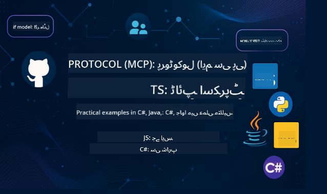

<!--
CO_OP_TRANSLATOR_METADATA:
{
  "original_hash": "db69f754d127d295e6449e29c08ed5c8",
  "translation_date": "2025-09-15T19:47:28+00:00",
  "source_file": "README.md",
  "language_code": "ur"
}
-->

  
  
  

  
  

ان وسائل کو استعمال کرنے کے لیے درج ذیل مراحل پر عمل کریں:  
1. **ریپوزٹری کو فورک کریں**: کلک کریں   
2. **ریپوزٹری کو کلون کریں**: `git clone https://github.com/microsoft/mcp-for-beginners.git`  
3. [**Azure AI Foundry Discord میں شامل ہوں اور ماہرین اور دیگر ڈویلپرز سے ملاقات کریں**](https://discord.com/invite/ByRwuEEgH4)

### 🌐 کثیر زبان کی حمایت

#### GitHub ایکشن کے ذریعے سپورٹ (خودکار اور ہمیشہ اپ ڈیٹ شدہ)

[عربی](../ar/README.md) | [بنگالی](../bn/README.md) | [بلغاریائی](../bg/README.md) | [برمی (میانمار)](../my/README.md) | [چینی (سادہ)](../zh/README.md) | [چینی (روایتی، ہانگ کانگ)](../hk/README.md) | [چینی (روایتی، مکاؤ)](../mo/README.md) | [چینی (روایتی، تائیوان)](../tw/README.md) | [کروشین](../hr/README.md) | [چیک](../cs/README.md) | [ڈینش](../da/README.md) | [ڈچ](../nl/README.md) | [فنش](../fi/README.md) | [فرانسیسی](../fr/README.md) | [جرمن](../de/README.md) | [یونانی](../el/README.md) | [عبرانی](../he/README.md) | [ہندی](../hi/README.md) | [ہنگریائی](../hu/README.md) | [انڈونیشیائی](../id/README.md) | [اطالوی](../it/README.md) | [جاپانی](../ja/README.md) | [کوریائی](../ko/README.md) | [مالے](../ms/README.md) | [مراٹھی](../mr/README.md) | [نیپالی](../ne/README.md) | [نارویجین](../no/README.md) | [فارسی](../fa/README.md) | [پولش](../pl/README.md) | [پرتگالی (برازیل)](../br/README.md) | [پرتگالی (پرتگال)](../pt/README.md) | [پنجابی (گرمکھی)](../pa/README.md) | [رومانیائی](../ro/README.md) | [روسی](../ru/README.md) | [سربیائی (سیریلک)](../sr/README.md) | [سلوواک](../sk/README.md) | [سلووینیائی](../sl/README.md) | [ہسپانوی](../es/README.md) | [سواحلی](../sw/README.md) | [سویڈش](../sv/README.md) | [ٹیگالوگ (فلپائنی)](../tl/README.md) | [تھائی](../th/README.md) | [ترکی](../tr/README.md) | [یوکرینی](../uk/README.md) | [اردو](./README.md) | [ویتنامی](../vi/README.md)

# 🚀 ماڈل کانٹیکسٹ پروٹوکول (MCP) نصاب برائے ابتدائی افراد

## **MCP کو C#, Java, JavaScript, Rust, Python, اور TypeScript میں عملی کوڈ مثالوں کے ساتھ سیکھیں**

## 🧠 ماڈل کانٹیکسٹ پروٹوکول نصاب کا جائزہ

**ماڈل کانٹیکسٹ پروٹوکول (MCP)** ایک جدید فریم ورک ہے جو AI ماڈلز اور کلائنٹ ایپلیکیشنز کے درمیان تعامل کو معیاری بنانے کے لیے ڈیزائن کیا گیا ہے۔ یہ اوپن سورس نصاب ایک منظم سیکھنے کا راستہ فراہم کرتا ہے، جس میں عملی کوڈ مثالیں اور حقیقی دنیا کے استعمال کے کیسز شامل ہیں، مشہور پروگرامنگ زبانوں جیسے C#, Java, JavaScript, TypeScript، اور Python میں۔

چاہے آپ AI ڈویلپر ہوں، سسٹم آرکیٹیکٹ ہوں، یا سافٹ ویئر انجینئر، یہ گائیڈ MCP کی بنیادی باتوں اور نفاذ کی حکمت عملیوں کو سیکھنے کے لیے آپ کا جامع ذریعہ ہے۔

## 🔗 سرکاری MCP وسائل

- 📘 [MCP دستاویزات](https://modelcontextprotocol.io/) – تفصیلی ٹیوٹوریلز اور صارف گائیڈز  
- 📜 [MCP وضاحت](https://modelcontextprotocol.io/docs/) – پروٹوکول کی ساخت اور تکنیکی حوالہ جات  
- 📜 [اصل MCP وضاحت](https://spec.modelcontextprotocol.io/) – پرانے تکنیکی حوالہ جات (اضافی تفصیلات ہو سکتی ہیں)  
- 🧑‍💻 [MCP GitHub ریپوزٹری](https://github.com/modelcontextprotocol) – اوپن سورس SDKs، ٹولز، اور کوڈ نمونے  
- 🌐 [MCP کمیونٹی](https://github.com/orgs/modelcontextprotocol/discussions) – مباحثوں میں شامل ہوں اور کمیونٹی میں تعاون کریں  

## 🧭 MCP نصاب کا جائزہ

### 📚 مکمل نصاب کی ساخت

| ماڈیول | موضوع | تفصیل | لنک |
|--------|-------|-------------|------|
| **ماڈیول 1-3: بنیادی باتیں** | | | |
| 00 | MCP کا تعارف | ماڈل کانٹیکسٹ پروٹوکول اور AI پائپ لائنز میں اس کی اہمیت کا جائزہ | [مزید پڑھیں](./00-Introduction/README.md) |
| 01 | بنیادی تصورات کی وضاحت | MCP کے بنیادی تصورات کی تفصیلی تحقیق | [مزید پڑھیں](./01-CoreConcepts/README.md) |
| 02 | MCP میں سیکیورٹی | سیکیورٹی خطرات اور بہترین طریقے | [مزید پڑھیں](./02-Security/README.md) |
| 03 | MCP کے ساتھ شروعات | ماحول کی ترتیب، بنیادی سرورز/کلائنٹس، انضمام | [مزید پڑھیں](./03-GettingStarted/README.md) |
| **ماڈیول 3: اپنا پہلا سرور اور کلائنٹ بنانا** | | | |
| 3.1 | پہلا سرور | اپنا پہلا MCP سرور بنائیں | [گائیڈ](./03-GettingStarted/01-first-server/README.md) |
| 3.2 | پہلا کلائنٹ | ایک بنیادی MCP کلائنٹ تیار کریں | [گائیڈ](./03-GettingStarted/02-client/README.md) |
| 3.3 | LLM کے ساتھ کلائنٹ | بڑے زبان کے ماڈلز کو شامل کریں | [گائیڈ](./03-GettingStarted/03-llm-client/README.md) |
| 3.4 | VS کوڈ انضمام | MCP سرورز کو VS کوڈ میں استعمال کریں | [گائیڈ](./03-GettingStarted/04-vscode/README.md) |
| 3.5 | stdio سرور | stdio ٹرانسپورٹ کا استعمال کرتے ہوئے سرورز بنائیں | [گائیڈ](./03-GettingStarted/05-stdio-server/README.md) |
| 3.6 | HTTP اسٹریمنگ | MCP میں HTTP اسٹریمنگ کو نافذ کریں | [گائیڈ](./03-GettingStarted/06-http-streaming/README.md) |
| 3.7 | AI ٹول کٹ | MCP کے ساتھ AI ٹول کٹ استعمال کریں | [گائیڈ](./03-GettingStarted/07-aitk/README.md) |
| 3.8 | ٹیسٹنگ | اپنے MCP سرور کے نفاذ کی جانچ کریں | [گائیڈ](./03-GettingStarted/08-testing/README.md) |
| 3.9 | تعیناتی | MCP سرورز کو پروڈکشن میں تعینات کریں | [گائیڈ](./03-GettingStarted/09-deployment/README.md) |
| **ماڈیول 4-5: عملی اور جدید** | | | |
| 04 | عملی نفاذ | SDKs، ڈیبگنگ، ٹیسٹنگ، دوبارہ استعمال کے قابل پرامپٹ ٹیمپلیٹس | [مزید پڑھیں](./04-PracticalImplementation/README.md) |
| 05 | MCP میں جدید موضوعات | ملٹی موڈل AI، اسکیلنگ، انٹرپرائز استعمال | [مزید پڑھیں](./05-AdvancedTopics/README.md) |
| 5.1 | Azure انضمام | MCP انضمام Azure کے ساتھ | [گائیڈ](./05-AdvancedTopics/mcp-integration/README.md) |
| 5.2 | ملٹی موڈیلٹی | متعدد موڈیلٹیز کے ساتھ کام کرنا | [گائیڈ](./05-AdvancedTopics/mcp-multi-modality/README.md) |
| 5.3 | OAuth2 ڈیمو | OAuth2 تصدیق کو نافذ کریں | [گائیڈ](./05-AdvancedTopics/mcp-oauth2-demo/README.md) |
| 5.4 | روٹ کانٹیکسٹ | روٹ کانٹیکسٹ کو سمجھیں اور نافذ کریں | [گائیڈ](./05-AdvancedTopics/mcp-root-contexts/README.md) |
| 5.5 | روٹنگ | MCP روٹنگ کی حکمت عملی | [گائیڈ](./05-AdvancedTopics/mcp-routing/README.md) |
| 5.6 | سیمپلنگ | MCP میں سیمپلنگ کی تکنیک | [گائیڈ](./05-AdvancedTopics/mcp-sampling/README.md) |
| 5.7 | اسکیلنگ | MCP نفاذ کو اسکیل کریں | [گائیڈ](./05-AdvancedTopics/mcp-scaling/README.md) |
| 5.8 | سیکیورٹی | سیکیورٹی کے جدید خیالات | [گائیڈ](./05-AdvancedTopics/mcp-security/README.md) |
| 5.9 | ویب سرچ | ویب سرچ کی صلاحیتوں کو نافذ کریں | [گائیڈ](./05-AdvancedTopics/web-search-mcp/README.md) |
| 5.10 | ریئل ٹائم اسٹریمنگ | ریئل ٹائم اسٹریمنگ کی فعالیت بنائیں | [گائیڈ](./05-AdvancedTopics/mcp-realtimestreaming/README.md) |
| 5.11 | ریئل ٹائم سرچ | ریئل ٹائم سرچ کو نافذ کریں | [گائیڈ](./05-AdvancedTopics/mcp-realtimesearch/README.md) |
| 5.12 | Entra ID تصدیق | Microsoft Entra ID کے ساتھ تصدیق | [گائیڈ](./05-AdvancedTopics/mcp-security-entra/README.md) |
| 5.13 | Foundry انضمام | Azure AI Foundry کے ساتھ انضمام | [گائیڈ](./05-AdvancedTopics/mcp-foundry-agent-integration/README.md) |
| 5.14 | کانٹیکسٹ انجینئرنگ | مؤثر کانٹیکسٹ انجینئرنگ کے لیے تکنیک | [گائیڈ](./05-AdvancedTopics/mcp-contextengineering/README.md) |
| 5.15 | MCP کسٹم ٹرانسپورٹ | کسٹم ٹرانسپورٹ کے نفاذ | [گائیڈ](./05-AdvancedTopics/mcp-transport/README.md) |

| **ماڈیول 6-10: کمیونٹی اور بہترین طریقے** | | | |
| 06 | کمیونٹی تعاون | MCP ماحولیاتی نظام میں تعاون کیسے کریں | [گائیڈ](./06-CommunityContributions/README.md) |
| 07 | ابتدائی اپنانے سے بصیرت | حقیقی دنیا کے نفاذ کی کہانیاں | [گائیڈ](./07-LessonsFromEarlyAdoption/README.md) |
| 08 | MCP کے لیے بہترین طریقے | کارکردگی، فالٹ ٹالرنس، لچک | [گائیڈ](./08-BestPractices/README.md) |
| 09 | MCP کیس اسٹڈیز | عملی نفاذ کی مثالیں | [گائیڈ](./09-CaseStudy/README.md) |
| 10 | عملی ورکشاپ | AI ٹول کٹ کے ساتھ MCP سرور بنانا | [لیب](./10-StreamliningAIWorkflowsBuildingAnMCPServerWithAIToolkit/README.md) |

### 💻 نمونہ کوڈ پروجیکٹس

#### بنیادی MCP کیلکولیٹر کے نمونے

| زبان | تفصیل | لنک |
|----------|-------------|------|
| C# | MCP سرور کی مثال | [کوڈ دیکھیں](./03-GettingStarted/samples/csharp/README.md) |
| Java | MCP کیلکولیٹر | [کوڈ دیکھیں](./03-GettingStarted/samples/java/calculator/README.md) |
| JavaScript | MCP ڈیمو | [کوڈ دیکھیں](./03-GettingStarted/samples/javascript/README.md) |
| Python | MCP سرور | [کوڈ دیکھیں](../../03-GettingStarted/samples/python/mcp_calculator_server.py) |
| TypeScript | MCP مثال | [کوڈ دیکھیں](./03-GettingStarted/samples/typescript/README.md) |
| Rust | MCP مثال | [کوڈ دیکھیں](./03-GettingStarted/samples/rust/README.md) |
#### جدید MCP عمل درآمد

| زبان | تفصیل | لنک |
|------|-------|------|
| C# | جدید نمونہ | [View Code](./04-PracticalImplementation/samples/csharp/README.md) |
| جاوا اسپرنگ کے ساتھ | کنٹینر ایپ مثال | [View Code](./04-PracticalImplementation/samples/java/containerapp/README.md) |
| جاوا اسکرپٹ | جدید نمونہ | [View Code](./04-PracticalImplementation/samples/javascript/README.md) |
| پائتھون | پیچیدہ عمل درآمد | [View Code](../../04-PracticalImplementation/samples/python/READMEmd) |
| ٹائپ اسکرپٹ | کنٹینر نمونہ | [View Code](./04-PracticalImplementation/samples/typescript/README.md) |

## 🎯 MCP سیکھنے کے لیے ضروریات

اس نصاب سے زیادہ سے زیادہ فائدہ اٹھانے کے لیے آپ کو درج ذیل چیزوں کا علم ہونا چاہیے:

- کم از کم ایک زبان میں پروگرامنگ کی بنیادی معلومات: C#, Java, JavaScript, Python, یا TypeScript
- کلائنٹ-سرور ماڈل اور APIs کی سمجھ
- REST اور HTTP تصورات سے واقفیت
- (اختیاری) AI/ML تصورات کا پس منظر

- ہماری کمیونٹی مباحثوں میں شامل ہو کر مدد حاصل کریں

## 📚 مطالعہ گائیڈ اور وسائل

یہ ریپوزٹری کئی وسائل فراہم کرتی ہے تاکہ آپ مؤثر طریقے سے سیکھ سکیں اور نیویگیٹ کر سکیں:

### مطالعہ گائیڈ

ایک جامع [مطالعہ گائیڈ](./study_guide.md) دستیاب ہے جو آپ کو اس ریپوزٹری کو مؤثر طریقے سے نیویگیٹ کرنے میں مدد دے گا۔ گائیڈ میں شامل ہیں:

- ایک بصری نصاب نقشہ جو تمام موضوعات کو دکھاتا ہے
- ہر ریپوزٹری سیکشن کی تفصیلی وضاحت
- نمونہ پروجیکٹس کو استعمال کرنے کے لیے رہنمائی
- مختلف مہارت کی سطحوں کے لیے تجویز کردہ سیکھنے کے راستے
- اضافی وسائل جو آپ کے سیکھنے کے سفر کو مکمل کریں

### تبدیلیوں کا ریکارڈ

ہم ایک تفصیلی [تبدیلیوں کا ریکارڈ](./changelog.md) برقرار رکھتے ہیں جو نصاب مواد میں تمام اہم اپ ڈیٹس کو ٹریک کرتا ہے، بشمول:

- نئے مواد کے اضافے
- ساختی تبدیلیاں
- فیچر میں بہتری
- دستاویزات کی اپ ڈیٹس

## 🛠️ اس نصاب کو مؤثر طریقے سے استعمال کرنے کا طریقہ

اس گائیڈ میں ہر سبق شامل ہے:

1. MCP تصورات کی واضح وضاحت  
2. مختلف زبانوں میں لائیو کوڈ مثالیں  
3. حقیقی MCP ایپلیکیشنز بنانے کے لیے مشقیں  
4. اعلی درجے کے سیکھنے والوں کے لیے اضافی وسائل  

## تقریبات 

### [MCP ڈیولپر ڈیز جولائی 2025](https://developer.microsoft.com/en-us/reactor/series/S-1563/)
#### [➡️ آن ڈیمانڈ دیکھیں - MCP ڈیولپر ڈیز](https://developer.microsoft.com/en-us/reactor/series/S-1563/)
دو دن کی گہری تکنیکی بصیرت، کمیونٹی کنکشن، اور عملی سیکھنے کے لیے تیار ہو جائیں MCP ڈیولپر ڈیز میں، ایک ورچوئل ایونٹ جو ماڈل کانٹیکسٹ پروٹوکول (MCP) کے لیے وقف ہے — ابھرتا ہوا معیار جو AI ماڈلز اور ان کے استعمال کردہ ٹولز کے درمیان پل بناتا ہے۔
آپ ہمارے ایونٹ پیج پر رجسٹریشن کر کے MCP ڈیولپر ڈیز دیکھ سکتے ہیں: https://aka.ms/mcpdevdays. 

#### [دن 1: MCP پیداواریت، ڈیولپمنٹ ٹولز، اور کمیونٹی:](https://developer.microsoft.com/en-us/reactor/series/S-1563/)

یہ دن ڈیولپرز کو MCP کو اپنے ڈیولپمنٹ ورک فلو میں استعمال کرنے کے قابل بنانے اور حیرت انگیز MCP کمیونٹی کا جشن منانے کے لیے ہے۔ ہم کمیونٹی ممبران اور پارٹنرز جیسے Arcade، Block، Okta، اور Neon کے ساتھ شامل ہوں گے تاکہ دیکھ سکیں کہ وہ Microsoft کے ساتھ مل کر ایک کھلا، قابل توسیع MCP ایکو سسٹم بنانے میں کیسے تعاون کر رہے ہیں۔  
حقیقی دنیا کے ڈیمو VS Code، Visual Studio، GitHub Copilot، اور مقبول کمیونٹی ٹولز کے ساتھ  
عملی، سیاق و سباق پر مبنی ڈیولپمنٹ ورک فلو  
کمیونٹی کی قیادت میں سیشنز اور بصیرت  
چاہے آپ MCP کے ساتھ ابھی شروعات کر رہے ہوں یا پہلے سے اس پر کام کر رہے ہوں، دن 1 آپ کو تحریک اور قابل عمل تجاویز فراہم کرے گا۔

#### [دن 2: اعتماد کے ساتھ MCP سرورز بنائیں](https://developer.microsoft.com/en-us/reactor/series/S-1563/)

یہ دن MCP بنانے والوں کے لیے ہے۔ ہم MCP سرورز بنانے اور انہیں AI ورک فلو میں شامل کرنے کے لیے عمل درآمد کی حکمت عملیوں اور بہترین طریقوں پر گہرائی سے جائیں گے۔

#### موضوعات شامل ہیں:

- MCP سرورز بنانا اور انہیں ایجنٹ تجربات میں شامل کرنا  
- پرامپٹ پر مبنی ترقی  
- سیکیورٹی کے بہترین طریقے  
- Functions، ACA، اور API Management جیسے بلڈنگ بلاکس کا استعمال  
- رجسٹری سیدھ اور ٹولنگ (1P + 3P)  

اگر آپ ڈیولپر، ٹول بلڈر، یا AI پروڈکٹ اسٹریٹجسٹ ہیں، تو یہ دن آپ کو قابل پیمانہ، محفوظ، اور مستقبل کے لیے تیار MCP حل بنانے کے لیے ضروری بصیرت فراہم کرے گا۔

### MCP بوٹ کیمپ اگست 2025
ویڈیو سیشنز میں شدت سے سیکھیں کہ MCP سرورز کیسے بنائیں، VS Code کے ساتھ انضمام کریں، اور Azure پر پیشہ ورانہ طور پر تعینات کریں، MCP فار بیگنرز نصاب کے مواد کی بنیاد پر۔ عملی مہارتوں کے ساتھ جائیں جو بڑی کمپنیاں پہلے ہی استعمال کر رہی ہیں۔

#### [➡️ آن ڈیمانڈ دیکھیں MCP بوٹ کیمپ | انگریزی](https://developer.microsoft.com/en-us/reactor/series/s-1568/)
#### [➡️ آن ڈیمانڈ دیکھیں MCP بوٹ کیمپ | برازیل](https://developer.microsoft.com/en-us/reactor/series/S-1566/)
#### [➡️ آن ڈیمانڈ دیکھیں MCP بوٹ کیمپ | ہسپانوی](https://developer.microsoft.com/en-us/reactor/series/S-1567/)

### آئیے C# کے ساتھ MCP سیکھیں - ٹیوٹوریل سیریز
آئیے ماڈل کانٹیکسٹ پروٹوکول (MCP) کے بارے میں سیکھیں، ایک جدید فریم ورک جو AI ماڈلز اور کلائنٹ ایپلیکیشنز کے درمیان تعامل کو معیاری بنانے کے لیے ڈیزائن کیا گیا ہے۔ اس ابتدائی دوستانہ سیشن کے ذریعے، ہم آپ کو MCP سے متعارف کرائیں گے اور آپ کو اپنا پہلا MCP سرور بنانے کی رہنمائی کریں گے۔
#### C#: [https://aka.ms/letslearnmcp-csharp](https://aka.ms/letslearnmcp-csharp)
#### جاوا: [https://aka.ms/letslearnmcp-java](https://aka.ms/letslearnmcp-java)
#### جاوا اسکرپٹ: [https://aka.ms/letslearnmcp-javascript](https://aka.ms/letslearnmcp-javascript)
#### پائتھون: [https://aka.ms/letslearnmcp-python](https://aka.ms/letslearnmcp-python)

## 🌟 کمیونٹی کا شکریہ

Microsoft Valued Professional [Shivam Goyal](https://www.linkedin.com/in/shivam2003/) کا شکریہ جنہوں نے اہم کوڈ نمونے فراہم کیے۔ 

## 📜 لائسنس کی معلومات

یہ مواد **MIT لائسنس** کے تحت لائسنس یافتہ ہے۔ شرائط و ضوابط کے لیے، [LICENSE](../../LICENSE) دیکھیں۔

## 🤝 تعاون کے رہنما اصول

یہ پروجیکٹ تعاون اور تجاویز کا خیر مقدم کرتا ہے۔ زیادہ تر تعاون کے لیے آپ کو ایک  
Contributor License Agreement (CLA) پر اتفاق کرنا ہوگا جو یہ اعلان کرتا ہے کہ آپ کے پاس یہ حق ہے، اور آپ واقعی ہمیں  
اپنے تعاون کو استعمال کرنے کے حقوق دینے کی اجازت دیتے ہیں۔ تفصیلات کے لیے دیکھیں  
<https://cla.opensource.microsoft.com>.

جب آپ ایک پل ریکویسٹ جمع کراتے ہیں، تو ایک CLA بوٹ خود بخود یہ طے کرے گا کہ آیا آپ کو CLA فراہم کرنے کی ضرورت ہے  
اور PR کو مناسب طریقے سے سجائے گا (مثلاً، اسٹیٹس چیک، تبصرہ)۔ بس بوٹ کی فراہم کردہ ہدایات پر عمل کریں۔  
آپ کو یہ صرف ایک بار تمام ریپوزٹریز میں کرنا ہوگا جو ہمارے CLA کا استعمال کرتے ہیں۔

اس پروجیکٹ نے [Microsoft Open Source Code of Conduct](https://opensource.microsoft.com/codeofconduct/) کو اپنایا ہے۔  
مزید معلومات کے لیے [Code of Conduct FAQ](https://opensource.microsoft.com/codeofconduct/faq/) دیکھیں یا  
[opencode@microsoft.com](mailto:opencode@microsoft.com) سے کسی بھی اضافی سوالات یا تبصرے کے ساتھ رابطہ کریں۔

## 📂 ریپوزٹری کی ساخت

ریپوزٹری درج ذیل طریقے سے منظم ہے:

- **کور نصاب (00-10)**: دس ترتیب وار ماڈیولز میں منظم بنیادی مواد  
- **images/**: نصاب میں استعمال ہونے والے خاکے اور تصاویر  
- **translations/**: خودکار ترجمے کے ساتھ کثیر زبان کی حمایت  
- **translated_images/**: خاکوں اور تصاویر کے مقامی ورژن  
- **study_guide.md**: ریپوزٹری کو نیویگیٹ کرنے کے لیے جامع گائیڈ  
- **changelog.md**: نصاب مواد میں تمام اہم تبدیلیوں کا ریکارڈ  
- **mcp.json**: MCP وضاحت کے لیے کنفیگریشن فائل  
- **CODE_OF_CONDUCT.md, LICENSE, SECURITY.md, SUPPORT.md**: پروجیکٹ گورننس دستاویزات  

## 🎒 دیگر کورسز
ہماری ٹیم دیگر کورسز بھی تیار کرتی ہے! دیکھیں:

- [AI ایجنٹس فار بیگنرز](https://github.com/microsoft/ai-agents-for-beginners?WT.mc_id=academic-105485-koreyst)
- [جنریٹو AI فار بیگنرز .NET کے ساتھ](https://github.com/microsoft/Generative-AI-for-beginners-dotnet?WT.mc_id=academic-105485-koreyst)
- [جنریٹو AI فار بیگنرز جاوا اسکرپٹ کے ساتھ](https://github.com/microsoft/generative-ai-with-javascript?WT.mc_id=academic-105485-koreyst)
- [جنریٹو AI فار بیگنرز](https://github.com/microsoft/generative-ai-for-beginners?WT.mc_id=academic-105485-koreyst)
- [جنریٹو AI فار بیگنرز جاوا کے ساتھ](https://github.com/microsoft/generative-ai-for-beginners-java?WT.mc_id=academic-105485-koreyst)
- [ML فار بیگنرز](https://aka.ms/ml-beginners?WT.mc_id=academic-105485-koreyst)
- [ڈیٹا سائنس فار بیگنرز](https://aka.ms/datascience-beginners?WT.mc_id=academic-105485-koreyst)
- [AI فار بیگنرز](https://aka.ms/ai-beginners?WT.mc_id=academic-105485-koreyst)
- [سائبرسیکیورٹی فار بیگنرز](https://github.com/microsoft/Security-101?WT.mc_id=academic-96948-sayoung)
- [ویب ڈیولپمنٹ فار بیگنرز](https://aka.ms/webdev-beginners?WT.mc_id=academic-105485-koreyst)
- [IoT فار بیگنرز](https://aka.ms/iot-beginners?WT.mc_id=academic-105485-koreyst)
- [XR ڈیولپمنٹ فار بیگنرز](https://github.com/microsoft/xr-development-for-beginners?WT.mc_id=academic-105485-koreyst)
- [GitHub Copilot کے ساتھ AI پیئرڈ پروگرامنگ میں مہارت حاصل کریں](https://aka.ms/GitHubCopilotAI?WT.mc_id=academic-105485-koreyst)
- [GitHub Copilot کے ساتھ C#/.NET ڈیولپرز کے لیے مہارت حاصل کریں](https://github.com/microsoft/mastering-github-copilot-for-dotnet-csharp-developers?WT.mc_id=academic-105485-koreyst)
- [اپنا Copilot ایڈونچر منتخب کریں](https://github.com/microsoft/CopilotAdventures?WT.mc_id=academic-105485-koreyst)

## ™️ ٹریڈ مارک نوٹس

یہ پروجیکٹ پروجیکٹس، مصنوعات، یا خدمات کے لیے ٹریڈ مارکس یا لوگوز پر مشتمل ہو سکتا ہے۔ Microsoft کے  
ٹریڈ مارکس یا لوگوز کے مجاز استعمال کو [Microsoft's Trademark & Brand Guidelines](https://www.microsoft.com/legal/intellectualproperty/trademarks/usage/general)  
کی پیروی کرنی چاہیے۔ اس پروجیکٹ کے ترمیم شدہ ورژنز میں Microsoft کے ٹریڈ مارکس یا لوگوز کا استعمال الجھن پیدا نہیں کرنا چاہیے یا Microsoft کی اسپانسرشپ کا اشارہ نہیں دینا چاہیے۔  
کسی بھی تیسرے فریق کے ٹریڈ مارکس یا لوگوز کا استعمال ان تیسرے فریق کی پالیسیوں کے تابع ہے۔

---

**ڈسکلیمر**:  
یہ دستاویز AI ترجمہ سروس [Co-op Translator](https://github.com/Azure/co-op-translator) کا استعمال کرتے ہوئے ترجمہ کی گئی ہے۔ ہم درستگی کے لیے کوشش کرتے ہیں، لیکن براہ کرم آگاہ رہیں کہ خودکار ترجمے میں غلطیاں یا غیر درستیاں ہو سکتی ہیں۔ اصل دستاویز کو اس کی اصل زبان میں مستند ذریعہ سمجھا جانا چاہیے۔ اہم معلومات کے لیے، پیشہ ور انسانی ترجمہ کی سفارش کی جاتی ہے۔ ہم اس ترجمے کے استعمال سے پیدا ہونے والی کسی بھی غلط فہمی یا غلط تشریح کے ذمہ دار نہیں ہیں۔