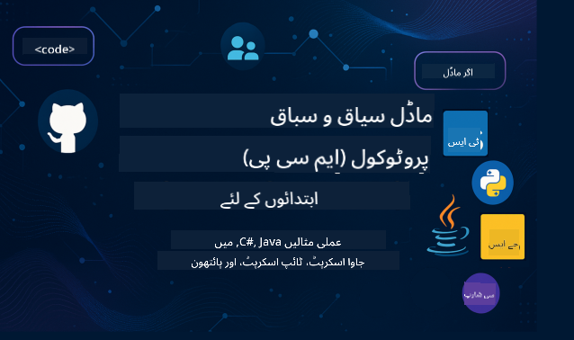

<!--
CO_OP_TRANSLATOR_METADATA:
{
  "original_hash": "2a21391378c12ecfef50f866329dfde0",
  "translation_date": "2025-05-17T05:18:23+00:00",
  "source_file": "README.md",
  "language_code": "ur"
}
-->

ان وسائل کو استعمال کرنے کے لئے ان مراحل کی پیروی کریں:
1. **ریپوزیٹری کو فورک کریں**: کلک کریں 
2. **ریپوزیٹری کو کلون کریں**: `git clone https://github.com/microsoft/mcp-for-beginners.git`
3. [**مائیکروسافٹ ایزور اے آئی فاؤنڈری ڈسکارڈ میں شامل ہوں اور ماہرین اور دیگر ڈویلپرز سے ملاقات کریں**](https://discord.com/invite/ByRwuEEgH4)

### 🌐 کثیر زبان کی حمایت

#### گٹ ہب ایکشن کے ذریعے حمایت یافتہ (خودکار اور ہمیشہ تازہ ترین)
[فرانسیسی](../fr/README.md) | [ہسپانوی](../es/README.md) | [جرمن](../de/README.md) | [روسی](../ru/README.md) | [عربی](../ar/README.md) | [فارسی](../fa/README.md) | [اردو](./README.md) | [چینی (سادہ)](../zh/README.md) | [چینی (روایتی، مکاؤ)](../mo/README.md) | [چینی (روایتی، ہانگ کانگ)](../hk/README.md) | [چینی (روایتی، تائیوان)](../tw/README.md) | [جاپانی](../ja/README.md) | [کورین](../ko/README.md) | [ہندی](../hi/README.md) | [بنگالی](../bn/README.md) | [مراٹھی](../mr/README.md) | [نیپالی](../ne/README.md) | [پنجابی (گرمکھی)](../pa/README.md) | [پرتگالی (پرتگال)](../pt/README.md) | [پرتگالی (برازیل)](../br/README.md) | [اطالوی](../it/README.md) | [پولش](../pl/README.md) | [ترکی](../tr/README.md) | [یونانی](../el/README.md) | [تھائی](../th/README.md) | [سویڈش](../sv/README.md) | [ڈینش](../da/README.md) | [نارویجین](../no/README.md) | [فینش](../fi/README.md) | [ڈچ](../nl/README.md) | [عبرانی](../he/README.md) | [ویتنامی](../vi/README.md) | [انڈونیشیائی](../id/README.md) | [مالے](../ms/README.md) | [ٹیگالوگ (فلپینی)](../tl/README.md) | [سواحلی](../sw/README.md) | [ہنگریائی](../hu/README.md) | [چیک](../cs/README.md) | [سلوواک](../sk/README.md) | [رومانیائی](../ro/README.md) | [بلغاریائی](../bg/README.md) | [سربین (سیریلک)](../sr/README.md) | [کروشین](../hr/README.md) | [سلووینیائی](../sl/README.md)
# 🚀 ابتدائیوں کے لیے ماڈل کانٹیکسٹ پروٹوکول (MCP) نصاب کی حتمی رہنمائی

## **C#, جاوا، جاوا اسکرپٹ، پائیتھن، اور ٹائپ اسکرپٹ میں عملی کوڈ مثالوں کے ساتھ MCP سیکھیں**

## 🧠 ماڈل کانٹیکسٹ پروٹوکول نصاب کا جائزہ

**ماڈل کانٹیکسٹ پروٹوکول (MCP)** ایک جدید فریم ورک ہے جو AI ماڈلز اور کلائنٹ ایپلیکیشنز کے درمیان تعاملات کو معیاری بنانے کے لیے ڈیزائن کیا گیا ہے۔ یہ اوپن سورس نصاب ایک منظم سیکھنے کا راستہ فراہم کرتا ہے، جس میں C#, جاوا، جاوا اسکرپٹ، ٹائپ اسکرپٹ، اور پائیتھن سمیت مشہور پروگرامنگ زبانوں میں عملی کوڈنگ مثالیں اور حقیقی دنیا کے استعمال کے کیسز شامل ہیں۔

چاہے آپ AI ڈویلپر، سسٹم آرکیٹیکٹ، یا سافٹ ویئر انجینئر ہوں، یہ رہنمائی آپ کے لیے MCP کی بنیادی باتوں اور نفاذ کی حکمت عملیوں میں مہارت حاصل کرنے کا جامع وسیلہ ہے۔

## 🔗 آفیشل MCP وسائل

- 📘 [MCP دستاویزات](https://modelcontextprotocol.io/) – تفصیلی ٹیوٹوریلز اور صارف گائیڈز  
- 📜 [MCP تفصیلات](https://spec.modelcontextprotocol.io/) – پروٹوکول کی ساخت اور تکنیکی حوالہ جات  
- 🧑‍💻 [MCP گٹ ہب ریپوزیٹری](https://github.com/modelcontextprotocol) – اوپن سورس SDKs، ٹولز، اور کوڈ نمونے  

## 🧭 مکمل MCP نصاب کی ساخت

### 📌 [MCP کا تعارف](./00-Introduction/README.md)

- ماڈل کانٹیکسٹ پروٹوکول کیا ہے؟
- AI پائپ لائنز میں معیاری بنانے کی اہمیت
- MCP کے عملی استعمال کے کیسز اور فوائد

### 🧩 [بنیادی تصورات کی وضاحت](./01-CoreConcepts/README.md)

- MCP میں کلائنٹ-سرور آرکیٹیکچر کو سمجھنا
- کلیدی پروٹوکول اجزاء: درخواستیں، جوابات، اور سکیمے
- MCP پیغام رسانی اور ڈیٹا کے تبادلے کے نمونے

### 🔐 [MCP میں سیکیورٹی](./02-Security/readme.md)

- MCP پر مبنی سسٹمز میں سیکیورٹی کے خطرات کی شناخت
- نفاذ کو محفوظ بنانے کے لیے تکنیک اور بہترین طریقے

### 🚀 [MCP کے ساتھ شروعات](./03-GettingStarted/README.md)

- ماحول کی ترتیب اور تشکیل
- بنیادی MCP سرورز اور کلائنٹس بنانا
- موجودہ ایپلیکیشنز کے ساتھ MCP کا انضمام

#### 🧮 MCP کیلکولیٹر کے نمونہ منصوبے:

  
<strong>زبان کے لحاظ سے کوڈ کے نفاذ کو دریافت کریں</strong>

  - [C# MCP سرور کی مثال](./03-GettingStarted/samples/csharp/README.md)
  - [جاوا MCP کیلکولیٹر](./03-GettingStarted/samples/java/calculator/README.md)
  - [جاوا اسکرپٹ MCP ڈیمو](./03-GettingStarted/samples/javascript/README.md)
  - [پائیتھن MCP سرور](../../03-GettingStarted/samples/python/mcp_calculator_server.py)
  - [ٹائپ اسکرپٹ MCP مثال](./03-GettingStarted/samples/typescript/README.md)

### 🛠️ [عملی نفاذ](./04-PracticalImplementation/README.md)

- مختلف زبانوں میں SDKs کا استعمال
- ڈیبگنگ، جانچ، اور توثیق
- دوبارہ استعمال کے قابل پرامپٹ ٹیمپلیٹس اور ورک فلو بنانا

#### 💡 MCP ایڈوانسڈ کیلکولیٹر پروجیکٹس:

  
<strong>ایڈوانسڈ نمونوں کو دریافت کریں</strong>

  - [ایڈوانسڈ C# نمونہ](./04-PracticalImplementation/samples/csharp/README.md)
  - [جاوا کنٹینر ایپ کی مثال](./04-PracticalImplementation/samples/java/containerapp/README.md)
  - [جاوا اسکرپٹ ایڈوانسڈ نمونہ](./04-PracticalImplementation/samples/javascript/README.md)
  - [پائیتھن پیچیدہ نفاذ](../../04-PracticalImplementation/samples/python/mcp_sample.py)
  - [ٹائپ اسکرپٹ کنٹینر نمونہ](./04-PracticalImplementation/samples/typescript/README.md)

### 🎓 [MCP میں ایڈوانسڈ موضوعات](./05-AdvancedTopics/README.md)

- ملٹی ماڈل AI ورک فلو اور توسیع پذیری
- محفوظ پیمائش کی حکمت عملی
- انٹرپرائز ایکو سسٹمز میں MCP

### 🌍 [کمیونٹی کے تعاون](./06-CommunityContributions/README.md)

- کوڈ اور دستاویزات میں تعاون کیسے کریں
- گٹ ہب کے ذریعے تعاون کرنا
- کمیونٹی سے چلنے والی بہتری اور تاثرات

### 📈 [ابتدائی اپنانے سے بصیرت](./07-CaseStudies/README.md)

- حقیقی دنیا کے نفاذ اور کیا کام کیا
- MCP پر مبنی حل بنانا اور تعینات کرنا
- رجحانات اور مستقبل کا روڈ میپ

### 📏 [MCP کے لیے بہترین طریقے](./08-BestPractices/README.md)

- کارکردگی کی ٹیوننگ اور اصلاح
- فالٹ ٹولیرنٹ MCP سسٹمز کا ڈیزائن
- جانچ اور لچک کی حکمت عملی

### 📊 [MCP کیس اسٹڈیز](./09-CaseStudy/Readme.md)

- MCP حل آرکیٹیکچرز میں گہرائی سے غوطہ
- تعیناتی کے بلیو پرنٹس اور انضمام کے مشورے
- تشریح شدہ ڈایاگرامز اور پروجیکٹ کی رہنمائی

## 🎯 MCP سیکھنے کے لیے پیشگی شرائط

اس نصاب سے زیادہ سے زیادہ فائدہ اٹھانے کے لیے، آپ کو ہونا چاہیے:

- C#, جاوا، یا پائیتھن کی بنیادی معلومات
- کلائنٹ-سرور ماڈل اور APIs کی سمجھ
- (اختیاری) مشین لرننگ کے تصورات سے واقفیت

## 🛠️ اس نصاب کو مؤثر طریقے سے استعمال کرنے کا طریقہ

اس گائیڈ میں ہر سبق شامل ہے:

1. MCP تصورات کی واضح وضاحت  
2. متعدد زبانوں میں زندہ کوڈ مثالیں  
3. حقیقی MCP ایپلیکیشنز بنانے کے لیے مشقیں  
4. اعلیٰ درجے کے سیکھنے والوں کے لیے اضافی وسائل  

## 📜 لائسنس کی معلومات

یہ مواد **MIT لائسنس** کے تحت لائسنس یافتہ ہے۔ شرائط و ضوابط کے لیے، [LICENSE](../../LICENSE) دیکھیں۔

## 🤝 تعاون کے رہنما اصول

یہ پروجیکٹ تعاون اور تجاویز کا خیرمقدم کرتا ہے۔ زیادہ تر تعاون کے لیے آپ کو ایک
کنٹریبیوٹر لائسنس ایگریمنٹ (CLA) پر اتفاق کرنا ہوگا جس میں یہ بیان کرنا ہوگا کہ آپ کو اس میں تعاون کرنے کا حق ہے اور آپ واقعی ہمیں
آپ کے تعاون کے استعمال کے حقوق دینے کی اجازت دیتے ہیں۔ تفصیلات کے لیے، <https://cla.opensource.microsoft.com> دیکھیں۔

جب آپ ایک پل درخواست جمع کرواتے ہیں، تو CLA بوٹ خودکار طور پر تعین کرے گا کہ آیا آپ کو CLA فراہم کرنے کی ضرورت ہے
اور PR کو مناسب طریقے سے سجائے گا (مثلاً، اسٹیٹس چیک، تبصرہ)۔ بوٹ کی طرف سے فراہم کردہ ہدایات پر عمل کریں۔
آپ کو یہ ہمارے تمام ریپوز میں صرف ایک بار کرنے کی ضرورت ہوگی۔

اس پروجیکٹ نے [مائیکروسافٹ اوپن سورس کوڈ آف کنڈکٹ](https://opensource.microsoft.com/codeofconduct/) کو اپنایا ہے۔
مزید معلومات کے لیے [کوڈ آف کنڈکٹ FAQ](https://opensource.microsoft.com/codeofconduct/faq/) دیکھیں یا
کسی اضافی سوالات یا تبصروں کے لیے [opencode@microsoft.com](mailto:opencode@microsoft.com) سے رابطہ کریں۔

## ™️ ٹریڈ مارک نوٹس

یہ پروجیکٹ پروجیکٹس، مصنوعات، یا خدمات کے لیے ٹریڈ مارکس یا لوگو پر مشتمل ہوسکتا ہے۔ مائیکروسافٹ
ٹریڈ مارکس یا لوگو کے مجاز استعمال کے لیے [Microsoft's Trademark & Brand Guidelines](https://www.microsoft.com/legal/intellectualproperty/trademarks/usage/general) کی پیروی ضروری ہے۔
اس پروجیکٹ کے ترمیم شدہ ورژنز میں مائیکروسافٹ کے ٹریڈ مارکس یا لوگو کے استعمال سے الجھن پیدا نہیں ہونی چاہیے یا مائیکروسافٹ کی سرپرستی کا اشارہ نہیں ہونا چاہیے۔
کسی بھی تیسرے فریق کے ٹریڈ مارکس یا لوگو کا استعمال ان تیسرے فریق کی پالیسیوں کے تابع ہے۔

**ڈس کلیمر**:  
یہ دستاویز AI ترجمہ سروس [Co-op Translator](https://github.com/Azure/co-op-translator) کا استعمال کرتے ہوئے ترجمہ کی گئی ہے۔ اگرچہ ہم درستگی کے لیے کوشاں ہیں، براہ کرم آگاہ رہیں کہ خودکار ترجمے میں غلطیاں یا غلطیاں ہوسکتی ہیں۔ اصل دستاویز کو اس کی اصل زبان میں مستند ذریعہ سمجھا جانا چاہیے۔ اہم معلومات کے لیے، پیشہ ور انسانی ترجمہ کی سفارش کی جاتی ہے۔ اس ترجمے کے استعمال سے پیدا ہونے والی کسی بھی غلط فہمی یا غلط تشریح کے لیے ہم ذمہ دار نہیں ہیں۔