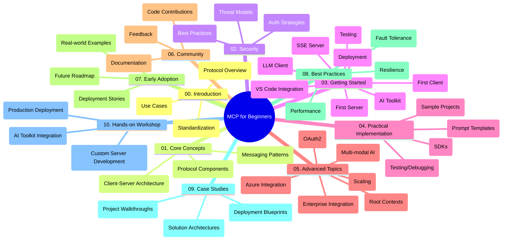

<!--
CO_OP_TRANSLATOR_METADATA:
{
  "original_hash": "a607d4febc94caee9a12b77795f7fc9a",
  "translation_date": "2025-06-11T16:37:17+00:00",
  "source_file": "study_guide.md",
  "language_code": "ur"
}
-->
# Model Context Protocol (MCP) for Beginners - Study Guide

یہ اسٹڈی گائیڈ "Model Context Protocol (MCP) for Beginners" نصاب کے لیے ریپوزیٹری کی ساخت اور مواد کا جائزہ فراہم کرتی ہے۔ اس گائیڈ کو استعمال کریں تاکہ ریپوزیٹری میں مؤثر طریقے سے نیویگیٹ کر سکیں اور دستیاب وسائل سے بھرپور فائدہ اٹھا سکیں۔

## Repository Overview

Model Context Protocol (MCP) ایک معیاری فریم ورک ہے جو AI ماڈلز اور کلائنٹ ایپلیکیشنز کے درمیان تعاملات کے لیے استعمال ہوتا ہے۔ یہ ریپوزیٹری ایک جامع نصاب فراہم کرتی ہے جس میں C#, Java, JavaScript, Python، اور TypeScript میں عملی کوڈ مثالیں شامل ہیں، جو AI ڈیولپرز، سسٹم آرکیٹیکٹس، اور سافٹ ویئر انجینئرز کے لیے ڈیزائن کیا گیا ہے۔

## Visual Curriculum Map

## Repository Structure

ریپوزیٹری دس اہم سیکشنز میں منظم ہے، ہر ایک MCP کے مختلف پہلوؤں پر توجہ مرکوز کرتا ہے:

1. **Introduction (00-Introduction/)**
   - Model Context Protocol کا جائزہ
   - AI پائپ لائنز میں معیاری بنانے کی اہمیت
   - عملی استعمال کے کیسز اور فوائد

2. **Core Concepts (01-CoreConcepts/)**
   - کلائنٹ-سرور آرکیٹیکچر
   - پروٹوکول کے اہم اجزاء
   - MCP میں میسجنگ پیٹرنز

3. **Security (02-Security/)**
   - MCP پر مبنی سسٹمز میں سیکیورٹی خطرات
   - سیکیورٹی کے نفاذ کے بہترین طریقے
   - توثیق اور اجازت کی حکمت عملیاں

4. **Getting Started (03-GettingStarted/)**
   - ماحول کی ترتیب اور کنفیگریشن
   - بنیادی MCP سرورز اور کلائنٹس بنانا
   - موجودہ ایپلیکیشنز کے ساتھ انضمام
   - پہلے سرور، پہلے کلائنٹ، LLM کلائنٹ، VS Code انٹیگریشن، SSE سرور، AI Toolkit، ٹیسٹنگ، اور تعیناتی کے ذیلی حصے

5. **Practical Implementation (04-PracticalImplementation/)**
   - مختلف پروگرامنگ زبانوں میں SDKs کا استعمال
   - ڈی بگنگ، ٹیسٹنگ، اور ویلیڈیشن تکنیکس
   - دوبارہ قابل استعمال پرامپٹ ٹیمپلیٹس اور ورک فلو تیار کرنا
   - نفاذ کی مثالوں کے ساتھ نمونہ پروجیکٹس

6. **Advanced Topics (05-AdvancedTopics/)**
   - کثیر الجہتی AI ورک فلو اور توسیع پذیری
   - محفوظ پیمانے کی حکمت عملیاں
   - انٹرپرائز ایکوسسٹمز میں MCP
   - خصوصی موضوعات بشمول Azure انٹیگریشن، ملٹی موڈالیٹی، OAuth2، روٹ کانٹیکسٹس، روٹنگ، سیمپلنگ، سیکیورٹی، ویب سرچ انٹیگریشن، اور سٹریمنگ۔

7. **Community Contributions (06-CommunityContributions/)**
   - کوڈ اور دستاویزات میں تعاون کیسے کریں
   - GitHub کے ذریعے تعاون
   - کمیونٹی کی جانب سے بہتریاں اور فیڈبیک

8. **Lessons from Early Adoption (07-LessonsfromEarlyAdoption/)**
   - حقیقی دنیا کے نفاذ اور کامیابی کی کہانیاں
   - MCP پر مبنی حل کی تعمیر اور تعیناتی
   - رجحانات اور مستقبل کا روڈ میپ

9. **Best Practices (08-BestPractices/)**
   - کارکردگی کی بہتری اور اصلاح
   - فالٹ ٹالرنٹ MCP سسٹمز کا ڈیزائن
   - ٹیسٹنگ اور لچک کی حکمت عملیاں

10. **Case Studies (09-CaseStudy/)**
    - MCP حل کے آرکیٹیکچر پر تفصیلی جائزے
    - تعیناتی کے خاکے اور انضمام کی تجاویز
    - تشریح شدہ خاکے اور پروجیکٹ واک تھروز

11. **Hands-on Workshop (10-StreamliningAIWorkflowsBuildingAnMCPServerWithAIToolkit/)**
    - Microsoft کے AI Toolkit کے ساتھ MCP کو یکجا کرنے والا جامع عملی ورکشاپ
    - AI ماڈلز کو حقیقی دنیا کے ٹولز کے ساتھ مربوط کرنے والی ذہین ایپلیکیشنز کی تعمیر
    - بنیادیات، کسٹم سرور کی ترقی، اور پروڈکشن تعیناتی کی حکمت عملیاں شامل عملی ماڈیولز

## Sample Projects

ریپوزیٹری میں مختلف پروگرامنگ زبانوں میں MCP نفاذ دکھانے والے متعدد نمونہ پروجیکٹس شامل ہیں:

### Basic MCP Calculator Samples
- C# MCP Server Example
- Java MCP Calculator
- JavaScript MCP Demo
- Python MCP Server
- TypeScript MCP Example

### Advanced MCP Calculator Projects
- Advanced C# Sample
- Java Container App Example
- JavaScript Advanced Sample
- Python Complex Implementation
- TypeScript Container Sample

## Additional Resources

ریپوزیٹری میں معاون وسائل شامل ہیں:

- **Images folder**: نصاب میں استعمال ہونے والے خاکے اور تصاویر پر مشتمل
- **Translations**: دستاویزات کے خودکار ترجمے کے ساتھ کثیر لسانی معاونت
- **Official MCP Resources**:
  - [MCP Documentation](https://modelcontextprotocol.io/)
  - [MCP Specification](https://spec.modelcontextprotocol.io/)
  - [MCP GitHub Repository](https://github.com/modelcontextprotocol)

## How to Use This Repository

1. **Sequential Learning**: ترتیب وار ابواب (00 سے 10 تک) پر عمل کریں تاکہ منظم سیکھنے کا تجربہ حاصل ہو۔
2. **Language-Specific Focus**: اگر آپ کسی خاص پروگرامنگ زبان میں دلچسپی رکھتے ہیں تو اپنے پسندیدہ زبان کے نفاذ کے لیے سیمپلز ڈائریکٹریز کو دیکھیں۔
3. **Practical Implementation**: اپنے ماحول کو سیٹ اپ کرنے اور اپنا پہلا MCP سرور اور کلائنٹ بنانے کے لیے "Getting Started" سیکشن سے شروع کریں۔
4. **Advanced Exploration**: بنیادی باتوں سے واقفیت حاصل کرنے کے بعد، اپنے علم کو بڑھانے کے لیے ایڈوانسڈ ٹاپکس میں غوطہ لگائیں۔
5. **Community Engagement**: ماہرین اور دیگر ڈیولپرز سے جڑنے کے لیے [Azure AI Foundry Discord](https://discord.com/invite/ByRwuEEgH4) میں شامل ہوں۔

## Contributing

یہ ریپوزیٹری کمیونٹی سے تعاون کا خیرمقدم کرتی ہے۔ تعاون کے طریقہ کار کے لیے Community Contributions سیکشن دیکھیں۔

---

*یہ اسٹڈی گائیڈ 11 جون 2025 کو تیار کی گئی تھی اور اس تاریخ تک ریپوزیٹری کے جائزے پر مبنی ہے۔ اس کے بعد ریپوزیٹری کے مواد میں تبدیلیاں ہو سکتی ہیں۔*

**ڈس کلیمر**:  
اس دستاویز کا ترجمہ AI ترجمہ سروس [Co-op Translator](https://github.com/Azure/co-op-translator) کے ذریعے کیا گیا ہے۔ اگرچہ ہم درستگی کے لیے کوشاں ہیں، براہ کرم آگاہ رہیں کہ خودکار ترجموں میں غلطیاں یا عدم درستیاں ہو سکتی ہیں۔ اصل دستاویز اپنی مادری زبان میں معتبر ماخذ سمجھی جائے گی۔ اہم معلومات کے لیے پیشہ ور انسانی ترجمہ کی سفارش کی جاتی ہے۔ اس ترجمے کے استعمال سے پیدا ہونے والی کسی بھی غلط فہمی یا غلط تشریح کے لیے ہم ذمہ دار نہیں ہیں۔