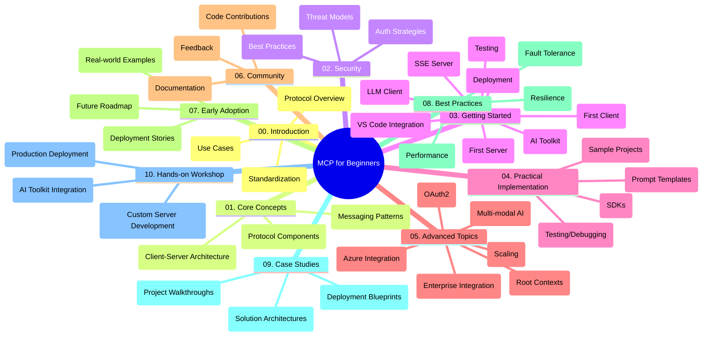

<!--
CO_OP_TRANSLATOR_METADATA:
{
  "original_hash": "a607d4febc94caee9a12b77795f7fc9a",
  "translation_date": "2025-07-13T15:10:30+00:00",
  "source_file": "study_guide.md",
  "language_code": "ur"
}
-->
# Model Context Protocol (MCP) for Beginners - Study Guide

یہ اسٹڈی گائیڈ "Model Context Protocol (MCP) for Beginners" نصاب کے لیے ریپوزیٹری کی ساخت اور مواد کا جائزہ فراہم کرتی ہے۔ اس گائیڈ کو استعمال کریں تاکہ ریپوزیٹری میں مؤثر طریقے سے نیویگیٹ کیا جا سکے اور دستیاب وسائل سے بھرپور فائدہ اٹھایا جا سکے۔

## Repository Overview

Model Context Protocol (MCP) ایک معیاری فریم ورک ہے جو AI ماڈلز اور کلائنٹ ایپلیکیشنز کے درمیان تعاملات کے لیے استعمال ہوتا ہے۔ یہ ریپوزیٹری ایک جامع نصاب فراہم کرتی ہے جس میں C#, Java, JavaScript, Python، اور TypeScript میں عملی کوڈ مثالیں شامل ہیں، جو AI ڈویلپرز، سسٹم آرکیٹیکٹس، اور سافٹ ویئر انجینئرز کے لیے ڈیزائن کیا گیا ہے۔

## Visual Curriculum Map

## Repository Structure

ریپوزیٹری کو دس اہم حصوں میں منظم کیا گیا ہے، ہر ایک MCP کے مختلف پہلوؤں پر توجہ دیتا ہے:

1. **Introduction (00-Introduction/)**
   - Model Context Protocol کا تعارف
   - AI پائپ لائنز میں معیاری بنانے کی اہمیت
   - عملی استعمال کے کیسز اور فوائد

2. **Core Concepts (01-CoreConcepts/)**
   - کلائنٹ-سرور آرکیٹیکچر
   - پروٹوکول کے اہم اجزاء
   - MCP میں میسجنگ پیٹرنز

3. **Security (02-Security/)**
   - MCP پر مبنی سسٹمز میں سیکیورٹی خطرات
   - سیکیورٹی کے بہترین طریقے
   - توثیق اور اجازت کے حکمت عملی

4. **Getting Started (03-GettingStarted/)**
   - ماحول کی ترتیب اور کنفیگریشن
   - بنیادی MCP سرورز اور کلائنٹس بنانا
   - موجودہ ایپلیکیشنز کے ساتھ انٹیگریشن
   - پہلے سرور، پہلے کلائنٹ، LLM کلائنٹ، VS Code انٹیگریشن، SSE سرور، AI Toolkit، ٹیسٹنگ، اور تعیناتی کے ذیلی حصے

5. **Practical Implementation (04-PracticalImplementation/)**
   - مختلف پروگرامنگ زبانوں میں SDKs کا استعمال
   - ڈیبگنگ، ٹیسٹنگ، اور ویلیڈیشن کی تکنیکیں
   - دوبارہ استعمال کے قابل پرامپٹ ٹیمپلیٹس اور ورک فلو تیار کرنا
   - عمل درآمد کی مثالوں کے ساتھ نمونہ پروجیکٹس

6. **Advanced Topics (05-AdvancedTopics/)**
   - ملٹی موڈل AI ورک فلو اور توسیع پذیری
   - محفوظ پیمانے کی حکمت عملی
   - انٹرپرائز ایکو سسٹمز میں MCP
   - خصوصی موضوعات جن میں Azure انٹیگریشن، ملٹی موڈیلٹی، OAuth2، روٹ کانٹیکسٹس، روٹنگ، سیمپلنگ، اسکیلنگ، سیکیورٹی، ویب سرچ انٹیگریشن، اور اسٹریمنگ شامل ہیں۔

7. **Community Contributions (06-CommunityContributions/)**
   - کوڈ اور دستاویزات میں تعاون کیسے کریں
   - GitHub کے ذریعے تعاون
   - کمیونٹی کی جانب سے بہتریاں اور فیڈبیک

8. **Lessons from Early Adoption (07-LessonsfromEarlyAdoption/)**
   - حقیقی دنیا کی عمل درآمد اور کامیابی کی کہانیاں
   - MCP پر مبنی حل کی تعمیر اور تعیناتی
   - رجحانات اور مستقبل کا روڈ میپ

9. **Best Practices (08-BestPractices/)**
   - کارکردگی کی بہتری اور اصلاح
   - فالٹ ٹولرینٹ MCP سسٹمز کی ڈیزائننگ
   - ٹیسٹنگ اور مزاحمت کی حکمت عملی

10. **Case Studies (09-CaseStudy/)**
    - MCP حل کے آرکیٹیکچرز کی گہرائی میں جانچ
    - تعیناتی کے خاکے اور انٹیگریشن کے نکات
    - تشریح شدہ خاکے اور پروجیکٹ واک تھروز

11. **Hands-on Workshop (10-StreamliningAIWorkflowsBuildingAnMCPServerWithAIToolkit/)**
    - MCP کو Microsoft کے AI Toolkit کے ساتھ VS Code کے لیے مربوط کرتے ہوئے جامع عملی ورکشاپ
    - ذہین ایپلیکیشنز کی تعمیر جو AI ماڈلز کو حقیقی دنیا کے ٹولز سے جوڑتی ہیں
    - بنیادی باتوں، کسٹم سرور کی ترقی، اور پروڈکشن تعیناتی کی حکمت عملیوں پر مشتمل عملی ماڈیولز

## Sample Projects

ریپوزیٹری میں متعدد نمونہ پروجیکٹس شامل ہیں جو مختلف پروگرامنگ زبانوں میں MCP کی عمل درآمد کو ظاہر کرتے ہیں:

### Basic MCP Calculator Samples
- C# MCP Server Example
- Java MCP Calculator
- JavaScript MCP Demo
- Python MCP Server
- TypeScript MCP Example

### Advanced MCP Calculator Projects
- Advanced C# Sample
- Java Container App Example
- JavaScript Advanced Sample
- Python Complex Implementation
- TypeScript Container Sample

## Additional Resources

ریپوزیٹری میں معاون وسائل شامل ہیں:

- **Images folder**: نصاب میں استعمال ہونے والے خاکے اور تصاویر
- **Translations**: دستاویزات کے خودکار ترجمے کے ساتھ کثیراللسانی معاونت
- **Official MCP Resources**:
  - [MCP Documentation](https://modelcontextprotocol.io/)
  - [MCP Specification](https://spec.modelcontextprotocol.io/)
  - [MCP GitHub Repository](https://github.com/modelcontextprotocol)

## How to Use This Repository

1. **Sequential Learning**: منظم سیکھنے کے لیے ابواب کو ترتیب سے (00 سے 10 تک) فالو کریں۔
2. **Language-Specific Focus**: اگر آپ کسی خاص پروگرامنگ زبان میں دلچسپی رکھتے ہیں تو اپنی پسندیدہ زبان میں عمل درآمد کے لیے samples ڈائریکٹریز کو دیکھیں۔
3. **Practical Implementation**: اپنے ماحول کی ترتیب کے لیے "Getting Started" سیکشن سے شروع کریں اور اپنا پہلا MCP سرور اور کلائنٹ بنائیں۔
4. **Advanced Exploration**: بنیادی باتوں میں مہارت حاصل کرنے کے بعد، اپنے علم کو بڑھانے کے لیے advanced topics میں غوطہ لگائیں۔
5. **Community Engagement**: ماہرین اور دیگر ڈویلپرز سے جڑنے کے لیے [Azure AI Foundry Discord](https://discord.com/invite/ByRwuEEgH4) میں شامل ہوں۔

## Contributing

یہ ریپوزیٹری کمیونٹی کی شراکتوں کا خیرمقدم کرتی ہے۔ تعاون کے طریقہ کار کے لیے Community Contributions سیکشن دیکھیں۔

---

*یہ اسٹڈی گائیڈ 11 جون 2025 کو تیار کی گئی تھی اور اس تاریخ تک ریپوزیٹری کا جائزہ فراہم کرتی ہے۔ اس کے بعد ریپوزیٹری کے مواد میں تبدیلیاں ہو سکتی ہیں۔*

**دستخطی دستبرداری**:  
یہ دستاویز AI ترجمہ سروس [Co-op Translator](https://github.com/Azure/co-op-translator) کے ذریعے ترجمہ کی گئی ہے۔ اگرچہ ہم درستگی کے لیے کوشاں ہیں، براہ کرم آگاہ رہیں کہ خودکار ترجمے میں غلطیاں یا عدم درستیاں ہو سکتی ہیں۔ اصل دستاویز اپنی مادری زبان میں ہی معتبر ماخذ سمجھی جانی چاہیے۔ اہم معلومات کے لیے پیشہ ور انسانی ترجمہ کی سفارش کی جاتی ہے۔ اس ترجمے کے استعمال سے پیدا ہونے والی کسی بھی غلط فہمی یا غلط تشریح کی ذمہ داری ہم پر عائد نہیں ہوتی۔