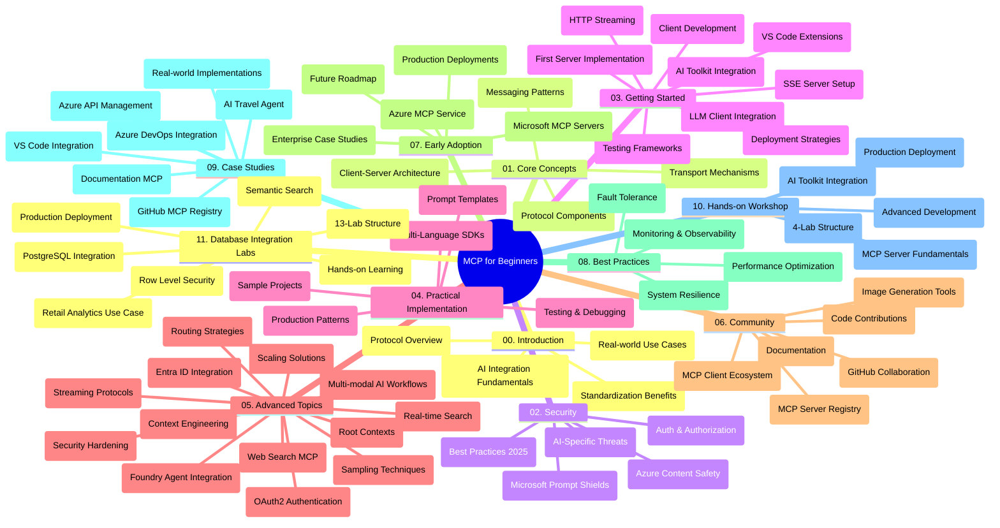

<!--
CO_OP_TRANSLATOR_METADATA:
{
  "original_hash": "aa1ce97bc694b08faf3018bab6d275b9",
  "translation_date": "2025-09-30T15:01:50+00:00",
  "source_file": "study_guide.md",
  "language_code": "ur"
}
-->
# ماڈل کانٹیکسٹ پروٹوکول (MCP) برائے ابتدائی - مطالعہ گائیڈ

یہ مطالعہ گائیڈ "ماڈل کانٹیکسٹ پروٹوکول (MCP) برائے ابتدائی" نصاب کے ذخیرے کی ساخت اور مواد کا جائزہ فراہم کرتا ہے۔ اس گائیڈ کو ذخیرے کو مؤثر طریقے سے نیویگیٹ کرنے اور دستیاب وسائل سے بھرپور فائدہ اٹھانے کے لیے استعمال کریں۔

## ذخیرے کا جائزہ

ماڈل کانٹیکسٹ پروٹوکول (MCP) ایک معیاری فریم ورک ہے جو AI ماڈلز اور کلائنٹ ایپلیکیشنز کے درمیان تعاملات کو منظم کرتا ہے۔ ابتدائی طور پر Anthropic کے ذریعے تخلیق کیا گیا، MCP اب وسیع MCP کمیونٹی کے ذریعے آفیشل GitHub تنظیم کے تحت برقرار رکھا جاتا ہے۔ یہ ذخیرہ ایک جامع نصاب فراہم کرتا ہے جس میں C#, Java, JavaScript, Python، اور TypeScript میں عملی کوڈ مثالیں شامل ہیں، جو AI ڈویلپرز، سسٹم آرکیٹیکٹس، اور سافٹ ویئر انجینئرز کے لیے ڈیزائن کیا گیا ہے۔

## بصری نصاب کا نقشہ

## ذخیرے کی ساخت

یہ ذخیرہ گیارہ اہم حصوں میں منظم ہے، ہر ایک MCP کے مختلف پہلوؤں پر مرکوز ہے:

1. **تعارف (00-Introduction/)**
   - ماڈل کانٹیکسٹ پروٹوکول کا جائزہ
   - AI پائپ لائنز میں معیاری سازی کی اہمیت
   - عملی استعمال کے کیسز اور فوائد

2. **بنیادی تصورات (01-CoreConcepts/)**
   - کلائنٹ-سرور آرکیٹیکچر
   - پروٹوکول کے کلیدی اجزاء
   - MCP میں میسجنگ کے پیٹرنز

3. **سیکیورٹی (02-Security/)**
   - MCP پر مبنی سسٹمز میں سیکیورٹی خطرات
   - نفاذ کو محفوظ بنانے کے بہترین طریقے
   - تصدیق اور اجازت کی حکمت عملی
   - **جامع سیکیورٹی دستاویزات**:
     - MCP سیکیورٹی بہترین طریقے 2025
     - Azure مواد کی حفاظت کے نفاذ کی گائیڈ
     - MCP سیکیورٹی کنٹرولز اور تکنیکیں
     - MCP بہترین طریقے فوری حوالہ
   - **کلیدی سیکیورٹی موضوعات**:
     - پرامپٹ انجیکشن اور ٹول پوائزننگ حملے
     - سیشن ہائی جیکنگ اور کنفیوزڈ ڈپٹی مسائل
     - ٹوکن پاس تھرو کمزوریاں
     - ضرورت سے زیادہ اجازتیں اور رسائی کنٹرول
     - AI اجزاء کے لیے سپلائی چین سیکیورٹی
     - Microsoft پرامپٹ شیلڈز انضمام

4. **شروع کرنا (03-GettingStarted/)**
   - ماحول کی ترتیب اور تشکیل
   - بنیادی MCP سرورز اور کلائنٹس بنانا
   - موجودہ ایپلیکیشنز کے ساتھ انضمام
   - شامل ہیں:
     - پہلا سرور نفاذ
     - کلائنٹ کی ترقی
     - LLM کلائنٹ انضمام
     - VS کوڈ انضمام
     - سرور-سینٹ ایونٹس (SSE) سرور
     - HTTP اسٹریمنگ
     - AI ٹول کٹ انضمام
     - ٹیسٹنگ کی حکمت عملی
     - تعیناتی کے رہنما اصول

5. **عملی نفاذ (04-PracticalImplementation/)**
   - مختلف پروگرامنگ زبانوں میں SDKs کا استعمال
   - ڈیبگنگ، ٹیسٹنگ، اور توثیق کی تکنیکیں
   - دوبارہ استعمال کے قابل پرامپٹ ٹیمپلیٹس اور ورک فلو بنانا
   - نفاذ کی مثالوں کے ساتھ نمونہ پروجیکٹس

6. **اعلی درجے کے موضوعات (05-AdvancedTopics/)**
   - کانٹیکسٹ انجینئرنگ تکنیکیں
   - فاؤنڈری ایجنٹ انضمام
   - ملٹی موڈل AI ورک فلو
   - OAuth2 تصدیق کے ڈیمو
   - ریئل ٹائم سرچ صلاحیتیں
   - ریئل ٹائم اسٹریمنگ
   - روٹ کانٹیکسٹ نفاذ
   - روٹنگ کی حکمت عملی
   - سیمپلنگ تکنیکیں
   - اسکیلنگ کے طریقے
   - سیکیورٹی کے تحفظات
   - Entra ID سیکیورٹی انضمام
   - ویب سرچ انضمام

7. **کمیونٹی تعاون (06-CommunityContributions/)**
   - کوڈ اور دستاویزات میں تعاون کیسے کریں
   - GitHub کے ذریعے تعاون کرنا
   - کمیونٹی سے چلنے والی بہتری اور تاثرات
   - مختلف MCP کلائنٹس کا استعمال (Claude Desktop، Cline، VSCode)
   - مقبول MCP سرورز کے ساتھ کام کرنا، بشمول امیج جنریشن

8. **ابتدائی اپنانے سے سبق (07-LessonsfromEarlyAdoption/)**
   - حقیقی دنیا کے نفاذ اور کامیابی کی کہانیاں
   - MCP پر مبنی حل بنانا اور تعینات کرنا
   - رجحانات اور مستقبل کا روڈ میپ
   - **Microsoft MCP سرورز گائیڈ**: 10 پروڈکشن ریڈی Microsoft MCP سرورز کے لیے جامع گائیڈ، بشمول:
     - Microsoft Learn Docs MCP سرور
     - Azure MCP سرور (15+ خصوصی کنیکٹرز)
     - GitHub MCP سرور
     - Azure DevOps MCP سرور
     - MarkItDown MCP سرور
     - SQL سرور MCP سرور
     - Playwright MCP سرور
     - Dev Box MCP سرور
     - Azure AI Foundry MCP سرور
     - Microsoft 365 Agents Toolkit MCP سرور

9. **بہترین طریقے (08-BestPractices/)**
   - کارکردگی کو بہتر بنانا اور اصلاح کرنا
   - غلطی برداشت کرنے والے MCP سسٹمز ڈیزائن کرنا
   - ٹیسٹنگ اور لچک کی حکمت عملی

10. **کیس اسٹڈیز (09-CaseStudy/)**
    - **سات جامع کیس اسٹڈیز** جو مختلف منظرناموں میں MCP کی استعداد کو ظاہر کرتی ہیں:
    - **Azure AI ٹریول ایجنٹس**: Azure OpenAI اور AI سرچ کے ساتھ ملٹی ایجنٹ آرکیسٹریشن
    - **Azure DevOps انضمام**: YouTube ڈیٹا اپڈیٹس کے ساتھ ورک فلو پروسیس کو خودکار بنانا
    - **ریئل ٹائم دستاویزات کی بازیافت**: Python کنسول کلائنٹ کے ساتھ اسٹریمنگ HTTP
    - **انٹرایکٹو اسٹڈی پلان جنریٹر**: Chainlit ویب ایپ کے ساتھ گفتگو پر مبنی AI
    - **ان ایڈیٹر دستاویزات**: VS کوڈ انضمام کے ساتھ GitHub Copilot ورک فلو
    - **Azure API مینجمنٹ**: انٹرپرائز API انضمام کے ساتھ MCP سرور تخلیق
    - **GitHub MCP رجسٹری**: ماحولیاتی نظام کی ترقی اور ایجنٹک انضمام پلیٹ فارم
    - نفاذ کی مثالیں جو انٹرپرائز انضمام، ڈویلپر کی پیداواری صلاحیت، اور ماحولیاتی نظام کی ترقی کو شامل کرتی ہیں

11. **ہینڈز آن ورکشاپ (10-StreamliningAIWorkflowsBuildingAnMCPServerWithAIToolkit/)**
    - MCP کو AI ٹول کٹ کے ساتھ جوڑنے والی جامع ہینڈز آن ورکشاپ
    - ذہین ایپلیکیشنز بنانا جو AI ماڈلز کو حقیقی دنیا کے ٹولز کے ساتھ جوڑتی ہیں
    - عملی ماڈیولز جو بنیادی اصولوں، کسٹم سرور کی ترقی، اور پروڈکشن تعیناتی کی حکمت عملیوں کا احاطہ کرتے ہیں
    - **لیب کی ساخت**:
      - لیب 1: MCP سرور کے بنیادی اصول
      - لیب 2: اعلی درجے کی MCP سرور کی ترقی
      - لیب 3: AI ٹول کٹ انضمام
      - لیب 4: پروڈکشن تعیناتی اور اسکیلنگ
    - مرحلہ وار ہدایات کے ساتھ لیب پر مبنی سیکھنے کا طریقہ

12. **MCP سرور ڈیٹا بیس انضمام لیبز (11-MCPServerHandsOnLabs/)**
    - **پروڈکشن ریڈی MCP سرورز بنانے کے لیے 13 لیبز پر مشتمل جامع سیکھنے کا راستہ**، PostgreSQL انضمام کے ساتھ
    - **حقیقی دنیا کے ریٹیل اینالیٹکس نفاذ** Zava Retail کیس استعمال کرتے ہوئے
    - **انٹرپرائز گریڈ پیٹرنز** بشمول Row Level Security (RLS)، سیمینٹک سرچ، اور ملٹی ٹیننٹ ڈیٹا تک رسائی
    - **مکمل لیب کی ساخت**:
      - **لیبز 00-03: بنیادیں** - تعارف، آرکیٹیکچر، سیکیورٹی، ماحول کی ترتیب
      - **لیبز 04-06: MCP سرور کی تعمیر** - ڈیٹا بیس ڈیزائن، MCP سرور نفاذ، ٹول کی ترقی
      - **لیبز 07-09: اعلی درجے کی خصوصیات** - سیمینٹک سرچ، ٹیسٹنگ اور ڈیبگنگ، VS کوڈ انضمام
      - **لیبز 10-12: پروڈکشن اور بہترین طریقے** - تعیناتی، نگرانی، اصلاح
    - **شامل ٹیکنالوجیز**: FastMCP فریم ورک، PostgreSQL، Azure OpenAI، Azure Container Apps، Application Insights
    - **سیکھنے کے نتائج**: پروڈکشن ریڈی MCP سرورز، ڈیٹا بیس انضمام کے پیٹرنز، AI سے چلنے والے اینالیٹکس، انٹرپرائز سیکیورٹی

## اضافی وسائل

ذخیرہ معاون وسائل شامل کرتا ہے:

- **امیجز فولڈر**: نصاب میں استعمال ہونے والے خاکے اور تصاویر پر مشتمل ہے
- **ترجمے**: دستاویزات کے خودکار ترجمے کے ساتھ کثیر زبان کی حمایت
- **آفیشل MCP وسائل**:
  - [MCP دستاویزات](https://modelcontextprotocol.io/)
  - [MCP وضاحت](https://spec.modelcontextprotocol.io/)
  - [MCP GitHub ذخیرہ](https://github.com/modelcontextprotocol)

## اس ذخیرے کو کیسے استعمال کریں

1. **تسلسل کے ساتھ سیکھنا**: ایک منظم سیکھنے کے تجربے کے لیے ابواب کو ترتیب وار (00 سے 11 تک) فالو کریں۔
2. **زبان پر مبنی توجہ**: اگر آپ کسی خاص پروگرامنگ زبان میں دلچسپی رکھتے ہیں، تو اپنی پسندیدہ زبان میں نفاذ کے لیے نمونہ ڈائریکٹریز کو دریافت کریں۔
3. **عملی نفاذ**: اپنے ماحول کو ترتیب دینے اور اپنا پہلا MCP سرور اور کلائنٹ بنانے کے لیے "شروع کرنا" سیکشن سے آغاز کریں۔
4. **اعلی درجے کی تلاش**: بنیادی باتوں میں مہارت حاصل کرنے کے بعد، اپنے علم کو بڑھانے کے لیے اعلی درجے کے موضوعات میں غوطہ لگائیں۔
5. **کمیونٹی میں شمولیت**: GitHub مباحثوں اور Discord چینلز کے ذریعے MCP کمیونٹی میں شامل ہوں تاکہ ماہرین اور ساتھی ڈویلپرز سے رابطہ قائم کریں۔

## MCP کلائنٹس اور ٹولز

نصاب مختلف MCP کلائنٹس اور ٹولز کا احاطہ کرتا ہے:

1. **آفیشل کلائنٹس**:
   - Visual Studio Code
   - MCP in Visual Studio Code
   - Claude Desktop
   - Claude in VSCode
   - Claude API

2. **کمیونٹی کلائنٹس**:
   - Cline (ٹرمینل پر مبنی)
   - Cursor (کوڈ ایڈیٹر)
   - ChatMCP
   - Windsurf

3. **MCP مینجمنٹ ٹولز**:
   - MCP CLI
   - MCP Manager
   - MCP Linker
   - MCP Router

## مقبول MCP سرورز

ذخیرہ مختلف MCP سرورز کا تعارف کراتا ہے، بشمول:

1. **آفیشل Microsoft MCP سرورز**:
   - Microsoft Learn Docs MCP سرور
   - Azure MCP سرور (15+ خصوصی کنیکٹرز)
   - GitHub MCP سرور
   - Azure DevOps MCP سرور
   - MarkItDown MCP سرور
   - SQL سرور MCP سرور
   - Playwright MCP سرور
   - Dev Box MCP سرور
   - Azure AI Foundry MCP سرور
   - Microsoft 365 Agents Toolkit MCP سرور

2. **آفیشل ریفرنس سرورز**:
   - Filesystem
   - Fetch
   - Memory
   - Sequential Thinking

3. **امیج جنریشن**:
   - Azure OpenAI DALL-E 3
   - Stable Diffusion WebUI
   - Replicate

4. **ترقیاتی ٹولز**:
   - Git MCP
   - Terminal Control
   - Code Assistant

5. **خصوصی سرورز**:
   - Salesforce
   - Microsoft Teams
   - Jira & Confluence

## تعاون

یہ ذخیرہ کمیونٹی کی جانب سے تعاون کا خیر مقدم کرتا ہے۔ MCP ماحولیاتی نظام میں مؤثر طریقے سے تعاون کرنے کے لیے کمیونٹی تعاون سیکشن دیکھیں۔

## تبدیلیوں کا ریکارڈ

| تاریخ | تبدیلیاں |
|------|---------||
| 29 ستمبر، 2025 | - 11-MCPServerHandsOnLabs سیکشن شامل کیا، 13 لیبز پر مشتمل جامع ڈیٹا بیس انضمام سیکھنے کا راستہ - بصری نصاب کے نقشے کو ڈیٹا بیس انضمام لیبز شامل کرنے کے لیے اپ ڈیٹ کیا - ذخیرے کی ساخت کو گیارہ اہم حصوں کی عکاسی کرنے کے لیے بہتر بنایا - PostgreSQL انضمام، ریٹیل اینالیٹکس کیس استعمال، اور انٹرپرائز پیٹرنز کی تفصیل شامل کی - نیویگیشن رہنمائی کو سیکشنز 00-11 شامل کرنے کے لیے اپ ڈیٹ کیا |
| 26 ستمبر، 2025 | - GitHub MCP رجسٹری کیس اسٹڈی کو 09-CaseStudy سیکشن میں شامل کیا - کیس اسٹڈیز کو سات جامع کیس اسٹڈیز کی عکاسی کرنے کے لیے اپ ڈیٹ کیا - مخصوص نفاذ کی تفصیلات کے ساتھ کیس اسٹڈی کی وضاحتیں بہتر بنائیں - بصری نصاب کے نقشے کو GitHub MCP رجسٹری شامل کرنے کے لیے اپ ڈیٹ کیا - مطالعہ گائیڈ کی ساخت کو ماحولیاتی نظام کی ترقی پر توجہ دینے کے لیے بہتر بنایا |
| 18 جولائی، 2025 | - ذخیرے کی ساخت کو Microsoft MCP سرورز گائیڈ شامل کرنے کے لیے اپ ڈیٹ کیا - 10 پروڈکشن ریڈی Microsoft MCP سرورز کی جامع فہرست شامل کی - مقبول MCP سرورز سیکشن کو آفیشل Microsoft MCP سرورز کے ساتھ بہتر بنایا - کیس اسٹڈیز سیکشن کو حقیقی فائل مثالوں کے ساتھ اپ ڈیٹ کیا - ہینڈز آن ورکشاپ کے لیے لیب کی ساخت کی تفصیلات شامل کیں |
| 16 جولائی، 2025 | - ذخیرے کی ساخت کو موجودہ مواد کی عکاسی کرنے کے لیے اپ ڈیٹ کیا - MCP کلائنٹس اور ٹولز سیکشن شامل کیا - مقبول MCP سرورز سیکشن شامل کیا - بصری نصاب کے نقشے کو موجودہ موضوعات کے ساتھ اپ ڈیٹ کیا - اعلی درجے کے موضوعات سیکشن کو تمام خصوصی علاقوں کے ساتھ بہتر بنایا - کیس اسٹڈیز کو حقیقی مثالوں کی عکاسی کرنے کے لیے اپ ڈیٹ کیا - Anthropic کے ذریعے تخلیق کردہ MCP کی وضاحت کی |
| 11 جون، 2025 | - مطالعہ گائیڈ کی ابتدائی تخلیق - بصری نصاب کا نقشہ شامل کیا - ذخیرے کی ساخت کا خاکہ پیش کیا - نمونہ پروجیکٹس اور اضافی وسائل شامل کیے |

---

*یہ مطالعہ گائیڈ 29 ستمبر، 2025 کو اپ ڈیٹ کیا گیا تھا اور اس تاریخ تک ذخیرے کا جائزہ فراہم کرتا ہے۔ ذخیرے کا مواد اس تاریخ کے بعد اپ ڈیٹ ہو سکتا ہے۔*

---

**ڈسکلیمر**:  
یہ دستاویز AI ترجمہ سروس [Co-op Translator](https://github.com/Azure/co-op-translator) کا استعمال کرتے ہوئے ترجمہ کی گئی ہے۔ ہم درستگی کے لیے کوشش کرتے ہیں، لیکن براہ کرم آگاہ رہیں کہ خودکار ترجمے میں غلطیاں یا غیر درستیاں ہو سکتی ہیں۔ اصل دستاویز کو اس کی اصل زبان میں مستند ذریعہ سمجھا جانا چاہیے۔ اہم معلومات کے لیے، پیشہ ور انسانی ترجمہ کی سفارش کی جاتی ہے۔ ہم اس ترجمے کے استعمال سے پیدا ہونے والی کسی بھی غلط فہمی یا غلط تشریح کے ذمہ دار نہیں ہیں۔