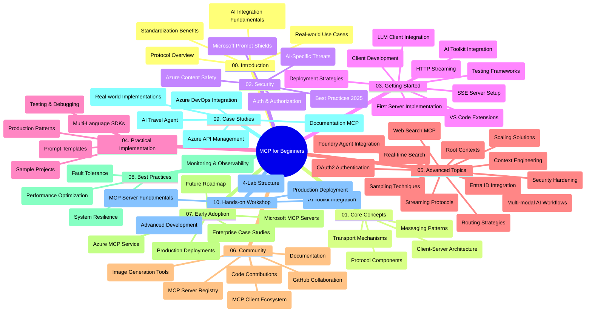

<!--
CO_OP_TRANSLATOR_METADATA:
{
  "original_hash": "e2c6ed897fa98fa08e0146101776c7ff",
  "translation_date": "2025-07-18T09:17:38+00:00",
  "source_file": "study_guide.md",
  "language_code": "ur"
}
-->
# ماڈل کانٹیکسٹ پروٹوکول (MCP) برائے مبتدیان - مطالعہ گائیڈ

یہ مطالعہ گائیڈ "Model Context Protocol (MCP) for Beginners" نصاب کے لیے ریپوزیٹری کی ساخت اور مواد کا جائزہ فراہم کرتی ہے۔ اس گائیڈ کو استعمال کریں تاکہ ریپوزیٹری میں مؤثر طریقے سے نیویگیٹ کیا جا سکے اور دستیاب وسائل سے بھرپور فائدہ اٹھایا جا سکے۔

## ریپوزیٹری کا جائزہ

Model Context Protocol (MCP) ایک معیاری فریم ورک ہے جو AI ماڈلز اور کلائنٹ ایپلیکیشنز کے درمیان تعاملات کے لیے استعمال ہوتا ہے۔ ابتدا میں Anthropic نے اسے تخلیق کیا تھا، اور اب MCP کو وسیع کمیونٹی MCP کے سرکاری GitHub آرگنائزیشن کے ذریعے برقرار رکھتی ہے۔ یہ ریپوزیٹری AI ڈویلپرز، سسٹم آرکیٹیکٹس، اور سافٹ ویئر انجینئرز کے لیے C#, Java, JavaScript, Python، اور TypeScript میں عملی کوڈ مثالوں کے ساتھ ایک جامع نصاب فراہم کرتی ہے۔

## بصری نصاب کا نقشہ

## ریپوزیٹری کی ساخت

ریپوزیٹری کو دس اہم حصوں میں منظم کیا گیا ہے، ہر ایک MCP کے مختلف پہلوؤں پر توجہ مرکوز کرتا ہے:

1. **تعارف (00-Introduction/)**  
   - Model Context Protocol کا جائزہ  
   - AI پائپ لائنز میں معیاری بنانے کی اہمیت  
   - عملی استعمال کے کیسز اور فوائد  

2. **بنیادی تصورات (01-CoreConcepts/)**  
   - کلائنٹ-سرور آرکیٹیکچر  
   - پروٹوکول کے کلیدی اجزاء  
   - MCP میں میسجنگ کے پیٹرنز  

3. **سیکیورٹی (02-Security/)**  
   - MCP پر مبنی سسٹمز میں سیکیورٹی خطرات  
   - محفوظ نفاذ کے بہترین طریقے  
   - توثیق اور اجازت کے حکمت عملی  
   - **جامع سیکیورٹی دستاویزات**:  
     - MCP Security Best Practices 2025  
     - Azure Content Safety Implementation Guide  
     - MCP Security Controls and Techniques  
     - MCP Best Practices Quick Reference  
   - **اہم سیکیورٹی موضوعات**:  
     - پرامپٹ انجیکشن اور ٹول زہریلا حملے  
     - سیشن ہائی جیکنگ اور کنفیوزڈ ڈیپٹی مسائل  
     - ٹوکن پاس تھرو کی کمزوریاں  
     - ضرورت سے زیادہ اجازتیں اور رسائی کنٹرول  
     - AI اجزاء کی سپلائی چین سیکیورٹی  
     - Microsoft Prompt Shields انٹیگریشن  

4. **شروع کرنا (03-GettingStarted/)**  
   - ماحول کی ترتیب اور کنفیگریشن  
   - بنیادی MCP سرورز اور کلائنٹس کی تخلیق  
   - موجودہ ایپلیکیشنز کے ساتھ انٹیگریشن  
   - شامل سیکشنز:  
     - پہلا سرور نفاذ  
     - کلائنٹ ڈیولپمنٹ  
     - LLM کلائنٹ انٹیگریشن  
     - VS Code انٹیگریشن  
     - Server-Sent Events (SSE) سرور  
     - HTTP اسٹریمنگ  
     - AI Toolkit انٹیگریشن  
     - ٹیسٹنگ حکمت عملی  
     - تعیناتی کے رہنما اصول  

5. **عملی نفاذ (04-PracticalImplementation/)**  
   - مختلف پروگرامنگ زبانوں میں SDKs کا استعمال  
   - ڈیبگنگ، ٹیسٹنگ، اور ویلیڈیشن تکنیکس  
   - دوبارہ استعمال کے قابل پرامپٹ ٹیمپلیٹس اور ورک فلو تیار کرنا  
   - نفاذ کی مثالوں کے ساتھ نمونہ پروجیکٹس  

6. **جدید موضوعات (05-AdvancedTopics/)**  
   - کانٹیکسٹ انجینئرنگ تکنیکس  
   - Foundry ایجنٹ انٹیگریشن  
   - ملٹی موڈل AI ورک فلو  
   - OAuth2 توثیق کے مظاہرے  
   - حقیقی وقت کی تلاش کی صلاحیتیں  
   - حقیقی وقت کی اسٹریمنگ  
   - روٹ کانٹیکسٹس کا نفاذ  
   - روٹنگ حکمت عملی  
   - سیمپلنگ تکنیکس  
   - اسکیلنگ کے طریقے  
   - سیکیورٹی کے پہلو  
   - Entra ID سیکیورٹی انٹیگریشن  
   - ویب سرچ انٹیگریشن  

7. **کمیونٹی کی شراکتیں (06-CommunityContributions/)**  
   - کوڈ اور دستاویزات میں تعاون کیسے کریں  
   - GitHub کے ذریعے تعاون  
   - کمیونٹی کی جانب سے بہتری اور تاثرات  
   - مختلف MCP کلائنٹس کا استعمال (Claude Desktop, Cline, VSCode)  
   - مقبول MCP سرورز کے ساتھ کام کرنا بشمول امیج جنریشن  

8. **ابتدائی اپنانے سے حاصل شدہ اسباق (07-LessonsfromEarlyAdoption/)**  
   - حقیقی دنیا میں نفاذ اور کامیابی کی کہانیاں  
   - MCP پر مبنی حل کی تعمیر اور تعیناتی  
   - رجحانات اور مستقبل کا روڈ میپ  
   - **Microsoft MCP Servers Guide**: 10 پروڈکشن-ریڈی Microsoft MCP سرورز کا جامع رہنما، بشمول:  
     - Microsoft Learn Docs MCP Server  
     - Azure MCP Server (15+ خصوصی کنیکٹرز)  
     - GitHub MCP Server  
     - Azure DevOps MCP Server  
     - MarkItDown MCP Server  
     - SQL Server MCP Server  
     - Playwright MCP Server  
     - Dev Box MCP Server  
     - Azure AI Foundry MCP Server  
     - Microsoft 365 Agents Toolkit MCP Server  

9. **بہترین طریقے (08-BestPractices/)**  
   - کارکردگی کی بہتری اور اصلاح  
   - خرابی برداشت کرنے والے MCP سسٹمز کی ڈیزائننگ  
   - ٹیسٹنگ اور لچکدار حکمت عملی  

10. **کیس اسٹڈیز (09-CaseStudy/)**  
    - Azure API Management انٹیگریشن کی مثال  
    - ٹریول ایجنٹ نفاذ کی مثال  
    - Azure DevOps انٹیگریشن کے ساتھ YouTube اپڈیٹس  
    - دستاویزات MCP نفاذ کی مثالیں  
    - تفصیلی دستاویزات کے ساتھ نفاذ کی مثالیں  

11. **عملی ورکشاپ (10-StreamliningAIWorkflowsBuildingAnMCPServerWithAIToolkit/)**  
    - MCP اور AI Toolkit کو یکجا کرنے والی جامع عملی ورکشاپ  
    - ذہین ایپلیکیشنز کی تعمیر جو AI ماڈلز کو حقیقی دنیا کے ٹولز سے جوڑتی ہیں  
    - بنیادی اصول، کسٹم سرور ڈیولپمنٹ، اور پروڈکشن تعیناتی کی حکمت عملیوں پر مشتمل عملی ماڈیولز  
    - **لیب کی ساخت**:  
      - لیب 1: MCP سرور کے بنیادی اصول  
      - لیب 2: جدید MCP سرور ڈیولپمنٹ  
      - لیب 3: AI Toolkit انٹیگریشن  
      - لیب 4: پروڈکشن تعیناتی اور اسکیلنگ  
    - مرحلہ وار ہدایات کے ساتھ لیب پر مبنی سیکھنے کا طریقہ  

## اضافی وسائل

ریپوزیٹری میں معاون وسائل شامل ہیں:

- **Images فولڈر**: نصاب میں استعمال ہونے والے خاکے اور تصاویر  
- **Translations**: دستاویزات کے خودکار ترجمے کے ساتھ کثیراللسانی معاونت  
- **سرکاری MCP وسائل**:  
  - [MCP Documentation](https://modelcontextprotocol.io/)  
  - [MCP Specification](https://spec.modelcontextprotocol.io/)  
  - [MCP GitHub Repository](https://github.com/modelcontextprotocol)  

## اس ریپوزیٹری کو کیسے استعمال کریں

1. **ترتیب وار سیکھنا**: منظم سیکھنے کے لیے ابواب کو ترتیب سے (00 سے 10 تک) پڑھیں۔  
2. **زبان پر مخصوص توجہ**: اگر آپ کسی خاص پروگرامنگ زبان میں دلچسپی رکھتے ہیں تو اپنی پسندیدہ زبان میں نفاذ کے لیے samples ڈائریکٹریز کو دیکھیں۔  
3. **عملی نفاذ**: "Getting Started" سیکشن سے شروع کریں تاکہ اپنا ماحول ترتیب دیں اور اپنا پہلا MCP سرور اور کلائنٹ بنائیں۔  
4. **جدید دریافت**: بنیادی باتوں میں مہارت حاصل کرنے کے بعد جدید موضوعات میں غوطہ لگائیں تاکہ اپنی معلومات کو بڑھایا جا سکے۔  
5. **کمیونٹی میں شمولیت**: MCP کمیونٹی میں شامل ہوں، GitHub مباحثوں اور Discord چینلز کے ذریعے ماہرین اور دیگر ڈویلپرز سے رابطہ قائم کریں۔  

## MCP کلائنٹس اور ٹولز

نصاب مختلف MCP کلائنٹس اور ٹولز کا احاطہ کرتا ہے:

1. **سرکاری کلائنٹس**:  
   - Visual Studio Code  
   - MCP in Visual Studio Code  
   - Claude Desktop  
   - Claude in VSCode  
   - Claude API  

2. **کمیونٹی کلائنٹس**:  
   - Cline (ٹرمینل بیسڈ)  
   - Cursor (کوڈ ایڈیٹر)  
   - ChatMCP  
   - Windsurf  

3. **MCP مینجمنٹ ٹولز**:  
   - MCP CLI  
   - MCP Manager  
   - MCP Linker  
   - MCP Router  

## مقبول MCP سرورز

ریپوزیٹری مختلف MCP سرورز متعارف کراتی ہے، جن میں شامل ہیں:

1. **سرکاری Microsoft MCP سرورز**:  
   - Microsoft Learn Docs MCP Server  
   - Azure MCP Server (15+ خصوصی کنیکٹرز)  
   - GitHub MCP Server  
   - Azure DevOps MCP Server  
   - MarkItDown MCP Server  
   - SQL Server MCP Server  
   - Playwright MCP Server  
   - Dev Box MCP Server  
   - Azure AI Foundry MCP Server  
   - Microsoft 365 Agents Toolkit MCP Server  

2. **سرکاری ریفرنس سرورز**:  
   - Filesystem  
   - Fetch  
   - Memory  
   - Sequential Thinking  

3. **امیج جنریشن**:  
   - Azure OpenAI DALL-E 3  
   - Stable Diffusion WebUI  
   - Replicate  

4. **ڈیولپمنٹ ٹولز**:  
   - Git MCP  
   - Terminal Control  
   - Code Assistant  

5. **خصوصی سرورز**:  
   - Salesforce  
   - Microsoft Teams  
   - Jira & Confluence  

## تعاون

یہ ریپوزیٹری کمیونٹی کی شراکتوں کا خیرمقدم کرتی ہے۔ MCP ایکو سسٹم میں مؤثر تعاون کے لیے کمیونٹی کی شراکتیں سیکشن دیکھیں۔

## تبدیلیوں کا ریکارڈ

| تاریخ | تبدیلیاں |  
|-------|----------|  
| 18 جولائی، 2025 | - Microsoft MCP Servers Guide کو شامل کرتے ہوئے ریپوزیٹری کی ساخت کو اپ ڈیٹ کیا گیا - 10 پروڈکشن-ریڈی Microsoft MCP سرورز کی جامع فہرست شامل کی گئی - مقبول MCP سرورز کے سیکشن کو سرکاری Microsoft MCP سرورز کے ساتھ بہتر بنایا گیا - کیس اسٹڈیز سیکشن کو حقیقی فائل مثالوں کے ساتھ اپ ڈیٹ کیا گیا - Hands-on ورکشاپ کے لیے لیب کی ساخت کی تفصیلات شامل کی گئیں |  
| 16 جولائی، 2025 | - موجودہ مواد کی عکاسی کے لیے ریپوزیٹری کی ساخت کو اپ ڈیٹ کیا گیا - MCP کلائنٹس اور ٹولز سیکشن شامل کیا گیا - مقبول MCP سرورز کا سیکشن شامل کیا گیا - تمام موجودہ موضوعات کے ساتھ بصری نصاب کا نقشہ اپ ڈیٹ کیا گیا - تمام خصوصی علاقوں کے ساتھ جدید موضوعات کے سیکشن کو بہتر بنایا گیا - کیس اسٹڈیز کو حقیقی مثالوں کے مطابق اپ ڈیٹ کیا گیا - MCP کی ابتدا کو Anthropic کے تخلیق کردہ کے طور پر واضح کیا گیا |  
| 11 جون، 2025 | - مطالعہ گائیڈ کی ابتدائی تخلیق - بصری نصاب کا نقشہ شامل کیا گیا - ریپوزیٹری کی ساخت کا خاکہ پیش کیا گیا - نمونہ پروجیکٹس اور اضافی وسائل شامل کیے گئے |  

---

*یہ مطالعہ گائیڈ 18 جولائی، 2025 کو اپ ڈیٹ کی گئی تھی اور اس تاریخ تک ریپوزیٹری کا جائزہ فراہم کرتی ہے۔ اس تاریخ کے بعد ریپوزیٹری کا مواد اپ ڈیٹ ہو سکتا ہے۔*

**دستخطی دستبرداری**:  
یہ دستاویز AI ترجمہ سروس [Co-op Translator](https://github.com/Azure/co-op-translator) کے ذریعے ترجمہ کی گئی ہے۔ اگرچہ ہم درستگی کے لیے کوشاں ہیں، براہ کرم آگاہ رہیں کہ خودکار ترجمے میں غلطیاں یا عدم درستیاں ہو سکتی ہیں۔ اصل دستاویز اپنی مادری زبان میں ہی معتبر ماخذ سمجھی جانی چاہیے۔ اہم معلومات کے لیے پیشہ ور انسانی ترجمہ کی سفارش کی جاتی ہے۔ اس ترجمے کے استعمال سے پیدا ہونے والی کسی بھی غلط فہمی یا غلط تشریح کی ذمہ داری ہم پر عائد نہیں ہوتی۔