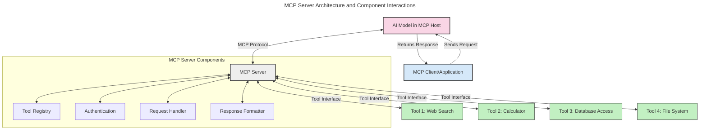
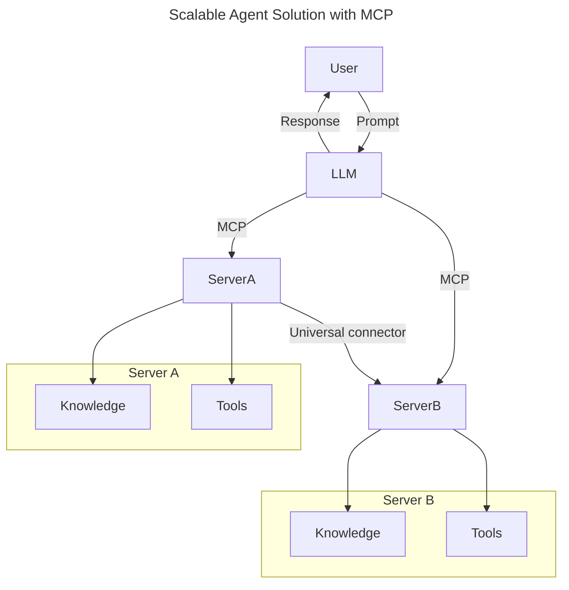
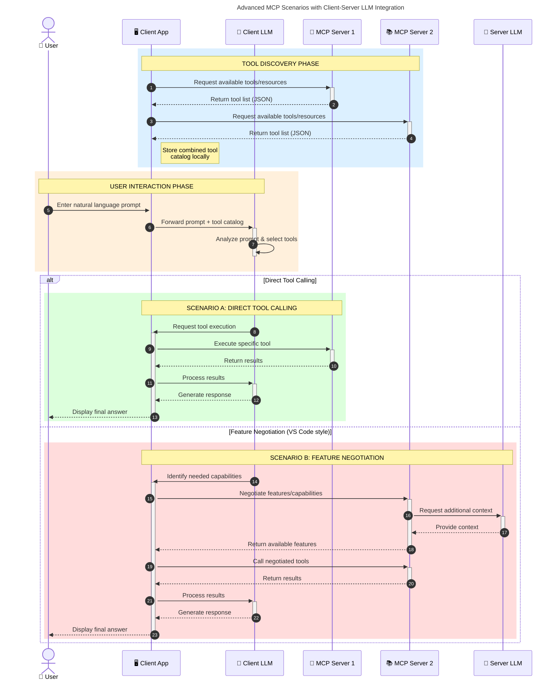

<!--
CO_OP_TRANSLATOR_METADATA:
{
  "original_hash": "1446979020432f512c883848d7eca144",
  "translation_date": "2025-05-29T21:51:21+00:00",
  "source_file": "00-Introduction/README.md",
  "language_code": "vi"
}
-->
# Giới thiệu về Model Context Protocol (MCP): Tại sao nó quan trọng đối với các ứng dụng AI có khả năng mở rộng

Các ứng dụng AI tạo sinh là một bước tiến lớn vì chúng thường cho phép người dùng tương tác với ứng dụng bằng các câu lệnh ngôn ngữ tự nhiên. Tuy nhiên, khi đầu tư nhiều thời gian và tài nguyên vào các ứng dụng này, bạn cần đảm bảo có thể dễ dàng tích hợp các chức năng và nguồn lực sao cho dễ mở rộng, ứng dụng có thể hỗ trợ nhiều mô hình cùng lúc và xử lý các đặc thù khác nhau của mô hình. Tóm lại, xây dựng ứng dụng Gen AI ban đầu rất dễ, nhưng khi chúng phát triển và trở nên phức tạp hơn, bạn cần bắt đầu xác định kiến trúc và có thể cần dựa vào một chuẩn để đảm bảo ứng dụng được xây dựng một cách nhất quán. Đây chính là lúc MCP xuất hiện để tổ chức mọi thứ và cung cấp một chuẩn mực.

---

## **🔍 Model Context Protocol (MCP) là gì?**

**Model Context Protocol (MCP)** là một **giao diện mở, chuẩn hóa** cho phép các Mô hình Ngôn ngữ Lớn (LLMs) tương tác mượt mà với các công cụ bên ngoài, API và nguồn dữ liệu. Nó cung cấp một kiến trúc nhất quán để nâng cao chức năng của mô hình AI vượt ra ngoài dữ liệu huấn luyện, giúp hệ thống AI thông minh hơn, có khả năng mở rộng và phản hồi nhanh hơn.

---

## **🎯 Tại sao chuẩn hóa trong AI lại quan trọng**

Khi các ứng dụng AI tạo sinh trở nên phức tạp hơn, việc áp dụng các chuẩn mực để đảm bảo **khả năng mở rộng, mở rộng tính năng** và **dễ bảo trì** là điều cần thiết. MCP giải quyết các nhu cầu này bằng cách:

- Thống nhất tích hợp giữa mô hình và công cụ
- Giảm thiểu các giải pháp tùy chỉnh riêng lẻ, dễ vỡ
- Cho phép nhiều mô hình cùng tồn tại trong một hệ sinh thái

---

## **📚 Mục tiêu học tập**

Sau khi đọc bài viết này, bạn sẽ có thể:

- Định nghĩa **Model Context Protocol (MCP)** và các trường hợp sử dụng của nó
- Hiểu cách MCP chuẩn hóa giao tiếp giữa mô hình và công cụ
- Nhận diện các thành phần chính trong kiến trúc MCP
- Khám phá các ứng dụng thực tế của MCP trong doanh nghiệp và phát triển

---

## **💡 Tại sao Model Context Protocol (MCP) là bước đột phá**

### **🔗 MCP giải quyết sự phân mảnh trong tương tác AI**

Trước MCP, việc tích hợp mô hình với công cụ đòi hỏi:

- Mã tùy chỉnh cho từng cặp công cụ-mô hình
- API không chuẩn cho từng nhà cung cấp
- Thường xuyên bị gián đoạn do cập nhật
- Khó mở rộng khi thêm nhiều công cụ

### **✅ Lợi ích của chuẩn hóa MCP**

| **Lợi ích**               | **Mô tả**                                                                     |
|--------------------------|-------------------------------------------------------------------------------|
| Tương tác đa nền tảng    | LLM hoạt động mượt mà với các công cụ từ nhiều nhà cung cấp khác nhau          |
| Tính nhất quán           | Hành vi đồng nhất trên các nền tảng và công cụ                                |
| Tái sử dụng              | Công cụ xây dựng một lần có thể dùng cho nhiều dự án và hệ thống              |
| Tăng tốc phát triển      | Giảm thời gian phát triển nhờ sử dụng giao diện chuẩn, cắm là chạy            |

---

## **🧱 Tổng quan kiến trúc MCP cấp cao**

MCP theo mô hình **client-server**, trong đó:

- **MCP Hosts** chạy các mô hình AI
- **MCP Clients** khởi tạo các yêu cầu
- **MCP Servers** cung cấp ngữ cảnh, công cụ và khả năng

### **Các thành phần chính:**

- **Resources** – Dữ liệu tĩnh hoặc động cho mô hình  
- **Prompts** – Các quy trình định sẵn để hướng dẫn tạo nội dung  
- **Tools** – Các hàm thực thi như tìm kiếm, tính toán  
- **Sampling** – Hành vi tác nhân qua tương tác đệ quy

---

## Cách MCP Servers hoạt động

MCP servers vận hành theo cách sau:

- **Luồng yêu cầu**:  
    1. MCP Client gửi yêu cầu đến mô hình AI đang chạy trên MCP Host.  
    2. Mô hình AI xác định khi nào cần công cụ hoặc dữ liệu bên ngoài.  
    3. Mô hình giao tiếp với MCP Server theo giao thức chuẩn hóa.

- **Chức năng MCP Server**:  
    - Đăng ký công cụ: Quản lý danh mục công cụ và khả năng của chúng.  
    - Xác thực: Kiểm tra quyền truy cập công cụ.  
    - Xử lý yêu cầu: Xử lý các yêu cầu công cụ từ mô hình.  
    - Định dạng phản hồi: Cấu trúc kết quả công cụ theo định dạng mô hình có thể hiểu.

- **Thực thi công cụ**:  
    - Server chuyển tiếp yêu cầu đến các công cụ bên ngoài phù hợp  
    - Công cụ thực hiện chức năng chuyên biệt (tìm kiếm, tính toán, truy vấn cơ sở dữ liệu, v.v.)  
    - Kết quả được trả về cho mô hình theo định dạng đồng nhất.

- **Hoàn thành phản hồi**:  
    - Mô hình AI tích hợp kết quả công cụ vào phản hồi của mình.  
    - Phản hồi cuối cùng được gửi lại ứng dụng client.

## 👨‍💻 Cách xây dựng MCP Server (Có ví dụ)

MCP servers cho phép bạn mở rộng khả năng của LLM bằng cách cung cấp dữ liệu và chức năng.

Sẵn sàng thử? Dưới đây là các ví dụ tạo MCP server đơn giản bằng các ngôn ngữ khác nhau:

- **Ví dụ Python**: https://github.com/modelcontextprotocol/python-sdk

- **Ví dụ TypeScript**: https://github.com/modelcontextprotocol/typescript-sdk

- **Ví dụ Java**: https://github.com/modelcontextprotocol/java-sdk

- **Ví dụ C#/.NET**: https://github.com/modelcontextprotocol/csharp-sdk

## 🌍 Các trường hợp sử dụng thực tế của MCP

MCP cho phép nhiều ứng dụng bằng cách mở rộng khả năng AI:

| **Ứng dụng**                 | **Mô tả**                                                                    |
|-----------------------------|------------------------------------------------------------------------------|
| Tích hợp dữ liệu doanh nghiệp| Kết nối LLM với cơ sở dữ liệu, CRM hoặc công cụ nội bộ                        |
| Hệ thống AI tác nhân         | Cho phép tác nhân tự động với quyền truy cập công cụ và quy trình ra quyết định |
| Ứng dụng đa phương thức      | Kết hợp công cụ văn bản, hình ảnh và âm thanh trong một ứng dụng AI thống nhất |
| Tích hợp dữ liệu thời gian thực| Đưa dữ liệu trực tiếp vào tương tác AI để kết quả chính xác và cập nhật hơn  |

### 🧠 MCP = Chuẩn mực phổ quát cho tương tác AI

Model Context Protocol (MCP) hoạt động như một chuẩn mực phổ quát cho tương tác AI, tương tự như USB-C chuẩn hóa kết nối vật lý cho thiết bị. Trong thế giới AI, MCP cung cấp một giao diện nhất quán, cho phép các mô hình (client) tích hợp mượt mà với các công cụ và nhà cung cấp dữ liệu bên ngoài (server). Điều này loại bỏ nhu cầu dùng nhiều giao thức tùy chỉnh khác nhau cho từng API hoặc nguồn dữ liệu.

Theo MCP, một công cụ tương thích MCP (gọi là MCP server) tuân theo một chuẩn thống nhất. Các server này có thể liệt kê các công cụ hoặc hành động mà chúng cung cấp và thực thi những hành động đó khi được tác nhân AI yêu cầu. Nền tảng tác nhân AI hỗ trợ MCP có thể phát hiện các công cụ sẵn có từ server và gọi chúng qua giao thức chuẩn này.

### 💡 Hỗ trợ truy cập kiến thức

Ngoài việc cung cấp công cụ, MCP còn hỗ trợ truy cập kiến thức. Nó cho phép ứng dụng cung cấp ngữ cảnh cho các mô hình ngôn ngữ lớn (LLM) bằng cách liên kết chúng với các nguồn dữ liệu khác nhau. Ví dụ, một MCP server có thể đại diện cho kho tài liệu của công ty, cho phép tác nhân truy xuất thông tin phù hợp khi cần. Một server khác có thể xử lý các hành động cụ thể như gửi email hoặc cập nhật hồ sơ. Với tác nhân, đây đơn giản là các công cụ có thể sử dụng — một số trả về dữ liệu (ngữ cảnh kiến thức), trong khi số khác thực hiện hành động. MCP quản lý hiệu quả cả hai loại này.

Một tác nhân kết nối với MCP server sẽ tự động biết được các khả năng và dữ liệu có thể truy cập của server thông qua định dạng chuẩn. Sự chuẩn hóa này cho phép công cụ sẵn sàng sử dụng một cách động. Ví dụ, thêm một MCP server mới vào hệ thống của tác nhân sẽ làm cho chức năng của server đó có thể dùng ngay mà không cần tùy chỉnh thêm hướng dẫn cho tác nhân.

Việc tích hợp trơn tru này phù hợp với luồng được mô tả trong sơ đồ mermaid, nơi các server cung cấp cả công cụ và kiến thức, đảm bảo sự hợp tác liền mạch giữa các hệ thống.

### 👉 Ví dụ: Giải pháp tác nhân có khả năng mở rộng

### 🔄 Các kịch bản MCP nâng cao với tích hợp LLM phía client

Ngoài kiến trúc MCP cơ bản, còn có các kịch bản nâng cao khi cả client và server đều chứa LLM, cho phép tương tác phức tạp hơn:

## 🔐 Lợi ích thực tiễn của MCP

Dưới đây là các lợi ích thực tế khi sử dụng MCP:

- **Cập nhật liên tục**: Mô hình có thể truy cập thông tin mới nhất ngoài dữ liệu huấn luyện  
- **Mở rộng khả năng**: Mô hình tận dụng công cụ chuyên biệt cho các tác vụ không được huấn luyện  
- **Giảm ảo tưởng**: Nguồn dữ liệu bên ngoài cung cấp cơ sở thực tế  
- **Bảo mật**: Dữ liệu nhạy cảm có thể giữ trong môi trường an toàn thay vì nhúng vào prompt

## 📌 Những điểm chính cần nhớ

Các điểm chính khi sử dụng MCP:

- **MCP** chuẩn hóa cách mô hình AI tương tác với công cụ và dữ liệu  
- Thúc đẩy **khả năng mở rộng, tính nhất quán và tương tác đa nền tảng**  
- MCP giúp **rút ngắn thời gian phát triển, nâng cao độ tin cậy và mở rộng khả năng mô hình**  
- Kiến trúc client-server **cho phép ứng dụng AI linh hoạt, dễ mở rộng**

## 🧠 Bài tập

Hãy suy nghĩ về một ứng dụng AI mà bạn muốn xây dựng.

- Những **công cụ hoặc dữ liệu bên ngoài** nào có thể nâng cao khả năng của nó?  
- MCP có thể giúp tích hợp trở nên **đơn giản và đáng tin cậy hơn** như thế nào?

## Tài nguyên bổ sung

- [MCP GitHub Repository](https://github.com/modelcontextprotocol)

## Tiếp theo

Tiếp: [Chương 1: Các khái niệm cốt lõi](/01-CoreConcepts/README.md)

**Tuyên bố từ chối trách nhiệm**:  
Tài liệu này đã được dịch bằng dịch vụ dịch thuật AI [Co-op Translator](https://github.com/Azure/co-op-translator). Mặc dù chúng tôi cố gắng đảm bảo độ chính xác, xin lưu ý rằng các bản dịch tự động có thể chứa lỗi hoặc sự không chính xác. Tài liệu gốc bằng ngôn ngữ nguyên bản nên được coi là nguồn chính xác và đáng tin cậy. Đối với các thông tin quan trọng, nên sử dụng dịch vụ dịch thuật chuyên nghiệp do con người thực hiện. Chúng tôi không chịu trách nhiệm đối với bất kỳ sự hiểu nhầm hoặc giải thích sai nào phát sinh từ việc sử dụng bản dịch này.