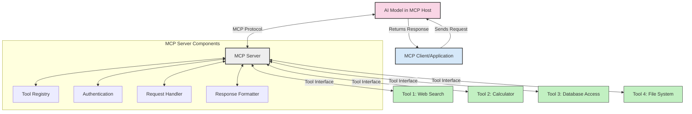
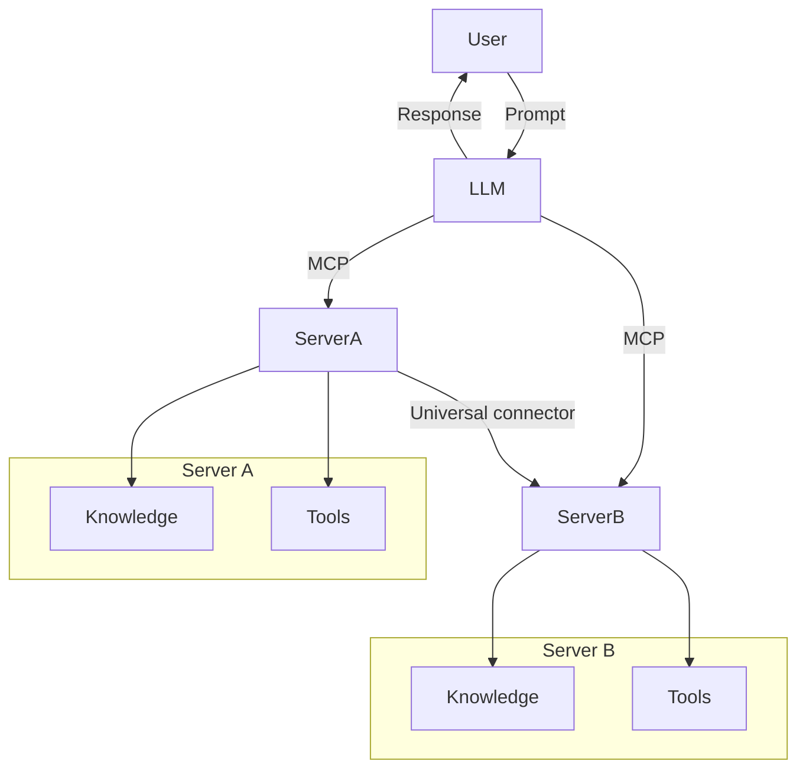

<!--
CO_OP_TRANSLATOR_METADATA:
{
  "original_hash": "02301140adbd807ecf0f17720fa307bc",
  "translation_date": "2025-05-17T06:05:29+00:00",
  "source_file": "00-Introduction/README.md",
  "language_code": "vi"
}
-->
# Giới thiệu về Giao thức Ngữ cảnh Mô hình (MCP): Tại sao nó quan trọng đối với ứng dụng AI có khả năng mở rộng

Các ứng dụng AI tạo sinh là một bước tiến lớn vì chúng thường cho phép người dùng tương tác với ứng dụng bằng các câu lệnh ngôn ngữ tự nhiên. Tuy nhiên, khi đầu tư nhiều thời gian và nguồn lực hơn vào các ứng dụng này, bạn muốn đảm bảo rằng bạn có thể dễ dàng tích hợp các chức năng và nguồn lực sao cho dễ dàng mở rộng, ứng dụng của bạn có thể đáp ứng nhiều mô hình được sử dụng và các phức tạp của nó. Tóm lại, việc xây dựng ứng dụng AI tạo sinh rất dễ dàng ban đầu nhưng khi nó phát triển và trở nên phức tạp hơn, bạn cần bắt đầu xác định kiến trúc và có khả năng cần dựa vào một tiêu chuẩn để đảm bảo ứng dụng của bạn được xây dựng một cách nhất quán. Đây là lúc MCP xuất hiện để tổ chức mọi thứ, cung cấp một tiêu chuẩn.

---

## **🔍 Giao thức Ngữ cảnh Mô hình (MCP) là gì?**

**Giao thức Ngữ cảnh Mô hình (MCP)** là một **giao diện mở, tiêu chuẩn hóa** cho phép các Mô hình Ngôn ngữ Lớn (LLMs) tương tác liền mạch với các công cụ, API và nguồn dữ liệu bên ngoài. Nó cung cấp một kiến trúc nhất quán để nâng cao chức năng của mô hình AI vượt ra ngoài dữ liệu đào tạo của chúng, cho phép hệ thống AI thông minh hơn, có khả năng mở rộng và phản hồi nhanh hơn.

---

## **🎯 Tại sao tiêu chuẩn hóa trong AI lại quan trọng**

Khi các ứng dụng AI tạo sinh trở nên phức tạp hơn, việc áp dụng các tiêu chuẩn đảm bảo **khả năng mở rộng, khả năng mở rộng** và **khả năng bảo trì** là rất quan trọng. MCP giải quyết những nhu cầu này bằng cách:

- Hợp nhất tích hợp mô hình-công cụ
- Giảm các giải pháp tùy chỉnh dễ vỡ
- Cho phép nhiều mô hình cùng tồn tại trong một hệ sinh thái

---

## **📚 Mục tiêu học tập**

Cuối bài viết này, bạn sẽ có thể:

- Định nghĩa **Giao thức Ngữ cảnh Mô hình (MCP)** và các trường hợp sử dụng của nó
- Hiểu cách MCP tiêu chuẩn hóa giao tiếp giữa mô hình và công cụ
- Xác định các thành phần cốt lõi của kiến trúc MCP
- Khám phá các ứng dụng thực tế của MCP trong bối cảnh doanh nghiệp và phát triển

---

## **💡 Tại sao Giao thức Ngữ cảnh Mô hình (MCP) là một bước đột phá**

### **🔗 MCP giải quyết sự phân mảnh trong tương tác AI**

Trước MCP, việc tích hợp mô hình với công cụ yêu cầu:

- Mã tùy chỉnh cho mỗi cặp mô hình-công cụ
- API không tiêu chuẩn cho mỗi nhà cung cấp
- Các lần ngắt thường xuyên do cập nhật
- Khả năng mở rộng kém với nhiều công cụ hơn

### **✅ Lợi ích của tiêu chuẩn hóa MCP**

| **Lợi ích**                | **Mô tả**                                                                      |
|----------------------------|--------------------------------------------------------------------------------|
| Khả năng tương tác         | LLMs hoạt động liền mạch với các công cụ từ các nhà cung cấp khác nhau         |
| Tính nhất quán             | Hành vi đồng nhất trên các nền tảng và công cụ                                 |
| Khả năng tái sử dụng       | Các công cụ được xây dựng một lần có thể sử dụng trên nhiều dự án và hệ thống   |
| Phát triển nhanh chóng     | Giảm thời gian phát triển bằng cách sử dụng các giao diện tiêu chuẩn, plug-and-play |

---

## **🧱 Tổng quan về Kiến trúc MCP cấp cao**

MCP tuân theo mô hình **client-server**, nơi:

- **MCP Hosts** chạy các mô hình AI
- **MCP Clients** khởi tạo yêu cầu
- **MCP Servers** cung cấp ngữ cảnh, công cụ và khả năng

### **Các thành phần chính:**

- **Nguồn lực** – Dữ liệu tĩnh hoặc động cho mô hình  
- **Lời nhắc** – Quy trình làm việc được xác định trước để hướng dẫn tạo sinh  
- **Công cụ** – Các chức năng có thể thực thi như tìm kiếm, tính toán  
- **Lấy mẫu** – Hành vi đại lý thông qua tương tác đệ quy

---

## Cách MCP Servers hoạt động

Máy chủ MCP hoạt động theo cách sau:

- **Luồng yêu cầu**: 
    1. MCP Client gửi yêu cầu đến Mô hình AI chạy trong MCP Host.
    2. Mô hình AI xác định khi nào cần công cụ hoặc dữ liệu bên ngoài.
    3. Mô hình giao tiếp với MCP Server bằng giao thức tiêu chuẩn.

- **Chức năng của MCP Server**:
    - Đăng ký công cụ: Duy trì danh mục các công cụ có sẵn và khả năng của chúng.
    - Xác thực: Kiểm tra quyền truy cập công cụ.
    - Xử lý yêu cầu: Xử lý các yêu cầu công cụ đến từ mô hình.
    - Định dạng phản hồi: Cấu trúc đầu ra công cụ theo định dạng mà mô hình có thể hiểu.

- **Thực thi công cụ**: 
    - Máy chủ định tuyến yêu cầu đến các công cụ bên ngoài thích hợp
    - Các công cụ thực thi chức năng chuyên biệt của chúng (tìm kiếm, tính toán, truy vấn cơ sở dữ liệu, v.v.)
    - Kết quả được trả về cho mô hình theo định dạng nhất quán.

- **Hoàn tất phản hồi**: 
    - Mô hình AI kết hợp đầu ra công cụ vào phản hồi của nó.
    - Phản hồi cuối cùng được gửi lại cho ứng dụng khách.

## 👨‍💻 Cách xây dựng MCP Server (Với ví dụ)

Máy chủ MCP cho phép bạn mở rộng khả năng LLM bằng cách cung cấp dữ liệu và chức năng.

Sẵn sàng thử nghiệm chưa? Dưới đây là ví dụ về cách tạo một máy chủ MCP đơn giản bằng các ngôn ngữ khác nhau:

- **Ví dụ Python**: https://github.com/modelcontextprotocol/python-sdk

- **Ví dụ TypeScript**: https://github.com/modelcontextprotocol/typescript-sdk

- **Ví dụ Java**: https://github.com/modelcontextprotocol/java-sdk

- **Ví dụ C#/.NET**: https://github.com/modelcontextprotocol/csharp-sdk

## 🌍 Các trường hợp sử dụng thực tế của MCP

MCP cho phép một loạt ứng dụng bằng cách mở rộng khả năng AI:

| **Ứng dụng**                  | **Mô tả**                                                                      |
|-------------------------------|--------------------------------------------------------------------------------|
| Tích hợp dữ liệu doanh nghiệp | Kết nối LLMs với cơ sở dữ liệu, CRM hoặc công cụ nội bộ                        |
| Hệ thống AI đại lý            | Cho phép các đại lý tự động với quyền truy cập công cụ và quy trình ra quyết định |
| Ứng dụng đa phương tiện       | Kết hợp văn bản, hình ảnh và âm thanh trong một ứng dụng AI duy nhất           |
| Tích hợp dữ liệu thời gian thực| Đưa dữ liệu trực tiếp vào tương tác AI để có đầu ra chính xác và hiện tại hơn  |

### 🧠 MCP = Tiêu chuẩn toàn cầu cho tương tác AI

Giao thức Ngữ cảnh Mô hình (MCP) hoạt động như một tiêu chuẩn toàn cầu cho tương tác AI, giống như cách USB-C tiêu chuẩn hóa kết nối vật lý cho các thiết bị. Trong thế giới AI, MCP cung cấp một giao diện nhất quán, cho phép các mô hình (khách hàng) tích hợp liền mạch với các công cụ và nhà cung cấp dữ liệu bên ngoài (máy chủ). Điều này loại bỏ nhu cầu về các giao thức tùy chỉnh đa dạng cho mỗi API hoặc nguồn dữ liệu.

Dưới MCP, một công cụ tương thích MCP (được gọi là máy chủ MCP) tuân theo một tiêu chuẩn thống nhất. Các máy chủ này có thể liệt kê các công cụ hoặc hành động mà chúng cung cấp và thực hiện các hành động đó khi được yêu cầu bởi một đại lý AI. Các nền tảng đại lý AI hỗ trợ MCP có khả năng phát hiện các công cụ có sẵn từ các máy chủ và gọi chúng thông qua giao thức tiêu chuẩn này.

### 💡 Cung cấp quyền truy cập vào kiến thức

Ngoài việc cung cấp công cụ, MCP còn tạo điều kiện truy cập vào kiến thức. Nó cho phép các ứng dụng cung cấp ngữ cảnh cho các mô hình ngôn ngữ lớn (LLMs) bằng cách liên kết chúng với các nguồn dữ liệu khác nhau. Ví dụ, một máy chủ MCP có thể đại diện cho kho tài liệu của một công ty, cho phép các đại lý truy xuất thông tin liên quan khi cần. Một máy chủ khác có thể xử lý các hành động cụ thể như gửi email hoặc cập nhật hồ sơ. Từ góc độ của đại lý, đây chỉ đơn giản là các công cụ mà nó có thể sử dụng—một số công cụ trả về dữ liệu (ngữ cảnh kiến thức), trong khi những công cụ khác thực hiện các hành động. MCP quản lý cả hai một cách hiệu quả.

Một đại lý kết nối với một máy chủ MCP tự động học được các khả năng có sẵn của máy chủ và dữ liệu có thể truy cập thông qua một định dạng tiêu chuẩn. Sự tiêu chuẩn hóa này cho phép tính khả dụng động của công cụ. Ví dụ, thêm một máy chủ MCP mới vào hệ thống của đại lý sẽ làm cho các chức năng của nó có thể sử dụng ngay lập tức mà không cần yêu cầu tùy chỉnh thêm hướng dẫn của đại lý.

Sự tích hợp hợp lý này phù hợp với luồng được mô tả trong sơ đồ mermaid, nơi các máy chủ cung cấp cả công cụ và kiến thức, đảm bảo sự hợp tác liền mạch giữa các hệ thống.

### 👉 Ví dụ: Giải pháp đại lý có khả năng mở rộng

## 🔐 Lợi ích thực tế của MCP

Dưới đây là một số lợi ích thực tế của việc sử dụng MCP:

- **Sự mới mẻ**: Các mô hình có thể truy cập thông tin cập nhật ngoài dữ liệu đào tạo của chúng
- **Mở rộng khả năng**: Các mô hình có thể tận dụng các công cụ chuyên biệt cho các nhiệm vụ mà chúng chưa được đào tạo
- **Giảm ảo giác**: Các nguồn dữ liệu bên ngoài cung cấp cơ sở thực tế
- **Bảo mật**: Dữ liệu nhạy cảm có thể giữ trong môi trường an toàn thay vì được nhúng trong các câu lệnh

## 📌 Những điểm chính cần lưu ý

Dưới đây là những điểm chính cần lưu ý khi sử dụng MCP:

- **MCP** tiêu chuẩn hóa cách các mô hình AI tương tác với công cụ và dữ liệu
- Thúc đẩy **khả năng mở rộng, tính nhất quán và khả năng tương tác**
- MCP giúp **giảm thời gian phát triển, cải thiện độ tin cậy và mở rộng khả năng mô hình**
- Kiến trúc client-server **cho phép các ứng dụng AI linh hoạt và mở rộng**

## 🧠 Bài tập

Hãy nghĩ về một ứng dụng AI mà bạn quan tâm đến việc xây dựng.

- Những **công cụ hoặc dữ liệu bên ngoài** nào có thể nâng cao khả năng của nó?
- MCP có thể làm cho việc tích hợp **đơn giản và đáng tin cậy hơn** như thế nào?

## Tài nguyên bổ sung

- [Kho lưu trữ GitHub của MCP](https://github.com/modelcontextprotocol)

## Tiếp theo

Tiếp theo: [Chương 1: Các khái niệm cốt lõi](/01-CoreConcepts/README.md)

**Tuyên bố miễn trừ trách nhiệm**:  
Tài liệu này đã được dịch bằng dịch vụ dịch thuật AI [Co-op Translator](https://github.com/Azure/co-op-translator). Mặc dù chúng tôi cố gắng đảm bảo độ chính xác, xin lưu ý rằng các bản dịch tự động có thể chứa lỗi hoặc sự không chính xác. Tài liệu gốc bằng ngôn ngữ bản địa nên được coi là nguồn thông tin có thẩm quyền. Đối với thông tin quan trọng, khuyến nghị sử dụng dịch vụ dịch thuật chuyên nghiệp của con người. Chúng tôi không chịu trách nhiệm cho bất kỳ sự hiểu lầm hoặc diễn giải sai nào phát sinh từ việc sử dụng bản dịch này.