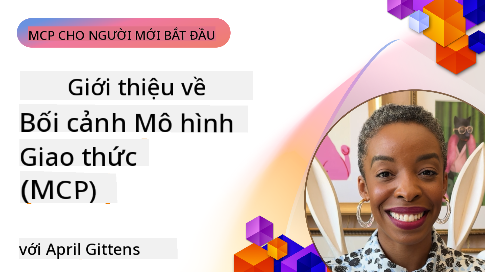
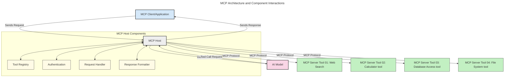
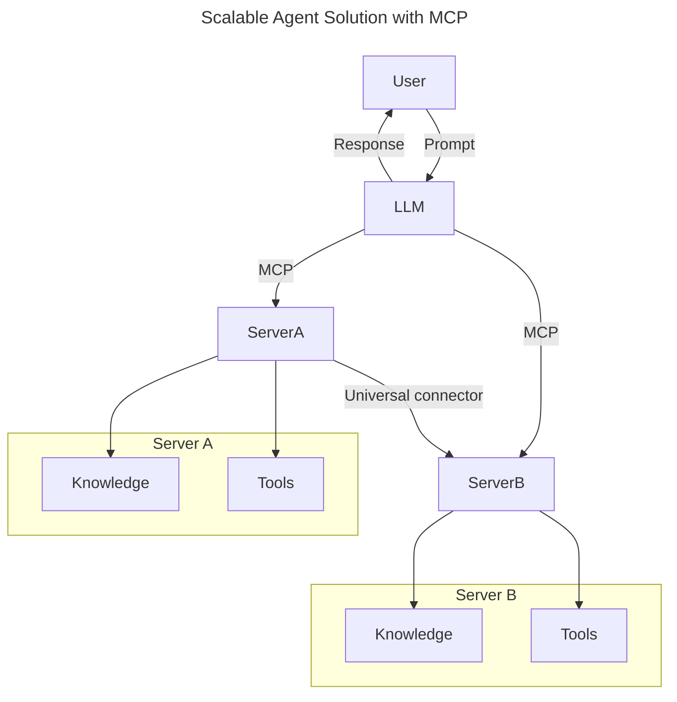
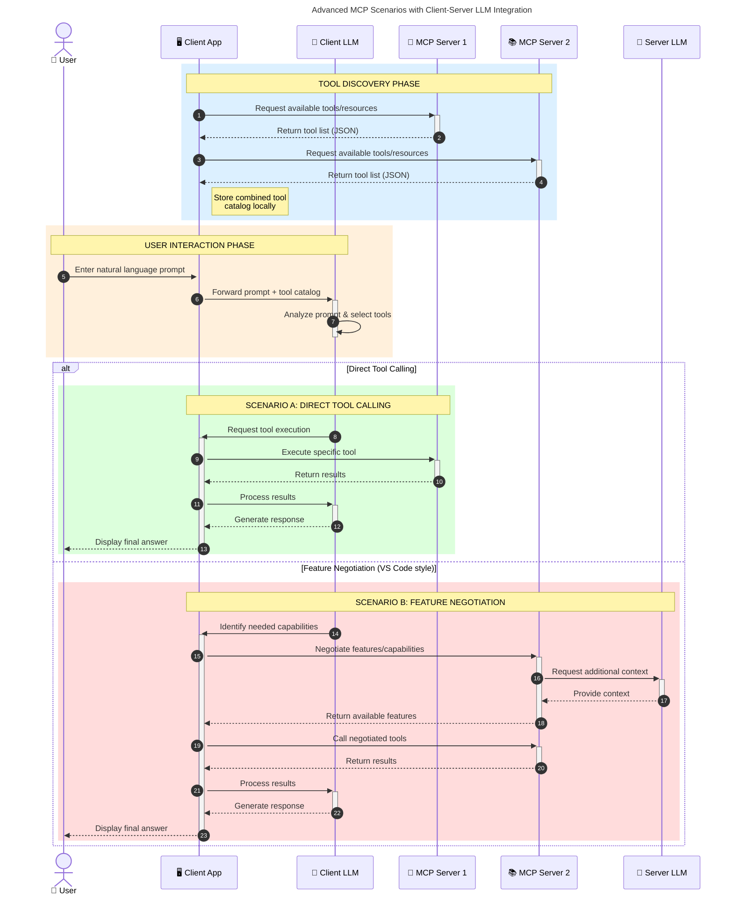

<!--
CO_OP_TRANSLATOR_METADATA:
{
  "original_hash": "0df1ee78a6dd8300f3a040ca5b411c2e",
  "translation_date": "2025-08-18T17:25:29+00:00",
  "source_file": "00-Introduction/README.md",
  "language_code": "vi"
}
-->
# Giới thiệu về Giao thức Ngữ cảnh Mô hình (MCP): Tại sao nó quan trọng đối với các ứng dụng AI mở rộng

_(Nhấp vào hình ảnh trên để xem video của bài học này)_

Các ứng dụng AI tạo sinh là một bước tiến lớn vì chúng thường cho phép người dùng tương tác với ứng dụng bằng các lời nhắc ngôn ngữ tự nhiên. Tuy nhiên, khi đầu tư nhiều thời gian và nguồn lực hơn vào các ứng dụng này, bạn cần đảm bảo rằng có thể dễ dàng tích hợp các chức năng và tài nguyên theo cách dễ mở rộng, ứng dụng của bạn có thể hỗ trợ nhiều mô hình khác nhau và xử lý các đặc điểm phức tạp của từng mô hình. Nói ngắn gọn, việc xây dựng các ứng dụng AI tạo sinh ban đầu khá dễ dàng, nhưng khi chúng phát triển và trở nên phức tạp hơn, bạn cần bắt đầu định nghĩa kiến trúc và có thể cần dựa vào một tiêu chuẩn để đảm bảo các ứng dụng của bạn được xây dựng một cách nhất quán. Đây chính là lúc MCP xuất hiện để tổ chức mọi thứ và cung cấp một tiêu chuẩn.

---

## **🔍 Giao thức Ngữ cảnh Mô hình (MCP) là gì?**

**Giao thức Ngữ cảnh Mô hình (MCP)** là một **giao diện mở, tiêu chuẩn hóa** cho phép các Mô hình Ngôn ngữ Lớn (LLMs) tương tác liền mạch với các công cụ, API và nguồn dữ liệu bên ngoài. Nó cung cấp một kiến trúc nhất quán để nâng cao chức năng của mô hình AI vượt ra ngoài dữ liệu huấn luyện, giúp tạo ra các hệ thống AI thông minh hơn, có khả năng mở rộng và phản hồi tốt hơn.

---

## **🎯 Tại sao tiêu chuẩn hóa trong AI lại quan trọng**

Khi các ứng dụng AI tạo sinh trở nên phức tạp hơn, việc áp dụng các tiêu chuẩn để đảm bảo **khả năng mở rộng, khả năng mở rộng, khả năng duy trì** và **tránh bị phụ thuộc vào nhà cung cấp** là rất cần thiết. MCP giải quyết những nhu cầu này bằng cách:

- Hợp nhất tích hợp giữa mô hình và công cụ
- Giảm các giải pháp tùy chỉnh dễ bị lỗi
- Cho phép nhiều mô hình từ các nhà cung cấp khác nhau cùng tồn tại trong một hệ sinh thái

**Lưu ý:** Mặc dù MCP tự quảng bá là một tiêu chuẩn mở, hiện không có kế hoạch tiêu chuẩn hóa MCP thông qua bất kỳ tổ chức tiêu chuẩn nào như IEEE, IETF, W3C, ISO hoặc bất kỳ tổ chức tiêu chuẩn nào khác.

---

## **📚 Mục tiêu học tập**

Sau khi đọc bài viết này, bạn sẽ có thể:

- Định nghĩa **Giao thức Ngữ cảnh Mô hình (MCP)** và các trường hợp sử dụng của nó
- Hiểu cách MCP tiêu chuẩn hóa giao tiếp giữa mô hình và công cụ
- Xác định các thành phần cốt lõi của kiến trúc MCP
- Khám phá các ứng dụng thực tế của MCP trong bối cảnh doanh nghiệp và phát triển

---

## **💡 Tại sao Giao thức Ngữ cảnh Mô hình (MCP) là một bước đột phá**

### **🔗 MCP Giải quyết sự phân mảnh trong tương tác AI**

Trước MCP, việc tích hợp mô hình với công cụ yêu cầu:

- Mã tùy chỉnh cho từng cặp công cụ-mô hình
- API không tiêu chuẩn cho mỗi nhà cung cấp
- Thường xuyên bị lỗi do cập nhật
- Khả năng mở rộng kém khi thêm nhiều công cụ

### **✅ Lợi ích của MCP tiêu chuẩn hóa**

| **Lợi ích**               | **Mô tả**                                                                      |
|---------------------------|--------------------------------------------------------------------------------|
| Tương thích               | LLMs hoạt động liền mạch với các công cụ từ các nhà cung cấp khác nhau         |
| Nhất quán                 | Hành vi đồng nhất trên các nền tảng và công cụ                                 |
| Tái sử dụng               | Công cụ được xây dựng một lần có thể sử dụng trong nhiều dự án và hệ thống      |
| Phát triển nhanh hơn      | Giảm thời gian phát triển nhờ giao diện tiêu chuẩn, dễ tích hợp                |

---

## **🧱 Tổng quan về Kiến trúc MCP ở cấp độ cao**

MCP tuân theo mô hình **client-server**, trong đó:

- **MCP Hosts** chạy các mô hình AI
- **MCP Clients** khởi tạo yêu cầu
- **MCP Servers** cung cấp ngữ cảnh, công cụ và khả năng

### **Các thành phần chính:**

- **Tài nguyên** – Dữ liệu tĩnh hoặc động cho mô hình  
- **Lời nhắc** – Quy trình làm việc được định trước để hướng dẫn tạo nội dung  
- **Công cụ** – Các chức năng có thể thực thi như tìm kiếm, tính toán  
- **Lấy mẫu** – Hành vi tác nhân thông qua các tương tác lặp lại

---

## Cách MCP Servers hoạt động

Các máy chủ MCP hoạt động theo cách sau:

- **Luồng yêu cầu**:
    1. Một yêu cầu được khởi tạo bởi người dùng cuối hoặc phần mềm thay mặt họ.
    2. **MCP Client** gửi yêu cầu đến **MCP Host**, nơi quản lý runtime của mô hình AI.
    3. **Mô hình AI** nhận lời nhắc từ người dùng và có thể yêu cầu truy cập vào các công cụ hoặc dữ liệu bên ngoài thông qua một hoặc nhiều cuộc gọi công cụ.
    4. **MCP Host**, chứ không phải mô hình trực tiếp, giao tiếp với **MCP Server(s)** thích hợp bằng giao thức tiêu chuẩn.
- **Chức năng của MCP Host**:
    - **Đăng ký công cụ**: Duy trì danh mục các công cụ có sẵn và khả năng của chúng.
    - **Xác thực**: Xác minh quyền truy cập vào công cụ.
    - **Xử lý yêu cầu**: Xử lý các yêu cầu công cụ đến từ mô hình.
    - **Định dạng phản hồi**: Cấu trúc đầu ra của công cụ theo định dạng mà mô hình có thể hiểu.
- **Thực thi MCP Server**:
    - **MCP Host** định tuyến các cuộc gọi công cụ đến một hoặc nhiều **MCP Server**, mỗi máy chủ cung cấp các chức năng chuyên biệt (ví dụ: tìm kiếm, tính toán, truy vấn cơ sở dữ liệu).
    - **MCP Servers** thực hiện các hoạt động tương ứng và trả kết quả về **MCP Host** theo định dạng nhất quán.
    - **MCP Host** định dạng và chuyển tiếp các kết quả này đến **Mô hình AI**.
- **Hoàn thành phản hồi**:
    - **Mô hình AI** kết hợp đầu ra của công cụ vào phản hồi cuối cùng.
    - **MCP Host** gửi phản hồi này trở lại **MCP Client**, nơi chuyển nó đến người dùng cuối hoặc phần mềm gọi.

## 👨‍💻 Cách xây dựng MCP Server (kèm ví dụ)

MCP Servers cho phép bạn mở rộng khả năng của LLM bằng cách cung cấp dữ liệu và chức năng.

Sẵn sàng thử nghiệm? Dưới đây là các SDK theo ngôn ngữ và/hoặc stack cụ thể với ví dụ về cách tạo MCP Servers đơn giản bằng các ngôn ngữ/stack khác nhau:

- **Python SDK**: https://github.com/modelcontextprotocol/python-sdk

- **TypeScript SDK**: https://github.com/modelcontextprotocol/typescript-sdk

- **Java SDK**: https://github.com/modelcontextprotocol/java-sdk

- **C#/.NET SDK**: https://github.com/modelcontextprotocol/csharp-sdk

---

## 🌍 Các trường hợp sử dụng thực tế của MCP

MCP mở rộng khả năng AI cho nhiều ứng dụng:

| **Ứng dụng**                | **Mô tả**                                                                      |
|-----------------------------|--------------------------------------------------------------------------------|
| Tích hợp dữ liệu doanh nghiệp| Kết nối LLMs với cơ sở dữ liệu, CRM hoặc công cụ nội bộ                        |
| Hệ thống AI tác nhân         | Cho phép các tác nhân tự động truy cập công cụ và quy trình ra quyết định      |
| Ứng dụng đa phương tiện      | Kết hợp văn bản, hình ảnh và âm thanh trong một ứng dụng AI thống nhất         |
| Tích hợp dữ liệu thời gian thực| Đưa dữ liệu trực tiếp vào tương tác AI để có đầu ra chính xác và cập nhật hơn |

### 🧠 MCP = Tiêu chuẩn toàn cầu cho tương tác AI

Giao thức Ngữ cảnh Mô hình (MCP) hoạt động như một tiêu chuẩn toàn cầu cho tương tác AI, giống như cách USB-C tiêu chuẩn hóa kết nối vật lý cho các thiết bị. Trong thế giới AI, MCP cung cấp một giao diện nhất quán, cho phép các mô hình (clients) tích hợp liền mạch với các công cụ và nhà cung cấp dữ liệu bên ngoài (servers). Điều này loại bỏ nhu cầu về các giao thức tùy chỉnh đa dạng cho mỗi API hoặc nguồn dữ liệu.

Dưới MCP, một công cụ tương thích MCP (được gọi là MCP server) tuân theo tiêu chuẩn thống nhất. Các máy chủ này có thể liệt kê các công cụ hoặc hành động mà chúng cung cấp và thực hiện các hành động đó khi được yêu cầu bởi một tác nhân AI. Các nền tảng tác nhân AI hỗ trợ MCP có khả năng khám phá các công cụ có sẵn từ các máy chủ và gọi chúng thông qua giao thức tiêu chuẩn này.

### 💡 Tạo điều kiện truy cập kiến thức

Ngoài việc cung cấp công cụ, MCP còn tạo điều kiện truy cập kiến thức. Nó cho phép các ứng dụng cung cấp ngữ cảnh cho các mô hình ngôn ngữ lớn (LLMs) bằng cách liên kết chúng với các nguồn dữ liệu khác nhau. Ví dụ, một MCP server có thể đại diện cho kho tài liệu của một công ty, cho phép các tác nhân truy xuất thông tin liên quan theo yêu cầu. Một máy chủ khác có thể xử lý các hành động cụ thể như gửi email hoặc cập nhật hồ sơ. Từ góc nhìn của tác nhân, đây chỉ là các công cụ mà nó có thể sử dụng—một số công cụ trả về dữ liệu (ngữ cảnh kiến thức), trong khi các công cụ khác thực hiện hành động. MCP quản lý cả hai một cách hiệu quả.

Một tác nhân kết nối với MCP server tự động học được các khả năng và dữ liệu có thể truy cập của máy chủ thông qua định dạng tiêu chuẩn. Sự tiêu chuẩn hóa này cho phép công cụ khả dụng một cách động. Ví dụ, việc thêm một MCP server mới vào hệ thống của tác nhân làm cho các chức năng của nó có thể sử dụng ngay lập tức mà không cần tùy chỉnh thêm hướng dẫn của tác nhân.

Sự tích hợp hợp lý này phù hợp với luồng được mô tả trong sơ đồ sau, nơi các máy chủ cung cấp cả công cụ và kiến thức, đảm bảo sự hợp tác liền mạch giữa các hệ thống.

### 👉 Ví dụ: Giải pháp tác nhân mở rộng

### 🔄 Các kịch bản MCP nâng cao với tích hợp LLM phía client

Ngoài kiến trúc MCP cơ bản, còn có các kịch bản nâng cao nơi cả client và server đều chứa LLMs, cho phép các tương tác phức tạp hơn. Trong sơ đồ sau, **Client App** có thể là một IDE với một số công cụ MCP có sẵn để LLM sử dụng:

---

## 🔐 Lợi ích thực tiễn của MCP

Dưới đây là các lợi ích thực tiễn của việc sử dụng MCP:

- **Cập nhật thông tin**: Các mô hình có thể truy cập thông tin mới nhất ngoài dữ liệu huấn luyện
- **Mở rộng khả năng**: Các mô hình có thể tận dụng các công cụ chuyên biệt cho các nhiệm vụ mà chúng chưa được huấn luyện
- **Giảm sai lệch**: Các nguồn dữ liệu bên ngoài cung cấp nền tảng thực tế
- **Bảo mật**: Dữ liệu nhạy cảm có thể được giữ trong môi trường an toàn thay vì được nhúng vào lời nhắc

---

## 📌 Những điểm chính cần nhớ

Dưới đây là những điểm chính khi sử dụng MCP:

- **MCP** tiêu chuẩn hóa cách các mô hình AI tương tác với công cụ và dữ liệu
- Thúc đẩy **khả năng mở rộng, nhất quán và tương thích**
- MCP giúp **giảm thời gian phát triển, cải thiện độ tin cậy và mở rộng khả năng của mô hình**
- Kiến trúc client-server **cho phép các ứng dụng AI linh hoạt và mở rộng**

---

## 🧠 Bài tập

Hãy nghĩ về một ứng dụng AI mà bạn muốn xây dựng.

- Những **công cụ hoặc dữ liệu bên ngoài** nào có thể nâng cao khả năng của nó?
- MCP có thể làm cho việc tích hợp **đơn giản và đáng tin cậy hơn** như thế nào?

---

## Tài nguyên bổ sung

- [Kho lưu trữ GitHub của MCP](https://github.com/modelcontextprotocol)

---

## Tiếp theo

Tiếp theo: [Chương 1: Các khái niệm cốt lõi](../01-CoreConcepts/README.md)

**Tuyên bố miễn trừ trách nhiệm**:  
Tài liệu này đã được dịch bằng dịch vụ dịch thuật AI [Co-op Translator](https://github.com/Azure/co-op-translator). Mặc dù chúng tôi cố gắng đảm bảo độ chính xác, xin lưu ý rằng các bản dịch tự động có thể chứa lỗi hoặc không chính xác. Tài liệu gốc bằng ngôn ngữ bản địa nên được coi là nguồn tham khảo chính thức. Đối với các thông tin quan trọng, chúng tôi khuyến nghị sử dụng dịch vụ dịch thuật chuyên nghiệp từ con người. Chúng tôi không chịu trách nhiệm cho bất kỳ sự hiểu lầm hoặc diễn giải sai nào phát sinh từ việc sử dụng bản dịch này.