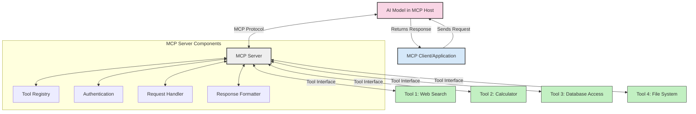
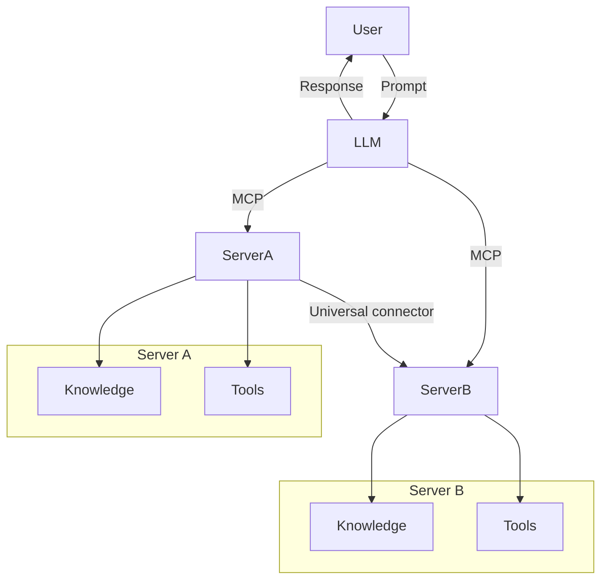

<!--
CO_OP_TRANSLATOR_METADATA:
{
  "original_hash": "cf84f987e1b771d2201408e110dfd2db",
  "translation_date": "2025-05-20T17:39:10+00:00",
  "source_file": "00-Introduction/README.md",
  "language_code": "vi"
}
-->
# Giới thiệu về Model Context Protocol (MCP): Tại sao nó quan trọng đối với các ứng dụng AI có khả năng mở rộng

Các ứng dụng AI tạo sinh là bước tiến lớn khi chúng thường cho phép người dùng tương tác với ứng dụng bằng các câu lệnh ngôn ngữ tự nhiên. Tuy nhiên, khi đầu tư nhiều thời gian và tài nguyên vào các ứng dụng như vậy, bạn muốn đảm bảo có thể dễ dàng tích hợp các chức năng và tài nguyên sao cho dễ mở rộng, ứng dụng có thể phục vụ nhiều mô hình cùng lúc và xử lý các chi tiết phức tạp. Tóm lại, xây dựng ứng dụng Gen AI ban đầu khá đơn giản nhưng khi phát triển và trở nên phức tạp hơn, bạn cần bắt đầu định nghĩa kiến trúc và rất có thể phải dựa vào một chuẩn để đảm bảo các ứng dụng được xây dựng một cách nhất quán. Đây chính là lúc MCP xuất hiện để tổ chức mọi thứ, cung cấp một chuẩn mực.

---

## **🔍 Model Context Protocol (MCP) là gì?**

**Model Context Protocol (MCP)** là một **giao diện mở, chuẩn hóa** cho phép các Mô hình Ngôn ngữ Lớn (LLMs) tương tác mượt mà với các công cụ bên ngoài, API và nguồn dữ liệu. Nó cung cấp một kiến trúc nhất quán để nâng cao chức năng của mô hình AI vượt ra ngoài dữ liệu huấn luyện, giúp hệ thống AI thông minh hơn, có khả năng mở rộng và phản hồi nhanh hơn.

---

## **🎯 Tại sao chuẩn hóa trong AI lại quan trọng**

Khi các ứng dụng AI tạo sinh ngày càng phức tạp, việc áp dụng các chuẩn mực đảm bảo **khả năng mở rộng, khả năng mở rộng thêm chức năng** và **dễ bảo trì** là rất cần thiết. MCP giải quyết những nhu cầu này bằng cách:

- Hợp nhất tích hợp mô hình-công cụ
- Giảm thiểu các giải pháp tùy chỉnh rời rạc, dễ vỡ
- Cho phép nhiều mô hình cùng tồn tại trong một hệ sinh thái

---

## **📚 Mục tiêu học tập**

Sau khi đọc bài viết này, bạn sẽ có thể:

- Định nghĩa **Model Context Protocol (MCP)** và các trường hợp sử dụng của nó
- Hiểu cách MCP chuẩn hóa giao tiếp giữa mô hình và công cụ
- Nhận diện các thành phần cốt lõi trong kiến trúc MCP
- Khám phá các ứng dụng thực tế của MCP trong doanh nghiệp và phát triển

---

## **💡 Tại sao Model Context Protocol (MCP) là bước đột phá**

### **🔗 MCP giải quyết sự phân mảnh trong tương tác AI**

Trước MCP, việc tích hợp mô hình với công cụ đòi hỏi:

- Mã tùy chỉnh cho từng cặp công cụ-mô hình
- API không chuẩn cho mỗi nhà cung cấp
- Thường xuyên bị gián đoạn do cập nhật
- Khả năng mở rộng kém khi có nhiều công cụ hơn

### **✅ Lợi ích của chuẩn hóa MCP**

| **Lợi ích**              | **Mô tả**                                                                |
|--------------------------|-------------------------------------------------------------------------|
| Tính tương tác           | LLMs hoạt động mượt mà với các công cụ từ nhiều nhà cung cấp khác nhau  |
| Tính nhất quán           | Hành vi đồng nhất trên các nền tảng và công cụ                          |
| Tái sử dụng              | Công cụ xây dựng một lần có thể dùng lại trong nhiều dự án và hệ thống  |
| Tăng tốc phát triển      | Giảm thời gian phát triển nhờ sử dụng giao diện chuẩn, cắm là chạy     |

---

## **🧱 Tổng quan kiến trúc MCP cấp cao**

MCP theo mô hình **client-server**, trong đó:

- **MCP Hosts** chạy các mô hình AI
- **MCP Clients** khởi tạo các yêu cầu
- **MCP Servers** cung cấp ngữ cảnh, công cụ và khả năng

### **Các thành phần chính:**

- **Resources** – Dữ liệu tĩnh hoặc động cho mô hình  
- **Prompts** – Các quy trình được định nghĩa trước để hướng dẫn tạo nội dung  
- **Tools** – Các hàm thực thi như tìm kiếm, tính toán  
- **Sampling** – Hành vi tác nhân thông qua tương tác đệ quy

---

## Cách MCP Servers hoạt động

MCP servers vận hành theo cách sau:

- **Luồng yêu cầu**:  
    1. MCP Client gửi yêu cầu tới mô hình AI chạy trong MCP Host.  
    2. Mô hình AI xác định khi nào cần công cụ hoặc dữ liệu bên ngoài.  
    3. Mô hình giao tiếp với MCP Server theo giao thức chuẩn.

- **Chức năng của MCP Server**:  
    - Tool Registry: Quản lý danh mục các công cụ và khả năng của chúng.  
    - Authentication: Xác thực quyền truy cập công cụ.  
    - Request Handler: Xử lý các yêu cầu công cụ từ mô hình.  
    - Response Formatter: Định dạng đầu ra công cụ theo dạng mô hình có thể hiểu.

- **Thực thi công cụ**:  
    - Server chuyển tiếp yêu cầu tới các công cụ bên ngoài phù hợp  
    - Công cụ thực hiện chức năng chuyên biệt (tìm kiếm, tính toán, truy vấn cơ sở dữ liệu, v.v.)  
    - Kết quả được trả về mô hình theo định dạng thống nhất.

- **Hoàn thiện phản hồi**:  
    - Mô hình AI tích hợp đầu ra công cụ vào phản hồi của mình.  
    - Phản hồi cuối cùng được gửi lại ứng dụng client.

## 👨‍💻 Cách xây dựng MCP Server (kèm ví dụ)

MCP servers cho phép bạn mở rộng khả năng của LLM bằng cách cung cấp dữ liệu và chức năng.

Sẵn sàng thử? Dưới đây là ví dụ về cách tạo MCP server đơn giản bằng các ngôn ngữ khác nhau:

- **Python Example**: https://github.com/modelcontextprotocol/python-sdk

- **TypeScript Example**: https://github.com/modelcontextprotocol/typescript-sdk

- **Java Example**: https://github.com/modelcontextprotocol/java-sdk

- **C#/.NET Example**: https://github.com/modelcontextprotocol/csharp-sdk

## 🌍 Các trường hợp sử dụng thực tế của MCP

MCP mở rộng khả năng AI cho nhiều ứng dụng khác nhau:

| **Ứng dụng**                | **Mô tả**                                                                  |
|----------------------------|---------------------------------------------------------------------------|
| Tích hợp dữ liệu doanh nghiệp | Kết nối LLMs với cơ sở dữ liệu, CRM hoặc công cụ nội bộ                   |
| Hệ thống AI tác nhân        | Cho phép các tác nhân tự động với quyền truy cập công cụ và quy trình quyết định |
| Ứng dụng đa phương thức     | Kết hợp công cụ xử lý văn bản, hình ảnh và âm thanh trong một ứng dụng AI thống nhất |
| Tích hợp dữ liệu thời gian thực | Đưa dữ liệu trực tiếp vào tương tác AI để có kết quả chính xác và cập nhật hơn |

### 🧠 MCP = Chuẩn mực toàn cầu cho tương tác AI

Model Context Protocol (MCP) hoạt động như một chuẩn mực toàn cầu cho tương tác AI, giống như USB-C đã chuẩn hóa kết nối vật lý cho thiết bị. Trong thế giới AI, MCP cung cấp một giao diện nhất quán, cho phép các mô hình (client) tích hợp mượt mà với các công cụ và nhà cung cấp dữ liệu bên ngoài (server). Điều này loại bỏ nhu cầu sử dụng các giao thức tùy chỉnh đa dạng cho từng API hoặc nguồn dữ liệu.

Dưới MCP, một công cụ tương thích MCP (gọi là MCP server) tuân theo một chuẩn thống nhất. Các server này có thể liệt kê các công cụ hoặc hành động mà họ cung cấp và thực thi các hành động đó khi được tác nhân AI yêu cầu. Nền tảng tác nhân AI hỗ trợ MCP có thể phát hiện các công cụ có sẵn từ server và gọi chúng thông qua giao thức chuẩn này.

### 💡 Tạo điều kiện truy cập kiến thức

Ngoài việc cung cấp công cụ, MCP còn giúp truy cập kiến thức. Nó cho phép ứng dụng cung cấp ngữ cảnh cho các mô hình ngôn ngữ lớn (LLMs) bằng cách liên kết chúng với nhiều nguồn dữ liệu khác nhau. Ví dụ, một MCP server có thể đại diện cho kho tài liệu của công ty, cho phép các tác nhân truy xuất thông tin liên quan khi cần. Một server khác có thể xử lý các hành động cụ thể như gửi email hoặc cập nhật hồ sơ. Từ góc nhìn của tác nhân, đây đơn giản là các công cụ có thể sử dụng — một số công cụ trả về dữ liệu (ngữ cảnh kiến thức), trong khi số khác thực hiện hành động. MCP quản lý hiệu quả cả hai.

Một tác nhân kết nối với MCP server tự động học được các khả năng và dữ liệu có thể truy cập của server thông qua định dạng chuẩn. Sự chuẩn hóa này cho phép tính năng công cụ có thể thay đổi động. Ví dụ, thêm một MCP server mới vào hệ thống của tác nhân sẽ khiến các chức năng của server đó có thể sử dụng ngay mà không cần tùy chỉnh thêm cho hướng dẫn của tác nhân.

Sự tích hợp tinh gọn này phù hợp với luồng được mô tả trong sơ đồ mermaid, nơi các server cung cấp cả công cụ và kiến thức, đảm bảo sự phối hợp liền mạch giữa các hệ thống.

### 👉 Ví dụ: Giải pháp tác nhân có khả năng mở rộng

## 🔐 Lợi ích thực tế của MCP

Dưới đây là các lợi ích thực tế khi sử dụng MCP:

- **Cập nhật**: Mô hình có thể truy cập thông tin mới nhất vượt ra ngoài dữ liệu huấn luyện  
- **Mở rộng khả năng**: Mô hình có thể tận dụng công cụ chuyên biệt cho các nhiệm vụ chưa được huấn luyện  
- **Giảm ảo tưởng**: Nguồn dữ liệu bên ngoài cung cấp nền tảng thực tế  
- **Bảo mật**: Dữ liệu nhạy cảm có thể được giữ trong môi trường an toàn thay vì nhúng vào prompt

## 📌 Những điểm chính cần nhớ

Dưới đây là những điểm chính khi sử dụng MCP:

- **MCP** chuẩn hóa cách mô hình AI tương tác với công cụ và dữ liệu  
- Thúc đẩy **khả năng mở rộng, tính nhất quán và tính tương tác**  
- MCP giúp **rút ngắn thời gian phát triển, cải thiện độ tin cậy và mở rộng khả năng mô hình**  
- Kiến trúc client-server **cho phép ứng dụng AI linh hoạt và dễ mở rộng**

## 🧠 Bài tập

Hãy nghĩ về một ứng dụng AI bạn muốn xây dựng.

- Công cụ hoặc dữ liệu bên ngoài nào có thể nâng cao khả năng của nó?  
- MCP có thể giúp việc tích hợp trở nên **đơn giản và đáng tin cậy hơn** như thế nào?

## Tài nguyên bổ sung

- [MCP GitHub Repository](https://github.com/modelcontextprotocol)

## Tiếp theo

Tiếp: [Chapter 1: Core Concepts](/01-CoreConcepts/README.md)

**Tuyên bố từ chối trách nhiệm**:  
Tài liệu này đã được dịch bằng dịch vụ dịch thuật AI [Co-op Translator](https://github.com/Azure/co-op-translator). Mặc dù chúng tôi cố gắng đảm bảo độ chính xác, xin lưu ý rằng các bản dịch tự động có thể chứa lỗi hoặc không chính xác. Tài liệu gốc bằng ngôn ngữ gốc nên được xem là nguồn tham khảo chính thức. Đối với các thông tin quan trọng, khuyến nghị sử dụng dịch vụ dịch thuật chuyên nghiệp của con người. Chúng tôi không chịu trách nhiệm về bất kỳ sự hiểu lầm hoặc giải thích sai nào phát sinh từ việc sử dụng bản dịch này.