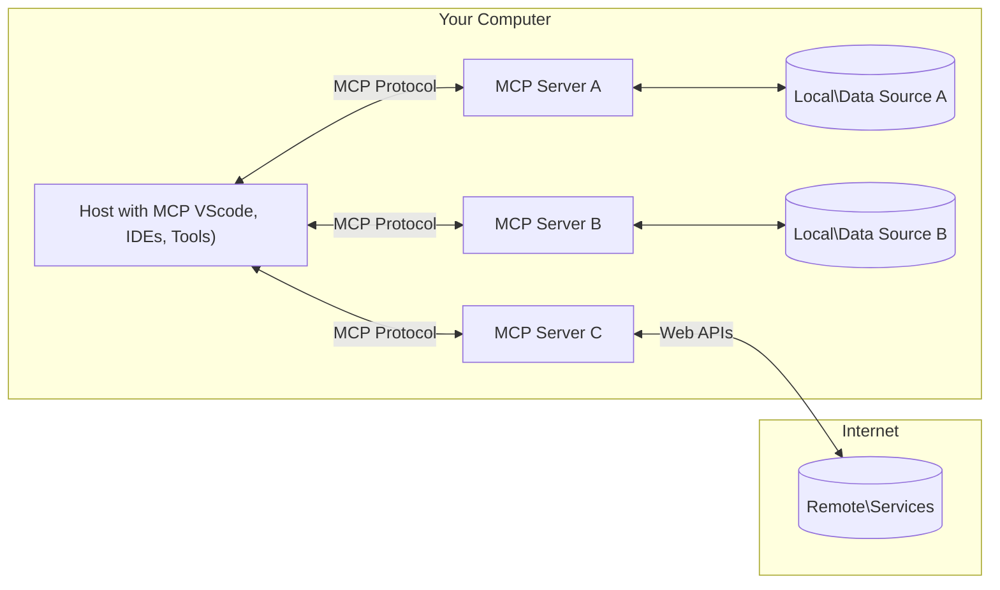

<!--
CO_OP_TRANSLATOR_METADATA:
{
  "original_hash": "b3b4a6ad10c3c0edbf7fa7cfa0ec496b",
  "translation_date": "2025-07-02T07:24:19+00:00",
  "source_file": "01-CoreConcepts/README.md",
  "language_code": "vi"
}
-->
# 📖 Khái niệm cốt lõi MCP: Làm chủ Model Context Protocol để tích hợp AI

[Model Context Protocol (MCP)](https://github.com/modelcontextprotocol) là một khuôn khổ chuẩn hóa mạnh mẽ giúp tối ưu hóa giao tiếp giữa các Mô hình Ngôn ngữ Lớn (LLMs) và các công cụ, ứng dụng, nguồn dữ liệu bên ngoài. Hướng dẫn tối ưu hóa SEO này sẽ giúp bạn hiểu rõ các khái niệm cốt lõi của MCP, đảm bảo bạn nắm được kiến trúc client-server, các thành phần thiết yếu, cơ chế giao tiếp và các thực hành triển khai tốt nhất.

## Tổng quan

Bài học này khám phá kiến trúc cơ bản và các thành phần cấu thành hệ sinh thái Model Context Protocol (MCP). Bạn sẽ tìm hiểu về kiến trúc client-server, các thành phần chính và cơ chế giao tiếp tạo nên sự vận hành của MCP.

## 👩‍🎓 Mục tiêu học tập chính

Sau bài học này, bạn sẽ:

- Hiểu kiến trúc client-server của MCP.
- Xác định vai trò và trách nhiệm của Hosts, Clients và Servers.
- Phân tích các tính năng cốt lõi giúp MCP trở thành lớp tích hợp linh hoạt.
- Học cách thông tin được truyền tải trong hệ sinh thái MCP.
- Có cái nhìn thực tế qua các ví dụ mã nguồn trên .NET, Java, Python và JavaScript.

## 🔎 Kiến trúc MCP: Cái nhìn sâu hơn

Hệ sinh thái MCP được xây dựng trên mô hình client-server. Cấu trúc mô-đun này cho phép các ứng dụng AI tương tác hiệu quả với các công cụ, cơ sở dữ liệu, API và tài nguyên ngữ cảnh. Hãy cùng phân tích kiến trúc này qua các thành phần cốt lõi.

Ở trung tâm, MCP tuân theo kiến trúc client-server, trong đó một ứng dụng host có thể kết nối với nhiều server:



- **MCP Hosts**: Các chương trình như VSCode, Claude Desktop, IDEs hoặc công cụ AI muốn truy cập dữ liệu qua MCP
- **MCP Clients**: Các client của giao thức duy trì kết nối 1:1 với server
- **MCP Servers**: Các chương trình nhẹ cung cấp các khả năng cụ thể thông qua Model Context Protocol chuẩn hóa
- **Nguồn dữ liệu cục bộ**: Tệp, cơ sở dữ liệu và dịch vụ trên máy tính mà các MCP server có thể truy cập an toàn
- **Dịch vụ từ xa**: Hệ thống bên ngoài trên internet mà các MCP server có thể kết nối qua API.

Giao thức MCP là một tiêu chuẩn đang phát triển, bạn có thể xem các cập nhật mới nhất tại [đặc tả giao thức](https://modelcontextprotocol.io/specification/2025-06-18/)

### 1. Hosts

Trong Model Context Protocol (MCP), Hosts đóng vai trò quan trọng như giao diện chính để người dùng tương tác với giao thức. Hosts là các ứng dụng hoặc môi trường khởi tạo kết nối với các MCP server để truy cập dữ liệu, công cụ và các prompt. Ví dụ về Hosts bao gồm các môi trường phát triển tích hợp (IDEs) như Visual Studio Code, công cụ AI như Claude Desktop, hoặc các tác nhân tùy chỉnh được thiết kế cho các nhiệm vụ cụ thể.

**Hosts** là các ứng dụng LLM khởi tạo kết nối. Họ:

- Thực thi hoặc tương tác với mô hình AI để tạo phản hồi.
- Khởi tạo kết nối với các MCP server.
- Quản lý luồng hội thoại và giao diện người dùng.
- Kiểm soát quyền hạn và các ràng buộc bảo mật.
- Xử lý sự đồng ý của người dùng cho việc chia sẻ dữ liệu và thực thi công cụ.

### 2. Clients

Clients là thành phần thiết yếu giúp tạo điều kiện cho sự tương tác giữa Hosts và MCP server. Clients đóng vai trò trung gian, cho phép Hosts truy cập và sử dụng các chức năng do MCP server cung cấp. Họ đóng vai trò quan trọng trong việc đảm bảo giao tiếp trơn tru và trao đổi dữ liệu hiệu quả trong kiến trúc MCP.

**Clients** là các bộ kết nối trong ứng dụng host. Họ:

- Gửi yêu cầu đến server với các prompt/hướng dẫn.
- Đàm phán khả năng với server.
- Quản lý các yêu cầu thực thi công cụ từ mô hình.
- Xử lý và hiển thị phản hồi cho người dùng.

### 3. Servers

Servers chịu trách nhiệm xử lý các yêu cầu từ MCP clients và cung cấp phản hồi phù hợp. Họ quản lý các hoạt động như truy xuất dữ liệu, thực thi công cụ và tạo prompt. Servers đảm bảo giao tiếp giữa clients và Hosts hiệu quả, đáng tin cậy, giữ vững tính toàn vẹn của quá trình tương tác.

**Servers** là các dịch vụ cung cấp ngữ cảnh và khả năng. Họ:

- Đăng ký các tính năng sẵn có (tài nguyên, prompt, công cụ)
- Nhận và thực thi các lệnh gọi công cụ từ client
- Cung cấp thông tin ngữ cảnh để nâng cao phản hồi của mô hình
- Trả kết quả về client
- Duy trì trạng thái qua các tương tác khi cần thiết

Servers có thể được phát triển bởi bất kỳ ai để mở rộng khả năng mô hình với các chức năng chuyên biệt.

### 4. Tính năng của Server

Servers trong Model Context Protocol (MCP) cung cấp các thành phần cơ bản giúp tương tác phong phú giữa clients, hosts và mô hình ngôn ngữ. Các tính năng này được thiết kế để nâng cao khả năng của MCP bằng cách cung cấp ngữ cảnh có cấu trúc, công cụ và prompt.

MCP servers có thể cung cấp bất kỳ tính năng nào sau đây:

#### 📑 Tài nguyên

Tài nguyên trong Model Context Protocol (MCP) bao gồm nhiều loại ngữ cảnh và dữ liệu có thể được người dùng hoặc mô hình AI sử dụng. Bao gồm:

- **Dữ liệu ngữ cảnh**: Thông tin và ngữ cảnh mà người dùng hoặc mô hình AI có thể tận dụng để đưa ra quyết định và thực hiện nhiệm vụ.
- **Cơ sở tri thức và kho tài liệu**: Bộ sưu tập dữ liệu có cấu trúc và không có cấu trúc như bài viết, hướng dẫn, tài liệu nghiên cứu cung cấp thông tin giá trị.
- **Tệp và cơ sở dữ liệu cục bộ**: Dữ liệu lưu trữ trên thiết bị hoặc trong cơ sở dữ liệu, có thể truy cập để xử lý và phân tích.
- **API và dịch vụ web**: Các giao diện và dịch vụ bên ngoài cung cấp dữ liệu và chức năng bổ sung, giúp tích hợp với nhiều tài nguyên và công cụ trực tuyến.

Ví dụ về một tài nguyên có thể là một sơ đồ cơ sở dữ liệu hoặc một tệp có thể được truy cập như sau:

```text
file://log.txt
database://schema
```

### 🤖 Prompt

Prompt trong Model Context Protocol (MCP) bao gồm nhiều mẫu và mô hình tương tác được định nghĩa sẵn nhằm đơn giản hóa quy trình làm việc và cải thiện giao tiếp. Bao gồm:

- **Thông điệp và quy trình mẫu**: Các thông điệp và quy trình được cấu trúc sẵn hướng dẫn người dùng qua các nhiệm vụ và tương tác cụ thể.
- **Mẫu tương tác định nghĩa sẵn**: Chuỗi hành động và phản hồi tiêu chuẩn giúp giao tiếp nhất quán và hiệu quả.
- **Mẫu hội thoại chuyên biệt**: Các mẫu tùy chỉnh phù hợp với loại hội thoại cụ thể, đảm bảo tương tác phù hợp và có ngữ cảnh.

Một mẫu prompt có thể trông như sau:

```markdown
Generate a product slogan based on the following {{product}} with the following {{keywords}}
```

#### ⛏️ Công cụ

Công cụ trong Model Context Protocol (MCP) là các hàm mà mô hình AI có thể thực thi để thực hiện các nhiệm vụ cụ thể. Những công cụ này được thiết kế để nâng cao khả năng của mô hình AI bằng cách cung cấp các thao tác có cấu trúc và đáng tin cậy. Các điểm chính bao gồm:

- **Hàm mà mô hình AI có thể gọi thực thi**: Công cụ là các hàm có thể được gọi để thực hiện các nhiệm vụ khác nhau.
- **Tên và mô tả riêng biệt**: Mỗi công cụ có tên riêng và mô tả chi tiết giải thích mục đích và chức năng.
- **Tham số và kết quả**: Công cụ nhận tham số cụ thể và trả về kết quả có cấu trúc, đảm bảo kết quả nhất quán và dự đoán được.
- **Hàm rời rạc**: Công cụ thực hiện các chức năng riêng biệt như tìm kiếm web, tính toán, truy vấn cơ sở dữ liệu.

Ví dụ về một công cụ có thể như sau:

```typescript
server.tool(
  "GetProducts",
  {
    pageSize: z.string().optional(),
    pageCount: z.string().optional()
  }, () => {
    // return results from API
  }
)
```

## Tính năng của Client

Trong Model Context Protocol (MCP), clients cung cấp một số tính năng chính cho server, nâng cao chức năng và tương tác trong giao thức. Một trong những tính năng đáng chú ý là Sampling.

### 👉 Sampling

- **Hành vi tác nhân do server khởi xướng**: Clients cho phép server khởi xướng các hành động hoặc hành vi cụ thể một cách tự động, tăng cường khả năng động của hệ thống.
- **Tương tác LLM đệ quy**: Tính năng này cho phép tương tác đệ quy với các mô hình ngôn ngữ lớn, giúp xử lý các tác vụ phức tạp và lặp đi lặp lại.
- **Yêu cầu hoàn thành mô hình bổ sung**: Server có thể yêu cầu các kết quả bổ sung từ mô hình, đảm bảo phản hồi đầy đủ và phù hợp ngữ cảnh.

## Luồng thông tin trong MCP

Model Context Protocol (MCP) định nghĩa luồng thông tin có cấu trúc giữa hosts, clients, servers và mô hình. Hiểu được luồng này giúp làm rõ cách xử lý yêu cầu người dùng và cách các công cụ, dữ liệu bên ngoài được tích hợp vào phản hồi của mô hình.

- **Host khởi tạo kết nối**  
  Ứng dụng host (như IDE hoặc giao diện chat) thiết lập kết nối tới MCP server, thường qua STDIO, WebSocket hoặc các phương thức truyền tải được hỗ trợ khác.

- **Đàm phán khả năng**  
  Client (nhúng trong host) và server trao đổi thông tin về các tính năng, công cụ, tài nguyên và phiên bản giao thức được hỗ trợ. Điều này đảm bảo cả hai bên hiểu rõ các khả năng có thể sử dụng trong phiên làm việc.

- **Yêu cầu người dùng**  
  Người dùng tương tác với host (ví dụ nhập prompt hoặc lệnh). Host thu thập dữ liệu đầu vào và gửi cho client để xử lý.

- **Sử dụng tài nguyên hoặc công cụ**  
  - Client có thể yêu cầu thêm ngữ cảnh hoặc tài nguyên từ server (như tệp, mục cơ sở dữ liệu hoặc bài viết trong kho tri thức) để làm phong phú hiểu biết của mô hình.
  - Nếu mô hình xác định cần dùng công cụ (ví dụ để lấy dữ liệu, tính toán hoặc gọi API), client gửi yêu cầu gọi công cụ đến server, chỉ định tên công cụ và tham số.

- **Thực thi bởi server**  
  Server nhận yêu cầu tài nguyên hoặc công cụ, thực thi các thao tác cần thiết (như chạy hàm, truy vấn cơ sở dữ liệu hoặc lấy tệp), và trả kết quả về client dưới dạng có cấu trúc.

- **Tạo phản hồi**  
  Client tích hợp các phản hồi từ server (dữ liệu tài nguyên, kết quả công cụ, v.v.) vào tương tác mô hình đang diễn ra. Mô hình sử dụng thông tin này để tạo ra phản hồi toàn diện và phù hợp ngữ cảnh.

- **Trình bày kết quả**  
  Host nhận kết quả cuối cùng từ client và hiển thị cho người dùng, thường bao gồm cả văn bản do mô hình tạo và bất kỳ kết quả nào từ các công cụ hoặc truy vấn tài nguyên.

Luồng này cho phép MCP hỗ trợ các ứng dụng AI tương tác nâng cao, có nhận thức ngữ cảnh bằng cách kết nối liền mạch mô hình với công cụ và nguồn dữ liệu bên ngoài.

## Chi tiết giao thức

MCP (Model Context Protocol) được xây dựng trên nền tảng [JSON-RPC 2.0](https://www.jsonrpc.org/), cung cấp định dạng thông điệp chuẩn, không phụ thuộc ngôn ngữ cho giao tiếp giữa hosts, clients và servers. Nền tảng này giúp tương tác đáng tin cậy, có cấu trúc và mở rộng trên nhiều nền tảng và ngôn ngữ lập trình khác nhau.

### Tính năng chính của giao thức

MCP mở rộng JSON-RPC 2.0 với các quy ước bổ sung cho việc gọi công cụ, truy cập tài nguyên và quản lý prompt. Nó hỗ trợ nhiều lớp truyền tải (STDIO, WebSocket, SSE) và cho phép giao tiếp an toàn, mở rộng, không phụ thuộc ngôn ngữ giữa các thành phần.

#### 🧢 Giao thức cơ bản

- **Định dạng thông điệp JSON-RPC**: Tất cả các yêu cầu và phản hồi sử dụng đặc tả JSON-RPC 2.0, đảm bảo cấu trúc nhất quán cho các cuộc gọi phương thức, tham số, kết quả và xử lý lỗi.
- **Kết nối có trạng thái**: Phiên MCP duy trì trạng thái qua nhiều yêu cầu, hỗ trợ hội thoại liên tục, tích lũy ngữ cảnh và quản lý tài nguyên.
- **Đàm phán khả năng**: Trong quá trình thiết lập kết nối, clients và servers trao đổi thông tin về các tính năng, phiên bản giao thức, công cụ và tài nguyên hỗ trợ. Điều này giúp cả hai bên hiểu rõ khả năng của nhau và điều chỉnh phù hợp.

#### ➕ Tiện ích bổ sung

Dưới đây là một số tiện ích và mở rộng giao thức MCP cung cấp để nâng cao trải nghiệm nhà phát triển và hỗ trợ các kịch bản nâng cao:

- **Tùy chọn cấu hình**: MCP cho phép cấu hình động các tham số phiên làm việc, như quyền sử dụng công cụ, truy cập tài nguyên và cài đặt mô hình, tùy chỉnh cho từng tương tác.
- **Theo dõi tiến trình**: Các thao tác kéo dài có thể báo cáo cập nhật tiến trình, giúp giao diện người dùng phản hồi nhanh và cải thiện trải nghiệm khi xử lý các tác vụ phức tạp.
- **Hủy yêu cầu**: Clients có thể hủy các yêu cầu đang thực hiện, cho phép người dùng ngắt các thao tác không cần thiết hoặc mất quá nhiều thời gian.
- **Báo cáo lỗi**: Thông điệp lỗi và mã lỗi chuẩn hóa giúp chẩn đoán sự cố, xử lý thất bại mượt mà và cung cấp phản hồi hữu ích cho người dùng và nhà phát triển.
- **Ghi nhật ký**: Cả clients và servers có thể phát sinh nhật ký có cấu trúc để kiểm toán, gỡ lỗi và giám sát các tương tác giao thức.

Nhờ tận dụng các tính năng này, MCP đảm bảo giao tiếp bền vững, an toàn và linh hoạt giữa các mô hình ngôn ngữ và công cụ hoặc nguồn dữ liệu bên ngoài.

### 🔐 Các cân nhắc về bảo mật

Các triển khai MCP nên tuân thủ một số nguyên tắc bảo mật quan trọng để đảm bảo các tương tác an toàn và đáng tin cậy:

- **Sự đồng ý và kiểm soát của người dùng**: Người dùng phải cung cấp sự đồng ý rõ ràng trước khi bất kỳ dữ liệu nào được truy cập hoặc thao tác được thực hiện. Họ cần có quyền kiểm soát rõ ràng về dữ liệu được chia sẻ và các hành động được phép, hỗ trợ bởi giao diện người dùng trực quan để xem xét và phê duyệt các hoạt động.

- **Bảo mật dữ liệu**: Dữ liệu người dùng chỉ được tiết lộ khi có sự đồng ý rõ ràng và phải được bảo vệ bằng các cơ chế kiểm soát truy cập phù hợp. Các triển khai MCP phải ngăn chặn truyền dữ liệu trái phép và đảm bảo quyền riêng tư được duy trì trong suốt các tương tác.

- **An toàn công cụ**: Trước khi gọi bất kỳ công cụ nào, cần có sự đồng ý rõ ràng của người dùng. Người dùng nên hiểu rõ chức năng của từng công cụ, đồng thời các ranh giới bảo mật chặt chẽ phải được thực thi để ngăn chặn việc thực thi công cụ không mong muốn hoặc không an toàn.

Bằng cách tuân thủ các nguyên tắc này, MCP đảm bảo sự tin tưởng, quyền riêng tư và an toàn của người dùng trong mọi tương tác giao thức.

## Ví dụ mã nguồn: Các thành phần chính

Dưới đây là các ví dụ mã nguồn trong một số ngôn ngữ lập trình phổ biến minh họa cách triển khai các thành phần server MCP và công cụ.

### Ví dụ .NET: Tạo MCP Server đơn giản với công cụ

Dưới đây là ví dụ mã .NET thực tế minh họa cách triển khai MCP server đơn giản với các công cụ tùy chỉnh. Ví dụ này trình bày cách định nghĩa và đăng ký công cụ, xử lý yêu cầu và kết nối server sử dụng Model Context Protocol.

```csharp
using System;
using System.Threading.Tasks;
using ModelContextProtocol.Server;
using ModelContextProtocol.Server.Transport;
using ModelContextProtocol.Server.Tools;

public class WeatherServer
{
    public static async Task Main(string[] args)
    {
        // Create an MCP server
        var server = new McpServer(
            name: "Weather MCP Server",
            version: "1.0.0"
        );
        
        // Register our custom weather tool
        server.AddTool<string, WeatherData>("weatherTool", 
            description: "Gets current weather for a location",
            execute: async (location) => {
                // Call weather API (simplified)
                var weatherData = await GetWeatherDataAsync(location);
                return weatherData;
            });
        
        // Connect the server using stdio transport
        var transport = new StdioServerTransport();
        await server.ConnectAsync(transport);
        
        Console.WriteLine("Weather MCP Server started");
        
        // Keep the server running until process is terminated
        await Task.Delay(-1);
    }
    
    private static async Task<WeatherData> GetWeatherDataAsync(string location)
    {
        // This would normally call a weather API
        // Simplified for demonstration
        await Task.Delay(100); // Simulate API call
        return new WeatherData { 
            Temperature = 72.5,
            Conditions = "Sunny",
            Location = location
        };
    }
}

public class WeatherData
{
    public double Temperature { get; set; }
    public string Conditions { get; set; }
    public string Location { get; set; }
}
```

### Ví dụ Java: Thành phần MCP Server

Ví dụ này trình bày cùng MCP server và đăng ký công cụ như ví dụ .NET ở trên, nhưng được triển khai bằng Java.

```java
import io.modelcontextprotocol.server.McpServer;
import io.modelcontextprotocol.server.McpToolDefinition;
import io.modelcontextprotocol.server.transport.StdioServerTransport;
import io.modelcontextprotocol.server.tool.ToolExecutionContext;
import io.modelcontextprotocol.server.tool.ToolResponse;

public class WeatherMcpServer {
    public static void main(String[] args) throws Exception {
        // Create an MCP server
        McpServer server = McpServer.builder()
            .name("Weather MCP Server")
            .version("1.0.0")
            .build();
            
        // Register a weather tool
        server.registerTool(McpToolDefinition.builder("weatherTool")
            .description("Gets current weather for a location")
            .parameter("location", String.class)
            .execute((ToolExecutionContext ctx) -> {
                String location = ctx.getParameter("location", String.class);
                
                // Get weather data (simplified)
                WeatherData data = getWeatherData(location);
                
                // Return formatted response
                return ToolResponse.content(
                    String.format("Temperature: %.1f°F, Conditions: %s, Location: %s", 
                    data.getTemperature(), 
                    data.getConditions(), 
                    data.getLocation())
                );
            })
            .build());
        
        // Connect the server using stdio transport
        try (StdioServerTransport transport = new StdioServerTransport()) {
            server.connect(transport);
            System.out.println("Weather MCP Server started");
            // Keep server running until process is terminated
            Thread.currentThread().join();
        }
    }
    
    private static WeatherData getWeatherData(String location) {
        // Implementation would call a weather API
        // Simplified for example purposes
        return new WeatherData(72.5, "Sunny", location);
    }
}

class WeatherData {
    private double temperature;
    private String conditions;
    private String location;
    
    public WeatherData(double temperature, String conditions, String location) {
        this.temperature = temperature;
        this.conditions = conditions;
        this.location = location;
    }
    
    public double getTemperature() {
        return temperature;
    }
    
    public String getConditions() {
        return conditions;
    }
    
    public String getLocation() {
        return location;
    }
}
```

### Ví dụ Python: Xây dựng MCP Server

Trong ví dụ này, chúng ta sẽ xây dựng MCP server bằng Python. Bạn cũng sẽ thấy hai cách khác nhau để tạo công cụ.

```python
#!/usr/bin/env python3
import asyncio
from mcp.server.fastmcp import FastMCP
from mcp.server.transports.stdio import serve_stdio

# Create a FastMCP server
mcp = FastMCP(
    name="Weather MCP Server",
    version="1.0.0"
)

@mcp.tool()
def get_weather(location: str) -> dict:
    """Gets current weather for a location."""
    # This would normally call a weather API
    # Simplified for demonstration
    return {
        "temperature": 72.5,
        "conditions": "Sunny",
        "location": location
    }

# Alternative approach using a class
class WeatherTools:
    @mcp.tool()
    def forecast(self, location: str, days: int = 1) -> dict:
        """Gets weather forecast for a location for the specified number of days."""
        # This would normally call a weather API forecast endpoint
        # Simplified for demonstration
        return {
            "location": location,
            "forecast": [
                {"day": i+1, "temperature": 70 + i, "conditions": "Partly Cloudy"}
                for i in range(days)
            ]
        }

# Instantiate the class to register its tools
weather_tools = WeatherTools()

# Start the server using stdio transport
if __name__ == "__main__":
    asyncio.run(serve_stdio(mcp))
```

### Ví dụ JavaScript: Tạo MCP Server

Ví dụ này cho thấy cách tạo MCP server bằng JavaScript và đăng ký hai công cụ liên quan đến thời tiết.

```javascript
// Using the official Model Context Protocol SDK
import { McpServer } from "@modelcontextprotocol/sdk/server/mcp.js";
import { StdioServerTransport } from "@modelcontextprotocol/sdk/server/stdio.js";
import { z } from "zod"; // For parameter validation

// Create an MCP server
const server = new McpServer({
  name: "Weather MCP Server",
  version: "1.0.0"
});

// Define a weather tool
server.tool(
  "weatherTool",
  {
    location: z.string().describe("The location to get weather for")
  },
  async ({ location }) => {
    // This would normally call a weather API
    // Simplified for demonstration
    const weatherData = await getWeatherData(location);
    
    return {
      content: [
        { 
          type: "text", 
          text: `Temperature: ${weatherData.temperature}°F, Conditions: ${weatherData.conditions}, Location: ${weatherData.location}` 
        }
      ]
    };
  }
);

// Define a forecast tool
server.tool(
  "forecastTool",
  {
    location: z.string(),
    days: z.number().default(3).describe("Number of days for forecast")
  },
  async ({ location, days }) => {
    // This would normally call a weather API
    // Simplified for demonstration
    const forecast = await getForecastData(location, days);
    
    return {
      content: [
        { 
          type: "text", 
          text: `${days}-day forecast for ${location}: ${JSON.stringify(forecast)}` 
        }
      ]
    };
  }
);

// Helper functions
async function getWeatherData(location) {
  // Simulate API call
  return {
    temperature: 72.5,
    conditions: "Sunny",
    location: location
  };
}

async function getForecastData(location, days) {
  // Simulate API call
  return Array.from({ length: days }, (_, i) => ({
    day: i + 1,
    temperature: 70 + Math.floor(Math.random() * 10),
    conditions: i % 2 === 0 ? "Sunny" : "Partly Cloudy"
  }));
}

// Connect the server using stdio transport
const transport = new StdioServerTransport();
server.connect(transport).catch(console.error);

console.log("Weather MCP Server started");
```

Ví dụ JavaScript này minh họa cách tạo MCP client kết nối đến server, gửi prompt và xử lý phản hồi bao gồm các lệnh gọi công cụ đã thực hiện.

## Bảo mật và ủy quyền

MCP bao gồm một số khái niệm và cơ chế tích hợp để quản lý bảo mật và ủy quyền trong suốt giao thức:

1. **Kiểm soát quyền công cụ**:  
   Clients có thể xác định công cụ nào mô hình được phép sử dụng trong phiên làm việc. Điều này đảm bảo chỉ những công cụ được phép rõ ràng mới có thể truy cập, giảm thiểu rủi ro thao tác không mong muốn hoặc không an toàn. Quyền có thể được cấu hình linh hoạt dựa trên sở thích người dùng, chính sách tổ chức hoặc ngữ cảnh tương tác.

2. **Xác thực**:  
   Servers có thể yêu cầu xác thực trước khi cho phép truy cập công cụ, tài nguyên hoặc các thao tác nhạy cảm. Điều này có thể bao gồm

**Tuyên bố miễn trừ trách nhiệm**:  
Tài liệu này đã được dịch bằng dịch vụ dịch thuật AI [Co-op Translator](https://github.com/Azure/co-op-translator). Mặc dù chúng tôi cố gắng đảm bảo độ chính xác, xin lưu ý rằng các bản dịch tự động có thể chứa lỗi hoặc không chính xác. Tài liệu gốc bằng ngôn ngữ nguyên bản của nó nên được coi là nguồn chính xác và có thẩm quyền. Đối với các thông tin quan trọng, nên sử dụng dịch vụ dịch thuật chuyên nghiệp bởi con người. Chúng tôi không chịu trách nhiệm đối với bất kỳ sự hiểu nhầm hay giải thích sai nào phát sinh từ việc sử dụng bản dịch này.