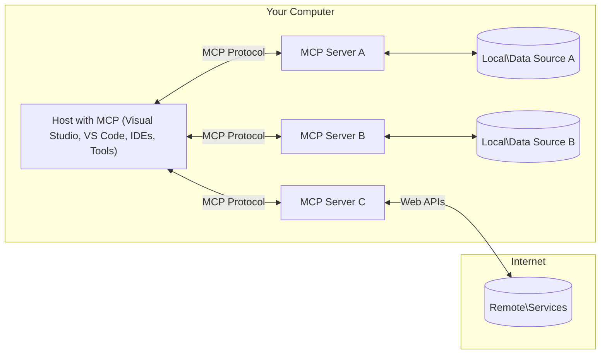

<!--
CO_OP_TRANSLATOR_METADATA:
{
  "original_hash": "904b59de1de9264801242d90a42cdd9d",
  "translation_date": "2025-09-05T11:17:06+00:00",
  "source_file": "01-CoreConcepts/README.md",
  "language_code": "vi"
}
-->
# Các Khái Niệm Cốt Lõi MCP: Làm Chủ Giao Thức Ngữ Cảnh Mô Hình để Tích Hợp AI

[](https://youtu.be/earDzWGtE84)

_(Nhấp vào hình ảnh trên để xem video bài học này)_

[Model Context Protocol (MCP)](https://github.com/modelcontextprotocol) là một khung chuẩn hóa mạnh mẽ giúp tối ưu hóa giao tiếp giữa các Mô Hình Ngôn Ngữ Lớn (LLMs) và các công cụ, ứng dụng, cũng như nguồn dữ liệu bên ngoài. Hướng dẫn này sẽ giúp bạn hiểu rõ các khái niệm cốt lõi của MCP. Bạn sẽ học về kiến trúc client-server, các thành phần thiết yếu, cơ chế giao tiếp, và các thực tiễn tốt nhất để triển khai.

- **Sự Đồng Ý Rõ Ràng của Người Dùng**: Tất cả việc truy cập dữ liệu và thao tác đều yêu cầu sự chấp thuận rõ ràng từ người dùng trước khi thực hiện. Người dùng phải hiểu rõ dữ liệu nào sẽ được truy cập và hành động nào sẽ được thực hiện, với khả năng kiểm soát chi tiết về quyền và sự ủy quyền.

- **Bảo Vệ Quyền Riêng Tư Dữ Liệu**: Dữ liệu người dùng chỉ được tiết lộ khi có sự đồng ý rõ ràng và phải được bảo vệ bằng các kiểm soát truy cập mạnh mẽ trong suốt vòng đời tương tác. Việc triển khai phải ngăn chặn truyền dữ liệu trái phép và duy trì các ranh giới quyền riêng tư nghiêm ngặt.

- **An Toàn Khi Thực Thi Công Cụ**: Mỗi lần gọi công cụ đều yêu cầu sự đồng ý rõ ràng từ người dùng với sự hiểu biết đầy đủ về chức năng, tham số, và tác động tiềm năng của công cụ. Các ranh giới bảo mật mạnh mẽ phải ngăn chặn việc thực thi công cụ không mong muốn, không an toàn, hoặc độc hại.

- **Bảo Mật Lớp Vận Chuyển**: Tất cả các kênh giao tiếp nên sử dụng các cơ chế mã hóa và xác thực phù hợp. Các kết nối từ xa cần triển khai các giao thức vận chuyển an toàn và quản lý thông tin xác thực đúng cách.

#### Hướng Dẫn Triển Khai:

- **Quản Lý Quyền**: Triển khai hệ thống quyền chi tiết cho phép người dùng kiểm soát các máy chủ, công cụ, và tài nguyên nào có thể truy cập  
- **Xác Thực & Ủy Quyền**: Sử dụng các phương pháp xác thực an toàn (OAuth, API keys) với quản lý token và thời hạn hợp lý  
- **Xác Thực Đầu Vào**: Xác thực tất cả các tham số và dữ liệu đầu vào theo các schema được định nghĩa để ngăn chặn các cuộc tấn công chèn mã  
- **Ghi Nhật Ký Kiểm Toán**: Duy trì nhật ký toàn diện về tất cả các thao tác để giám sát bảo mật và tuân thủ

## Tổng Quan

Bài học này khám phá kiến trúc cơ bản và các thành phần tạo nên hệ sinh thái Model Context Protocol (MCP). Bạn sẽ tìm hiểu về kiến trúc client-server, các thành phần chính, và cơ chế giao tiếp thúc đẩy các tương tác MCP.

## Mục Tiêu Học Tập Chính

Kết thúc bài học này, bạn sẽ:

- Hiểu kiến trúc client-server của MCP.
- Xác định vai trò và trách nhiệm của Hosts, Clients, và Servers.
- Phân tích các tính năng cốt lõi làm cho MCP trở thành một lớp tích hợp linh hoạt.
- Tìm hiểu cách thông tin luân chuyển trong hệ sinh thái MCP.
- Có được những hiểu biết thực tiễn thông qua các ví dụ mã trong .NET, Java, Python, và JavaScript.

## Kiến Trúc MCP: Phân Tích Sâu

Hệ sinh thái MCP được xây dựng trên mô hình client-server. Cấu trúc mô-đun này cho phép các ứng dụng AI tương tác với các công cụ, cơ sở dữ liệu, API, và tài nguyên ngữ cảnh một cách hiệu quả. Hãy cùng phân tích kiến trúc này thành các thành phần cốt lõi.

Cốt lõi của MCP là kiến trúc client-server, nơi một ứng dụng host có thể kết nối với nhiều server:



- **MCP Hosts**: Các chương trình như VSCode, Claude Desktop, IDEs, hoặc các công cụ AI muốn truy cập dữ liệu thông qua MCP  
- **MCP Clients**: Các client giao thức duy trì kết nối 1:1 với các server  
- **MCP Servers**: Các chương trình nhẹ cung cấp các khả năng cụ thể thông qua giao thức Model Context Protocol chuẩn hóa  
- **Nguồn Dữ Liệu Cục Bộ**: Các tệp, cơ sở dữ liệu, và dịch vụ trên máy tính của bạn mà các server MCP có thể truy cập một cách an toàn  
- **Dịch Vụ Từ Xa**: Các hệ thống bên ngoài có sẵn qua internet mà các server MCP có thể kết nối thông qua API.

Giao thức MCP là một tiêu chuẩn đang phát triển sử dụng phiên bản hóa theo ngày (định dạng YYYY-MM-DD). Phiên bản giao thức hiện tại là **2025-06-18**. Bạn có thể xem các cập nhật mới nhất về [đặc tả giao thức](https://modelcontextprotocol.io/specification/2025-06-18/)

### 1. Hosts

Trong Model Context Protocol (MCP), **Hosts** là các ứng dụng AI đóng vai trò giao diện chính mà người dùng tương tác với giao thức. Hosts điều phối và quản lý kết nối đến nhiều server MCP bằng cách tạo các client MCP chuyên dụng cho mỗi kết nối server. Các ví dụ về Hosts bao gồm:

- **Ứng Dụng AI**: Claude Desktop, Visual Studio Code, Claude Code  
- **Môi Trường Phát Triển**: IDEs và trình chỉnh sửa mã với tích hợp MCP  
- **Ứng Dụng Tùy Chỉnh**: Các tác nhân AI và công cụ được xây dựng theo mục đích

**Hosts** là các ứng dụng điều phối tương tác mô hình AI. Chúng:

- **Điều Phối Mô Hình AI**: Thực thi hoặc tương tác với LLMs để tạo phản hồi và điều phối quy trình làm việc AI  
- **Quản Lý Kết Nối Client**: Tạo và duy trì một client MCP cho mỗi kết nối server MCP  
- **Kiểm Soát Giao Diện Người Dùng**: Xử lý luồng hội thoại, tương tác người dùng, và trình bày phản hồi  
- **Thực Thi Bảo Mật**: Kiểm soát quyền, ràng buộc bảo mật, và xác thực  
- **Xử Lý Sự Đồng Ý của Người Dùng**: Quản lý sự chấp thuận của người dùng đối với việc chia sẻ dữ liệu và thực thi công cụ

### 2. Clients

**Clients** là các thành phần thiết yếu duy trì kết nối một-một chuyên dụng giữa Hosts và các server MCP. Mỗi client MCP được Host khởi tạo để kết nối với một server MCP cụ thể, đảm bảo các kênh giao tiếp được tổ chức và an toàn. Nhiều client cho phép Hosts kết nối với nhiều server đồng thời.

**Clients** là các thành phần kết nối trong ứng dụng host. Chúng:

- **Giao Tiếp Giao Thức**: Gửi các yêu cầu JSON-RPC 2.0 đến server với các lời nhắc và hướng dẫn  
- **Đàm Phán Khả Năng**: Đàm phán các tính năng được hỗ trợ và phiên bản giao thức với server trong quá trình khởi tạo  
- **Thực Thi Công Cụ**: Quản lý các yêu cầu thực thi công cụ từ mô hình và xử lý phản hồi  
- **Cập Nhật Thời Gian Thực**: Xử lý thông báo và cập nhật thời gian thực từ server  
- **Xử Lý Phản Hồi**: Xử lý và định dạng phản hồi từ server để hiển thị cho người dùng

### 3. Servers

**Servers** là các chương trình cung cấp ngữ cảnh, công cụ, và khả năng cho các client MCP. Chúng có thể thực thi cục bộ (cùng máy với Host) hoặc từ xa (trên các nền tảng bên ngoài), và chịu trách nhiệm xử lý các yêu cầu từ client và cung cấp phản hồi có cấu trúc. Servers cung cấp các chức năng cụ thể thông qua giao thức Model Context Protocol chuẩn hóa.

**Servers** là các dịch vụ cung cấp ngữ cảnh và khả năng. Chúng:

- **Đăng Ký Tính Năng**: Đăng ký và cung cấp các nguyên thủy có sẵn (tài nguyên, lời nhắc, công cụ) cho client  
- **Xử Lý Yêu Cầu**: Nhận và thực thi các cuộc gọi công cụ, yêu cầu tài nguyên, và yêu cầu lời nhắc từ client  
- **Cung Cấp Ngữ Cảnh**: Cung cấp thông tin ngữ cảnh và dữ liệu để nâng cao phản hồi của mô hình  
- **Quản Lý Trạng Thái**: Duy trì trạng thái phiên và xử lý các tương tác có trạng thái khi cần  
- **Thông Báo Thời Gian Thực**: Gửi thông báo về thay đổi khả năng và cập nhật cho các client được kết nối

Servers có thể được phát triển bởi bất kỳ ai để mở rộng khả năng của mô hình với các chức năng chuyên biệt, và chúng hỗ trợ cả các kịch bản triển khai cục bộ và từ xa.

### 4. Nguyên Thủy của Server

Servers trong Model Context Protocol (MCP) cung cấp ba **nguyên thủy** cốt lõi xác định các khối xây dựng cơ bản cho các tương tác phong phú giữa client, host, và mô hình ngôn ngữ. Các nguyên thủy này chỉ định các loại thông tin ngữ cảnh và hành động có sẵn thông qua giao thức.

Servers MCP có thể cung cấp bất kỳ sự kết hợp nào của ba nguyên thủy cốt lõi sau:

#### Tài Nguyên  

**Tài Nguyên** là các nguồn dữ liệu cung cấp thông tin ngữ cảnh cho các ứng dụng AI. Chúng đại diện cho nội dung tĩnh hoặc động có thể nâng cao sự hiểu biết và ra quyết định của mô hình:

- **Dữ Liệu Ngữ Cảnh**: Thông tin có cấu trúc và ngữ cảnh để mô hình AI tiêu thụ  
- **Cơ Sở Kiến Thức**: Kho tài liệu, bài viết, hướng dẫn, và các bài nghiên cứu  
- **Nguồn Dữ Liệu Cục Bộ**: Tệp, cơ sở dữ liệu, và thông tin hệ thống cục bộ  
- **Dữ Liệu Bên Ngoài**: Phản hồi API, dịch vụ web, và dữ liệu hệ thống từ xa  
- **Nội Dung Động**: Dữ liệu thời gian thực cập nhật dựa trên điều kiện bên ngoài  

Tài nguyên được xác định bằng URIs và hỗ trợ khám phá thông qua phương thức `resources/list` và truy xuất thông qua `resources/read`:

```text
file://documents/project-spec.md
database://production/users/schema
api://weather/current
```

#### Lời Nhắc  

**Lời Nhắc** là các mẫu có thể tái sử dụng giúp cấu trúc các tương tác với mô hình ngôn ngữ. Chúng cung cấp các mẫu tương tác chuẩn hóa và quy trình làm việc theo mẫu:

- **Tương Tác Dựa Trên Mẫu**: Các tin nhắn được cấu trúc trước và khởi đầu hội thoại  
- **Mẫu Quy Trình Làm Việc**: Các chuỗi chuẩn hóa cho các tác vụ và tương tác phổ biến  
- **Ví Dụ Few-shot**: Các mẫu dựa trên ví dụ để hướng dẫn mô hình  
- **Lời Nhắc Hệ Thống**: Các lời nhắc nền tảng xác định hành vi và ngữ cảnh của mô hình  
- **Mẫu Động**: Các lời nhắc có tham số thích ứng với ngữ cảnh cụ thể  

Lời nhắc hỗ trợ thay thế biến và có thể được khám phá qua `prompts/list` và truy xuất bằng `prompts/get`:

```markdown
Generate a {{task_type}} for {{product}} targeting {{audience}} with the following requirements: {{requirements}}
```

#### Công Cụ  

**Công Cụ** là các chức năng có thể thực thi mà mô hình AI có thể gọi để thực hiện các hành động cụ thể. Chúng đại diện cho "động từ" của hệ sinh thái MCP, cho phép mô hình tương tác với các hệ thống bên ngoài:

- **Chức Năng Có Thể Thực Thi**: Các thao tác riêng biệt mà mô hình có thể gọi với các tham số cụ thể  
- **Tích Hợp Hệ Thống Bên Ngoài**: Các cuộc gọi API, truy vấn cơ sở dữ liệu, thao tác tệp, tính toán  
- **Danh Tính Độc Nhất**: Mỗi công cụ có tên, mô tả, và schema tham số riêng biệt  
- **I/O Có Cấu Trúc**: Công cụ chấp nhận các tham số đã được xác thực và trả về các phản hồi có cấu trúc, kiểu dữ liệu  
- **Khả Năng Hành Động**: Cho phép mô hình thực hiện các hành động thực tế và truy xuất dữ liệu trực tiếp  

Công cụ được định nghĩa với JSON Schema để xác thực tham số và được khám phá thông qua `tools/list` và thực thi qua `tools/call`:

```typescript
server.tool(
  "search_products", 
  {
    query: z.string().describe("Search query for products"),
    category: z.string().optional().describe("Product category filter"),
    max_results: z.number().default(10).describe("Maximum results to return")
  }, 
  async (params) => {
    // Execute search and return structured results
    return await productService.search(params);
  }
);
```

## Nguyên Thủy của Client  

Trong Model Context Protocol (MCP), **clients** có thể cung cấp các nguyên thủy cho phép servers yêu cầu các khả năng bổ sung từ ứng dụng host. Các nguyên thủy phía client này cho phép triển khai server phong phú hơn, tương tác hơn, có thể truy cập các khả năng của mô hình AI và tương tác người dùng.

### Lấy Mẫu  

**Lấy Mẫu** cho phép servers yêu cầu các hoàn thành mô hình ngôn ngữ từ ứng dụng AI của client. Nguyên thủy này cho phép servers truy cập các khả năng LLM mà không cần tích hợp các phụ thuộc mô hình riêng:

- **Truy Cập Không Phụ Thuộc Mô Hình**: Servers có thể yêu cầu hoàn thành mà không cần bao gồm SDK LLM hoặc quản lý truy cập mô hình  
- **AI Khởi Tạo Bởi Server**: Cho phép servers tự động tạo nội dung bằng mô hình AI của client  
- **Tương Tác LLM Đệ Quy**: Hỗ trợ các kịch bản phức tạp nơi servers cần sự trợ giúp của AI để xử lý  
- **Tạo Nội Dung Động**: Cho phép servers tạo phản hồi ngữ cảnh bằng mô hình của host  

Lấy mẫu được khởi tạo thông qua phương thức `sampling/complete`, nơi servers gửi yêu cầu hoàn thành đến clients.

### Gợi Ý  

**Gợi Ý** cho phép servers yêu cầu thông tin bổ sung hoặc xác nhận từ người dùng thông qua giao diện client:

- **Yêu Cầu Đầu Vào Người Dùng**: Servers có thể yêu cầu thông tin bổ sung khi cần thiết để thực thi công cụ  
- **Hộp Thoại Xác Nhận**: Yêu cầu sự chấp thuận của người dùng cho các thao tác nhạy cảm hoặc có tác động lớn  
- **Quy Trình Tương Tác**: Cho phép servers tạo các tương tác người dùng từng bước  
- **Thu Thập Tham Số Động**: Thu thập các tham số thiếu hoặc tùy chọn trong quá trình thực thi công cụ  

Yêu cầu gợi ý được thực hiện bằng phương thức `elicitation/request` để thu thập đầu vào người dùng thông qua giao diện của client.

### Ghi Nhật Ký  

**Ghi Nhật Ký** cho phép servers gửi các thông báo nhật ký có cấu trúc đến clients để gỡ lỗi, giám sát, và hiển thị hoạt động:

- **Hỗ Trợ Gỡ Lỗi**: Cho phép servers cung cấp nhật ký chi tiết về thực thi để khắc phục sự cố  
- **Giám Sát Hoạt Động**: Gửi cập nhật trạng thái và số liệu hiệu suất đến clients  
- **Báo Cáo Lỗi**: Cung cấp ngữ cảnh lỗi chi tiết và thông tin chẩn đoán  
- **Dấu Vết Kiểm Toán**: Tạo nhật ký toàn diện về các thao tác và quyết định của server  

Các thông báo nhật ký được gửi đến clients để cung cấp sự minh bạch về hoạt động của server và hỗ trợ gỡ lỗi.

## Luồng Thông Tin trong MCP  

Model Context Protocol (MCP) định nghĩa một luồng thông tin có cấu trúc giữa hosts, clients, servers, và mô hình. Hiểu luồng này giúp làm rõ cách các yêu cầu của người dùng được xử lý và cách các công cụ và dữ liệu bên ngoài được tích hợp vào phản hồi của mô hình.

- **Host Khởi Tạo Kết Nối**  
  Ứng dụng host (chẳng hạn như IDE hoặc giao diện chat) thiết lập kết nối đến một server MCP, thường thông qua STDIO, WebSocket, hoặc một giao thức vận chuyển được hỗ trợ khác.

- **Đàm Phán Khả Năng**  
  Client (được nhúng trong host) và server trao đổi thông tin về các tính năng, công cụ, tài nguyên, và phiên bản giao thức được hỗ trợ. Điều này đảm bảo cả hai bên hiểu các khả năng có sẵn cho phiên làm việc.

- **Yêu Cầu Người Dùng**  
  Người dùng tương tác với host (ví dụ: nhập một lời nhắc hoặc lệnh). Host thu thập đầu vào này và chuyển nó đến client để xử lý.

- **Sử Dụng Tài Nguyên hoặc Công Cụ**  
  - Client có thể yêu cầu ngữ cảnh hoặc tài nguyên bổ sung từ server (chẳng hạn như tệp, mục cơ sở dữ liệu, hoặc bài viết cơ sở kiến thức) để làm phong phú sự hiểu biết của mô hình.  
  - Nếu mô hình xác định rằng cần một công cụ (ví dụ: để truy xuất dữ liệu, thực hiện tính toán, hoặc gọi API), client gửi yêu cầu gọi công cụ đến server, chỉ định tên công cụ và các tham số.

- **Thực Thi Server**  
  Server nhận yêu cầu tài nguyên hoặc công cụ, thực hiện các thao tác cần thiết (chẳng hạn như chạy một chức năng, truy vấn cơ sở dữ liệu, hoặc truy xuất một tệp), và trả về kết quả cho client dưới dạng có cấu trúc.

- **Tạo Phản
- **Giao thức JSON-RPC 2.0**: Tất cả giao tiếp sử dụng định dạng thông điệp JSON-RPC 2.0 tiêu chuẩn cho các lời gọi phương thức, phản hồi và thông báo  
- **Quản lý vòng đời**: Xử lý khởi tạo kết nối, đàm phán khả năng và kết thúc phiên giữa các máy khách và máy chủ  
- **Nguyên thủy máy chủ**: Cho phép máy chủ cung cấp các chức năng cốt lõi thông qua công cụ, tài nguyên và mẫu gợi ý  
- **Nguyên thủy máy khách**: Cho phép máy chủ yêu cầu lấy mẫu từ LLM, thu thập đầu vào từ người dùng và gửi thông điệp nhật ký  
- **Thông báo thời gian thực**: Hỗ trợ thông báo không đồng bộ để cập nhật động mà không cần thăm dò  

#### Các tính năng chính:

- **Đàm phán phiên bản giao thức**: Sử dụng phiên bản dựa trên ngày (YYYY-MM-DD) để đảm bảo tính tương thích  
- **Khám phá khả năng**: Máy khách và máy chủ trao đổi thông tin về các tính năng được hỗ trợ trong quá trình khởi tạo  
- **Phiên có trạng thái**: Duy trì trạng thái kết nối qua nhiều tương tác để đảm bảo tính liên tục ngữ cảnh  

### Lớp truyền tải

**Lớp truyền tải** quản lý các kênh giao tiếp, định dạng thông điệp và xác thực giữa các thành phần MCP:

#### Các cơ chế truyền tải được hỗ trợ:

1. **Truyền tải STDIO**:
   - Sử dụng luồng đầu vào/đầu ra tiêu chuẩn để giao tiếp trực tiếp giữa các tiến trình  
   - Tối ưu cho các tiến trình cục bộ trên cùng một máy mà không có chi phí mạng  
   - Thường được sử dụng cho các triển khai máy chủ MCP cục bộ  

2. **Truyền tải HTTP có thể truyền trực tuyến**:
   - Sử dụng HTTP POST cho các thông điệp từ máy khách đến máy chủ  
   - Tùy chọn sự kiện được gửi từ máy chủ (SSE) để truyền trực tuyến từ máy chủ đến máy khách  
   - Cho phép giao tiếp với máy chủ từ xa qua mạng  
   - Hỗ trợ xác thực HTTP tiêu chuẩn (token, khóa API, tiêu đề tùy chỉnh)  
   - MCP khuyến nghị sử dụng OAuth để xác thực dựa trên token an toàn  

#### Trừu tượng hóa truyền tải:

Lớp truyền tải trừu tượng hóa các chi tiết giao tiếp khỏi lớp dữ liệu, cho phép sử dụng cùng định dạng thông điệp JSON-RPC 2.0 trên tất cả các cơ chế truyền tải. Sự trừu tượng hóa này cho phép ứng dụng chuyển đổi liền mạch giữa máy chủ cục bộ và từ xa.

### Các cân nhắc về bảo mật

Các triển khai MCP phải tuân thủ một số nguyên tắc bảo mật quan trọng để đảm bảo các tương tác an toàn, đáng tin cậy và bảo mật trong tất cả các hoạt động giao thức:

- **Sự đồng ý và kiểm soát của người dùng**: Người dùng phải cung cấp sự đồng ý rõ ràng trước khi bất kỳ dữ liệu nào được truy cập hoặc hoạt động nào được thực hiện. Họ cần có quyền kiểm soát rõ ràng đối với dữ liệu được chia sẻ và các hành động được ủy quyền, được hỗ trợ bởi giao diện người dùng trực quan để xem xét và phê duyệt các hoạt động.

- **Bảo mật dữ liệu**: Dữ liệu người dùng chỉ được tiết lộ khi có sự đồng ý rõ ràng và phải được bảo vệ bằng các kiểm soát truy cập phù hợp. Các triển khai MCP phải ngăn chặn việc truyền dữ liệu trái phép và đảm bảo quyền riêng tư được duy trì trong suốt các tương tác.

- **An toàn công cụ**: Trước khi gọi bất kỳ công cụ nào, cần có sự đồng ý rõ ràng từ người dùng. Người dùng cần hiểu rõ chức năng của từng công cụ, và các ranh giới bảo mật mạnh mẽ phải được thực thi để ngăn chặn việc thực thi công cụ không mong muốn hoặc không an toàn.

Bằng cách tuân thủ các nguyên tắc bảo mật này, MCP đảm bảo duy trì sự tin tưởng, quyền riêng tư và an toàn của người dùng trong tất cả các tương tác giao thức, đồng thời cho phép tích hợp AI mạnh mẽ.

## Ví dụ mã: Các thành phần chính

Dưới đây là các ví dụ mã trong một số ngôn ngữ lập trình phổ biến minh họa cách triển khai các thành phần máy chủ MCP và công cụ.

### Ví dụ .NET: Tạo máy chủ MCP đơn giản với công cụ

Dưới đây là một ví dụ thực tế bằng .NET minh họa cách triển khai một máy chủ MCP đơn giản với các công cụ tùy chỉnh. Ví dụ này trình bày cách định nghĩa và đăng ký công cụ, xử lý yêu cầu và kết nối máy chủ bằng Giao thức Ngữ cảnh Mô hình.

```csharp
using System;
using System.Threading.Tasks;
using ModelContextProtocol.Server;
using ModelContextProtocol.Server.Transport;
using ModelContextProtocol.Server.Tools;

public class WeatherServer
{
    public static async Task Main(string[] args)
    {
        // Create an MCP server
        var server = new McpServer(
            name: "Weather MCP Server",
            version: "1.0.0"
        );
        
        // Register our custom weather tool
        server.AddTool<string, WeatherData>("weatherTool", 
            description: "Gets current weather for a location",
            execute: async (location) => {
                // Call weather API (simplified)
                var weatherData = await GetWeatherDataAsync(location);
                return weatherData;
            });
        
        // Connect the server using stdio transport
        var transport = new StdioServerTransport();
        await server.ConnectAsync(transport);
        
        Console.WriteLine("Weather MCP Server started");
        
        // Keep the server running until process is terminated
        await Task.Delay(-1);
    }
    
    private static async Task<WeatherData> GetWeatherDataAsync(string location)
    {
        // This would normally call a weather API
        // Simplified for demonstration
        await Task.Delay(100); // Simulate API call
        return new WeatherData { 
            Temperature = 72.5,
            Conditions = "Sunny",
            Location = location
        };
    }
}

public class WeatherData
{
    public double Temperature { get; set; }
    public string Conditions { get; set; }
    public string Location { get; set; }
}
```

### Ví dụ Java: Các thành phần máy chủ MCP

Ví dụ này minh họa cùng một máy chủ MCP và đăng ký công cụ như ví dụ .NET ở trên, nhưng được triển khai bằng Java.

```java
import io.modelcontextprotocol.server.McpServer;
import io.modelcontextprotocol.server.McpToolDefinition;
import io.modelcontextprotocol.server.transport.StdioServerTransport;
import io.modelcontextprotocol.server.tool.ToolExecutionContext;
import io.modelcontextprotocol.server.tool.ToolResponse;

public class WeatherMcpServer {
    public static void main(String[] args) throws Exception {
        // Create an MCP server
        McpServer server = McpServer.builder()
            .name("Weather MCP Server")
            .version("1.0.0")
            .build();
            
        // Register a weather tool
        server.registerTool(McpToolDefinition.builder("weatherTool")
            .description("Gets current weather for a location")
            .parameter("location", String.class)
            .execute((ToolExecutionContext ctx) -> {
                String location = ctx.getParameter("location", String.class);
                
                // Get weather data (simplified)
                WeatherData data = getWeatherData(location);
                
                // Return formatted response
                return ToolResponse.content(
                    String.format("Temperature: %.1f°F, Conditions: %s, Location: %s", 
                    data.getTemperature(), 
                    data.getConditions(), 
                    data.getLocation())
                );
            })
            .build());
        
        // Connect the server using stdio transport
        try (StdioServerTransport transport = new StdioServerTransport()) {
            server.connect(transport);
            System.out.println("Weather MCP Server started");
            // Keep server running until process is terminated
            Thread.currentThread().join();
        }
    }
    
    private static WeatherData getWeatherData(String location) {
        // Implementation would call a weather API
        // Simplified for example purposes
        return new WeatherData(72.5, "Sunny", location);
    }
}

class WeatherData {
    private double temperature;
    private String conditions;
    private String location;
    
    public WeatherData(double temperature, String conditions, String location) {
        this.temperature = temperature;
        this.conditions = conditions;
        this.location = location;
    }
    
    public double getTemperature() {
        return temperature;
    }
    
    public String getConditions() {
        return conditions;
    }
    
    public String getLocation() {
        return location;
    }
}
```

### Ví dụ Python: Xây dựng máy chủ MCP

Ví dụ này sử dụng fastmcp, vì vậy hãy đảm bảo bạn cài đặt nó trước:

```python
pip install fastmcp
```  
Mẫu mã:

```python
#!/usr/bin/env python3
import asyncio
from fastmcp import FastMCP
from fastmcp.transports.stdio import serve_stdio

# Create a FastMCP server
mcp = FastMCP(
    name="Weather MCP Server",
    version="1.0.0"
)

@mcp.tool()
def get_weather(location: str) -> dict:
    """Gets current weather for a location."""
    return {
        "temperature": 72.5,
        "conditions": "Sunny",
        "location": location
    }

# Alternative approach using a class
class WeatherTools:
    @mcp.tool()
    def forecast(self, location: str, days: int = 1) -> dict:
        """Gets weather forecast for a location for the specified number of days."""
        return {
            "location": location,
            "forecast": [
                {"day": i+1, "temperature": 70 + i, "conditions": "Partly Cloudy"}
                for i in range(days)
            ]
        }

# Register class tools
weather_tools = WeatherTools()

# Start the server
if __name__ == "__main__":
    asyncio.run(serve_stdio(mcp))
```

### Ví dụ JavaScript: Tạo máy chủ MCP

Ví dụ này trình bày cách tạo máy chủ MCP bằng JavaScript và cách đăng ký hai công cụ liên quan đến thời tiết.

```javascript
// Using the official Model Context Protocol SDK
import { McpServer } from "@modelcontextprotocol/sdk/server/mcp.js";
import { StdioServerTransport } from "@modelcontextprotocol/sdk/server/stdio.js";
import { z } from "zod"; // For parameter validation

// Create an MCP server
const server = new McpServer({
  name: "Weather MCP Server",
  version: "1.0.0"
});

// Define a weather tool
server.tool(
  "weatherTool",
  {
    location: z.string().describe("The location to get weather for")
  },
  async ({ location }) => {
    // This would normally call a weather API
    // Simplified for demonstration
    const weatherData = await getWeatherData(location);
    
    return {
      content: [
        { 
          type: "text", 
          text: `Temperature: ${weatherData.temperature}°F, Conditions: ${weatherData.conditions}, Location: ${weatherData.location}` 
        }
      ]
    };
  }
);

// Define a forecast tool
server.tool(
  "forecastTool",
  {
    location: z.string(),
    days: z.number().default(3).describe("Number of days for forecast")
  },
  async ({ location, days }) => {
    // This would normally call a weather API
    // Simplified for demonstration
    const forecast = await getForecastData(location, days);
    
    return {
      content: [
        { 
          type: "text", 
          text: `${days}-day forecast for ${location}: ${JSON.stringify(forecast)}` 
        }
      ]
    };
  }
);

// Helper functions
async function getWeatherData(location) {
  // Simulate API call
  return {
    temperature: 72.5,
    conditions: "Sunny",
    location: location
  };
}

async function getForecastData(location, days) {
  // Simulate API call
  return Array.from({ length: days }, (_, i) => ({
    day: i + 1,
    temperature: 70 + Math.floor(Math.random() * 10),
    conditions: i % 2 === 0 ? "Sunny" : "Partly Cloudy"
  }));
}

// Connect the server using stdio transport
const transport = new StdioServerTransport();
server.connect(transport).catch(console.error);

console.log("Weather MCP Server started");
```

Ví dụ JavaScript này minh họa cách tạo máy khách MCP kết nối với máy chủ, gửi một gợi ý và xử lý phản hồi bao gồm bất kỳ lời gọi công cụ nào đã được thực hiện.

## Bảo mật và ủy quyền

MCP bao gồm một số khái niệm và cơ chế tích hợp để quản lý bảo mật và ủy quyền trong suốt giao thức:

1. **Kiểm soát quyền công cụ**:  
   Máy khách có thể chỉ định công cụ nào mà mô hình được phép sử dụng trong một phiên. Điều này đảm bảo rằng chỉ các công cụ được ủy quyền rõ ràng mới có thể truy cập, giảm thiểu rủi ro của các hoạt động không mong muốn hoặc không an toàn. Quyền có thể được cấu hình động dựa trên sở thích người dùng, chính sách tổ chức hoặc ngữ cảnh tương tác.

2. **Xác thực**:  
   Máy chủ có thể yêu cầu xác thực trước khi cấp quyền truy cập vào công cụ, tài nguyên hoặc các hoạt động nhạy cảm. Điều này có thể bao gồm khóa API, token OAuth hoặc các cơ chế xác thực khác. Xác thực đúng cách đảm bảo rằng chỉ các máy khách và người dùng đáng tin cậy mới có thể gọi các khả năng phía máy chủ.

3. **Xác thực tham số**:  
   Xác thực tham số được thực thi cho tất cả các lời gọi công cụ. Mỗi công cụ định nghĩa các kiểu, định dạng và ràng buộc mong đợi cho các tham số của nó, và máy chủ xác thực các yêu cầu đến theo đó. Điều này ngăn chặn đầu vào không hợp lệ hoặc độc hại tiếp cận các triển khai công cụ và giúp duy trì tính toàn vẹn của các hoạt động.

4. **Giới hạn tốc độ**:  
   Để ngăn chặn lạm dụng và đảm bảo sử dụng công bằng tài nguyên máy chủ, các máy chủ MCP có thể triển khai giới hạn tốc độ cho các lời gọi công cụ và truy cập tài nguyên. Giới hạn tốc độ có thể được áp dụng theo người dùng, theo phiên hoặc toàn cầu, và giúp bảo vệ chống lại các cuộc tấn công từ chối dịch vụ hoặc tiêu thụ tài nguyên quá mức.

Bằng cách kết hợp các cơ chế này, MCP cung cấp một nền tảng bảo mật để tích hợp các mô hình ngôn ngữ với các công cụ và nguồn dữ liệu bên ngoài, đồng thời cung cấp cho người dùng và nhà phát triển quyền kiểm soát chi tiết đối với quyền truy cập và sử dụng.

## Thông điệp giao thức & luồng giao tiếp

Giao tiếp MCP sử dụng các thông điệp **JSON-RPC 2.0** có cấu trúc để tạo điều kiện cho các tương tác rõ ràng và đáng tin cậy giữa máy chủ, máy khách và máy chủ. Giao thức định nghĩa các mẫu thông điệp cụ thể cho các loại hoạt động khác nhau:

### Các loại thông điệp cốt lõi:

#### **Thông điệp khởi tạo**
- **Yêu cầu `initialize`**: Thiết lập kết nối và đàm phán phiên bản giao thức và khả năng  
- **Phản hồi `initialize`**: Xác nhận các tính năng được hỗ trợ và thông tin máy chủ  
- **`notifications/initialized`**: Báo hiệu rằng khởi tạo đã hoàn tất và phiên đã sẵn sàng  

#### **Thông điệp khám phá**
- **Yêu cầu `tools/list`**: Khám phá các công cụ có sẵn từ máy chủ  
- **Yêu cầu `resources/list`**: Liệt kê các tài nguyên có sẵn (nguồn dữ liệu)  
- **Yêu cầu `prompts/list`**: Truy xuất các mẫu gợi ý có sẵn  

#### **Thông điệp thực thi**  
- **Yêu cầu `tools/call`**: Thực thi một công cụ cụ thể với các tham số được cung cấp  
- **Yêu cầu `resources/read`**: Truy xuất nội dung từ một tài nguyên cụ thể  
- **Yêu cầu `prompts/get`**: Lấy một mẫu gợi ý với các tham số tùy chọn  

#### **Thông điệp phía máy khách**
- **Yêu cầu `sampling/complete`**: Máy chủ yêu cầu hoàn thành LLM từ máy khách  
- **`elicitation/request`**: Máy chủ yêu cầu đầu vào từ người dùng thông qua giao diện máy khách  
- **Thông điệp nhật ký**: Máy chủ gửi các thông điệp nhật ký có cấu trúc đến máy khách  

#### **Thông điệp thông báo**
- **`notifications/tools/list_changed`**: Máy chủ thông báo cho máy khách về thay đổi công cụ  
- **`notifications/resources/list_changed`**: Máy chủ thông báo cho máy khách về thay đổi tài nguyên  
- **`notifications/prompts/list_changed`**: Máy chủ thông báo cho máy khách về thay đổi mẫu gợi ý  

### Cấu trúc thông điệp:

Tất cả các thông điệp MCP tuân theo định dạng JSON-RPC 2.0 với:  
- **Thông điệp yêu cầu**: Bao gồm `id`, `method` và các `params` tùy chọn  
- **Thông điệp phản hồi**: Bao gồm `id` và `result` hoặc `error`  
- **Thông điệp thông báo**: Bao gồm `method` và các `params` tùy chọn (không có `id` hoặc phản hồi mong đợi)  

Giao tiếp có cấu trúc này đảm bảo các tương tác đáng tin cậy, có thể theo dõi và mở rộng, hỗ trợ các kịch bản nâng cao như cập nhật thời gian thực, chuỗi công cụ và xử lý lỗi mạnh mẽ.

## Điểm chính cần nhớ

- **Kiến trúc**: MCP sử dụng kiến trúc máy khách-máy chủ, nơi các máy chủ quản lý nhiều kết nối máy khách đến máy chủ  
- **Thành phần tham gia**: Hệ sinh thái bao gồm máy chủ (ứng dụng AI), máy khách (kết nối giao thức) và máy chủ (nhà cung cấp khả năng)  
- **Cơ chế truyền tải**: Giao tiếp hỗ trợ STDIO (cục bộ) và HTTP có thể truyền trực tuyến với SSE tùy chọn (từ xa)  
- **Nguyên thủy cốt lõi**: Máy chủ cung cấp công cụ (hàm thực thi), tài nguyên (nguồn dữ liệu) và mẫu gợi ý (mẫu)  
- **Nguyên thủy máy khách**: Máy chủ có thể yêu cầu lấy mẫu (hoàn thành LLM), thu thập đầu vào (người dùng) và ghi nhật ký từ máy khách  
- **Nền tảng giao thức**: Dựa trên JSON-RPC 2.0 với phiên bản dựa trên ngày (hiện tại: 2025-06-18)  
- **Khả năng thời gian thực**: Hỗ trợ thông báo cho các cập nhật động và đồng bộ hóa thời gian thực  
- **Bảo mật là ưu tiên hàng đầu**: Sự đồng ý rõ ràng của người dùng, bảo vệ quyền riêng tư dữ liệu và truyền tải an toàn là các yêu cầu cốt lõi  

## Bài tập

Thiết kế một công cụ MCP đơn giản hữu ích trong lĩnh vực của bạn. Định nghĩa:  
1. Tên của công cụ  
2. Các tham số mà công cụ sẽ chấp nhận  
3. Kết quả mà công cụ sẽ trả về  
4. Cách mà một mô hình có thể sử dụng công cụ này để giải quyết vấn đề của người dùng  

---

## Tiếp theo

Tiếp theo: [Chương 2: Bảo mật](../02-Security/README.md)  

---

**Tuyên bố miễn trừ trách nhiệm**:  
Tài liệu này đã được dịch bằng dịch vụ dịch thuật AI [Co-op Translator](https://github.com/Azure/co-op-translator). Mặc dù chúng tôi cố gắng đảm bảo độ chính xác, xin lưu ý rằng các bản dịch tự động có thể chứa lỗi hoặc không chính xác. Tài liệu gốc bằng ngôn ngữ bản địa nên được coi là nguồn tham khảo chính thức. Đối với các thông tin quan trọng, nên sử dụng dịch vụ dịch thuật chuyên nghiệp từ con người. Chúng tôi không chịu trách nhiệm cho bất kỳ sự hiểu lầm hoặc diễn giải sai nào phát sinh từ việc sử dụng bản dịch này.