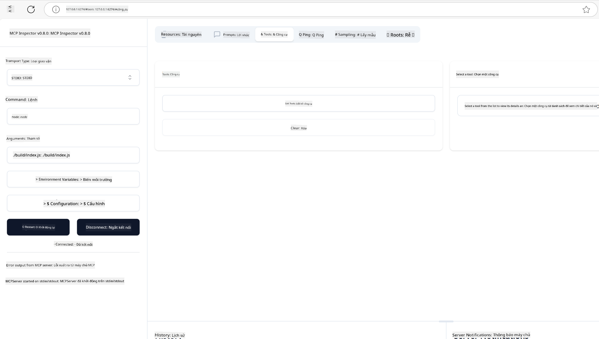
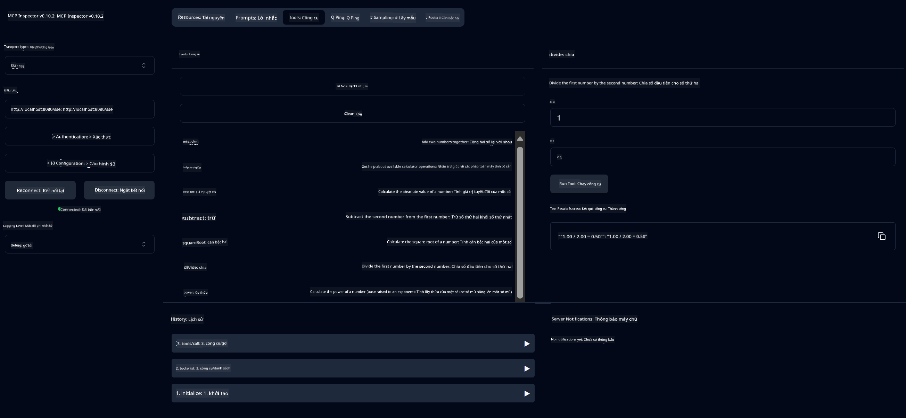
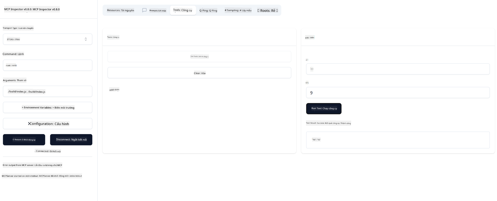

<!--
CO_OP_TRANSLATOR_METADATA:
{
  "original_hash": "ec11ee93f31fdadd94facd3e3d22f9e6",
  "translation_date": "2025-09-09T22:02:39+00:00",
  "source_file": "03-GettingStarted/01-first-server/README.md",
  "language_code": "vi"
}
-->
# Bắt đầu với MCP

Chào mừng bạn đến với những bước đầu tiên cùng Model Context Protocol (MCP)! Dù bạn mới làm quen với MCP hay muốn nâng cao hiểu biết của mình, hướng dẫn này sẽ giúp bạn đi qua các bước thiết lập và phát triển cơ bản. Bạn sẽ khám phá cách MCP cho phép tích hợp liền mạch giữa các mô hình AI và ứng dụng, đồng thời học cách nhanh chóng chuẩn bị môi trường để xây dựng và kiểm thử các giải pháp sử dụng MCP.

> Tóm tắt: Nếu bạn xây dựng ứng dụng AI, bạn biết rằng có thể thêm công cụ và tài nguyên khác vào LLM (mô hình ngôn ngữ lớn) để làm cho LLM thông minh hơn. Tuy nhiên, nếu bạn đặt các công cụ và tài nguyên đó trên một máy chủ, ứng dụng và khả năng của máy chủ có thể được sử dụng bởi bất kỳ khách hàng nào, dù có hoặc không có LLM.

## Tổng quan

Bài học này cung cấp hướng dẫn thực tế về cách thiết lập môi trường MCP và xây dựng các ứng dụng MCP đầu tiên của bạn. Bạn sẽ học cách thiết lập các công cụ và framework cần thiết, xây dựng các máy chủ MCP cơ bản, tạo ứng dụng host, và kiểm thử các triển khai của mình.

Model Context Protocol (MCP) là một giao thức mở chuẩn hóa cách các ứng dụng cung cấp ngữ cảnh cho LLMs. Hãy nghĩ về MCP như một cổng USB-C cho các ứng dụng AI - nó cung cấp một cách chuẩn hóa để kết nối các mô hình AI với các nguồn dữ liệu và công cụ khác nhau.

## Mục tiêu học tập

Kết thúc bài học này, bạn sẽ có thể:

- Thiết lập môi trường phát triển cho MCP bằng C#, Java, Python, TypeScript, và Rust
- Xây dựng và triển khai các máy chủ MCP cơ bản với các tính năng tùy chỉnh (tài nguyên, lời nhắc, và công cụ)
- Tạo ứng dụng host kết nối với máy chủ MCP
- Kiểm thử và gỡ lỗi các triển khai MCP

## Thiết lập môi trường MCP của bạn

Trước khi bắt đầu làm việc với MCP, điều quan trọng là chuẩn bị môi trường phát triển và hiểu quy trình làm việc cơ bản. Phần này sẽ hướng dẫn bạn qua các bước thiết lập ban đầu để đảm bảo khởi đầu suôn sẻ với MCP.

### Yêu cầu trước

Trước khi bắt đầu phát triển MCP, hãy đảm bảo bạn có:

- **Môi trường phát triển**: Cho ngôn ngữ bạn chọn (C#, Java, Python, TypeScript, hoặc Rust)
- **IDE/Trình soạn thảo**: Visual Studio, Visual Studio Code, IntelliJ, Eclipse, PyCharm, hoặc bất kỳ trình soạn thảo mã hiện đại nào
- **Trình quản lý gói**: NuGet, Maven/Gradle, pip, npm/yarn, hoặc Cargo
- **API Keys**: Cho bất kỳ dịch vụ AI nào bạn dự định sử dụng trong ứng dụng host của mình

## Cấu trúc cơ bản của máy chủ MCP

Một máy chủ MCP thường bao gồm:

- **Cấu hình máy chủ**: Thiết lập cổng, xác thực, và các cài đặt khác
- **Tài nguyên**: Dữ liệu và ngữ cảnh được cung cấp cho LLMs
- **Công cụ**: Chức năng mà các mô hình có thể gọi
- **Lời nhắc**: Mẫu để tạo hoặc cấu trúc văn bản

Dưới đây là một ví dụ đơn giản bằng TypeScript:

```typescript
import { McpServer, ResourceTemplate } from "@modelcontextprotocol/sdk/server/mcp.js";
import { StdioServerTransport } from "@modelcontextprotocol/sdk/server/stdio.js";
import { z } from "zod";

// Create an MCP server
const server = new McpServer({
  name: "Demo",
  version: "1.0.0"
});

// Add an addition tool
server.tool("add",
  { a: z.number(), b: z.number() },
  async ({ a, b }) => ({
    content: [{ type: "text", text: String(a + b) }]
  })
);

// Add a dynamic greeting resource
server.resource(
  "file",
  // The 'list' parameter controls how the resource lists available files. Setting it to undefined disables listing for this resource.
  new ResourceTemplate("file://{path}", { list: undefined }),
  async (uri, { path }) => ({
    contents: [{
      uri: uri.href,
      text: `File, ${path}!`
    }]
  })
);

// Add a file resource that reads the file contents
server.resource(
  "file",
  new ResourceTemplate("file://{path}", { list: undefined }),
  async (uri, { path }) => {
    let text;
    try {
      text = await fs.readFile(path, "utf8");
    } catch (err) {
      text = `Error reading file: ${err.message}`;
    }
    return {
      contents: [{
        uri: uri.href,
        text
      }]
    };
  }
);

server.prompt(
  "review-code",
  { code: z.string() },
  ({ code }) => ({
    messages: [{
      role: "user",
      content: {
        type: "text",
        text: `Please review this code:\n\n${code}`
      }
    }]
  })
);

// Start receiving messages on stdin and sending messages on stdout
const transport = new StdioServerTransport();
await server.connect(transport);
```

Trong đoạn mã trên, chúng ta đã:

- Nhập các lớp cần thiết từ MCP TypeScript SDK.
- Tạo và cấu hình một instance máy chủ MCP mới.
- Đăng ký một công cụ tùy chỉnh (`calculator`) với một hàm xử lý.
- Khởi động máy chủ để lắng nghe các yêu cầu MCP đến.

## Kiểm thử và gỡ lỗi

Trước khi bắt đầu kiểm thử máy chủ MCP của bạn, điều quan trọng là hiểu các công cụ và thực hành tốt nhất để gỡ lỗi. Kiểm thử hiệu quả đảm bảo máy chủ của bạn hoạt động như mong đợi và giúp bạn nhanh chóng xác định và giải quyết các vấn đề. Phần sau đây phác thảo các phương pháp được khuyến nghị để xác thực triển khai MCP của bạn.

MCP cung cấp các công cụ để giúp bạn kiểm thử và gỡ lỗi máy chủ:

- **Công cụ Inspector**, giao diện đồ họa này cho phép bạn kết nối với máy chủ và kiểm thử các công cụ, lời nhắc và tài nguyên.
- **curl**, bạn cũng có thể kết nối với máy chủ bằng một công cụ dòng lệnh như curl hoặc các client khác có thể tạo và chạy các lệnh HTTP.

### Sử dụng MCP Inspector

[MCP Inspector](https://github.com/modelcontextprotocol/inspector) là một công cụ kiểm thử trực quan giúp bạn:

1. **Khám phá khả năng của máy chủ**: Tự động phát hiện các tài nguyên, công cụ, và lời nhắc có sẵn
2. **Kiểm thử thực thi công cụ**: Thử các tham số khác nhau và xem phản hồi theo thời gian thực
3. **Xem metadata của máy chủ**: Kiểm tra thông tin máy chủ, schema, và cấu hình

```bash
# ex TypeScript, installing and running MCP Inspector
npx @modelcontextprotocol/inspector node build/index.js
```

Khi bạn chạy các lệnh trên, MCP Inspector sẽ khởi chạy một giao diện web cục bộ trong trình duyệt của bạn. Bạn có thể mong đợi thấy một bảng điều khiển hiển thị các máy chủ MCP đã đăng ký, các công cụ, tài nguyên, và lời nhắc có sẵn của chúng. Giao diện cho phép bạn kiểm thử tương tác thực thi công cụ, kiểm tra metadata của máy chủ, và xem phản hồi theo thời gian thực, giúp bạn dễ dàng xác thực và gỡ lỗi các triển khai máy chủ MCP của mình.

Dưới đây là ảnh chụp màn hình về giao diện có thể trông như thế nào:



## Các vấn đề thiết lập phổ biến và giải pháp

| Vấn đề | Giải pháp khả thi |
|-------|-------------------|
| Kết nối bị từ chối | Kiểm tra xem máy chủ có đang chạy và cổng có đúng không |
| Lỗi thực thi công cụ | Xem lại xác thực tham số và xử lý lỗi |
| Lỗi xác thực | Xác minh API keys và quyền |
| Lỗi xác thực schema | Đảm bảo tham số khớp với schema đã định nghĩa |
| Máy chủ không khởi động | Kiểm tra xung đột cổng hoặc thiếu phụ thuộc |
| Lỗi CORS | Cấu hình header CORS phù hợp cho các yêu cầu cross-origin |
| Vấn đề xác thực | Xác minh tính hợp lệ của token và quyền |

## Phát triển cục bộ

Để phát triển và kiểm thử cục bộ, bạn có thể chạy các máy chủ MCP trực tiếp trên máy của mình:

1. **Khởi động tiến trình máy chủ**: Chạy ứng dụng máy chủ MCP của bạn
2. **Cấu hình mạng**: Đảm bảo máy chủ có thể truy cập trên cổng mong đợi
3. **Kết nối client**: Sử dụng URL kết nối cục bộ như `http://localhost:3000`

```bash
# Example: Running a TypeScript MCP server locally
npm run start
# Server running at http://localhost:3000
```

## Xây dựng máy chủ MCP đầu tiên của bạn

Chúng ta đã đề cập đến [Các khái niệm cốt lõi](/01-CoreConcepts/README.md) trong bài học trước, giờ là lúc áp dụng kiến thức đó vào thực tế.

### Máy chủ có thể làm gì

Trước khi bắt đầu viết mã, hãy nhắc lại những gì một máy chủ có thể làm:

Một máy chủ MCP có thể, ví dụ:

- Truy cập tệp và cơ sở dữ liệu cục bộ
- Kết nối với các API từ xa
- Thực hiện các phép tính
- Tích hợp với các công cụ và dịch vụ khác
- Cung cấp giao diện người dùng để tương tác

Tuyệt vời, giờ chúng ta đã biết máy chủ có thể làm gì, hãy bắt đầu viết mã.

## Bài tập: Tạo một máy chủ

Để tạo một máy chủ, bạn cần thực hiện các bước sau:

- Cài đặt MCP SDK.
- Tạo một dự án và thiết lập cấu trúc dự án.
- Viết mã máy chủ.
- Kiểm thử máy chủ.

### -1- Tạo dự án

#### TypeScript

```sh
# Create project directory and initialize npm project
mkdir calculator-server
cd calculator-server
npm init -y
```

#### Python

```sh
# Create project dir
mkdir calculator-server
cd calculator-server
# Open the folder in Visual Studio Code - Skip this if you are using a different IDE
code .
```

#### .NET

```sh
dotnet new console -n McpCalculatorServer
cd McpCalculatorServer
```

#### Java

Đối với Java, tạo một dự án Spring Boot:

```bash
curl https://start.spring.io/starter.zip \
  -d dependencies=web \
  -d javaVersion=21 \
  -d type=maven-project \
  -d groupId=com.example \
  -d artifactId=calculator-server \
  -d name=McpServer \
  -d packageName=com.microsoft.mcp.sample.server \
  -o calculator-server.zip
```

Giải nén tệp zip:

```bash
unzip calculator-server.zip -d calculator-server
cd calculator-server
# optional remove the unused test
rm -rf src/test/java
```

Thêm cấu hình hoàn chỉnh sau vào tệp *pom.xml* của bạn:

```xml
<?xml version="1.0" encoding="UTF-8"?>
<project xmlns="http://maven.apache.org/POM/4.0.0"
    xmlns:xsi="http://www.w3.org/2001/XMLSchema-instance"
    xsi:schemaLocation="http://maven.apache.org/POM/4.0.0 http://maven.apache.org/xsd/maven-4.0.0.xsd">
    <modelVersion>4.0.0</modelVersion>
    
    <!-- Spring Boot parent for dependency management -->
    <parent>
        <groupId>org.springframework.boot</groupId>
        <artifactId>spring-boot-starter-parent</artifactId>
        <version>3.5.0</version>
        <relativePath />
    </parent>

    <!-- Project coordinates -->
    <groupId>com.example</groupId>
    <artifactId>calculator-server</artifactId>
    <version>0.0.1-SNAPSHOT</version>
    <name>Calculator Server</name>
    <description>Basic calculator MCP service for beginners</description>

    <!-- Properties -->
    <properties>
        <java.version>21</java.version>
        <maven.compiler.source>21</maven.compiler.source>
        <maven.compiler.target>21</maven.compiler.target>
    </properties>

    <!-- Spring AI BOM for version management -->
    <dependencyManagement>
        <dependencies>
            <dependency>
                <groupId>org.springframework.ai</groupId>
                <artifactId>spring-ai-bom</artifactId>
                <version>1.0.0-SNAPSHOT</version>
                <type>pom</type>
                <scope>import</scope>
            </dependency>
        </dependencies>
    </dependencyManagement>

    <!-- Dependencies -->
    <dependencies>
        <dependency>
            <groupId>org.springframework.ai</groupId>
            <artifactId>spring-ai-starter-mcp-server-webflux</artifactId>
        </dependency>
        <dependency>
            <groupId>org.springframework.boot</groupId>
            <artifactId>spring-boot-starter-actuator</artifactId>
        </dependency>
        <dependency>
         <groupId>org.springframework.boot</groupId>
         <artifactId>spring-boot-starter-test</artifactId>
         <scope>test</scope>
      </dependency>
    </dependencies>

    <!-- Build configuration -->
    <build>
        <plugins>
            <plugin>
                <groupId>org.springframework.boot</groupId>
                <artifactId>spring-boot-maven-plugin</artifactId>
            </plugin>
            <plugin>
                <groupId>org.apache.maven.plugins</groupId>
                <artifactId>maven-compiler-plugin</artifactId>
                <configuration>
                    <release>21</release>
                </configuration>
            </plugin>
        </plugins>
    </build>

    <!-- Repositories for Spring AI snapshots -->
    <repositories>
        <repository>
            <id>spring-milestones</id>
            <name>Spring Milestones</name>
            <url>https://repo.spring.io/milestone</url>
            <snapshots>
                <enabled>false</enabled>
            </snapshots>
        </repository>
        <repository>
            <id>spring-snapshots</id>
            <name>Spring Snapshots</name>
            <url>https://repo.spring.io/snapshot</url>
            <releases>
                <enabled>false</enabled>
            </releases>
        </repository>
    </repositories>
</project>
```

#### Rust

```sh
mkdir calculator-server
cd calculator-server
cargo init
```

### -2- Thêm phụ thuộc

Bây giờ bạn đã tạo dự án, hãy thêm các phụ thuộc tiếp theo:

#### TypeScript

```sh
# If not already installed, install TypeScript globally
npm install typescript -g

# Install the MCP SDK and Zod for schema validation
npm install @modelcontextprotocol/sdk zod
npm install -D @types/node typescript
```

#### Python

```sh
# Create a virtual env and install dependencies
python -m venv venv
venv\Scripts\activate
pip install "mcp[cli]"
```

#### Java

```bash
cd calculator-server
./mvnw clean install -DskipTests
```

#### Rust

```sh
cargo add rmcp --features server,transport-io
cargo add serde
cargo add tokio --features rt-multi-thread
```

### -3- Tạo tệp dự án

#### TypeScript

Mở tệp *package.json* và thay thế nội dung bằng nội dung sau để đảm bảo bạn có thể xây dựng và chạy máy chủ:

```json
{
  "name": "calculator-server",
  "version": "1.0.0",
  "main": "index.js",
  "type": "module",
  "scripts": {
    "start": "tsc && node ./build/index.js",
    "build": "tsc && node ./build/index.js"
  },
  "keywords": [],
  "author": "",
  "license": "ISC",
  "description": "A simple calculator server using Model Context Protocol",
  "dependencies": {
    "@modelcontextprotocol/sdk": "^1.16.0",
    "zod": "^3.25.76"
  },
  "devDependencies": {
    "@types/node": "^24.0.14",
    "typescript": "^5.8.3"
  }
}
```

Tạo một tệp *tsconfig.json* với nội dung sau:

```json
{
  "compilerOptions": {
    "target": "ES2022",
    "module": "Node16",
    "moduleResolution": "Node16",
    "outDir": "./build",
    "rootDir": "./src",
    "strict": true,
    "esModuleInterop": true,
    "skipLibCheck": true,
    "forceConsistentCasingInFileNames": true
  },
  "include": ["src/**/*"],
  "exclude": ["node_modules"]
}
```

Tạo một thư mục cho mã nguồn của bạn:

```sh
mkdir src
touch src/index.ts
```

#### Python

Tạo một tệp *server.py*

```sh
touch server.py
```

#### .NET

Cài đặt các gói NuGet cần thiết:

```sh
dotnet add package ModelContextProtocol --prerelease
dotnet add package Microsoft.Extensions.Hosting
```

#### Java

Đối với các dự án Java Spring Boot, cấu trúc dự án được tạo tự động.

#### Rust

Đối với Rust, một tệp *src/main.rs* được tạo mặc định khi bạn chạy `cargo init`. Mở tệp và xóa mã mặc định.

### -4- Tạo mã máy chủ

#### TypeScript

Tạo một tệp *index.ts* và thêm mã sau:

```typescript
import { McpServer, ResourceTemplate } from "@modelcontextprotocol/sdk/server/mcp.js";
import { StdioServerTransport } from "@modelcontextprotocol/sdk/server/stdio.js";
import { z } from "zod";
 
// Create an MCP server
const server = new McpServer({
  name: "Calculator MCP Server",
  version: "1.0.0"
});
```

Bây giờ bạn đã có một máy chủ, nhưng nó chưa làm được nhiều, hãy sửa điều đó.

#### Python

```python
# server.py
from mcp.server.fastmcp import FastMCP

# Create an MCP server
mcp = FastMCP("Demo")
```

#### .NET

```csharp
using Microsoft.Extensions.DependencyInjection;
using Microsoft.Extensions.Hosting;
using Microsoft.Extensions.Logging;
using ModelContextProtocol.Server;
using System.ComponentModel;

var builder = Host.CreateApplicationBuilder(args);
builder.Logging.AddConsole(consoleLogOptions =>
{
    // Configure all logs to go to stderr
    consoleLogOptions.LogToStandardErrorThreshold = LogLevel.Trace;
});

builder.Services
    .AddMcpServer()
    .WithStdioServerTransport()
    .WithToolsFromAssembly();
await builder.Build().RunAsync();

// add features
```

#### Java

Đối với Java, tạo các thành phần máy chủ cốt lõi. Đầu tiên, sửa đổi lớp ứng dụng chính:

*src/main/java/com/microsoft/mcp/sample/server/McpServerApplication.java*:

```java
package com.microsoft.mcp.sample.server;

import org.springframework.ai.tool.ToolCallbackProvider;
import org.springframework.ai.tool.method.MethodToolCallbackProvider;
import org.springframework.boot.SpringApplication;
import org.springframework.boot.autoconfigure.SpringBootApplication;
import org.springframework.context.annotation.Bean;
import com.microsoft.mcp.sample.server.service.CalculatorService;

@SpringBootApplication
public class McpServerApplication {

    public static void main(String[] args) {
        SpringApplication.run(McpServerApplication.class, args);
    }
    
    @Bean
    public ToolCallbackProvider calculatorTools(CalculatorService calculator) {
        return MethodToolCallbackProvider.builder().toolObjects(calculator).build();
    }
}
```

Tạo dịch vụ máy tính *src/main/java/com/microsoft/mcp/sample/server/service/CalculatorService.java*:

```java
package com.microsoft.mcp.sample.server.service;

import org.springframework.ai.tool.annotation.Tool;
import org.springframework.stereotype.Service;

/**
 * Service for basic calculator operations.
 * This service provides simple calculator functionality through MCP.
 */
@Service
public class CalculatorService {

    /**
     * Add two numbers
     * @param a The first number
     * @param b The second number
     * @return The sum of the two numbers
     */
    @Tool(description = "Add two numbers together")
    public String add(double a, double b) {
        double result = a + b;
        return formatResult(a, "+", b, result);
    }

    /**
     * Subtract one number from another
     * @param a The number to subtract from
     * @param b The number to subtract
     * @return The result of the subtraction
     */
    @Tool(description = "Subtract the second number from the first number")
    public String subtract(double a, double b) {
        double result = a - b;
        return formatResult(a, "-", b, result);
    }

    /**
     * Multiply two numbers
     * @param a The first number
     * @param b The second number
     * @return The product of the two numbers
     */
    @Tool(description = "Multiply two numbers together")
    public String multiply(double a, double b) {
        double result = a * b;
        return formatResult(a, "*", b, result);
    }

    /**
     * Divide one number by another
     * @param a The numerator
     * @param b The denominator
     * @return The result of the division
     */
    @Tool(description = "Divide the first number by the second number")
    public String divide(double a, double b) {
        if (b == 0) {
            return "Error: Cannot divide by zero";
        }
        double result = a / b;
        return formatResult(a, "/", b, result);
    }

    /**
     * Calculate the power of a number
     * @param base The base number
     * @param exponent The exponent
     * @return The result of raising the base to the exponent
     */
    @Tool(description = "Calculate the power of a number (base raised to an exponent)")
    public String power(double base, double exponent) {
        double result = Math.pow(base, exponent);
        return formatResult(base, "^", exponent, result);
    }

    /**
     * Calculate the square root of a number
     * @param number The number to find the square root of
     * @return The square root of the number
     */
    @Tool(description = "Calculate the square root of a number")
    public String squareRoot(double number) {
        if (number < 0) {
            return "Error: Cannot calculate square root of a negative number";
        }
        double result = Math.sqrt(number);
        return String.format("√%.2f = %.2f", number, result);
    }

    /**
     * Calculate the modulus (remainder) of division
     * @param a The dividend
     * @param b The divisor
     * @return The remainder of the division
     */
    @Tool(description = "Calculate the remainder when one number is divided by another")
    public String modulus(double a, double b) {
        if (b == 0) {
            return "Error: Cannot divide by zero";
        }
        double result = a % b;
        return formatResult(a, "%", b, result);
    }

    /**
     * Calculate the absolute value of a number
     * @param number The number to find the absolute value of
     * @return The absolute value of the number
     */
    @Tool(description = "Calculate the absolute value of a number")
    public String absolute(double number) {
        double result = Math.abs(number);
        return String.format("|%.2f| = %.2f", number, result);
    }

    /**
     * Get help about available calculator operations
     * @return Information about available operations
     */
    @Tool(description = "Get help about available calculator operations")
    public String help() {
        return "Basic Calculator MCP Service\n\n" +
               "Available operations:\n" +
               "1. add(a, b) - Adds two numbers\n" +
               "2. subtract(a, b) - Subtracts the second number from the first\n" +
               "3. multiply(a, b) - Multiplies two numbers\n" +
               "4. divide(a, b) - Divides the first number by the second\n" +
               "5. power(base, exponent) - Raises a number to a power\n" +
               "6. squareRoot(number) - Calculates the square root\n" + 
               "7. modulus(a, b) - Calculates the remainder of division\n" +
               "8. absolute(number) - Calculates the absolute value\n\n" +
               "Example usage: add(5, 3) will return 5 + 3 = 8";
    }

    /**
     * Format the result of a calculation
     */
    private String formatResult(double a, String operator, double b, double result) {
        return String.format("%.2f %s %.2f = %.2f", a, operator, b, result);
    }
}
```

**Các thành phần tùy chọn cho dịch vụ sẵn sàng sản xuất:**

Tạo cấu hình khởi động *src/main/java/com/microsoft/mcp/sample/server/config/StartupConfig.java*:

```java
package com.microsoft.mcp.sample.server.config;

import org.springframework.boot.CommandLineRunner;
import org.springframework.context.annotation.Bean;
import org.springframework.context.annotation.Configuration;

@Configuration
public class StartupConfig {
    
    @Bean
    public CommandLineRunner startupInfo() {
        return args -> {
            System.out.println("\n" + "=".repeat(60));
            System.out.println("Calculator MCP Server is starting...");
            System.out.println("SSE endpoint: http://localhost:8080/sse");
            System.out.println("Health check: http://localhost:8080/actuator/health");
            System.out.println("=".repeat(60) + "\n");
        };
    }
}
```

Tạo bộ điều khiển sức khỏe *src/main/java/com/microsoft/mcp/sample/server/controller/HealthController.java*:

```java
package com.microsoft.mcp.sample.server.controller;

import org.springframework.http.ResponseEntity;
import org.springframework.web.bind.annotation.GetMapping;
import org.springframework.web.bind.annotation.RestController;
import java.time.LocalDateTime;
import java.util.HashMap;
import java.util.Map;

@RestController
public class HealthController {
    
    @GetMapping("/health")
    public ResponseEntity<Map<String, Object>> healthCheck() {
        Map<String, Object> response = new HashMap<>();
        response.put("status", "UP");
        response.put("timestamp", LocalDateTime.now().toString());
        response.put("service", "Calculator MCP Server");
        return ResponseEntity.ok(response);
    }
}
```

Tạo trình xử lý ngoại lệ *src/main/java/com/microsoft/mcp/sample/server/exception/GlobalExceptionHandler.java*:

```java
package com.microsoft.mcp.sample.server.exception;

import org.springframework.http.HttpStatus;
import org.springframework.http.ResponseEntity;
import org.springframework.web.bind.annotation.ExceptionHandler;
import org.springframework.web.bind.annotation.RestControllerAdvice;

@RestControllerAdvice
public class GlobalExceptionHandler {

    @ExceptionHandler(IllegalArgumentException.class)
    public ResponseEntity<ErrorResponse> handleIllegalArgumentException(IllegalArgumentException ex) {
        ErrorResponse error = new ErrorResponse(
            "Invalid_Input", 
            "Invalid input parameter: " + ex.getMessage());
        return new ResponseEntity<>(error, HttpStatus.BAD_REQUEST);
    }

    public static class ErrorResponse {
        private String code;
        private String message;

        public ErrorResponse(String code, String message) {
            this.code = code;
            this.message = message;
        }

        // Getters
        public String getCode() { return code; }
        public String getMessage() { return message; }
    }
}
```

Tạo banner tùy chỉnh *src/main/resources/banner.txt*:

```text
_____      _            _       _             
 / ____|    | |          | |     | |            
| |     __ _| | ___ _   _| | __ _| |_ ___  _ __ 
| |    / _` | |/ __| | | | |/ _` | __/ _ \| '__|
| |___| (_| | | (__| |_| | | (_| | || (_) | |   
 \_____\__,_|_|\___|\__,_|_|\__,_|\__\___/|_|   
                                                
Calculator MCP Server v1.0
Spring Boot MCP Application
```

#### Rust

Thêm mã sau vào đầu tệp *src/main.rs*. Điều này nhập các thư viện và module cần thiết cho máy chủ MCP của bạn.

```rust
use rmcp::{
    handler::server::{router::tool::ToolRouter, tool::Parameters},
    model::{ServerCapabilities, ServerInfo},
    schemars, tool, tool_handler, tool_router,
    transport::stdio,
    ServerHandler, ServiceExt,
};
use std::error::Error;
```

Máy chủ máy tính sẽ là một máy chủ đơn giản có thể cộng hai số lại với nhau. Hãy tạo một struct để đại diện cho yêu cầu máy tính.

```rust
#[derive(Debug, serde::Deserialize, schemars::JsonSchema)]
pub struct CalculatorRequest {
    pub a: f64,
    pub b: f64,
}
```

Tiếp theo, tạo một struct để đại diện cho máy chủ máy tính. Struct này sẽ giữ bộ định tuyến công cụ, được sử dụng để đăng ký các công cụ.

```rust
#[derive(Debug, Clone)]
pub struct Calculator {
    tool_router: ToolRouter<Self>,
}
```

Bây giờ, chúng ta có thể triển khai struct `Calculator` để tạo một instance mới của máy chủ và triển khai trình xử lý máy chủ để cung cấp thông tin máy chủ.

```rust
#[tool_router]
impl Calculator {
    pub fn new() -> Self {
        Self {
            tool_router: Self::tool_router(),
        }
    }
}

#[tool_handler]
impl ServerHandler for Calculator {
    fn get_info(&self) -> ServerInfo {
        ServerInfo {
            instructions: Some("A simple calculator tool".into()),
            capabilities: ServerCapabilities::builder().enable_tools().build(),
            ..Default::default()
        }
    }
}
```

Cuối cùng, chúng ta cần triển khai hàm chính để khởi động máy chủ. Hàm này sẽ tạo một instance của struct `Calculator` và phục vụ nó qua đầu vào/đầu ra tiêu chuẩn.

```rust
#[tokio::main]
async fn main() -> Result<(), Box<dyn Error>> {
    let service = Calculator::new().serve(stdio()).await?;
    service.waiting().await?;
    Ok(())
}
```

Máy chủ hiện đã được thiết lập để cung cấp thông tin cơ bản về chính nó. Tiếp theo, chúng ta sẽ thêm một công cụ để thực hiện phép cộng.

### -5- Thêm công cụ và tài nguyên

Thêm một công cụ và tài nguyên bằng cách thêm mã sau:

#### TypeScript

```typescript
server.tool(
  "add",
  { a: z.number(), b: z.number() },
  async ({ a, b }) => ({
    content: [{ type: "text", text: String(a + b) }]
  })
);

server.resource(
  "greeting",
  new ResourceTemplate("greeting://{name}", { list: undefined }),
  async (uri, { name }) => ({
    contents: [{
      uri: uri.href,
      text: `Hello, ${name}!`
    }]
  })
);
```

Công cụ của bạn nhận các tham số `a` và `b` và chạy một hàm tạo ra phản hồi dưới dạng:

```typescript
{
  contents: [{
    type: "text", content: "some content"
  }]
}
```

Tài nguyên của bạn được truy cập thông qua một chuỗi "greeting" và nhận tham số `name`, tạo ra phản hồi tương tự như công cụ:

```typescript
{
  uri: "<href>",
  text: "a text"
}
```

#### Python

```python
# Add an addition tool
@mcp.tool()
def add(a: int, b: int) -> int:
    """Add two numbers"""
    return a + b


# Add a dynamic greeting resource
@mcp.resource("greeting://{name}")
def get_greeting(name: str) -> str:
    """Get a personalized greeting"""
    return f"Hello, {name}!"
```

Trong đoạn mã trên, chúng ta đã:

- Định nghĩa một công cụ `add` nhận các tham số `a` và `p`, cả hai đều là số nguyên.
- Tạo một tài nguyên gọi là `greeting` nhận tham số `name`.

#### .NET

Thêm đoạn mã này vào tệp Program.cs của bạn:

```csharp
[McpServerToolType]
public static class CalculatorTool
{
    [McpServerTool, Description("Adds two numbers")]
    public static string Add(int a, int b) => $"Sum {a + b}";
}
```

#### Java

Các công cụ đã được tạo trong bước trước.

#### Rust

Thêm một công cụ mới bên trong khối `impl Calculator`:

```rust
#[tool(description = "Adds a and b")]
async fn add(
    &self,
    Parameters(CalculatorRequest { a, b }): Parameters<CalculatorRequest>,
) -> String {
    (a + b).to_string()
}
```

### -6- Mã hoàn chỉnh

Hãy thêm đoạn mã cuối cùng chúng ta cần để máy chủ có thể khởi động:

#### TypeScript

```typescript
// Start receiving messages on stdin and sending messages on stdout
const transport = new StdioServerTransport();
await server.connect(transport);
```

Dưới đây là mã đầy đủ:

```typescript
// index.ts
import { McpServer, ResourceTemplate } from "@modelcontextprotocol/sdk/server/mcp.js";
import { StdioServerTransport } from "@modelcontextprotocol/sdk/server/stdio.js";
import { z } from "zod";

// Create an MCP server
const server = new McpServer({
  name: "Calculator MCP Server",
  version: "1.0.0"
});

// Add an addition tool
server.tool(
  "add",
  { a: z.number(), b: z.number() },
  async ({ a, b }) => ({
    content: [{ type: "text", text: String(a + b) }]
  })
);

// Add a dynamic greeting resource
server.resource(
  "greeting",
  new ResourceTemplate("greeting://{name}", { list: undefined }),
  async (uri, { name }) => ({
    contents: [{
      uri: uri.href,
      text: `Hello, ${name}!`
    }]
  })
);

// Start receiving messages on stdin and sending messages on stdout
const transport = new StdioServerTransport();
server.connect(transport);
```

#### Python

```python
# server.py
from mcp.server.fastmcp import FastMCP

# Create an MCP server
mcp = FastMCP("Demo")


# Add an addition tool
@mcp.tool()
def add(a: int, b: int) -> int:
    """Add two numbers"""
    return a + b


# Add a dynamic greeting resource
@mcp.resource("greeting://{name}")
def get_greeting(name: str) -> str:
    """Get a personalized greeting"""
    return f"Hello, {name}!"

# Main execution block - this is required to run the server
if __name__ == "__main__":
    mcp.run()
```

#### .NET

Tạo một tệp Program.cs với nội dung sau:

```csharp
using Microsoft.Extensions.DependencyInjection;
using Microsoft.Extensions.Hosting;
using Microsoft.Extensions.Logging;
using ModelContextProtocol.Server;
using System.ComponentModel;

var builder = Host.CreateApplicationBuilder(args);
builder.Logging.AddConsole(consoleLogOptions =>
{
    // Configure all logs to go to stderr
    consoleLogOptions.LogToStandardErrorThreshold = LogLevel.Trace;
});

builder.Services
    .AddMcpServer()
    .WithStdioServerTransport()
    .WithToolsFromAssembly();
await builder.Build().RunAsync();

[McpServerToolType]
public static class CalculatorTool
{
    [McpServerTool, Description("Adds two numbers")]
    public static string Add(int a, int b) => $"Sum {a + b}";
}
```

#### Java

Lớp ứng dụng chính hoàn chỉnh của bạn sẽ trông như sau:

```java
// McpServerApplication.java
package com.microsoft.mcp.sample.server;

import org.springframework.ai.tool.ToolCallbackProvider;
import org.springframework.ai.tool.method.MethodToolCallbackProvider;
import org.springframework.boot.SpringApplication;
import org.springframework.boot.autoconfigure.SpringBootApplication;
import org.springframework.context.annotation.Bean;
import com.microsoft.mcp.sample.server.service.CalculatorService;

@SpringBootApplication
public class McpServerApplication {

    public static void main(String[] args) {
        SpringApplication.run(McpServerApplication.class, args);
    }
    
    @Bean
    public ToolCallbackProvider calculatorTools(CalculatorService calculator) {
        return MethodToolCallbackProvider.builder().toolObjects(calculator).build();
    }
}
```

#### Rust

Mã cuối cùng cho máy chủ Rust sẽ trông như sau:

```rust
use rmcp::{
    ServerHandler, ServiceExt,
    handler::server::{router::tool::ToolRouter, tool::Parameters},
    model::{ServerCapabilities, ServerInfo},
    schemars, tool, tool_handler, tool_router,
    transport::stdio,
};
use std::error::Error;

#[derive(Debug, serde::Deserialize, schemars::JsonSchema)]
pub struct CalculatorRequest {
    pub a: f64,
    pub b: f64,
}

#[derive(Debug, Clone)]
pub struct Calculator {
    tool_router: ToolRouter<Self>,
}

#[tool_router]
impl Calculator {
    pub fn new() -> Self {
        Self {
            tool_router: Self::tool_router(),
        }
    }
    
    #[tool(description = "Adds a and b")]
    async fn add(
        &self,
        Parameters(CalculatorRequest { a, b }): Parameters<CalculatorRequest>,
    ) -> String {
        (a + b).to_string()
    }
}

#[tool_handler]
impl ServerHandler for Calculator {
    fn get_info(&self) -> ServerInfo {
        ServerInfo {
            instructions: Some("A simple calculator tool".into()),
            capabilities: ServerCapabilities::builder().enable_tools().build(),
            ..Default::default()
        }
    }
}

#[tokio::main]
async fn main() -> Result<(), Box<dyn Error>> {
    let service = Calculator::new().serve(stdio()).await?;
    service.waiting().await?;
    Ok(())
}
```

### -7- Kiểm thử máy chủ

Khởi động máy chủ với lệnh sau:

#### TypeScript

```sh
npm run build
```

#### Python

```sh
mcp run server.py
```

> Để sử dụng MCP Inspector, sử dụng `mcp dev server.py` để tự động khởi chạy Inspector và cung cấp token phiên proxy cần thiết. Nếu sử dụng `mcp run server.py`, bạn sẽ cần tự khởi chạy Inspector và cấu hình kết nối.

#### .NET

Đảm bảo bạn đang ở trong thư mục dự án của mình:

```sh
cd McpCalculatorServer
dotnet run
```

#### Java

```bash
./mvnw clean install -DskipTests
java -jar target/calculator-server-0.0.1-SNAPSHOT.jar
```

#### Rust

Chạy các lệnh sau để định dạng và chạy máy chủ:

```sh
cargo fmt
cargo run
```

### -8- Chạy bằng Inspector

Inspector là một công cụ tuyệt vời có thể khởi động máy chủ của bạn và cho phép bạn tương tác với nó để kiểm tra xem nó có hoạt động không. Hãy khởi động nó:

> [!NOTE]
> Có thể trông khác trong trường "command" vì nó chứa lệnh để chạy máy chủ với runtime cụ thể của bạn.

#### TypeScript

```sh
npx @modelcontextprotocol/inspector node build/index.js
```

hoặc thêm nó vào *package.json* của bạn như sau: `"inspector": "npx @modelcontextprotocol/inspector node build/index.js"` và sau đó chạy `npm run inspector`

Python bao bọc một công cụ Node.js gọi là inspector. Có thể gọi công cụ này như sau:

```sh
mcp dev server.py
```

Tuy nhiên, nó không triển khai tất cả các phương thức có sẵn trên công cụ, vì vậy bạn được khuyến nghị chạy công cụ Node.js trực tiếp như bên dưới:

```sh
npx @modelcontextprotocol/inspector mcp run server.py
```

Nếu bạn đang sử dụng một công cụ hoặc IDE cho phép bạn cấu hình các lệnh và tham số để chạy script, hãy đảm bảo đặt `python` trong trường `Command` và `server.py` làm `Arguments`. Điều này đảm bảo script chạy đúng cách.

#### .NET

Đảm bảo bạn đang ở trong thư mục dự án của mình:

```sh
cd McpCalculatorServer
npx @modelcontextprotocol/inspector dotnet run
```

#### Java

Đảm bảo máy chủ máy tính của bạn đang chạy. Sau đó chạy Inspector:

```cmd
npx @modelcontextprotocol/inspector
```

Trong giao diện web của Inspector:

1. Chọn "SSE" làm loại transport
2. Đặt URL thành: `http://localhost:8080/sse`
3. Nhấn "Connect"


**Bạn đã kết nối với máy chủ**
**Phần kiểm tra máy chủ Java đã hoàn thành**

Phần tiếp theo sẽ nói về cách tương tác với máy chủ.

Bạn sẽ thấy giao diện người dùng sau:


1. Kết nối với máy chủ bằng cách chọn nút Kết nối  
   Sau khi kết nối với máy chủ, bạn sẽ thấy như sau:

   

1. Chọn "Tools" và "listTools", bạn sẽ thấy "Add" xuất hiện, chọn "Add" và điền giá trị tham số.

   Bạn sẽ thấy phản hồi sau, tức là kết quả từ công cụ "add":

   

Chúc mừng, bạn đã tạo và chạy thành công máy chủ đầu tiên của mình!

#### Rust

Để chạy máy chủ Rust với MCP Inspector CLI, sử dụng lệnh sau:

```sh
npx @modelcontextprotocol/inspector cargo run --cli --method tools/call --tool-name add --tool-arg a=1 b=2
```

### SDK chính thức

MCP cung cấp các SDK chính thức cho nhiều ngôn ngữ:

- [C# SDK](https://github.com/modelcontextprotocol/csharp-sdk) - Được duy trì hợp tác với Microsoft  
- [Java SDK](https://github.com/modelcontextprotocol/java-sdk) - Được duy trì hợp tác với Spring AI  
- [TypeScript SDK](https://github.com/modelcontextprotocol/typescript-sdk) - Phiên bản TypeScript chính thức  
- [Python SDK](https://github.com/modelcontextprotocol/python-sdk) - Phiên bản Python chính thức  
- [Kotlin SDK](https://github.com/modelcontextprotocol/kotlin-sdk) - Phiên bản Kotlin chính thức  
- [Swift SDK](https://github.com/modelcontextprotocol/swift-sdk) - Được duy trì hợp tác với Loopwork AI  
- [Rust SDK](https://github.com/modelcontextprotocol/rust-sdk) - Phiên bản Rust chính thức  

## Những điểm chính

- Thiết lập môi trường phát triển MCP rất dễ dàng với các SDK dành riêng cho từng ngôn ngữ  
- Xây dựng máy chủ MCP bao gồm việc tạo và đăng ký các công cụ với các schema rõ ràng  
- Kiểm tra và gỡ lỗi là rất quan trọng để đảm bảo triển khai MCP đáng tin cậy  

## Mẫu

- [Java Calculator](../samples/java/calculator/README.md)  
- [.Net Calculator](../../../../03-GettingStarted/samples/csharp)  
- [JavaScript Calculator](../samples/javascript/README.md)  
- [TypeScript Calculator](../samples/typescript/README.md)  
- [Python Calculator](../../../../03-GettingStarted/samples/python)  
- [Rust Calculator](../../../../03-GettingStarted/samples/rust)  

## Bài tập

Tạo một máy chủ MCP đơn giản với một công cụ bạn chọn:

1. Triển khai công cụ bằng ngôn ngữ bạn ưa thích (.NET, Java, Python, TypeScript hoặc Rust).  
2. Định nghĩa các tham số đầu vào và giá trị trả về.  
3. Chạy công cụ kiểm tra để đảm bảo máy chủ hoạt động như mong đợi.  
4. Kiểm tra triển khai với nhiều đầu vào khác nhau.  

## Giải pháp

[Giải pháp](./solution/README.md)

## Tài nguyên bổ sung

- [Xây dựng Agents sử dụng Model Context Protocol trên Azure](https://learn.microsoft.com/azure/developer/ai/intro-agents-mcp)  
- [MCP từ xa với Azure Container Apps (Node.js/TypeScript/JavaScript)](https://learn.microsoft.com/samples/azure-samples/mcp-container-ts/mcp-container-ts/)  
- [.NET OpenAI MCP Agent](https://learn.microsoft.com/samples/azure-samples/openai-mcp-agent-dotnet/openai-mcp-agent-dotnet/)  

## Tiếp theo

Tiếp theo: [Bắt đầu với MCP Clients](../02-client/README.md)  

---

**Tuyên bố miễn trừ trách nhiệm**:  
Tài liệu này đã được dịch bằng dịch vụ dịch thuật AI [Co-op Translator](https://github.com/Azure/co-op-translator). Mặc dù chúng tôi cố gắng đảm bảo độ chính xác, xin lưu ý rằng các bản dịch tự động có thể chứa lỗi hoặc không chính xác. Tài liệu gốc bằng ngôn ngữ bản địa nên được coi là nguồn thông tin chính thức. Đối với các thông tin quan trọng, khuyến nghị sử dụng dịch vụ dịch thuật chuyên nghiệp bởi con người. Chúng tôi không chịu trách nhiệm cho bất kỳ sự hiểu lầm hoặc diễn giải sai nào phát sinh từ việc sử dụng bản dịch này.