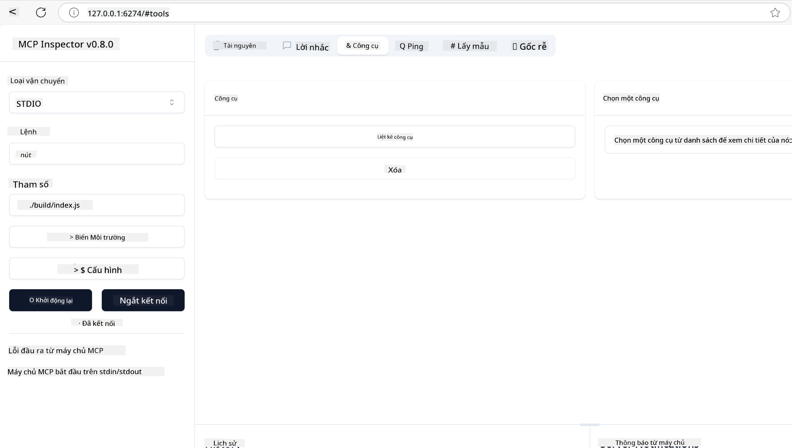
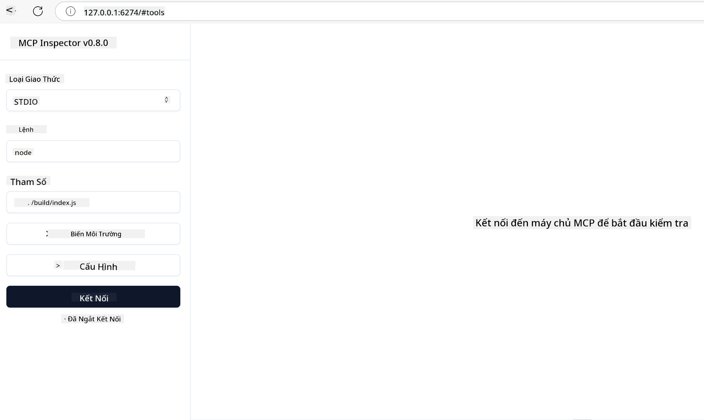
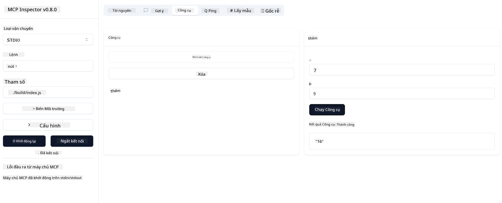

<!--
CO_OP_TRANSLATOR_METADATA:
{
  "original_hash": "5331ffd328a54b90f76706c52b673e27",
  "translation_date": "2025-05-17T08:45:20+00:00",
  "source_file": "03-GettingStarted/01-first-server/README.md",
  "language_code": "vi"
}
-->
# Bắt đầu với MCP

Chào mừng bạn đến với những bước đầu tiên cùng Model Context Protocol (MCP)! Dù bạn mới bắt đầu với MCP hay đang tìm cách hiểu sâu hơn, hướng dẫn này sẽ dẫn bạn qua các bước thiết lập và phát triển cơ bản. Bạn sẽ khám phá cách MCP cho phép tích hợp liền mạch giữa các mô hình AI và ứng dụng, và học cách chuẩn bị môi trường của bạn để xây dựng và kiểm tra các giải pháp sử dụng MCP.

> TLDR; Nếu bạn xây dựng ứng dụng AI, bạn biết rằng bạn có thể thêm công cụ và các tài nguyên khác vào LLM (mô hình ngôn ngữ lớn), để làm cho LLM thông thái hơn. Tuy nhiên, nếu bạn đặt những công cụ và tài nguyên đó trên một máy chủ, ứng dụng và khả năng của máy chủ có thể được sử dụng bởi bất kỳ khách hàng nào có/không có LLM.

## Tổng quan

Bài học này cung cấp hướng dẫn thực tế về thiết lập môi trường MCP và xây dựng ứng dụng MCP đầu tiên của bạn. Bạn sẽ học cách thiết lập các công cụ và framework cần thiết, xây dựng các máy chủ MCP cơ bản, tạo ứng dụng host, và kiểm tra các triển khai của bạn.

Model Context Protocol (MCP) là một giao thức mở tiêu chuẩn hóa cách các ứng dụng cung cấp ngữ cảnh cho LLMs. Hãy nghĩ về MCP như một cổng USB-C cho các ứng dụng AI - nó cung cấp một cách tiêu chuẩn hóa để kết nối các mô hình AI với các nguồn dữ liệu và công cụ khác nhau.

## Mục tiêu học tập

Kết thúc bài học này, bạn sẽ có thể:

- Thiết lập môi trường phát triển cho MCP trong C#, Java, Python, TypeScript và JavaScript
- Xây dựng và triển khai các máy chủ MCP cơ bản với các tính năng tùy chỉnh (tài nguyên, gợi ý, và công cụ)
- Tạo ứng dụng host kết nối với máy chủ MCP
- Kiểm tra và gỡ lỗi các triển khai MCP

## Thiết lập môi trường MCP của bạn

Trước khi bắt đầu làm việc với MCP, điều quan trọng là chuẩn bị môi trường phát triển của bạn và hiểu quy trình làm việc cơ bản. Phần này sẽ hướng dẫn bạn qua các bước thiết lập ban đầu để đảm bảo khởi đầu suôn sẻ với MCP.

### Yêu cầu trước

Trước khi bắt đầu phát triển MCP, hãy đảm bảo bạn có:

- **Môi trường phát triển**: Cho ngôn ngữ bạn chọn (C#, Java, Python, TypeScript, hoặc JavaScript)
- **IDE/Editor**: Visual Studio, Visual Studio Code, IntelliJ, Eclipse, PyCharm, hoặc bất kỳ trình chỉnh sửa mã hiện đại nào
- **Trình quản lý gói**: NuGet, Maven/Gradle, pip, hoặc npm/yarn
- **Khóa API**: Cho bất kỳ dịch vụ AI nào bạn dự định sử dụng trong các ứng dụng host của mình

## Cấu trúc máy chủ MCP cơ bản

Một máy chủ MCP thường bao gồm:

- **Cấu hình máy chủ**: Thiết lập cổng, xác thực và các cài đặt khác
- **Tài nguyên**: Dữ liệu và ngữ cảnh được cung cấp cho LLMs
- **Công cụ**: Chức năng mà mô hình có thể gọi
- **Gợi ý**: Mẫu cho việc tạo hoặc cấu trúc văn bản

Dưới đây là một ví dụ đơn giản bằng TypeScript:

```typescript
import { Server, Tool, Resource } from "@modelcontextprotocol/typescript-server-sdk";

// Create a new MCP server
const server = new Server({
  port: 3000,
  name: "Example MCP Server",
  version: "1.0.0"
});

// Register a tool
server.registerTool({
  name: "calculator",
  description: "Performs basic calculations",
  parameters: {
    expression: {
      type: "string",
      description: "The math expression to evaluate"
    }
  },
  handler: async (params) => {
    const result = eval(params.expression);
    return { result };
  }
});

// Start the server
server.start();
```

Trong đoạn mã trên, chúng ta:

- Nhập các lớp cần thiết từ MCP TypeScript SDK.
- Tạo và cấu hình một thể hiện máy chủ MCP mới.
- Đăng ký một công cụ tùy chỉnh (`calculator`) với một hàm xử lý.
- Khởi động máy chủ để lắng nghe các yêu cầu MCP đến.

## Kiểm tra và gỡ lỗi

Trước khi bạn bắt đầu kiểm tra máy chủ MCP của mình, điều quan trọng là hiểu các công cụ có sẵn và các phương pháp tốt nhất để gỡ lỗi. Kiểm tra hiệu quả đảm bảo máy chủ của bạn hoạt động như mong đợi và giúp bạn nhanh chóng xác định và giải quyết các vấn đề. Phần sau đây phác thảo các phương pháp được khuyến nghị để xác thực triển khai MCP của bạn.

MCP cung cấp các công cụ để giúp bạn kiểm tra và gỡ lỗi máy chủ của mình:

- **Công cụ Inspector**, giao diện đồ họa này cho phép bạn kết nối với máy chủ của mình và kiểm tra các công cụ, gợi ý và tài nguyên.
- **curl**, bạn cũng có thể kết nối với máy chủ của mình bằng một công cụ dòng lệnh như curl hoặc các khách hàng khác có thể tạo và chạy các lệnh HTTP.

### Sử dụng MCP Inspector

[MCP Inspector](https://github.com/modelcontextprotocol/inspector) là một công cụ kiểm tra trực quan giúp bạn:

1. **Khám phá khả năng của máy chủ**: Tự động phát hiện các tài nguyên, công cụ và gợi ý có sẵn
2. **Kiểm tra thực thi công cụ**: Thử các tham số khác nhau và xem phản hồi trong thời gian thực
3. **Xem metadata của máy chủ**: Kiểm tra thông tin máy chủ, sơ đồ và cấu hình

```bash
# ex TypeScript, installing and running MCP Inspector
npx @modelcontextprotocol/inspector node build/index.js
```

Khi bạn chạy các lệnh trên, MCP Inspector sẽ khởi động một giao diện web cục bộ trong trình duyệt của bạn. Bạn có thể mong đợi thấy một bảng điều khiển hiển thị các máy chủ MCP đã đăng ký của bạn, các công cụ, tài nguyên và gợi ý có sẵn của chúng. Giao diện cho phép bạn kiểm tra thực thi công cụ một cách tương tác, kiểm tra metadata máy chủ và xem phản hồi thời gian thực, giúp dễ dàng xác thực và gỡ lỗi các triển khai máy chủ MCP của bạn.

Đây là ảnh chụp màn hình của giao diện có thể trông như thế nào:



## Các vấn đề thiết lập thường gặp và giải pháp

| Vấn đề | Giải pháp có thể |
|-------|-------------------|
| Kết nối bị từ chối | Kiểm tra xem máy chủ có đang chạy và cổng có đúng không |
| Lỗi thực thi công cụ | Kiểm tra lại xác thực tham số và xử lý lỗi |
| Thất bại xác thực | Xác minh khóa API và quyền |
| Lỗi xác thực sơ đồ | Đảm bảo tham số khớp với sơ đồ đã định nghĩa |
| Máy chủ không khởi động | Kiểm tra xung đột cổng hoặc thiếu phụ thuộc |
| Lỗi CORS | Cấu hình tiêu đề CORS đúng cho các yêu cầu từ nguồn khác |
| Vấn đề xác thực | Xác minh tính hợp lệ của token và quyền |

## Phát triển cục bộ

Đối với phát triển và kiểm tra cục bộ, bạn có thể chạy máy chủ MCP trực tiếp trên máy của mình:

1. **Khởi động quá trình máy chủ**: Chạy ứng dụng máy chủ MCP của bạn
2. **Cấu hình mạng**: Đảm bảo máy chủ có thể truy cập trên cổng mong đợi
3. **Kết nối khách hàng**: Sử dụng URL kết nối cục bộ như `http://localhost:3000`

```bash
# Example: Running a TypeScript MCP server locally
npm run start
# Server running at http://localhost:3000
```

## Xây dựng máy chủ MCP đầu tiên của bạn

Chúng ta đã đề cập đến [Khái niệm cốt lõi](/01-CoreConcepts/README.md) trong bài học trước, bây giờ là lúc áp dụng kiến thức đó vào thực tế.

### Những gì một máy chủ có thể làm

Trước khi chúng ta bắt đầu viết mã, hãy nhắc nhở bản thân những gì một máy chủ có thể làm:

Một máy chủ MCP có thể, ví dụ:

- Truy cập các tập tin và cơ sở dữ liệu cục bộ
- Kết nối với các API từ xa
- Thực hiện các phép tính
- Tích hợp với các công cụ và dịch vụ khác
- Cung cấp giao diện người dùng để tương tác

Tuyệt vời, bây giờ chúng ta đã biết những gì chúng ta có thể làm cho nó, hãy bắt đầu mã hóa.

## Bài tập: Tạo một máy chủ

Để tạo một máy chủ, bạn cần thực hiện các bước sau:

- Cài đặt MCP SDK.
- Tạo một dự án và thiết lập cấu trúc dự án.
- Viết mã máy chủ.
- Kiểm tra máy chủ.

### -1- Cài đặt SDK

Điều này có chút khác biệt tùy thuộc vào runtime bạn chọn, vì vậy hãy chọn một trong các runtime dưới đây:

Generative AI có thể tạo văn bản, hình ảnh, và thậm chí cả mã. Bạn được đào tạo trên dữ liệu đến tháng 10 năm 2023.

### -2- Tạo dự án

Bây giờ bạn đã cài đặt SDK của mình, hãy tạo một dự án tiếp theo:

### -3- Tạo các tệp dự án

### -4- Tạo mã máy chủ

### -5- Thêm một công cụ và một tài nguyên

Thêm một công cụ và một tài nguyên bằng cách thêm mã sau:

### -6 Mã cuối cùng

Hãy thêm đoạn mã cuối cùng mà chúng ta cần để máy chủ có thể khởi động:

### -7- Kiểm tra máy chủ

Khởi động máy chủ với lệnh sau:

### -8- Chạy bằng cách sử dụng inspector

Inspector là một công cụ tuyệt vời có thể khởi động máy chủ của bạn và cho phép bạn tương tác với nó để kiểm tra xem nó hoạt động không. Hãy khởi động nó:

> [!NOTE]
> Nó có thể trông khác trong trường "command" vì nó chứa lệnh để chạy một máy chủ với runtime cụ thể của bạn

Bạn sẽ thấy giao diện người dùng sau:



1. Kết nối với máy chủ bằng cách chọn nút Connect 
   Khi bạn kết nối với máy chủ, bạn sẽ thấy giao diện sau:

   

1. Chọn "Tools" và "listTools", bạn sẽ thấy "Add" xuất hiện, chọn "Add" và điền các giá trị tham số.

   Bạn sẽ thấy phản hồi sau, tức là kết quả từ công cụ "add":

   

Chúc mừng, bạn đã tạo và chạy thành công máy chủ đầu tiên của mình!

### SDK chính thức

MCP cung cấp SDK chính thức cho nhiều ngôn ngữ:
- [C# SDK](https://github.com/modelcontextprotocol/csharp-sdk) - Được duy trì cùng với Microsoft
- [Java SDK](https://github.com/modelcontextprotocol/java-sdk) - Được duy trì cùng với Spring AI
- [TypeScript SDK](https://github.com/modelcontextprotocol/typescript-sdk) - Triển khai chính thức cho TypeScript
- [Python SDK](https://github.com/modelcontextprotocol/python-sdk) - Triển khai chính thức cho Python
- [Kotlin SDK](https://github.com/modelcontextprotocol/kotlin-sdk) - Triển khai chính thức cho Kotlin
- [Swift SDK](https://github.com/modelcontextprotocol/swift-sdk) - Được duy trì cùng với Loopwork AI
- [Rust SDK](https://github.com/modelcontextprotocol/rust-sdk) - Triển khai chính thức cho Rust

## Những điểm chính cần ghi nhớ

- Thiết lập môi trường phát triển MCP đơn giản với các SDK theo ngôn ngữ
- Xây dựng máy chủ MCP bao gồm tạo và đăng ký các công cụ với sơ đồ rõ ràng
- Kiểm tra và gỡ lỗi là cần thiết cho các triển khai MCP đáng tin cậy

## Mẫu

- [Java Calculator](../samples/java/calculator/README.md)
- [.Net Calculator](../../../../03-GettingStarted/samples/csharp)
- [JavaScript Calculator](../samples/javascript/README.md)
- [TypeScript Calculator](../samples/typescript/README.md)
- [Python Calculator](../../../../03-GettingStarted/samples/python)

## Bài tập

Tạo một máy chủ MCP đơn giản với một công cụ bạn chọn:
1. Triển khai công cụ trong ngôn ngữ ưa thích của bạn (.NET, Java, Python, hoặc JavaScript).
2. Định nghĩa các tham số đầu vào và giá trị trả về.
3. Chạy công cụ inspector để đảm bảo máy chủ hoạt động như mong đợi.
4. Kiểm tra triển khai với nhiều đầu vào khác nhau.

## Giải pháp

[Giải pháp](./solution/README.md)

## Tài nguyên bổ sung

- [Kho lưu trữ GitHub MCP](https://github.com/microsoft/mcp-for-beginners)

## Tiếp theo

Tiếp theo: [Bắt đầu với MCP Clients](/03-GettingStarted/02-client/README.md)

**Tuyên bố miễn trừ trách nhiệm**:  
Tài liệu này đã được dịch bằng dịch vụ dịch thuật AI [Co-op Translator](https://github.com/Azure/co-op-translator). Mặc dù chúng tôi cố gắng đảm bảo độ chính xác, xin lưu ý rằng các bản dịch tự động có thể chứa lỗi hoặc không chính xác. Tài liệu gốc bằng ngôn ngữ bản địa nên được coi là nguồn đáng tin cậy. Đối với thông tin quan trọng, nên sử dụng dịch vụ dịch thuật chuyên nghiệp của con người. Chúng tôi không chịu trách nhiệm cho bất kỳ sự hiểu lầm hay diễn giải sai nào phát sinh từ việc sử dụng bản dịch này.