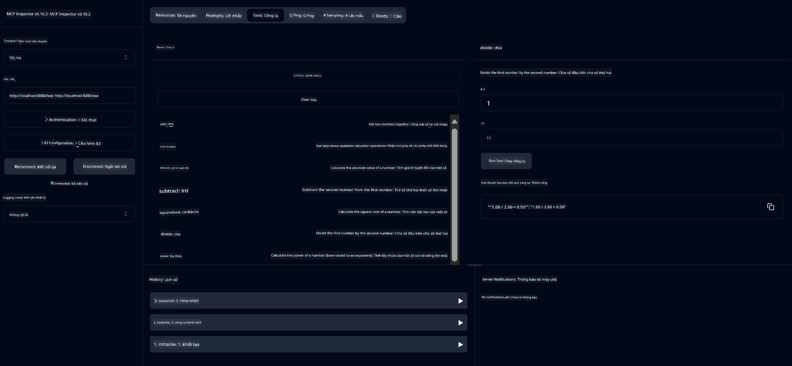

<!--
CO_OP_TRANSLATOR_METADATA:
{
  "original_hash": "ed9cab32cc67c12d8969b407aa47100a",
  "translation_date": "2025-07-13T17:55:31+00:00",
  "source_file": "03-GettingStarted/01-first-server/solution/java/README.md",
  "language_code": "vi"
}
-->
# Dịch vụ Máy tính Cơ bản MCP

Dịch vụ này cung cấp các phép toán máy tính cơ bản thông qua Model Context Protocol (MCP) sử dụng Spring Boot với giao thức WebFlux. Nó được thiết kế như một ví dụ đơn giản dành cho người mới bắt đầu tìm hiểu về các triển khai MCP.

Để biết thêm thông tin, xem tài liệu tham khảo [MCP Server Boot Starter](https://docs.spring.io/spring-ai/reference/api/mcp/mcp-server-boot-starter-docs.html).


## Sử dụng Dịch vụ

Dịch vụ cung cấp các điểm cuối API sau thông qua giao thức MCP:

- `add(a, b)`: Cộng hai số lại với nhau
- `subtract(a, b)`: Trừ số thứ hai khỏi số thứ nhất
- `multiply(a, b)`: Nhân hai số
- `divide(a, b)`: Chia số thứ nhất cho số thứ hai (có kiểm tra chia cho 0)
- `power(base, exponent)`: Tính lũy thừa của một số
- `squareRoot(number)`: Tính căn bậc hai (có kiểm tra số âm)
- `modulus(a, b)`: Tính phần dư khi chia
- `absolute(number)`: Tính giá trị tuyệt đối

## Phụ thuộc

Dự án yêu cầu các phụ thuộc chính sau:

```xml
<dependency>
    <groupId>org.springframework.ai</groupId>
    <artifactId>spring-ai-starter-mcp-server-webflux</artifactId>
</dependency>
```

## Xây dựng Dự án

Xây dựng dự án bằng Maven:
```bash
./mvnw clean install -DskipTests
```

## Chạy Máy chủ

### Sử dụng Java

```bash
java -jar target/calculator-server-0.0.1-SNAPSHOT.jar
```

### Sử dụng MCP Inspector

MCP Inspector là công cụ hữu ích để tương tác với các dịch vụ MCP. Để sử dụng nó với dịch vụ máy tính này:

1. **Cài đặt và chạy MCP Inspector** trong cửa sổ terminal mới:
   ```bash
   npx @modelcontextprotocol/inspector
   ```

2. **Truy cập giao diện web** bằng cách nhấp vào URL hiển thị bởi ứng dụng (thường là http://localhost:6274)

3. **Cấu hình kết nối**:
   - Đặt loại giao thức là "SSE"
   - Đặt URL đến điểm cuối SSE của máy chủ đang chạy: `http://localhost:8080/sse`
   - Nhấn "Connect"

4. **Sử dụng công cụ**:
   - Nhấn "List Tools" để xem các phép toán máy tính có sẵn
   - Chọn một công cụ và nhấn "Run Tool" để thực thi phép toán



**Tuyên bố từ chối trách nhiệm**:  
Tài liệu này đã được dịch bằng dịch vụ dịch thuật AI [Co-op Translator](https://github.com/Azure/co-op-translator). Mặc dù chúng tôi cố gắng đảm bảo độ chính xác, xin lưu ý rằng bản dịch tự động có thể chứa lỗi hoặc không chính xác. Tài liệu gốc bằng ngôn ngữ gốc của nó nên được coi là nguồn chính xác và đáng tin cậy. Đối với các thông tin quan trọng, nên sử dụng dịch vụ dịch thuật chuyên nghiệp do con người thực hiện. Chúng tôi không chịu trách nhiệm về bất kỳ sự hiểu lầm hoặc giải thích sai nào phát sinh từ việc sử dụng bản dịch này.