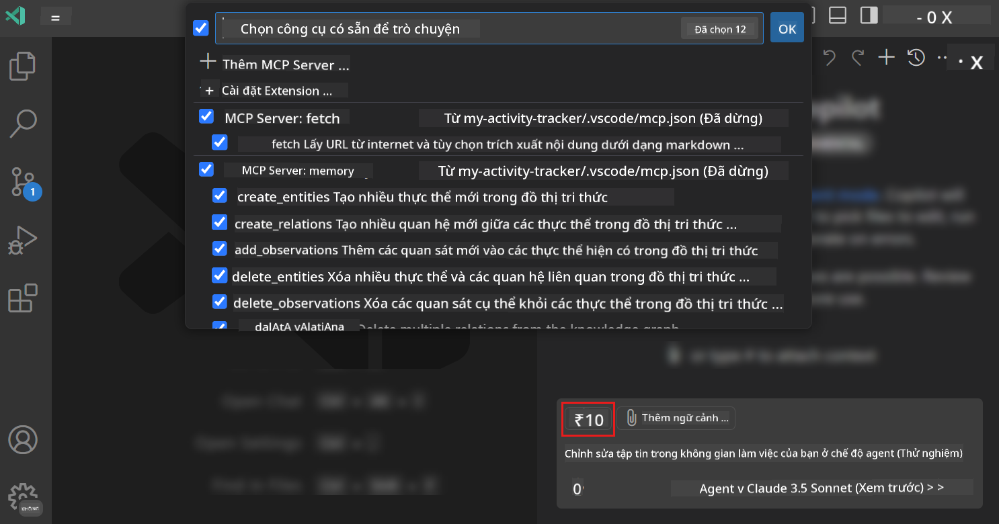
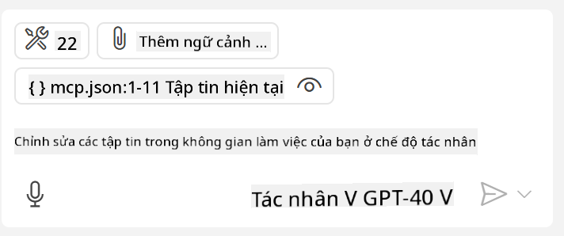
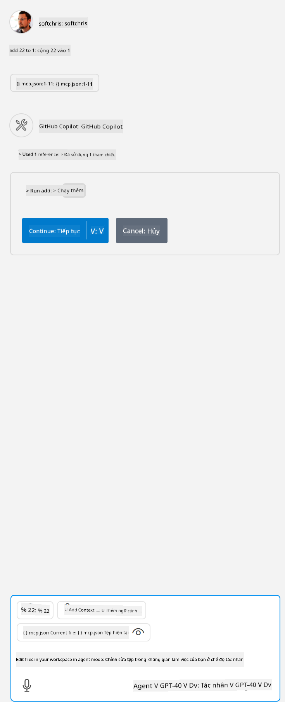

<!--
CO_OP_TRANSLATOR_METADATA:
{
  "original_hash": "d940b5e0af75e3a3a4d1c3179120d1d9",
  "translation_date": "2025-08-26T18:01:50+00:00",
  "source_file": "03-GettingStarted/04-vscode/README.md",
  "language_code": "vi"
}
-->
# Sử dụng máy chủ từ chế độ Agent của GitHub Copilot

Visual Studio Code và GitHub Copilot có thể hoạt động như một client và sử dụng một MCP Server. Tại sao chúng ta lại muốn làm điều đó, bạn có thể hỏi? Chà, điều này có nghĩa là bất kỳ tính năng nào mà MCP Server có đều có thể được sử dụng ngay trong IDE của bạn. Hãy tưởng tượng bạn thêm, ví dụ, MCP Server của GitHub, điều này sẽ cho phép bạn kiểm soát GitHub thông qua các lệnh tự nhiên thay vì phải gõ các lệnh cụ thể trong terminal. Hoặc tưởng tượng bất kỳ điều gì có thể cải thiện trải nghiệm phát triển của bạn, tất cả đều được điều khiển bằng ngôn ngữ tự nhiên. Bây giờ bạn đã thấy lợi ích rồi đúng không?

## Tổng quan

Bài học này hướng dẫn cách sử dụng Visual Studio Code và chế độ Agent của GitHub Copilot như một client cho MCP Server.

## Mục tiêu học tập

Sau khi hoàn thành bài học này, bạn sẽ có thể:

- Sử dụng một MCP Server thông qua Visual Studio Code.
- Chạy các công cụ và tính năng thông qua GitHub Copilot.
- Cấu hình Visual Studio Code để tìm và quản lý MCP Server của bạn.

## Cách sử dụng

Bạn có thể kiểm soát MCP Server của mình theo hai cách khác nhau:

- Giao diện người dùng, bạn sẽ thấy cách thực hiện điều này trong phần sau của chương.
- Terminal, bạn có thể kiểm soát mọi thứ từ terminal bằng cách sử dụng lệnh `code`:

  Để thêm một MCP Server vào hồ sơ người dùng của bạn, sử dụng tùy chọn dòng lệnh --add-mcp và cung cấp cấu hình server JSON dưới dạng {\"name\":\"server-name\",\"command\":...}.

  ```
  code --add-mcp "{\"name\":\"my-server\",\"command\": \"uvx\",\"args\": [\"mcp-server-fetch\"]}"
  ```

### Ảnh chụp màn hình





Hãy cùng thảo luận thêm về cách sử dụng giao diện trực quan trong các phần tiếp theo.

## Cách tiếp cận

Đây là cách chúng ta cần tiếp cận ở mức độ cao:

- Cấu hình một tệp để tìm MCP Server của chúng ta.
- Khởi động/Kết nối với server đó để liệt kê các tính năng của nó.
- Sử dụng các tính năng đó thông qua giao diện Chat của GitHub Copilot.

Tuyệt vời, bây giờ chúng ta đã hiểu quy trình, hãy thử sử dụng một MCP Server thông qua Visual Studio Code qua một bài tập.

## Bài tập: Sử dụng một server

Trong bài tập này, chúng ta sẽ cấu hình Visual Studio Code để tìm MCP Server của bạn để có thể sử dụng nó thông qua giao diện Chat của GitHub Copilot.

### -0- Bước chuẩn bị, bật tính năng phát hiện MCP Server

Bạn có thể cần bật tính năng phát hiện MCP Server.

1. Đi tới `File -> Preferences -> Settings` trong Visual Studio Code.

1. Tìm kiếm "MCP" và bật `chat.mcp.discovery.enabled` trong tệp settings.json.

### -1- Tạo tệp cấu hình

Bắt đầu bằng cách tạo một tệp cấu hình trong thư mục gốc của dự án, bạn sẽ cần một tệp có tên MCP.json và đặt nó trong một thư mục có tên .vscode. Nó sẽ trông như sau:

```text
.vscode
|-- mcp.json
```

Tiếp theo, hãy xem cách thêm một mục server.

### -2- Cấu hình một server

Thêm nội dung sau vào tệp *mcp.json*:

```json
{
    "inputs": [],
    "servers": {
       "hello-mcp": {
           "command": "node",
           "args": [
               "build/index.js"
           ]
       }
    }
}
```

Đây là một ví dụ đơn giản về cách khởi động một server viết bằng Node.js, đối với các runtime khác, hãy chỉ ra lệnh phù hợp để khởi động server bằng `command` và `args`.

### -3- Khởi động server

Bây giờ bạn đã thêm một mục, hãy khởi động server:

1. Tìm mục của bạn trong *mcp.json* và đảm bảo bạn tìm thấy biểu tượng "play":

    

1. Nhấp vào biểu tượng "play", bạn sẽ thấy biểu tượng công cụ trong GitHub Copilot Chat tăng số lượng công cụ có sẵn. Nếu bạn nhấp vào biểu tượng công cụ đó, bạn sẽ thấy danh sách các công cụ đã đăng ký. Bạn có thể chọn/bỏ chọn từng công cụ tùy thuộc vào việc bạn muốn GitHub Copilot sử dụng chúng làm ngữ cảnh:

  

1. Để chạy một công cụ, nhập một lệnh mà bạn biết sẽ khớp với mô tả của một trong các công cụ của bạn, ví dụ như lệnh "add 22 to 1":

  

  Bạn sẽ thấy một phản hồi là 23.

## Bài tập

Hãy thử thêm một mục server vào tệp *mcp.json* của bạn và đảm bảo bạn có thể khởi động/dừng server. Đảm bảo bạn cũng có thể giao tiếp với các công cụ trên server của mình thông qua giao diện Chat của GitHub Copilot.

## Giải pháp

[Giải pháp](./solution/README.md)

## Những điểm cần ghi nhớ

Những điểm cần ghi nhớ từ chương này là:

- Visual Studio Code là một client tuyệt vời cho phép bạn sử dụng nhiều MCP Server và các công cụ của chúng.
- Giao diện Chat của GitHub Copilot là cách bạn tương tác với các server.
- Bạn có thể yêu cầu người dùng nhập các thông tin như API key để truyền vào MCP Server khi cấu hình mục server trong tệp *mcp.json*.

## Mẫu

- [Máy tính Java](../samples/java/calculator/README.md)
- [Máy tính .Net](../../../../03-GettingStarted/samples/csharp)
- [Máy tính JavaScript](../samples/javascript/README.md)
- [Máy tính TypeScript](../samples/typescript/README.md)
- [Máy tính Python](../../../../03-GettingStarted/samples/python)

## Tài nguyên bổ sung

- [Tài liệu Visual Studio](https://code.visualstudio.com/docs/copilot/chat/mcp-servers)

## Tiếp theo

- Tiếp theo: [Tạo một stdio Server](../05-stdio-server/README.md)

---

**Tuyên bố miễn trừ trách nhiệm**:  
Tài liệu này đã được dịch bằng dịch vụ dịch thuật AI [Co-op Translator](https://github.com/Azure/co-op-translator). Mặc dù chúng tôi cố gắng đảm bảo độ chính xác, xin lưu ý rằng các bản dịch tự động có thể chứa lỗi hoặc không chính xác. Tài liệu gốc bằng ngôn ngữ bản địa nên được coi là nguồn thông tin chính thức. Đối với các thông tin quan trọng, nên sử dụng dịch vụ dịch thuật chuyên nghiệp bởi con người. Chúng tôi không chịu trách nhiệm cho bất kỳ sự hiểu lầm hoặc diễn giải sai nào phát sinh từ việc sử dụng bản dịch này.