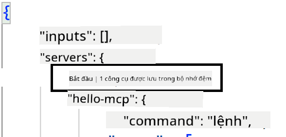
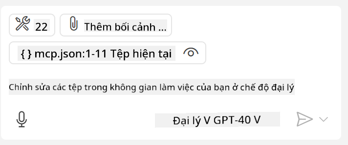
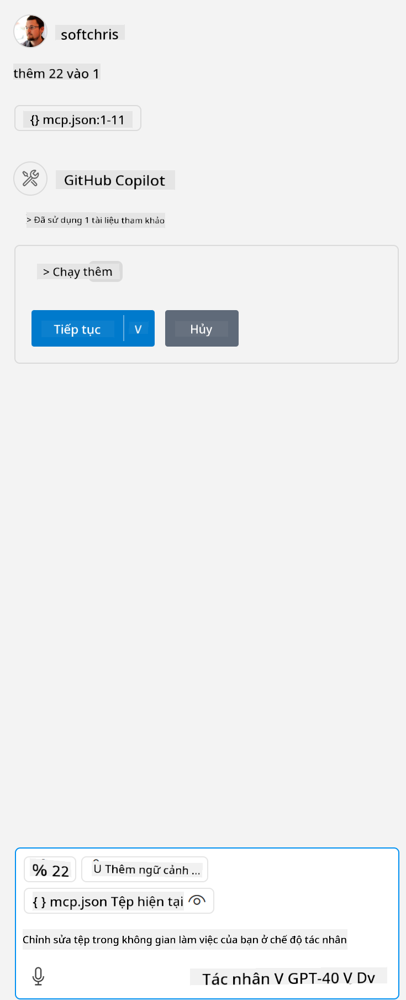

<!--
CO_OP_TRANSLATOR_METADATA:
{
  "original_hash": "c37fabfbc0dcbc9a4afb6d17e7d3be9f",
  "translation_date": "2025-05-17T11:12:01+00:00",
  "source_file": "03-GettingStarted/04-vscode/README.md",
  "language_code": "vi"
}
-->
Hãy nói thêm về cách chúng ta sử dụng giao diện hình ảnh trong các phần tiếp theo.

## Phương pháp

Đây là cách chúng ta cần tiếp cận ở mức độ cao:

- Cấu hình một tệp để tìm MCP Server của chúng ta.
- Khởi động/Kết nối đến máy chủ đó để liệt kê các khả năng của nó.
- Sử dụng các khả năng đó thông qua giao diện chat của GitHub Copilot.

Tuyệt vời, bây giờ chúng ta đã hiểu quy trình, hãy thử sử dụng một MCP Server thông qua Visual Studio Code qua một bài tập.

## Bài tập: Sử dụng một máy chủ

Trong bài tập này, chúng ta sẽ cấu hình Visual Studio Code để tìm MCP Server của bạn để có thể sử dụng từ giao diện chat của GitHub Copilot.

### -0- Bước chuẩn bị, kích hoạt khám phá MCP Server

Bạn có thể cần kích hoạt việc khám phá các MCP Server.

1. Đi tới `File -> Preferences -> Settings` in Visual Studio Code.

1. Search for "MCP" and enable `chat.mcp.discovery.enabled` trong tệp settings.json.

### -1- Tạo tệp cấu hình

Bắt đầu bằng cách tạo một tệp cấu hình trong thư mục gốc của dự án của bạn, bạn sẽ cần một tệp gọi là MCP.json và đặt nó trong một thư mục gọi là .vscode. Nó nên trông như thế này:

```text
.vscode
|-- mcp.json
```

Tiếp theo, hãy xem cách chúng ta có thể thêm một mục máy chủ.

### -2- Cấu hình một máy chủ

Thêm nội dung sau vào *mcp.json*:

```json
{
    "inputs": [],
    "servers": {
       "hello-mcp": {
           "command": "cmd",
           "args": [
               "/c", "node", "<absolute path>\\build\\index.js"
           ]
       }
    }
}
```

Đây là một ví dụ đơn giản về cách khởi động một máy chủ viết bằng Node.js, đối với các runtime khác hãy chỉ ra lệnh thích hợp để khởi động máy chủ bằng `command` and `args`.

### -3- Khởi động máy chủ

Bây giờ bạn đã thêm một mục, hãy khởi động máy chủ:

1. Tìm mục của bạn trong *mcp.json* và đảm bảo bạn tìm thấy biểu tượng "play":

    

1. Nhấp vào biểu tượng "play", bạn sẽ thấy biểu tượng công cụ trong GitHub Copilot chat tăng số lượng công cụ có sẵn. Nếu bạn nhấp vào biểu tượng công cụ đó, bạn sẽ thấy danh sách các công cụ đã đăng ký. Bạn có thể kiểm tra/bỏ chọn từng công cụ tùy thuộc vào việc bạn muốn GitHub Copilot sử dụng chúng làm ngữ cảnh:

  

1. Để chạy một công cụ, hãy nhập một lời nhắc mà bạn biết sẽ phù hợp với mô tả của một trong các công cụ của bạn, ví dụ một lời nhắc như "add 22 to 1":

  

  Bạn sẽ thấy một phản hồi nói 23.

## Bài tập

Hãy thử thêm một mục máy chủ vào tệp *mcp.json* của bạn và đảm bảo bạn có thể khởi động/dừng máy chủ. Đảm bảo bạn cũng có thể giao tiếp với các công cụ trên máy chủ của bạn thông qua giao diện chat của GitHub Copilot.

## Giải pháp

[Giải pháp](./solution/README.md)

## Những điểm cần nhớ

Những điểm cần nhớ từ chương này là:

- Visual Studio Code là một client tuyệt vời cho phép bạn sử dụng nhiều MCP Server và các công cụ của chúng.
- Giao diện chat của GitHub Copilot là cách bạn tương tác với các máy chủ.
- Bạn có thể nhắc người dùng nhập các thông tin như API key có thể được chuyển đến MCP Server khi cấu hình mục máy chủ trong tệp *mcp.json*.

## Mẫu

- [Java Calculator](../samples/java/calculator/README.md)
- [.Net Calculator](../../../../03-GettingStarted/samples/csharp)
- [JavaScript Calculator](../samples/javascript/README.md)
- [TypeScript Calculator](../samples/typescript/README.md)
- [Python Calculator](../../../../03-GettingStarted/samples/python) 

## Tài nguyên bổ sung

- [Tài liệu Visual Studio](https://code.visualstudio.com/docs/copilot/chat/mcp-servers)

## Tiếp theo

- Tiếp theo: [Tạo một SSE Server](/03-GettingStarted/05-sse-server/README.md)

**Tuyên bố miễn trừ trách nhiệm**:  
Tài liệu này đã được dịch bằng dịch vụ dịch thuật AI [Co-op Translator](https://github.com/Azure/co-op-translator). Mặc dù chúng tôi cố gắng đảm bảo độ chính xác, xin lưu ý rằng các bản dịch tự động có thể chứa lỗi hoặc không chính xác. Tài liệu gốc bằng ngôn ngữ bản địa của nó nên được coi là nguồn thông tin chính thức. Đối với thông tin quan trọng, nên sử dụng dịch vụ dịch thuật chuyên nghiệp của con người. Chúng tôi không chịu trách nhiệm cho bất kỳ sự hiểu lầm hoặc giải thích sai nào phát sinh từ việc sử dụng bản dịch này.