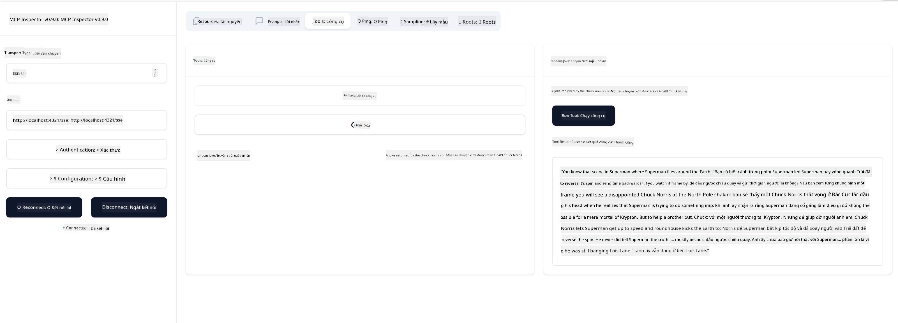

<!--
CO_OP_TRANSLATOR_METADATA:
{
  "original_hash": "3dd2f1e39277c31b0e57e29d165354d6",
  "translation_date": "2025-06-13T00:27:40+00:00",
  "source_file": "03-GettingStarted/05-sse-server/README.md",
  "language_code": "vi"
}
-->
Bây giờ chúng ta đã hiểu thêm về SSE, hãy cùng xây dựng một server SSE tiếp theo.

## Bài tập: Tạo một server SSE

Để tạo server, chúng ta cần nhớ hai điều:

- Cần sử dụng một web server để mở các endpoint cho kết nối và tin nhắn.
- Xây dựng server giống như cách thường làm với các công cụ, tài nguyên và prompt khi sử dụng stdio.

### -1- Tạo một instance server

Để tạo server, ta sử dụng cùng loại như với stdio. Tuy nhiên, với transport, ta cần chọn SSE.

---

Tiếp theo, hãy thêm các route cần thiết.

### -2- Thêm các route

Thêm các route để xử lý kết nối và tin nhắn đến:

---

Tiếp theo, hãy thêm các khả năng cho server.

### -3- Thêm khả năng cho server

Bây giờ khi đã định nghĩa xong các phần đặc thù của SSE, hãy thêm các khả năng cho server như công cụ, prompt và tài nguyên.

---

Mã đầy đủ của bạn sẽ trông như sau:

---

Tuyệt vời, chúng ta đã có một server sử dụng SSE, hãy thử nghiệm nó tiếp theo.

## Bài tập: Debug server SSE với Inspector

Inspector là một công cụ tuyệt vời mà ta đã thấy trong bài học trước [Creating your first server](/03-GettingStarted/01-first-server/README.md). Hãy xem ta có thể dùng Inspector ở đây không:

### -1- Chạy Inspector

Để chạy Inspector, trước tiên bạn phải có một server SSE đang chạy, vậy hãy làm điều đó trước:

1. Chạy server

---

1. Chạy Inspector

    > ![NOTE]
    > Chạy lệnh này trong một cửa sổ terminal khác với nơi server đang chạy. Cũng lưu ý, bạn cần điều chỉnh lệnh dưới đây để phù hợp với URL nơi server của bạn đang chạy.

    ```sh
    npx @modelcontextprotocol/inspector --cli http://localhost:8000/sse --method tools/list
    ```

    Việc chạy Inspector giống nhau trên mọi runtime. Lưu ý thay vì truyền đường dẫn đến server và lệnh khởi động server, ta truyền URL nơi server đang chạy và chỉ định thêm route `/sse`.

### -2- Thử nghiệm công cụ

Kết nối server bằng cách chọn SSE trong danh sách thả xuống và điền trường url nơi server của bạn đang chạy, ví dụ http:localhost:4321/sse. Sau đó bấm nút "Connect". Như trước, chọn để liệt kê các công cụ, chọn một công cụ và nhập giá trị đầu vào. Bạn sẽ thấy kết quả như hình dưới:



Tuyệt vời, bạn đã có thể làm việc với Inspector, bây giờ hãy xem cách làm việc với Visual Studio Code.

## Bài tập về nhà

Thử xây dựng server của bạn với nhiều khả năng hơn. Tham khảo [trang này](https://api.chucknorris.io/) để ví dụ thêm một công cụ gọi API, bạn quyết định server nên trông như thế nào. Chúc vui :)

## Giải pháp

[Giải pháp](./solution/README.md) Đây là một giải pháp có mã hoạt động.

## Những điểm cần nhớ

Những điểm chính của chương này là:

- SSE là loại transport thứ hai được hỗ trợ bên cạnh stdio.
- Để hỗ trợ SSE, bạn cần quản lý kết nối và tin nhắn đến bằng một web framework.
- Bạn có thể sử dụng cả Inspector và Visual Studio Code để tiêu thụ server SSE, giống như với server stdio. Lưu ý có một số khác biệt nhỏ giữa stdio và SSE. Với SSE, bạn cần khởi động server riêng biệt rồi chạy công cụ Inspector. Với Inspector, cũng có khác biệt khi bạn cần chỉ định URL.

## Mẫu

- [Java Calculator](../samples/java/calculator/README.md)
- [.Net Calculator](../../../../03-GettingStarted/samples/csharp)
- [JavaScript Calculator](../samples/javascript/README.md)
- [TypeScript Calculator](../samples/typescript/README.md)
- [Python Calculator](../../../../03-GettingStarted/samples/python) 

## Tài nguyên bổ sung

- [SSE](https://developer.mozilla.org/en-US/docs/Web/API/Server-sent_events)

## Tiếp theo

- Tiếp theo: [HTTP Streaming with MCP (Streamable HTTP)](/03-GettingStarted/06-http-streaming/README.md)

**Tuyên bố miễn trừ trách nhiệm**:  
Tài liệu này đã được dịch bằng dịch vụ dịch thuật AI [Co-op Translator](https://github.com/Azure/co-op-translator). Mặc dù chúng tôi cố gắng đảm bảo độ chính xác, xin lưu ý rằng bản dịch tự động có thể chứa lỗi hoặc không chính xác. Tài liệu gốc bằng ngôn ngữ gốc nên được coi là nguồn tham khảo chính xác nhất. Đối với các thông tin quan trọng, nên sử dụng dịch vụ dịch thuật chuyên nghiệp do con người thực hiện. Chúng tôi không chịu trách nhiệm đối với bất kỳ sự hiểu lầm hay giải thích sai nào phát sinh từ việc sử dụng bản dịch này.