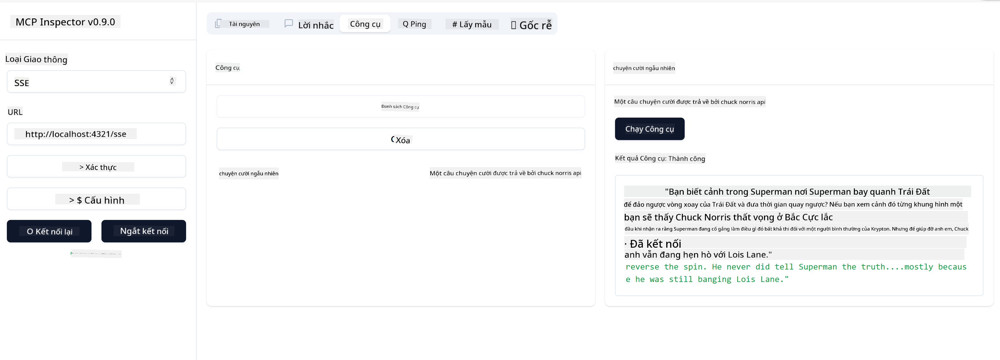

<!--
CO_OP_TRANSLATOR_METADATA:
{
  "original_hash": "0a8086dc4bf89448f83e7936db972c42",
  "translation_date": "2025-05-17T11:39:31+00:00",
  "source_file": "03-GettingStarted/05-sse-server/README.md",
  "language_code": "vi"
}
-->
Giờ thì chúng ta đã biết thêm một chút về SSE, hãy tạo một máy chủ SSE tiếp theo.

## Bài tập: Tạo máy chủ SSE

Để tạo máy chủ của chúng ta, cần lưu ý hai điều:

- Cần sử dụng máy chủ web để mở các điểm cuối cho kết nối và tin nhắn.
- Xây dựng máy chủ của chúng ta như bình thường với các công cụ, tài nguyên và gợi ý khi chúng ta sử dụng stdio.

### -1- Tạo một thể hiện máy chủ

Để tạo máy chủ của chúng ta, chúng ta sử dụng cùng loại như với stdio. Tuy nhiên, đối với loại truyền tải, chúng ta cần chọn SSE.

Hãy thêm các tuyến cần thiết tiếp theo.

### -2- Thêm các tuyến

Hãy thêm các tuyến tiếp theo để xử lý kết nối và tin nhắn đến:

Hãy thêm các khả năng cho máy chủ tiếp theo.

### -3- Thêm các khả năng của máy chủ

Bây giờ chúng ta đã xác định tất cả những điều cụ thể về SSE, hãy thêm các khả năng của máy chủ như công cụ, gợi ý và tài nguyên.

Mã đầy đủ của bạn sẽ trông như thế này:

Tuyệt vời, chúng ta đã có một máy chủ sử dụng SSE, hãy thử nó tiếp theo.

## Bài tập: Gỡ lỗi máy chủ SSE với Inspector

Inspector là một công cụ tuyệt vời mà chúng ta đã thấy trong bài học trước [Tạo máy chủ đầu tiên của bạn](/03-GettingStarted/01-first-server/README.md). Hãy xem liệu chúng ta có thể sử dụng Inspector ngay cả ở đây:

### -1- Chạy inspector

Để chạy inspector, trước tiên bạn phải có một máy chủ SSE đang chạy, vì vậy hãy làm điều đó tiếp theo:

1. Chạy máy chủ

1. Chạy inspector

    > ![NOTE]
    > Chạy điều này trong một cửa sổ terminal riêng biệt với máy chủ đang chạy. Cũng lưu ý, bạn cần điều chỉnh lệnh dưới đây để phù hợp với URL nơi máy chủ của bạn đang chạy.

    ```sh
    npx @modelcontextprotocol/inspector --cli http://localhost:8000/sse --method tools/list
    ```

    Chạy inspector trông giống nhau trong tất cả các runtime. Lưu ý cách chúng ta thay vì truyền một đường dẫn đến máy chủ của chúng ta và một lệnh để bắt đầu máy chủ, chúng ta thay vào đó truyền URL nơi máy chủ đang chạy và chúng ta cũng chỉ định tuyến `/sse`.

### -2- Thử công cụ

Kết nối máy chủ bằng cách chọn SSE trong danh sách thả xuống và điền vào trường URL nơi máy chủ của bạn đang chạy, ví dụ http:localhost:4321/sse. Bây giờ nhấn nút "Connect". Như trước đây, chọn để liệt kê công cụ, chọn một công cụ và cung cấp giá trị đầu vào. Bạn sẽ thấy kết quả như dưới đây:



Tuyệt vời, bạn có thể làm việc với inspector, hãy xem cách chúng ta có thể làm việc với Visual Studio Code tiếp theo.

## Bài tập

Thử xây dựng máy chủ của bạn với nhiều khả năng hơn. Xem [trang này](https://api.chucknorris.io/) để ví dụ thêm một công cụ gọi API, bạn quyết định máy chủ nên trông như thế nào. Chúc vui vẻ :)

## Giải pháp

[Giải pháp](./solution/README.md) Đây là một giải pháp khả thi với mã hoạt động.

## Những điều cần ghi nhớ

Những điều cần ghi nhớ từ chương này là:

- SSE là loại truyền tải thứ hai bên cạnh stdio.
- Để hỗ trợ SSE, bạn cần quản lý các kết nối đến và tin nhắn bằng cách sử dụng một framework web.
- Bạn có thể sử dụng cả Inspector và Visual Studio Code để tiêu thụ máy chủ SSE, giống như các máy chủ stdio. Lưu ý cách nó khác biệt một chút giữa stdio và SSE. Đối với SSE, bạn cần khởi động máy chủ riêng biệt và sau đó chạy công cụ inspector của bạn. Đối với công cụ inspector, cũng có một số khác biệt trong việc bạn cần chỉ định URL.

## Mẫu

- [Java Calculator](../samples/java/calculator/README.md)
- [.Net Calculator](../../../../03-GettingStarted/samples/csharp)
- [JavaScript Calculator](../samples/javascript/README.md)
- [TypeScript Calculator](../samples/typescript/README.md)
- [Python Calculator](../../../../03-GettingStarted/samples/python)

## Tài nguyên bổ sung

- [SSE](https://developer.mozilla.org/en-US/docs/Web/API/Server-sent_events)

## Tiếp theo

- Tiếp theo: [Bắt đầu với AI Toolkit cho VSCode](/03-GettingStarted/06-aitk/README.md)

**Tuyên bố từ chối trách nhiệm**:  
Tài liệu này đã được dịch bằng dịch vụ dịch thuật AI [Co-op Translator](https://github.com/Azure/co-op-translator). Mặc dù chúng tôi cố gắng đảm bảo độ chính xác, xin lưu ý rằng các bản dịch tự động có thể chứa lỗi hoặc không chính xác. Tài liệu gốc bằng ngôn ngữ bản địa nên được coi là nguồn thông tin chính thức. Đối với thông tin quan trọng, khuyến nghị sử dụng dịch vụ dịch thuật chuyên nghiệp từ con người. Chúng tôi không chịu trách nhiệm cho bất kỳ sự hiểu lầm hoặc giải thích sai nào phát sinh từ việc sử dụng bản dịch này.