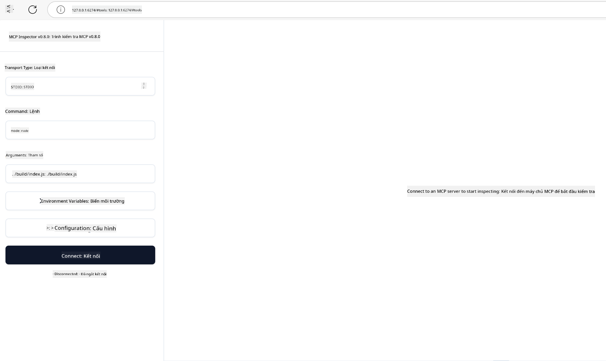

<!--
CO_OP_TRANSLATOR_METADATA:
{
  "original_hash": "4e34e34e84f013e73c7eaa6d09884756",
  "translation_date": "2025-07-13T22:02:14+00:00",
  "source_file": "03-GettingStarted/08-testing/README.md",
  "language_code": "vi"
}
-->
## Kiểm thử và Gỡ lỗi

Trước khi bắt đầu kiểm thử server MCP của bạn, điều quan trọng là phải hiểu các công cụ có sẵn và các phương pháp tốt nhất để gỡ lỗi. Kiểm thử hiệu quả đảm bảo server của bạn hoạt động như mong đợi và giúp bạn nhanh chóng phát hiện cũng như khắc phục sự cố. Phần sau đây sẽ trình bày các cách tiếp cận được khuyến nghị để xác thực việc triển khai MCP của bạn.

## Tổng quan

Bài học này sẽ hướng dẫn cách chọn phương pháp kiểm thử phù hợp và công cụ kiểm thử hiệu quả nhất.

## Mục tiêu học tập

Sau bài học này, bạn sẽ có thể:

- Mô tả các phương pháp kiểm thử khác nhau.
- Sử dụng các công cụ khác nhau để kiểm thử mã của bạn một cách hiệu quả.

## Kiểm thử Server MCP

MCP cung cấp các công cụ giúp bạn kiểm thử và gỡ lỗi server của mình:

- **MCP Inspector**: Công cụ dòng lệnh có thể chạy dưới dạng CLI hoặc giao diện trực quan.
- **Kiểm thử thủ công**: Bạn có thể dùng công cụ như curl để gửi các yêu cầu web, hoặc bất kỳ công cụ nào có thể thực thi HTTP.
- **Kiểm thử đơn vị**: Bạn có thể sử dụng framework kiểm thử yêu thích để kiểm thử các tính năng của cả server và client.

### Sử dụng MCP Inspector

Chúng tôi đã mô tả cách sử dụng công cụ này trong các bài học trước, nhưng hãy cùng điểm qua một cách tổng quan. Đây là công cụ được xây dựng trên Node.js và bạn có thể sử dụng nó bằng cách gọi thực thi `npx`, công cụ này sẽ tải xuống và cài đặt tạm thời MCP Inspector, sau đó tự động dọn dẹp khi hoàn thành yêu cầu của bạn.

[MCP Inspector](https://github.com/modelcontextprotocol/inspector) giúp bạn:

- **Khám phá khả năng của Server**: Tự động phát hiện các tài nguyên, công cụ và lời nhắc có sẵn
- **Kiểm thử thực thi công cụ**: Thử các tham số khác nhau và xem phản hồi theo thời gian thực
- **Xem metadata của Server**: Kiểm tra thông tin server, schema và cấu hình

Một ví dụ chạy công cụ như sau:

```bash
npx @modelcontextprotocol/inspector node build/index.js
```

Lệnh trên khởi động MCP cùng giao diện trực quan và mở giao diện web cục bộ trên trình duyệt của bạn. Bạn sẽ thấy một bảng điều khiển hiển thị các server MCP đã đăng ký, các công cụ, tài nguyên và lời nhắc có sẵn. Giao diện cho phép bạn tương tác kiểm thử thực thi công cụ, kiểm tra metadata server và xem phản hồi theo thời gian thực, giúp việc xác thực và gỡ lỗi các triển khai MCP trở nên dễ dàng hơn.

Giao diện có thể trông như thế này: 

Bạn cũng có thể chạy công cụ này ở chế độ CLI bằng cách thêm thuộc tính `--cli`. Ví dụ dưới đây chạy công cụ ở chế độ "CLI" liệt kê tất cả các công cụ trên server:

```sh
npx @modelcontextprotocol/inspector --cli node build/index.js --method tools/list
```

### Kiểm thử thủ công

Ngoài việc chạy công cụ inspector để kiểm thử khả năng của server, một cách tiếp cận tương tự là chạy client có thể sử dụng HTTP, ví dụ như curl.

Với curl, bạn có thể kiểm thử trực tiếp server MCP bằng các yêu cầu HTTP:

```bash
# Example: Test server metadata
curl http://localhost:3000/v1/metadata

# Example: Execute a tool
curl -X POST http://localhost:3000/v1/tools/execute \
  -H "Content-Type: application/json" \
  -d '{"name": "calculator", "parameters": {"expression": "2+2"}}'
```

Như bạn thấy trong ví dụ sử dụng curl trên, bạn dùng yêu cầu POST để gọi một công cụ với payload gồm tên công cụ và các tham số của nó. Hãy chọn cách phù hợp nhất với bạn. Các công cụ CLI thường nhanh hơn khi sử dụng và dễ dàng được lập trình tự động, điều này rất hữu ích trong môi trường CI/CD.

### Kiểm thử đơn vị

Tạo các bài kiểm thử đơn vị cho các công cụ và tài nguyên của bạn để đảm bảo chúng hoạt động như mong đợi. Dưới đây là ví dụ mã kiểm thử.

```python
import pytest

from mcp.server.fastmcp import FastMCP
from mcp.shared.memory import (
    create_connected_server_and_client_session as create_session,
)

# Mark the whole module for async tests
pytestmark = pytest.mark.anyio


async def test_list_tools_cursor_parameter():
    """Test that the cursor parameter is accepted for list_tools.

    Note: FastMCP doesn't currently implement pagination, so this test
    only verifies that the cursor parameter is accepted by the client.
    """

 server = FastMCP("test")

    # Create a couple of test tools
    @server.tool(name="test_tool_1")
    async def test_tool_1() -> str:
        """First test tool"""
        return "Result 1"

    @server.tool(name="test_tool_2")
    async def test_tool_2() -> str:
        """Second test tool"""
        return "Result 2"

    async with create_session(server._mcp_server) as client_session:
        # Test without cursor parameter (omitted)
        result1 = await client_session.list_tools()
        assert len(result1.tools) == 2

        # Test with cursor=None
        result2 = await client_session.list_tools(cursor=None)
        assert len(result2.tools) == 2

        # Test with cursor as string
        result3 = await client_session.list_tools(cursor="some_cursor_value")
        assert len(result3.tools) == 2

        # Test with empty string cursor
        result4 = await client_session.list_tools(cursor="")
        assert len(result4.tools) == 2
    
```

Đoạn mã trên thực hiện các bước sau:

- Sử dụng framework pytest cho phép bạn tạo các bài kiểm thử dưới dạng hàm và dùng câu lệnh assert.
- Tạo một MCP Server với hai công cụ khác nhau.
- Dùng câu lệnh `assert` để kiểm tra các điều kiện nhất định được thỏa mãn.

Bạn có thể xem [toàn bộ file tại đây](https://github.com/modelcontextprotocol/python-sdk/blob/main/tests/client/test_list_methods_cursor.py)

Dựa trên file trên, bạn có thể kiểm thử server của mình để đảm bảo các khả năng được tạo ra đúng như mong muốn.

Tất cả các SDK chính đều có phần kiểm thử tương tự, vì vậy bạn có thể điều chỉnh theo môi trường runtime bạn chọn.

## Ví dụ mẫu

- [Java Calculator](../samples/java/calculator/README.md)
- [.Net Calculator](../../../../03-GettingStarted/samples/csharp)
- [JavaScript Calculator](../samples/javascript/README.md)
- [TypeScript Calculator](../samples/typescript/README.md)
- [Python Calculator](../../../../03-GettingStarted/samples/python)

## Tài nguyên bổ sung

- [Python SDK](https://github.com/modelcontextprotocol/python-sdk)

## Tiếp theo

- Tiếp theo: [Deployment](../09-deployment/README.md)

**Tuyên bố từ chối trách nhiệm**:  
Tài liệu này đã được dịch bằng dịch vụ dịch thuật AI [Co-op Translator](https://github.com/Azure/co-op-translator). Mặc dù chúng tôi cố gắng đảm bảo độ chính xác, xin lưu ý rằng các bản dịch tự động có thể chứa lỗi hoặc không chính xác. Tài liệu gốc bằng ngôn ngữ gốc của nó nên được coi là nguồn chính xác và đáng tin cậy. Đối với các thông tin quan trọng, nên sử dụng dịch vụ dịch thuật chuyên nghiệp do con người thực hiện. Chúng tôi không chịu trách nhiệm về bất kỳ sự hiểu lầm hoặc giải thích sai nào phát sinh từ việc sử dụng bản dịch này.