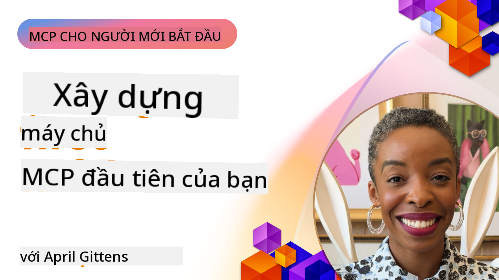

<!--
CO_OP_TRANSLATOR_METADATA:
{
  "original_hash": "1197b6dbde36773e04a5ae826557fdb9",
  "translation_date": "2025-08-26T18:01:29+00:00",
  "source_file": "03-GettingStarted/README.md",
  "language_code": "vi"
}
-->
## Bắt đầu  

_(Nhấp vào hình ảnh trên để xem video của bài học này)_

Phần này bao gồm một số bài học:

- **1 Máy chủ đầu tiên của bạn**, trong bài học đầu tiên này, bạn sẽ học cách tạo máy chủ đầu tiên và kiểm tra nó bằng công cụ kiểm tra, một cách hữu ích để thử nghiệm và gỡ lỗi máy chủ của bạn, [đến bài học](01-first-server/README.md)

- **2 Client**, trong bài học này, bạn sẽ học cách viết một client có thể kết nối với máy chủ của bạn, [đến bài học](02-client/README.md)

- **3 Client với LLM**, một cách viết client tốt hơn là thêm LLM vào để nó có thể "đàm phán" với máy chủ của bạn về những việc cần làm, [đến bài học](03-llm-client/README.md)

- **4 Sử dụng chế độ GitHub Copilot Agent trong Visual Studio Code**. Tại đây, chúng ta sẽ xem cách chạy máy chủ MCP từ trong Visual Studio Code, [đến bài học](04-vscode/README.md)

- **5 Máy chủ Transport stdio** stdio transport là tiêu chuẩn được khuyến nghị cho giao tiếp giữa máy chủ và client MCP trong đặc tả hiện tại, cung cấp giao tiếp an toàn dựa trên quy trình con, [đến bài học](05-stdio-server/README.md)

- **6 HTTP Streaming với MCP (HTTP có thể truyền)**. Tìm hiểu về HTTP streaming hiện đại, thông báo tiến độ, và cách triển khai máy chủ và client MCP theo thời gian thực, có khả năng mở rộng bằng HTTP có thể truyền. [đến bài học](06-http-streaming/README.md)

- **7 Sử dụng AI Toolkit cho VSCode** để tiêu thụ và thử nghiệm các client và máy chủ MCP của bạn [đến bài học](07-aitk/README.md)

- **8 Kiểm tra**. Tại đây, chúng ta sẽ tập trung vào cách kiểm tra máy chủ và client của bạn theo nhiều cách khác nhau, [đến bài học](08-testing/README.md)

- **9 Triển khai**. Chương này sẽ xem xét các cách khác nhau để triển khai các giải pháp MCP của bạn, [đến bài học](09-deployment/README.md)

Giao thức Model Context Protocol (MCP) là một giao thức mở chuẩn hóa cách các ứng dụng cung cấp ngữ cảnh cho LLMs. Hãy nghĩ về MCP như một cổng USB-C dành cho các ứng dụng AI - nó cung cấp một cách chuẩn hóa để kết nối các mô hình AI với các nguồn dữ liệu và công cụ khác nhau.

## Mục tiêu học tập

Kết thúc bài học này, bạn sẽ có thể:

- Thiết lập môi trường phát triển cho MCP bằng C#, Java, Python, TypeScript, và JavaScript
- Xây dựng và triển khai các máy chủ MCP cơ bản với các tính năng tùy chỉnh (tài nguyên, lời nhắc, và công cụ)
- Tạo ứng dụng host kết nối với máy chủ MCP
- Kiểm tra và gỡ lỗi các triển khai MCP
- Hiểu các thách thức thiết lập phổ biến và cách giải quyết chúng
- Kết nối các triển khai MCP của bạn với các dịch vụ LLM phổ biến

## Thiết lập môi trường MCP của bạn

Trước khi bắt đầu làm việc với MCP, điều quan trọng là chuẩn bị môi trường phát triển và hiểu quy trình làm việc cơ bản. Phần này sẽ hướng dẫn bạn các bước thiết lập ban đầu để đảm bảo khởi đầu suôn sẻ với MCP.

### Yêu cầu trước

Trước khi bắt đầu phát triển MCP, hãy đảm bảo bạn có:

- **Môi trường phát triển**: Cho ngôn ngữ bạn chọn (C#, Java, Python, TypeScript, hoặc JavaScript)
- **IDE/Trình chỉnh sửa**: Visual Studio, Visual Studio Code, IntelliJ, Eclipse, PyCharm, hoặc bất kỳ trình chỉnh sửa mã hiện đại nào
- **Trình quản lý gói**: NuGet, Maven/Gradle, pip, hoặc npm/yarn
- **API Keys**: Cho bất kỳ dịch vụ AI nào bạn dự định sử dụng trong ứng dụng host của mình

### SDK chính thức

Trong các chương tiếp theo, bạn sẽ thấy các giải pháp được xây dựng bằng Python, TypeScript, Java và .NET. Dưới đây là tất cả các SDK được hỗ trợ chính thức.

MCP cung cấp các SDK chính thức cho nhiều ngôn ngữ:
- [C# SDK](https://github.com/modelcontextprotocol/csharp-sdk) - Được duy trì hợp tác với Microsoft
- [Java SDK](https://github.com/modelcontextprotocol/java-sdk) - Được duy trì hợp tác với Spring AI
- [TypeScript SDK](https://github.com/modelcontextprotocol/typescript-sdk) - Triển khai TypeScript chính thức
- [Python SDK](https://github.com/modelcontextprotocol/python-sdk) - Triển khai Python chính thức
- [Kotlin SDK](https://github.com/modelcontextprotocol/kotlin-sdk) - Triển khai Kotlin chính thức
- [Swift SDK](https://github.com/modelcontextprotocol/swift-sdk) - Được duy trì hợp tác với Loopwork AI
- [Rust SDK](https://github.com/modelcontextprotocol/rust-sdk) - Triển khai Rust chính thức

## Những điểm chính

- Thiết lập môi trường phát triển MCP rất đơn giản với các SDK theo ngôn ngữ
- Xây dựng máy chủ MCP bao gồm việc tạo và đăng ký các công cụ với các schema rõ ràng
- Các client MCP kết nối với máy chủ và mô hình để tận dụng các khả năng mở rộng
- Kiểm tra và gỡ lỗi là rất quan trọng để triển khai MCP đáng tin cậy
- Các tùy chọn triển khai từ phát triển cục bộ đến các giải pháp dựa trên đám mây

## Thực hành

Chúng tôi có một bộ mẫu bổ sung cho các bài tập bạn sẽ thấy trong tất cả các chương của phần này. Ngoài ra, mỗi chương cũng có các bài tập và nhiệm vụ riêng.

- [Java Calculator](./samples/java/calculator/README.md)
- [.Net Calculator](../../../03-GettingStarted/samples/csharp)
- [JavaScript Calculator](./samples/javascript/README.md)
- [TypeScript Calculator](./samples/typescript/README.md)
- [Python Calculator](../../../03-GettingStarted/samples/python)

## Tài nguyên bổ sung

- [Xây dựng Agents sử dụng Model Context Protocol trên Azure](https://learn.microsoft.com/azure/developer/ai/intro-agents-mcp)
- [MCP từ xa với Azure Container Apps (Node.js/TypeScript/JavaScript)](https://learn.microsoft.com/samples/azure-samples/mcp-container-ts/mcp-container-ts/)
- [.NET OpenAI MCP Agent](https://learn.microsoft.com/samples/azure-samples/openai-mcp-agent-dotnet/openai-mcp-agent-dotnet/)

## Tiếp theo

Tiếp theo: [Tạo máy chủ MCP đầu tiên của bạn](01-first-server/README.md)

---

**Tuyên bố miễn trừ trách nhiệm**:  
Tài liệu này đã được dịch bằng dịch vụ dịch thuật AI [Co-op Translator](https://github.com/Azure/co-op-translator). Mặc dù chúng tôi cố gắng đảm bảo độ chính xác, xin lưu ý rằng các bản dịch tự động có thể chứa lỗi hoặc không chính xác. Tài liệu gốc bằng ngôn ngữ bản địa nên được coi là nguồn thông tin chính thức. Đối với các thông tin quan trọng, khuyến nghị sử dụng dịch vụ dịch thuật chuyên nghiệp bởi con người. Chúng tôi không chịu trách nhiệm cho bất kỳ sự hiểu lầm hoặc diễn giải sai nào phát sinh từ việc sử dụng bản dịch này.