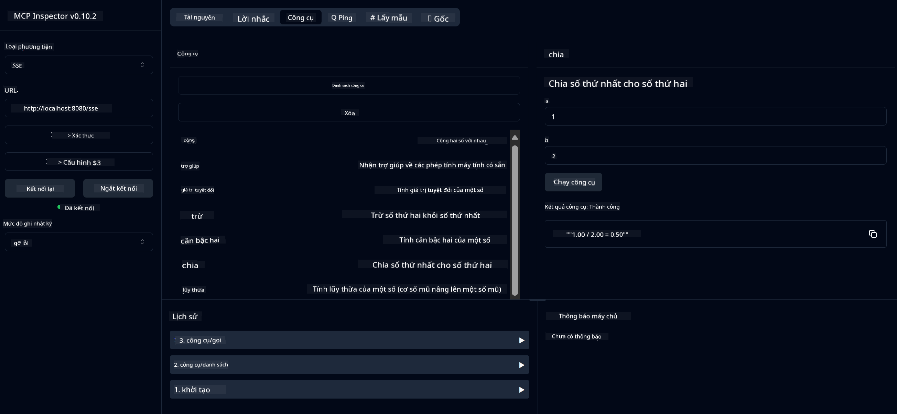

<!--
CO_OP_TRANSLATOR_METADATA:
{
  "original_hash": "13231e9951b68efd9df8c56bd5cdb27e",
  "translation_date": "2025-07-13T22:29:02+00:00",
  "source_file": "03-GettingStarted/samples/java/calculator/README.md",
  "language_code": "vi"
}
-->
# Basic Calculator MCP Service

Dịch vụ này cung cấp các phép toán cơ bản của máy tính thông qua Model Context Protocol (MCP) sử dụng Spring Boot với giao thức WebFlux. Nó được thiết kế như một ví dụ đơn giản dành cho người mới bắt đầu tìm hiểu về triển khai MCP.

Để biết thêm thông tin, xem tài liệu tham khảo [MCP Server Boot Starter](https://docs.spring.io/spring-ai/reference/api/mcp/mcp-server-boot-starter-docs.html).

## Tổng quan

Dịch vụ trình bày:
- Hỗ trợ SSE (Server-Sent Events)
- Tự động đăng ký công cụ bằng annotation `@Tool` của Spring AI
- Các chức năng máy tính cơ bản:
  - Cộng, trừ, nhân, chia
  - Tính lũy thừa và căn bậc hai
  - Phép lấy phần dư (modulus) và giá trị tuyệt đối
  - Hàm trợ giúp mô tả các phép toán

## Tính năng

Dịch vụ máy tính này cung cấp các khả năng sau:

1. **Phép toán số học cơ bản**:
   - Cộng hai số
   - Trừ số thứ hai khỏi số thứ nhất
   - Nhân hai số
   - Chia số thứ nhất cho số thứ hai (kiểm tra chia cho 0)

2. **Phép toán nâng cao**:
   - Tính lũy thừa (cơ số mũ số mũ)
   - Tính căn bậc hai (kiểm tra số âm)
   - Tính phần dư (modulus)
   - Tính giá trị tuyệt đối

3. **Hệ thống trợ giúp**:
   - Hàm trợ giúp tích hợp giải thích tất cả các phép toán có sẵn

## Sử dụng dịch vụ

Dịch vụ cung cấp các API endpoint sau thông qua giao thức MCP:

- `add(a, b)`: Cộng hai số
- `subtract(a, b)`: Trừ số thứ hai khỏi số thứ nhất
- `multiply(a, b)`: Nhân hai số
- `divide(a, b)`: Chia số thứ nhất cho số thứ hai (kiểm tra chia cho 0)
- `power(base, exponent)`: Tính lũy thừa
- `squareRoot(number)`: Tính căn bậc hai (kiểm tra số âm)
- `modulus(a, b)`: Tính phần dư khi chia
- `absolute(number)`: Tính giá trị tuyệt đối
- `help()`: Lấy thông tin về các phép toán có sẵn

## Client kiểm thử

Một client kiểm thử đơn giản được bao gồm trong package `com.microsoft.mcp.sample.client`. Lớp `SampleCalculatorClient` minh họa các phép toán có sẵn của dịch vụ máy tính.

## Sử dụng LangChain4j Client

Dự án bao gồm một client ví dụ LangChain4j trong `com.microsoft.mcp.sample.client.LangChain4jClient` minh họa cách tích hợp dịch vụ máy tính với LangChain4j và các mô hình GitHub:

### Yêu cầu trước

1. **Cài đặt GitHub Token**:
   
   Để sử dụng các mô hình AI của GitHub (như phi-4), bạn cần một token truy cập cá nhân GitHub:

   a. Truy cập cài đặt tài khoản GitHub của bạn: https://github.com/settings/tokens
   
   b. Nhấn "Generate new token" → "Generate new token (classic)"
   
   c. Đặt tên mô tả cho token của bạn
   
   d. Chọn các phạm vi sau:
      - `repo` (Toàn quyền với kho riêng tư)
      - `read:org` (Đọc thông tin tổ chức và thành viên nhóm, đọc dự án tổ chức)
      - `gist` (Tạo gist)
      - `user:email` (Truy cập địa chỉ email người dùng (chỉ đọc))
   
   e. Nhấn "Generate token" và sao chép token mới
   
   f. Thiết lập biến môi trường:
      
      Trên Windows:
      ```
      set GITHUB_TOKEN=your-github-token
      ```
      
      Trên macOS/Linux:
      ```bash
      export GITHUB_TOKEN=your-github-token
      ```

   g. Để thiết lập lâu dài, thêm biến môi trường này qua cài đặt hệ thống

2. Thêm dependency LangChain4j GitHub vào dự án của bạn (đã có trong pom.xml):
   ```xml
   <dependency>
       <groupId>dev.langchain4j</groupId>
       <artifactId>langchain4j-github</artifactId>
       <version>${langchain4j.version}</version>
   </dependency>
   ```

3. Đảm bảo server máy tính đang chạy trên `localhost:8080`

### Chạy LangChain4j Client

Ví dụ này minh họa:
- Kết nối tới server MCP máy tính qua giao thức SSE
- Sử dụng LangChain4j để tạo chatbot tận dụng các phép toán máy tính
- Tích hợp với các mô hình AI GitHub (hiện sử dụng mô hình phi-4)

Client gửi các truy vấn mẫu sau để minh họa chức năng:
1. Tính tổng hai số
2. Tính căn bậc hai của một số
3. Lấy thông tin trợ giúp về các phép toán máy tính có sẵn

Chạy ví dụ và kiểm tra đầu ra trên console để xem cách mô hình AI sử dụng các công cụ máy tính trả lời truy vấn.

### Cấu hình mô hình GitHub

Client LangChain4j được cấu hình sử dụng mô hình phi-4 của GitHub với các thiết lập sau:

```java
ChatLanguageModel model = GitHubChatModel.builder()
    .apiKey(System.getenv("GITHUB_TOKEN"))
    .timeout(Duration.ofSeconds(60))
    .modelName("phi-4")
    .logRequests(true)
    .logResponses(true)
    .build();
```

Để sử dụng các mô hình GitHub khác, chỉ cần thay đổi tham số `modelName` sang mô hình được hỗ trợ khác (ví dụ: "claude-3-haiku-20240307", "llama-3-70b-8192", v.v.).

## Các phụ thuộc

Dự án yêu cầu các phụ thuộc chính sau:

```xml
<!-- For MCP Server -->
<dependency>
    <groupId>org.springframework.ai</groupId>
    <artifactId>spring-ai-starter-mcp-server-webflux</artifactId>
</dependency>

<!-- For LangChain4j integration -->
<dependency>
    <groupId>dev.langchain4j</groupId>
    <artifactId>langchain4j-mcp</artifactId>
    <version>${langchain4j.version}</version>
</dependency>

<!-- For GitHub models support -->
<dependency>
    <groupId>dev.langchain4j</groupId>
    <artifactId>langchain4j-github</artifactId>
    <version>${langchain4j.version}</version>
</dependency>
```

## Xây dựng dự án

Xây dựng dự án bằng Maven:
```bash
./mvnw clean install -DskipTests
```

## Chạy server

### Sử dụng Java

```bash
java -jar target/calculator-server-0.0.1-SNAPSHOT.jar
```

### Sử dụng MCP Inspector

MCP Inspector là công cụ hữu ích để tương tác với các dịch vụ MCP. Để sử dụng với dịch vụ máy tính này:

1. **Cài đặt và chạy MCP Inspector** trong cửa sổ terminal mới:
   ```bash
   npx @modelcontextprotocol/inspector
   ```

2. **Truy cập giao diện web** bằng cách nhấp vào URL hiển thị bởi ứng dụng (thường là http://localhost:6274)

3. **Cấu hình kết nối**:
   - Chọn loại giao thức là "SSE"
   - Đặt URL tới endpoint SSE của server đang chạy: `http://localhost:8080/sse`
   - Nhấn "Connect"

4. **Sử dụng các công cụ**:
   - Nhấn "List Tools" để xem các phép toán máy tính có sẵn
   - Chọn một công cụ và nhấn "Run Tool" để thực thi phép toán



### Sử dụng Docker

Dự án bao gồm Dockerfile để triển khai dưới dạng container:

1. **Xây dựng image Docker**:
   ```bash
   docker build -t calculator-mcp-service .
   ```

2. **Chạy container Docker**:
   ```bash
   docker run -p 8080:8080 calculator-mcp-service
   ```

Điều này sẽ:
- Xây dựng image Docker đa giai đoạn với Maven 3.9.9 và Eclipse Temurin 24 JDK
- Tạo image container tối ưu
- Mở cổng dịch vụ trên 8080
- Khởi động dịch vụ MCP máy tính bên trong container

Bạn có thể truy cập dịch vụ tại `http://localhost:8080` khi container đang chạy.

## Khắc phục sự cố

### Các vấn đề thường gặp với GitHub Token

1. **Lỗi quyền token**: Nếu nhận lỗi 403 Forbidden, kiểm tra token của bạn có đủ quyền như yêu cầu trong phần yêu cầu trước.

2. **Không tìm thấy token**: Nếu nhận lỗi "No API key found", đảm bảo biến môi trường GITHUB_TOKEN đã được thiết lập đúng.

3. **Giới hạn tần suất**: GitHub API có giới hạn tần suất. Nếu gặp lỗi giới hạn (mã trạng thái 429), hãy chờ vài phút rồi thử lại.

4. **Token hết hạn**: Token GitHub có thể hết hạn. Nếu gặp lỗi xác thực sau một thời gian, tạo token mới và cập nhật biến môi trường.

Nếu cần hỗ trợ thêm, xem tài liệu [LangChain4j documentation](https://github.com/langchain4j/langchain4j) hoặc [GitHub API documentation](https://docs.github.com/en/rest).

**Tuyên bố từ chối trách nhiệm**:  
Tài liệu này đã được dịch bằng dịch vụ dịch thuật AI [Co-op Translator](https://github.com/Azure/co-op-translator). Mặc dù chúng tôi cố gắng đảm bảo độ chính xác, xin lưu ý rằng bản dịch tự động có thể chứa lỗi hoặc không chính xác. Tài liệu gốc bằng ngôn ngữ gốc của nó nên được coi là nguồn chính xác và đáng tin cậy. Đối với các thông tin quan trọng, nên sử dụng dịch vụ dịch thuật chuyên nghiệp do con người thực hiện. Chúng tôi không chịu trách nhiệm về bất kỳ sự hiểu lầm hoặc giải thích sai nào phát sinh từ việc sử dụng bản dịch này.