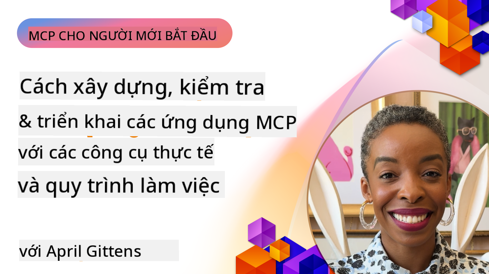

<!--
CO_OP_TRANSLATOR_METADATA:
{
  "original_hash": "83efa75a69bc831277263a6f1ae53669",
  "translation_date": "2025-08-18T17:09:34+00:00",
  "source_file": "04-PracticalImplementation/README.md",
  "language_code": "vi"
}
-->
# Triển khai Thực tiễn

[](https://youtu.be/vCN9-mKBDfQ)

_(Nhấp vào hình ảnh trên để xem video của bài học này)_

Triển khai thực tiễn là nơi sức mạnh của Model Context Protocol (MCP) trở nên rõ ràng. Trong khi việc hiểu lý thuyết và kiến trúc đằng sau MCP rất quan trọng, giá trị thực sự xuất hiện khi bạn áp dụng các khái niệm này để xây dựng, kiểm thử và triển khai các giải pháp giải quyết các vấn đề thực tế. Chương này kết nối khoảng cách giữa kiến thức lý thuyết và phát triển thực hành, hướng dẫn bạn qua quá trình đưa các ứng dụng dựa trên MCP vào thực tế.

Dù bạn đang phát triển các trợ lý thông minh, tích hợp AI vào quy trình kinh doanh, hay xây dựng các công cụ tùy chỉnh để xử lý dữ liệu, MCP cung cấp một nền tảng linh hoạt. Thiết kế không phụ thuộc ngôn ngữ và các SDK chính thức cho các ngôn ngữ lập trình phổ biến giúp MCP dễ tiếp cận với nhiều nhà phát triển. Bằng cách tận dụng các SDK này, bạn có thể nhanh chóng tạo mẫu, lặp lại và mở rộng các giải pháp của mình trên các nền tảng và môi trường khác nhau.

Trong các phần tiếp theo, bạn sẽ tìm thấy các ví dụ thực tiễn, mã mẫu và chiến lược triển khai minh họa cách triển khai MCP bằng C#, Java với Spring, TypeScript, JavaScript và Python. Bạn cũng sẽ học cách gỡ lỗi và kiểm thử các máy chủ MCP, quản lý API và triển khai các giải pháp lên đám mây bằng Azure. Các tài nguyên thực hành này được thiết kế để tăng tốc quá trình học tập của bạn và giúp bạn tự tin xây dựng các ứng dụng MCP mạnh mẽ, sẵn sàng cho sản xuất.

## Tổng quan

Bài học này tập trung vào các khía cạnh thực tiễn của việc triển khai MCP trên nhiều ngôn ngữ lập trình. Chúng ta sẽ khám phá cách sử dụng các SDK MCP trong C#, Java với Spring, TypeScript, JavaScript và Python để xây dựng các ứng dụng mạnh mẽ, gỡ lỗi và kiểm thử các máy chủ MCP, và tạo các tài nguyên, lời nhắc và công cụ có thể tái sử dụng.

## Mục tiêu học tập

Kết thúc bài học này, bạn sẽ có thể:

- Triển khai các giải pháp MCP bằng các SDK chính thức trên nhiều ngôn ngữ lập trình
- Gỡ lỗi và kiểm thử các máy chủ MCP một cách có hệ thống
- Tạo và sử dụng các tính năng máy chủ (Tài nguyên, Lời nhắc và Công cụ)
- Thiết kế các quy trình MCP hiệu quả cho các nhiệm vụ phức tạp
- Tối ưu hóa triển khai MCP để đạt hiệu suất và độ tin cậy cao

## Tài nguyên SDK chính thức

Model Context Protocol cung cấp các SDK chính thức cho nhiều ngôn ngữ:

- [C# SDK](https://github.com/modelcontextprotocol/csharp-sdk)
- [Java với Spring SDK](https://github.com/modelcontextprotocol/java-sdk) **Lưu ý:** yêu cầu phụ thuộc vào [Project Reactor](https://projectreactor.io). (Xem [thảo luận vấn đề 246](https://github.com/orgs/modelcontextprotocol/discussions/246).)
- [TypeScript SDK](https://github.com/modelcontextprotocol/typescript-sdk)
- [Python SDK](https://github.com/modelcontextprotocol/python-sdk)
- [Kotlin SDK](https://github.com/modelcontextprotocol/kotlin-sdk)

## Làm việc với các SDK MCP

Phần này cung cấp các ví dụ thực tiễn về việc triển khai MCP trên nhiều ngôn ngữ lập trình. Bạn có thể tìm thấy mã mẫu trong thư mục `samples` được tổ chức theo ngôn ngữ.

### Các mẫu có sẵn

Kho lưu trữ bao gồm [các triển khai mẫu](../../../04-PracticalImplementation/samples) bằng các ngôn ngữ sau:

- [C#](./samples/csharp/README.md)
- [Java với Spring](./samples/java/containerapp/README.md)
- [TypeScript](./samples/typescript/README.md)
- [JavaScript](./samples/javascript/README.md)
- [Python](./samples/python/README.md)

Mỗi mẫu minh họa các khái niệm chính và các mẫu triển khai MCP cho ngôn ngữ và hệ sinh thái cụ thể đó.

## Các tính năng chính của máy chủ

Các máy chủ MCP có thể triển khai bất kỳ sự kết hợp nào của các tính năng sau:

### Tài nguyên

Tài nguyên cung cấp ngữ cảnh và dữ liệu cho người dùng hoặc mô hình AI sử dụng:

- Kho tài liệu
- Cơ sở tri thức
- Nguồn dữ liệu có cấu trúc
- Hệ thống tệp

### Lời nhắc

Lời nhắc là các thông điệp và quy trình làm việc được định dạng sẵn cho người dùng:

- Mẫu hội thoại được định nghĩa trước
- Các mẫu tương tác có hướng dẫn
- Cấu trúc đối thoại chuyên biệt

### Công cụ

Công cụ là các chức năng để mô hình AI thực thi:

- Tiện ích xử lý dữ liệu
- Tích hợp API bên ngoài
- Khả năng tính toán
- Chức năng tìm kiếm

## Triển khai mẫu: Triển khai C#

Kho lưu trữ SDK C# chính thức chứa một số triển khai mẫu minh họa các khía cạnh khác nhau của MCP:

- **MCP Client cơ bản**: Ví dụ đơn giản minh họa cách tạo một MCP client và gọi các công cụ
- **MCP Server cơ bản**: Triển khai máy chủ tối thiểu với đăng ký công cụ cơ bản
- **MCP Server nâng cao**: Máy chủ đầy đủ tính năng với đăng ký công cụ, xác thực và xử lý lỗi
- **Tích hợp ASP.NET**: Các ví dụ minh họa tích hợp với ASP.NET Core
- **Mẫu triển khai công cụ**: Các mẫu khác nhau để triển khai công cụ với các mức độ phức tạp khác nhau

SDK C# MCP đang ở giai đoạn xem trước và các API có thể thay đổi. Chúng tôi sẽ liên tục cập nhật blog này khi SDK phát triển.

### Các tính năng chính

- [C# MCP Nuget ModelContextProtocol](https://www.nuget.org/packages/ModelContextProtocol)
- Xây dựng [máy chủ MCP đầu tiên của bạn](https://devblogs.microsoft.com/dotnet/build-a-model-context-protocol-mcp-server-in-csharp/).

Để xem các mẫu triển khai C# đầy đủ, hãy truy cập [kho lưu trữ mẫu SDK C# chính thức](https://github.com/modelcontextprotocol/csharp-sdk)

## Triển khai mẫu: Triển khai Java với Spring

SDK Java với Spring cung cấp các tùy chọn triển khai MCP mạnh mẽ với các tính năng cấp doanh nghiệp.

### Các tính năng chính

- Tích hợp Spring Framework
- An toàn kiểu mạnh
- Hỗ trợ lập trình phản ứng
- Xử lý lỗi toàn diện

Để xem mẫu triển khai Java với Spring đầy đủ, hãy xem [mẫu Java với Spring](samples/java/containerapp/README.md) trong thư mục mẫu.

## Triển khai mẫu: Triển khai JavaScript

SDK JavaScript cung cấp một cách tiếp cận nhẹ và linh hoạt để triển khai MCP.

### Các tính năng chính

- Hỗ trợ Node.js và trình duyệt
- API dựa trên Promise
- Dễ dàng tích hợp với Express và các framework khác
- Hỗ trợ WebSocket để streaming

Để xem mẫu triển khai JavaScript đầy đủ, hãy xem [mẫu JavaScript](samples/javascript/README.md) trong thư mục mẫu.

## Triển khai mẫu: Triển khai Python

SDK Python cung cấp một cách tiếp cận Pythonic để triển khai MCP với tích hợp tuyệt vời với các framework ML.

### Các tính năng chính

- Hỗ trợ Async/await với asyncio
- Tích hợp FastAPI
- Đăng ký công cụ đơn giản
- Tích hợp gốc với các thư viện ML phổ biến

Để xem mẫu triển khai Python đầy đủ, hãy xem [mẫu Python](samples/python/README.md) trong thư mục mẫu.

## Quản lý API

Azure API Management là một giải pháp tuyệt vời để bảo mật các máy chủ MCP. Ý tưởng là đặt một Azure API Management instance trước máy chủ MCP của bạn và để nó xử lý các tính năng mà bạn có thể cần như:

- giới hạn tốc độ
- quản lý token
- giám sát
- cân bằng tải
- bảo mật

### Mẫu Azure

Dưới đây là một mẫu Azure thực hiện chính xác điều đó, tức là [tạo một máy chủ MCP và bảo mật nó bằng Azure API Management](https://github.com/Azure-Samples/remote-mcp-apim-functions-python).

Xem cách luồng ủy quyền diễn ra trong hình dưới đây:


Trong hình trên, các bước sau diễn ra:

- Xác thực/Ủy quyền được thực hiện bằng Microsoft Entra.
- Azure API Management hoạt động như một cổng và sử dụng các chính sách để định hướng và quản lý lưu lượng.
- Azure Monitor ghi lại tất cả các yêu cầu để phân tích thêm.

#### Luồng ủy quyền

Hãy xem chi tiết luồng ủy quyền:


#### Đặc tả ủy quyền MCP

Tìm hiểu thêm về [đặc tả ủy quyền MCP](https://modelcontextprotocol.io/specification/2025-03-26/basic/authorization#2-10-third-party-authorization-flow)

## Triển khai Máy chủ MCP Từ xa lên Azure

Hãy xem liệu chúng ta có thể triển khai mẫu đã đề cập trước đó không:

1. Clone repo

    ```bash
    git clone https://github.com/Azure-Samples/remote-mcp-apim-functions-python.git
    cd remote-mcp-apim-functions-python
    ```

1. Đăng ký `Microsoft.App` resource provider.

   - Nếu bạn sử dụng Azure CLI, chạy `az provider register --namespace Microsoft.App --wait`.
   - Nếu bạn sử dụng Azure PowerShell, chạy `Register-AzResourceProvider -ProviderNamespace Microsoft.App`. Sau đó chạy `(Get-AzResourceProvider -ProviderNamespace Microsoft.App).RegistrationState` sau một thời gian để kiểm tra xem việc đăng ký đã hoàn tất chưa.

1. Chạy lệnh [azd](https://aka.ms/azd) này để cung cấp dịch vụ quản lý API, ứng dụng chức năng (với mã) và tất cả các tài nguyên Azure cần thiết khác

    ```shell
    azd up
    ```

    Lệnh này sẽ triển khai tất cả các tài nguyên đám mây trên Azure

### Kiểm thử máy chủ của bạn với MCP Inspector

1. Trong **cửa sổ terminal mới**, cài đặt và chạy MCP Inspector

    ```shell
    npx @modelcontextprotocol/inspector
    ```

    Bạn sẽ thấy một giao diện tương tự như:

    

1. CTRL nhấp để tải ứng dụng web MCP Inspector từ URL được hiển thị bởi ứng dụng (ví dụ: [http://127.0.0.1:6274/#resources](http://127.0.0.1:6274/#resources))
1. Đặt loại transport thành `SSE`
1. Đặt URL thành endpoint SSE API Management đang chạy của bạn được hiển thị sau `azd up` và **Connect**:

    ```shell
    https://<apim-servicename-from-azd-output>.azure-api.net/mcp/sse
    ```

1. **List Tools**. Nhấp vào một công cụ và **Run Tool**.  

Nếu tất cả các bước đã hoạt động, bạn bây giờ đã kết nối với máy chủ MCP và có thể gọi một công cụ.

## Máy chủ MCP cho Azure

[Remote-mcp-functions](https://github.com/Azure-Samples/remote-mcp-functions-dotnet): Bộ kho lưu trữ này là mẫu khởi động nhanh để xây dựng và triển khai các máy chủ MCP (Model Context Protocol) từ xa tùy chỉnh bằng Azure Functions với Python, C# .NET hoặc Node/TypeScript.

Các mẫu cung cấp một giải pháp hoàn chỉnh cho phép các nhà phát triển:

- Xây dựng và chạy cục bộ: Phát triển và gỡ lỗi một máy chủ MCP trên máy cục bộ
- Triển khai lên Azure: Dễ dàng triển khai lên đám mây với lệnh azd up đơn giản
- Kết nối từ các client: Kết nối với máy chủ MCP từ các client khác nhau bao gồm chế độ agent của VS Code's Copilot và công cụ MCP Inspector

### Các tính năng chính

- Bảo mật theo thiết kế: Máy chủ MCP được bảo mật bằng khóa và HTTPS
- Tùy chọn xác thực: Hỗ trợ OAuth bằng xác thực tích hợp và/hoặc Quản lý API
- Cách ly mạng: Cho phép cách ly mạng bằng Azure Virtual Networks (VNET)
- Kiến trúc không máy chủ: Tận dụng Azure Functions để thực thi có thể mở rộng, dựa trên sự kiện
- Phát triển cục bộ: Hỗ trợ phát triển và gỡ lỗi cục bộ toàn diện
- Triển khai đơn giản: Quy trình triển khai hợp lý lên Azure

Kho lưu trữ bao gồm tất cả các tệp cấu hình cần thiết, mã nguồn và định nghĩa hạ tầng để nhanh chóng bắt đầu với triển khai máy chủ MCP sẵn sàng cho sản xuất.

- [Azure Remote MCP Functions Python](https://github.com/Azure-Samples/remote-mcp-functions-python) - Triển khai mẫu MCP bằng Azure Functions với Python

- [Azure Remote MCP Functions .NET](https://github.com/Azure-Samples/remote-mcp-functions-dotnet) - Triển khai mẫu MCP bằng Azure Functions với C# .NET

- [Azure Remote MCP Functions Node/Typescript](https://github.com/Azure-Samples/remote-mcp-functions-typescript) - Triển khai mẫu MCP bằng Azure Functions với Node/TypeScript.

## Những điểm chính

- Các SDK MCP cung cấp các công cụ cụ thể cho từng ngôn ngữ để triển khai các giải pháp MCP mạnh mẽ
- Quá trình gỡ lỗi và kiểm thử rất quan trọng để đảm bảo các ứng dụng MCP đáng tin cậy
- Các mẫu lời nhắc có thể tái sử dụng cho phép tương tác AI nhất quán
- Các quy trình làm việc được thiết kế tốt có thể điều phối các nhiệm vụ phức tạp bằng cách sử dụng nhiều công cụ
- Triển khai các giải pháp MCP đòi hỏi phải xem xét các yếu tố bảo mật, hiệu suất và xử lý lỗi

## Bài tập

Thiết kế một quy trình MCP thực tiễn giải quyết một vấn đề thực tế trong lĩnh vực của bạn:

1. Xác định 3-4 công cụ hữu ích để giải quyết vấn đề này
2. Tạo một sơ đồ quy trình làm việc hiển thị cách các công cụ này tương tác
3. Triển khai một phiên bản cơ bản của một trong các công cụ bằng ngôn ngữ bạn chọn
4. Tạo một mẫu lời nhắc giúp mô hình sử dụng hiệu quả công cụ của bạn

## Tài nguyên bổ sung

---

Tiếp theo: [Chủ đề nâng cao](../05-AdvancedTopics/README.md)

**Tuyên bố miễn trừ trách nhiệm**:  
Tài liệu này đã được dịch bằng dịch vụ dịch thuật AI [Co-op Translator](https://github.com/Azure/co-op-translator). Mặc dù chúng tôi cố gắng đảm bảo độ chính xác, xin lưu ý rằng các bản dịch tự động có thể chứa lỗi hoặc không chính xác. Tài liệu gốc bằng ngôn ngữ bản địa nên được coi là nguồn tham khảo chính thức. Đối với các thông tin quan trọng, chúng tôi khuyến nghị sử dụng dịch vụ dịch thuật chuyên nghiệp từ con người. Chúng tôi không chịu trách nhiệm cho bất kỳ sự hiểu lầm hoặc diễn giải sai nào phát sinh từ việc sử dụng bản dịch này.