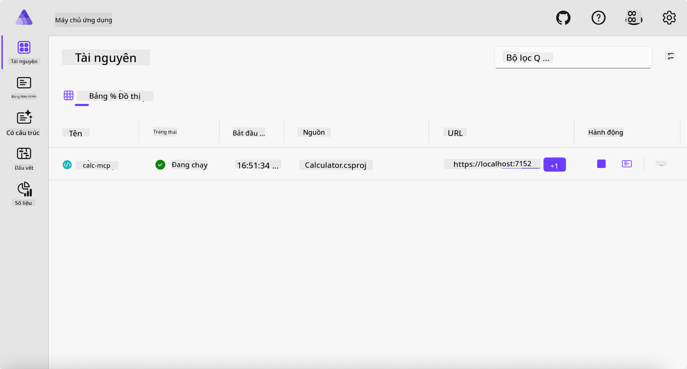
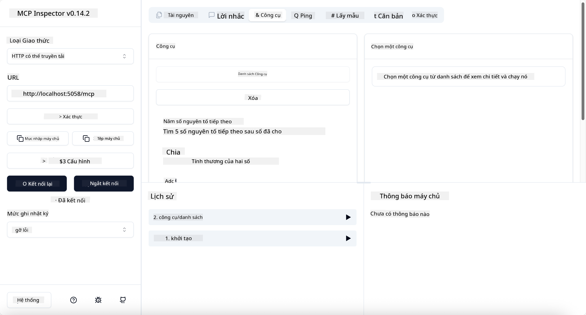
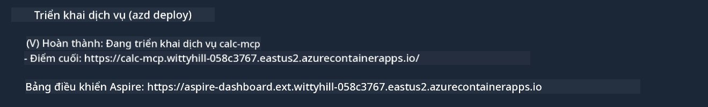

<!--
CO_OP_TRANSLATOR_METADATA:
{
  "original_hash": "0bc7bd48f55f1565f1d95ccb2c16f728",
  "translation_date": "2025-07-13T23:08:20+00:00",
  "source_file": "04-PracticalImplementation/samples/csharp/README.md",
  "language_code": "vi"
}
-->
# Mẫu

Ví dụ trước cho thấy cách sử dụng một dự án .NET cục bộ với loại `stdio`. Và cách chạy server cục bộ trong một container. Đây là một giải pháp tốt trong nhiều tình huống. Tuy nhiên, việc có server chạy từ xa, như trong môi trường đám mây, cũng rất hữu ích. Đây là lúc loại `http` phát huy tác dụng.

Nhìn vào giải pháp trong thư mục `04-PracticalImplementation`, nó có vẻ phức tạp hơn nhiều so với ví dụ trước. Nhưng thực tế thì không phải vậy. Nếu bạn nhìn kỹ vào dự án `src/Calculator`, bạn sẽ thấy nó hầu như là cùng một đoạn mã như ví dụ trước. Điểm khác duy nhất là chúng ta sử dụng thư viện khác `ModelContextProtocol.AspNetCore` để xử lý các yêu cầu HTTP. Và chúng ta thay đổi phương thức `IsPrime` thành private, chỉ để minh họa rằng bạn có thể có các phương thức private trong mã của mình. Phần còn lại của mã vẫn giữ nguyên như trước.

Các dự án khác đến từ [.NET Aspire](https://learn.microsoft.com/dotnet/aspire/get-started/aspire-overview). Việc có .NET Aspire trong giải pháp sẽ cải thiện trải nghiệm của nhà phát triển khi phát triển và kiểm thử, đồng thời hỗ trợ quan sát hệ thống. Nó không bắt buộc để chạy server, nhưng là một thói quen tốt khi có nó trong giải pháp của bạn.

## Khởi động server cục bộ

1. Từ VS Code (với extension C# DevKit), điều hướng đến thư mục `04-PracticalImplementation/samples/csharp`.
1. Thực thi lệnh sau để khởi động server:

   ```bash
    dotnet watch run --project ./src/AppHost
   ```

1. Khi trình duyệt web mở bảng điều khiển .NET Aspire, chú ý URL `http`. Nó sẽ có dạng như `http://localhost:5058/`.

   

## Kiểm thử Streamable HTTP với MCP Inspector

Nếu bạn có Node.js phiên bản 22.7.5 trở lên, bạn có thể dùng MCP Inspector để kiểm thử server của mình.

Khởi động server và chạy lệnh sau trong terminal:

```bash
npx @modelcontextprotocol/inspector http://localhost:5058
```



- Chọn `Streamable HTTP` làm loại Transport.
- Trong trường Url, nhập URL của server đã ghi chú trước đó, và thêm `/mcp` vào cuối. Nó phải là `http` (không phải `https`), ví dụ như `http://localhost:5058/mcp`.
- Chọn nút Connect.

Điều hay của Inspector là nó cung cấp cái nhìn rõ ràng về những gì đang diễn ra.

- Thử liệt kê các công cụ có sẵn
- Thử một vài công cụ, nó sẽ hoạt động giống như trước.

## Kiểm thử MCP Server với GitHub Copilot Chat trong VS Code

Để sử dụng transport Streamable HTTP với GitHub Copilot Chat, thay đổi cấu hình của server `calc-mcp` đã tạo trước đó thành như sau:

```jsonc
// .vscode/mcp.json
{
  "servers": {
    "calc-mcp": {
      "type": "http",
      "url": "http://localhost:5058/mcp"
    }
  }
}
```

Thực hiện một số kiểm thử:

- Hỏi "3 số nguyên tố sau 6780". Chú ý Copilot sẽ sử dụng công cụ mới `NextFivePrimeNumbers` và chỉ trả về 3 số nguyên tố đầu tiên.
- Hỏi "7 số nguyên tố sau 111", để xem kết quả.
- Hỏi "John có 24 viên kẹo và muốn chia đều cho 3 đứa con. Mỗi đứa được bao nhiêu viên?", để xem kết quả.

## Triển khai server lên Azure

Hãy triển khai server lên Azure để nhiều người có thể sử dụng hơn.

Từ terminal, điều hướng đến thư mục `04-PracticalImplementation/samples/csharp` và chạy lệnh sau:

```bash
azd up
```

Khi quá trình triển khai kết thúc, bạn sẽ thấy thông báo như sau:



Lấy URL và sử dụng nó trong MCP Inspector và GitHub Copilot Chat.

```jsonc
// .vscode/mcp.json
{
  "servers": {
    "calc-mcp": {
      "type": "http",
      "url": "https://calc-mcp.gentleriver-3977fbcf.australiaeast.azurecontainerapps.io/mcp"
    }
  }
}
```

## Tiếp theo là gì?

Chúng ta đã thử các loại transport khác nhau và các công cụ kiểm thử. Chúng ta cũng đã triển khai server MCP lên Azure. Nhưng nếu server của chúng ta cần truy cập vào các tài nguyên riêng tư thì sao? Ví dụ như cơ sở dữ liệu hoặc API riêng? Trong chương tiếp theo, chúng ta sẽ tìm hiểu cách cải thiện bảo mật cho server của mình.

**Tuyên bố từ chối trách nhiệm**:  
Tài liệu này đã được dịch bằng dịch vụ dịch thuật AI [Co-op Translator](https://github.com/Azure/co-op-translator). Mặc dù chúng tôi cố gắng đảm bảo độ chính xác, xin lưu ý rằng bản dịch tự động có thể chứa lỗi hoặc không chính xác. Tài liệu gốc bằng ngôn ngữ gốc của nó nên được coi là nguồn chính xác và đáng tin cậy. Đối với các thông tin quan trọng, nên sử dụng dịch vụ dịch thuật chuyên nghiệp do con người thực hiện. Chúng tôi không chịu trách nhiệm về bất kỳ sự hiểu lầm hoặc giải thích sai nào phát sinh từ việc sử dụng bản dịch này.